PS8: Tree-based method and support vector machines
================
Ningyin Xu
3/1/2017

-   [Part 1: Joe Biden](#part-1-joe-biden)
    -   [Problem 1. Split the data](#problem-1.-split-the-data)
    -   [Problem 2. Decision tree (no controls)](#problem-2.-decision-tree-no-controls)
    -   [Problem 3. Decision tree (CV)](#problem-3.-decision-tree-cv)
    -   [Problem 4. Bagging](#problem-4.-bagging)
    -   [Problem 5. Random Forest](#problem-5.-random-forest)
    -   [Problem 6. Boosting](#problem-6.-boosting)
-   [Part 2: Modeling voter turnout](#part-2-modeling-voter-turnout)
    -   [Problem 1. Choose the best tree-based model](#problem-1.-choose-the-best-tree-based-model)
    -   [Problem 2. Choose the best SVM model](#problem-2.-choose-the-best-svm-model)
-   [Part 3: OJ Simpson](#part-3-oj-simpson)
    -   [Problem 1. Race and Belief of OJ Simpson's guilt](#problem-1.-race-and-belief-of-oj-simpsons-guilt)
    -   [Problem 2. Predicting Belief of OJ Simpson's guilt](#problem-2.-predicting-belief-of-oj-simpsons-guilt)

Part 1: Joe Biden
=================

Problem 1. Split the data
-------------------------

Problem 2. Decision tree (no controls)
--------------------------------------

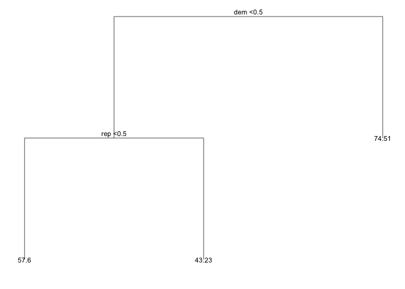

    ## [1] 406

The above decision tree shows the result where we fit a tree to the training data and use default values for control options. One can tell from this tree that for democrats, the average biden warmth score would be 74.51. For non-democrats, republicans would have 43.23 as an average biden warmth score, and non-republicans would have 57.6. The test MSE is 406.417, which is close to test MSEs we got from last assignment (around 400), let's see if we could improve this model.

Problem 3. Decision tree (CV)
-----------------------------

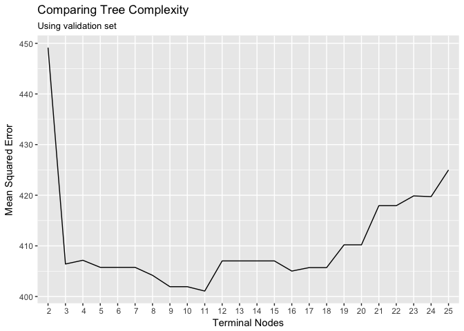

After comparing MSEs generated from different number of terminal nodes, one can tell 11 is the optimal level of tree complexity.

Thus we plot the optimal tree below. 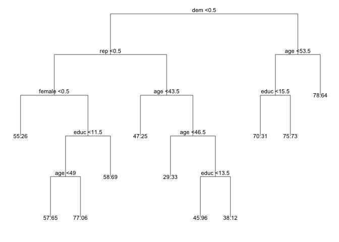

    ## [1] 401

The optimal tree shows that one can divide data to 11 groups and each group has a different average expected value for biden warmth score. Specific information of these groups is shown in the tree. The test MSE is improved from 406.417 to 401.075, indicating pruning the tree does improve the test MSE.

Problem 4. Bagging
------------------

    ## [1] 484

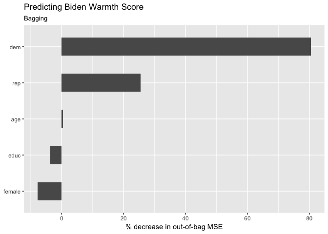

Bagging approach gives a higher MSE than before, 484.299. Since we are doing regression tree here, % decrease in out-of-bag MSE instead of Gini Index is used here to measure the variable importance. The above plot shows the importance of variables: Dem and Rep can bring significant decrease in the out-of-bag MSE thus they are the most important predictors. Age is relatively unimportant.

Problem 5. Random Forest
------------------------

    ## Joining, by = "var"

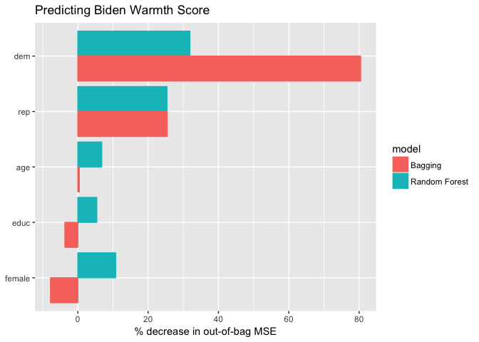

    ## [1] 410

Using random forest approach, the test MSE we obtained is 410.242, which is much smaller than the 484.299 we got from bagging and closer to the test MSE using optimal tree. This proves that random forests improve upon bagging, because it avoids the effect of single dominant predictor in the dataset.

The importance of variables shows that \(Dem\) and \(Rep\) are still the most important variables, but their importance seems relatively smaller compared to bagging because the variable restriction when random forest considering splits.

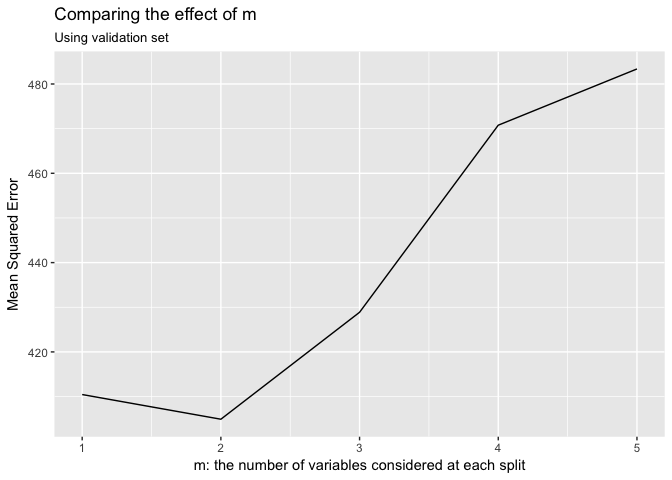

From the plot of test MSE generated from different number of variables considered at each split, one can tell 2 variables give the best test MSE. After \(m = 2\), the MSE gets higher because the trees tend to be more correlated, and averaging across them won't substantially reduce variance.

Problem 6. Boosting
-------------------

    ## Distribution not specified, assuming gaussian ...

    ## [1] 550

The test MSE obtained is 550.339, higher than all the MSEs we've got so far. This might have something to do with de shrinkage parameter we choose (default value 0.001).

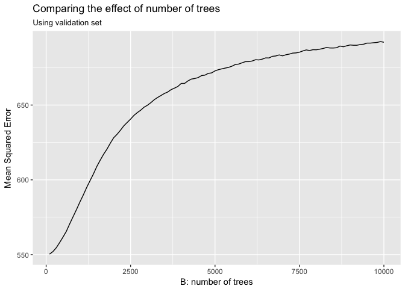

To optimize the test MSE using boosting approach, I tried different shrinkage parameter range from 0.001 to 0.05, and different number of trees from 100 to 10000. It seems that for both case, the smaller the better. The best test MSE seems to be obtained when the shrinkage parameter is 0.001 and number of trees is 100. However, the best test MSE is 550.339, much higher than we got from previous approaches.

Part 2: Modeling voter turnout
==============================

Problem 1. Choose the best tree-based model
-------------------------------------------

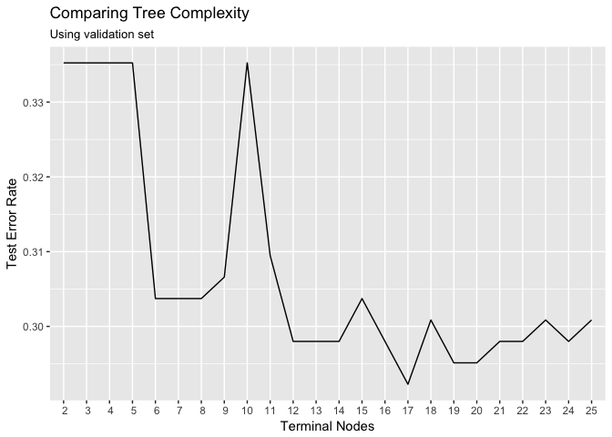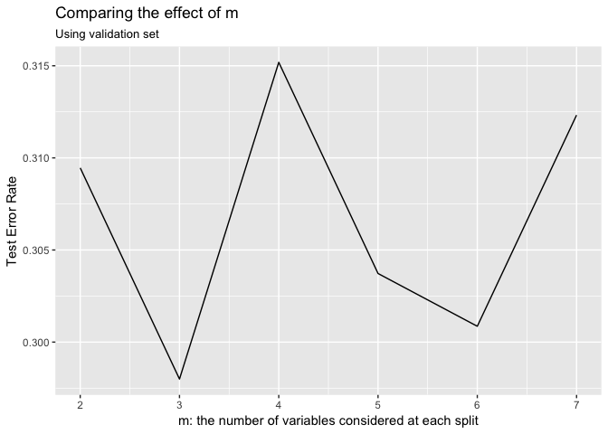

| objects | logistic | normaltree | prunedtree | bagging | normalrf | optrf |
|:-------:|:--------:|:----------:|:----------:|:-------:|:--------:|:-----:|
|   err   |   0.719  |    0.304   |    0.304   |  0.301  |   0.307  | 0.292 |
|   PRE   |   0.000  |    0.578   |    0.578   |  0.582  |   0.574  | 0.594 |

The five models I chose are decision tree with no control value, pruned decision tree with optimal number of terminal nodes, bagging, random forest with default value, and random forest with optimal number of variables considered at each split. The optimal parameter value for the second and fifth models are shown from the first two plots in this section. The table above shows the error rate (1st row) and PRE comparing to logisitic model for each of these models. The ROC curves below shows the AUC for each model.

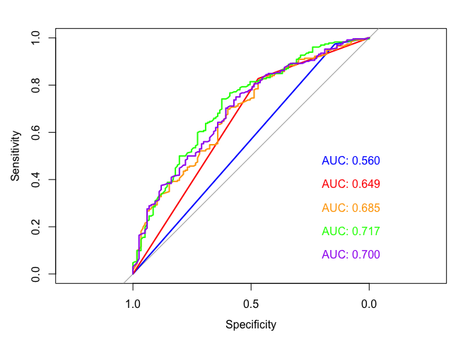

As one can see from the table and ROC curves, optimal random forest gives the lowest error rate (about 29.2%), highest PRE comparing to logisitic model, and second largest AUC (0.7). So I use optimal random forest to predict the test data as below.

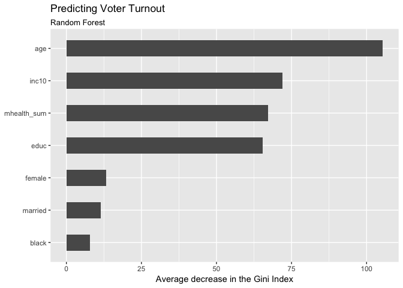

We use variable importance to interpret the random forest we got. From the above graph, one can tell age is the most important predictor for voter turnout. Family income, respondent's mental health and number of years of formal education can also significantly reduce Gini index in the classification trees. Sex, marriage status and black have relatively small influence in this case.

Problem 2. Choose the best SVM model
------------------------------------

|   objects  | linear | 2-degree poly | 3-degree | radial | sigmoid |
|:----------:|:------:|:-------------:|:--------:|:------:|:-------:|
|    cost    |  0.100 |     1.000     |   1.000  |  5.00  |  0.001  |
| error rate |  0.294 |     0.289     |   0.295  |  0.29  |  0.320  |

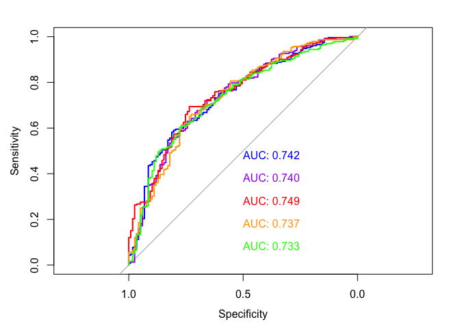

I chose linear kernel, 2-degree polynomial, 3-degree polynomial, radial kernel, and sigmoid kernel as my five SVM models. For each of them I used 10-fold cross-validation to determine the optimal cost parameter. And the above table shows their error rates associating with the best cost. The above graph shows their ROC curves.

Among these five models, 3-degree polynomial kernel has the best performance since it has low error rate and largest AUC. Thus I use this model to fit the test data and below is the ROC curve, showing that this model has certain accuracy and fit the test data well.

    ## 
    ## Call:
    ## best.tune(method = svm, train.x = vote96 ~ ., data = as_tibble(mh_split$train), 
    ##     ranges = list(cost = c(0.001, 0.01, 0.1, 1, 5, 10, 100)), 
    ##     kernel = "polynomial")
    ## 
    ## 
    ## Parameters:
    ##    SVM-Type:  C-classification 
    ##  SVM-Kernel:  polynomial 
    ##        cost:  1 
    ##      degree:  3 
    ##       gamma:  0.125 
    ##      coef.0:  0 
    ## 
    ## Number of Support Vectors:  512
    ## 
    ##  ( 263 249 )
    ## 
    ## 
    ## Number of Classes:  2 
    ## 
    ## Levels: 
    ##  0 1

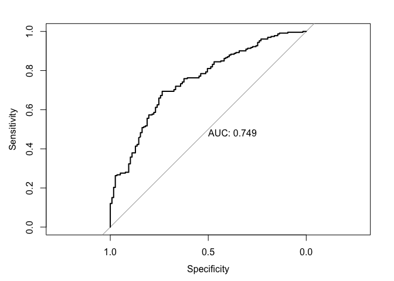

Part 3: OJ Simpson
==================

Problem 1. Race and Belief of OJ Simpson's guilt
------------------------------------------------

|   objects  | logisitic | decision tree | bagging | linear-SVM | poly-SVM | radial-SVM |
|:----------:|:---------:|:-------------:|:-------:|:----------:|:--------:|:----------:|
| error rate |   0.184   |     0.184     |  0.184  |    0.184   |   0.185  |    0.184   |

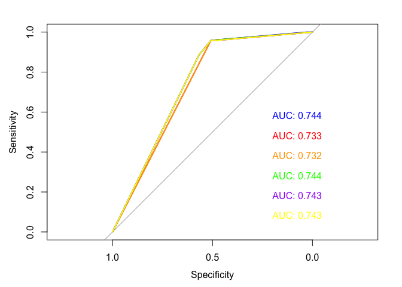

To choose the best model, I applied cross validation first, and used linear regression, decision tree, bagging, linear kernel SVM, polynomial kernel SVM, and radial kernel SVM generating from the training data to fit the test data. (Since the response is categorical, linear regression methods are not suitable in this case.) The error rate and ROC curves are shown as above. As one can see, these six models all give similar outcome. This is probably because there are only two variables and one of them may have dominant influence. Since these models are equally good, I'll use the most interpretable one -- decision tree.

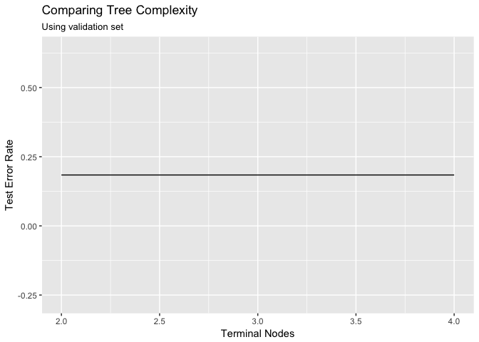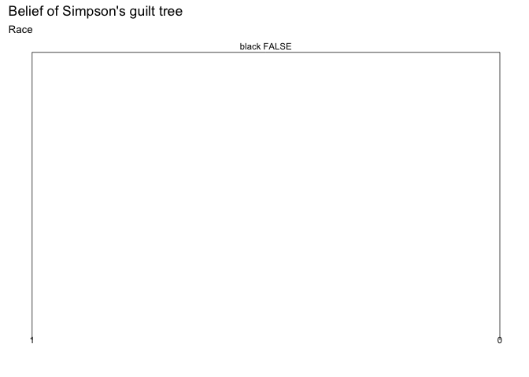

In terms of race, the tree complexity doesn't have any influence on the error rate, indicating there's a dominant variable here and the other variable doesn't have influence on the response. It turns out the dominant variable is whether the respondent is black. The tree shows that if the respondent is not black (left node), he/she would think OJ Simpson was "probably guilty", if the respondent is black (right node), he/she would think OJ Simpson was "probably not guilty". Whether the respondent is hispanic doesn't have significant influence. This indicates there's a strong relationship between race (african-american) and belief of whether Simpson is guilty.

Problem 2. Predicting Belief of OJ Simpson's guilt
--------------------------------------------------

|   objects  | logisitic | decision tree | bagging | linear-SVM | poly-SVM | radial-SVM |
|:----------:|:---------:|:-------------:|:-------:|:----------:|:--------:|:----------:|
| error rate |   0.182   |     0.182     |  0.194  |    0.184   |   0.196  |    0.184   |

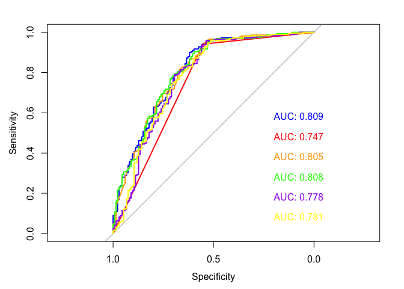

To better predict whether individuals believe Simpson to be guilty, I used all variables except for independent for this part, since in this dataset \(ind\) only has one value 0. I still used the six models I used before. To choose the approriate decision tree, I use cross-validation to pick the optimal terminal nodes that could give the lowest test error rate and highest AUC.

Above are the error rates and ROC curves of these models. As one can tell, decision tree and logistic regression both have lowest error rate, yet logistic regression has larger AUC. Since logistic regression seems more accurate yet decision tree is more interpretable, I will use both of them to predict the data.

    ## 
    ## ===============================================================
    ##                                         Dependent variable:    
    ##                                     ---------------------------
    ##                                                guilt           
    ## ---------------------------------------------------------------
    ## dem1                                          -0.089           
    ##                                               (0.281)          
    ##                                                                
    ## rep1                                           0.246           
    ##                                               (0.290)          
    ##                                                                
    ## age                                          0.019***          
    ##                                               (0.005)          
    ##                                                                
    ## educHIGH SCHOOL GRAD                          -0.297           
    ##                                               (0.225)          
    ##                                                                
    ## educNOT A HIGH SCHOOL GRAD                   -0.678**          
    ##                                               (0.337)          
    ##                                                                
    ## educREFUSED                                   13.600           
    ##                                              (471.000)         
    ##                                                                
    ## educSOME COLLEGE(TRADE OR BUSINESS)           -0.023           
    ##                                               (0.242)          
    ##                                                                
    ## female1                                       -0.335*          
    ##                                               (0.178)          
    ##                                                                
    ## black1                                       -2.880***         
    ##                                               (0.229)          
    ##                                                                
    ## hispanic1                                     -0.122           
    ##                                               (0.319)          
    ##                                                                
    ## 50,000                                        -0.058           
    ##                                               (0.229)          
    ##                                                                
    ## 75,000                                         0.166           
    ##                                               (0.293)          
    ##                                                                
    ## 75,000                                        0.778*           
    ##                                               (0.398)          
    ##                                                                
    ## incomeREFUSED/NO ANSWER                      -1.140***         
    ##                                               (0.361)          
    ##                                                                
    ## 15,000                                        -0.407           
    ##                                               (0.284)          
    ##                                                                
    ## Constant                                      0.996**          
    ##                                               (0.420)          
    ##                                                                
    ## ---------------------------------------------------------------
    ## Observations                                    992            
    ## Log Likelihood                               -447.000          
    ## Akaike Inf. Crit.                             926.000          
    ## ===============================================================
    ## Note:                               *p<0.1; **p<0.05; ***p<0.01

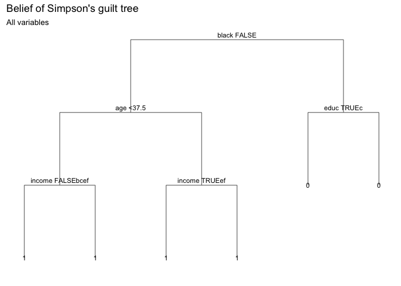

The result from logistic regression shows that, age, educ (not a high school grad), female, black, and income (Refused/no answer) are statiscally significant on the belief whether simpson is guilty. Not graduating from high school, being a female, being a black, refuse to answer or have no answer to income would decrese the log-odds of beliving Simpson is guilty. And with higher age, the log-odds of beliving he's guilty would increase.

The decision tree, interestingly, shows that being black is still the most important variable. African-americans, no matter their age is lower or higher than 37.5, and no matter if they're willing to give answer about their income, would be predicted as beliving Simpson is "probably not guilty". While non-African-Americans, no matter whether they've graduated from high school, would be predicted as beliving Simpson is "probably guilty". However, these three variables (age, income and educ)
