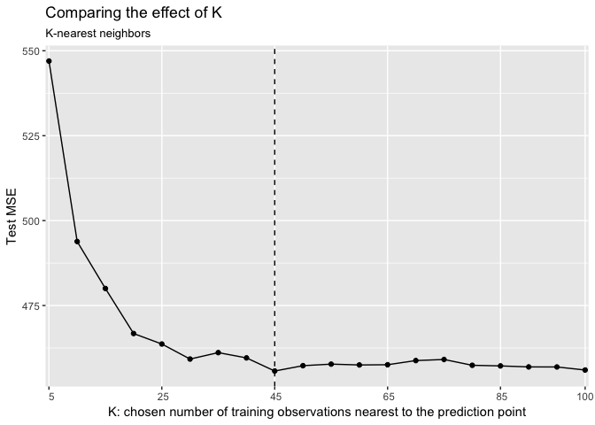
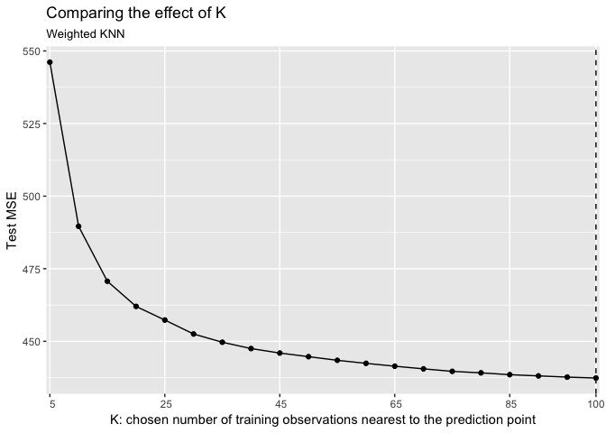
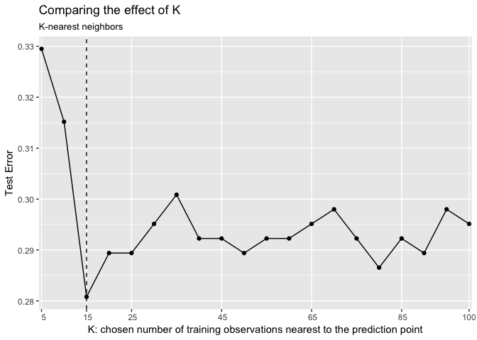
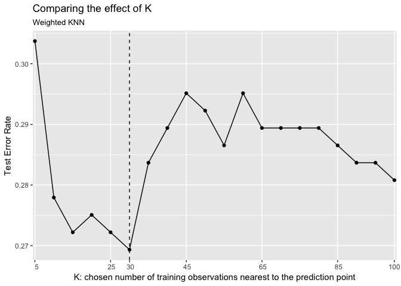
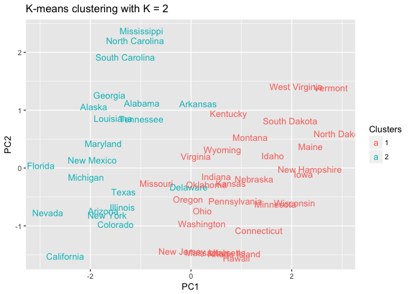
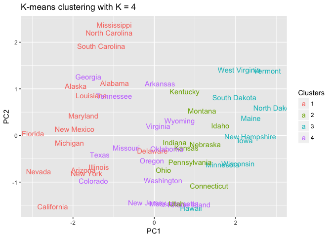
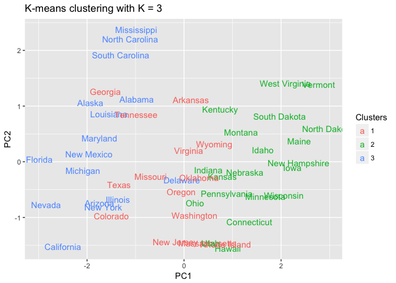
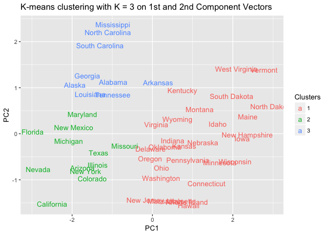
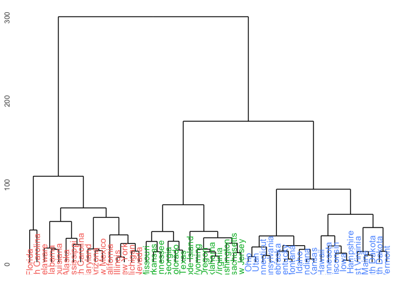
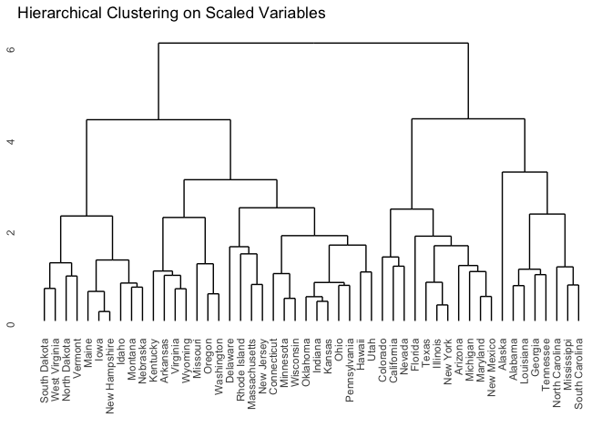

Problem set \#9: nonparametric methods and unsupervised learning
================
Ningyin Xu
3/11/2017

-   [Part 1: Attitudes towards feminists](#part-1-attitudes-towards-feminists)
    -   [Problem 1. Split the data](#problem-1.-split-the-data)
    -   [Problem 2. KNN](#problem-2.-knn)
    -   [Problem 3. Weighted KNN](#problem-3.-weighted-knn)
    -   [Problem 4. Compare different methods](#problem-4.-compare-different-methods)
-   [Part 2: Voter turnout and depression](#part-2-voter-turnout-and-depression)
    -   [Problem 1. Split the data](#problem-1.-split-the-data-1)
    -   [Problem 2. KNN](#problem-2.-knn-1)
    -   [Problem 3. Weighted KNN](#problem-3.-weighted-knn-1)
    -   [Problem 4. Compare different methods](#problem-4.-compare-different-methods-1)
-   [Part 3: Colleges](#part-3-colleges)
-   [Part 4: Clustering states](#part-4-clustering-states)
    -   [Problem 1. PCA](#problem-1.-pca)
    -   [Problem 2. K-means (K = 2)](#problem-2.-k-means-k-2)
    -   [Problem 3. K-means (K = 4)](#problem-3.-k-means-k-4)
    -   [Problem 4. K-means (K = 3)](#problem-4.-k-means-k-3)
    -   [Problem 5. K-means on components score](#problem-5.-k-means-on-components-score)
    -   [Problem 6. Hierarchical Clustering](#problem-6.-hierarchical-clustering)
    -   [Problem 7. Cut to 3 distinct clusters](#problem-7.-cut-to-3-distinct-clusters)
    -   [Problem 8. Scaling](#problem-8.-scaling)

Part 1: Attitudes towards feminists
===================================

Problem 1. Split the data
-------------------------

Problem 2. KNN
--------------

Choosing all the variables except \(feminist\) in the dataset as predictors, the lowest test MSE from KNN model is obtained when K = 45. The test MSE is 455.712.

Problem 3. Weighted KNN
-----------------------

The lowest test MSE from weighted KNN model is obtained when K = 100. The test MSE is 437.366.

Problem 4. Compare different methods
------------------------------------

|  methods | KNN | wKNN |  LM | Tree | Boosting | Random Forest |
|:--------:|:---:|:----:|:---:|:----:|:--------:|:-------------:|
| test MSE | 456 |  437 | 435 |  436 |    431   |      431      |

For every method above, I use cross validation (based on the test and train datasets I got from the first problem) to determine the values of parameters in order to make sure the test MSE is the lowest this method could give. The best test MSE I got among these methods is from boosting, its value is 431.219. The advantage of this approach is that it grows trees sequentially, using information from previously tree. The process is additive and slow, so the prediction is relatively more accurate. However, test MSEs from other methods are very close to 431.219.

Part 2: Voter turnout and depression
====================================

Problem 1. Split the data
-------------------------

Problem 2. KNN
--------------

Choosing all the variables except \(vote96\) in the dataset as predictors, the lowest test error rate from KNN model is obtained when K = 15. The test MSE is 0.281.

Problem 3. Weighted KNN
-----------------------

The lowest test MSE from weighted KNN model is obtained when K = 30. The test MSE is 0.269.

Problem 4. Compare different methods
------------------------------------

|     methods     |  KNN  |  wKNN | Logistic |  Tree | Boosting | Random Forest |  SVM  |
|:---------------:|:-----:|:-----:|:--------:|:-----:|:--------:|:-------------:|:-----:|
| Test Error Rate | 0.281 | 0.269 |   0.639  | 0.289 |   0.272  |     0.309     | 0.327 |

For every method above, I use cross validation (based on the test and train datasets I got from the first problem) to determine the values of parameters in order to make sure the test MSE is the lowest this method could give.

The best test MSE I got among these methods is from weighted K-nearest Neighbors, its value is 0.269. As a nonparametric method, weighted K-nearest method could well classifies an object by assigning differently weighted vote to its neighbors. I guess this method it's better here because this dataset contains relatively more categorical variables, so if we look at other variables one by one (like what tree-based models do), it's hard to capture the influence caused by multiple variables together.

Part 3: Colleges
================

    ## Parsed with column specification:
    ## cols(
    ##   Private = col_character(),
    ##   Apps = col_double(),
    ##   Accept = col_double(),
    ##   Enroll = col_double(),
    ##   Top10perc = col_double(),
    ##   Top25perc = col_double(),
    ##   F.Undergrad = col_double(),
    ##   P.Undergrad = col_double(),
    ##   Outstate = col_double(),
    ##   Room.Board = col_double(),
    ##   Books = col_double(),
    ##   Personal = col_double(),
    ##   PhD = col_double(),
    ##   Terminal = col_double(),
    ##   S.F.Ratio = col_double(),
    ##   perc.alumni = col_double(),
    ##   Expend = col_double(),
    ##   Grad.Rate = col_double()
    ## )

Since this dataset has many variables, the graph we got is messy and hard to interpret. We'll look at loading vectors for each variable for first/second principal component respectively.

    ##     Private        Apps      Accept      Enroll   Top10perc   Top25perc 
    ##     -0.0890     -0.1996     -0.1538     -0.1178     -0.3603     -0.3448 
    ## F.Undergrad P.Undergrad    Outstate  Room.Board       Books    Personal 
    ##     -0.0941      0.0175     -0.3277     -0.2665     -0.0572      0.0719 
    ##         PhD    Terminal   S.F.Ratio perc.alumni      Expend   Grad.Rate 
    ##     -0.3033     -0.3039      0.2103     -0.2367     -0.3330     -0.2731

For the first principal component, one could tell from the loading values that \(Top10perc\), \(Top25perc\), \(Outstate\), \(PhD\), \(Terminal\), and \(Expend\) appear to be strongly correlated on the first principal component. Since they're loading vectors are all around (-3, -3.5).

    ##     Private        Apps      Accept      Enroll   Top10perc   Top25perc 
    ##      0.3459     -0.3436     -0.3726     -0.3997      0.0162     -0.0177 
    ## F.Undergrad P.Undergrad    Outstate  Room.Board       Books    Personal 
    ##     -0.4107     -0.2931      0.1915      0.0940     -0.0573     -0.1928 
    ##         PhD    Terminal   S.F.Ratio perc.alumni      Expend   Grad.Rate 
    ##     -0.1162     -0.1042     -0.2044      0.1941      0.0703      0.1178

For the second principal component, one could tell that \(Accept\), \(F.Undergrad\), and \(Enroll\) appear to be strongly correlated on the second principal component. Since they're loading vectors are all around -4. In addition, the second principal component roughly corresponds to a measure of if the school is private/public. Because the second loading vector places most of its weight on \(Private\) and less weight on other features.

Part 4: Clustering states
=========================

Problem 1. PCA
--------------

One can tell from the biplot, the first principal component places approximately equal weight on murder, assault, and rape, so it's roughly correlated with violent crimes. The second principal component places more emphasis on urban population, which depicts the level of urbanization.

Problem 2. K-means (K = 2)
--------------------------

When k = 2, the cluster seems to be generated based on the first component vector, from the graph one can tell states in red letters have relatively lower rates of violent crimes than states in blue.

Problem 3. K-means (K = 4)
--------------------------

When k = 4, the clusters are still depicting difference of first component vector. The plot seems more accurate/detailed when spliting comparing to when k = 2.

Problem 4. K-means (K = 3)
--------------------------

Similarly, when k = 3, states are divided into three clusters based on their first component vector.

Problem 5. K-means on components score
--------------------------------------

Using first and second component vectors as the criteria for clustering, the graph seems to distinct 3 different culsters well based on both first and second components. One can interpret the graph as: the red cluster have lower violent crime rate, the blue one has higher crime rate but lower level of urbanization, the green cluster have both high crime rate and urbanization.

Problem 6. Hierarchical Clustering
----------------------------------

Problem 7. Cut to 3 distinct clusters
-------------------------------------

From the above graph, one can tell states in each cluster.

Problem 8. Scaling
------------------

After scaling, the euclidean distance is much smaller (from (0, 300) to (0, 6)), which makes the height of tree makes more sense. The above graph is cutting the tree at a height of 3, which generated 6 groups. Members of some groups changed after scaling, like Alaska, becoming a single-member group in the 3rd level leaf instead of 5th level before scaling. In a certain sense, I think this makes more sense, since Alaska is kind of a special state in the US from our intuition.

Statistically speaking, scaling makes more sense as well. Before scaling, variables may have different levels of standard deviations. Under complete linkage, this would affect their dissimilarity measure. However, these standard deviations in reality have different effects on the variables regarding to different scale of those variables. Thus, I think variables should be scaled before the inter-observation dissimilarities are computed.
