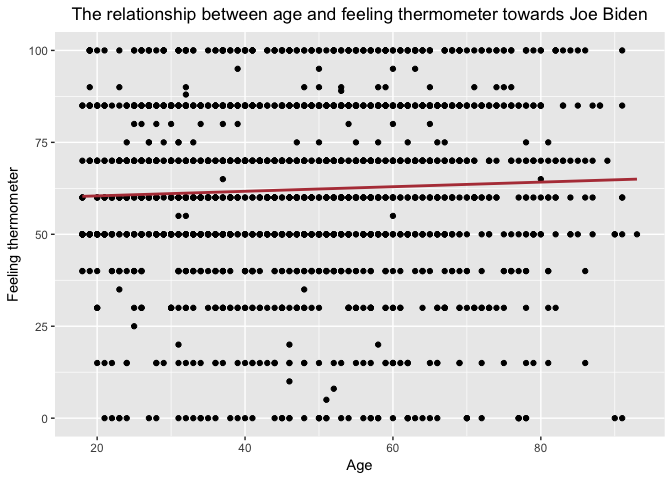
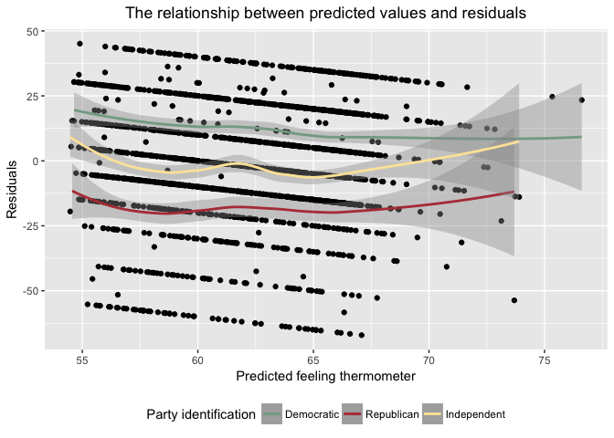

Problem set \#5: linear regression
================
Yiqing Zhu

-   [Problem 1: Describe the data](#problem-1-describe-the-data)
-   [Problem 2: Simple linear regression](#problem-2-simple-linear-regression)
-   [Problem 3: Multiple linear regression](#problem-3-multiple-linear-regression)
-   [Problem 3: Multiple linear regression model (with even more variables!)](#problem-3-multiple-linear-regression-model-with-even-more-variables)
-   [Problem 4: Interactive linear regression model](#problem-4-interactive-linear-regression-model)

Problem 1: Describe the data
----------------------------

From the histogram shown above, we can see that a lot more people feel positive or neutral (feeling thermometer &gt;= 50) towards Joe Biden, and the percenatge of people who feel neutral(feeling thermometer = 50) towards Joe Biden is the biggest.

Problem 2: Simple linear regression
-----------------------------------

The summary of the model(*Y* = *β*0 + *β*1*X*1) estimated is shown below:

    ## 
    ## Call:
    ## lm(formula = biden ~ age, data = pts)
    ## 
    ## Residuals:
    ##     Min      1Q  Median      3Q     Max 
    ## -64.876 -12.318  -1.257  21.684  39.617 
    ## 
    ## Coefficients:
    ##             Estimate Std. Error t value Pr(>|t|)    
    ## (Intercept) 59.19736    1.64792   35.92   <2e-16 ***
    ## age          0.06241    0.03267    1.91   0.0563 .  
    ## ---
    ## Signif. codes:  0 '***' 0.001 '**' 0.01 '*' 0.05 '.' 0.1 ' ' 1
    ## 
    ## Residual standard error: 23.44 on 1805 degrees of freedom
    ## Multiple R-squared:  0.002018,   Adjusted R-squared:  0.001465 
    ## F-statistic: 3.649 on 1 and 1805 DF,  p-value: 0.05626

    ##          term    estimate  std.error statistic       p.value
    ## 1 (Intercept) 59.19736008 1.64791889 35.922496 1.145056e-213
    ## 2         age  0.06240535 0.03266815  1.910281  5.625534e-02

The parameter *β*0 = 59.1974, *β*1 = 0.0624. The standard errors are 1.6479 and 0.0326 respectively.

**1. Is there a relationship between the predictor and the response?**

There is a relationship between the predictor(`age`) and the response(`biden`) since the p-value of `age` coefficient in the estimated model above is 0.0563, which shows that there are more than 90% chance of rejecting the null hypothesis.

**2. How strong is the relationship between the predictor and the response?**

The relationship between the predictor and the response is not that strong. As said in 1, the p-value of `age` coefficient is 0.0563, and it is not that statistically siginificant, which usually requires p-value &lt; 0.05.

**3. Is the relationship between the predictor and the response positive or negative?**

The relationship between the predictor and the response is positive since the estimated coefficient for `age` is 0.0624.

**4. Report the *R*2 of the model. What percentage of the variation in `biden` does `age` alone explain? Is this a good or bad model?**

The *R*2 of the model is 0.002018, which means that `age` alone only explains 0.2% of the variation in `biden`. Therefore, this is a bad model, since it is not able to effectively explain the variation in feeling thermometer towards Biden.

**5. What is the predicted `biden` associated with an `age` of 45? What are the associated 95% confidence intervals?**

    ##   age .fitted   .se.fit     ymin      max
    ## 1  45 62.0056 0.5577123 60.91248 63.09872

The predicted `biden` associated with an `age` of 45 is 62.0056. The associated 95% confidence intervals is (60.9124, 63.0987).

**6. Plot the response and predictor. Draw the least squares regression line.**

Problem 3: Multiple linear regression
-------------------------------------

The summary of the model(*Y* = *β*0 + *β*1*X*1 + *β*2*X*2 + *β*3*X*3) estimated is shown below:

    ## 
    ## Call:
    ## lm(formula = biden ~ age + female + educ, data = pts)
    ## 
    ## Residuals:
    ##     Min      1Q  Median      3Q     Max 
    ## -67.084 -14.662   0.703  18.847  45.105 
    ## 
    ## Coefficients:
    ##             Estimate Std. Error t value Pr(>|t|)    
    ## (Intercept) 68.62101    3.59600  19.083  < 2e-16 ***
    ## age          0.04188    0.03249   1.289    0.198    
    ## female       6.19607    1.09670   5.650 1.86e-08 ***
    ## educ        -0.88871    0.22469  -3.955 7.94e-05 ***
    ## ---
    ## Signif. codes:  0 '***' 0.001 '**' 0.01 '*' 0.05 '.' 0.1 ' ' 1
    ## 
    ## Residual standard error: 23.16 on 1803 degrees of freedom
    ## Multiple R-squared:  0.02723,    Adjusted R-squared:  0.02561 
    ## F-statistic: 16.82 on 3 and 1803 DF,  p-value: 8.876e-11

    ##          term    estimate  std.error statistic      p.value
    ## 1 (Intercept) 68.62101396 3.59600465 19.082571 4.337464e-74
    ## 2         age  0.04187919 0.03248579  1.289154 1.975099e-01
    ## 3      female  6.19606946 1.09669702  5.649755 1.863612e-08
    ## 4        educ -0.88871263 0.22469183 -3.955251 7.941295e-05

The parameter *β*0 = 68.6210, *β*1 = 0.0419, *β*2 = 6.1961, *β*3 = -0.8887. The standard errors are 3.5960, 0.0325, 1.0967, and 0.2247 respectively.

**1. Is there a statistically significant relationship between the predictors and response?**

Since the p-value for `female` and `education` coefficient are 1.863612e-08 and 7.941295e-05 respectively, which are far less than 0.05, there is a statistically significant relationship between them and `biden`. While the p-value for `age` coefficient is 0.1975, which is much bigger than 0.05, so the relationship between `age` and `biden` is not statistically significant.

**2. What does the parameter for `female` suggest?**

The parameter for `female` is 6.1961, which suggests that with constant age and education, a female respondent is about 6.1961 point higher in reporting feeling thermometer towards Joe Biden than a male respondent.

**3. Report the *R*2 of the model. What percentage of the variation in `biden` does `age`, `gender`, and `education` explain? Is this a better or worse model than the age-only model?**

The *R*2 of the model is 0.02723, which means that `age`, `gender`, and `education` explain 2.723% of the variation in `biden`. Therefore, this model is still bad, but better than the age-only model.

**4. Generate a plot comparing the predicted values and residuals, drawing separate smooth fit lines for each party ID type. Is there a problem with this model? If so, what?**

There is a problem with this model. As shown in the plot above, The overall residuals are not around 0, and Republicans have higher feeling thermometer than predicted, while Democtratics have lower feeling thermometer than predicted. Being in different parties have much effect on the residuals, implying that party should be one of the preditors to the feeling thermometer.

Problem 3: Multiple linear regression model (with even more variables!)
-----------------------------------------------------------------------

The summary of the model(*Y* = *β*0 + *β*1*X*1 + *β*2*X*2 + *β*3*X*3 + *β*4*X*4 + *β*5*X*5) estimated is shown below:

    ## 
    ## Call:
    ## lm(formula = biden ~ age + female + educ + dem + rep, data = pts)
    ## 
    ## Residuals:
    ##     Min      1Q  Median      3Q     Max 
    ## -75.546 -11.295   1.018  12.776  53.977 
    ## 
    ## Coefficients:
    ##              Estimate Std. Error t value Pr(>|t|)    
    ## (Intercept)  58.81126    3.12444  18.823  < 2e-16 ***
    ## age           0.04826    0.02825   1.708   0.0877 .  
    ## female        4.10323    0.94823   4.327 1.59e-05 ***
    ## educ         -0.34533    0.19478  -1.773   0.0764 .  
    ## dem          15.42426    1.06803  14.442  < 2e-16 ***
    ## rep         -15.84951    1.31136 -12.086  < 2e-16 ***
    ## ---
    ## Signif. codes:  0 '***' 0.001 '**' 0.01 '*' 0.05 '.' 0.1 ' ' 1
    ## 
    ## Residual standard error: 19.91 on 1801 degrees of freedom
    ## Multiple R-squared:  0.2815, Adjusted R-squared:  0.2795 
    ## F-statistic: 141.1 on 5 and 1801 DF,  p-value: < 2.2e-16

    ##          term     estimate std.error  statistic      p.value
    ## 1 (Intercept)  58.81125899 3.1244366  18.822996 2.694143e-72
    ## 2         age   0.04825892 0.0282474   1.708438 8.772744e-02
    ## 3      female   4.10323009 0.9482286   4.327258 1.592601e-05
    ## 4        educ  -0.34533479 0.1947796  -1.772952 7.640571e-02
    ## 5         dem  15.42425563 1.0680327  14.441745 8.144928e-45
    ## 6         rep -15.84950614 1.3113624 -12.086290 2.157309e-32

The parameter *β*0 = 58.8113, *β*1 = 0.0483, *β*2 = 4.1032, *β*3 = -0.3453, *β*4 = 15.4243, *β*5 = -15.8495. The standard errors are 3.1244, 0.0282. 0.9482, 0.1948, 1.0680, and 1.3114 respectively.

**1. Did the relationship between `gender` and `Biden warmth` change?** The relationship between `gender` and `Biden warmth` slightly changes since before the coefficient for `female` was 6.1961, now it is 4.1032, which means when we hold constant `party identification` in addition to `age` and `education`, the ratings of feeling thermometer towards Joe Biden of a female respondent than a male respondent is lower compared with when we do not hold `party identification` constant.

**2. Report the *R*2 of the model. What percentage of the variation in `biden` does `age`, `gender`, `education`, and `party identification` explain? Is this a better or worse model than the age + gender + education model?**

The *R*2 of the model is 0.2815, which means that `age`, `gender`, `education`, and `party identification` explain 28.15% of the variation in `biden`. Therefore, this model is still not good, but better than the `age` + `gender` + `education` model.

**3. Generate a plot comparing the predicted values and residuals, drawing separate smooth fit lines for each party ID type. By adding variables for party ID to the regression model, did we fix the previous problem?**

We did fix the previous problem. As shown in the plot above, the residuals are more or less around 0 and that for Democrats, Republicans, and other parties are now in similar range. However, there is still a specific pattern of the three smooth fit lines of residuals, which indicates the inaccuracy of the model.

Problem 4: Interactive linear regression model
----------------------------------------------

The summary of the model(*Y* = *β*0 + *β*1*X*1 + *β*2*X*2 + *β*3*X*1*X*2) estimated is shown below:

    ## 
    ## Call:
    ## lm(formula = biden ~ female * dem, data = pts_par)
    ## 
    ## Residuals:
    ##     Min      1Q  Median      3Q     Max 
    ## -75.519 -13.070   4.223  11.930  55.618 
    ## 
    ## Coefficients:
    ##             Estimate Std. Error t value Pr(>|t|)    
    ## (Intercept)   39.382      1.455  27.060  < 2e-16 ***
    ## female         6.395      2.018   3.169  0.00157 ** 
    ## dem           33.688      1.835  18.360  < 2e-16 ***
    ## female:dem    -3.946      2.472  -1.597  0.11065    
    ## ---
    ## Signif. codes:  0 '***' 0.001 '**' 0.01 '*' 0.05 '.' 0.1 ' ' 1
    ## 
    ## Residual standard error: 19.42 on 1147 degrees of freedom
    ## Multiple R-squared:  0.3756, Adjusted R-squared:  0.374 
    ## F-statistic:   230 on 3 and 1147 DF,  p-value: < 2.2e-16

    ##          term  estimate std.error statistic       p.value
    ## 1 (Intercept) 39.382022  1.455363 27.059928 4.045546e-125
    ## 2      female  6.395180  2.017807  3.169371  1.568102e-03
    ## 3         dem 33.687514  1.834799 18.360328  3.295008e-66
    ## 4  female:dem -3.945888  2.471577 -1.596506  1.106513e-01

The parameter *β*0 = 39.3820, *β*1 = 6.3952, *β*2 = 33.6875, *β*3 = -3.9459. The standard errors are 1.4554, 2.0178, 1.8348, and 2.4716 respectively.

**1. Estimate predicted Biden warmth feeling thermometer ratings and 95% confidence intervals for female Democrats, female Republicans, male Democrats, and male Republicans. Does the relationship between party ID and Biden warmth differ for males/females? Does the relationship between gender and Biden warmth differ for Democrats/Republicans?**

    ##   female dem     pred  .fitted   .se.fit     ymin      max
    ## 1      0   0 39.38202 39.38202 1.4553632 36.52951 42.23453
    ## 2      0   1 73.06954 73.06954 1.1173209 70.87959 75.25949
    ## 3      1   0 45.77720 45.77720 1.3976638 43.03778 48.51662
    ## 4      1   1 75.51883 75.51883 0.8881114 73.77813 77.25953

The predicted Biden warmth feeling thermometer ratings for female Democrats is 75.5188 with 95% confidence intervals (73.7881, 77.2595), 45.7772 for female Republicans with 95% confidence intervals (43.0378, 48.5166), 73.0695 for male Democrats with 95% confidence intervals (70.8796, 75.2595), and 39.3820 for male Republicans with 95% confidence intervals (36.5295, 42.2345).

The relationship between party ID and Biden warmth differs for males/females. Females are less affected by party ID since female Republicans report much higher Biden warmth feeling thermometer ratings than male Republicans. That is to say, the relationship between party ID and Biden warmth is stronger for males.

The relationship between gender and Biden warmth differ for Democrats/Republicans. Republicans are more affected by gender since the female Republicans tend to report about 6.3952 points higher than male Republicans while female Democrats tend to report about 2.4493 points higher than male Democrats. That is to say, the relationship between gender and Biden warmth is stonger for Republicans.
