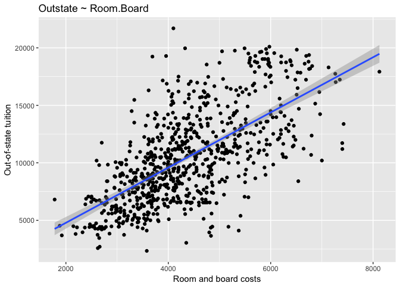

Problem set \#7: resampling and nonlinearity
================
Yiqing Zhu

-   [Part 1: Sexy Joe Biden (redux)](#part-1-sexy-joe-biden-redux)
-   [Part 2: College (bivariate)](#part-2-college-bivariate)
-   [Part 3: College (GAM)](#part-3-college-gam)

Part 1: Sexy Joe Biden (redux)
==============================

**1. Estimate the training MSE of the model using the traditional approach.**

The summary of the model (*Y* = *β*0 + *β*1*X*1 + *β*2*X*2 + *β*3*X*3 + *β*4*X*4 + *β*5*X*5 + *ϵ*) estimated is shown below:

    ## 
    ## Call:
    ## lm(formula = biden ~ age + female + educ + dem + rep, data = data1)
    ## 
    ## Residuals:
    ##     Min      1Q  Median      3Q     Max 
    ## -75.546 -11.295   1.018  12.776  53.977 
    ## 
    ## Coefficients:
    ##              Estimate Std. Error t value Pr(>|t|)    
    ## (Intercept)  58.81126    3.12444  18.823  < 2e-16 ***
    ## age           0.04826    0.02825   1.708   0.0877 .  
    ## female        4.10323    0.94823   4.327 1.59e-05 ***
    ## educ         -0.34533    0.19478  -1.773   0.0764 .  
    ## dem          15.42426    1.06803  14.442  < 2e-16 ***
    ## rep         -15.84951    1.31136 -12.086  < 2e-16 ***
    ## ---
    ## Signif. codes:  0 '***' 0.001 '**' 0.01 '*' 0.05 '.' 0.1 ' ' 1
    ## 
    ## Residual standard error: 19.91 on 1801 degrees of freedom
    ## Multiple R-squared:  0.2815, Adjusted R-squared:  0.2795 
    ## F-statistic: 141.1 on 5 and 1801 DF,  p-value: < 2.2e-16

    ##          term     estimate std.error  statistic      p.value
    ## 1 (Intercept)  58.81125899 3.1244366  18.822996 2.694143e-72
    ## 2         age   0.04825892 0.0282474   1.708438 8.772744e-02
    ## 3      female   4.10323009 0.9482286   4.327258 1.592601e-05
    ## 4        educ  -0.34533479 0.1947796  -1.772952 7.640571e-02
    ## 5         dem  15.42425563 1.0680327  14.441745 8.144928e-45
    ## 6         rep -15.84950614 1.3113624 -12.086290 2.157309e-32

The mean squared error is 395.2701693.

**2. Estimate the test MSE of the model using the validation set approach.**

The summary of the model (*Y* = *β*0 + *β*1*X*1 + *β*2*X*2 + *β*3*X*3 + *β*4*X*4 + *β*5*X*5 + *ϵ*) estimated using training set observations is shown below:

    ## 
    ## Call:
    ## lm(formula = biden ~ age + female + educ + dem + rep, data = data1_split$train)
    ## 
    ## Residuals:
    ##     Min      1Q  Median      3Q     Max 
    ## -75.759 -10.736   0.903  12.930  53.675 
    ## 
    ## Coefficients:
    ##              Estimate Std. Error t value Pr(>|t|)    
    ## (Intercept)  57.33735    3.69768  15.506  < 2e-16 ***
    ## age           0.03728    0.03362   1.109 0.267701    
    ## female        4.17215    1.12671   3.703 0.000222 ***
    ## educ         -0.26017    0.23221  -1.120 0.262750    
    ## dem          16.32775    1.27664  12.790  < 2e-16 ***
    ## rep         -14.60704    1.55800  -9.375  < 2e-16 ***
    ## ---
    ## Signif. codes:  0 '***' 0.001 '**' 0.01 '*' 0.05 '.' 0.1 ' ' 1
    ## 
    ## Residual standard error: 19.89 on 1259 degrees of freedom
    ## Multiple R-squared:  0.2787, Adjusted R-squared:  0.2758 
    ## F-statistic: 97.28 on 5 and 1259 DF,  p-value: < 2.2e-16

    ##          term     estimate  std.error statistic      p.value
    ## 1 (Intercept)  57.33735418 3.69768457 15.506286 9.235344e-50
    ## 2         age   0.03728388 0.03362353  1.108863 2.677012e-01
    ## 3      female   4.17214945 1.12671186  3.702943 2.223339e-04
    ## 4        educ  -0.26017049 0.23220880 -1.120416 2.627501e-01
    ## 5         dem  16.32774600 1.27663938 12.789631 2.656760e-35
    ## 6         rep -14.60703626 1.55800499 -9.375475 3.086057e-20

The mean squared error using only test set observations is 399.8303029.

This MSE value is a little bit larger compared to the MSE value from step 1. This makes sense since the model estimated is trained by the training data, so it should not perfectly fit the test data, instead, the model estimated in step 1 is trained by the whole data set, so it should fit the whole date set better.

**3. Repeat the validation set approach 100 times, using 100 different splits of the observations into a training set and a validation set. Comment on the results obtained.**

The quantiles of the repeated 100 CV MSE values are 340.8504077, 389.7264343, 400.1067017, 414.8313229, 455.3244605, the mean is 401.6489239，and the standard deviation is 20.7385133. We can see the mean and median is very close to the MSE values in step 1 and 2.

**4. Estimate the test MSE of the model using the leave-one-out cross-validation (LOOCV) approach. Comment on the results obtained.**

The LOOCV MSE of the model is 397.9555046. It's also very close to the MSE values we get before.

**5. Estimate the test MSE of the model using the 10-fold cross-validation approach. Comment on the results obtained.**

The 10-fold CV MSE of the model is 398.0728532, which is again very close to the MSE values we get before.

**6. Repeat the 10-fold cross-validation approach 100 times, using 100 different splits of the observations into 10-folds. Comment on the results obtained.**

The quantiles of the repeated 100 10-fold CV MSE is 396.7948745, 397.7133823, 398.0782456, 398.4878046, 399.4557604, the mean is 398.0997361, and the standard deviation is 0.5076214. We can see that the 10-fold CV MSEs are not varying much.

**7. Compare the estimated parameters and standard errors from the original model in step 1 (the model estimated using all of the available data) to parameters and standard errors estimated using the bootstrap (n = 1000).**

The parameters and standard errors estimated using the bootstrap (n = 1000) are:

    ## # A tibble: 6 × 3
    ##          term     est.boot    se.boot
    ##         <chr>        <dbl>      <dbl>
    ## 1 (Intercept)  58.80835664 3.01951433
    ## 2         age   0.04869239 0.02867907
    ## 3         dem  15.43863386 1.08962714
    ## 4        educ  -0.34575098 0.19467375
    ## 5      female   4.10121776 0.95828129
    ## 6         rep -15.88228575 1.40730353

The estimated parameters and standard errors from the original model in step 1 are:

    ##          term     estimate std.error  statistic      p.value
    ## 1 (Intercept)  58.81125899 3.1244366  18.822996 2.694143e-72
    ## 2         age   0.04825892 0.0282474   1.708438 8.772744e-02
    ## 3      female   4.10323009 0.9482286   4.327258 1.592601e-05
    ## 4        educ  -0.34533479 0.1947796  -1.772952 7.640571e-02
    ## 5         dem  15.42425563 1.0680327  14.441745 8.144928e-45
    ## 6         rep -15.84950614 1.3113624 -12.086290 2.157309e-32

We can see that the standard errors of the bootstrap estimation are very close to the original one; some slightly larger while some slightly smaller. The bootstrapped estimates of parameters should be more robust since they do not rely on any distributional assumptions, whereas the traditional estimates do.

Part 2: College (bivariate)
===========================

**Predictor 1: PhD (Percent of faculty with Ph.D.'s)**

The linear relationship between Out-of-state tuition and Percent of faculty with Ph.D.'s is estimated below:

    ## 
    ## Call:
    ## lm(formula = Outstate ~ PhD, data = data2)
    ## 
    ## Residuals:
    ##     Min      1Q  Median      3Q     Max 
    ## -8443.6 -3191.9   179.3  2554.0 14813.0 
    ## 
    ## Coefficients:
    ##             Estimate Std. Error t value Pr(>|t|)    
    ## (Intercept) 3584.361    608.838   5.887 5.85e-09 ***
    ## PhD           94.361      8.176  11.542  < 2e-16 ***
    ## ---
    ## Signif. codes:  0 '***' 0.001 '**' 0.01 '*' 0.05 '.' 0.1 ' ' 1
    ## 
    ## Residual standard error: 3719 on 775 degrees of freedom
    ## Multiple R-squared:  0.1467, Adjusted R-squared:  0.1456 
    ## F-statistic: 133.2 on 1 and 775 DF,  p-value: < 2.2e-16

    ##          term   estimate  std.error statistic      p.value
    ## 1 (Intercept) 3584.36142 608.838448  5.887213 5.847276e-09
    ## 2         PhD   94.36122   8.175625 11.541774 1.504980e-28

The MSE value of this model using the 10-fold cross-validation approach is:

    ## [1] 13857143

We can observe a polynomial relationship from the plot above. So let's estimate 10-fold CV MSE for varying numbers of polynomial degrees to justify this observation.

We can observe from the plot above that the MSE is lowest at the 3 polynomial degrees, so I choose the cubic transformation of `PhD` to make the model better fits the data.

    ## 
    ## Call:
    ## glm(formula = Outstate ~ poly(PhD, 3), data = data2)
    ## 
    ## Deviance Residuals: 
    ##    Min      1Q  Median      3Q     Max  
    ## -13235   -2711     201    2478   12353  
    ## 
    ## Coefficients:
    ##               Estimate Std. Error t value Pr(>|t|)    
    ## (Intercept)    10440.7      126.6  82.500  < 2e-16 ***
    ## poly(PhD, 3)1  42920.2     3527.6  12.167  < 2e-16 ***
    ## poly(PhD, 3)2  30971.5     3527.6   8.780  < 2e-16 ***
    ## poly(PhD, 3)3  11771.8     3527.6   3.337 0.000887 ***
    ## ---
    ## Signif. codes:  0 '***' 0.001 '**' 0.01 '*' 0.05 '.' 0.1 ' ' 1
    ## 
    ## (Dispersion parameter for gaussian family taken to be 12444173)
    ## 
    ##     Null deviance: 1.2559e+10  on 776  degrees of freedom
    ## Residual deviance: 9.6193e+09  on 773  degrees of freedom
    ## AIC: 14905
    ## 
    ## Number of Fisher Scoring iterations: 2

    ##            term estimate std.error statistic      p.value
    ## 1   (Intercept) 10440.67   126.553 82.500358 0.000000e+00
    ## 2 poly(PhD, 3)1 42920.18  3527.630 12.166859 2.759952e-31
    ## 3 poly(PhD, 3)2 30971.51  3527.630  8.779693 1.042510e-17
    ## 4 poly(PhD, 3)3 11771.83  3527.630  3.337037 8.872413e-04

The MSE value of this model using the 10-fold cross-validation approach is:

    ## [1] 12566169

The cubic tranformed model is much better than the original one according to the MSE values.

Therefore, we can conclude that the relationship between out-of-state tuition and the percent of faculty with Ph.D.'s is statistically significant (p-value: 2.759952e-31, 1.042510e-17, 8.872413e-04); when the percent of faculty with Ph.D.'s is lower than around 70%, the relationship is substantively insignificant, while when the precentage is 70% - 100%, the relationship is positive and substantively significant.

**Predictor 2: S.F.Ratio (Student/faculty ratio)**

The linear relationship between Out-of-state tuition and Student/faculty ratio is estimated below:

    ## 
    ## Call:
    ## lm(formula = Outstate ~ S.F.Ratio, data = data2)
    ## 
    ## Residuals:
    ##      Min       1Q   Median       3Q      Max 
    ## -10167.6  -2636.7   -251.5   2268.5  13267.0 
    ## 
    ## Coefficients:
    ##             Estimate Std. Error t value Pr(>|t|)    
    ## (Intercept) 18385.65     444.50   41.36   <2e-16 ***
    ## S.F.Ratio    -563.89      30.37  -18.57   <2e-16 ***
    ## ---
    ## Signif. codes:  0 '***' 0.001 '**' 0.01 '*' 0.05 '.' 0.1 ' ' 1
    ## 
    ## Residual standard error: 3349 on 775 degrees of freedom
    ## Multiple R-squared:  0.3078, Adjusted R-squared:  0.3069 
    ## F-statistic: 344.7 on 1 and 775 DF,  p-value: < 2.2e-16

    ##          term   estimate std.error statistic       p.value
    ## 1 (Intercept) 18385.6471 444.49995  41.36254 2.484536e-198
    ## 2   S.F.Ratio  -563.8854  30.37346 -18.56507  6.237522e-64

The MSE value of this model using the 10-fold cross-validation approach is:

    ## [1] 11318119

I don't observe any obvious transformation that can help the model better fit the data. Let's try estimate 10-fold CV MSE for possible tranformations to justify this observation.

It seems that the MSE is lowest at the 4 polynomial degrees, so I choose the biquadratic transformation of `S.F.Ratio` to make the model better fits the data.

    ## 
    ## Call:
    ## glm(formula = Outstate ~ poly(S.F.Ratio, 4), data = data2)
    ## 
    ## Deviance Residuals: 
    ##      Min        1Q    Median        3Q       Max  
    ## -10941.4   -2470.2    -101.9    2189.0    9751.9  
    ## 
    ## Coefficients:
    ##                     Estimate Std. Error t value Pr(>|t|)    
    ## (Intercept)          10440.7      116.8  89.399  < 2e-16 ***
    ## poly(S.F.Ratio, 4)1 -62177.9     3255.4 -19.100  < 2e-16 ***
    ## poly(S.F.Ratio, 4)2  17550.6     3255.4   5.391 9.31e-08 ***
    ## poly(S.F.Ratio, 4)3   8043.6     3255.4   2.471  0.01369 *  
    ## poly(S.F.Ratio, 4)4 -11795.0     3255.4  -3.623  0.00031 ***
    ## ---
    ## Signif. codes:  0 '***' 0.001 '**' 0.01 '*' 0.05 '.' 0.1 ' ' 1
    ## 
    ## (Dispersion parameter for gaussian family taken to be 10597627)
    ## 
    ##     Null deviance: 1.2559e+10  on 776  degrees of freedom
    ## Residual deviance: 8.1814e+09  on 772  degrees of freedom
    ## AIC: 14781
    ## 
    ## Number of Fisher Scoring iterations: 2

    ##                  term   estimate std.error  statistic      p.value
    ## 1         (Intercept)  10440.669  116.7868  89.399387 0.000000e+00
    ## 2 poly(S.F.Ratio, 4)1 -62177.861 3255.3996 -19.099917 6.742900e-67
    ## 3 poly(S.F.Ratio, 4)2  17550.559 3255.3996   5.391215 9.307152e-08
    ## 4 poly(S.F.Ratio, 4)3   8043.618 3255.3996   2.470854 1.369398e-02
    ## 5 poly(S.F.Ratio, 4)4 -11794.970 3255.3996  -3.623202 3.100289e-04

Visaully checking the plot, it seems that the model does not fit the data that well. So let's try the regression spline. We can estimate 10-fold CV MSE for varying numbers of polynomial degrees and knots.

These results suggest the optimal number of polynomial degrees is 1, while the optimal number of knots is 2. The resulting model produced by these parameters is:

    ## 
    ## Call:
    ## glm(formula = Outstate ~ bs(S.F.Ratio, df = 2, degree = 1), data = data2)
    ## 
    ## Deviance Residuals: 
    ##      Min        1Q    Median        3Q       Max  
    ## -11169.8   -2593.5    -222.1    2135.6   10291.3  
    ## 
    ## Coefficients:
    ##                                    Estimate Std. Error t value Pr(>|t|)
    ## (Intercept)                         18897.2      650.2   29.06   <2e-16
    ## bs(S.F.Ratio, df = 2, degree = 1)1  -8688.1      754.9  -11.51   <2e-16
    ## bs(S.F.Ratio, df = 2, degree = 1)2 -19978.6     1162.1  -17.19   <2e-16
    ##                                       
    ## (Intercept)                        ***
    ## bs(S.F.Ratio, df = 2, degree = 1)1 ***
    ## bs(S.F.Ratio, df = 2, degree = 1)2 ***
    ## ---
    ## Signif. codes:  0 '***' 0.001 '**' 0.01 '*' 0.05 '.' 0.1 ' ' 1
    ## 
    ## (Dispersion parameter for gaussian family taken to be 11047660)
    ## 
    ##     Null deviance: 1.2559e+10  on 776  degrees of freedom
    ## Residual deviance: 8.5509e+09  on 774  degrees of freedom
    ## AIC: 14811
    ## 
    ## Number of Fisher Scoring iterations: 2

    ##                                 term   estimate std.error statistic
    ## 1                        (Intercept)  18897.208  650.2305  29.06232
    ## 2 bs(S.F.Ratio, df = 2, degree = 1)1  -8688.053  754.9240 -11.50851
    ## 3 bs(S.F.Ratio, df = 2, degree = 1)2 -19978.555 1162.0857 -17.19198
    ##         p.value
    ## 1 3.999399e-126
    ## 2  2.105308e-28
    ## 3  2.371124e-56

Now it looks better. The MSE value of this model using the 10-fold cross-validation approach is:

    ## [1] 11150949

The spline model is better than the original one according to the MSE values.

Therefore, we can conclude that the relationship between out-of-state tuition and student/faculty ratio is statistically significant (p-value: 2.105308e-28, 2.371124e-56); when the student/faculty ratio is from 5 to 23, the relationship is negative and substantively significant, while when the ratio is higher than 23, there are not enough data to explain the relationship.

**Predictor 3: perc.alumni (Percent of alumni who donate)**

The linear relationship between Out-of-state tuition and Percent of alumni who donate is estimated below:

    ## 
    ## Call:
    ## lm(formula = Outstate ~ perc.alumni, data = data2)
    ## 
    ## Residuals:
    ##      Min       1Q   Median       3Q      Max 
    ## -11273.0  -2250.9   -361.5   2016.9   9731.4 
    ## 
    ## Coefficients:
    ##             Estimate Std. Error t value Pr(>|t|)    
    ## (Intercept) 6259.480    248.919   25.15   <2e-16 ***
    ## perc.alumni  183.838      9.612   19.13   <2e-16 ***
    ## ---
    ## Signif. codes:  0 '***' 0.001 '**' 0.01 '*' 0.05 '.' 0.1 ' ' 1
    ## 
    ## Residual standard error: 3318 on 775 degrees of freedom
    ## Multiple R-squared:  0.3207, Adjusted R-squared:  0.3198 
    ## F-statistic: 365.8 on 1 and 775 DF,  p-value: < 2.2e-16

    ##          term  estimate  std.error statistic       p.value
    ## 1 (Intercept) 6259.4803 248.919066  25.14665 1.691632e-102
    ## 2 perc.alumni  183.8379   9.611968  19.12594  4.349522e-67

The MSE value of this model using the 10-fold cross-validation approach is:

    ## [1] 11028572

Again, I don't observe any obvious transformation that can help the model better fit the data. Let's try estimate 10-fold CV MSE for some possible tranformations to justify this observation.

It seems that the MSE is lowest at the 1 polynomial degree, which means the linear model best fits the data.

Therefore, we can conclude that the relationship between out-of-state tuition and Percent of alumni who donate is statistically significant (p-value: 4.349522e-67) and positively substantively significant.

Part 3: College (GAM)
=====================

**1. Split the data into a training set and a test set.**

I split the data into 70% training data and 30% testing data.

**2. Estimate an OLS model on the training data, using out-of-state tuition (Outstate) as the response variable and the other six variables as the predictors. Interpret the results and explain your findings, using appropriate techniques (tables, graphs, statistical tests, etc.).**

The model estimated is shown as below:

    ## 
    ## Call:
    ## lm(formula = Outstate ~ Private + Room.Board + PhD + perc.alumni + 
    ##     Expend + Grad.Rate, data = data2_split$train)
    ## 
    ## Residuals:
    ##     Min      1Q  Median      3Q     Max 
    ## -6961.8 -1342.5   -68.4  1191.1 10427.3 
    ## 
    ## Coefficients:
    ##               Estimate Std. Error t value Pr(>|t|)    
    ## (Intercept) -3.619e+03  5.041e+02  -7.179 2.35e-12 ***
    ## PrivateYes   2.681e+03  2.420e+02  11.079  < 2e-16 ***
    ## Room.Board   1.031e+00  9.460e-02  10.900  < 2e-16 ***
    ## PhD          3.406e+01  6.444e+00   5.286 1.83e-07 ***
    ## perc.alumni  5.095e+01  8.628e+00   5.905 6.27e-09 ***
    ## Expend       2.099e-01  2.073e-02  10.124  < 2e-16 ***
    ## Grad.Rate    3.046e+01  6.248e+00   4.875 1.43e-06 ***
    ## ---
    ## Signif. codes:  0 '***' 0.001 '**' 0.01 '*' 0.05 '.' 0.1 ' ' 1
    ## 
    ## Residual standard error: 1984 on 537 degrees of freedom
    ## Multiple R-squared:  0.7529, Adjusted R-squared:  0.7501 
    ## F-statistic: 272.7 on 6 and 537 DF,  p-value: < 2.2e-16

    ##          term      estimate    std.error statistic      p.value
    ## 1 (Intercept) -3619.1212869 504.13685885 -7.178847 2.353015e-12
    ## 2  PrivateYes  2680.7925960 241.96264747 11.079365 7.812387e-26
    ## 3  Room.Board     1.0311001   0.09459871 10.899727 3.966467e-25
    ## 4         PhD    34.0589339   6.44372559  5.285597 1.825287e-07
    ## 5 perc.alumni    50.9465518   8.62810259  5.904723 6.269043e-09
    ## 6      Expend     0.2099013   0.02073325 10.123893 3.642018e-22
    ## 7   Grad.Rate    30.4613334   6.24802856  4.875351 1.432550e-06

Here are the plots indicating the relationship between the response variable and each predictor: 

As shown above, the six predictors in this model are all statistically significant and substansively significant. Being a private university the out-of-state tuition will increase 2511.4994934 dollars. With room-board costs increasing by 1 dollar, the tuition will increase 0.9766610 dollars. With faculty with Ph.D.'s increasing 1 percent, the tuition will increase 26.5725050 dollars. With alumni who donate increasing 1 percent, the tuition will increase 52.8249113 dollars. With instructional expenditure per student increasing 1 unit, the tuition will increase 0.2730896 dollars. With the graduation rate increasing 1 unit, the tuition will increase 24.6504004 dollars.

**3. Estimate a GAM on the training data, using out-of-state tuition (Outstate) as the response variable and the other six variables as the predictors. You can select any non-linear method (or linear) presented in the readings or in-class to fit each variable. Interpret the results and explain your findings, using appropriate techniques (tables, graphs, statistical tests, etc.).**

Based on Part 2 and the step 2 in part 3, I use linear regression on private, Room.Board and perc.alumni, cubic transformation on PhD, log transformation on Expend, and local regression on Grad.Rate.

The model estimated is shown below:

    ## 
    ## Call: gam(formula = Outstate ~ Private + Room.Board + poly(PhD, 3) + 
    ##     perc.alumni + log(Expend) + lo(Grad.Rate), data = data2_split$train, 
    ##     na.action = na.fail)
    ## Deviance Residuals:
    ##      Min       1Q   Median       3Q      Max 
    ## -5217.35 -1255.12   -15.82  1192.24  9183.35 
    ## 
    ## (Dispersion Parameter for gaussian family taken to be 3510654)
    ## 
    ##     Null Deviance: 8551073967 on 543 degrees of freedom
    ## Residual Deviance: 1869162892 on 532.4258 degrees of freedom
    ## AIC: 9756.049 
    ## 
    ## Number of Local Scoring Iterations: 2 
    ## 
    ## Anova for Parametric Effects
    ##                   Df     Sum Sq    Mean Sq F value    Pr(>F)    
    ## Private         1.00 2578032396 2578032396 734.345 < 2.2e-16 ***
    ## Room.Board      1.00 2100548558 2100548558 598.335 < 2.2e-16 ***
    ## poly(PhD, 3)    3.00 1016555487  338851829  96.521 < 2.2e-16 ***
    ## perc.alumni     1.00  381858581  381858581 108.771 < 2.2e-16 ***
    ## log(Expend)     1.00  432940222  432940222 123.322 < 2.2e-16 ***
    ## lo(Grad.Rate)   1.00   91805990   91805990  26.151 4.413e-07 ***
    ## Residuals     532.43 1869162892    3510654                      
    ## ---
    ## Signif. codes:  0 '***' 0.001 '**' 0.01 '*' 0.05 '.' 0.1 ' ' 1
    ## 
    ## Anova for Nonparametric Effects
    ##               Npar Df Npar F   Pr(F)  
    ## (Intercept)                           
    ## Private                               
    ## Room.Board                            
    ## poly(PhD, 3)                          
    ## perc.alumni                           
    ## log(Expend)                           
    ## lo(Grad.Rate)     2.6 2.8991 0.04239 *
    ## ---
    ## Signif. codes:  0 '***' 0.001 '**' 0.01 '*' 0.05 '.' 0.1 ' ' 1

    ##            term       df      sumsq     meansq statistic       p.value
    ## 1       Private   1.0000 2578032396 2578032396 734.34534 2.776390e-102
    ## 2    Room.Board   1.0000 2100548558 2100548558 598.33540  3.932926e-89
    ## 3  poly(PhD, 3)   3.0000 1016555487  338851829  96.52100  6.777050e-50
    ## 4   perc.alumni   1.0000  381858581  381858581 108.77135  2.678695e-23
    ## 5   log(Expend)   1.0000  432940222  432940222 123.32181  6.481907e-26
    ## 6 lo(Grad.Rate)   1.0000   91805990   91805990  26.15068  4.412639e-07
    ## 7     Residuals 532.4258 1869162892    3510654        NA            NA

All these variables are statistically significant according to the p-values.

The plots show that these variables all have substantially significant relationships with out-of-state tuition. Private universities have much higher tuition than public ones. The relationship between room and board costs and tuition is positive. The relationship between the percent of faculty with Ph.D.'s and tuition is positive. The relationship between percent of alumnis who denote and tuition is positive. The relationship between instructional expenditure per student and tuition is positive. The relationship between graduation rate and tuition is positive in the interval (30%, 75%).

**4. Use the test set to evaluate the model fit of the estimated OLS and GAM models, and explain the results obtained.**

The MSE from OLS model is:

    ## [1] 4571392

The MSE from GAM model is:

    ## [1] 4411061

So the GAM model fits the data set better. This is because the non-linear relationships are included in the GAM model, which might be closer to reality than simple linear relationships.

**5. For which variables, if any, is there evidence of a non-linear relationship with the response?**

Since we have dealt with PhD and Percent Alumni in part 2 and find a non-linear relationship between PhD and the response and a linear relationship between Percent Alumni and the response, and also since Private is a Bernouilli variable, we only do the ANOVA test here for Room.Board, Expend, and Grad.Rate.

To do the ANOVA test, I include three models for each variable, a GAM model not including the specific variable, a GAM model with the specific variable in linear fashion, a GAM model with the specific variable in non-linear fashion.

Here is the ANOVA test for Room.Board:

    ## Analysis of Deviance Table
    ## 
    ## Model 1: Outstate ~ Private + poly(PhD, 3) + perc.alumni + log(Expend) + 
    ##     lo(Grad.Rate)
    ## Model 2: Outstate ~ Private + Room.Board + poly(PhD, 3) + perc.alumni + 
    ##     log(Expend) + lo(Grad.Rate)
    ## Model 3: Outstate ~ Private + lo(Room.Board) + poly(PhD, 3) + perc.alumni + 
    ##     log(Expend) + lo(Grad.Rate)
    ##   Resid. Df Resid. Dev     Df  Deviance Pr(>Chi)    
    ## 1    533.43 2156212284                              
    ## 2    532.43 1869162892 1.0000 287049392   <2e-16 ***
    ## 3    529.44 1855693684 2.9849  13469208   0.2768    
    ## ---
    ## Signif. codes:  0 '***' 0.001 '**' 0.01 '*' 0.05 '.' 0.1 ' ' 1

We can see that the GAM model with the Room.Board in linear fashion is statistically significant at '0' level, while two others are not statistically significant, so we can conclude that Room.Board has a linear relationship with Outstate tuition.

Here is the ANOVA test for Expend:

    ## Analysis of Deviance Table
    ## 
    ## Model 1: Outstate ~ Private + Room.Board + poly(PhD, 3) + perc.alumni + 
    ##     lo(Grad.Rate)
    ## Model 2: Outstate ~ Private + Room.Board + poly(PhD, 3) + perc.alumni + 
    ##     Expend + lo(Grad.Rate)
    ## Model 3: Outstate ~ Private + Room.Board + poly(PhD, 3) + perc.alumni + 
    ##     log(Expend) + lo(Grad.Rate)
    ##   Resid. Df Resid. Dev Df  Deviance  Pr(>Chi)    
    ## 1    533.43 2287171902                           
    ## 2    532.43 2038640829  1 248531073 7.847e-16 ***
    ## 3    532.43 1869162892  0 169477937              
    ## ---
    ## Signif. codes:  0 '***' 0.001 '**' 0.01 '*' 0.05 '.' 0.1 ' ' 1

We can see that the GAM model with the Expend in linear fashion is statistically significant at '0' level, while two others are not statistically significant, so we can conclude that Expend has a linear relationship with Outstate tuition.

Here is the ANOVA test for Grad.Rate:

    ## Analysis of Deviance Table
    ## 
    ## Model 1: Outstate ~ Private + Room.Board + poly(PhD, 3) + perc.alumni + 
    ##     log(Expend)
    ## Model 2: Outstate ~ Private + Room.Board + poly(PhD, 3) + perc.alumni + 
    ##     log(Expend) + Grad.Rate
    ## Model 3: Outstate ~ Private + Room.Board + poly(PhD, 3) + perc.alumni + 
    ##     log(Expend) + lo(Grad.Rate)
    ##   Resid. Df Resid. Dev     Df Deviance  Pr(>Chi)    
    ## 1    536.00 1981072944                              
    ## 2    535.00 1895362286 1.0000 85710658 7.768e-07 ***
    ## 3    532.43 1869162892 2.5742 26199395   0.04145 *  
    ## ---
    ## Signif. codes:  0 '***' 0.001 '**' 0.01 '*' 0.05 '.' 0.1 ' ' 1

We can see that the GAM model with the Grad.Rate in linear fashion is statistically significant at '0' level, while two others are not statistically significant, so we can conclude that Grad.Rate has a linear relationship with Outstate tuition.

So it seems that the three variables we are doing the ANOVA test on are all having linear relationships with the response.
