Problem set \#8: tree-based methods and support vector machines
================
Yiqing Zhu

-   [Part 1: Sexy Joe Biden (redux times two)](#part-1-sexy-joe-biden-redux-times-two)
-   [Part 2: Modeling voter turnout](#part-2-modeling-voter-turnout)
-   [Part 3: OJ Simpson](#part-3-oj-simpson)

Part 1: Sexy Joe Biden (redux times two)
========================================

**1. Split the data into a training set (70%) and a validation set (30%).**

    ## Parsed with column specification:
    ## cols(
    ##   biden = col_integer(),
    ##   female = col_integer(),
    ##   age = col_integer(),
    ##   educ = col_integer(),
    ##   dem = col_integer(),
    ##   rep = col_integer()
    ## )

**2. Fit a decision tree to the training data, with biden as the response variable and the other variables as predictors. Plot the tree and interpret the results. What is the test MSE?**

If the person is a democrat, then the model estimates his/her feeling thermometer for Biden to be approximately 74.51. If the person is a republican, then the model estimate he/she has a feeling thermometer to be approximately 43.23. If the person is an independent, the model estimate he/she has a feeling thermometer to be approximately 57.6. The test MSE is 406.417.

**3. Now fit another tree to the training data with specific control options. Use cross-validation to determine the optimal level of tree complexity, plot the optimal tree, and interpret the results. Does pruning the tree improve the test MSE?** 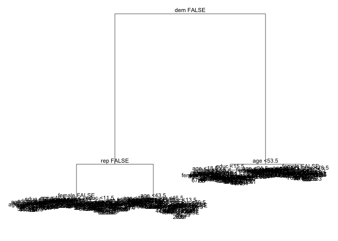

    ## Joining, by = ".id"

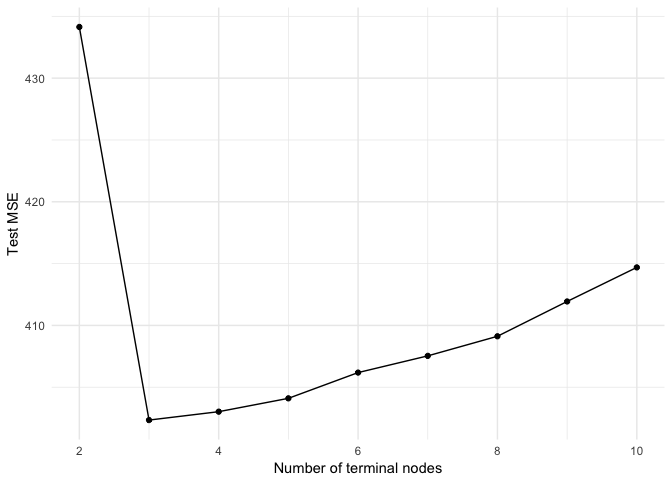

From the plot above, I decide the optimal level of tree complexity is with three terminal nodes. Here is the optimal tree:

This plot is the same as the one in exercise 2. If the person is a democratic, then the model estimates his/her feeling thermometer for Biden to be approximately 74.51. If the person is a republican, then the model estimate he/she has a feeling thermometer to be approximately 43.23. If the person is an independent, the model estimate he/she has a feeling thermometer to be approximately 57.6.

The test MSE is 406.417. Compared to the test MSE of full\_grown tree 481.49, pruning the tree does improve the test MSE.

**4. Use the bagging approach to analyze this data. What test MSE do you obtain? Obtain variable importance measures and interpret the results.**

    ## 
    ## Call:
    ##  randomForest(formula = biden ~ ., data = data1_split$train, importance = TRUE,      mtry = 5, ntree = 500) 
    ##                Type of random forest: regression
    ##                      Number of trees: 500
    ## No. of variables tried at each split: 5
    ## 
    ##           Mean of squared residuals: 497
    ##                     % Var explained: 8.94

I obtain the test MSE 483.716.

For regression trees, bigger values are better, in other words, the above plot indicates that when including the `dem` variable, the model test MSE will decrease more than 80%, when including the `rep` vairable, the model test MSE will decrease more than 20% percent, and the variable `age`, `educ`, and `female` don't affect the MSE decrease much. Therefore, for the biden bagged model, `dem` and `rep` are the most important predictors, whereas `age`, `educ`, and `female` are relatively unimportant.

**5. Use the random forest approach to analyze this data. What test MSE do you obtain? Obtain variable importance measures and interpret the results. Describe the effect of m, the number of variables considered at each split, on the error rate obtained.**

    ## 
    ## Call:
    ##  randomForest(formula = biden ~ ., data = data1_split$train, importance = TRUE,      ntree = 500) 
    ##                Type of random forest: regression
    ##                      Number of trees: 500
    ## No. of variables tried at each split: 1
    ## 
    ##           Mean of squared residuals: 407
    ##                     % Var explained: 25.4

The test MSE I obtain is 411.799.

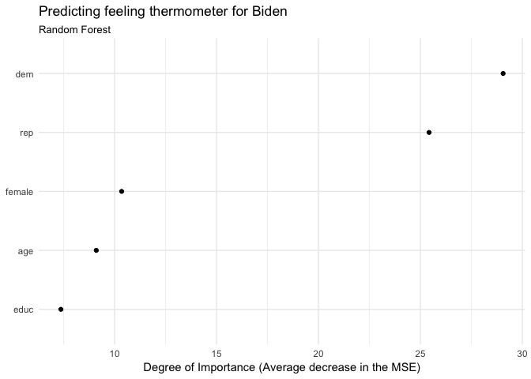

Simialr as part 4, when including the `dem` variable, the model test MSE will decrease about 29%, when including the `rep` vairable, the model test MSE will decrease about 27% percent, and the variable `age`, `educ`, and `female` don't affect the MSE decrease much. Therefore, for the biden random forest model, `dem` and `rep` are the most important predictors, whereas `age`, `educ`, and `female` are relatively unimportant.

The m (No. of variables tried at each split) = 1, compared to m = 5 in the bagging model, we can see the error rate has decreased.

**6. Use the boosting approach to analyze the data. What test MSE do you obtain? How does the value of the shrinkage parameter λ influence the test MSE?**

    ## Distribution not specified, assuming gaussian ...

    ## Distribution not specified, assuming gaussian ...

    ## Distribution not specified, assuming gaussian ...

    ## Distribution not specified, assuming gaussian ...

I got the following test MSE:

    ##          Shrinkage = 0.0001 Shrinkage = 0.001 Shrinkage = 0.01
    ## test MSE                558               539              443
    ##          Shrinkage = 0.1
    ## test MSE             399

With the value of the shrinkage parameter λ increasing, the test MSE decreases.

Part 2: Modeling voter turnout
==============================

**1. Use cross-validation techniques and standard measures of model fit (e.g. test error rate, PRE, ROC curves/AUC) to compare and evaluate at least five tree-based models of voter turnout. Select the best model and interpret the results using whatever methods you see fit (graphs, tables, model fit statistics, predictions for hypothetical observations, etc.)**

    ## Parsed with column specification:
    ## cols(
    ##   vote96 = col_double(),
    ##   mhealth_sum = col_double(),
    ##   age = col_double(),
    ##   educ = col_double(),
    ##   black = col_double(),
    ##   female = col_double(),
    ##   married = col_double(),
    ##   inc10 = col_double()
    ## )

First model: vote96 ~ mhealth\_sum

    ## Joining, by = ".id"

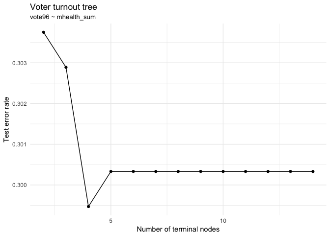

From the above plot, I can find the optimal level of tree complexity is with four terminal nodes.

Here is the plot of the optimal tree: 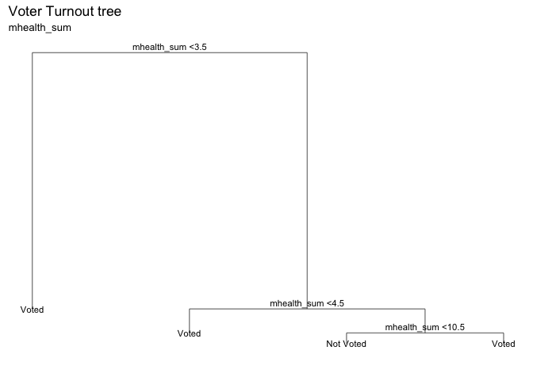

Second model: vote96 ~ mhealth\_sum + age

    ## Joining, by = ".id"

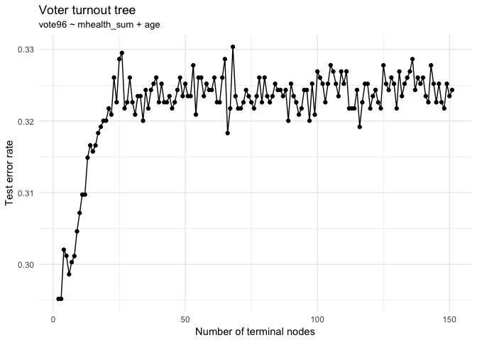

From the above plot, I can find the optimal level of tree complexity is with two or three terminal nodes.

Here is the plot of the optimal tree: 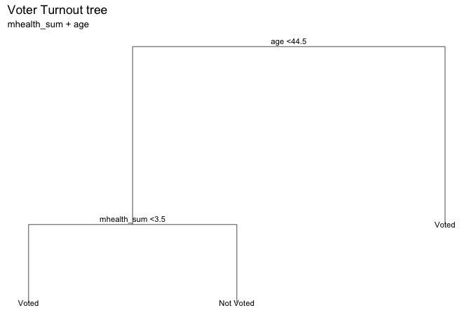

Third model: vote96 ~ mhealth\_sum + age + educ

    ## Joining, by = ".id"

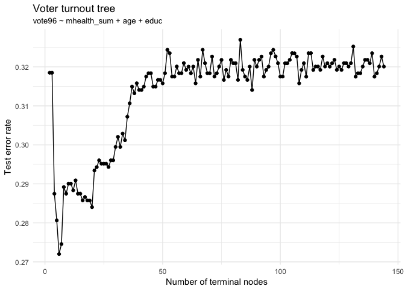

From the above plot, I can find the optimal level of tree complexity is with six terminal nodes.

Here is the plot of the optimal tree: 

Fourth model: vote96 ~ mhealth\_sum + age + educ + black

    ## Joining, by = ".id"

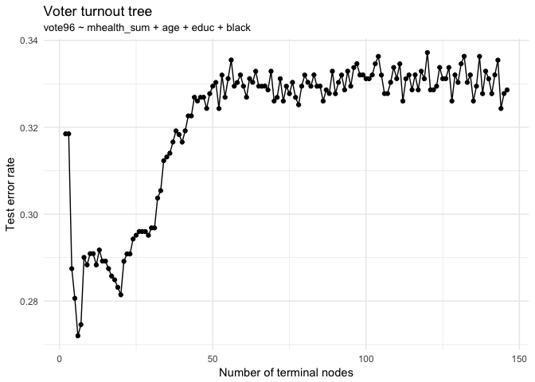

From the above plot, I can find the optimal level of tree complexity is with six terminal nodes.

Here is the plot of the optimal tree: 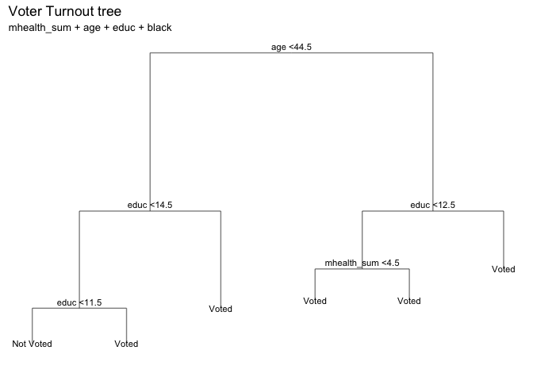

Fifth model: vote96 ~ mhealth\_sum + age + educ + black + inc10

    ## Joining, by = ".id"

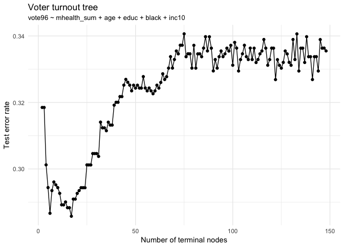

From the above plot, I can find the optimal level of tree complexity is with seventeen terminal nodes.

Here is the plot of the optimal tree: 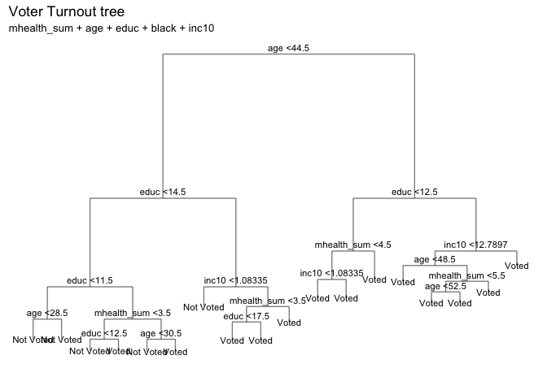

Let's use Random Forest to select the best model among the five above.

    ## 
    ## Call:
    ##  randomForest(formula = vote96 ~ mhealth_sum, data = data2, ntree = 500) 
    ##                Type of random forest: classification
    ##                      Number of trees: 500
    ## No. of variables tried at each split: 1
    ## 
    ##         OOB estimate of  error rate: 29.7%
    ## Confusion matrix:
    ##           Not Voted Voted class.error
    ## Not Voted       125   253       0.669
    ## Voted            93   694       0.118

    ## 
    ## Call:
    ##  randomForest(formula = vote96 ~ mhealth_sum + age, data = data2,      ntree = 500) 
    ##                Type of random forest: classification
    ##                      Number of trees: 500
    ## No. of variables tried at each split: 1
    ## 
    ##         OOB estimate of  error rate: 32.2%
    ## Confusion matrix:
    ##           Not Voted Voted class.error
    ## Not Voted        90   288       0.762
    ## Voted            87   700       0.111

    ## 
    ## Call:
    ##  randomForest(formula = vote96 ~ mhealth_sum + age + educ, data = data2,      ntree = 500) 
    ##                Type of random forest: classification
    ##                      Number of trees: 500
    ## No. of variables tried at each split: 1
    ## 
    ##         OOB estimate of  error rate: 28%
    ## Confusion matrix:
    ##           Not Voted Voted class.error
    ## Not Voted       145   233       0.616
    ## Voted            93   694       0.118

    ## 
    ## Call:
    ##  randomForest(formula = vote96 ~ mhealth_sum + age + educ + black,      data = data2, ntree = 500) 
    ##                Type of random forest: classification
    ##                      Number of trees: 500
    ## No. of variables tried at each split: 2
    ## 
    ##         OOB estimate of  error rate: 32.5%
    ## Confusion matrix:
    ##           Not Voted Voted class.error
    ## Not Voted       145   233       0.616
    ## Voted           146   641       0.186

    ## 
    ## Call:
    ##  randomForest(formula = vote96 ~ mhealth_sum + age + educ + black +      inc10, data = data2, ntree = 500) 
    ##                Type of random forest: classification
    ##                      Number of trees: 500
    ## No. of variables tried at each split: 2
    ## 
    ##         OOB estimate of  error rate: 30.9%
    ## Confusion matrix:
    ##           Not Voted Voted class.error
    ## Not Voted       153   225       0.595
    ## Voted           135   652       0.172

According to the OOB estimate of error rate for the five models above, I find that the third model (vote96 ~ mhealth\_sum + age + educ) is the best, with the lowest OOB estimate of error rate.

Let's recall the optimal tree for this model: 

If the person's age is below 44.5, we go to the left branch of the model; then if he/she has education year more than 14.5, the model estimates he/she voted, if he/she has education year less than 14.5, we again go to the left branch of the tree; if he/she has education year less than 11.5, the model estimates he/she not voted, if he/she has education year more than 11.5, the model estimates he/she voted. If the person's age is above 44.5, we go to the right branch of the model; then if he/she has education year more than 12.5, the model estimates he/she voted; if he/she has education year less than 12.5, we go to the left branch of the tree; then if he/she has mental health index less than 4.5, the model estimates he/she voted, if he/she has mental health index more than 4.5, the model also estimates he/she voted. Actually in this model, all people aged above 44.5 are estimated to have voted.

**2. Use cross-validation techniques and standard measures of model fit (e.g. test error rate, PRE, ROC curves/AUC) to compare and evaluate at least five SVM models of voter turnout. Select the best model and interpret the results using whatever methods you see fit (graphs, tables, model fit statistics, predictions for hypothetical observations, etc.)**

First model: Linear kernel

    ## 
    ## Parameter tuning of 'svm':
    ## 
    ## - sampling method: 10-fold cross validation 
    ## 
    ## - best parameters:
    ##  cost
    ##   0.1
    ## 
    ## - best performance: 0.289 
    ## 
    ## - Detailed performance results:
    ##    cost error dispersion
    ## 1 1e-03 0.331     0.0661
    ## 2 1e-02 0.327     0.0723
    ## 3 1e-01 0.289     0.0528
    ## 4 1e+00 0.290     0.0560
    ## 5 5e+00 0.292     0.0585
    ## 6 1e+01 0.292     0.0585
    ## 7 1e+02 0.292     0.0585

    ## 
    ## Call:
    ## best.tune(method = svm, train.x = vote96 ~ ., data = as_tibble(data2_split$train), 
    ##     ranges = list(cost = c(0.001, 0.01, 0.1, 1, 5, 10, 100)), 
    ##     kernel = "linear")
    ## 
    ## 
    ## Parameters:
    ##    SVM-Type:  C-classification 
    ##  SVM-Kernel:  linear 
    ##        cost:  0.1 
    ##       gamma:  0.125 
    ## 
    ## Number of Support Vectors:  524
    ## 
    ##  ( 263 261 )
    ## 
    ## 
    ## Number of Classes:  2 
    ## 
    ## Levels: 
    ##  Not Voted Voted

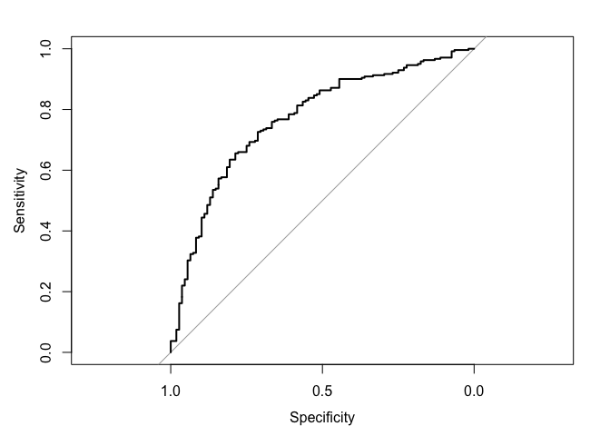

    ## Area under the curve: 0.769

Observing the linear kernel with all predictor variables, the model gets the best cost level at 0.1 and has a 10-fold CV error rate 28.9%, and the AUC is 0.769, indicating that we have 74.6% chance to get the correct prediction under this model.

Second model: Polynomial kernel

    ## 
    ## Parameter tuning of 'svm':
    ## 
    ## - sampling method: 10-fold cross validation 
    ## 
    ## - best parameters:
    ##  cost
    ##     1
    ## 
    ## - best performance: 0.292 
    ## 
    ## - Detailed performance results:
    ##    cost error dispersion
    ## 1 1e-03 0.331     0.0661
    ## 2 1e-02 0.331     0.0661
    ## 3 1e-01 0.319     0.0626
    ## 4 1e+00 0.292     0.0480
    ## 5 5e+00 0.292     0.0477
    ## 6 1e+01 0.298     0.0599
    ## 7 1e+02 0.314     0.0481

    ## 
    ## Call:
    ## best.tune(method = svm, train.x = vote96 ~ ., data = as_tibble(data2_split$train), 
    ##     ranges = list(cost = c(0.001, 0.01, 0.1, 1, 5, 10, 100)), 
    ##     kernel = "polynomial")
    ## 
    ## 
    ## Parameters:
    ##    SVM-Type:  C-classification 
    ##  SVM-Kernel:  polynomial 
    ##        cost:  1 
    ##      degree:  3 
    ##       gamma:  0.125 
    ##      coef.0:  0 
    ## 
    ## Number of Support Vectors:  521
    ## 
    ##  ( 271 250 )
    ## 
    ## 
    ## Number of Classes:  2 
    ## 
    ## Levels: 
    ##  Not Voted Voted

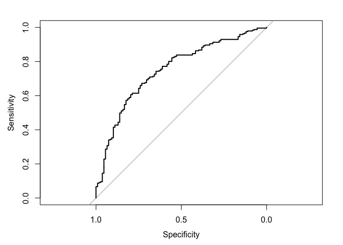

    ## Area under the curve: 0.749

Observing the polynomial kernel with all predictor variables, the model gets the best cost level at 1 and has a 10-fold CV error rate 29.2%, and the AUC is 0.749, indicating that we have 74.9% chance to get the correct prediction under this model.

Third model: Radial kernel

    ## 
    ## Parameter tuning of 'svm':
    ## 
    ## - sampling method: 10-fold cross validation 
    ## 
    ## - best parameters:
    ##  cost
    ##     5
    ## 
    ## - best performance: 0.287 
    ## 
    ## - Detailed performance results:
    ##    cost error dispersion
    ## 1 1e-03 0.331     0.0661
    ## 2 1e-02 0.331     0.0661
    ## 3 1e-01 0.299     0.0672
    ## 4 1e+00 0.293     0.0515
    ## 5 5e+00 0.287     0.0415
    ## 6 1e+01 0.297     0.0441
    ## 7 1e+02 0.308     0.0528

    ## 
    ## Call:
    ## best.tune(method = svm, train.x = vote96 ~ ., data = as_tibble(data2_split$train), 
    ##     ranges = list(cost = c(0.001, 0.01, 0.1, 1, 5, 10, 100)), 
    ##     kernel = "radial")
    ## 
    ## 
    ## Parameters:
    ##    SVM-Type:  C-classification 
    ##  SVM-Kernel:  radial 
    ##        cost:  5 
    ##       gamma:  0.125 
    ## 
    ## Number of Support Vectors:  505
    ## 
    ##  ( 272 233 )
    ## 
    ## 
    ## Number of Classes:  2 
    ## 
    ## Levels: 
    ##  Not Voted Voted

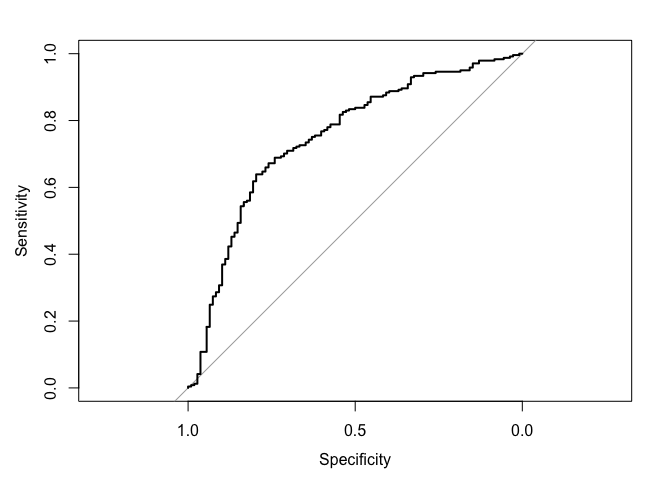

    ## Area under the curve: 0.75

Observing the radial kernel with all predictor variables, the model gets the best cost level at 5 and has a 10-fold CV error rate 28.7%, and the AUC is 0.75, indicating that we have 75% chance to get the correct prediction under this model.

Forth model: Radial kernel

    ## 
    ## Parameter tuning of 'svm':
    ## 
    ## - sampling method: 10-fold cross validation 
    ## 
    ## - best parameters:
    ##  cost
    ##     1
    ## 
    ## - best performance: 0.315 
    ## 
    ## - Detailed performance results:
    ##    cost error dispersion
    ## 1 1e-03 0.331     0.0661
    ## 2 1e-02 0.331     0.0661
    ## 3 1e-01 0.322     0.0789
    ## 4 1e+00 0.315     0.0746
    ## 5 5e+00 0.315     0.0746
    ## 6 1e+01 0.315     0.0746
    ## 7 1e+02 0.316     0.0732

    ## 
    ## Call:
    ## best.tune(method = svm, train.x = vote96 ~ mhealth_sum + inc10 + 
    ##     black + age, data = as_tibble(data2_split$train), ranges = list(cost = c(0.001, 
    ##     0.01, 0.1, 1, 5, 10, 100)), kernel = "linear")
    ## 
    ## 
    ## Parameters:
    ##    SVM-Type:  C-classification 
    ##  SVM-Kernel:  linear 
    ##        cost:  1 
    ##       gamma:  0.2 
    ## 
    ## Number of Support Vectors:  539
    ## 
    ##  ( 271 268 )
    ## 
    ## 
    ## Number of Classes:  2 
    ## 
    ## Levels: 
    ##  Not Voted Voted

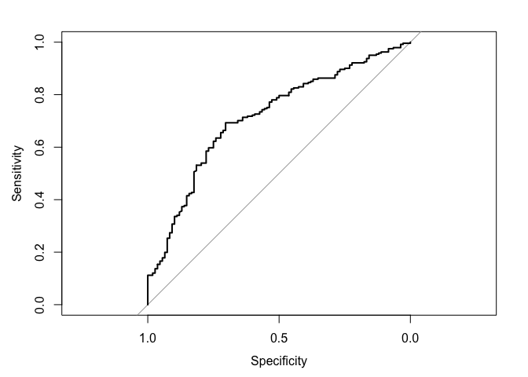

    ## Area under the curve: 0.715

Observing the linear kernel with predictor variables mhealth\_sum, inc10, black, and age, the model gets the best cost level at 1 and has a 10-fold CV error rate 31.5%, and the AUC is 0.715, indicating that we have 71.5% chance to get the correct prediction under this model.

Model 5: polynomial kernel with different degrees

    ## 
    ## Parameter tuning of 'svm':
    ## 
    ## - sampling method: 10-fold cross validation 
    ## 
    ## - best parameters:
    ##  cost degree
    ##     1      2
    ## 
    ## - best performance: 0.276 
    ## 
    ## - Detailed performance results:
    ##     cost degree error dispersion
    ## 1  1e-03      2 0.331     0.0661
    ## 2  1e-02      2 0.331     0.0661
    ## 3  1e-01      2 0.316     0.0652
    ## 4  1e+00      2 0.276     0.0453
    ## 5  5e+00      2 0.284     0.0545
    ## 6  1e+01      2 0.287     0.0582
    ## 7  1e+02      2 0.281     0.0607
    ## 8  1e-03      4 0.331     0.0661
    ## 9  1e-02      4 0.328     0.0697
    ## 10 1e-01      4 0.331     0.0647
    ## 11 1e+00      4 0.313     0.0539
    ## 12 5e+00      4 0.308     0.0503
    ## 13 1e+01      4 0.308     0.0541
    ## 14 1e+02      4 0.310     0.0526
    ## 15 1e-03      6 0.331     0.0661
    ## 16 1e-02      6 0.331     0.0665
    ## 17 1e-01      6 0.331     0.0630
    ## 18 1e+00      6 0.324     0.0502
    ## 19 5e+00      6 0.314     0.0453
    ## 20 1e+01      6 0.311     0.0473
    ## 21 1e+02      6 0.308     0.0435

    ## 
    ## Call:
    ## best.tune(method = svm, train.x = vote96 ~ ., data = as_tibble(data2_split$train), 
    ##     ranges = list(cost = c(0.001, 0.01, 0.1, 1, 5, 10, 100), 
    ##         degree = c(2, 4, 6)), kernel = "polynomial")
    ## 
    ## 
    ## Parameters:
    ##    SVM-Type:  C-classification 
    ##  SVM-Kernel:  polynomial 
    ##        cost:  1 
    ##      degree:  2 
    ##       gamma:  0.125 
    ##      coef.0:  0 
    ## 
    ## Number of Support Vectors:  508
    ## 
    ##  ( 258 250 )
    ## 
    ## 
    ## Number of Classes:  2 
    ## 
    ## Levels: 
    ##  Not Voted Voted

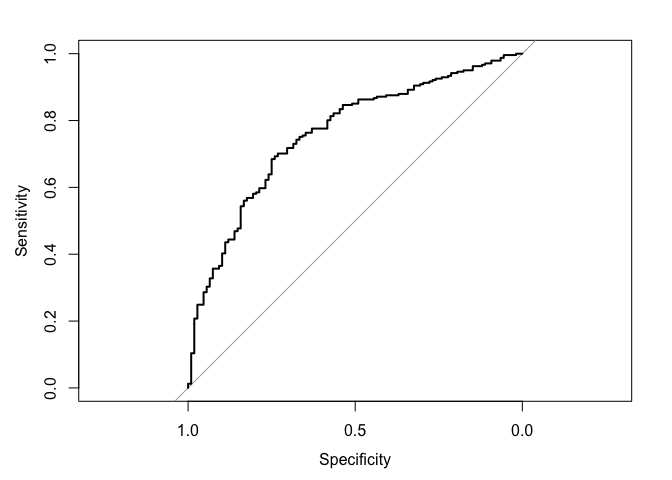

    ## Area under the curve: 0.76

Observing the polynomial kernel with all predictor variables and some different degree levels, the model gets the best cost level at 1 and best degree at 2. It has a 10-fold CV error rate 27.6%, and the AUC is 0.76, indicating that we have 76% chance to get the correct prediction under this model.

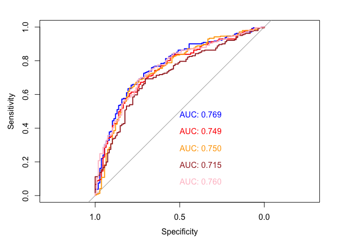

Comparing all five model's AUC as above, the first linear kernel model performed the best.

Part 3: OJ Simpson
==================

    ## Parsed with column specification:
    ## cols(
    ##   guilt = col_double(),
    ##   dem = col_double(),
    ##   rep = col_double(),
    ##   ind = col_double(),
    ##   age = col_double(),
    ##   educ = col_character(),
    ##   female = col_double(),
    ##   black = col_double(),
    ##   hispanic = col_double(),
    ##   income = col_character()
    ## )

**1. What is the relationship between race and belief of OJ Simpson's guilt? Develop a robust statistical learning model and use this model to explain the impact of an individual's race on their beliefs about OJ Simpson's guilt.**

Let's use the logistic regression model to estimate the relationship between race and belief.

    ## 
    ## Call:
    ## glm(formula = guilt ~ black + hispanic, family = binomial, data = data3_split$train)
    ## 
    ## Deviance Residuals: 
    ##    Min      1Q  Median      3Q     Max  
    ## -1.840  -0.625   0.637   0.637   1.947  
    ## 
    ## Coefficients:
    ##                  Estimate Std. Error z value Pr(>|z|)    
    ## (Intercept)         1.490      0.094   15.86   <2e-16 ***
    ## blackBlack         -3.023      0.215  -14.07   <2e-16 ***
    ## hispanicHispanic   -0.199      0.297   -0.67      0.5    
    ## ---
    ## Signif. codes:  0 '***' 0.001 '**' 0.01 '*' 0.05 '.' 0.1 ' ' 1
    ## 
    ## (Dispersion parameter for binomial family taken to be 1)
    ## 
    ##     Null deviance: 1217.66  on 991  degrees of freedom
    ## Residual deviance:  948.03  on 989  degrees of freedom
    ## AIC: 954
    ## 
    ## Number of Fisher Scoring iterations: 4

    ##               term estimate std.error statistic  p.value
    ## 1      (Intercept)    1.490     0.094     15.86 1.27e-56
    ## 2       blackBlack   -3.023     0.215    -14.07 5.82e-45
    ## 3 hispanicHispanic   -0.199     0.297     -0.67 5.03e-01

    ## Area under the curve: 0.731

The logistic model gives 0.816 accuracy and 0.731 AUC, and the p-value for each predictor is very small, which means that the model is pretty good. The model indicates that the an individual's race and their beliefs about OJ Simpson's guilt are negatively related. If the person is black, then the log-odds of perceiving Simpson as guilty would decrease by 2.991; if the person is Hispanic, then the log-odds of perceiving Simpson as guilty would decrease by 0.555.

**2. How can you predict whether individuals believe OJ Simpson to be guilty of these murders? Develop a robust statistical learning model to predict whether individuals believe OJ Simpson to be either probably guilty or probably not guilty and demonstrate the effectiveness of this model using methods we have discussed in class.**

Let's use k-fold cross validation method to estimate an optimal tree model for predicting whether individuals believe OJ Simpson to be guilty of these murders.

    ## Parsed with column specification:
    ## cols(
    ##   guilt = col_double(),
    ##   dem = col_double(),
    ##   rep = col_double(),
    ##   ind = col_double(),
    ##   age = col_double(),
    ##   educ = col_character(),
    ##   female = col_double(),
    ##   black = col_double(),
    ##   hispanic = col_double(),
    ##   income = col_character()
    ## )

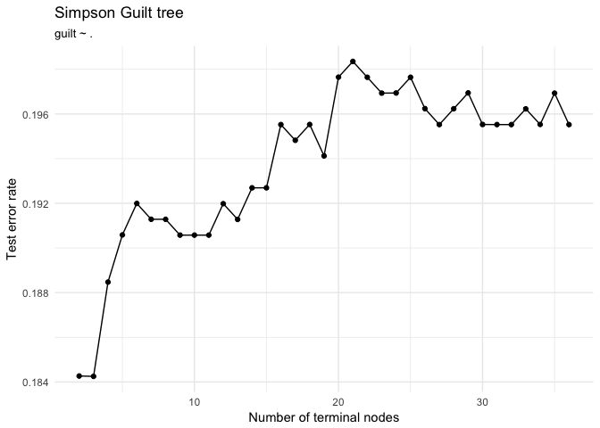

Using the k-fold cross validation method, we find the optimal tree model should have four terminal nodes. Let's visualize it.

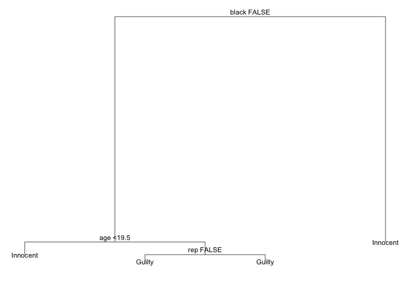

In this model, if the person is black, he/she will think Simpson innocent; if the person is not black, we will go to the left branch. Then if the person is aged less than 19.5, he/she will think Simpson innocent; if he/she is aged more than 19.5, he/she will think Simpson is guilty, no matter he/she is republican or not.

Using the following random forest method, we can justify the validation of this model.

    ## 
    ## Call:
    ##  randomForest(formula = guilt ~ rep + age + black, data = na.omit(as_tibble(data3)),      type = "classification") 
    ##                Type of random forest: regression
    ##                      Number of trees: 500
    ## No. of variables tried at each split: 1
    ## 
    ##           Mean of squared residuals: 0.15
    ##                     % Var explained: 30.1
