Problem set \#9: nonparametric methods and unsupervised learnings
================
Yiqing Zhu

-   [Part 1: Attitudes towards feminists](#part-1-attitudes-towards-feminists)
-   [Part 2: Voter turnout and depression](#part-2-voter-turnout-and-depression)
-   [Part 3: Colleges](#part-3-colleges)
-   [Part 4: Clustering states](#part-4-clustering-states)

Part 1: Attitudes towards feminists
===================================

**1. Split the data into a training and test set (70/30%).**

    ## Parsed with column specification:
    ## cols(
    ##   feminist = col_integer(),
    ##   female = col_integer(),
    ##   age = col_integer(),
    ##   educ = col_integer(),
    ##   income = col_integer(),
    ##   dem = col_integer(),
    ##   rep = col_integer()
    ## )

**2. Calculate the test MSE for KNN models with K = 5, 10, 15, …, 100, using whatever combination of variables you see fit. Which model produces the lowest test MSE?**

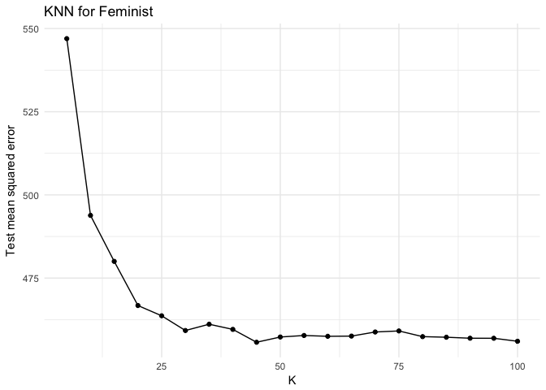

I used all the variables (`female`, `age`, `dem`, `rep`, `educ`, `income`) to estimate the KNN model.

From the plot above, the KNN models with K = 45 or 100 produce the lowest test MSE.

The lowest test MSE is 456.009.

**3. Calculate the test MSE for weighted KNN models with K = 5, 10, 15, …, 100, using the same combination of variables as before. Which model produces the lowest test MSE?**

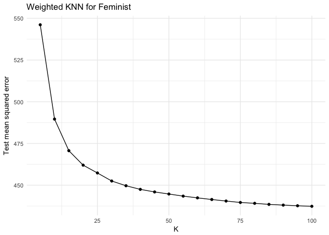

From the plot above, the Weighted KNN model with K = 100 produces the lowest test MSE.

The lowest test MSE is 437.366.

**4. Compare the test MSE for the best KNN/wKNN model(s) to the test MSE for the equivalent linear regression, decision tree, boosting, and random forest methods using the same combination of variables as before. Which performs the best? Why do you think this method performed the best, given your knowledge of how it works?**

    ## # A tibble: 6 × 2
    ##               model `test MSE`
    ##               <chr>      <dbl>
    ## 1               KNN        456
    ## 2              wKNN        437
    ## 3 linear regression        435
    ## 4     Decision Tree        436
    ## 5          Boosting        431
    ## 6     Random Forest        461

For every model above, I use cross validation method to determine the values of parameters in order to obtain the lowest test MSE from the family of one model.

As the above table shows, the boosting model obtains the lowest test MSE, indicating its best performance among these models. This is because the process of boosting helps to reduce the size of residuals, collect small trees which maintain considerable predictive power, as well as prevent over-fitting. Therefore, it is expected to be one of the best performed supervisied model.

Part 2: Voter turnout and depression
====================================

**1. Split the data into a training and test set (70/30).**

    ## Parsed with column specification:
    ## cols(
    ##   vote96 = col_double(),
    ##   mhealth_sum = col_double(),
    ##   age = col_double(),
    ##   educ = col_double(),
    ##   black = col_double(),
    ##   female = col_double(),
    ##   married = col_double(),
    ##   inc10 = col_double()
    ## )

**2. Calculate the test error rate for KNN models with K = 1, 2, …, 10, using whatever combination of variables you see fit. Which model produces the lowest test MSE?**

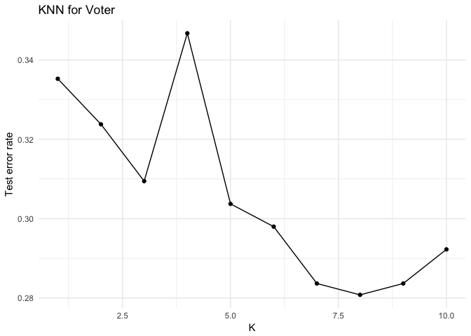

I used all the variables (`mhealth_sum`, `age`, `educ`, `black`, `female`, `married`, `inc10`) to estimate the KNN model.

From the plot above, the KNN model with K = 8 produces the lowest test error rate.

The lowest test error rate is 0.281.

**3. Calculate the test error rate for weighted KNN models with K = 1, 2, …, 10 using the same combination of variables as before. Which model produces the lowest test error rate?**

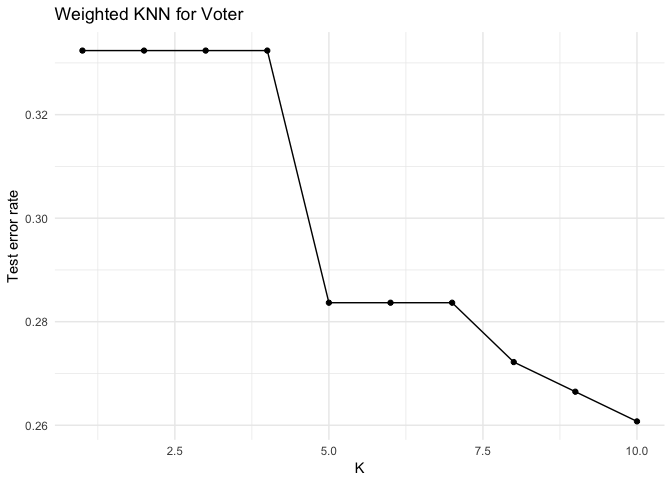

From the plot above, the Weighted KNN model with K = 10 produces the lowest test error rate.

The lowest test error rate is 0.261.

**4. Compare the test error rate for the best KNN/wKNN model(s) to the test error rate for the equivalent logistic regression, decision tree, boosting, random forest, and SVM methods using the same combination of variables as before. Which performs the best? Why do you think this method performed the best, given your knowledge of how it works?**

    ## # A tibble: 7 × 2
    ##                 model `error rate`
    ##                 <chr>        <dbl>
    ## 1                 KNN        0.281
    ## 2                wKNN        0.261
    ## 3 logistic regression        0.162
    ## 4       Decision Tree        0.241
    ## 5            Boosting        0.167
    ## 6       Random Forest        0.333
    ## 7                 SVM        0.143

For every model above, I use cross validation method to determine the values of parameters in order to obtain the lowest test MSE from the family of one model.

As shown in the above table, the SVM model with linear kernal obtains the lowest test error rate, indicating its best performance. This is because SVM model is based on the test observation’s location relative to the separating hyperplane, which may have much more flexibility than the other mehtods.

Part 3: Colleges
================

**Perform PCA analysis on the college dataset and plot the first two principal components. Describe the results. What variables appear strongly correlated on the first principal component? What about the second principal component? **

    ## Parsed with column specification:
    ## cols(
    ##   Private = col_character(),
    ##   Apps = col_double(),
    ##   Accept = col_double(),
    ##   Enroll = col_double(),
    ##   Top10perc = col_double(),
    ##   Top25perc = col_double(),
    ##   F.Undergrad = col_double(),
    ##   P.Undergrad = col_double(),
    ##   Outstate = col_double(),
    ##   Room.Board = col_double(),
    ##   Books = col_double(),
    ##   Personal = col_double(),
    ##   PhD = col_double(),
    ##   Terminal = col_double(),
    ##   S.F.Ratio = col_double(),
    ##   perc.alumni = col_double(),
    ##   Expend = col_double(),
    ##   Grad.Rate = col_double()
    ## )

    ##                 PC1     PC2      PC3     PC4     PC5      PC6       PC7
    ## Private     -0.0890  0.3459 -0.15139 -0.2311  0.0443 -0.03145  0.178345
    ## Apps        -0.1996 -0.3436 -0.00482 -0.3050 -0.0230 -0.00862 -0.061047
    ## Accept      -0.1538 -0.3726  0.02535 -0.3175  0.0314  0.01307 -0.015474
    ## Enroll      -0.1178 -0.3997  0.02758 -0.2048 -0.0657 -0.04306 -0.008237
    ## Top10perc   -0.3603  0.0162 -0.00468  0.1075 -0.3882 -0.05992 -0.144406
    ## Top25perc   -0.3448 -0.0177  0.05895  0.1463 -0.4098  0.02061 -0.079889
    ## F.Undergrad -0.0941 -0.4107  0.01681 -0.1430 -0.0466 -0.04574  0.000282
    ## P.Undergrad  0.0175 -0.2931 -0.14937  0.0978  0.3280 -0.19678  0.162965
    ## Outstate    -0.3277  0.1915 -0.06636 -0.1288  0.2033 -0.02030  0.094948
    ## Room.Board  -0.2665  0.0940 -0.18211 -0.1824  0.5263  0.18303  0.145142
    ## Books       -0.0572 -0.0573 -0.66231  0.0893 -0.1586  0.64831 -0.141371
    ## Personal     0.0719 -0.1928 -0.46956  0.2906 -0.1880 -0.34706  0.609167
    ## PhD         -0.3033 -0.1162  0.20849  0.4646  0.2059  0.07189  0.031347
    ## Terminal    -0.3039 -0.1042  0.14672  0.4604  0.2656  0.13832  0.003847
    ## S.F.Ratio    0.2103 -0.2044  0.29225  0.0749 -0.0515  0.46937  0.275797
    ## perc.alumni -0.2367  0.1941  0.15944 -0.0100 -0.2151 -0.05166  0.286361
    ## Expend      -0.3330  0.0703 -0.21732 -0.0072  0.0571 -0.28447 -0.280168
    ## Grad.Rate   -0.2731  0.1178  0.17262 -0.2682 -0.1412  0.22185  0.501653
    ##                  PC8     PC9    PC10    PC11     PC12    PC13      PC14
    ## Private     -0.03231  0.0850 -0.2596  0.6798 -0.24569  0.4006 -1.01e-02
    ## Apps         0.09918 -0.0841 -0.0581 -0.0104 -0.04181  0.0374  5.95e-01
    ## Accept       0.05423 -0.1653 -0.0895  0.1426 -0.00455 -0.0736  2.93e-01
    ## Enroll      -0.06326 -0.1168 -0.0741  0.1058  0.03426  0.0591 -4.46e-01
    ## Top10perc    0.09714  0.3557 -0.0594 -0.0221  0.01518  0.0444  9.19e-05
    ## Top25perc    0.07806  0.4224 -0.0436  0.1382  0.23123 -0.0998  2.38e-02
    ## F.Undergrad -0.08393 -0.0498 -0.0504  0.0784  0.06250  0.0697 -5.25e-01
    ## P.Undergrad -0.56989  0.5432  0.2295  0.0451 -0.12114 -0.0228  1.26e-01
    ## Outstate     0.00412 -0.0114 -0.1973  0.0643 -0.25544 -0.8037 -1.28e-01
    ## Room.Board   0.24867  0.2442 -0.1899 -0.2808  0.48583  0.2014 -7.23e-02
    ## Books       -0.22503 -0.1333  0.0758  0.0204 -0.03719 -0.0249  1.18e-02
    ## Personal     0.30143 -0.1216 -0.1169 -0.0468  0.02038 -0.0379  4.01e-02
    ## PhD          0.07055 -0.1629  0.0560  0.1705 -0.09081  0.1172  1.25e-01
    ## Terminal     0.00463 -0.2332  0.0212  0.1784  0.01067  0.0544 -5.91e-02
    ## S.F.Ratio    0.09450  0.2845 -0.4477 -0.2162 -0.42475  0.0584 -1.92e-02
    ## perc.alumni -0.64039 -0.2905 -0.3463 -0.2600  0.21823  0.0916  1.03e-01
    ## Expend       0.03757 -0.0562 -0.0330 -0.4550 -0.54829  0.2993 -9.86e-02
    ## Grad.Rate    0.07773 -0.0226  0.6600 -0.1031 -0.15593  0.0729 -7.00e-02
    ##                PC15     PC16      PC17      PC18
    ## Private     -0.0232 -0.00537 -0.044796  0.007795
    ## Apps        -0.0807  0.13375 -0.458603  0.363283
    ## Accept      -0.0333 -0.14635  0.512188 -0.547462
    ## Enroll       0.0815  0.02848  0.403907  0.607174
    ## Top10perc    0.1062  0.69742  0.148018 -0.146308
    ## Top25perc   -0.1487 -0.61690 -0.050194  0.080606
    ## F.Undergrad  0.0534  0.00984 -0.569725 -0.408938
    ## P.Undergrad -0.0196  0.02068  0.050648  0.008963
    ## Outstate     0.0572  0.04195 -0.078622  0.048023
    ## Room.Board   0.0560  0.00351  0.028890  0.000368
    ## Books        0.0677 -0.00927 -0.001728  0.000603
    ## Personal    -0.0266 -0.00304  0.012911 -0.001211
    ## PhD          0.6864 -0.11269 -0.035842  0.015128
    ## Terminal    -0.6746  0.15786  0.020277  0.007143
    ## S.F.Ratio   -0.0449 -0.02172  0.014827 -0.001297
    ## perc.alumni  0.0268 -0.00815 -0.000483 -0.019705
    ## Expend      -0.0809 -0.22876  0.038317 -0.034863
    ## Grad.Rate   -0.0372 -0.00327  0.006996 -0.013507

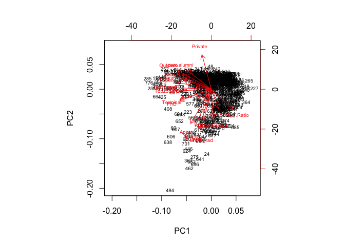

`Terminal`, `PhD`, `Top10perc`, `Top25perc`, `Expend`, `Room.board`, `Grad.Rate`, and `Outstate` are strongly correlated on the first principle component. The first principal component places approximately equal weight on `Terminal`, `PhD`, `Top10perc`, `Top25perc`, `Expend`, `Room.board`, `Grad.Rate`, and `Outstate`. We can tell this because these vectors’ length on the first principal component dimension are roughly the same. Intuitively this makes sense because `Terminal`, `PhD`, `Top10perc`, `Top25perc`, `Grad.Rate` are all measures of great univerisity, which may results in higher `Expend` and `Room.board`, and attract more `Outstate` students. Therefore, it makes sense that these variables are strongly correlated.

`Apps`, `Accept`, `Enroll`, `F.Undergrad`, and `P.Undergrad` are strongly correlated on the second principle component. The second principal component places approximately equal weight on `Apps`, `Accept`, `Enroll`, `F.Undergrad`, and `P.Undergrad`. We can tell this because these vectors’ length on the second principal component dimension are roughly the same. Intuitively this makes sense because `Apps`, `Accept`, `Enroll`, `F.Undergrad`, and `P.Undergrad` are all measures of the number of students in a university. Therefore, it makes sense that these variables are strongly correlated.

Part 4: Clustering states
=========================

**1. Perform PCA on the dataset and plot the observations on the first and second principal components.**

    ## -------------------------------------------------------------------------

    ## You have loaded plyr after dplyr - this is likely to cause problems.
    ## If you need functions from both plyr and dplyr, please load plyr first, then dplyr:
    ## library(plyr); library(dplyr)

    ## -------------------------------------------------------------------------

    ## 
    ## Attaching package: 'plyr'

    ## The following objects are masked from 'package:dplyr':
    ## 
    ##     arrange, count, desc, failwith, id, mutate, rename, summarise,
    ##     summarize

    ## The following object is masked from 'package:purrr':
    ## 
    ##     compact

    ## Parsed with column specification:
    ## cols(
    ##   State = col_character(),
    ##   Murder = col_double(),
    ##   Assault = col_integer(),
    ##   UrbanPop = col_integer(),
    ##   Rape = col_double()
    ## )

    ##             PC1    PC2    PC3    PC4
    ## Murder   -0.536  0.418 -0.341  0.649
    ## Assault  -0.583  0.188 -0.268 -0.743
    ## UrbanPop -0.278 -0.873 -0.378  0.134
    ## Rape     -0.543 -0.167  0.818  0.089

**2. Perform K-means clustering with K = 2. Plot the observations on the first and second principal components and color-code each state based on their cluster membership. Describe your results.**

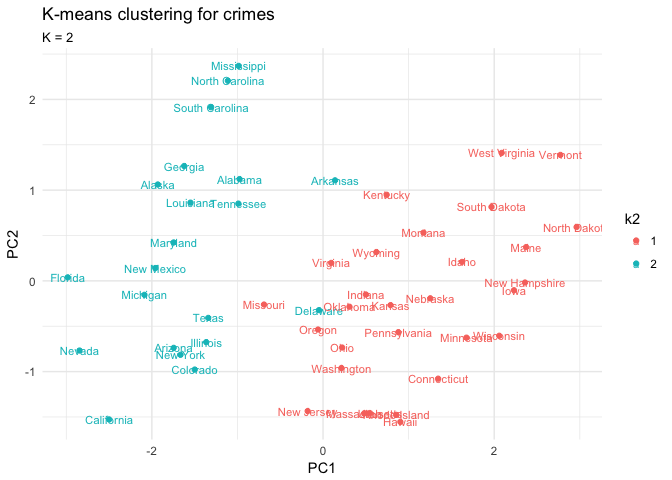

As shown in the plot above, states are classified into two distinctive groups on the first principal component, while on the second principal component, there is no obvious distinction. We can explain the results as according to the PC1 classification, the group 2 states have higher crime rate, while group 1 states have lower criminal rate.

**3. Perform K-means clustering with K = 4. Plot the observations on the first and second principal components and color-code each state based on their cluster membership. Describe your results.**

As similar to the previous plot, states are classified into four distinctive groups on the first principal component, while on the second principal component, there is no obvious distinction. We can explain the results as according to the PC1 classification, the group 4 states have highest crime rate, then group 3 and 2, while group 1 states have the lowest criminal rate.

**4. Perform K-means clustering with K = 3. Plot the observations on the first and second principal components and color-code each state based on their cluster membership. Describe your results.**

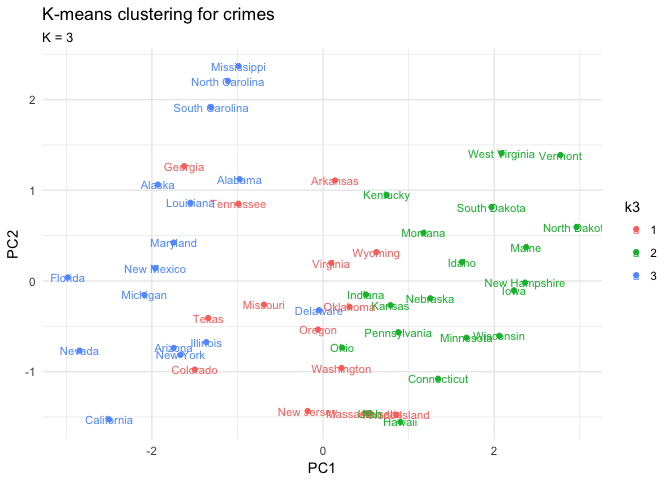

As similar to the previous plots, states are classified into three distinctive groups on the first principal component, while on the second principal component, there is no obvious distinction. We can explain the results as according to the PC1 classification, the group 3 states have highest crime rate, then group 2, while group 1 states have the lowest criminal rate.

**5. Perform K-means clustering with K = 3 on the first two principal components score vectors, rather than the raw data. Describe your results and compare them to the clustering results with K = 3 based on the raw data.**

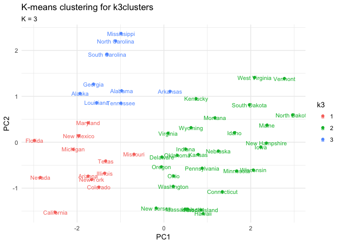

As shown in the plot above, states are clearly classified into three distinctive groups based on both the first and second principal component, which seems to be a better classfication than the simply classification on the raw data.

**6. Using hierarchical clustering with complete linkage and Euclidean distance, cluster the states.**

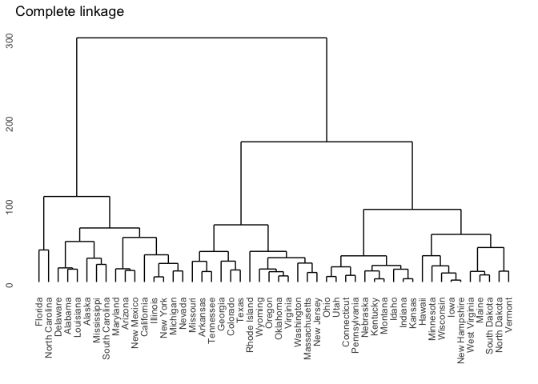

**7. Cut the dendrogram at a height that results in three distinct clusters. Which states belong to which clusters?**

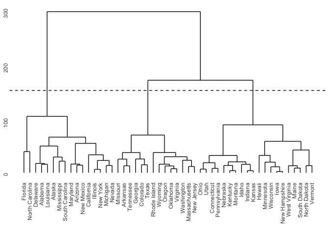

    ## $title
    ## [1] "Complete linkage"
    ## 
    ## attr(,"class")
    ## [1] "labels"

How the states belonging to each clusters are showed below:

    ## # A tibble: 50 × 2
    ##         State Cluster
    ##         <chr>   <int>
    ## 1     Alabama       1
    ## 2      Alaska       1
    ## 3     Arizona       1
    ## 4  California       1
    ## 5    Delaware       1
    ## 6     Florida       1
    ## 7    Illinois       1
    ## 8   Louisiana       1
    ## 9    Maryland       1
    ## 10   Michigan       1
    ## # ... with 40 more rows

**8. Hierarchically cluster the states using complete linkage and Euclidean distance, after scaling the variables to have standard deviation 1. What effect does scaling the variables have on the hierarchical clustering obtained? In your opinion, should the variables be scaled before the inter-observation dissimilarities are computed? Provide a justification for your answer.**

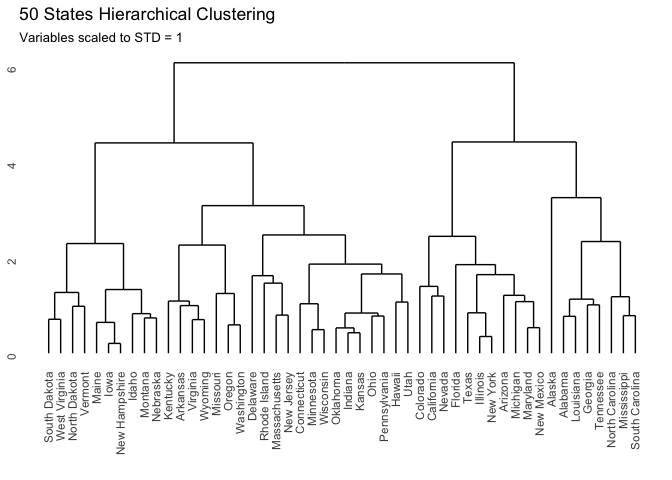

Scaling the variables to have standard deviation of 1 places equal weight on each variable in the hierarchical clustering.

In my opinion, the variables shoule be scaled before the inter-observation dissimilarities are computed. Because the units of variables in a dataset may be different, so it is possible that variables with smaller absolute values can be disregraded though they may be essential determinants. Besides, as shown in the above plots, after scaling, more states are included in cluster 3. Therefore I think variables should be scaled before the inter-observation dissimilarities are computed.
