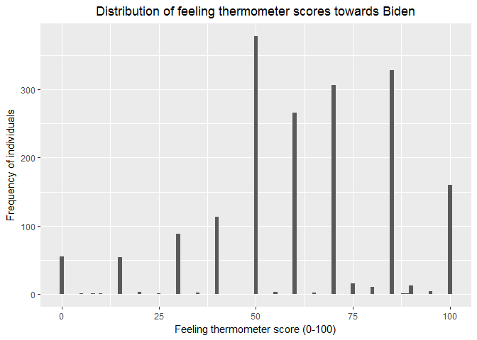

Problem set \#5: linear regression
================
Yinxian Zhang

-   [Describe the data (1 point)](#describe-the-data-1-point)
-   [Simple linear regression (2 points)](#simple-linear-regression-2-points)
-   [Multiple linear regression (2 points)](#multiple-linear-regression-2-points)
-   [Multiple linear regression model (with even more variables!) (3 points)](#multiple-linear-regression-model-with-even-more-variables-3-points)
-   [Interactive linear regression model (2 points)](#interactive-linear-regression-model-2-points)

``` r
library(dplyr)
library(ggplot2)
library(readr)
library(modelr)
library(broom)
library(tidyr)

bidata <- read.csv("biden.csv", header=TRUE)
```

Describe the data (1 point)
===========================

Below is a histogram of `biden` with a binwidth of `1`.

``` r
ggplot(bidata, mapping = aes(x = biden)) +
  geom_histogram(binwidth = 1) +
  labs(title = "Distribution of feeling thermometer scores towards Biden",
       x = "Feeling thermometer score (0-100)",
       y = "Frequency of individuals") +
  theme(plot.title = element_text(hjust = 0.5))
```



As shown in the above histogram, the majority of respondents gave Biden a score of 50 or above, suggesting that citizens on average hold a positive attitude towards Biden. Particularly, many citizens gave a score as high as 85 - 100, indicating their extreme warmth towards the then vice president in 2008.

Simple linear regression (2 points)
===================================

Now we turn to estimate the following linear regression:

*Y* = *β*<sub>0</sub> + *β*<sub>1</sub>*X*<sub>1</sub>

where *Y* is the Joe Biden feeling thermometer and *X*<sub>1</sub> is age.

``` r
bi_age <- lm(biden ~ age, data = bidata)
model1 <- summary(bi_age)
#str(model1)
tidy(model1)
```

    ##          term    estimate  std.error statistic       p.value
    ## 1 (Intercept) 59.19736008 1.64791889 35.922496 1.145056e-213
    ## 2         age  0.06240535 0.03266815  1.910281  5.625534e-02

Regress `biden` on `age`, the estimated coefficient of `age` is 0.0624054 with a standard error of 0.0326682, and the intercept is 59.1973601 with a standard error of 1.6479189.

1.  Is there a relationship between the predictor and the response?
    There is barely a statistically significant relationship between the predictor `age` and the response, Joe Biden feeling thermometer (hereafer `biden`). With a p value of 0.0562553, the relationship is only marginally significant at *α* = 0.1 level (meaning that we can reject the null hypothesis - there is no relationship - at a 90% confidence level.) Moreover, the size of effect of `age` is also small, with an estimated coefficient of 0.0624054. Therefore, we conclude that there is a relationship between `age` and `biden`, but it is weak and only marginally significant.

2.  How strong is the relationship between the predictor and the response?
    As discussed above, the size of effect of the predictor is very small(coefficient = 0.062) and is only marginally significant(p value = 0.056). The relationship is pretty weak.

3.  Is the relationship between the predictor and the response positive or negative?
    Within one standard error, we predict that the predictor has a positive, albeit small, effect on the reponse (hence a positive relationship). However, within the 95% confidence intervals, the predictor might have none or even negative effect on the response.

4.  Report the *R*<sup>2</sup> of the model. What percentage of the variation in `biden` does `age` alone explain? Is this a good or bad model?
    The *R*<sup>2</sup> of the model is 0.0020176, indicating that `age` alone only explains 0.2% of the variation in `biden`. This model does not adequatley explain the variation in the dependent variable, and thus is not a good enough model.

5.  What is the predicted `biden` associated with an `age` of 45? What are the associated 95% confidence intervals?
    The predicted `biden` with an `age` of 45 is 62.0056, and the associated 95% confidence intervals are \[60.912, 63.099\], meaning that there is a 95% chance that a 45 years old respondent would give Biden a score between 60.9 and 63.

``` r
grid <- bidata %>%
  data_grid(age) %>%
  add_predictions(bi_age)
(age45 <- augment(bi_age, newdata = data_frame(age = c(45))) %>%
  mutate(ymin = .fitted - .se.fit * 1.96,
         ymax = .fitted + .se.fit * 1.96))
```

    ##   age .fitted   .se.fit     ymin     ymax
    ## 1  45 62.0056 0.5577123 60.91248 63.09872

1.  Plot the response and predictor. Draw the least squares regression line.

``` r
ggplot(bidata, aes(age)) +
  geom_point(aes(y = biden)) +
  geom_line(aes(y = pred), data = grid, color = "red", size = 1) +
  labs(title = 'Relationship between feeling thermometer and respondent age',
       x = 'respondent age',
       y = 'Feeling thermometer score') +
  theme(plot.title = element_text(hjust = 0.5))
```


As shown by the least squares regression line in the above plot, there is a very weak positive relationship between respondent's age and their feelings toward Mr.Biden. The older the respondent, the slightly warmer he/she would feel toward Mr.Biben.

Multiple linear regression (2 points)
=====================================

It is unlikely `age` alone shapes attitudes towards Joe Biden. So we turn to estimate the following linear regression:

*Y* = *β*<sub>0</sub> + *β*<sub>1</sub>*X*<sub>1</sub> + *β*<sub>2</sub>*X*<sub>2</sub> + *β*<sub>3</sub>*X*<sub>3</sub>

where *Y* is the Joe Biden feeling thermometer, *X*<sub>1</sub> is age, *X*<sub>2</sub> is gender, and *X*<sub>3</sub> is education.

``` r
bi_mul <- lm(biden ~ age + female + educ, data = bidata)
model2 <- summary(bi_mul)
tidy(model2)
```

    ##          term    estimate  std.error statistic      p.value
    ## 1 (Intercept) 68.62101396 3.59600465 19.082571 4.337464e-74
    ## 2         age  0.04187919 0.03248579  1.289154 1.975099e-01
    ## 3      female  6.19606946 1.09669702  5.649755 1.863612e-08
    ## 4        educ -0.88871263 0.22469183 -3.955251 7.941295e-05

Regress feeling scores (`biden`) on respondent age (`age`), gender(`female`) and educational level (`educ`), we estimated that the coefficient of `age` is 0.0418792 with a standard error of 0.0324858; the coefficient of `female` is 6.1960695 with a standard error of 1.096697; the coefficient of `educ` is -0.8887126 with a standard error of 0.2246918.

1.  Is there a statistically significant relationship between the predictors and response?
    After we added the predictors of gender and education into the model, `age` becomes completely insignificant with a p value of 0.198, meaning that there is no relationship between respondent age and their feelings toward Biden if hold constant gender and education. Nevertheless, there are statistically significant relationship between respondent' feeling score and their gender (p value = 1.86e-08, significant at *α* = 0.01 level) and educational level(p value = 7.94e-05, significant at *α* = 0.01 level), holding age constant.

2.  What does the parameter for `female` suggest?
    The estimated coefficent of `female` is 6.196, suggesting that when holding age and education constant, female respondent' feeling thermometer score was on average 6.196 higher than that of male respondents.

3.  Report the *R*<sup>2</sup> of the model. What percentage of the variation in `biden` does age, gender, and education explain? Is this a better or worse model than the age-only model?
    The *R*<sup>2</sup> of the model is 0.0272273, indicating that age, gender and education jointly explain 2.72% of the variation in `biden`. Though still not explain much of the variation, this model has been improved from the age-only model which only explains 0.2%.

4.  Generate a plot comparing the predicted values and residuals, drawing separate smooth fit lines for each party ID type. Is there a problem with this model? If so, what?

``` r
grid2 <- bidata %>%
  add_predictions(bi_mul, var = 'pred0') %>%
  add_residuals(bi_mul) 

dem <- filter(grid2, dem == 1)
rep <- filter(grid2, rep == 1)
ind <- filter(grid2, dem == 0 & rep == 0)

res_dem <- lm(resid ~ pred0, data = dem)
res_rep <- lm(resid ~ pred0, data = rep)
res_ind <- lm(resid ~ pred0, data = ind)

dem <- dem %>%
  add_predictions(res_dem)
rep <- rep %>%
  add_predictions(res_rep)
ind <- ind %>%
  add_predictions(res_ind)

ggplot(grid2, aes(pred0)) +
  geom_point(aes(y = resid)) +
  geom_smooth(method = 'loess', aes(y = resid , colour = 'Democrat'), data = dem, size = 1) +
  geom_smooth(method = 'loess', aes(y = resid, colour = 'Republican'), data = rep, size = 1) +
  geom_smooth(method = 'loess', aes(y = resid, colour = 'Independent'), data = ind, size = 1) +
  scale_colour_manual('Party ID', values=c('Democrat'='blue', 'Republican'='red', 'Independent'='green')) + 
  labs(title = "The Predicted Value and Residuals of Model 2",
        x = "Predicted Values of Feeling Scores",
        y = "Residuals") +
  theme(plot.title = element_text(hjust = 0.5))
```


Ideally, the residuals should be randomly and evently dispersed around 0 without any clear pattern. Examining the residuals of model 2, we find that the variance of residuals are larger at higher scores, implying a problem of heteroscedsticity. They also show a clear pattern -- there seems to be a negative relationship between residuals and the predicted values. Moreover, on average the range of residuals is large, meaning that our prediction is not very precise. Lastly, the smooth fit lines for different party identities also show that scores of the democrat tend to be overestimated whereas the republican and the independent tend to be underestimated.

Multiple linear regression model (with even more variables!) (3 points)
=======================================================================

We now turn to the third model to estimate the following linear regression:

*Y* = *β*<sub>0</sub> + *β*<sub>1</sub>*X*<sub>1</sub> + *β*<sub>2</sub>*X*<sub>2</sub> + *β*<sub>3</sub>*X*<sub>3</sub> + *β*<sub>4</sub>*X*<sub>4</sub> + *β*<sub>5</sub>*X*<sub>5</sub>

where *Y* is the Joe Biden feeling thermometer, *X*<sub>1</sub> is age, *X*<sub>2</sub> is gender, *X*<sub>3</sub> is education, *X*<sub>4</sub> is Democrat, and *X*<sub>5</sub> is Republican.

``` r
bi_ful = lm(biden ~ age + female + educ + dem + rep, data = bidata)
model3 <- summary(bi_ful)
tidy(model3)
```

    ##          term     estimate std.error  statistic      p.value
    ## 1 (Intercept)  58.81125899 3.1244366  18.822996 2.694143e-72
    ## 2         age   0.04825892 0.0282474   1.708438 8.772744e-02
    ## 3      female   4.10323009 0.9482286   4.327258 1.592601e-05
    ## 4        educ  -0.34533479 0.1947796  -1.772952 7.640571e-02
    ## 5         dem  15.42425563 1.0680327  14.441745 8.144928e-45
    ## 6         rep -15.84950614 1.3113624 -12.086290 2.157309e-32

The parameters and standard errors are reported in the above regression summary.

1.  Did the relationship between gender and Biden warmth change?
    The direction of the relationship between gender and Biden warmth in model 3 did not change, still showing a positive association. However, the magnitude of the relationship is weakened, indicating that gender has a smaller size of effect on people's feeling towards Biden than in model 2.

2.  Report the *R*<sup>2</sup> of the model. What percentage of the variation in `biden` does age, gender, education, and party identification explain? Is this a better or worse model than the age + gender + education model?
    The *R*<sup>2</sup> of model 3 is 0.2815391, meaning that age, gender, educaton and party affiliation jointly explain 28.15% of the variations in `biden`. Even adjusting for the number of parameters added, the Adjusted *R*<sup>2</sup> is still as large as 0.2795. This is a much better model than model 2 (age + gender + education) which only explains about 2% of the variations.

3.  Generate a plot comparing the predicted values and residuals, drawing separate smooth fit lines for each party ID type. By adding variables for party ID to the regression model, did we fix the previous problem?

``` r
grid3 <- bidata %>%
  add_predictions(bi_ful, var = 'predf') %>%
  add_residuals(bi_ful) 

dem2 <- filter(grid3, dem == 1)
rep2 <- filter(grid3, rep == 1)
ind2 <- filter(grid3, dem == 0 & rep == 0)

res_dem2 <- lm(resid ~ predf, data = dem2)
res_rep2 <- lm(resid ~ predf, data = rep2)
res_ind2 <- lm(resid ~ predf, data = ind2)

dem2 <- dem2 %>%
  add_predictions(res_dem2)
rep2 <- rep2 %>%
  add_predictions(res_rep2)
ind2 <- ind2 %>%
  add_predictions(res_ind2)

ggplot(grid3, aes(predf)) +
  geom_point(aes(y = resid)) +
  geom_smooth(method = 'loess', aes(y = resid, colour = 'Democrats'), data = dem2, size = 1) +
  geom_smooth(method = 'loess', aes(y = resid, colour = 'Republican'), data = rep2, size = 1) +
  geom_smooth(method = 'loess', aes(y = resid, colour = 'Independent'), data = ind2, size = 1) +
  scale_colour_manual('Party ID', values=c('Democrats'='blue', 'Republican'='red', 'Independent'='green')) + 
  labs(title = "The Predicted Value and Residuals of Model 3",
        x = "Predicted Values of Feeling Scores",
        y = "Residuals") +
  theme(plot.title = element_text(hjust = 0.5))
```


The fit lines of Democrats and Republicans in model 3 now look better than in model 2 (Independent is more or less the same), such that in general they are now closer to 0, meaning that we now have less errors in predicting feeling scores of Republicans and Democrats. However, there is still a problem of heteroscadescity and a clear negative association between the residuals and the predicted values. Also, the range of residuals is still large.

Interactive linear regression model (2 points)
==============================================

Now we turn to investigate the **interactive** relationship between gender and party ID by estimating the following linear regression:

*Y* = *β*<sub>0</sub> + *β*<sub>1</sub>*X*<sub>1</sub> + *β*<sub>2</sub>*X*<sub>2</sub> + *β*<sub>3</sub>*X*<sub>1</sub>*X*<sub>2</sub>

where *Y* is the Joe Biden feeling thermometer, *X*<sub>1</sub> is gender, and *X*<sub>2</sub> is Democrat.

``` r
bidata2 <- filter(bidata, dem == 1 | rep == 1)
bi_int = lm(biden ~ female + dem + female*dem, data = bidata2)
tidy(bi_int)
```

    ##          term  estimate std.error statistic       p.value
    ## 1 (Intercept) 39.382022  1.455363 27.059928 4.045546e-125
    ## 2      female  6.395180  2.017807  3.169371  1.568102e-03
    ## 3         dem 33.687514  1.834799 18.360328  3.295008e-66
    ## 4  female:dem -3.945888  2.471577 -1.596506  1.106513e-01

Parameters for `female`, `dem` and the interactive term `female*dem` and associated standard errors are all listed in the above regression summary.

1.  Estimate predicted Biden warmth feeling thermometer ratings and 95% confidence intervals for female Democrats, female Republicans, male Democrats, and male Republicans. Does the relationship between party ID and Biden warmth differ for males/females? Does the relationship between gender and Biden warmth differ for Democrats/Republicans?

``` r
grid4 <- bidata %>%
  data_grid(female, dem) %>%
  add_predictions(bi_int)
  
pred_int <- bidata2 %>%
   data_grid(female, dem) %>%
   augment(bi_int, newdata = .) %>%
   mutate(lower_bound = .fitted - .se.fit * 1.96,
          upper_bound = .fitted + .se.fit * 1.96) %>%
  mutate(female = ifelse(female == 0, 'Male', 'Female'),
         dem = ifelse(dem == 0, 'Republicans', 'Democrats'))

colnames(pred_int)<- c("gender","party","predicted ratings", 'std. errors', 'lower 95% CI', 'upper 95% CI')

pred_int
```

    ##   gender       party predicted ratings std. errors lower 95% CI
    ## 1   Male Republicans          39.38202   1.4553632     36.52951
    ## 2   Male   Democrats          73.06954   1.1173209     70.87959
    ## 3 Female Republicans          45.77720   1.3976638     43.03778
    ## 4 Female   Democrats          75.51883   0.8881114     73.77813
    ##   upper 95% CI
    ## 1     42.23453
    ## 2     75.25949
    ## 3     48.51662
    ## 4     77.25953

The predicted Biden feeling scores and 95% confidence intervals for the four types of respondents are reported in the above summary.

Now we can examine the interactive effect between gender and partisan affiliation. First, gender has an effect on the relationship between party ID and Biden warmth. Specifically, though republicans' feeling scores are predicted to 33.69 lower than Democrats, female republicans did rate about 6 higher than male republicants, with the predicted scores of 45.78 and 39.38 respectively. Likewise, though Democrat are prediposed to support Biden, female Democrats had even warmer feelings than male did. Their ratings were about 2.5 higher than male Democrats, with the predicted feeling scores being 75.52 and 73.07 respectively. This indicates that Biden was especially appealing to females no matter among Democrats or Republicans, lending him a small yet clear advantage among female voters. Note that gender effect was even stronger among Republicans.

Second, partisan affiliation strongly moderates the relationship between gender and Biden warmth. Though females' feeling scores are predicted to be 6.395 higher than that of males, regardless of their party ID, there is a big gap between Democrats and Republicans. Particularlly, Republicans' feeling thermometer ratings are predicted to be approximately 30 less than that of Democrats, irrespecitve of gender. (The gap is even larger among male respondents, though, predicted to be about 33 higher among Democrats.) This indiates that, not suprisingly, Biden's feeling themometer ratings suffered from the partisan identity conflict, with his own party members being much more likely to support him than the opponant party.
