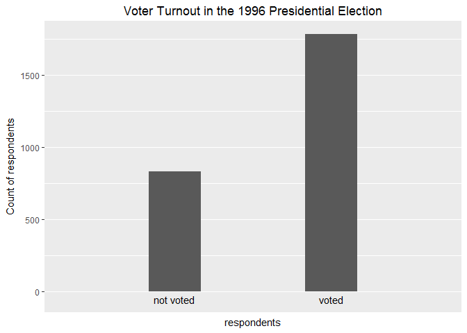
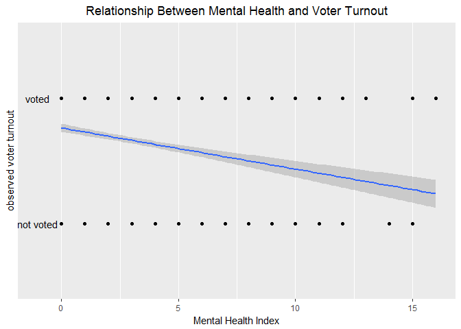

Problem set \#6: Generalized linear models
================
Yinxian Zhang

-   [Part 1: Modeling voter turnout](#part-1-modeling-voter-turnout)
    -   [Describe the data (1 point)](#describe-the-data-1-point)
    -   [Basic model (3 points)](#basic-model-3-points)
    -   [Multiple variable model (3 points)](#multiple-variable-model-3-points)
-   [Part 2: Modeling tv consumption](#part-2-modeling-tv-consumption)
    -   [Estimate a regression model (3 points)](#estimate-a-regression-model-3-points)

``` r
library(dplyr)
library(ggplot2)
library(readr)
library(modelr)
library(broom)
library(tidyverse)
library(pROC)

gss <- read.csv("gss2016.csv", header=TRUE)
health <- read.csv("mental_health.csv", header=TRUE)
```

Part 1: Modeling voter turnout
==============================

Describe the data (1 point)
---------------------------

1.  Below is a histogram summarizing the voter turnout in the 1996 presidential election.
    As shown in the histogram, voters almost doubled people who did not vote. Specifically, the unconditional probability of a given individual turning out to vote is 70.6920904%.

``` r
ggplot(health, aes(x = vote96)) +
  geom_histogram(binwidth = 0.3) +
  labs(title = "Voter Turnout in the 1996 Presidential Election", y = "Count of respondents") +
  theme(plot.title = element_text(hjust = 0.5)) + 
  scale_x_discrete(name="respondents", breaks=c("0", "1")) +
  annotate("text", x=0, y=-50, label= "not voted") +
  annotate("text", x=0.9, y=-50, label= "voted")
```



1.  Below is a scatterplot of the relationship between mental health and observed voter turnout.
    The overlayed smoothing line tells us that the higher mental health index one have (meaning one is more depressed), the less possible that she or he would vote in the presidential election. Nevertheless, this linear smoothing line is problematic. The response is a binary variable indicating whether a specific respondent voted, therefore the only possible values are 0 and 1. Moreover, the mental health index is a fixed metric with a min of 0 and a max of 16. Yet the linear smoothing line is continuous and may extend infinitely in both directions of the index, as well as not being bounded between 0 and 1 on the y axis.

``` r
ggplot(health, aes(mhealth_sum, vote96)) +
  geom_point() +
  geom_smooth(method = lm) + 
  scale_y_discrete(name = "observed voter turnout", breaks = c(0, 1)) + 
  labs(title = "Relationship Between Mental Health and Voter Turnout",
       x = "Mental Health Index") +
  theme(plot.title = element_text(hjust = 0.5)) +
  annotate("text", x=-1, y=0, label= "not voted") +
  annotate("text", x=-1, y=1, label= "voted")
```



Basic model (3 points)
----------------------

We thus turn to estimate a logistic regression model of the relationship between mental health and voter turnout.
1. The relationship between mental health and voter turnout is statistically significant at the *α* = 0.01 level with a p value of 3.13e-13. This relationship is also substantively significant with an estimated parameter of about -0.14, which can be tanslated to an odds-ratio of 0.8663423, meaning that the odds of voting in the predisential election are just 0.866 times as high for each additional unit increase of the mental health index. This is a substantial difference in terms of turnout rate. Statistics of the basic logit model are summarized below.

``` r
voter_health <- glm(vote96 ~ mhealth_sum, data = health, family = binomial)
summary(voter_health)
```

    ## 
    ## Call:
    ## glm(formula = vote96 ~ mhealth_sum, family = binomial, data = health)
    ## 
    ## Deviance Residuals: 
    ##     Min       1Q   Median       3Q      Max  
    ## -1.6834  -1.2977   0.7452   0.8428   1.6911  
    ## 
    ## Coefficients:
    ##             Estimate Std. Error z value Pr(>|z|)    
    ## (Intercept)  1.13921    0.08444  13.491  < 2e-16 ***
    ## mhealth_sum -0.14348    0.01969  -7.289 3.13e-13 ***
    ## ---
    ## Signif. codes:  0 '***' 0.001 '**' 0.01 '*' 0.05 '.' 0.1 ' ' 1
    ## 
    ## (Dispersion parameter for binomial family taken to be 1)
    ## 
    ##     Null deviance: 1672.1  on 1321  degrees of freedom
    ## Residual deviance: 1616.7  on 1320  degrees of freedom
    ##   (1510 observations deleted due to missingness)
    ## AIC: 1620.7
    ## 
    ## Number of Fisher Scoring iterations: 4

1.  The estimated parameter for mental health is -0.1434752, meaning that for each one-unit increase in the mental health index, the natural logarithm of the odds ratio of voter turnout would be decreased by 0.143. The relationship between mental health and the log-odds of voter turnout is shown in the graph below.

``` r
logit2prob <- function(x){
  exp(x) / (1 + exp(x))
}
prob2odds <- function(x){
  x / (1 - x)
}

vote_pred <- health %>%
  add_predictions(voter_health) %>%
  mutate(prob = logit2prob(pred)) %>%
  mutate(odds = prob2odds(prob))

ggplot(vote_pred, aes(mhealth_sum)) + 
  geom_line(aes(y = pred)) + 
  labs(title = "Relationship between mental health and the log-odds of voter turnout", 
       x = "Mental Health Index",
       y = "Log odds of Voter Turnout") + 
  theme(plot.title = element_text(hjust = 0.5))
```


1.  The estimated parameter for mental health can also be tanslated to odds ratio 0.8663423, meaning that the odds of voter turnout are only 0.866 times as high for each additional unit increase of the mental health index. The graph of the relationship between mental health and the odds of voter turnout is as below.

``` r
ggplot(vote_pred, aes(mhealth_sum)) + 
  geom_line(aes(y = odds)) + 
  labs(title = "Relationship between mental health and the odds of voter turnout", 
       x = "Mental Health Index",
       y = "Odds of Voter Turnout") + 
  theme(plot.title = element_text(hjust = 0.5))
```


1.  The estimated parameter for mental health can still be translated to predicted probabilities. Below is a graph of the relationship between mental health and the probability of voter turnout. The first difference for an increase in the mental health index from 1 to 2 is 0.02917824 and from 5 to 6 is 0.03477821.

``` r
ggplot(vote_pred, aes(mhealth_sum)) + 
  geom_line(aes(y = prob)) + 
  labs(title = "Relationship between mental health and the probabilities of voter turnout", 
       x = "Mental Health Index",
       y = "Predicted probability of Voter Turnout") + 
  theme(plot.title = element_text(hjust = 0.5))
```


``` r
constant = voter_health$coefficients[1]
param = voter_health$coefficients[2]

prob1 <- exp(constant + param) / (1 + exp(constant + param))
prob2 <- exp(constant + (2 * param)) / (1 + exp(constant + (2 * param)))
diff1 <-  prob1 - prob2 

prob5 <- exp(constant + (5 * param)) / (1 + exp(constant + (5 * param)))
prob6 <- exp(constant + (6 * param)) / (1 + exp(constant + (6 * param)))
diff2 <- prob5 - prob6

#diff1
#diff2
```

1.  We now turn to evaluate the basic model. As calculated below, given a threshold of 0.5, the accuracy rate for this model is 0.67776 and the proportional reduction in error (PRE) for this model is 0.01616628. Moreover, the AUC for this model is 0.6243. Based on these statistics, we conclude that this is not a good model, since this model only reduced 1.62% of the prediction error of a useless classifier. The overall performance of the classifier across all potential thresholds is okay, but not very satisfying. The AUC is 0.6243, which is an increase, though not substantive, from 0.5, an AUC of a random guess of voter turnout.

``` r
vote_accuracy <- health %>%
  add_predictions(voter_health) %>%
  mutate(pred = logit2prob(pred),
         prob = pred,
         pred = as.numeric(pred > .5))

acc_rate <- mean(vote_accuracy$vote96 == vote_accuracy$pred, na.rm = TRUE)


PRE <- function(model){
  y <- model$y
  y.hat <- round(model$fitted.values)
  E1 <- sum(y != median(y))
  E2 <- sum(y != y.hat)
  PRE <- (E1 - E2) / E1
  return(PRE)
}

PRE_vote <- PRE(voter_health)

library(pROC)
AUC <- auc(vote_accuracy$vote96, vote_accuracy$prob)

#acc_rate
#PRE_vote
#AUC
```

Multiple variable model (3 points)
----------------------------------

We now use some other variables in the dataset and estimate a multiple variable logistic regression model of voter turnout. 1. The three components of the GLM for this model are:
\* Probability distribution (random component): the response variable is `vote96` which only has possible values of 1 and 0, meaning voted or not voted. This variable is most likely drawn from a Bernoulli distribution. The probability distribution function is omitted here.
\* Linear predictor: we include `age`, `educ`, `female` and `inc10` in the linear predictor. (formula omitted here.)
\* Link function: we need to use a logit function to map the linear predictor onto the distribution. Thus the link function is
$$\\pi\_i = \\frac{e^{eta\_i}}{1 + e^{eta\_i}}$$

1.  We estimate the above model and the logistic regression statistics are summarized below:

``` r
# Define a full and a null model. 
voter_all <- glm(vote96 ~ age + educ + female + inc10, data = health, family = binomial)
summary(voter_all)
```

    ## 
    ## Call:
    ## glm(formula = vote96 ~ age + educ + female + inc10, family = binomial, 
    ##     data = health)
    ## 
    ## Deviance Residuals: 
    ##     Min       1Q   Median       3Q      Max  
    ## -2.5612  -1.0671   0.5646   0.8677   2.2788  
    ## 
    ## Coefficients:
    ##              Estimate Std. Error z value Pr(>|z|)    
    ## (Intercept) -4.247243   0.335542 -12.658  < 2e-16 ***
    ## age          0.043147   0.003359  12.845  < 2e-16 ***
    ## educ         0.211728   0.020516  10.320  < 2e-16 ***
    ## female       0.064464   0.097777   0.659     0.51    
    ## inc10        0.080386   0.016829   4.777 1.78e-06 ***
    ## ---
    ## Signif. codes:  0 '***' 0.001 '**' 0.01 '*' 0.05 '.' 0.1 ' ' 1
    ## 
    ## (Dispersion parameter for binomial family taken to be 1)
    ## 
    ##     Null deviance: 2868.8  on 2310  degrees of freedom
    ## Residual deviance: 2525.8  on 2306  degrees of freedom
    ##   (521 observations deleted due to missingness)
    ## AIC: 2535.8
    ## 
    ## Number of Fisher Scoring iterations: 4

1.  Interpret the results.

To explain the variations of people's political participation, most theories focus on the resources that one can mobilize in order to participate in politics, for instance time, money and civic skills. Guided by this resource model and using data from the 1998 General Social Survey, we would exmaine several variables, including age, education, gender and income, in order to understand why people participate in the 2016 presidential election.

First, in terms of age, our hypothesis is that older American would be more likely to vote for the presidential election, since they typically have more time and most likely higher incomes to facilitate political participation. The logit regression supports this hypothesis, showing that age is significantly and positively correlated with voter turnout with a p value smaller than 2e-16, controlling for other variables in the model. Nevertheless, the marginal effect of age on voter turnout is very small: the log-odds of voter turnout will increase by only 0.043 for every one year increase in people's age. In other words, the odds of voter turnout are 1.0440914 times as high for each additional year of people's age, holding all other variables constant. This relationship is not as substantial as we expected.

Second, we expect to see that individuals with more years of education are generally more likely to vote, since education would typically help people understand the value and benefits of participating in politics. Not surprisingly, the logit regression shows that education is significantly and substantially associated with voter turnout with a p value smaller than 2e-16 and an estimated parameter of 0.212. This means that the log-odds of voter turnout will increase by 0.212 for every one year increase in people's years of education, controlling for all other variables in the model. In other words, the odds of voter turnout are 1.2361479 times as high for each additional year in people's education, holding all other variables constant.

Third, since women are more frequently staying at home to take care of children as well as earning a lower income, we expect that women are less likely to participate in elections than men. Surprisingly, however, the logit regression shows that gender is not significantly associated with voter turnout. The p value is as high as 0.51. This challenges the conventional wisdom about women's political participation, showing that women are equally interested in politics.

Lastly, we suspect that people with higher income have more financial resouces to devote into politics and are typically more eger to influence politics. The logit regression supports this hypothesis, showing that the odds of voter turnout are 1.0832871 times as high for each additional $10k increase in people's income, holding all other variables constant. This relationship is significant with a p value of 1.78e-06. But, again, the marginal effect of income on turnout is quite small and is thus relatively negligible.

Next, we turn to evaluate this multiple variable model. Does it provide a better prediction than the basic model we examined at the first place? We calculate the AUC score to check the overall performance of the classifier across all potential thresholds.

``` r
vote_accuracy2 <- health %>%
  add_predictions(voter_all) %>%
  mutate(pred = logit2prob(pred),
         prob = pred,
         pred = as.numeric(pred > .5))

library(pROC)
AUC2 <- auc(vote_accuracy2$vote96, vote_accuracy2$prob)

AUC2
```

    ## Area under the curve: 0.7333

As shown above, the AUC score of this multiple variable model is 0.733. Recall that the AUC score of the basic model is 0.6243. Apparently, the current model works better in the sense that it substantively improves the performance of the classifier from 0.5, an AUC score of a random guess of voter turnout.

To summarize, our multiple variable logit regression analysis improves a bit from the basic model. It shows that voter turnout is substantially and significantly correlated with education, and, to a lesser degree, associated with age and income, though the relationships are not substantive. Moreover, there's no statistically significant difference between women and men in terms of voting in the 1996 presidential election. The graph below shows the association between education and voter turnout, controlling for other variables in the model. It also shows that the difference between women and men is not significant at all.

``` r
logit2prob <- function(x){
  exp(x) / (1 + exp(x))
}

voter_mul <- health %>%
  data_grid(female, educ, .model=voter_all) %>%
  add_predictions(voter_all) %>%
  mutate(prob = logit2prob(pred)) 

ggplot(voter_mul, aes(x = educ, y = prob, color = ifelse(female == 1, 'Female', 'Male'))) +
  geom_smooth() +
  labs(title = 'Relationship between Education and Voter Turnout',
    x = 'Years of Education', 
    y = 'Predicted Probability of Voter Turnout') +
  guides("Gender", color = guide_legend('')) + 
  scale_y_continuous(breaks = c(0, .25, .5, .75, 1))
```


Part 2: Modeling tv consumption
===============================

In this part of the problem set, we derive and estimate a series of models to explain and predict TV consumption based on the 2016 GSS data.

Estimate a regression model (3 points)
--------------------------------------

1.  The three components of the GLM for this model are:
    -   Probability distribution: the response variable is `tvhours`, the number of hours of TV watched per day. This variable is a count variable, and thus is ideally drawn from a Poisson distribution.
    -   Linear predictor: we include 5 variables in the linear predictor, including `age`,`educ`,`female`,`black` and `social_connect`.
    -   Link function: I will use the log function for the Poisson distribution:
        *μ*<sub>*i*</sub> = log(*e**t**a*<sub>*i*</sub>)

2.  The statistics of the Poisson regression model has been summarized below.

``` r
tv_po <- glm(tvhours ~ age + educ + female + black + social_connect, data=gss, family=poisson)
summary(tv_po)
```

    ## 
    ## Call:
    ## glm(formula = tvhours ~ age + educ + female + black + social_connect, 
    ##     family = poisson, data = gss)
    ## 
    ## Deviance Residuals: 
    ##     Min       1Q   Median       3Q      Max  
    ## -2.9578  -0.8954  -0.2607   0.4296   6.8361  
    ## 
    ## Coefficients:
    ##                  Estimate Std. Error z value Pr(>|z|)    
    ## (Intercept)     1.2275272  0.0853253  14.386  < 2e-16 ***
    ## age             0.0064338  0.0008226   7.821 5.23e-15 ***
    ## educ           -0.0435208  0.0045871  -9.488  < 2e-16 ***
    ## female          0.0134626  0.0285540   0.471    0.637    
    ## black           0.4570133  0.0336784  13.570  < 2e-16 ***
    ## social_connect  0.0254568  0.0180835   1.408    0.159    
    ## ---
    ## Signif. codes:  0 '***' 0.001 '**' 0.01 '*' 0.05 '.' 0.1 ' ' 1
    ## 
    ## (Dispersion parameter for poisson family taken to be 1)
    ## 
    ##     Null deviance: 2651.3  on 1709  degrees of freedom
    ## Residual deviance: 2290.2  on 1704  degrees of freedom
    ##   (2800 observations deleted due to missingness)
    ## AIC: 6937.3
    ## 
    ## Number of Fisher Scoring iterations: 5

1.  Interpret the results.

To explain the variations in people's time of watching TV, sociological theories focus on one's social network and the socio-economic factors that influence people's health habits. Using data from the 1996 General Social Survey, we would exmaine several variables, including age, education, gender, race and social connections, in order to understand what kind of people would devote more time in watching TV.

First, in terms of age, we expect to see that older American would watch TV for a longer time, since they typically have more time and would be more willing to stay at home. The Poisson regression supports this hypothesis, showing that age is significantly and positively correlated with TV watched hours with a p value of 5.23e-15, controlling for other variables in the model. Nevertheless, the marginal effect of age on TV watched hours is very small: for every one year increase in age, the log-count of TV watched hours per day is estimated to increase by only 0.0068551. In other words, the predicted mean count of TV hours would just be 1.0069793 times as high for every one additional year in age, holding all other variables constant. This relationship is thus not substantive.

Second, we expect to see that individuals with more years of education generally watch TV for a shorter time, since more educated people would attach more importance to healthy habits and would rather, for instance, doing workouts in leisure time. The Poisson regression validates this hypothesis, showing that education is significantly and negatively associated with number of hours of watching TV. The p value is smaller than 2e-16 and the estimated parameter is -0.043. This means that the log-odds of TV watched hours will decrease by 0.043 for every one year increase in people's years of education, controlling for all other variables in the model. In other words, the predicted mean count of TV hours would be 0.9579114 times as high for every one additional year in education, holding all other variables constant. The effect of education is more substantive than that of age, though still not ideal.

Third, in terms of socio-economic status, women and the blacks are generally disadvantaged and are thus more vulnerable to unhealthy habits. We thus expect to see women and blacks watch TV for a longer time than men and non-black people. The Poisson regression shows that, somewhat suprisingly, race is strongly and postively associated with TV watched hours. Holding all other variables constant,the log-odds of TV watched hours of black people will be 0.457 higher than that of non-black people. In other words, the predicted mean count of blacks' TV watched hours would be 1.5793289 times of that of non-blacks. This effect is strong and significant, with a p value smaller than 2e-16. However, the Poisson regression shows that gender is not significantly associated with TV watched hours. The p value is as high as 0.637, meaning that there is no significant difference between women and men in terms of the time they spend in watching TV.

Lastly, we suspect that people with more social connections would be more willing to social with other people and thus less likely to watch TV at home. Unexpectedly, the Poisson regression suggests that there is no significant difference between people having low or moderate or high level of social connections. This challenges our stereotype that people having less friends would be more likely to stay at home watching TV.

To summarize, race has a strong effect on people's habit of watching TV, whereas gender and social connections do not appear to influence the hours of watching TV. Moreover, the increase in age may suggest an increase in the hours of watching TV, while the increase in years of education may suggest a decrease in the hours of watching TV. Neverthelss, such effects are minimal and limited. We plot the relationship between education and TV watching, differed by race, in the below graph. It shows the significant gap between black and non-black controlling for other variables.

``` r
tv_pred <- gss %>%
  data_grid(educ, black, .model = tv_po) %>%
  add_predictions(tv_po) %>%
  mutate(count = exp(pred)) 

ggplot(tv_pred, aes(x = educ, y = count, color = ifelse(black == 1, 'Black', 'Non-black'))) +
  geom_smooth() +
  labs(title = 'Relationship between Education and TV Watching',
    x = 'Years of Education', 
    y = 'Predicted Counts of Hours of TV Watched Per Day') +
  guides(name="Race", color = guide_legend('')) 
```


Finally, we turn to evaluate this Poisson model. Is the model over or under-dispersed?

``` r
tv_quasimod <- glm(tvhours ~ age + educ + female + black + social_connect, family = "quasipoisson", data = gss)
summary(tv_quasimod)
```

    ## 
    ## Call:
    ## glm(formula = tvhours ~ age + educ + female + black + social_connect, 
    ##     family = "quasipoisson", data = gss)
    ## 
    ## Deviance Residuals: 
    ##     Min       1Q   Median       3Q      Max  
    ## -2.9578  -0.8954  -0.2607   0.4296   6.8361  
    ## 
    ## Coefficients:
    ##                 Estimate Std. Error t value Pr(>|t|)    
    ## (Intercept)     1.227527   0.105809  11.601  < 2e-16 ***
    ## age             0.006434   0.001020   6.307 3.61e-10 ***
    ## educ           -0.043521   0.005688  -7.651 3.32e-14 ***
    ## female          0.013463   0.035409   0.380    0.704    
    ## black           0.457013   0.041763  10.943  < 2e-16 ***
    ## social_connect  0.025457   0.022425   1.135    0.256    
    ## ---
    ## Signif. codes:  0 '***' 0.001 '**' 0.01 '*' 0.05 '.' 0.1 ' ' 1
    ## 
    ## (Dispersion parameter for quasipoisson family taken to be 1.537763)
    ## 
    ##     Null deviance: 2651.3  on 1709  degrees of freedom
    ## Residual deviance: 2290.2  on 1704  degrees of freedom
    ##   (2800 observations deleted due to missingness)
    ## AIC: NA
    ## 
    ## Number of Fisher Scoring iterations: 5

The Poisson distribution assumes that the mean and variance are identical. We thus test whether the response variable `tvhours` has a similar conditional variance with the conditional mean. The above quasi-Poisson model shows that the dispersion parameter is 1.54, larger than 1. Therefore, the conditional variance of `tvhours` increases more rapidly than its mean. This model is thus overdispersed. This model violates the assumption of the Poisson distribution.
