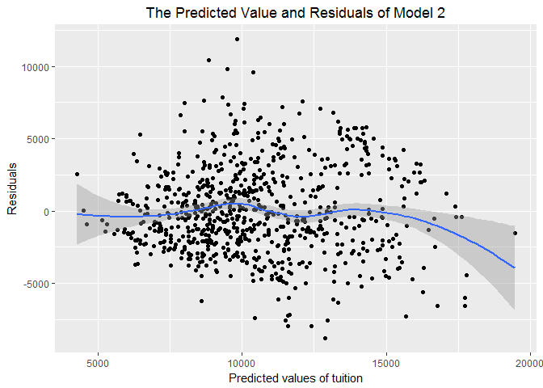
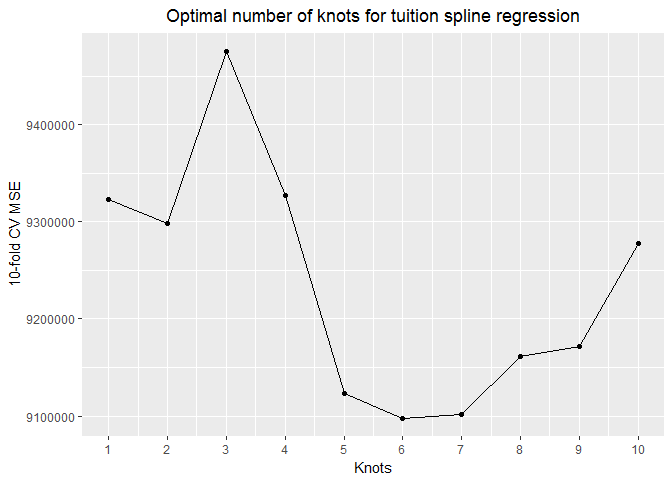
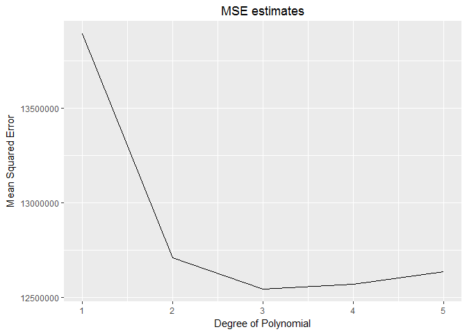
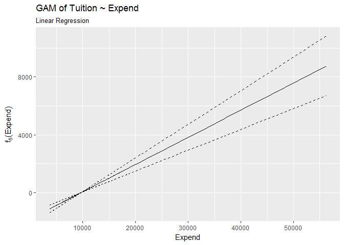
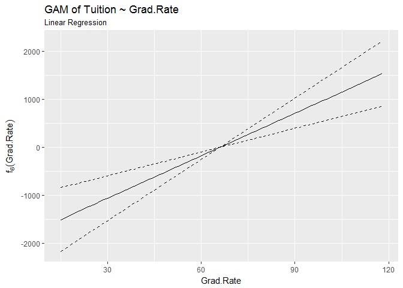

Problem set \#7: resampling and nonlinearity
================
Yinxian Zhang

-   [Part 1: Sexy Joe Biden (redux) \[4 points\]](#part-1-sexy-joe-biden-redux-4-points)
    -   [1. Estimate the training MSE of the model using the traditional approach.](#estimate-the-training-mse-of-the-model-using-the-traditional-approach.)
    -   [2. Estimate the test MSE of the model using the validation set approach.](#estimate-the-test-mse-of-the-model-using-the-validation-set-approach.)
    -   [3.Repeat the validation set approach 100 times.](#repeat-the-validation-set-approach-100-times.)
    -   [4. Now we estimate the test MSE of the model using the leave-one-out cross-validation (LOOCV) approach.](#now-we-estimate-the-test-mse-of-the-model-using-the-leave-one-out-cross-validation-loocv-approach.)
    -   [5. We now estimate the test MSE of the model using the 10-fold cross-validation approach.](#we-now-estimate-the-test-mse-of-the-model-using-the-10-fold-cross-validation-approach.)
    -   [6. We now repeat the 10-fold cross-validation approach 100 times, using 100 different splits of the observations into 10-folds.](#we-now-repeat-the-10-fold-cross-validation-approach-100-times-using-100-different-splits-of-the-observations-into-10-folds.)
    -   [7. Bootstrap.](#bootstrap.)
-   [Part 2: College (bivariate) \[3 points\]](#part-2-college-bivariate-3-points)
    -   [1. Relationship between college tuition and Percent of new students from top 10% of H.S. class.](#relationship-between-college-tuition-and-percent-of-new-students-from-top-10-of-h.s.-class.)
    -   [2. Relationship between college tuition and room and board costs](#relationship-between-college-tuition-and-room-and-board-costs)
    -   [3. Relationship between college tuition and percent of faculty with PhD degree.](#relationship-between-college-tuition-and-percent-of-faculty-with-phd-degree.)
-   [Part 3: College (GAM) \[3 points\]](#part-3-college-gam-3-points)
    -   [1. OLS model](#ols-model)
    -   [2.Estimate a GAM on the training data](#estimate-a-gam-on-the-training-data)
    -   [2. Use the test set to evaluate the model fit of the estimated OLS and GAM models, and explain the results obtained.](#use-the-test-set-to-evaluate-the-model-fit-of-the-estimated-ols-and-gam-models-and-explain-the-results-obtained.)
    -   [3. For which variables, if any, is there evidence of a non-linear relationship with the response?](#for-which-variables-if-any-is-there-evidence-of-a-non-linear-relationship-with-the-response)

Part 1: Sexy Joe Biden (redux) \[4 points\]
===========================================

We consider the following functional form:

*Y* = *β*<sub>0</sub> + *β*<sub>1</sub>*X*<sub>1</sub> + *β*<sub>2</sub>*X*<sub>2</sub> + *β*<sub>3</sub>*X*<sub>3</sub> + *β*<sub>4</sub>*X*<sub>4</sub> + *β*<sub>5</sub>*X*<sub>5</sub> + *ϵ*

where *Y* is the Joe Biden feeling thermometer, *X*<sub>1</sub> is age, *X*<sub>2</sub> is gender, *X*<sub>3</sub> is education, *X*<sub>4</sub> is Democrat, and *X*<sub>5</sub> is Republican.

### 1. Estimate the training MSE of the model using the traditional approach.

After fitting the linear regression model using the entire dataset, the mean squared error is calculated to be 395.27. The estimated parameters and standard errors are summarized below.

``` r
# linear model
biden_lm <- lm(biden ~ age + dem + educ + female + rep, data = bidata)
tidy(biden_lm)
```

    ##          term     estimate std.error  statistic      p.value
    ## 1 (Intercept)  58.81125899 3.1244366  18.822996 2.694143e-72
    ## 2         age   0.04825892 0.0282474   1.708438 8.772744e-02
    ## 3         dem  15.42425563 1.0680327  14.441745 8.144928e-45
    ## 4        educ  -0.34533479 0.1947796  -1.772952 7.640571e-02
    ## 5      female   4.10323009 0.9482286   4.327258 1.592601e-05
    ## 6         rep -15.84950614 1.3113624 -12.086290 2.157309e-32

``` r
# calculate MSE
mse <- function(model, data) {
  x <- modelr:::residuals(model, data)
  mean(x ^ 2, na.rm = TRUE)
}
mse(biden_lm, bidata) 
```

    ## [1] 395.2702

### 2. Estimate the test MSE of the model using the validation set approach.

First, we split the sample set into a training set (70%) and a validation set (30%). Then we fit the linear regression model using only the training observation. Last, we calculate the MSE using only the test set observations.

``` r
set.seed(1234)
biden_split <- resample_partition(bidata, c(test = 0.3, train = 0.7))
train_model <- lm(biden ~ age + female + educ + dem + rep, data = biden_split$train)
mse(train_model, biden_split$test) 
```

    ## [1] 399.8303

Using the validation set approach, we estimate that the mean squared error of the model is 399.83, showing an increase of errors from the original model using the entire data set. This could imply an overfitting issue of the orginal model, yet because this increase is very small, we still consider the model to be stable.

### 3.Repeat the validation set approach 100 times.

Using 100 different splits of the observations into a training set and a validation set. We can get 100 test MSE values.

``` r
set.seed(1234)
vs_mse <- function(bidata){
  biden_split <- resample_partition(bidata, c(test = 0.3, train = 0.7))
  biden_train <- biden_split$train 
  biden_test <- biden_split$test
  train_model <- lm(biden ~ age + educ + female + dem + rep, data = biden_train)
  mse_value <- mse(train_model, biden_test)
  results <- data_frame(mse_value)

  return(results)
}

vs_100 <- rerun(100, vs_mse(bidata)) %>%
  bind_rows(.id = "splits")

summary(vs_100)
```

    ##     splits            mse_value    
    ##  Length:100         Min.   :340.9  
    ##  Class :character   1st Qu.:390.2  
    ##  Mode  :character   Median :400.1  
    ##                     Mean   :401.7  
    ##                     3rd Qu.:414.6  
    ##                     Max.   :455.3

``` r
std_vs100 <- sd(vs_100$mse_value)
```

As shown in the above table, after running 100 times, the estimatesd test MSE varies between 340.9 to 455.3, with a mean of 401.7 and a standard error of 20.7365732. Such big variation indicates the drawback of the validation test approach: our estimates of the test MSE can be highly variable depending on which observations are sampled into the training and test sets.

### 4. Now we estimate the test MSE of the model using the leave-one-out cross-validation (LOOCV) approach.

``` r
set.seed(1234)
loocv_data <- crossv_kfold(bidata, k = nrow(bidata))
loocv_models <- map(loocv_data$train, ~ lm(biden ~ age + educ + female + dem + rep, data = .))
loocv_mse <- map2_dbl(loocv_models, loocv_data$test, mse)
mean(loocv_mse)
```

    ## [1] 397.9555

``` r
summary(loocv_mse)
```

    ##     Min.  1st Qu.   Median     Mean  3rd Qu.     Max. 
    ##    0.001   46.970  140.500  398.000  565.900 5739.000

As shown in the above summary, the LOOCV approach repeat the estimation process for every single observation being held out, and thus the raw estimations vary heavily. Then we calculate the mean MSE value as the the `Loocv MSE`, which is 397.96. This estimated value has minimal bias and are relatively steady, because unlike the validation set approach, LOOCV approach does not dependent on the sampling process for training/test sets. Nonetheless, in this particular case, the estimated MSE values based on the entire dataset, the validation set approach and the LOOCV approach are more or less the same, indicating that the original model based on the entire dataset works pretty stable, and overfitting is not a severe concern for us.

### 5. We now estimate the test MSE of the model using the 10-fold cross-validation approach.

``` r
set.seed(1234)
cv10_data <- crossv_kfold(bidata, k = 10)
cv10_models <- map(cv10_data$train, ~ lm(biden ~ age + educ + female + dem + rep, data = .))
cv10_mse <- map2_dbl(cv10_models, cv10_data$test, mse)
mean(cv10_mse)
```

    ## [1] 397.8837

``` r
summary(cv10_mse)
```

    ##    Min. 1st Qu.  Median    Mean 3rd Qu.    Max. 
    ##   332.4   382.7   387.6   397.9   423.3   444.5

As shown above, the estimated test MSE using the 10-fold cross-validation approach is 397.88, almost the same with that of the LOOCV approach. In fact, as we know, the LOOCV approach is the special case of the k-fold cross-validation approach where k = the number of observations. In our case, we find that the 10-fold cross-validation already produced a similar outcome of the highly reliable LOOCV, yet it costs less time and is less computationally intensive.

### 6. We now repeat the 10-fold cross-validation approach 100 times, using 100 different splits of the observations into 10-folds.

``` r
set.seed(1234)
cv_mse <- function(bidata){
  cv10_data <- crossv_kfold(bidata, k = 10)
  cv10_models <- map(cv10_data$train, ~ lm(biden ~ age + educ + female + dem + rep, data = .))
  cv10_mse <- map2_dbl(cv10_models, cv10_data$test, mse)
  mean_mse <- mean(cv10_mse)
  results <- data_frame(mean_mse)

  return(results)
}

cv100 <- rerun(100, cv_mse(bidata)) %>%
  bind_rows(.id = "splits")

summary(cv100)
```

    ##     splits             mean_mse    
    ##  Length:100         Min.   :396.9  
    ##  Class :character   1st Qu.:397.6  
    ##  Mode  :character   Median :398.0  
    ##                     Mean   :398.1  
    ##                     3rd Qu.:398.5  
    ##                     Max.   :399.6

``` r
std_cv100 <- sd(cv100$mean_mse)
```

Running 100 times the 10-fold cross-validation approach, we find that the estimates are very stable, ranging from 396.9 to 399.6 (which are, again, almost the same as LOOCV), indicating that though still relying on sampling process, this approach in fact produces very reliable and steady (with a small standard error of 0.5602606) estimates that are very close to LOOCV, and it is much more steady than the validation set approach.

### 7. Bootstrap.

Now we compare the estimated parameters and standard errors from the original model in step 1 to parameters and standard errors estimated using the bootstrap (*n* = 1000).

The bootstrap estimates are summarized below. They are very close to the estimates from the original model, despite that now the estimated parameters of the intercept and `dem` increase slightly, while other parameters decrease a little bit. Meanwhile, the standard errors in the bootstrap model are also more or less the same with the original model, despite that the standard errors of the intercept and `educ` are slightly smaller while standard errors of all other variables are slightly larger. Compared with the original model, the bootstrap approach does not make any distributional assumption about the population. Therefore we regard this estimate as more reliable if we are not confident about the shape of the population.

``` r
set.seed(1234)
biden_boot <- bidata %>%
  modelr::bootstrap(1000) %>%
  mutate(model = map(strap, ~ lm(biden ~ age + educ + female + dem + rep, data = .)),
         coef = map(model, tidy))

biden_boot %>%
  unnest(coef) %>%
  group_by(term) %>%
  summarize(est.boot = mean(estimate),
            se.boot = sd(estimate, na.rm = TRUE))
```

    ## # A tibble: 6 × 3
    ##          term     est.boot    se.boot
    ##         <chr>        <dbl>      <dbl>
    ## 1 (Intercept)  58.96180746 2.94989029
    ## 2         age   0.04756082 0.02846997
    ## 3         dem  15.42942074 1.11104505
    ## 4        educ  -0.35119332 0.19201866
    ## 5      female   4.07552938 0.94880851
    ## 6         rep -15.88710208 1.43153427

Part 2: College (bivariate) \[3 points\]
========================================

### 1. Relationship between college tuition and Percent of new students from top 10% of H.S. class.

First, we explore the relationship between college tuition and the general quality of new students. We assume that the better and more competitive the enrolled students are, the better a given college is and thus the higher tuitions it charges. We thus fit a linear regression model between college tution and the percent of new students from top 10% high schools.

``` r
tui_top10 <- lm(Outstate ~ Top10perc, data = college)

summary(tui_top10)
```

    ## 
    ## Call:
    ## lm(formula = Outstate ~ Top10perc, data = college)
    ## 
    ## Residuals:
    ##      Min       1Q   Median       3Q      Max 
    ## -11831.1  -2418.4    211.1   2116.4  11587.4 
    ## 
    ## Coefficients:
    ##             Estimate Std. Error t value Pr(>|t|)    
    ## (Intercept) 6906.459    221.614   31.16   <2e-16 ***
    ## Top10perc    128.244      6.774   18.93   <2e-16 ***
    ## ---
    ## Signif. codes:  0 '***' 0.001 '**' 0.01 '*' 0.05 '.' 0.1 ' ' 1
    ## 
    ## Residual standard error: 3329 on 775 degrees of freedom
    ## Multiple R-squared:  0.3162, Adjusted R-squared:  0.3153 
    ## F-statistic: 358.4 on 1 and 775 DF,  p-value: < 2.2e-16

``` r
college %>%
  add_predictions(tui_top10) %>%
  add_residuals(tui_top10) %>%
  {.} -> grid

ggplot(college, aes(x=Top10perc, y=Outstate)) +
  geom_point() +
  geom_line(aes(y=pred), data = grid) +
  labs(title = "Model 1: Relationship between tuition and percent of top 10% students",
        x = "percent of top 10% new students",
        y = "Out-of-state tuition")
```


``` r
ggplot(grid, aes(x = pred)) +
  geom_point(aes(y = resid)) +
  geom_smooth(method = 'loess', aes(y = resid)) +
  labs(title = "The Predicted Value and Residuals of Model 1",
        x = "Predicted values of tuition",
        y = "Residuals")+
  theme(plot.title = element_text(hjust = 0.5))
```

 The regression result summarised above shows that there is indeed a significantly positive relationship between college tuition and the percent of students from top 10% high school. For one unit increase in the percent of top 10% students, the college tuition is estimated to be increase by $128.24. This relationship is significant at a *α* = 0.01 level with a p value smaller than 2e-16. To visualize this relationship, We plot the response and predictor as well as draw the regression line in the first figure. We further exmain the residual plot in the second figure. It shows that, in general the residuals are randomly dispersed around 0, and are almost homoscadestic, despite that the variances are slightly larger at the two end, particularly at the right end.

To examine whether we need to do any monotonic transformation, we apply a 10-fold cross-validation approach to estimate the MSE for different terms.

``` r
set.seed(1234)
cv10_col <- crossv_kfold(college, k = 10)

cv10_top_mse <- vector("numeric", 5)
terms <- 1:5

for(i in terms){
  cv10_models <- map(cv10_col$train, ~ glm(Outstate ~ poly(Top10perc, i), data = .))
  cv10_mse <- map2_dbl(cv10_models, cv10_col$test, mse)
  cv10_top_mse[[i]] <- mean(cv10_mse, na.rm=TRUE)
}

data_frame(terms = terms,
           MSE = cv10_top_mse) %>%
  ggplot(aes(terms, MSE)) +
  geom_line() +
  labs(title = "Model 1 MSE estimates",
       x = "Degree of Polynomial",
       y = "Mean Squared Error") +
  theme(plot.title = element_text(hjust = 0.5))
```

 As shown in the above figure, the MSE value seems to be lowest at degree 2. We thus include the squared term into the previous model. Results are summarized below.

``` r
tui_top10sq <- lm(Outstate ~ poly(Top10perc, 2), data = college)

summary(tui_top10sq)
```

    ## 
    ## Call:
    ## lm(formula = Outstate ~ poly(Top10perc, 2), data = college)
    ## 
    ## Residuals:
    ##      Min       1Q   Median       3Q      Max 
    ## -10940.5  -2457.5    210.3   2164.9  11476.8 
    ## 
    ## Coefficients:
    ##                     Estimate Std. Error t value Pr(>|t|)    
    ## (Intercept)          10440.7      119.3  87.549   <2e-16 ***
    ## poly(Top10perc, 2)1  63019.4     3324.2  18.958   <2e-16 ***
    ## poly(Top10perc, 2)2  -5905.2     3324.2  -1.776   0.0761 .  
    ## ---
    ## Signif. codes:  0 '***' 0.001 '**' 0.01 '*' 0.05 '.' 0.1 ' ' 1
    ## 
    ## Residual standard error: 3324 on 774 degrees of freedom
    ## Multiple R-squared:  0.319,  Adjusted R-squared:  0.3172 
    ## F-statistic: 181.3 on 2 and 774 DF,  p-value: < 2.2e-16

``` r
college %>%
  add_predictions(tui_top10sq) %>%
  {.} -> grid2

ggplot(college, aes(x=Top10perc, y=Outstate)) +
  geom_point() +
  geom_line(aes(y=pred), data = grid, color="red", size=1) +
  geom_line(aes(y=pred), data = grid2, color="blue", size=1) +
  labs(title = "Model 1-revised: Relationship between tuition and percent of top 10% students",
        x = "percent of top 10% new students",
        y = "Out-of-state tuition") +
  theme(plot.title = element_text(hjust = 0.5))
```

 According to the above figure, we see the model with the squared term fits the data slighly better, especially at the higher values. However, the regression result shows that the squared term is not significant at 0.05 level, but just marginally significant with a p value of 0.076. The improvement of model is also not significant. The adjusted R square of Model 1 (0.3153) and revised Model (0.3172) almost remain the same. Considering the principle of parsimony, we choose to stick with the original Model 1 and conclude that one additional percent of students from top 10% high schools is expected to be associated with $128 increase in the out-of-state tuition of the college.

### 2. Relationship between college tuition and room and board costs

Beyond the quality of the student body, it is common to see that college tuition increases when room and board costs increase. Therefore, we fit another linear regression model to explore this relationship.

``` r
tui_room <- lm(Outstate ~ Room.Board, data = college)

summary(tui_room)
```

    ## 
    ## Call:
    ## lm(formula = Outstate ~ Room.Board, data = college)
    ## 
    ## Residuals:
    ##     Min      1Q  Median      3Q     Max 
    ## -8781.0 -2070.6  -350.8  1877.4 11877.4 
    ## 
    ## Coefficients:
    ##              Estimate Std. Error t value Pr(>|t|)    
    ## (Intercept) -17.44525  447.76786  -0.039    0.969    
    ## Room.Board    2.40001    0.09965  24.084   <2e-16 ***
    ## ---
    ## Signif. codes:  0 '***' 0.001 '**' 0.01 '*' 0.05 '.' 0.1 ' ' 1
    ## 
    ## Residual standard error: 3044 on 775 degrees of freedom
    ## Multiple R-squared:  0.4281, Adjusted R-squared:  0.4273 
    ## F-statistic:   580 on 1 and 775 DF,  p-value: < 2.2e-16

``` r
college %>%
  add_predictions(tui_room) %>%
  add_residuals(tui_room) %>%
  {.} -> grid3

ggplot(college, aes(x=Room.Board, y=Outstate)) +
  geom_point() +
  geom_line(aes(y=pred), data = grid3) +
  labs(title = "Model 2: Relationship between tuition and room and board costs",
        x = "Room and board costs",
        y = "Out-of-state tuition") +
  theme(plot.title = element_text(hjust = 0.5))
```


``` r
ggplot(grid3, aes(x = pred)) +
  geom_point(aes(y = resid)) +
  geom_smooth(method = 'loess', aes(y = resid)) +
  labs(title = "The Predicted Value and Residuals of Model 2",
        x = "Predicted values of tuition",
        y = "Residuals") +
  theme(plot.title = element_text(hjust = 0.5))
```

 The simple linear regression model shows that room and board costs is significantly associated with the college tuition at *α*=0.01 level with a p value smaller than 2e-16. One unit increase of the room and board costs is expected to be associated with $2.4 increase in the college tuition. The residual plot shows that in general the model fits the data well, except that variations of error terms tend to be larger at the right end. We further examine the MSE using 10-fold cross-validation approach.

``` r
cv10_room_mse <- vector("numeric", 5)
terms <- 1:5

for(i in terms){
  cv10_models <- map(cv10_col$train, ~ glm(Outstate ~ poly(Room.Board, i), data = .))
  cv10_mse <- map2_dbl(cv10_models, cv10_col$test, mse)
  cv10_room_mse[[i]] <- mean(cv10_mse, na.rm=TRUE)
}

data_frame(terms = terms,
           MSE = cv10_room_mse) %>%
  ggplot(aes(terms, MSE)) +
  geom_line() +
  labs(title = "Model 2 MSE estimates",
       x = "Degree of Polynomial",
       y = "Mean Squared Error") +
  theme(plot.title = element_text(hjust = 0.5))
```

 The above figure shows that MSE has a lowest value at degree 2(9.278530510^{6}). However, the decrease of MSE values is only -4.27319910^{4}, not very significant. Monotonic transformation seems unneccesary. Instead, we can use splines to further improve the fit of our model. First, we need to determine how many knots we use. We estimate 10-fold Cross-validation MSE for varying numbers of knots. The first figure below plots different MSE values. It turns out that 6 knots will give us the smallest MSE, which is 91000. This is smaller than the MSE of our original Model 2(9.321262510^{6}). So we fit a cubic regression spline with 6 knots on the out-of-state tuition.

``` r
# function to simplify things
spline_cv <- function(data, df = NULL){
  # estimate the model on each fold
  models <- map(data$train, ~ glm(Outstate ~ bs(Room.Board, df = df),
                                  data = .))
  
  # calculate mse for each test fold
  models_mse <- map2_dbl(models, data$test, mse)
  
  return(mean(models_mse, na.rm = TRUE))
}

# fold the data
set.seed(1234)
tui_kfold <- crossv_kfold(college, k = 10)


# estimate mse for degrees of freedom (aka knots)
tui_df_mse <- data_frame(df = 1:10,
                          mse = map_dbl(df, ~ spline_cv(tui_kfold, df = 3 + .)))

# graph the results
ggplot(tui_df_mse, aes(df, mse)) +
  geom_point() +
  geom_line() +
  scale_x_continuous(breaks = 1:10) +
  labs(title = "Optimal number of knots for tuition spline regression",
       x = "Knots",
       y = "10-fold CV MSE") +
  theme(plot.title = element_text(hjust = 0.5))
```



``` r
# estimate model
tui_spline <- glm(Outstate ~ bs(Room.Board, df = 9), data = college)

# estimate the predicted values and confidence interval
tui_spline_pred <- augment(tui_spline, newdata = data_grid(college, Room.Board)) %>%
  mutate(pred_low = .fitted - 1.96 * .se.fit,
         pred_high = .fitted + 1.96 * .se.fit)

# plot the curve
ggplot(tui_spline_pred, aes(Room.Board)) +
  geom_point(data = college, aes(Room.Board, Outstate), alpha = .05) +
  geom_line(aes(y = .fitted)) +
  geom_line(aes(y = pred_low), linetype = 2) +
  geom_line(aes(y = pred_high), linetype = 2) +
  geom_vline(xintercept = attr(bs(college$Room.Board, df = 9), "knots"),
             linetype = 2, color = "blue") +
  labs(title = "Cubic spline regression of College Tuition",
       subtitle = "6 knots, with 95% confidence interval",
       x = "Room and Board Costs",
       y = "Predicted Out-of-state tuition") +
  theme(plot.title = element_text(hjust = 0.5))
```

 The second figure above shows the cubic spline regression of college tuition. The non-linearality allows it to fit the data better and thus has a lower MSE. We conclude that, in general, the tuition increases as the room and board costs increase, like what we anticipated. Nonetheless, the regression line is a bit bumpy at around $4000 and $6000 room costs. Also, the 95% CI becomes very large when room costs exceeding $7000, giving us less confidence to precisely estimate tuition fees at high values of room costs.

### 3. Relationship between college tuition and percent of faculty with PhD degree.

Lastly, we turn to exmaine the relationship between college tuition and faculty quality. Specifically, it is intuitive that a college hiring more PhDs would charge higher tuition for a presumably better education and to cover a higher expense of hiring. So we plan to fit a regression model to test this assumption.

``` r
cv10_phd_mse <- vector("numeric", 5)
terms <- 1:5

for(i in terms){
  cv10_models <- map(cv10_col$train, ~ glm(Outstate ~ poly(PhD, i), data = .))
  cv10_mse <- map2_dbl(cv10_models, cv10_col$test, mse)
  cv10_phd_mse[[i]] <- mean(cv10_mse, na.rm=TRUE)
}

data_frame(terms = terms,
           MSE = cv10_phd_mse) %>%
  ggplot(aes(terms, MSE)) +
  geom_line() +
  labs(title = "MSE estimates",
       x = "Degree of Polynomial",
       y = "Mean Squared Error") +
  theme(plot.title = element_text(hjust = 0.5))
```



``` r
tui_phd <- glm(Outstate ~ poly(PhD, 3), data = college)
summary(tui_phd)
```

    ## 
    ## Call:
    ## glm(formula = Outstate ~ poly(PhD, 3), data = college)
    ## 
    ## Deviance Residuals: 
    ##    Min      1Q  Median      3Q     Max  
    ## -13235   -2711     201    2478   12353  
    ## 
    ## Coefficients:
    ##               Estimate Std. Error t value Pr(>|t|)    
    ## (Intercept)    10440.7      126.6  82.500  < 2e-16 ***
    ## poly(PhD, 3)1  42920.2     3527.6  12.167  < 2e-16 ***
    ## poly(PhD, 3)2  30971.5     3527.6   8.780  < 2e-16 ***
    ## poly(PhD, 3)3  11771.8     3527.6   3.337 0.000887 ***
    ## ---
    ## Signif. codes:  0 '***' 0.001 '**' 0.01 '*' 0.05 '.' 0.1 ' ' 1
    ## 
    ## (Dispersion parameter for gaussian family taken to be 12444173)
    ## 
    ##     Null deviance: 1.2559e+10  on 776  degrees of freedom
    ## Residual deviance: 9.6193e+09  on 773  degrees of freedom
    ## AIC: 14905
    ## 
    ## Number of Fisher Scoring iterations: 2

``` r
college %>%
  add_predictions(tui_phd) %>%
  {.} -> grid4

ggplot(college, aes(x = PhD, y = Outstate)) +
  geom_point() +
  geom_line(aes(y=pred), data = grid4, color="red", size=1) +
  labs(title = "Model 3: Relationship between tuition and percent of faculty with PhD",
        x = "percent of faculty with PhD degrees",
        y = "Out-of-state tuition") +
  theme(plot.title = element_text(hjust = 0.5))
```

 Using 10-fold cross validation approach, we find that the MSE value is the lowest at degree 3. Therefore, we apply a cubic transformation of the predictor `PhD`. The regression results are summarized in the above table. All three parameters are significantly associated with college tuition at *α*=0.01 level. The estimated parameters for degree 1, 2, and 3 are 42920.2, 30971.5, and 11771.8 respectively. We plot the regression line of Model 3 in the second figure above.

This all indicates that, when the percent of faculty with PhDs is not very high (less than 60%), its relationship with college tuition is not very substantial. However, when the percent exceedes the threshold of about 60%, the tuition would dramatically increase as the percent of PhD faculty members increases.

Part 3: College (GAM) \[3 points\]
==================================

### 1. OLS model

We now split the data into a 70% training set and a 30% test set. Then we estimate an OLS model on the training data, using out-of-state tuition (`Outstate`) as the response variable and the other six variables as the predictors.

``` r
set.seed(1234)
tui_split <- resample_partition(college, c(test = 0.3, train = 0.7))

tui_lm <- lm(Outstate ~ Private + Room.Board + PhD + perc.alumni + Expend + Grad.Rate, data = tui_split$train)
summary(tui_lm)
```

    ## 
    ## Call:
    ## lm(formula = Outstate ~ Private + Room.Board + PhD + perc.alumni + 
    ##     Expend + Grad.Rate, data = tui_split$train)
    ## 
    ## Residuals:
    ##     Min      1Q  Median      3Q     Max 
    ## -7755.7 -1325.5  -112.8  1300.0 10537.0 
    ## 
    ## Coefficients:
    ##               Estimate Std. Error t value Pr(>|t|)    
    ## (Intercept) -3595.7775   538.4138  -6.678 6.04e-11 ***
    ## PrivateYes   2575.4372   253.9221  10.143  < 2e-16 ***
    ## Room.Board      0.9927     0.1028   9.661  < 2e-16 ***
    ## PhD            36.5287     6.8007   5.371 1.17e-07 ***
    ## perc.alumni    53.3855     9.0482   5.900 6.43e-09 ***
    ## Expend          0.2067     0.0207   9.987  < 2e-16 ***
    ## Grad.Rate      30.7296     6.6964   4.589 5.55e-06 ***
    ## ---
    ## Signif. codes:  0 '***' 0.001 '**' 0.01 '*' 0.05 '.' 0.1 ' ' 1
    ## 
    ## Residual standard error: 2090 on 537 degrees of freedom
    ## Multiple R-squared:  0.7263, Adjusted R-squared:  0.7232 
    ## F-statistic: 237.5 on 6 and 537 DF,  p-value: < 2.2e-16

It turns out that the OLS model fits the data pretty well with an adjusted *R*<sup>2</sup> of 0.72, meaning it explains 72% of the variances in college tuition. Moreover, all predictors are estimated to have a statistically significant (p value all smaller than 0.001) and positive relationship with college tuition. The estimated parameters are summarized in the above table.
Among those variables, `Private` is a strong indicator of college tuition. The tuition of prative universities is expected to be $2575.43 higher than that of public universities, holding all other variables constant. The percent of faculty with PhD degrees (`PhD`), the percent of alumni who donate(`perc.alumni`) and the graduation rate(`Grad.Rate`) are also substantially associated with tuition. Holding all other variables in the model constant, for each additional percent increase in the percent of faculty with PhD's, the college tuition will be expected to increase by $36.52. Likewise, for each additional percent increase in the percent of alumni who donate, the college tuition will be expected to increase by $53.38; and for each one percent increase in the graduation rate, the college tuition will be expected to increase by $30.72. The estimated parameters of the room and board costs and the instructional expenditure per student are much smaller than other variables, but this is due to the unit of variables, rather than indicating a less substantial relationship. Holding all other variables in the model constant, for each addtional dolloar increase in room costs and instructional expenditure, the college tuition is expected to increase by $0.99, while each addtional dolloar increase in instructional expense is expected to be associated with $0.21 increase in the college tuition.
Then we draw the residual plot to further exmaine the fit of this model. We also plot the relationship between `perc.alumni` and college tuition, differentiating for priviate and public university.

``` r
college %>%
  add_predictions(tui_lm) %>%
  add_residuals(tui_lm) %>%
  {.} -> grid5

ggplot(college, aes(x=perc.alumni, y=Outstate, color = ifelse(Private=='Yes', 'Private Univ', 'Public Univ'))) +
  geom_point()+
  geom_smooth(aes(y=pred), data = grid5) +
  labs(title = "OLS Model: Relationship between tuition and percent of alumni who donate",
        x = "% of alumni who donate",
        y = "Out-of-state tuition") +
  guides("University", color = guide_legend(''))+
  theme(plot.title = element_text(hjust = 0.5))
```


``` r
ggplot(grid5, aes(x = pred)) +
  geom_point(aes(y = resid)) +
  geom_smooth(method = 'loess', aes(y = resid)) +
  labs(title = "The Predicted Value and Residuals of OLS Model",
        x = "Predicted values of tuition",
        y = "Residuals") +
  theme(plot.title = element_text(hjust = 0.5))
```

 The first figure visualizes the relationship between alumni donation and college tuition, it also shows that private university tends to charge a higher tuition than public univeristy. The second figure shows the residuals of the model. In general, the residuals are dispersed randamly around 0. But the variance becomes large at the right end, it suggests that we tend to over-estimate tutions at higher values.

### 2.Estimate a GAM on the training data

``` r
tui_gam <- gam(Outstate ~ Private + bs(Room.Board, df = 6) + poly(PhD, 3) + perc.alumni + Expend + Grad.Rate, data = tui_split$train)


summary(tui_gam)
```

    ## 
    ## Call: gam(formula = Outstate ~ Private + bs(Room.Board, df = 6) + poly(PhD, 
    ##     3) + perc.alumni + Expend + Grad.Rate, data = tui_split$train)
    ## Deviance Residuals:
    ##     Min      1Q  Median      3Q     Max 
    ## -7494.9 -1296.3  -121.5  1294.8  9906.2 
    ## 
    ## (Dispersion Parameter for gaussian family taken to be 4265718)
    ## 
    ##     Null Deviance: 8567705097 on 543 degrees of freedom
    ## Residual Deviance: 2260830296 on 530 degrees of freedom
    ## AIC: 9864.392 
    ## 
    ## Number of Local Scoring Iterations: 2 
    ## 
    ## Anova for Parametric Effects
    ##                         Df     Sum Sq    Mean Sq F value    Pr(>F)    
    ## Private                  1 2343848734 2343848734 549.462 < 2.2e-16 ***
    ## bs(Room.Board, df = 6)   6 2151855803  358642634  84.076 < 2.2e-16 ***
    ## poly(PhD, 3)             3 1032121875  344040625  80.653 < 2.2e-16 ***
    ## perc.alumni              1  381363149  381363149  89.402 < 2.2e-16 ***
    ## Expend                   1  313724036  313724036  73.545 < 2.2e-16 ***
    ## Grad.Rate                1   83961206   83961206  19.683 1.112e-05 ***
    ## Residuals              530 2260830296    4265718                      
    ## ---
    ## Signif. codes:  0 '***' 0.001 '**' 0.01 '*' 0.05 '.' 0.1 ' ' 1

As we have examined in Part 2, we choose to fit a cubic spline with 6 knots of `Room.Board` and also make a cubic transformation of `PhD`. We keep other variables untransformed. The GAM model is summarized above.Now we turn to exmaine each variable one by one.

``` r
gam_terms <- preplot(tui_gam, se = TRUE, rug = FALSE)

data_frame(x = gam_terms$Private$x,
           y = gam_terms$Private$y,
           se.fit = gam_terms$Private$se.y) %>%
  unique %>%
  mutate(y_low = y - 1.96 * se.fit,
         y_high = y + 1.96 * se.fit) %>%
  ggplot(aes(x, y, ymin = y_low, ymax = y_high)) +
  geom_point() +
  geom_errorbar() +
  labs(title = "GAM of Tuition ~ Private",
       x = "Private",
       y = expression(f[1](Private)))
```

 We see that similar to our previous models, private university tend to charge a higher tuition. We also see that the difference is significant and substantial with a difference of about 2500 and non-overlapping 95% CI.

``` r
data_frame(x = gam_terms$`bs(Room.Board, df = 6)`$x,
           y = gam_terms$`bs(Room.Board, df = 6)`$y,
           se.fit = gam_terms$`bs(Room.Board, df = 6)`$se.y) %>%
  mutate(y_low = y - 1.96 * se.fit,
         y_high = y + 1.96 * se.fit) %>%
  ggplot(aes(x, y)) +
  geom_line() +
  geom_line(aes(y = y_low), linetype = 2) +
  geom_line(aes(y = y_high), linetype = 2) +
  labs(title = "GAM of Tuition ~ Room.Board",
       x = "Room.Board",
       y = expression(f[2](Room.Board)))
```

 Still similar to our previous model, in general tuition increases as room costs increase. Nonetheless, now we notice that at the left end when room costs is below $3000, tuition decreases a bit at first, then starts to increase. But the 95% CI is larger at the two ends.

``` r
data_frame(x = gam_terms$`poly(PhD, 3)`$x,
           y = gam_terms$`poly(PhD, 3)`$y,
           se.fit = gam_terms$`poly(PhD, 3)`$se.y) %>%
  mutate(y_low = y - 1.96 * se.fit,
         y_high = y + 1.96 * se.fit) %>%
  ggplot(aes(x, y)) +
  geom_line() +
  geom_line(aes(y = y_low), linetype = 2) +
  geom_line(aes(y = y_high), linetype = 2) +
  labs(title = "GAM of Tuition ~ PhD",
       subtitle = "Cubic X",
       x = "PhD",
       y = expression(f[3](PhD)))
```

 Again, we see a positive relationship between `phd` and tuition. Yet the 95% CI is large at lower values of `phD`.

``` r
data_frame(x = gam_terms$perc.alumni$x,
           y = gam_terms$perc.alumni$y,
           se.fit = gam_terms$perc.alumni$se.y) %>%
  mutate(y_low = y - 1.96 * se.fit,
         y_high = y + 1.96 * se.fit) %>%
  ggplot(aes(x, y)) +
  geom_line() +
  geom_line(aes(y = y_low), linetype = 2) +
  geom_line(aes(y = y_high), linetype = 2) +
  labs(title = "GAM of Tuition ~ perc.alumni",
       subtitle = "Linear Regression",
       x = "perc.alumni",
       y = expression(f[4](perc.alumni)))
```


``` r
## Expend
data_frame(x = gam_terms$Expend$x,
           y = gam_terms$Expend$y,
           se.fit = gam_terms$`Expend`$se.y) %>%
  mutate(y_low = y - 1.96 * se.fit,
         y_high = y + 1.96 * se.fit) %>%
  ggplot(aes(x, y)) +
  geom_line() +
  geom_line(aes(y = y_low), linetype = 2) +
  geom_line(aes(y = y_high), linetype = 2) +
  labs(title = "GAM of Tuition ~ Expend",
       subtitle = "Linear Regression",
       x = "Expend",
       y = expression(f[5](Expend)))
```



``` r
## Grad.Rate
data_frame(x = gam_terms$Grad.Rate$x,
           y = gam_terms$Grad.Rate$y,
           se.fit = gam_terms$Grad.Rate$se.y) %>%
  mutate(y_low = y - 1.96 * se.fit,
         y_high = y + 1.96 * se.fit) %>%
  ggplot(aes(x, y)) +
  geom_line() +
  geom_line(aes(y = y_low), linetype = 2) +
  geom_line(aes(y = y_high), linetype = 2) +
  labs(title = "GAM of Tuition ~ Grad.Rate",
       subtitle = "Linear Regression",
       x = "Grad.Rate",
       y = expression(f[6](Grad.Rate)))
```

 Lastly, we turn to the three linear relationships in our model. Similar to our estimates in the OLS model, the three variables are all positively correlated with college tuition. For alumni donation and gradution rate, the 95%CI is larger at two ends yet very small in the middle, whereas the 95% CI is increasing along the X axis for `Expend`.

### 2. Use the test set to evaluate the model fit of the estimated OLS and GAM models, and explain the results obtained.

``` r
lm_mse <- mse(tui_lm, tui_split$test)
gam_mse <- mse(tui_gam, tui_split$test)

data_frame(model = c("LM", "GAM"),
           MSE = c(lm_mse, gam_mse))
```

    ## # A tibble: 2 × 2
    ##   model     MSE
    ##   <chr>   <dbl>
    ## 1    LM 3595260
    ## 2   GAM 3604572

The GAM in fact does more or less a same job as the simple linear model, it has a slightly higher MSE (3604572), while OLS is 3595260. This is not a significant change (though even slightly worse), we would rather stick with the OLS.

### 3. For which variables, if any, is there evidence of a non-linear relationship with the response?

From above models, we suspect that there could be a non-linear relationship between `Expend` and tuition. We exmaine this by Anova test.

``` r
tui_noexpend <- gam(Outstate ~ Private + bs(Room.Board, df = 6) + poly(PhD, 3) + perc.alumni + Grad.Rate, data = tui_split$train)

tui_gam <- gam(Outstate ~ Private + bs(Room.Board, df = 6) + poly(PhD, 3) + Expend + perc.alumni + Grad.Rate, data = tui_split$train)

tui_logexpend <- gam(Outstate ~ Private + bs(Room.Board, df = 6) + poly(PhD, 3) + perc.alumni + log(Expend) + Grad.Rate, data = tui_split$train)

anova(tui_noexpend, tui_gam, test = "F")
```

    ## Analysis of Deviance Table
    ## 
    ## Model 1: Outstate ~ Private + bs(Room.Board, df = 6) + poly(PhD, 3) + 
    ##     perc.alumni + Grad.Rate
    ## Model 2: Outstate ~ Private + bs(Room.Board, df = 6) + poly(PhD, 3) + 
    ##     Expend + perc.alumni + Grad.Rate
    ##   Resid. Df Resid. Dev Df  Deviance      F    Pr(>F)    
    ## 1       531 2557402603                                  
    ## 2       530 2260830296  1 296572307 69.525 6.541e-16 ***
    ## ---
    ## Signif. codes:  0 '***' 0.001 '**' 0.01 '*' 0.05 '.' 0.1 ' ' 1

``` r
anova(tui_noexpend, tui_logexpend, test = 'F')
```

    ## Analysis of Deviance Table
    ## 
    ## Model 1: Outstate ~ Private + bs(Room.Board, df = 6) + poly(PhD, 3) + 
    ##     perc.alumni + Grad.Rate
    ## Model 2: Outstate ~ Private + bs(Room.Board, df = 6) + poly(PhD, 3) + 
    ##     perc.alumni + log(Expend) + Grad.Rate
    ##   Resid. Df Resid. Dev Df  Deviance      F    Pr(>F)    
    ## 1       531 2557402603                                  
    ## 2       530 2024352264  1 533050339 139.56 < 2.2e-16 ***
    ## ---
    ## Signif. codes:  0 '***' 0.001 '**' 0.01 '*' 0.05 '.' 0.1 ' ' 1

As shown by the above ANOVA tests, we add `Expend` and `log(Expend)` to the null model respectively. Though both significant at a 0.01 level with p values smaller than 2e-16, the `log(expend)` does a better job in reducing more of the variances of the null model. This suggests that log may have a non-linear relationship with tuition.
