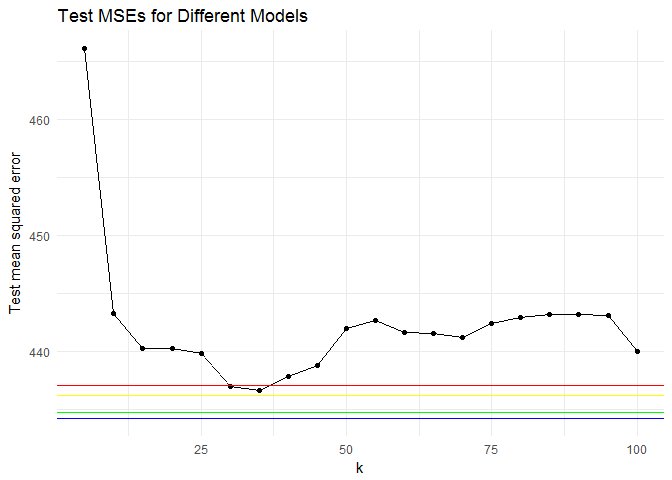
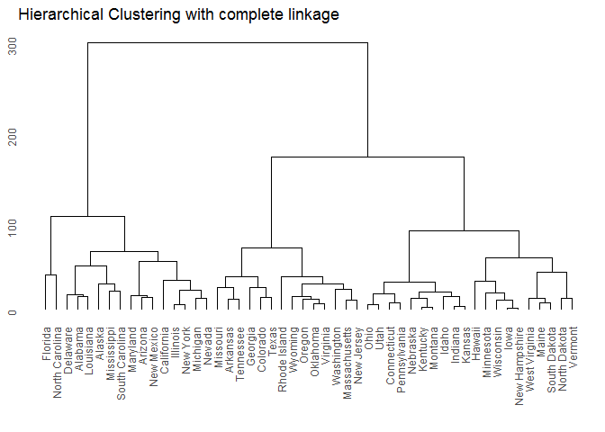
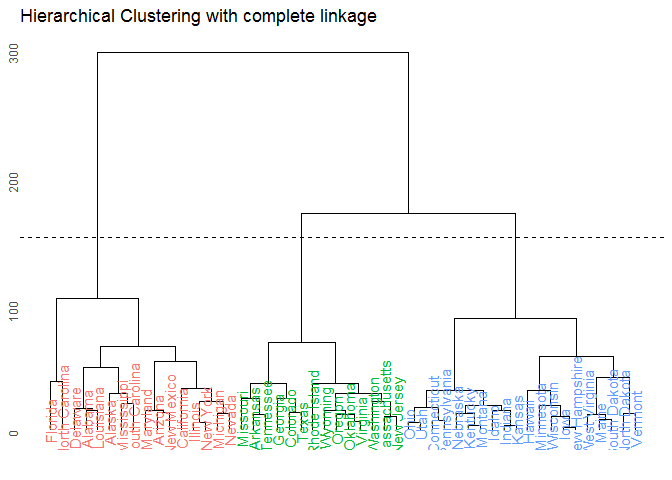
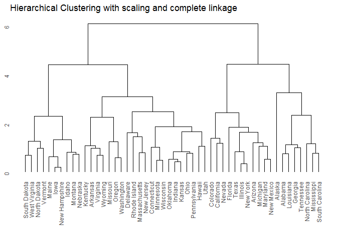

Problem set \#9: nonparametric methods and unsupervised learning
================
Yinxian Zhang

-   [Attitudes towards feminists \[3 points\]](#attitudes-towards-feminists-3-points)
    -   [KNN Models](#knn-models)
    -   [wKNN Models](#wknn-models)
    -   [The Best Model](#the-best-model)
-   [Voter turnout and depression \[2 points\]](#voter-turnout-and-depression-2-points)
    -   [KNN Models](#knn-models-1)
    -   [wKNN Models](#wknn-models-1)
    -   [The Best Model](#the-best-model-1)
-   [Colleges \[2 points\]](#colleges-2-points)
-   [Clustering states \[3 points\]](#clustering-states-3-points)
    -   [PCA](#pca)
    -   [K-means clustering with k=2](#k-means-clustering-with-k2)
    -   [k-means clustering with k=4](#k-means-clustering-with-k4)
    -   [k-means clustering with k=3](#k-means-clustering-with-k3)
    -   [k-means clustering with k=3 on the first two principal components score vectors.](#k-means-clustering-with-k3-on-the-first-two-principal-components-score-vectors.)
    -   [Hierarchical clustering](#hierarchical-clustering)
    -   [cut the dendrogram](#cut-the-dendrogram)
    -   [Hieararchical clustering with scaling](#hieararchical-clustering-with-scaling)

Attitudes towards feminists \[3 points\]
========================================

In this section we will estimate a series of models explaining/predicting attitudes towards feminists. To explain people's attitude towards feminists, we consider one's gender, party affiliation and education level. Intuitively, women would be more likely to support feminists who strive for empowering women themselves. Moreover, the mission of democratic party is to promote social equality and call for respect for the individual. Thus democrats are expected to join the effort of protecting and empowering women. Lastly, higher level of education tends to be associated with more liberal values that emphasize gender equality and thus is expected to favor feminists.

We first split the data into 70% training set and 30% test set. Then we estimate a series of KNN and wKNN models.

### KNN Models

Using the combination of variables we justified above, we estimate a series of KNN models with *K* = 5, 10, 15, …, 100.

``` r
# split data
set.seed(1234)
fem <-feminist %>%
  na.omit()

fem_split <- resample_partition(fem, c(test = 0.3, train = 0.7))
fem_train <- fem_split$train %>%
  tbl_df()
fem_test <- fem_split$test %>%
  tbl_df()

# estimate KNN models and associated MSE
fem_mse_knn <- data_frame(k = seq(5, 100, 5),
                      knn = map(k, ~ knn.reg(select(fem_train, female, dem, educ), y = fem_train$feminist,
                         test = select(fem_test, female, dem, educ), k = .)),
                      mse = map_dbl(knn, ~ mean((fem_test$feminist - .$pred)^2)))

# plot MSE
ggplot(fem_mse_knn, aes(k, mse)) +
  geom_line() +
  geom_point() +
  labs(title = "Test MSE of KNN models predicting attitudes towards feminists",
       x = "K",
       y = "Test mean squared error") 
```


``` r
knn_mse = min(fem_mse_knn$mse)

knn_k = fem_mse_knn[fem_mse_knn$mse == knn_mse, ]$k
```

As shown by the above figure, test MSE dramatically decreases as k increases from 5 to 35, then it slightly increases again as k becomes larger. The KNN model with k= 35 achieves the lowest MSE of 436.6735574. This suggests that small values for K provide low bias estimates but produce high variances, leading to model overfitting and thus a worse performance in the test set.

### wKNN Models

We have three predictors in the KNN models, and this high dimension may result in the problem that for many observations, there are no nearby neighbors, so the prediction resulting from averaging across these neighbors is poor. Therefore, we now turn to use weighted KNN models based on the default use of Euclidean distance between data points.

``` r
set.seed(1234)
# estimate wKNN models and associated MSE
fem_mse_wknn <- data_frame(k = seq(5, 100, 5),
                      knn = map(k, ~ kknn(feminist ~ female + dem + educ, train = fem_train, test = fem_test, k = .)),
                      mse = map_dbl(knn, ~ mean((fem_test$feminist - .$fitted.values)^2)))

# plot MSE
ggplot(fem_mse_wknn, aes(k, mse)) +
  geom_line() +
  geom_point() +
  labs(title = "Test MSE of wKNN models predicting attitudes towards feminists",
       x = "K",
       y = "Test mean squared error") 
```


``` r
wknn_mse = min(fem_mse_wknn$mse)

wknn_k = fem_mse_wknn[fem_mse_wknn$mse == wknn_mse, ]$k
```

As shown in the above figure, Using the same combination of variables, the test MSEs for weighted KNN models in general decreases as k increases. But it appears that the test MSE are slighlty higher than that for KNN models, indicating that wKNN models do not work as good as KNN models as we anticipated when we only have 3 predictors. The lowest MSE of wKNN models is 440.3313506 with a k = 95, this is the best wKNN model, but this MSE is slightly higher than the best KNN model.

### The Best Model

Now we turn to compare the test MSE for the best KNN model with a k = 35 to the test MSE for other models. Specifically, we estimated a linear regression model, a decision tree model with default control options, a boosting model with a depth of 1 and shrinkage rate of 0.05, and a randowm forest model with *m* = 2, all using the same combination of variables as before.

``` r
set.seed(1234)

# define a function to calculate MSE for different models:
mse <- function(model, data) {
  x <- modelr:::residuals(model, data)
  mean(x ^ 2, na.rm = TRUE)
}

# linear regression
fem_lm <- lm(feminist ~ female + dem + educ, data = fem_train) 

fem %>%
  add_predictions(fem_lm) %>%
  add_residuals(fem_lm) %>%
  {.} -> grid

ggplot(grid, aes(x = pred)) +
  geom_point(aes(y = resid)) +
  geom_smooth(method = 'loess', aes(y = resid)) +
  labs(title = "The Predicted Value and Residuals of Linear Regression",
        x = "Predicted values of feminist score",
        y = "Residuals")+
  theme(plot.title = element_text(hjust = 0.5))
```


``` r
lm_mse <- mse(fem_lm, fem_test)

# decision tree with default control options
fem_tree <- tree(feminist ~ female + dem + educ, data = fem_train)

tree_data <- dendro_data(fem_tree)

ggplot(segment(tree_data)) +
  geom_segment(aes(x = x, y = y, xend = xend, yend = yend), 
               alpha = 0.5) +
  geom_text(data = label(tree_data), 
            aes(x = x, y = y, label = label_full), vjust = -0.5, size = 3) +
  geom_text(data = leaf_label(tree_data), 
            aes(x = x, y = y, label = label), vjust = 0.5, size = 3) +
  theme_dendro() +
  labs(title = 'Decision Tree Predicting Feminist Score') +
  theme(plot.title = element_text(hjust = 0.5))
```


``` r
tree_mse <- mse(fem_tree, fem_test)

# boosting 
(fem_boo = gbm(feminist ~ female + dem + educ, data = fem_train, n.trees = 1000, interaction.depth = 1, shrinkage = 0.05))
```

    ## Distribution not specified, assuming gaussian ...

    ## gbm(formula = feminist ~ female + dem + educ, data = fem_train, 
    ##     n.trees = 1000, interaction.depth = 1, shrinkage = 0.05)
    ## A gradient boosted model with gaussian loss function.
    ## 1000 iterations were performed.
    ## There were 3 predictors of which 3 had non-zero influence.

``` r
boost_mse <- function(model) {
  best.iter <- gbm.perf(model,method="OOB")
  f.predict <- predict(model,fem_test,best.iter)
  boo_mse = mean((f.predict - fem_test$feminist)^2)
  print(best.iter)
  return(boo_mse)
}

bo_mse <- boost_mse(fem_boo)
```


    ## [1] 49

``` r
# random forest with m=2
fem_rf<- randomForest(feminist ~ female + dem + educ, data = fem_train, mtry=2, ntree = 500)

data_frame(var = rownames(importance(fem_rf)),
           RSSDecrease = importance(fem_rf)[,1]) %>%
  mutate(var = fct_reorder(var, RSSDecrease, fun = median)) %>%
  ggplot(aes(var, RSSDecrease)) +
  geom_point() +
  coord_flip() +
  labs(title = "Random Forest Predicting Feminist Score",
       x = NULL,
       y = "the total amount of reduction in the RSS")
```


``` r
rf_mse <- mse(fem_rf, fem_test)
```

Now we explicitly compare the MSEs of different models by plotting each MSE against the MSE of KNN models.

``` r
# compare MSEs
ggplot(fem_mse_knn, aes(k, mse)) +
  geom_line() +
  geom_point() +
  geom_hline(color = "red", yintercept = lm_mse) +
  geom_hline(color = "yellow", yintercept = tree_mse) +
  geom_hline(color = "green", yintercept = bo_mse) +
  geom_hline(color = "blue", yintercept = rf_mse) +
  labs(title = "Test MSEs for Different Models",
       y = "Test mean squared error") 
```



As shown by the above figure, the best KNN model with a k = 35 achieves a lower MSE (436.6735574) than linear regression model, whose MSE is 437.1439832. This is more or less the same with that of the decision tree model (MSE=436.2067826). Among all models, the boosting approach with an optimal number of trees and the random forest approach perform the best with the lowst test MSE of 434.7706446 and 434.280961, respectively. Random forest has the lowest MSE.

As a non-parametric model, random forest improves from linear regression by relaxing the non-linearlity assumption and not assuming a functional form of the model, it also improves from the non-robust decision tree model by repeatedly splitting the data, ignoring a random set of predictors to decorrelate trees, and averaging across the results so as to reduce variances. The random forest result shows that the identity of democrats is the most important predictor to estimate one's attitude towards feminists. This confirms our hypothesis that democrats tend to push for social equality and personal rights, and thus would favor feminist.

Voter turnout and depression \[2 points\]
=========================================

In this section we will estimate a series of models predicting voter turnout. To predict the voter turnout, traditional theories emphasizes the socio-economic factors such as age and educational level. In addition, an emerging theory indicates that an individual's mental health would influence his/her political participation. Guided by these theories, we include `age`, `educ` and `mhealth_sum` into our models.

We first split the data into 70% training set and 30% test set. Then we estimate a series of KNN and wKNN models.

### KNN Models

Using the combination of variables we justified above, we estimate a series of KNN models with *K* = 1, 2, …, 10.

``` r
# split data
set.seed(1234)
vote <- health %>%
  na.omit()

vote_split <- resample_partition(vote, c(test = 0.3, train = 0.7))
vote_train <- vote_split$train %>%
  tbl_df()
vote_test <- vote_split$test %>%
  tbl_df()

# estimate KNN models and associated test errors
vote_mse_knn <- data_frame(k = seq(1, 10, 1), knn = map(k, ~ class::knn(select(vote_train, age, educ, mhealth_sum),
                                                test = select(vote_train, age, educ, mhealth_sum),
                                                cl = vote_train$vote96, k = .)),
                      test_error = map_dbl(knn, ~ mean(vote_test$vote96 != ., na.rm = TRUE)))

# plot test errors
ggplot(vote_mse_knn, aes(k, test_error)) +
  geom_line() +
  geom_point() +
  labs(x = "K",
       y = "Test error rate",
       title = "Test error rate of KNN models predicting voter turnout")
```


``` r
vl_mse <- min(vote_mse_knn$test_error)
vl_k <- vote_mse_knn[vote_mse_knn$test_error == vl_mse, ]$k
```

As shown by the above figure, the test error rate dramatically decreases as k increases from 1 to 7, then it slightly increases again as k becomes larger. The KNN model with k= 7 achieves the lowest MSE of 0.4019608. This suggests that small values for K provide low bias estimates but produce high variances, leading to model overfitting and thus a worse performance in the test set.

### wKNN Models

We have three predictors in the KNN models, and this high dimension may result in the problem that for many observations, there are no nearby neighbors, so the prediction resulting from averaging across these neighbors is poor. Therefore, we now turn to use weighted KNN models based on the default use of Euclidean distance between data points.

``` r
set.seed(1234)
# estimate wKNN models and associated test errors
vote_mse_wknn <- data_frame(k = seq(1, 10, 1),
                      wknn = map(k, ~ kknn(vote96 ~ age + mhealth_sum + educ, train = vote_train, test = vote_test, k = .)),
                      mse = map_dbl(wknn, ~ mean(vote_test$vote96 != as.numeric(.$fitted.values>0.5))))

# plot test error
ggplot(vote_mse_wknn, aes(k, mse)) +
  geom_line() +
  geom_point() +
  labs(title = "Test error rate of wKNN models predicting voter turnout",
       x = "K",
       y = "Test error rate") 
```


``` r
vw_mse = min(vote_mse_wknn$mse)
vw_k = vote_mse_wknn[vote_mse_wknn$mse == vw_mse, ]$k
```

As shown in the above figure, Using the same combination of variables, the test error rates for weighted KNN models in general decreases as k increases but the line is a bit bumpy. It shows that wKNN models perform better than KNN models as we anticipated. The lowest MSE of wKNN models is 0.3295129 with a k = 10, this is the best wKNN model and it is better than KNN models.

### The Best Model

Now we turn to compare the test error rates for the best wKNN model with a k = 10 to the test error rates for other models. Specifically, we estimated a logistic model, a decision tree model with default control options, a boosting model with a depth of 2 and shrinkage rate of 0.05, and a randowm forest model with *m* = 2, and a SVM model with linear kernel, all using the same combination of variables as before.

``` r
library(e1071)
set.seed(1234)

# define a function to calculate test error rate:
err_rate <- function(model, data) {
  data <- as_tibble(data)
  response <- as.character(model$terms[[2]])

  pred <- predict(model, newdata = data, type = "class") 
  actual <- data[[response]]

  return(mean(pred != actual, na.rm = TRUE))
}


# logistic regression
logit2prob <- function(x){
  exp(x) / (1 + exp(x))
}

vote_log <- glm(vote96 ~ age + educ + mhealth_sum, data = vote_train, family = binomial) 

# error rate of logit model
x<- vote_test %>%
  add_predictions(vote_log) %>%
  mutate (pred = logit2prob(pred),
          prob = pred,
          pred = as.numeric(pred > 0.5))
glm_err <- mean(x$vote96 != x$pred)


# decision tree with default control options

tree_set <- vote %>%
  mutate (vote96 = factor(vote96, levels = 0:1, label =c("no_vote", "vote")))

tree_split <- resample_partition(tree_set, c(test = 0.3, train = 0.7))
tree_train <- as_tibble(tree_split$train)
tree_test <- as_tibble(tree_split$test)

vote_tree <- tree(vote96 ~ age + mhealth_sum + educ, data = tree_train)

#Plot tree
tree_data <- dendro_data(vote_tree)

ggplot(segment(tree_data)) +
  geom_segment(aes(x = x, y = y, xend = xend, yend = yend), 
               alpha = 0.5) +
  geom_text(data = label(tree_data), 
            aes(x = x, y = y, label = label_full), vjust = -0.5, size = 3) +
  geom_text(data = leaf_label(tree_data), 
            aes(x = x, y = y, label = label), vjust = 0.5, size = 3) +
  theme_dendro() +
  labs(title = 'Decision Tree Predicting Voter Turnout') +
  theme(plot.title = element_text(hjust = 0.5))
```


``` r
tree_err <- err_rate(vote_tree, tree_test)

# boosting 
(vote_boo = gbm(vote96 ~ age + mhealth_sum + educ, data = vote_train, n.trees = 1000, interaction.depth = 2, shrinkage = 0.05))
```

    ## Distribution not specified, assuming bernoulli ...

    ## gbm(formula = vote96 ~ age + mhealth_sum + educ, data = vote_train, 
    ##     n.trees = 1000, interaction.depth = 2, shrinkage = 0.05)
    ## A gradient boosted model with bernoulli loss function.
    ## 1000 iterations were performed.
    ## There were 3 predictors of which 3 had non-zero influence.

``` r
err <-list()
for (i in 1:1000) {
  e <- mean(round(predict(vote_boo, newdata = vote_test, n.trees = i)) != vote_test$vote96)
  err<-append(err, e)
}

err_data <- data_frame("tree" = 1:1000, "err_rate" = unlist(err))

boo_err <- min(err_data$err_rate)

# random forest with m=2
vote_rf<- randomForest(vote96 ~ age + mhealth_sum + educ, data = tree_train, mtry=2, ntree = 500)

data_frame(var = rownames(importance(vote_rf)),
           RSSDecrease = importance(vote_rf)[,1]) %>%
  mutate(var = fct_reorder(var, RSSDecrease, fun = median)) %>%
  ggplot(aes(var, RSSDecrease)) +
  geom_point() +
  coord_flip() +
  labs(title = "Random Forest Predicting voter turnout",
       x = NULL,
       y = "Average decrease in the Gini index")
```


``` r
rf_err <- err_rate(vote_rf, tree_test)

# SVM model with linear kernel
vote_svm <- tune(svm, vote96 ~ age + mhealth_sum + educ, data = vote_train,
                    kernel = "linear",
                    range = list(cost = c(.001, .01, .1, 1, 5, 10, 100)))

summary(vote_svm)
```

    ## 
    ## Parameter tuning of 'svm':
    ## 
    ## - sampling method: 10-fold cross validation 
    ## 
    ## - best parameters:
    ##  cost
    ##   100
    ## 
    ## - best performance: 0.2666764 
    ## 
    ## - Detailed performance results:
    ##    cost     error dispersion
    ## 1 1e-03 0.2880984 0.06980908
    ## 2 1e-02 0.2730249 0.06968960
    ## 3 1e-01 0.2674132 0.06742135
    ## 4 1e+00 0.2667477 0.06708277
    ## 5 5e+00 0.2667301 0.06716481
    ## 6 1e+01 0.2667027 0.06714332
    ## 7 1e+02 0.2666764 0.06711353

Now we explicitly compare the error rates of different models by plotting each error rate against the error rate of the best wKNN model.

``` r
# compare error rates
ggplot(vote_mse_wknn, aes(k, mse)) +
  geom_line() +
  geom_point() +
  geom_hline(color = "red", yintercept = glm_err) +
  geom_hline(color = "yellow", yintercept = tree_err) +
  geom_hline(color = "green", yintercept = boo_err) +
  geom_hline(color = "blue", yintercept = rf_err) +
  geom_hline(color = "orange", yintercept = 0.26667) +
  labs(title = "Error rates of Different Models",
       y = "Error rates") 
```


As shown by the above figure, the best wKNN model with a k = 10 achieves a lower MSE (0.3295129) than random foreset model, whose MSE is 0.3467049. However, both models perform worse than other models. Specifically, the single decision tree model with default control options reaches a lower error rate of 0.3037249; the logistic model gives us a even lower error rate of 0.2750716. SVM model and boosting approach give us the lowest error rates of 0.2667 and 0.260745, respectively.

We conclude that boosting approach with an optimal tree number performs the best among all models in predicting the voter turnout. As a non-parametric tree-based model, boosting approach improves from single decision tree by growing trees sequentially, using information from the previously grown trees. Each time a new decision tree is estimated, the residuals are updated combining the results of all previous decision trees in preparation for fitting the next tree. Because boosting is additive and slow, we can estimate fairly small trees and still gain considerable predictive power.

Colleges \[2 points\]
=====================

In this section, we perform PCA analysis on the college dataset and plot the first two principal components.

``` r
set.seed(1234)
col_pca <- college %>%
  mutate(Private = ifelse (Private =="Yes", 1, 0))
pr.out <- prcomp(col_pca, scale = TRUE)
biplot(pr.out, scale = 0, cex = .6)
```


``` r
# first components
pr.out$rotation[, 1]
```

    ##     Private        Apps      Accept      Enroll   Top10perc   Top25perc 
    ## -0.08900986 -0.19963015 -0.15379708 -0.11779674 -0.36034940 -0.34475068 
    ## F.Undergrad P.Undergrad    Outstate  Room.Board       Books    Personal 
    ## -0.09408770  0.01748305 -0.32766424 -0.26653375 -0.05718904  0.07190001 
    ##         PhD    Terminal   S.F.Ratio perc.alumni      Expend   Grad.Rate 
    ## -0.30325418 -0.30386831  0.21026024 -0.23665864 -0.33301113 -0.27308629

``` r
# second principal components
pr.out$rotation[, 2]
```

    ##     Private        Apps      Accept      Enroll   Top10perc   Top25perc 
    ##  0.34587868 -0.34362075 -0.37255665 -0.39969665  0.01623782 -0.01772991 
    ## F.Undergrad P.Undergrad    Outstate  Room.Board       Books    Personal 
    ## -0.41073159 -0.29306437  0.19151794  0.09397936 -0.05733827 -0.19275549 
    ##         PhD    Terminal   S.F.Ratio perc.alumni      Expend   Grad.Rate 
    ## -0.11619109 -0.10419229 -0.20439519  0.19406065  0.07029054  0.11783035

As visualized in the above biplot, the relationship between the first two principal components has a clear pattern in that predictors roughly split into two groups and load on different components. Checking the loadings on the first principal component, we find PCA places most weight on `Top10perc`, `Top25perc`, `Expend`, `Outstate`, `PhD`, `Terminal` as these vectors have the largest loading values, and on the biplot we can see that their length are roughly the same and also the longest. This indicates that these vectors are highly correlated. This makes sense, since intuitively the quality of students, the quality of faculty and educational costs are associated with one another, and they all indicate the quality of education of a given college. We therefore believe the first primary component corresponds to college's education quality. On the other hand, the second principal component places more emphasis on `Apps`, `Accept`, `Enroll`, and `F.undergrad`. These vectors are correlated and most of them indicate the competitiveness of college admission. Therefore, we conclude that the second primary component may be related to admission competitiveness. It's interesting that even though `Private` loads heavily on the second component, it has an opposing sign, on the biplot it also loads to an opposing direction of other predictors, meaning that private college is associated with very highe levels of competition.

In other words, colleges with large positive values on the first principal component have better educational quality, while colleges with large positive values on the second principal component show higher levels of competition in college admission.

Clustering states \[3 points\]
==============================

### PCA

we first Perform PCA on the dataset and plot the observations on the first and second principal components.

``` r
set.seed(1234)
usa.data <- usa %>%
  select(Murder, Assault, Rape, UrbanPop)%>%
  na.omit()

usa.pr.out <- prcomp(usa.data, scale = TRUE)
usa.pr.out$rotation
```

    ##                 PC1        PC2        PC3         PC4
    ## Murder   -0.5358995  0.4181809 -0.3412327  0.64922780
    ## Assault  -0.5831836  0.1879856 -0.2681484 -0.74340748
    ## Rape     -0.5434321 -0.1673186  0.8177779  0.08902432
    ## UrbanPop -0.2781909 -0.8728062 -0.3780158  0.13387773

``` r
biplot(usa.pr.out, scale = 0, cex = .6)
```


The biplot visualizes the relationship between the first two principal components for the dataset. The first principal component places similar weight on murder, assault, and rape, all have a similar vector's length. The three variables are highly correlated as they are all about violent crime. The second principal component places more weight on urban population, as population is a completely different measure that intuitively would be distant from measure of violent crime. In other words, states with large positive values on the first principal component have higher crime rates, whereas states with large positive values on the second principal component have higher levels of urbanization.

### K-means clustering with k=2

``` r
set.seed(1234)
# k-means clustering
k2 = factor(kmeans(usa.data, 2, nstart = 20)$cluster)

usa.pca <- select(as_data_frame(usa.pr.out$x), PC1:PC2) %>%
  mutate(state = usa$State)

usa.pca %>%  
  mutate(clusters = k2) %>%
  ggplot(aes(PC1, PC2, color = clusters, label = state)) +
  geom_text()+
    labs(title = "K-means clustering with K = 2 on the first two principal components")
```


As shown in the above figure, k-means clustering with a k=2 gives us two clusters. When ploting against PCA, it appears that k-means clustering classifies states in a similar fashion as that in the first primary component in PCA. Recall that the first component corresponds to crime rate, we have good reasons to believe that the red states have higher crime rates while the blue states have lower crime rates.

### k-means clustering with k=4

``` r
set.seed(1234)
# k-means clustering
k4 = factor(kmeans(usa.data, 4, nstart = 20)$cluster)

usa.pca %>%  
  mutate(clusters = k4) %>%
  ggplot(aes(PC1, PC2, color = clusters, label = state)) +
  geom_text()+
    labs(title = "K-means clustering with K = 4 on the first two principal components")
```


This time, a *k*=4 k-means clustering gives us four clusters. Again, the classification appears to correspond to the first primary component in PCA, and it produces a more fine-grained classification based on PC1 (crime rate). Red states have the highest crime rate, followed by purple states and green states, and blue states have the lowest crime rate.

### k-means clustering with k=3

``` r
set.seed(1234)
# k-means clustering
k3 = factor(kmeans(usa.data, 3, nstart = 20)$cluster)

usa.pca %>%  
  mutate(clusters = k3) %>%
  ggplot(aes(PC1, PC2, color = clusters, label = state)) +
  geom_text()+
    labs(title = "K-means clustering with K = 3 on the first two principal components")
```


Once again, the k-means clustering with a k=3 shows a similar pattern with previous two clusterings -- clusters split on the first principal component, indicating the clustering is largely based on crime rate. This time, blue states have the highest crime rate, followed by red states, and green states the lowest.

### k-means clustering with k=3 on the first two principal components score vectors.

``` r
set.seed(1234)
# k-means clustering
k3.n = factor(kmeans(select(usa.pca, -state), 3, nstart = 20)$cluster)

usa.pca %>%  
  mutate(clusters = k3.n) %>%
  ggplot(aes(PC1, PC2, color = clusters, label = state)) +
  geom_text()+
    labs(title = "K-means clustering with K = 3 using components score vectors")
```


This time we use the component score vectors rather than the raw data to do the k-means clustering. In other words, the clustering is explicitly based on the first two components scores. Therefore, the clustering is more clear-cut along the first component than previous k-means clustering. There is almost no overlapping area and three clusters are split clearly on PC1, except for two states Kentucky and Montana, whereas the previous k=3 clustering produces more overlapping areas. In addition, this clustering also appears to introduce PC2 into the clustering process, at least for green states and blue states. Recall that PC2 corresponds to urban population, green states on average may have a larger urban population than the blue states.

### Hierarchical clustering

``` r
set.seed(1234)
# estimate hierarchical cluster
rownames(usa.data) <- usa$State
hc.complete <- hclust(dist(usa.data, method="euclidean"), method = "complete")

# plot
ggdendrogram(hc.complete, labels = TRUE) + 
  labs(title = 'Hierarchical Clustering with complete linkage',
       y = 'Euclidean Distance')
```



The Hierarchical clustering of 50 states is shown in the above figure. From this dendrogram we can generate clusters by making a horizontal cut on the dendrogram. After eyeballing the figure, we find that cut the tree at a height of approx. 150 would give us three distinct clusters.

### cut the dendrogram

``` r
h <- 150

# extract dendro data
hcdata <- dendro_data(hc.complete)
hclabs <- label(hcdata) %>%
  left_join(data_frame(label = as.factor(usa$State),
                       cl = as.factor(cutree(hc.complete, h = h))))

# plot dendrogram
ggdendrogram(hc.complete, labels = TRUE) +
  geom_text(data = hclabs,
            aes(label = label, x = x, y = 0, color = cl),
            hjust=0.3, angle = 90) +
  theme(axis.text.x = element_blank(),
        legend.position = "none") +
  geom_hline(yintercept = h, linetype = 2) +
  labs(title = 'Hierarchical Clustering with complete linkage',
       y = 'Euclidean Distance')
```



As shown in the above figure, we cut the dendrogram at a height of 150 and get three distinct clusters. All states are marked on the figure in different colors. The red cluster includes states like Florida, Alaska, Nervada etc., the green cluster includes states like Missuri, Texas, New Jersey and more, and the blue cluster appears to be the largest one, including Ohio, Idaho, Vermont and many more.

### Hieararchical clustering with scaling

``` r
set.seed(1234)

# estimate hierarchical cluster with scale data
rownames(usa.data) <- usa$State
hc.complete2 <- hclust(dist(scale(usa.data), method="euclidean"), method = "complete")

# plot
ggdendrogram(hc.complete2, labels = TRUE) + 
  labs(title = 'Hierarchical Clustering with scaling and complete linkage',
       y = 'Euclidean Distance')
```



Now, we scale the variables to have standard deviation 1 before we do the hierarchical clustering. The result shows that scaling does have a strong effect on the hierarchical clustering obtained. Now the height of the tree (i.e. the euclidean distance between clusters) is much smaller as the standard deviations are scaled to 1. We also see a more complicated structure of the tree with more branches and leaves, indicating that this clustering captures more variances of different states.

I think it's better to scale the variables before the inter-observation dissimilarities are computed. We have four variables which are in very different units. Specifically, `Murder`, `Assault` and `Rape` are numbers of arrests for each 100,000 people in a state, whereas `UrbanPop` is the proportion of urban population ranged between 0 to 1. In this case, the first three variables would have a much larger influence in clustering simply because they have larger absolute values and larger standard deviations than values in percentage. Therefore, when the clustering algorithsm tries to minimize the dissamilarities within certain groups, variables with larger standard deviations will dominate this process. We thus want to scale the variables in order to level the influence of variables with different units.
