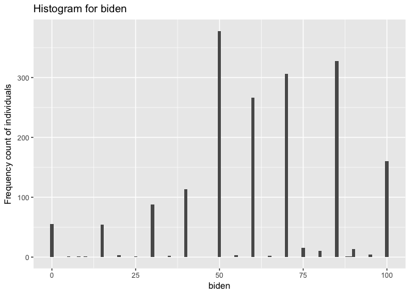
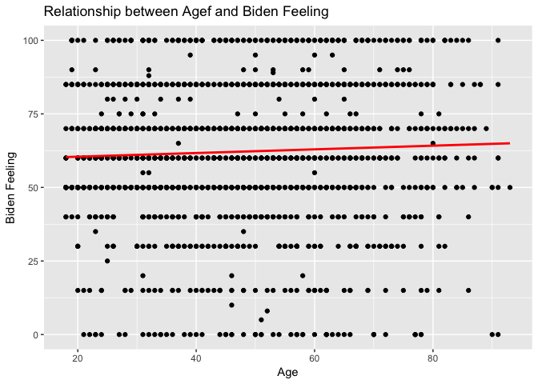
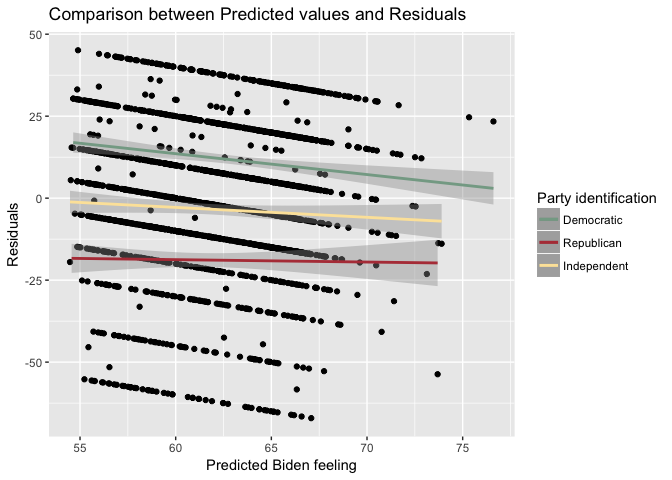
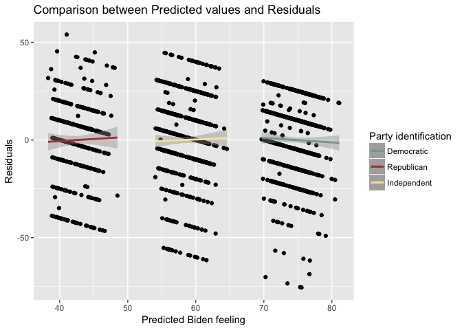

PS 5
================
Yuqing Zhang
2/10/2017

-   [Problem1: Describe the data](#problem1-describe-the-data)
-   [Problem2: Simple Linear Regression](#problem2-simple-linear-regression)
-   [Problem3: Multiple Linear Regression](#problem3-multiple-linear-regression)
-   [Problem4 More Multiple Linear Regression](#problem4-more-multiple-linear-regression)
-   [Problem 5 Interactive Linear Regression](#problem-5-interactive-linear-regression)

Problem1: Describe the data
---------------------------

``` r
mydata<-read.csv('biden.csv')
```



The graph is not continuous, with high counts at some point for example, at a feeling thermometer of 70 and then suddenly drops to a very low count, for example, to 20 at a feeling thermomether of 75. More people feel positive or neutral towards biden.

Problem2: Simple Linear Regression
----------------------------------

``` r
lm.2<-lm(formula = biden ~ age, data=mydata)
summary(lm.2)
```

    ## 
    ## Call:
    ## lm(formula = biden ~ age, data = mydata)
    ## 
    ## Residuals:
    ##     Min      1Q  Median      3Q     Max 
    ## -64.876 -12.318  -1.257  21.684  39.617 
    ## 
    ## Coefficients:
    ##             Estimate Std. Error t value Pr(>|t|)    
    ## (Intercept) 59.19736    1.64792   35.92   <2e-16 ***
    ## age          0.06241    0.03267    1.91   0.0563 .  
    ## ---
    ## Signif. codes:  0 '***' 0.001 '**' 0.01 '*' 0.05 '.' 0.1 ' ' 1
    ## 
    ## Residual standard error: 23.44 on 1805 degrees of freedom
    ## Multiple R-squared:  0.002018,   Adjusted R-squared:  0.001465 
    ## F-statistic: 3.649 on 1 and 1805 DF,  p-value: 0.05626

beta0 is 59.19736,std error is 1.64792. beta1 is 0.06241,std error is 0.03267.

1.  The p-value of age is 0.0563, meaning that there are more than 90% chance of rejecting the null hypothesis, which says that there is no relationship. Also, since the slope(coefficient) is 0.06241,instead of 0, so there is a relationship between the age and the biden.

2.  Since the slope(coefficient) is 0.06241, much smaller than 1, the relationship between the age and the biden is very weak.

3.  The relationship between the age and the biden is positive because the parameter of age is positive.

4.  The *R*<sup>2</sup> of the model is 0.002081. About 0.2% of the variation in biden does age alone explain. Since this is not a high percentage, this is a bad model.

``` r
grid <- mydata%>% 
  data_grid(age) 
grid <- grid %>% 
  add_predictions(lm.2) 
(pred_aug <- augment(lm.2, newdata = data_frame(age=c(45))))
```

    ##   age .fitted   .se.fit
    ## 1  45 62.0056 0.5577123

``` r
(pred_ci <- mutate(pred_aug,
                   ymin = .fitted - .se.fit * 1.96,
                   ymax = .fitted + .se.fit * 1.96))
```

    ##   age .fitted   .se.fit     ymin     ymax
    ## 1  45 62.0056 0.5577123 60.91248 63.09872

1.  According to the table, the predicted biden associated with an age of 45,according to the table, is 62.00560.The associated 95% confidence intervals are 60.91248 and 63.09872.

2.  Plot the response and predictor. Draw the least squares regression line.



Problem3: Multiple Linear Regression
------------------------------------

``` r
lm.3<-lm(formula = biden ~ age+female+educ, data=mydata)
summary(lm.3)
```

    ## 
    ## Call:
    ## lm(formula = biden ~ age + female + educ, data = mydata)
    ## 
    ## Residuals:
    ##     Min      1Q  Median      3Q     Max 
    ## -67.084 -14.662   0.703  18.847  45.105 
    ## 
    ## Coefficients:
    ##             Estimate Std. Error t value Pr(>|t|)    
    ## (Intercept) 68.62101    3.59600  19.083  < 2e-16 ***
    ## age          0.04188    0.03249   1.289    0.198    
    ## female       6.19607    1.09670   5.650 1.86e-08 ***
    ## educ        -0.88871    0.22469  -3.955 7.94e-05 ***
    ## ---
    ## Signif. codes:  0 '***' 0.001 '**' 0.01 '*' 0.05 '.' 0.1 ' ' 1
    ## 
    ## Residual standard error: 23.16 on 1803 degrees of freedom
    ## Multiple R-squared:  0.02723,    Adjusted R-squared:  0.02561 
    ## F-statistic: 16.82 on 3 and 1803 DF,  p-value: 8.876e-11

1.  beta0 is 68.62101,std error is 3.59600. The parameter for age, beta1 is 0.04188, the std.error is 0.03249; The parameter for gender, beta2 is 6.19607,the std.error is 1.09670; The parameter for education, beta3 is -0.88871, the std.error is 0.22469. The p-value for gender and education are both smaller than 0.001, meaning that the relationship between biden feeling and gender, and the relationship between biden feeling and education are statistically significant.

2.  The parameter for female is 6.19607, which means that there is positive relationship between gender and biden feeling and it has a stronger relationship than the other two predictors. The parameter can be interpreted as the estimated effect on a feeling thermometer of a 1 increase in the individual’s gender(aka. if the respondent is female), after controlling for the effects of age and education.

3.  The *R*<sup>2</sup> of the model is 0.02723. About 2.7% of the variation in biden does age, gender, and education explain. This is a better model than the age-only model.

4.  Generate a plot comparing the predicted values and residuals, drawing separate smooth fit lines for each party ID type



This model has problems. A good model should have residuals located around 0. However this model shows that Democrats' predicted warmth ratings are higher than actual ratings, while Republicans' ratings are lower.This means this model does not clearly explain the relationship between party ID and biden warmth scores.

Problem4 More Multiple Linear Regression
----------------------------------------

``` r
lm.4<-lm(formula = biden ~ age+female+educ+dem+rep, data=mydata)
summary(lm.4)
```

    ## 
    ## Call:
    ## lm(formula = biden ~ age + female + educ + dem + rep, data = mydata)
    ## 
    ## Residuals:
    ##     Min      1Q  Median      3Q     Max 
    ## -75.546 -11.295   1.018  12.776  53.977 
    ## 
    ## Coefficients:
    ##              Estimate Std. Error t value Pr(>|t|)    
    ## (Intercept)  58.81126    3.12444  18.823  < 2e-16 ***
    ## age           0.04826    0.02825   1.708   0.0877 .  
    ## female        4.10323    0.94823   4.327 1.59e-05 ***
    ## educ         -0.34533    0.19478  -1.773   0.0764 .  
    ## dem          15.42426    1.06803  14.442  < 2e-16 ***
    ## rep         -15.84951    1.31136 -12.086  < 2e-16 ***
    ## ---
    ## Signif. codes:  0 '***' 0.001 '**' 0.01 '*' 0.05 '.' 0.1 ' ' 1
    ## 
    ## Residual standard error: 19.91 on 1801 degrees of freedom
    ## Multiple R-squared:  0.2815, Adjusted R-squared:  0.2795 
    ## F-statistic: 141.1 on 5 and 1801 DF,  p-value: < 2.2e-16

The parameter beta0 is 58.8113, beta1 is 0.0483, std error is 3.12444, beta2 is 4.1032,std error is 0.02825. beta3 is -0.3453, std error is 0.19478. beta4 is 15.4243, std error is 1.06803. beta5 is -15.8495, std error is 1.31136.

1.  The parameter for gender in problem3 was larger than 4.10323. When we hold constant party identification in addition to age and education,the relationship between gender and Biden warmth becomes smaller, which means the ratings of feeling thermometer towards Biden of a female respondent than a male respondent is lower

2.  The *R*<sup>2</sup> of the model is 0.2815. Around 28% of the variation in biden does age, gender, education, and party identification explain. The percentage is larger than the age + gender + education model's, which was 2.7%, so this is a better model.

3.  Generate a plot comparing the predicted values and residuals, drawing separate smooth fit lines for each party ID type



By adding variables for party ID to the regression model, we fix the previous problem because now the three fit lines all have residuals located around 0, so the relationship between parties and Biden warmth score has been well explained.

Problem 5 Interactive Linear Regression
---------------------------------------

``` r
data_no_ind <- filter(mydata, dem == 1 | rep == 1)
lm.5 <- lm(biden ~ female * dem, data =data_no_ind )
tidy(lm.5)
```

    ##          term  estimate std.error statistic       p.value
    ## 1 (Intercept) 39.382022  1.455363 27.059928 4.045546e-125
    ## 2      female  6.395180  2.017807  3.169371  1.568102e-03
    ## 3         dem 33.687514  1.834799 18.360328  3.295008e-66
    ## 4  female:dem -3.945888  2.471577 -1.596506  1.106513e-01

beta0 is 39.382022,std error is 1.455363. beta1 = 6.395180,std error is 2.017807. beta2 is 33.6875,std error is 1.8348. beta3 is -3.9459. The standard errors are 1.4554, 2.0178, 1.8348, std error is 2.471577.

``` r
grid4 <- data_no_ind %>%
  data_grid(female, dem)
grid4 <- grid4 %>%
  add_predictions(lm.5)
(pred_aug <- augment(lm.5, newdata = grid4))
```

    ##   female dem     pred  .fitted   .se.fit
    ## 1      0   0 39.38202 39.38202 1.4553632
    ## 2      0   1 73.06954 73.06954 1.1173209
    ## 3      1   0 45.77720 45.77720 1.3976638
    ## 4      1   1 75.51883 75.51883 0.8881114

``` r
(pred_ci_2 <- mutate(pred_aug,
                   ymin = .fitted - .se.fit * 1.96,
                   ymax = .fitted + .se.fit * 1.96))
```

    ##   female dem     pred  .fitted   .se.fit     ymin     ymax
    ## 1      0   0 39.38202 39.38202 1.4553632 36.52951 42.23453
    ## 2      0   1 73.06954 73.06954 1.1173209 70.87959 75.25949
    ## 3      1   0 45.77720 45.77720 1.3976638 43.03778 48.51662
    ## 4      1   1 75.51883 75.51883 0.8881114 73.77813 77.25953

The predicted Biden warmth feeling thermometer ratings for female Democrats is 75.51883, the 95% confidence intervals are 73.78813 and 77.25953; 45.7772 for female Republicans and 95% confidence intervals are 43.03778 and 48.51662; 73.06954 for male Democrats, 95% confidence intervals are 70.87959 and 75.2595; 39.38202 for male Republicans and 95% confidence intervals are 36.52951 and 42.23453.

The relationship between party ID and Biden warmth differ for males/females. Overall female report higher warmth ratings toward Biden than males. Males are slightly more likely to be affected by partyID than females because as shown in the table, the predicted warmth of female republicants is about 30 points lower than female democrats, whereas the predicted warmth of male republicants is 24 points lower than male democrats.

The relationship between gender and Biden warmth differ for Democrats/Republicans. Republicants are more likely to be affected by gender than democrats because as shown in the table, the predicted warmth for female republicants is 6.3952 points higher than male Republicans, whereas the predicted warmth for female democrats is 2.4493 points (which is much lower than 6.3962) higher than male democrats.
