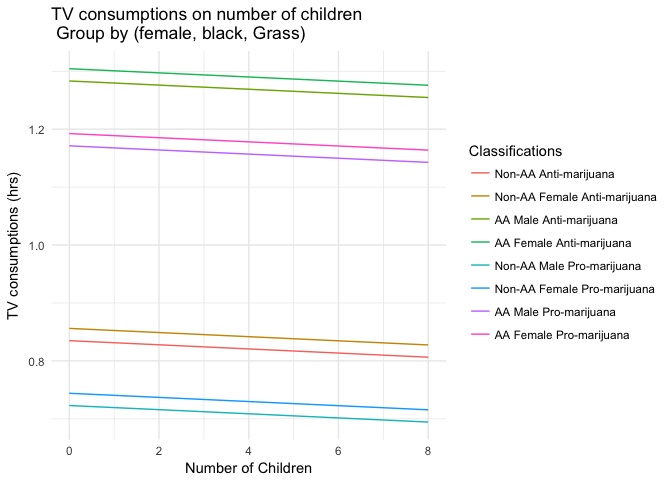

MACS 30100: Problem Set 6
================
Dongping Zhang
2/19/2017

-   [Part I: Modeling Voter Turnover](#part-i-modeling-voter-turnover)
    -   [I. Describe the data](#i.-describe-the-data)
    -   [II. Basic Models](#ii.-basic-models)
    -   [III. Multiple variable model](#iii.-multiple-variable-model)
-   [Part II: Modeling tv consumption](#part-ii-modeling-tv-consumption)

Part I: Modeling Voter Turnover
===============================

### I. Describe the data

-   **Plot a histogram of voter turnout. Make sure to give the graph a title and proper x and y-axis labels. What is the unconditional probability of a given individual turning out to vote?**
    -   **load in data**

    ``` r
    # load the data
    voter = read.csv('mental_health.csv')
    ```

    -   **plot the histogram**

    ``` r
    voter = voter %>%
      mutate(vote = factor(vote96, exclude = NULL, labels = c("Did not vote", 'Did vote', 'NA')))

    vstatus = as.data.frame(prop.table(table(voter$vote)))
    names(vstatus) = c('Status', 'Probability')
    ggplot(vstatus, aes(x = Status, y = Probability)) + 
      geom_bar(aes(color = Status, fill = Status), stat = 'identity') + 
      ggtitle("Histogram of Voting Status") +
      labs(x = "Voting status", y = "Percent of observations in bin") +
      theme(plot.title = element_text(hjust = 0.5))
    ```

    
    -   **compute unconditional probability of a given individual turning out to vote**: <br/> As showned in the histogram above and the unconditional probability table below, the unconditional probability of a given individual turning out to vote is about **62.96%**.

    ``` r
    vstatus
    ```

        ##         Status Probability
        ## 1 Did not vote  0.29307910
        ## 2     Did vote  0.62959040
        ## 3           NA  0.07733051

-   **Generate a scatterplot of the relationship between mental health and observed voter turnout and overlay a linear smoothing line. What information does this tell us? What is problematic about this linear smoothing line?** <br/> The scatterplot below describes the relationship between voting status and mental health index is that they likely to be negatively correlated, meaning that higher value of mental health index would typically make the individual less likely to vote. This plot certainly has some issues: voting status is a binary response variable with a 0/1 encoding, while the `lm` smoothing line could be interpreted as an crude estimate of Pr(voting|mental = X). If we were plotting futher down along the x-axis, some of our estimates might be ourside the \[0, 1\] interval, making them hard to interpret as probabilities.

``` r
mhealth_vote = na.omit(voter[,1:2])
ggplot(mhealth_vote, aes(x = mhealth_sum, y = vote96)) +
  geom_point() +
  geom_smooth(method = lm) +
  ggtitle("Scatterplot of voting status on mental health index") +
  labs(x = "Mental health index", y = "Voting Status") +
  theme(plot.title = element_text(hjust = 0.5))
```


### II. Basic Models

**1. Is the relationship between mental health and voter turnout statistically and/or substantively significant?**

``` r
mhealth_voter_logit = glm(vote96 ~ mhealth_sum, data = mhealth_vote, family = binomial)
summary(mhealth_voter_logit)
```

    ## 
    ## Call:
    ## glm(formula = vote96 ~ mhealth_sum, family = binomial, data = mhealth_vote)
    ## 
    ## Deviance Residuals: 
    ##     Min       1Q   Median       3Q      Max  
    ## -1.6834  -1.2977   0.7452   0.8428   1.6911  
    ## 
    ## Coefficients:
    ##             Estimate Std. Error z value Pr(>|z|)    
    ## (Intercept)  1.13921    0.08444  13.491  < 2e-16 ***
    ## mhealth_sum -0.14348    0.01969  -7.289 3.13e-13 ***
    ## ---
    ## Signif. codes:  0 '***' 0.001 '**' 0.01 '*' 0.05 '.' 0.1 ' ' 1
    ## 
    ## (Dispersion parameter for binomial family taken to be 1)
    ## 
    ##     Null deviance: 1672.1  on 1321  degrees of freedom
    ## Residual deviance: 1616.7  on 1320  degrees of freedom
    ## AIC: 1620.7
    ## 
    ## Number of Fisher Scoring iterations: 4

According to the coefficient *β*<sub>1</sub>, an increase in `mhealth_sum` is associated with a decrease in the probability of voting. Looking at the p-value of *β*<sub>1</sub>, which is 3.13 × 10<sup>−13</sup>, it means the null hypothesis could be rejected at 1% significance level, thus the relationship between mental health and voter turnout is statistically significant. In addtion, the coefficient of *β*<sub>1</sub> would cause the odds of voting to decrease by *e*<sup>0.14348</sup> = 1.154284 or 15% with one-unit increase of `mhealth_sum`, making the effect also to be substantive.

**2. Interpret the estimated parameter for mental health in terms of log-odds. Generate a graph of the relationship between mental health and the log-odds of voter turnout.** <br /> According to the coefficient of *β*<sub>1</sub> in the above logistic regression model, a one-unit increase in `mhealth_sum` is associated with a decrease in the log-odds of voting turnover by 0.14348.

``` r
mhealth_vote <- mhealth_vote %>%
  add_predictions(mhealth_voter_logit)

ggplot(mhealth_vote, aes(x = mhealth_sum, y = pred)) +
  geom_line(size = 1)+
  labs(x = 'Mental health index',
       y = 'Log-odds of voter turnover',
       title = 'Voter turnover of 1966 election \n Log-odds of voting turnover on mental health index') +
  theme(plot.title = element_text(hjust = 0.5))
```


**3. Interpret the estimated parameter for mental health in terms of odds. Generate a graph of the relationship between mental health and the odds of voter turnout.** <br /> To interpret the estimated parameter for mental health in terms of odds, a one-unit increase in `mhealth_sum` is associated with a decrease in the log-odds of voting turnover by 0.14348, or equivalently, is associated with a decrease in the odds of voting by *e*<sup>0.14348</sup> = 1.154284.

``` r
mhealth_vote <- mhealth_vote %>%
  mutate(odds = exp(pred))

ggplot(mhealth_vote, aes(x = mhealth_sum, y = odds)) +
  geom_line(size = 1)+
  labs(x = 'Mental health index',
       y = 'Odds of voter turnover',
       title = 'Voter turnover of 1966 election \n Odds of voting turnover on mental health index') +
  theme(plot.title = element_text(hjust = 0.5))
```


**4. Interpret the estimated parameter for mental health in terms of probabilities. Generate a graph of the relationship between mental health and the probability of voter turnout. What is the first difference for an increase in the mental health index from 1 to 2? What about for 5 to 6?**

``` r
# functions to convert logit to prob
logit2prob <- function(x){
  exp(x) / (1 + exp(x))
}

mhealth_vote <- mhealth_vote %>%
  mutate(probability = logit2prob(odds))

# plotting
ggplot(mhealth_vote, aes(x = mhealth_sum, y = probability)) +
  geom_line(size = 1)+
  labs(x = 'Mental health index',
       y = 'Probability of voting',
       title = 'Voter turnover of 1966 election \n Probability of voting on mental health index') +
  theme(plot.title = element_text(hjust = 0.5))
```


``` r
# compute the probability of given index
(prob1256 <- data.frame(mhealth_sum = c(1, 2, 5, 6)) %>%
  add_predictions(mhealth_voter_logit) %>%
  mutate(prob = logit2prob(pred)))
```

    ##   mhealth_sum      pred      prob
    ## 1           1 0.9957345 0.7302191
    ## 2           2 0.8522593 0.7010409
    ## 3           5 0.4218337 0.6039219
    ## 4           6 0.2783584 0.5691437

<br /> The difference for an increase in the mental health index from 1 to 2 is: 0.7010409 − 0.7302191 = −0.0291782, meaning an increase in the mental index from 1 to 2 would reduce the probability of voting by 0.0291782. <br /> The difference for an increase in the mental health index from to 2 is: 0.5691437 − 0.6039219 = −0.0347782, meaning an increase in the mental index from 5 to 6 would reduce the probability of voting by 0.0347782.

**5. Estimate the accuracy rate, proportional reduction in error (PRE), and the AUC for this model. Do you consider it to be a good model?**

-   The accuracy rate is about: 0.6778

``` r
accuracy <- na.omit(voter[,1:2]) %>%
  add_predictions(mhealth_voter_logit) %>%
  mutate(pred = logit2prob(pred)) %>%
  mutate(binary = as.numeric(pred > .5))
    
mean(accuracy$vote96 == accuracy$binary)
```

    ## [1] 0.677761

-   proportional reduction in error (PRE): 0.01616628

``` r
# function to calculate PRE for a logistic regression model
PRE <- function(model){
  # get the actual values for y from the data
  y <- model$y
  
  # get the predicted values for y from the model
  y.hat <- round(model$fitted.values)
  
  # calculate the errors for the null model and your model
  E1 <- sum(y != median(y))
  E2 <- sum(y != y.hat)
  
  # calculate the proportional reduction in error
  PRE <- (E1 - E2) / E1
  return(PRE)
}

PRE(mhealth_voter_logit)
```

    ## [1] 0.01616628

-   AUC: 0.6243

``` r
(auc_simple_logit <- auc(accuracy$vote96, accuracy$pred))
```

    ## Area under the curve: 0.6243

<br /> In conclusion, based on the above three statistics: approximately 67.78% of the predictions based on `mhealth_sum` only were correct using a standard baseline of 0.5; the statistical model reduced 1.616628% (PRE) of the prediction error; the overall performance of the classifier across all potential thresholds is 0.6243(AUC), which is greater than 0.5. From my perspective, the accuracy rate is 67.78% and AUC is 0.6243 implies that the model might be better than flipping a fair coin and making a random guess, but the PRE is too small to actually trust the model. So, it might only imply that `mhealth_sum` is a good predictor, but the current model is not a decent model to make predictions.

### III. Multiple variable model

**1. Write out the three components of the GLM for your specific model of interest.**

-   **Probability distribution (random component):** The random component is the Bernoulli distribution
    *P**r*(*Y*<sub>*i*</sub> = *y*<sub>*i*</sub>|*π*)=*π*<sub>*i*</sub><sup>*y*<sub>*i*</sub></sup>(1 − *π*<sub>*i*</sub>)<sup>(1 − *y*<sub>*i*</sub>)</sup>

-   **Linear predictor:**
    *η*<sub>*i*</sub> = *β*<sub>0</sub> + *β*<sub>1</sub> × *m**h**e**a**l**t**h*\_*s**u**m*<sub>*i*</sub> + *β*<sub>2</sub> × *a**g**e*<sub>*i*</sub> + *β*<sub>3</sub> × *e**d**u**c*<sub>*i*</sub> + *β*<sub>4</sub> × *b**l**a**c**k*<sub>*i*</sub> + *β*<sub>5</sub> × *f**e**m**a**l**e*<sub>*i*</sub> + *β*<sub>6</sub> × *m**a**r**r**i**e**d*<sub>*i*</sub> + *β*<sub>7</sub> × *i**n**c*10<sub>*i*</sub>

-   **Link function**: is the logit function
    $$\\pi\_i = g(\\eta\_i) = \\frac{e^{\\eta\_i}}{1 + e^{\\eta\_i}}$$

**2. Estimate the model and report your results.**

``` r
# git rid of all NAs
voter = na.omit(voter[,1:8])
voter_multi_logit <- glm(vote96 ~ ., data = voter, family = binomial)
summary(voter_multi_logit)
```

    ## 
    ## Call:
    ## glm(formula = vote96 ~ ., family = binomial, data = voter)
    ## 
    ## Deviance Residuals: 
    ##     Min       1Q   Median       3Q      Max  
    ## -2.4843  -1.0258   0.5182   0.8428   2.0758  
    ## 
    ## Coefficients:
    ##              Estimate Std. Error z value Pr(>|z|)    
    ## (Intercept) -4.304103   0.508103  -8.471  < 2e-16 ***
    ## mhealth_sum -0.089102   0.023642  -3.769 0.000164 ***
    ## age          0.042534   0.004814   8.835  < 2e-16 ***
    ## educ         0.228686   0.029532   7.744 9.65e-15 ***
    ## black        0.272984   0.202585   1.347 0.177820    
    ## female      -0.016969   0.139972  -0.121 0.903507    
    ## married      0.296915   0.153164   1.939 0.052557 .  
    ## inc10        0.069614   0.026532   2.624 0.008697 ** 
    ## ---
    ## Signif. codes:  0 '***' 0.001 '**' 0.01 '*' 0.05 '.' 0.1 ' ' 1
    ## 
    ## (Dispersion parameter for binomial family taken to be 1)
    ## 
    ##     Null deviance: 1468.3  on 1164  degrees of freedom
    ## Residual deviance: 1241.8  on 1157  degrees of freedom
    ## AIC: 1257.8
    ## 
    ## Number of Fisher Scoring iterations: 4

**3. Interpret the results in paragraph format.**

According to the table above, in the current logistic regression model, `mhealth_sum`, `age`, `educ`, and `inc10` are four predictors that are statistically significant. So based on the sign of those statistically significant coefficients, it can be implied that if a person is more aged, or more educated, or have a higher income, or previous three combined, the person is more likely to vote. On the other hand, people with higher mental health index would less likely to vote.

The rest of three predictors, `black`, `female`, and `married` are not statistically significant when setting *α* = 0.05, so I am interested to see if there is any difference between single/married African American males and females, and single/married non-African American males and females while holding everything else constant at median.

``` r
aa_voters = voter%>%
  data_grid(mhealth_sum, black, female, married) %>%
  cbind(age = median(voter$age),
        educ = median(voter$educ),
        inc10 = median(voter$inc10)) %>%
  add_predictions(voter_multi_logit)%>%
  mutate(probability = logit2prob(pred))

ggplot(aa_voters, aes(x = mhealth_sum, y = probability))+
  geom_line(aes(group = interaction(black, married, female), color = interaction(black, married, female))) +
  scale_color_discrete(name = 'Classifications',
                       labels = c('Single Non-AA Male',
                                  'Single AA Male',
                                  'Married Non-AA Male',
                                  'Married AA Male', 
                                  'Single Non-AA Female',
                                  'Single AA Female',
                                  'Married Non-AA Female',
                                  'Married AA Female')) +
  labs(x = 'Mental health index',
       y = 'Probablity of voting',
       title = 'Probablity of Voting vs.Mental Health Index \n Group by (black, married, female)')
```


So from the above plot, we are able to observe something very interesting: Married AA males and females have the highest probability of voting while single Non-AA males and females have the lowest probability of voting. Thus, I definitely see there is some interaction effect and the current model can still be imporved using those interaction variables.

``` r
# accuracy rate
accuracy_multiLogit <- voter %>%
  add_predictions(voter_multi_logit) %>%
  mutate(pred = logit2prob(pred)) %>%
  mutate(binary = as.numeric(pred > .5))
accuracy_rate_ML = mean(accuracy_multiLogit$vote96 == accuracy_multiLogit$binary)

# pre
pre_ML <- PRE(voter_multi_logit)

# auc
auc_simple_logit = auc(accuracy_multiLogit$vote96, accuracy_multiLogit$pred)

c('Accuracy Rate' = accuracy_rate_ML,
  'PRE' = pre_ML,
  'AUC' = auc_simple_logit)
```

    ## Accuracy Rate           PRE           AUC 
    ##     0.7236052     0.1481481     0.7596240

In order to assess the prediction power of the current multivariate logistic regression model, I would implement the same procedures to compute the accuracy rate, PRE, and AUC. Based on the above three new statistics: approximately 72.36% of the predictions are correct based on current predictors using a standard baseline of 0.5; the statistical model reduced 14.81% (PRE) of the prediction error; the overall performance of the classifier across all potential thresholds is 0.7596240(AUC), which is greater than 0.5. From my perspective, after adding more predictors into the model, it definitely has imporved and is performing better than the previous simple logistic regression model. The accuracy rate is 72.36% and AUC is 0.7596240 implies that the current model is definitely performing better than random guess, but the PRE is still relatively small meaning there might be other predictors or interaction effects can be take into the model.

Part II: Modeling tv consumption
================================

**1. Write out the three components of the GLM for your specific model of interest.**

-   **Probability distribution (random component)**: the poission distribution
    $$Pr(Y\_i = y\_i | \\mu) = \\frac{\\mu^ke^{-y\_i}}{y\_i!}$$

-   **Linear predictor**
    $$\\eta\_i = \\beta\_0 + \\beta\_1 \\times age\_i + \\beta\_2 \\times childs\_i + \\beta\_3 \\times educ\_i + \\beta\_4 \\times female\_i + \\beta\_5 \\times hrsrelax\_i + \\beta\_6 \\times black\_i +\\\\ \\beta\_7 \\times social\\\_connect\_i + \\beta\_8 \\times voted04\_i$$
-   **Link function**: the log function
    *μ*<sub>*i*</sub> = *g*(*η*<sub>*i*</sub>)=*e*<sup>*η*<sub>*i*</sub></sup>

**2. Estimate the model and report your results.**

``` r
tv = read.csv('gss2006.csv')
tv = tv[,1:12]
tv_glm = glm(tvhours~age + childs+ hrsrelax + black + social_connect + female + educ + voted04 + grass, data = tv, family = poisson)
```

    ## Warning: Dropping 4064 rows with missing values

``` r
summary(tv_glm)
```

    ## 
    ## Call:
    ## glm(formula = tvhours ~ age + childs + hrsrelax + black + social_connect + 
    ##     female + educ + voted04 + grass, family = poisson, data = tv)
    ## 
    ## Deviance Residuals: 
    ##     Min       1Q   Median       3Q      Max  
    ## -2.9568  -0.7326  -0.1052   0.4621   5.2793  
    ## 
    ## Coefficients:
    ##                 Estimate Std. Error z value Pr(>|z|)    
    ## (Intercept)     1.143759   0.204833   5.584 2.35e-08 ***
    ## age             0.001043   0.002790   0.374  0.70857    
    ## childs         -0.003569   0.023660  -0.151  0.88010    
    ## hrsrelax        0.045459   0.009859   4.611 4.01e-06 ***
    ## black           0.448326   0.074589   6.011 1.85e-09 ***
    ## social_connect  0.053114   0.039362   1.349  0.17722    
    ## female          0.021157   0.063731   0.332  0.73991    
    ## educ           -0.033957   0.012064  -2.815  0.00488 ** 
    ## voted04        -0.100686   0.075705  -1.330  0.18353    
    ## grass          -0.111974   0.062758  -1.784  0.07439 .  
    ## ---
    ## Signif. codes:  0 '***' 0.001 '**' 0.01 '*' 0.05 '.' 0.1 ' ' 1
    ## 
    ## (Dispersion parameter for poisson family taken to be 1)
    ## 
    ##     Null deviance: 531.86  on 445  degrees of freedom
    ## Residual deviance: 443.24  on 436  degrees of freedom
    ##   (4064 observations deleted due to missingness)
    ## AIC: 1598.2
    ## 
    ## Number of Fisher Scoring iterations: 5

**3. Interpret the results in paragraph format.** According to the table above, in the current linear model, `hrsrelax`, `black`, `educ`, and `voted04` are four predictors that are statistically significant at 5% significance level. Based on the sign of those statistically significant coefficients, it can be implied that if a person has more hours to relax, or is black, or both, the person is more likley to consume more TV. On the other hand, if a person is more educated, and has voted, or both, the person would consume less TV. Among other predictors, one surprising finding is that `female` has a positive coefficient. I originally expect it to be negative because women would tend to have more responsibilites in a households. So I am interested in seeing whether there would be any interaction effect mong `female`, `grass`, and `black`, or AA males/females vs. non-AA males/females, while setting other variables to be the median.

``` r
tv2 = tv %>%
  data_grid(childs, female, black, grass) %>%
  cbind(age = median(voter$age, na.rm = TRUE),
        hrsrelax = median(tv$hrsrelax, na.rm = TRUE),
        social_connect = median(tv$social_connect, na.rm = TRUE),
        educ = median(tv$educ, na.rm = TRUE),
        voted04 = median(tv$voted04, na.rm = TRUE)) %>%
  add_predictions(tv_glm)

ggplot(tv2, aes(x = childs, y = pred))+
  geom_line(aes(group = interaction(female, black, grass), color = interaction(female, black, grass))) +
  scale_color_discrete(name = 'Classifications',
                       labels = c('Non-AA Anti-marijuana',
                                  'Non-AA Female Anti-marijuana',
                                  'AA Male Anti-marijuana',
                                  'AA Female Anti-marijuana',
                                  'Non-AA Male Pro-marijuana',
                                  'Non-AA Female Pro-marijuana',
                                  'AA Male Pro-marijuana',
                                  'AA Female Pro-marijuana')) +
  labs(x = 'Number of Children',
       y = 'TV consumptions (hrs)',
       title = 'TV consumptions on number of children \n Group by (female, black, Grass)')
```



According to the plot above, the result is also very interesting. So in general, as expected, the more children a person have, the less TV s/he would consume. However, holding other predictors to be constant at median, African Americans, regardless of gender and opinion on marijuana, would typically consume more TV than non-African Americans. Within each group, females tend to consume more TV than males; however, within each racial group, more TV consumption tend to make people not likely to support legalizing marijuana while less TV consumption tend to make people support legalizing marijuana. Thus, I would definitely suspect there are some interaction effect among `female`, `grass`, and `black`.
