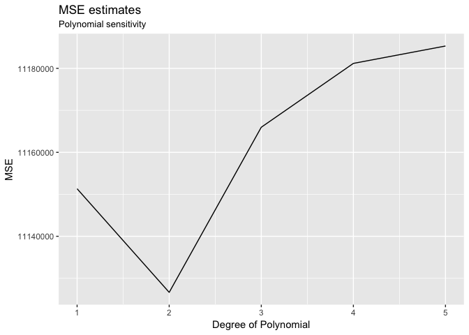
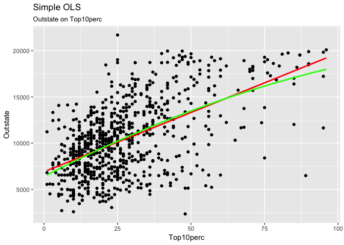
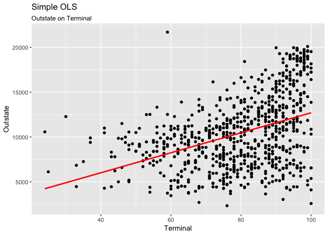
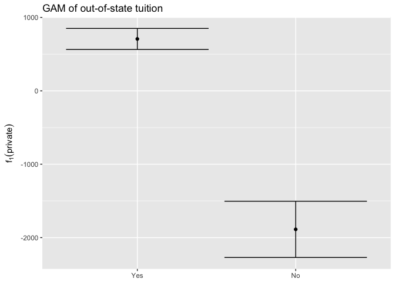
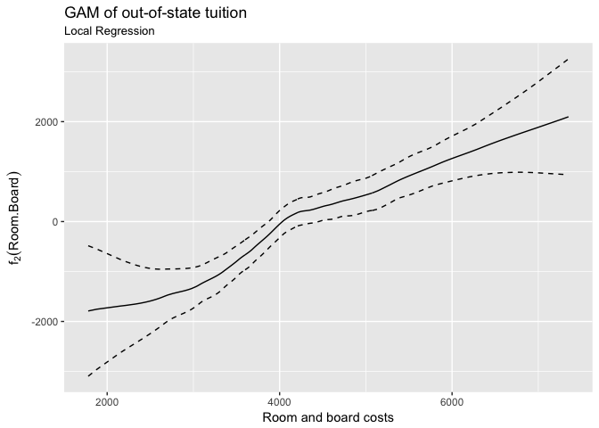
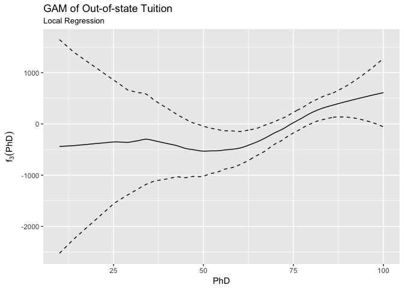
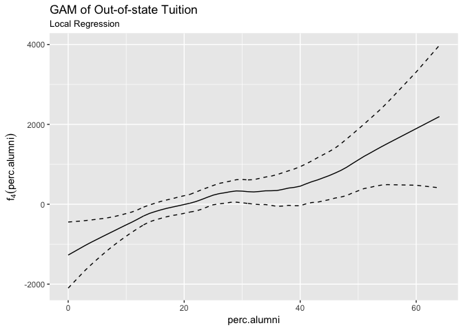
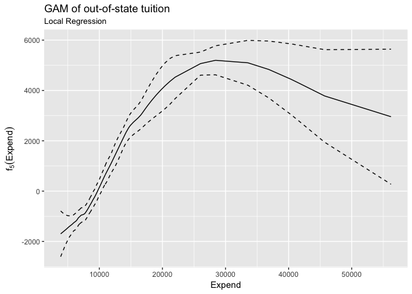
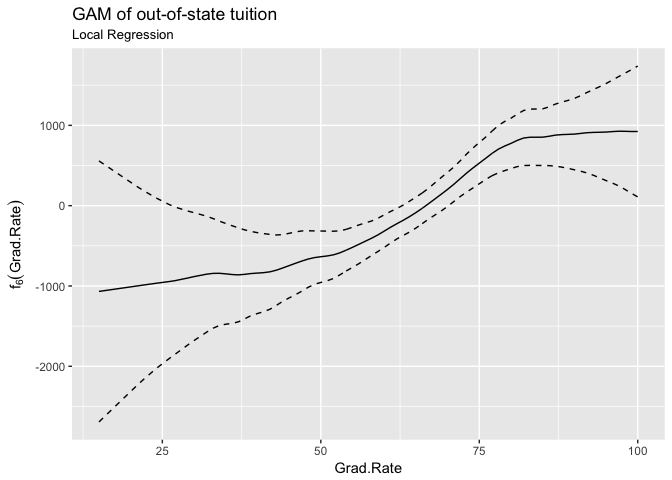

MACS 30100: Problem Set 7
================
Dongping Zhang
2/27/2017

-   [Part I. Sexy Joe Biden (redux)](#part-i.-sexy-joe-biden-redux)
-   [Part 2: College (bivariate)](#part-2-college-bivariate)
    -   [1/a). Predictor 1: `Top10perc`](#a.-predictor-1-top10perc)
    -   [1/b). Predictor 2: `Expend`](#b.-predictor-2-expend)
    -   [1/c). Predictor 3: `Terminal`](#c.-predictor-3-terminal)
-   [Part 3: College (GAM)](#part-3-college-gam)

Part I. Sexy Joe Biden (redux)
==============================

**1. Estimate the training MSE of the model using the traditional approach.**

-   Load the `biden.csv` dataset

``` r
biden <- read.csv('biden.csv')
```

-   Fit the linear regression model using the entire dataset and calculate the mean squared error for the training set.

``` r
biden_lm <- lm(biden ~ age + female + educ + dem + rep, data = biden)
```

-   Construct a function that computes MSE

``` r
mse <- function(model, data) {
  x <- modelr:::residuals(model, data)
  mean(x ^ 2, na.rm = TRUE)
}
```

-   Compute the training MSE of the model using traditional approach

``` r
(biden_MSE_trad = mse(biden_lm, biden))
```

    ## [1] 395.2702

------------------------------------------------------------------------

**2. Estimate the test MSE of the model using the validation set approach.**

-   Set the seed to ensure reproducibility

``` r
set.seed(1234)
```

-   Split the sample set into a training set (70%) and a validation set (30%)

``` r
biden_split <- resample_partition(biden, c(test = 0.3, train = 0.7))
```

-   Fit the linear regression model using only the training observations

``` r
biden_train <- lm(biden ~ age + female + educ + dem + rep, data = biden_split$train)
```

-   Calculate the MSE using only the test set observations

``` r
(biden_MSE_test <- mse(biden_train, biden_split$test))
```

    ## [1] 399.8303

-   How does this value compare to the training MSE from step 1?

<!-- -->

    ## Traditional  Validation 
    ##    395.2702    399.8303

Shown in the table above, the MSE obtained using validation set approach has slightly larger MSE value than the traditional value. This variation is expected because validation estimates of the test MSE can be highly variable depending on which observations are sampled into the training and test sets based on seed.

------------------------------------------------------------------------

**3. Repeat the validation set approach 100 times, using 100 different splits of the observations into a training set and a validation set. Comment on the results obtained.**

-   Set the seed again to ensure reproducibility

``` r
set.seed(1234)
```

-   Write a function that would split the `biden` dataset differently on a specified training vs. testing scale

``` r
mse_dist <- function(dataset, model, test_percent, train_percent){
  # split dataset
  dataset_split = resample_partition(biden, c(test = test_percent, train = train_percent))
  # compute mse
  mse_vec = NULL
  mse_vec = c(mse_vec, mse(model, dataset_split$test))
  return(mse_vec) 
}
```

-   Generate 100 MSE values, and compute the mean of those 100 MSE values

``` r
mse100_biden <- unlist(rerun(100, mse_dist(biden, biden_lm, 0.7, 0.3)))
mse100_biden.df <- as.data.frame(mse100_biden)
mean100MSE = mean(mse100_biden)
```

-   Generate a plot to show the distribution of those 100 MSEs

``` r
ggplot(mse100_biden.df, aes(x = mse100_biden)) + 
  geom_histogram(aes(y = ..density..), binwidth = 4, color = 'black', fill = 'grey') + 
  labs(title = "Variability of MSE estimates",
       subtitle = "Using 100 validation set approach",
       x = "MSEs",
       y = "Percent of observations in bins") + 
  geom_vline(aes(xintercept = biden_MSE_trad, color = "MSE Traditional"), size = 1) + 
  geom_vline(aes(xintercept = biden_MSE_test, color = "MSE using 1 validation set"), size = 1) + 
  geom_vline(aes(xintercept = mean100MSE, color = "Mean MSE of 100 validation set"), size = 1) +
  scale_color_manual(name = NULL, breaks = c("MSE Traditional", "MSE using 1 validation set", 
                                             "Mean MSE of 100 validation set"),
                     values = c("blue", "green", "red")) +
  theme(legend.position = "bottom")
```


-   How does this value compare to the training MSE from step 1?

<!-- -->

    ##        Traditional   1 Validation Set 100 Validation Set 
    ##           395.2702           399.8303           394.7611

As shows in the histogram above and the table above, the MSE using 1 validation set is 399.83, which is a lot greater than the 100 validation set approach. However, the mean MSE obtained using 100 validation set approach is very similar to the traditional approach.
\*\*\*

**4. Estimate the test MSE of the model using the leave-one-out cross-validation (LOOCV) approach. Comment on the results obtained.**

-   Split the data frame into k-folds

``` r
loocv_biden_data <- crossv_kfold(biden, k = nrow(biden))
```

-   Estimate the linear model k times, excluding the holdout test observation, then calculate the test MSE

``` r
loocv_biden_models <- map(loocv_biden_data$train, ~ lm(biden ~ age + female + educ + dem + rep, data = .))
loocv_biden_mse <- map2_dbl(loocv_biden_models, loocv_biden_data$test, mse)
(loocv_biden_MSE = mean(loocv_biden_mse))
```

    ## [1] 397.9555

    ##     Trad    1VSet  100VSet    LOOCV 
    ## 395.2702 399.8303 394.7611 397.9555

It can be shows that the MSE computed using LOOCV approach is arounbd 397, which is between 1VSet appraoch and 100 VSet approach.

------------------------------------------------------------------------

**5. Estimate the test MSE of the model using the 10-fold cross-validation approach. Comment on the results obtained.**

-   Set the seed again to ensure reproducibility

``` r
set.seed(1234)
```

-   Split the data into 10 folds

``` r
biden_10fold <- crossv_kfold(biden, k = 10)
```

-   Apply biden model to each fold

``` r
biden_10models <- map(biden_10fold$train, ~ lm(biden ~ age + female + educ + dem + rep, data = .))
```

-   Get the 10 MSEs and the mean of 10 MSEs

``` r
biden_10mses <- map2_dbl(biden_10models, biden_10fold$test, mse)
mean_10mses <- mean(biden_10mses)
```

    ##     Trad    1VSet  100VSet    LOOCV    10FCV 
    ## 395.2702 399.8303 394.7611 397.9555 397.8837

As showned in the table above, the MSE obtained using 10-fold cross validation approach is 397.88, which is very similiar to the LOOCV approach, and the MSE is still located between 1VSet approach and 100VSet approach.

------------------------------------------------------------------------

**6. Repeat the 10-fold cross-validation approach 100 times, using 100 different splits of the observations into 10-folds. Comment on the results obtained.**

-   Set the seed again to ensure reproducibility

``` r
set.seed(1234)
```

-   Write a function that would split implement a 10-fold cross validation

``` r
cv_10folds <- function(dataset, k){
  # split dataset
  dataset_10fold <- crossv_kfold(dataset, k)
  loocv_dataset_models <- map(dataset_10fold$train, ~ lm(biden ~ age + female + educ + dem + rep, data = .))
  loocv_dataset_mse <- map2_dbl(loocv_dataset_models, dataset_10fold$test, mse)
  loocv_dataset_MSE = mean(loocv_dataset_mse)
  
  return(mean(loocv_dataset_MSE))
}
```

-   Generate 100 different sets of 10 MSE values, and compute the mean of the means

``` r
mse_cv10folds <- unlist(rerun(100, cv_10folds(biden, 10)))
mse_cv10folds.df <- as.data.frame(mse_cv10folds)
mean_100_10MSEs = mean(mse_cv10folds)
```

-   Generate a plot to show the distribution of those 100 MSEs

``` r
ggplot(mse_cv10folds.df, aes(x = mse_cv10folds)) + 
  geom_histogram(aes(y = ..density..), bins = 30, color = 'black', fill = 'grey') + 
  labs(title = "Variability of MSE estimates",
       subtitle = "Using 10-fold cross-validation approach 100 times",
       x = "MSEs",
       y = "Percent of observations in bins") + 
  geom_vline(aes(xintercept = biden_MSE_trad, color = "MSE Traditional"), size = 1) + 
  geom_vline(aes(xintercept = biden_MSE_test, color = "MSE using 1 validation set"), size = 1) + 
  geom_vline(aes(xintercept = mean100MSE, color = "Mean MSE of 100 validation set"), size = 1) +
  geom_vline(aes(xintercept = loocv_biden_MSE, color = "LOOCV")) + 
  geom_vline(aes(xintercept = mean_100_10MSEs, color = "Mean MSE of 10Folds-CV 100 time")) +
  scale_color_manual(name = "Methods", 
                     breaks = c("MSE Traditional", 
                                "MSE using 1 validation set", 
                                "Mean MSE of 100 validation set",
                                "LOOCV",
                                "Mean MSE of 10Folds-CV 100 time"),
                     values = c("blue", "green", "red", "orange", "turquoise"))
```


    ##     Trad    1VSet  100VSet    LOOCV    10FCV 10FCV100 
    ## 395.2702 399.8303 394.7611 397.9555 397.8837 398.0642

As shown in the plot and table above, the mean MSE value generated by implementing 10 folds cross validation 100 times (red line) is very similiar to the blue line, which is the MSE value obtained by LOOCV method. They are both approximately located between 1VSet and mean of 100VSet.

------------------------------------------------------------------------

**7. Compare the estimated parameters and standard errors from the original model in step 1 (the model estimated using all of the available data) to parameters and standard errors estimated using the bootstrap (n=1000).**

-   Set the seed again to ensure reproducibility

``` r
set.seed(1234)
```

-   Implement the bootstrap method

``` r
biden_boot <- biden %>%
  modelr::bootstrap(1000) %>%
  mutate(model = map(strap, ~ lm(biden ~ ., data = .)),
         coef = map(model, tidy))

biden_boot %>%
  unnest(coef) %>%
  group_by(term) %>%
  summarize(est.boot = mean(estimate),
            se.boot = sd(estimate, na.rm = TRUE))
```

    ## # A tibble: 6 × 3
    ##          term     est.boot    se.boot
    ##         <chr>        <dbl>      <dbl>
    ## 1 (Intercept)  58.96180746 2.94989029
    ## 2         age   0.04756082 0.02846997
    ## 3         dem  15.42942074 1.11104505
    ## 4        educ  -0.35119332 0.19201866
    ## 5      female   4.07552938 0.94880851
    ## 6         rep -15.88710208 1.43153427

-   Recall the original model

``` r
coef(summary(biden_lm))
```

    ##                 Estimate Std. Error    t value     Pr(>|t|)
    ## (Intercept)  58.81125899  3.1244366  18.822996 2.694143e-72
    ## age           0.04825892  0.0282474   1.708438 8.772744e-02
    ## female        4.10323009  0.9482286   4.327258 1.592601e-05
    ## educ         -0.34533479  0.1947796  -1.772952 7.640571e-02
    ## dem          15.42425563  1.0680327  14.441745 8.144928e-45
    ## rep         -15.84950614  1.3113624 -12.086290 2.157309e-32

As shown above, the estimates obtained using boostrap and the estimates obtained using OLS are essentially the same, but there are differences between their standard errors, and it can observed that the standard error of bootstrap tend to be larger.

Part 2: College (bivariate)
===========================

**1. Explore the bivariate relationships between some of the available predictors and Outstate. You should estimate at least 3 simple linear regression models (i.e. only one predictor per model). Use non-linear fitting techniques in order to fit a flexible model to the data, as appropriate.**

-   Load the dataset

``` r
college <- read.csv('college.csv')
```

### 1/a). Predictor 1: `Top10perc`

``` r
bivar_top10 <- lm(Outstate ~ Top10perc, data = college)
summary(bivar_top10)
```

    ## 
    ## Call:
    ## lm(formula = Outstate ~ Top10perc, data = college)
    ## 
    ## Residuals:
    ##      Min       1Q   Median       3Q      Max 
    ## -11831.1  -2418.4    211.1   2116.4  11587.4 
    ## 
    ## Coefficients:
    ##             Estimate Std. Error t value Pr(>|t|)    
    ## (Intercept) 6906.459    221.614   31.16   <2e-16 ***
    ## Top10perc    128.244      6.774   18.93   <2e-16 ***
    ## ---
    ## Signif. codes:  0 '***' 0.001 '**' 0.01 '*' 0.05 '.' 0.1 ' ' 1
    ## 
    ## Residual standard error: 3329 on 775 degrees of freedom
    ## Multiple R-squared:  0.3162, Adjusted R-squared:  0.3153 
    ## F-statistic: 358.4 on 1 and 775 DF,  p-value: < 2.2e-16

It turned out that if we run a simple OLS using predictor `Top10perc`, it turned to be indeed statistically significant. The *R*<sup>2</sup> is 0.3162, meaning that 31.62% of variability in `outstate` can be explained by using `Top10perc` alone.

To observe how is the simple OLS fit the data, I plotted a scatterplot and superimposed by the regression line.

``` r
college1 <- college %>%
  tbl_df() %>%
  add_predictions(bivar_top10) %>%
  add_residuals(bivar_top10) 

ggplot(college1, aes(x=Top10perc, y=Outstate)) +
  geom_point() +
  geom_line(aes(y = pred), color = "red", size = 1) +
  labs(title = "Simple OLS",
       subtitle = "Outstate on Top10perc",
       x = "Top10perc",
       y = "Outstate")
```


So after observing the regression line and the pattern of the data points, I am suspecting that polynomial regression might be able to better fit the data since. In order to prove my speculation, I used 10-fold cross-validation method to see the change does MSE changes using according to different polynomials:

``` r
set.seed(1234)

top10_data <- crossv_kfold(college1, k = 10)
top10_error_fold10 <- vector("numeric", 5)
terms <- 1:5

for(i in terms){
  top10_models <- map(top10_data$train, ~ lm(Outstate ~ poly(Top10perc, i), data = .))
  top10_mse <- map2_dbl(top10_models, top10_data$test, mse)
  top10_error_fold10[[i]] <- mean(top10_mse)
}

data_frame(terms = terms,
           fold10 = top10_error_fold10) %>%
  ggplot(aes(x=terms, y=fold10)) +
  geom_line() +
  labs(title = "MSE estimates",
       subtitle = 'Polynomial sensitivity',
       x = "Degree of Polynomial",
       y = "MSE")
```



According to the plot above, the second degree polynomial terms seems that could potential fit the data the best. So, I re-made the model so as to hope for imporvement in *R*<sup>2</sup> statistic.

``` r
top10_better <- lm(Outstate ~ poly(Top10perc, 2), data = college)
summary(top10_better)
```

    ## 
    ## Call:
    ## lm(formula = Outstate ~ poly(Top10perc, 2), data = college)
    ## 
    ## Residuals:
    ##      Min       1Q   Median       3Q      Max 
    ## -10940.5  -2457.5    210.3   2164.9  11476.8 
    ## 
    ## Coefficients:
    ##                     Estimate Std. Error t value Pr(>|t|)    
    ## (Intercept)          10440.7      119.3  87.549   <2e-16 ***
    ## poly(Top10perc, 2)1  63019.4     3324.2  18.958   <2e-16 ***
    ## poly(Top10perc, 2)2  -5905.2     3324.2  -1.776   0.0761 .  
    ## ---
    ## Signif. codes:  0 '***' 0.001 '**' 0.01 '*' 0.05 '.' 0.1 ' ' 1
    ## 
    ## Residual standard error: 3324 on 774 degrees of freedom
    ## Multiple R-squared:  0.319,  Adjusted R-squared:  0.3172 
    ## F-statistic: 181.3 on 2 and 774 DF,  p-value: < 2.2e-16

``` r
college2 <- college1 %>%
  tbl_df() %>%
  add_predictions(top10_better)

ggplot(college2, aes(x=Top10perc, y=Outstate)) +
  geom_point() +
  geom_line(aes(y = pred), data = college1, color = "red", size = 1) +
  geom_line(aes(y = pred), data = college2, color = "green", size = 1) + 
  labs(title = "Simple OLS",
       subtitle = "Outstate on Top10perc",
       x = "Top10perc",
       y = "Outstate")
```



My new model, which now include the second-order polynomial term, has an *R*<sup>2</sup> statistic of 0.319, or 31.9%, which is just a slight imporvement from 31.62%. Although the improvement is infinestimal, but nevertheless, we could still see improvement in the goodness of fit.

### 1/b). Predictor 2: `Expend`

``` r
bivar_expense <- lm(Outstate ~ Expend, data = college)
summary(bivar_expense)
```

    ## 
    ## Call:
    ## lm(formula = Outstate ~ Expend, data = college)
    ## 
    ## Residuals:
    ##      Min       1Q   Median       3Q      Max 
    ## -15780.8  -2088.7     57.6   2010.8   7784.5 
    ## 
    ## Coefficients:
    ##              Estimate Std. Error t value Pr(>|t|)    
    ## (Intercept) 5.434e+03  2.248e+02   24.17   <2e-16 ***
    ## Expend      5.183e-01  2.047e-02   25.32   <2e-16 ***
    ## ---
    ## Signif. codes:  0 '***' 0.001 '**' 0.01 '*' 0.05 '.' 0.1 ' ' 1
    ## 
    ## Residual standard error: 2978 on 775 degrees of freedom
    ## Multiple R-squared:  0.4526, Adjusted R-squared:  0.4519 
    ## F-statistic: 640.9 on 1 and 775 DF,  p-value: < 2.2e-16

The reason I am choosing `Expend` is becasue I speculate a cheaper tuition price might be able to attract more out-of-state students to attand the school. After running a simple OLS of the model, the *R*<sup>2</sup> statistics obtained is 0.4526, meaning that 45.26% of variability in `outstate` can be explained by using `Expend` alone.

To observe how is the simple OLS fit the data, I plotted a scatterplot and superimposed by the regression line.

``` r
college3 <- college %>%
  tbl_df() %>%
  add_predictions(bivar_expense)

ggplot(college3, aes(x=Expend, y=Outstate)) +
  geom_point() +
  geom_smooth(method = 'lm', color = 'red', se = FALSE) +
  labs(title = "Simple OLS",
       subtitle = "Outstate on Expend",
       x = "Expend",
       y = "Outstate")
```


So after observing the regression line and the pattern of the data points, I am suspecting maybe a log transformation, or third-order polynomial could potentiall fit the data better by increasing the *R*<sup>2</sup> statistic. In order to prove my speculation, I first used 10-fold cross-validation method to see if there is nay change in MSE corresponding to different degrees of polynomials:

``` r
set.seed(1234)

expend_data <- crossv_kfold(college3, k = 10)
expend_error_fold10 <- vector("numeric", 5)
terms <- 1:5

for(i in terms){
  expend_models <- map(expend_data$train, ~ lm(Outstate ~ poly(Expend, i), data = .))
  expend_mse <- map2_dbl(expend_models, expend_data$test, mse)
  expend_error_fold10[[i]] <- mean(expend_mse)
}

data_frame(terms = terms,
           fold10 = expend_error_fold10) %>%
  ggplot(aes(x=terms, y=fold10)) +
  geom_line() +
  labs(title = "MSE estimates",
       subtitle = 'Polynomial sensitivity',
       x = "Degree of Polynomial",
       y = "MSE")
```


According to the plot above, it seems the third degree polynomial terms seems could potentially fit the data the best, so I recreate a new model hoping for better model performance:

``` r
expense_better <- lm(Outstate ~ poly(Expend, 3), data = college3)
summary(expense_better)
```

    ## 
    ## Call:
    ## lm(formula = Outstate ~ poly(Expend, 3), data = college3)
    ## 
    ## Residuals:
    ##      Min       1Q   Median       3Q      Max 
    ## -11428.4  -1513.1    199.9   1722.1   5932.1 
    ## 
    ## Coefficients:
    ##                   Estimate Std. Error t value Pr(>|t|)    
    ## (Intercept)       10440.67      91.11 114.588  < 2e-16 ***
    ## poly(Expend, 3)1  75397.14    2539.79  29.686  < 2e-16 ***
    ## poly(Expend, 3)2 -41623.05    2539.79 -16.388  < 2e-16 ***
    ## poly(Expend, 3)3  12483.02    2539.79   4.915 1.08e-06 ***
    ## ---
    ## Signif. codes:  0 '***' 0.001 '**' 0.01 '*' 0.05 '.' 0.1 ' ' 1
    ## 
    ## Residual standard error: 2540 on 773 degrees of freedom
    ## Multiple R-squared:  0.603,  Adjusted R-squared:  0.6014 
    ## F-statistic: 391.3 on 3 and 773 DF,  p-value: < 2.2e-16

``` r
college4 <- college3 %>%
  add_predictions(expense_better)

ggplot(college4, aes(x=Expend, y=Outstate)) +
  geom_point() +
  geom_line(aes(y = pred), data = college3, color = "red", size = 1) +
  geom_line(aes(y = pred), data = college4, color = "green", size = 1) + 
  labs(title = "Simple OLS",
       subtitle = "Outstate on Expend",
       x = "Expend",
       y = "Outstate")
```


It turned out the new model indeed fits the data better and has increased the *R*<sup>2</sup> statistics from 0.4526 to 0.603. Now, I would try log-transformation of predictors to see if it can perform a better estimate:

``` r
expense_log <- lm(Outstate ~ log(Expend), data = college3)
summary(expense_log)
```

    ## 
    ## Call:
    ## lm(formula = Outstate ~ log(Expend), data = college3)
    ## 
    ## Residuals:
    ##      Min       1Q   Median       3Q      Max 
    ## -10650.6  -1571.5    100.5   1805.8   6603.9 
    ## 
    ## Coefficients:
    ##             Estimate Std. Error t value Pr(>|t|)    
    ## (Intercept) -57502.0     2089.9  -27.51   <2e-16 ***
    ## log(Expend)   7482.1      229.9   32.54   <2e-16 ***
    ## ---
    ## Signif. codes:  0 '***' 0.001 '**' 0.01 '*' 0.05 '.' 0.1 ' ' 1
    ## 
    ## Residual standard error: 2617 on 775 degrees of freedom
    ## Multiple R-squared:  0.5774, Adjusted R-squared:  0.5769 
    ## F-statistic:  1059 on 1 and 775 DF,  p-value: < 2.2e-16

``` r
college4 <- college3 %>%
  add_predictions(expense_log)

ggplot(college4, aes(x=Expend, y=Outstate)) +
  geom_point() +
  geom_line(aes(y = pred), data = college3, color = "red", size = 1) +
  geom_line(aes(y = pred), data = college4, color = "green", size = 1) + 
  labs(title = "Simple OLS",
       subtitle = "Outstate on Expend",
       x = "Expend",
       y = "Outstate")
```


As showned by the regression summary and plots above, it seems like log-transformation does not do as good of a job as a third order polynomial. Thus, third-order polynomial seems to be a better fit of the model based on 10-fold cv method.

### 1/c). Predictor 3: `Terminal`

``` r
bivar_terminal <- lm(Outstate ~ Terminal, data = college)
summary(bivar_terminal)
```

    ## 
    ## Call:
    ## lm(formula = Outstate ~ Terminal, data = college)
    ## 
    ## Residuals:
    ##      Min       1Q   Median       3Q      Max 
    ## -10123.5  -2988.6    253.2   2330.9  13567.4 
    ## 
    ## Coefficients:
    ##             Estimate Std. Error t value Pr(>|t|)    
    ## (Intercept) 1555.008    726.338   2.141   0.0326 *  
    ## Terminal     111.485      8.962  12.440   <2e-16 ***
    ## ---
    ## Signif. codes:  0 '***' 0.001 '**' 0.01 '*' 0.05 '.' 0.1 ' ' 1
    ## 
    ## Residual standard error: 3675 on 775 degrees of freedom
    ## Multiple R-squared:  0.1665, Adjusted R-squared:  0.1654 
    ## F-statistic: 154.8 on 1 and 775 DF,  p-value: < 2.2e-16

The reasion I am choosing `Terminal` is becasue it is reasonable to assume the more instructors with a terminal degree, the more attractive this school would be, and thus the more out-of-state students the school will have. In the simple OLS model, the *R*<sup>2</sup> statistic is 0.1665, meaning that 16.65% of variability in `outstate` can be explained by using `Terminal` alone.

To observe how is the simple OLS fit the data, I plotted a scatterplot and superimposed by the regression line.

``` r
college5 <- college %>%
  tbl_df() %>%
  add_predictions(bivar_terminal)

ggplot(college5, aes(x=Terminal, y=Outstate)) +
  geom_point() +
  geom_smooth(method = 'lm', color = 'red', se = FALSE) +
  labs(title = "Simple OLS",
       subtitle = "Outstate on Terminal",
       x = "Terminal",
       y = "Outstate")
```



So after observing the regression line and the pattern of the data points, I am suspecting a quadratic term might be able to make the data fit better. In order to prove my speculation, I used 10-fold cross-validation method to see the change does MSE changes using according to different polynomials:

``` r
set.seed(1234)

terminal_data <- crossv_kfold(college5, k = 10)
terminal_error_fold10 <- vector("numeric", 5)
terms <- 1:5

for(i in terms){
  terminal_models <- map(terminal_data$train, ~ lm(Outstate ~ poly(Terminal, i), data = .))
  terminal_mse <- map2_dbl(terminal_models, terminal_data$test, mse)
  terminal_error_fold10[[i]] <- mean(terminal_mse)
}

data_frame(terms = terms,
           fold10 = terminal_error_fold10) %>%
  ggplot(aes(x=terms, y=fold10)) +
  geom_line() +
  labs(title = "MSE estimates",
       subtitle = 'Polynomial sensitivity',
       x = "Degree of Polynomial",
       y = "MSE")
```


Actually, it turned out that although the scatterplot makes it seems like a quadratic shape, but the third order polynomial could fits the data the best according to 10-folds cv method

``` r
terminal_better <- lm(Outstate ~ poly(Terminal, 3), data = college) 
summary(terminal_better)
```

    ## 
    ## Call:
    ## lm(formula = Outstate ~ poly(Terminal, 3), data = college)
    ## 
    ## Residuals:
    ##      Min       1Q   Median       3Q      Max 
    ## -12208.3  -2606.5    209.1   2449.7  13240.3 
    ## 
    ## Coefficients:
    ##                    Estimate Std. Error t value Pr(>|t|)    
    ## (Intercept)         10440.7      127.6  81.814  < 2e-16 ***
    ## poly(Terminal, 3)1  45722.0     3557.2  12.853  < 2e-16 ***
    ## poly(Terminal, 3)2  24297.0     3557.2   6.830 1.72e-11 ***
    ## poly(Terminal, 3)3   9846.2     3557.2   2.768  0.00578 ** 
    ## ---
    ## Signif. codes:  0 '***' 0.001 '**' 0.01 '*' 0.05 '.' 0.1 ' ' 1
    ## 
    ## Residual standard error: 3557 on 773 degrees of freedom
    ## Multiple R-squared:  0.2212, Adjusted R-squared:  0.2182 
    ## F-statistic: 73.17 on 3 and 773 DF,  p-value: < 2.2e-16

``` r
college6 <- college5 %>%
  add_predictions(terminal_better)

ggplot(college4, aes(x=Terminal, y=Outstate)) +
  geom_point() +
  geom_line(aes(y = pred), data = college5, color = "red", size = 1) +
  geom_line(aes(y = pred), data = college6, color = "green", size = 1) + 
  labs(title = "Simple OLS",
       subtitle = "Outstate on Expend",
       x = "Expend",
       y = "Outstate")
```


In conclusion, the third degree polynomial terms seems to make the data fit better, and it turned out to be true that the *R*<sup>2</sup> statistic has imporved from 0.1665 to 0.2212.

Part 3: College (GAM)
=====================

**1. Split the data into a training set and a test set.**

``` r
set.seed(1234)
college_split <- resample_partition(college, c(test = 0.5, train = 0.5))
```

**2. Estimate an OLS model on the training data, using out-of-state tuition (Outstate) as the response variable and the other six variables as the predictors. Interpret the results and explain your findings, using appropriate techniques (tables, graphs, statistical tests, etc.).**

``` r
college_OLS <- lm(Outstate ~ Private + Room.Board + PhD + perc.alumni + Expend + Grad.Rate, data = college_split$train)
summary(college_OLS)
```

    ## 
    ## Call:
    ## lm(formula = Outstate ~ Private + Room.Board + PhD + perc.alumni + 
    ##     Expend + Grad.Rate, data = college_split$train)
    ## 
    ## Residuals:
    ##     Min      1Q  Median      3Q     Max 
    ## -7837.9 -1294.5    17.8  1238.1  5943.1 
    ## 
    ## Coefficients:
    ##               Estimate Std. Error t value Pr(>|t|)    
    ## (Intercept) -3.886e+03  6.225e+02  -6.243 1.14e-09 ***
    ## PrivateYes   2.762e+03  2.934e+02   9.414  < 2e-16 ***
    ## Room.Board   1.033e+00  1.205e-01   8.574 2.52e-16 ***
    ## PhD          3.763e+01  8.240e+00   4.567 6.68e-06 ***
    ## perc.alumni  5.655e+01  1.046e+01   5.405 1.14e-07 ***
    ## Expend       1.765e-01  2.398e-02   7.359 1.14e-12 ***
    ## Grad.Rate    3.290e+01  7.834e+00   4.199 3.34e-05 ***
    ## ---
    ## Signif. codes:  0 '***' 0.001 '**' 0.01 '*' 0.05 '.' 0.1 ' ' 1
    ## 
    ## Residual standard error: 2032 on 382 degrees of freedom
    ## Multiple R-squared:  0.7521, Adjusted R-squared:  0.7482 
    ## F-statistic: 193.1 on 6 and 382 DF,  p-value: < 2.2e-16

The summary of the linear regression model above showed that all 6 predictors have a positive effect to `Outstate`, and the coefficients of those 6 predictors are all statistically significant. The *R*<sup>2</sup> statistics obtained by the current model is 0.7521, meaning that 75.21% of variability in outstate could be explained by using current six predictors. Among those 6 predictors, `PrivateYes` seems to have the greatest effect because it has the greatest coefficient. This dummy variable indicates that on average, if the school is a private school, our-of-state tuition would be 2762 higher on average.

**3. Estimate a GAM on the training data, using out-of-state tuition (Outstate) as the response variable and the other six variables as the predictors. You can select any non-linear method (or linear) presented in the readings or in-class to fit each variable. Plot the results, and explain your findings. Interpret the results and explain your findings, using appropriate techniques (tables, graphs, statistical tests, etc.).**

``` r
college_gam <- gam(Outstate ~ Private + lo(Room.Board) + lo(PhD) + lo(perc.alumni) + 
                     lo(Expend) + lo(Grad.Rate), data = college_split$train)
gam_preds <- preplot(college_gam, se = TRUE, rug = FALSE)
summary(college_gam)
```

    ## 
    ## Call: gam(formula = Outstate ~ Private + lo(Room.Board) + lo(PhD) + 
    ##     lo(perc.alumni) + lo(Expend) + lo(Grad.Rate), data = college_split$train)
    ## Deviance Residuals:
    ##      Min       1Q   Median       3Q      Max 
    ## -6983.24 -1008.42   -37.17  1289.68  4601.20 
    ## 
    ## (Dispersion Parameter for gaussian family taken to be 3460245)
    ## 
    ##     Null Deviance: 6362233950 on 388 degrees of freedom
    ## Residual Deviance: 1270844504 on 367.2701 degrees of freedom
    ## AIC: 6984.148 
    ## 
    ## Number of Local Scoring Iterations: 2 
    ## 
    ## Anova for Parametric Effects
    ##                     Df     Sum Sq    Mean Sq F value    Pr(>F)    
    ## Private           1.00 1794329506 1794329506 518.556 < 2.2e-16 ***
    ## lo(Room.Board)    1.00 1210958455 1210958455 349.963 < 2.2e-16 ***
    ## lo(PhD)           1.00  469693542  469693542 135.740 < 2.2e-16 ***
    ## lo(perc.alumni)   1.00  221219001  221219001  63.932 1.693e-14 ***
    ## lo(Expend)        1.00  431359566  431359566 124.662 < 2.2e-16 ***
    ## lo(Grad.Rate)     1.00   85198971   85198971  24.622 1.069e-06 ***
    ## Residuals       367.27 1270844504    3460245                      
    ## ---
    ## Signif. codes:  0 '***' 0.001 '**' 0.01 '*' 0.05 '.' 0.1 ' ' 1
    ## 
    ## Anova for Nonparametric Effects
    ##                 Npar Df  Npar F     Pr(F)    
    ## (Intercept)                                  
    ## Private                                      
    ## lo(Room.Board)      3.0  1.7342    0.1587    
    ## lo(PhD)             2.6  1.2715    0.2840    
    ## lo(perc.alumni)     2.6  1.0390    0.3679    
    ## lo(Expend)          4.0 16.7368 1.358e-12 ***
    ## lo(Grad.Rate)       2.5  1.9467    0.1329    
    ## ---
    ## Signif. codes:  0 '***' 0.001 '**' 0.01 '*' 0.05 '.' 0.1 ' ' 1

As showed in the table above, I used cubic models to `Expend` and `Grad.Rate` based on my experience in Part II. I also used local regression on `PhD` and `perc.alumni`, and lm on `Private` and `Room.Board`. According to the p-values, all those coefficient are statistially significant.

It could be showned below that the difference between private and public schools to out-of-state tuition is statistically and substantively significant.

``` r
## Private
data_frame(x = gam_preds$`Private`$x,
           y = gam_preds$`Private`$y,
           se.fit = gam_preds$`Private`$se.y) %>%
  unique %>%
  mutate(y_low = y - 1.96 * se.fit,
         y_high = y + 1.96 * se.fit,
         x = factor(x, levels = c("Yes", "No"), labels = c("Yes", "No"))) %>%
  ggplot(aes(x, y, ymin = y_low, ymax = y_high)) +
  geom_errorbar() +
  geom_point() +
  labs(title = "GAM of out-of-state tuition",
       x = NULL,
       y = expression(f[1](private)))
```



A consistent and positive relationship for `Room.Board` with `Overstate` and the effect seems to be statistically significant.

``` r
# Room.Board
data_frame(x = gam_preds$`lo(Room.Board)`$x,
           y = gam_preds$`lo(Room.Board)`$y,
           se.fit = gam_preds$`lo(Room.Board)`$se.y) %>%
  mutate(y_low = y - 1.96 * se.fit,
         y_high = y + 1.96 * se.fit) %>%
  ggplot(aes(x, y)) +
  geom_line() +
  geom_line(aes(y = y_low), linetype = 2) +
  geom_line(aes(y = y_high), linetype = 2) +
  labs(title = "GAM of out-of-state tuition",
       subtitle = "Local Regression",
       x = "Room and board costs",
       y = expression(f[2](Room.Board)))
```



The applied local regression method for `PhD`shows that a higher percentage of faculty has PhDs would likely to increase out-of-state tuition. However, the increase is not consistent at all, there is a local maximuma at around 30% and a local minimum at around 60%.

``` r
# PhD
data_frame(x = gam_preds$`lo(PhD)`$x,
           y = gam_preds$`lo(PhD)`$y,
           se.fit = gam_preds$`lo(PhD)`$se.y) %>%
  mutate(y_low = y - 1.96 * se.fit,
         y_high = y + 1.96 * se.fit) %>%
  ggplot(aes(x, y)) +
  geom_line() +
  geom_line(aes(y = y_low), linetype = 2) +
  geom_line(aes(y = y_high), linetype = 2) +
  labs(title = "GAM of Out-of-state Tuition",
       subtitle = "Local Regression",
       x = "PhD",
       y = expression(f[3](PhD)))
```



There seems to be a positive relationship between `perc.alumni`, percent of alumni donation, and out-of-state tuitions. However, the slope would be greater once it passed 50% threshold.

``` r
# perc.alumni
data_frame(x = gam_preds$`lo(perc.alumni)`$x,
           y = gam_preds$`lo(perc.alumni)`$y,
           se.fit = gam_preds$`lo(perc.alumni)`$se.y) %>%
  mutate(y_low = y - 1.96 * se.fit,
         y_high = y + 1.96 * se.fit) %>%
  ggplot(aes(x, y)) +
  geom_line() +
  geom_line(aes(y = y_low), linetype = 2) +
  geom_line(aes(y = y_high), linetype = 2) +
  labs(title = "GAM of Out-of-state Tuition",
       subtitle = "Local Regression",
       x = "perc.alumni",
       y = expression(f[4](perc.alumni)))
```



The plot for `Expend` seems to have varying effect to out-of-state tuition based on the value of `Expend`.

``` r
#  Expend
data_frame(x = gam_preds$`lo(Expend)`$x,
           y = gam_preds$`lo(Expend)`$y,
           se.fit = gam_preds$`lo(Expend)`$se.y) %>%
  mutate(y_low = y - 1.96 * se.fit,
         y_high = y + 1.96 * se.fit) %>%
  ggplot(aes(x, y)) +
  geom_line() +
  geom_line(aes(y = y_low), linetype = 2) +
  geom_line(aes(y = y_high), linetype = 2) +
  labs(title = "GAM of out-of-state tuition",
       subtitle = "Local Regression",
       x = "Expend",
       y = expression(f[5](Expend)))
```



The plot below presents that a high `Grad.Rate` is likely associated with a high out-of-state tuition. However, a threshold seems to be at 75%. Graduate rate greater than 75% does not seem to have much effect on out-of-state tuition rate.

``` r
#  PhD
data_frame(x = gam_preds$`lo(Grad.Rate)`$x,
           y = gam_preds$`lo(Grad.Rate)`$y,
           se.fit = gam_preds$`lo(Grad.Rate)`$se.y) %>%
  mutate(y_low = y - 1.96 * se.fit,
         y_high = y + 1.96 * se.fit) %>%
  ggplot(aes(x, y)) +
  geom_line() +
  geom_line(aes(y = y_low), linetype = 2) +
  geom_line(aes(y = y_high), linetype = 2) +
  labs(title = "GAM of out-of-state tuition",
       subtitle = "Local Regression",
       x = "Grad.Rate",
       y = expression(f[6](Grad.Rate)))
```



**4. Use the test set to evaluate the model fit of the estimated OLS and GAM models, and explain the results obtained.**

``` r
mse_lm <- mse(college_OLS, college_split$test)
mse_gam <- mse(college_gam, college_split$test)
data_frame(model = c("LM", "GAM"),
           MSE = c(mse_lm, mse_gam))
```

    ## # A tibble: 2 × 2
    ##   model     MSE
    ##   <chr>   <dbl>
    ## 1    LM 4195761
    ## 2   GAM 3750495

As shown above, it is clear that GAM's MSE is relatively smaller than that of LM. This is expected because we are treating predictors cautiously and included nonlinearity into the model, which could help the data to fit better and make more accurate predictions.

**5. For which variables, if any, is there evidence of a non-linear relationship with the response?**

After looking at the plots and analyses above, I highly suspect `Expend` and `PhD` to have non-linear relationship with `Outstate`. In both of those two plots, there are positive slopes (increasing trend) as well as negative slopes (decreasing trend) showing the possibilities of non-linearity. At the same time, the other plots all exhibiting consistent increaseing rate or positive slopes. In conclusion, `Expend` and `PhD` are most likely to have non-linear relationship with `Outstate`.
