MACS 30100: Problem Set 8
================
Dongping Zhang
3/3/2017

-   [Part 1: Sexy Joe Biden (redux times two)](#part-1-sexy-joe-biden-redux-times-two)
-   [Part 2: Modeling voter turnout](#part-2-modeling-voter-turnout)
-   [Part 3: OJ Simpson](#part-3-oj-simpson)

Part 1: Sexy Joe Biden (redux times two)
========================================

**1. Split the data into a training set (70%) and a validation set (30%). Be sure to set your seed prior to this part of your code to guarantee reproducibility of results.**

-   Load the `biden.csv` dataset

``` r
biden <- read.csv('biden.csv') %>%
  mutate_each(funs(as.factor(.)), female, dem, rep) %>%
  na.omit
```

-   Set the seed to ensure reproducibility

``` r
set.seed(1234)
```

-   Split the sample set into a training set (70%) and a testing set (30%)

``` r
biden_split <- resample_partition(biden, c(test = 0.3, train = 0.7))
```

**2. Fit a decision tree to the training data, with biden as the response variable and the other variables as predictors. Plot the tree and interpret the results. What is the test MSE?**

-   Fit the decision to the training data using `biden` as the response variable and the other variables as predictors

``` r
biden_tree <- tree(biden ~ ., data = biden_split$train)
```

-   Plot the tree

``` r
mod <- biden_tree
tree_data <- dendro_data(mod)
ggplot(segment(tree_data)) +
  geom_segment(aes(x = x, y = y, xend = xend, yend = yend), 
               alpha = 0.5) +
  geom_text(data = label(tree_data), 
            aes(x = x, y = y, label = label_full), vjust = -0.5, size = 3) +
  geom_text(data = leaf_label(tree_data), 
            aes(x = x, y = y, label = label), vjust = 0.5, size = 3) +
  theme_dendro()
```


According to the regression tree constructed using the `biden` dataset, the top split assigns observations having `dem = 1` to the right branch. In that branch, the predicted score is given by the mean response value for the observation in the dataset with `dem = 1`, which is 74.51.

Observations with `dem = 0` are assigned to the left branch, and then that group is further subdivided by `rep`. Thus, the tree stratifies all observations into three regions of predictor space: dem, rep, or other. These three regions can be written as *R*<sub>1</sub> = {*X*|*d**e**m* = 1}, *R*<sub>2</sub> = {*X*|*r**e**p* = 1}, and *R*<sub>3</sub> = {*X*|*d**e**m* = 0, *r**e**p* = 0}. The predicted biden score are the mean of the observations falling in those three predictor space, and according to the tree plot presented above *R*<sub>1</sub> = {74.51|*d**e**m* = 1}, *R*<sub>2</sub> = {43.23|*r**e**p* = 1}, and *R*<sub>3</sub> = {57.46|*d**e**m* = 0, *r**e**p* = 0}.

-   Construct a function that computes MSE

``` r
mse <- function(model, data) {
  x <- modelr:::residuals(model, data)
  mean(x ^ 2, na.rm = TRUE)
}
```

-   Compute the test MSE: the test MSE is **406**, which is presented below.

``` r
mse(biden_tree, biden_split$test)
```

    ## [1] 406

**3. Use cross-validation to determine the optimal level of tree complexity, plot the optimal tree, and interpret the results. Does pruning the tree improve the test MSE?**

-   Fit another tree to the training data with the following `control` options

``` r
biden_tree <- tree(biden ~ ., data = biden_split$train, 
                   control = tree.control(
                     nobs = nrow(biden),
                     mindev = 0))
```

-   Use 10-fold CV to select the optimal tree size:
    -   generate 10-fold cv tree

    ``` r
    # generate 10-fold CV trees
    biden_cv <- crossv_kfold(biden, k = 10) %>%
      mutate(tree = map(train, ~ tree(biden ~. , data = .,
                                      control = tree.control(
                                        nobs = nrow(biden),
                                        mindev = 0))))
    ```

    -   calculate each possible prune result for each fold and to generate the plot

    ``` r
    biden_cv <- expand.grid(biden_cv$.id, 2:10) %>%
      as_tibble() %>%
      mutate(Var2 = as.numeric(Var2)) %>%
      rename(.id = Var1, k = Var2) %>%
      left_join(biden_cv, by = ".id") %>%
      mutate(prune = map2(tree, k, ~ prune.tree(.x, best = .y)),
             mse = map2_dbl(prune, test, mse))
    ```

    -   plotting optimal mse

    ``` r
    biden_cv %>%
      dplyr::select(k, mse) %>%
      group_by(k) %>%
      summarize(test_mse = mean(mse), sd = sd(mse, na.rm = TRUE)) %>%
      ggplot(aes(k, test_mse)) +
      geom_point() +
      geom_line() +
      labs(x = "Number of terminal nodes",
           y = "Test MSE")
    ```

    

    -   present detailed stats of MSE and standard deviation: detailed stats are presented below, using 10-fold cv, the optimal level of tree complexity is to have 3 terminal nodes,

    ``` r
    biden_cv %>%
      dplyr::select(k, mse) %>%
      group_by(k) %>%
      summarize(test_mse = mean(mse), sd = sd(mse, na.rm = TRUE))
    ```

        ## # A tibble: 9 × 3
        ##       k test_mse    sd
        ##   <dbl>    <dbl> <dbl>
        ## 1     2      434  38.1
        ## 2     3      402  39.1
        ## 3     4      403  37.0
        ## 4     5      404  36.3
        ## 5     6      406  36.8
        ## 6     7      408  33.9
        ## 7     8      409  35.1
        ## 8     9      412  37.8
        ## 9    10      415  36.4

    -   visualize the tree by setting `k = 3`: we discovered the branches are the same and the internal nodes are also the same. Observations with `dem = 1` are assigned to the right branch while observations with `dem = 0` are assigned to the left branch. The left branch is further subdivided by `rep`. Thus, the tree stratifies all observations into three regions of predictor space: dem, rep, or other. These three regions can be written as *R*<sub>1</sub> = {*X*|*d**e**m* = 1}, *R*<sub>2</sub> = {*X*|*r**e**p* = 1}, and *R*<sub>3</sub> = {*X*|*d**e**m* = 0, *r**e**p* = 0}. The predicted biden score are the mean of the observations falling in those three predictor spaces, and according to the tree plot presented above *R*<sub>1</sub> = {74.51|*d**e**m* = 1}, *R*<sub>2</sub> = {43.23|*r**e**p* = 1}, and *R*<sub>3</sub> = {57.46|*d**e**m* = 0, *r**e**p* = 0}.

    ``` r
    mod_prune3 <- prune.tree(biden_tree, best = 3)
    tree_data <- dendro_data(mod)
      ggplot(segment(tree_data)) +
      geom_segment(aes(x = x, y = y, xend = xend, yend = yend), 
                   alpha = 0.5) +
      geom_text(data = label(tree_data), 
                aes(x = x, y = y, label = label_full), 
                vjust = -0.5, size = 3) +
      geom_text(data = leaf_label(tree_data), 
                aes(x = x, y = y, label = label), 
                vjust = 0.5, size = 3) +
      theme_dendro()
    ```

    

    -   compute the new test mse: as shown below, after prunning the tree to the optimal 3 terminal nodes, the test MSE is the same as the previous value of 406.

    ``` r
    mse(prune.tree(biden_tree, best = 3), biden_split$test)
    ```

        ## [1] 406

**4. Use the bagging approach to analyze this data. What test MSE do you obtain? Obtain variable importance measures and interpret the results.**

-   implement bagging algorithm

``` r
(biden_bag <- randomForest(biden ~ ., type = regression, 
                           data = biden_split$train,
                           mse = TRUE, importance = TRUE, mtry = 5, ntree = 500))
```

    ## 
    ## Call:
    ##  randomForest(formula = biden ~ ., data = biden_split$train, type = regression,      mse = TRUE, importance = TRUE, mtry = 5, ntree = 500) 
    ##                Type of random forest: regression
    ##                      Number of trees: 500
    ## No. of variables tried at each split: 5
    ## 
    ##           Mean of squared residuals: 497
    ##                     % Var explained: 8.94

-   calculate the new mse: **485**, which is greater than 406, the results obtained before.

``` r
mse(biden_bag, biden_split$test)
```

    ## [1] 484

-   variable importance measure

``` r
data_frame(var = rownames(importance(biden_bag)),
           MeanDecreaseMSE = importance(biden_bag)[,1]) %>%
  mutate(var = fct_reorder(var, MeanDecreaseMSE, fun = median)) %>%
  ggplot(aes(var, MeanDecreaseMSE)) +
  geom_point() +
  coord_flip() +
  labs(title = "Predicting Biden score",
       subtitle = "Bagging",
       x = NULL,
       y = "Degree of Importance (%IncMSE)")
```

 According to the variable importance measurement, `dem` seems to be the most important predictor for the biden score, where as `rep`, `age`, `educ`, `female` are relatively unimportant. The plot implies that assigning other values for `dem` randomly but 'realistically' by permuting this predictor's values over the dataset, would on average increase MSE by 80%.

**5. Use the random forest approach to analyze this data. What test MSE do you obtain? Obtain variable importance measures and interpret the results. Describe the effect of m, the number of variables considered at each split, on the error rate obtained.**

-   implement random forest algorithm

``` r
(biden_rf <- randomForest(biden ~ ., type = regression, 
                           data = biden_split$train, importance = TRUE))
```

    ## 
    ## Call:
    ##  randomForest(formula = biden ~ ., data = biden_split$train, type = regression,      importance = TRUE) 
    ##                Type of random forest: regression
    ##                      Number of trees: 500
    ## No. of variables tried at each split: 1
    ## 
    ##           Mean of squared residuals: 407
    ##                     % Var explained: 25.4

-   calculate the new mse: **412**, which is lower than the MSE obtained using bagging algorithm.

``` r
mse(biden_rf, biden_split$test)
```

    ## [1] 412

-   variable importance measurement:

``` r
data_frame(var = rownames(importance(biden_rf)),
           MeanDecreaseMSE = importance(biden_rf)[,1]) %>%
  mutate(var = fct_reorder(var, MeanDecreaseMSE, fun = median)) %>%
  ggplot(aes(var, MeanDecreaseMSE)) +
  geom_point() +
  coord_flip() +
  labs(title = "Predicting Biden score",
       subtitle = "Random forest",
       x = NULL,
       y = "Degree of Importance (%IncMSE)")
```


As shown in the plot above, using the random forest algorithm, I have obtained that `dem` and `rep` are the most important variables to determine biden score while `female`, `age`, and `educ` are relatively unimportant. The plot implies that assigning other values for `dem` and `rep` randomly but 'realistically' by permuting this predictor's values over the dataset, would on average increase MSE by 28% and 26% correspondingly.

-   describe the effect of m, the number of variables considered at each split, on the error rate obtained: different from the bagging algorithm that uses all predictors, m = p at each split, in the random forest algorithm, m is the number of predictors randomly selected from the total possible predictors p, which intentionally ignores a random set of variables. Every time a new split is considered, a new random sample m is drawn. The error rate or MSE would likely to decrease because choosing m predictors at each split would exclude single or several dominant predictors in the dataset and thus would likely to reduce the error rate or MSE.

**6. Use the boosting approach to analyze the data. What test MSE do you obtain? How does the value of the shrinkage parameter *λ* influence the test MSE?**

-   implement the boosting algorithm and setting shrinkage parameter *λ* to be different values from 0.0001, to 0.1.

``` r
biden_boost00001 <- gbm(biden ~ ., distribution = 'gaussian',
                        data = biden_split$train, shrinkage = 0.0001)
biden_boost0001 <- gbm(biden ~ ., distribution = 'gaussian',
                       data = biden_split$train, shrinkage = 0.001)
biden_boost001 <- gbm(biden ~ ., distribution = 'gaussian',
                      data = biden_split$train, shrinkage = 0.01)
biden_boost01 <- gbm(biden ~ ., distribution = 'gaussian',
                     data = biden_split$train, shrinkage = 0.1)
```

-   construct a function to compute MSE

``` r
boost_mse <- function(model, input_data){
  pred <- predict(model, input_data, n.trees = 1000)
  actual_index <- input_data$idx
  actual <- input_data$data$biden[actual_index]
  mse <- (mean((pred - actual)^2))
  return(mse)
}
```

-   compute mse and create a table to present the result: In conclusion, according to the matrix presented below, test MSE would likely to decrease as the shrinkage parameter, *λ*, increases.

``` r
mse00001 <- boost_mse(biden_boost00001, biden_split$test)
mse0001 <- boost_mse(biden_boost0001, biden_split$test)
mse001 <- boost_mse(biden_boost001, biden_split$test)
mse01 <- boost_mse(biden_boost01, biden_split$test)

boostmse <- matrix(c(mse00001, mse0001, mse001, mse01), 
                   ncol=4, byrow=TRUE)
colnames(boostmse) <- c("0.0001", "0.001", "0.01", "0.1")
rownames(boostmse) <- c("test MSE")
boostmse <- as.table(boostmse)
boostmse
```

    ##          0.0001 0.001 0.01 0.1
    ## test MSE    558   539  444 399

------------------------------------------------------------------------

Part 2: Modeling voter turnout
==============================

**1. Use cross-validation techniques and standard measures of model fit (e.g. test error rate, PRE, ROC curves/AUC) to compare and evaluate at least five tree-based models of voter turnout. Select the best model and interpret the results using whatever methods you see fit (graphs, tables, model fit statistics, predictions for hypothetical observations, etc.)**

-   load the raw dataset and modify factor variables into specific levels

``` r
mhealth <- read_csv("mental_health.csv") %>%
    mutate(vote96 = factor(vote96, levels = 0:1, labels = c("Not Voted", "Voted")),
           black = factor(black, levels = 0:1, labels = c("Not Black", "Black")),
           married = factor(married, levels = 0:1, labels = c("Not Married", "Married")),
           female = factor(female, levels = 0:1, labels = c("Not Female", "Female"))) %>%
    na.omit
```

    ## Parsed with column specification:
    ## cols(
    ##   vote96 = col_double(),
    ##   mhealth_sum = col_double(),
    ##   age = col_double(),
    ##   educ = col_double(),
    ##   black = col_double(),
    ##   female = col_double(),
    ##   married = col_double(),
    ##   inc10 = col_double()
    ## )

``` r
mhealth_split <- resample_partition(mhealth, c(test = 0.3, train = 0.7))
```

-   construct a function to compute the optimal number of terminal nodes

``` r
optimal_nodes = function(functional_form, plot = FALSE){
  # error rate function
  err.rate.tree <- function(model, data) {
  data <- as_tibble(data)
  response <- as.character(model$terms[[2]])
  
  pred <- predict(model, newdata = data, type = "class")
  actual <- data[[response]]
  
  return(mean(pred != actual, na.rm = TRUE))
  }
  
  # construct the model
  vote_mod = tree(functional_form, data = mhealth,
                  control = tree.control(nobs = nrow(mhealth),
                                         mindev = 0))

  set.seed(1234)
  mhealth_cv <- mhealth %>%
    crossv_kfold(k = 10) %>%
    mutate(tree = map(train, ~ tree(functional_form, data = .,
                                    control = tree.control(nobs = nrow(mhealth),
                                                           mindev = .001))))
  mhealth_cv <- expand.grid(mhealth_cv$.id,
                          seq(from = 2, to = ceiling(length(vote_mod$frame$yval) / 2))) %>%
  as_tibble() %>%
  mutate(Var2 = as.numeric(Var2)) %>%
  rename(.id = Var1,
         k = Var2) %>%
  left_join(mhealth_cv, by = ".id") %>%
  mutate(prune = map2(tree, k, ~ prune.misclass(.x, best = .y)),
         mse = map2_dbl(prune, test, err.rate.tree))
  
  # plotting of test error rate on number of terminal nodes
  if (plot == TRUE){
    plot = mhealth_cv %>%
      group_by(k) %>%
      summarize(test_mse = mean(mse),
                sd = sd(mse, na.rm = TRUE)) %>%
      ggplot(aes(k, test_mse)) +
      geom_point() +
      geom_line() +
      labs(title = "mhealth voting tree",
           subtitle = strwrap(capture.output(print(functional_form))),
           x = "Number of terminal nodes",
           y = "Test error rate")
    
    return(plot)
  } 
  
  stats = mhealth_cv %>%
      group_by(k) %>%
      summarize(test_mse = mean(mse),
                sd = sd(mse, na.rm = TRUE))
    
    min_k = stats$k[which(stats$test_mse == min(stats$test_mse))]
    
    return(min_k)
}
```

-   Construct a function to plot optimal tree

``` r
optimal_tree_plot = function(functional_form, k){
  vote_mod = tree(functional_form, data = mhealth,
                  control = tree.control(nobs = nrow(mhealth),
                                         mindev = 0))
  mod <- prune.tree(vote_mod, best = k)

  tree_data <- dendro_data(mod)
  plot = ggplot(segment(tree_data)) +
    geom_segment(aes(x = x, y = y, xend = xend, yend = yend), 
                 alpha = 0.5) +
    geom_text(data = label(tree_data), 
              aes(x = x, y = y, label = label_full), vjust = -0.5, size = 3) +
    geom_text(data = leaf_label(tree_data), 
              aes(x = x, y = y, label = label), vjust = 0.5, size = 3) +
    theme_dendro() +
    labs(title = "Voting 1996 Turnover tree",
         subtitle = strwrap(capture.output(print(functional_form))))  
  
  return(plot)
}
```

-   Construct Model 1: `vote96 ~ mhealth_sum`

``` r
mod1_optimal_num = optimal_nodes(vote96~mhealth_sum, FALSE)
(mod1 = optimal_nodes(vote96 ~ mhealth_sum, TRUE))
```

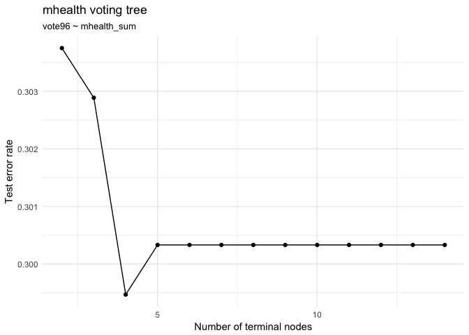

``` r
(mod1_best = optimal_tree_plot(vote96~mhealth_sum, mod1_optimal_num))
```

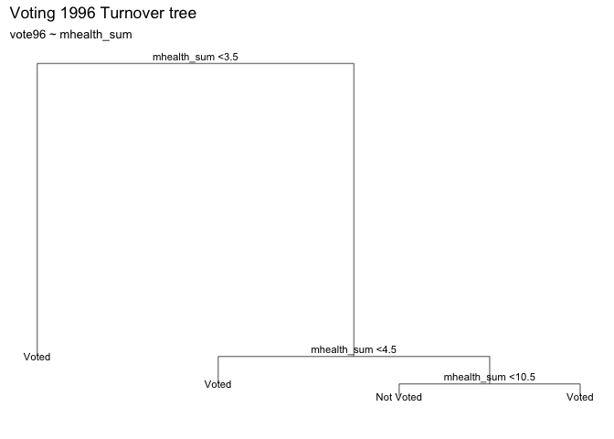

-   Construct Model 2: `vote96 ~ mhealth_sum + age`

``` r
mod2_optimal_num = optimal_nodes(vote96~mhealth_sum + age, FALSE) 
(mod2 = optimal_nodes(vote96 ~ mhealth_sum + age, TRUE))
```

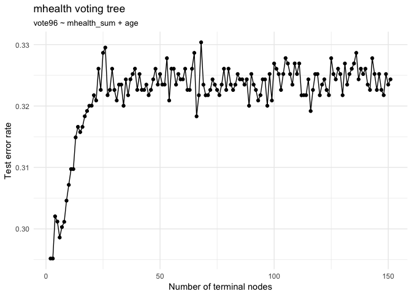

``` r
(mod2_best = optimal_tree_plot(vote96~mhealth_sum + age, mod2_optimal_num + 1))
```

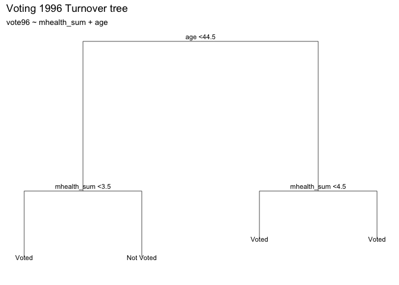

-   Construct Model 3: `vote96 ~ mhealth_sum + age + educ`

``` r
mod3_optimal_num = optimal_nodes(vote96~mhealth_sum + age + educ, FALSE)
(mod3 = optimal_nodes(vote96 ~ mhealth_sum + age + educ, TRUE))
```

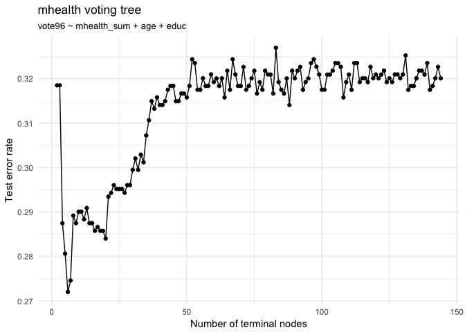

``` r
(mod3_best = optimal_tree_plot(vote96~mhealth_sum + age + educ, mod3_optimal_num))
```

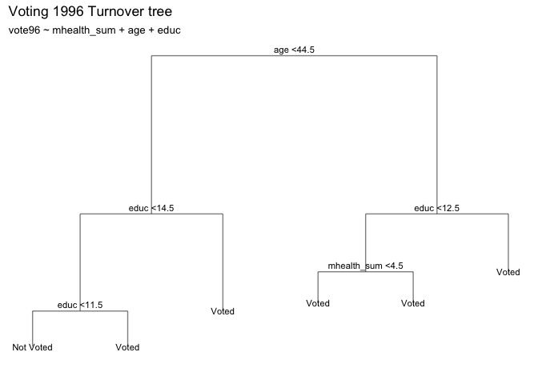

-   Construct Model 4: `vote96 ~ mhealth_sum + age + educ + black`

``` r
mod4_optimal_num = optimal_nodes(vote96~mhealth_sum + age + educ + black, FALSE)
(mod4 = optimal_nodes(vote96 ~ mhealth_sum + age + educ + black, TRUE))
```

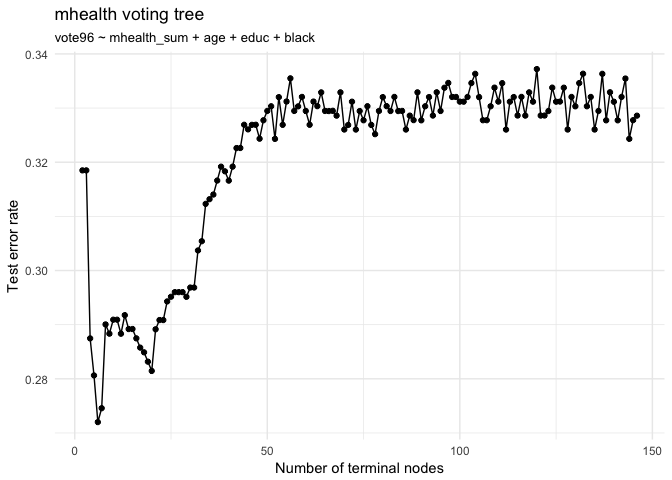

``` r
(mod4_best = optimal_tree_plot(vote96~mhealth_sum + age + educ + black, mod4_optimal_num))
```

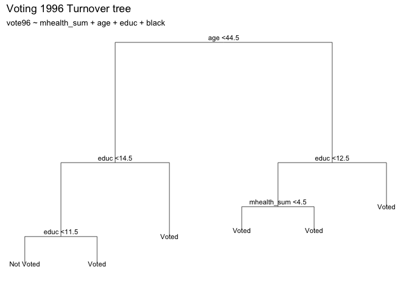

-   Construct Model 5: `vote96 ~  mhealth_sum + age + educ + black + inc`

``` r
mod5_optimal_num = optimal_nodes(vote96~mhealth_sum + age + educ + black + inc10, FALSE)
(mod5 = optimal_nodes(vote96~mhealth_sum + age + educ + black + inc10, TRUE))
```


``` r
(mod5_best = optimal_tree_plot(vote96~mhealth_sum + age + educ + black + inc10,
                              mod5_optimal_num))
```

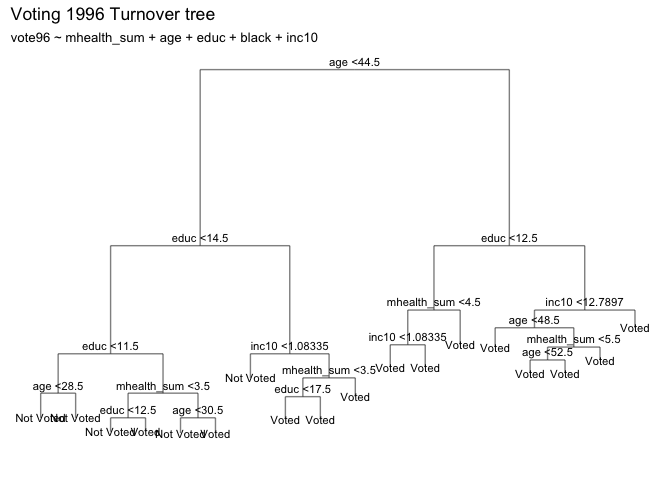

-   In order to check which model works the best, use randomForest method: in order to assess which model works the best, we used random forest method to assess the OOB estimate of error rate. It turned out the model `vote96 ~ mhealth_sum + age + educ` works the best, and thus would have my preference.

``` r
(tree_rf1 <- randomForest(vote96 ~ mhealth_sum, data = mhealth,
                          ntree = 500))
```

    ## 
    ## Call:
    ##  randomForest(formula = vote96 ~ mhealth_sum, data = mhealth,      ntree = 500) 
    ##                Type of random forest: classification
    ##                      Number of trees: 500
    ## No. of variables tried at each split: 1
    ## 
    ##         OOB estimate of  error rate: 29.7%
    ## Confusion matrix:
    ##           Not Voted Voted class.error
    ## Not Voted       125   253       0.669
    ## Voted            93   694       0.118

``` r
(tree_rf2 <- randomForest(vote96 ~ mhealth_sum + age, data = mhealth,
                          ntree = 500))
```

    ## 
    ## Call:
    ##  randomForest(formula = vote96 ~ mhealth_sum + age, data = mhealth,      ntree = 500) 
    ##                Type of random forest: classification
    ##                      Number of trees: 500
    ## No. of variables tried at each split: 1
    ## 
    ##         OOB estimate of  error rate: 32.2%
    ## Confusion matrix:
    ##           Not Voted Voted class.error
    ## Not Voted        90   288       0.762
    ## Voted            87   700       0.111

``` r
(tree_rf3 <- randomForest(vote96 ~ mhealth_sum + age + educ, data = mhealth,
                          ntree = 500))
```

    ## 
    ## Call:
    ##  randomForest(formula = vote96 ~ mhealth_sum + age + educ, data = mhealth,      ntree = 500) 
    ##                Type of random forest: classification
    ##                      Number of trees: 500
    ## No. of variables tried at each split: 1
    ## 
    ##         OOB estimate of  error rate: 28%
    ## Confusion matrix:
    ##           Not Voted Voted class.error
    ## Not Voted       145   233       0.616
    ## Voted            93   694       0.118

``` r
(tree_rf4 <- randomForest(vote96 ~ mhealth_sum + age + educ + black, data = mhealth,
                          ntree = 500))
```

    ## 
    ## Call:
    ##  randomForest(formula = vote96 ~ mhealth_sum + age + educ + black,      data = mhealth, ntree = 500) 
    ##                Type of random forest: classification
    ##                      Number of trees: 500
    ## No. of variables tried at each split: 2
    ## 
    ##         OOB estimate of  error rate: 32.5%
    ## Confusion matrix:
    ##           Not Voted Voted class.error
    ## Not Voted       145   233       0.616
    ## Voted           146   641       0.186

``` r
(tree_rf5 <- randomForest(vote96 ~ mhealth_sum + age + educ + black + inc10, data = mhealth,
                          ntree = 500))
```

    ## 
    ## Call:
    ##  randomForest(formula = vote96 ~ mhealth_sum + age + educ + black +      inc10, data = mhealth, ntree = 500) 
    ##                Type of random forest: classification
    ##                      Number of trees: 500
    ## No. of variables tried at each split: 2
    ## 
    ##         OOB estimate of  error rate: 30.9%
    ## Confusion matrix:
    ##           Not Voted Voted class.error
    ## Not Voted       153   225       0.595
    ## Voted           135   652       0.172

**2. Use cross-validation techniques and standard measures of model fit (e.g. test error rate, PRE, ROC curves/AUC) to compare and evaluate at least five SVM models of voter turnout. Select the best model and interpret the results using whatever methods you see fit (graphs, tables, model fit statistics, predictions for hypothetical observations, etc.)**

-   Model 1: Linear Kernal: `vote96 ~ .`

``` r
mh_lin_tune <- tune(svm, vote96 ~ ., data = as_tibble(mhealth_split$train),
                    kernel = "linear",
                    range = list(cost = c(.001, .01, .1, 1, 5, 10, 100)))
summary(mh_lin_tune)
```

    ## 
    ## Parameter tuning of 'svm':
    ## 
    ## - sampling method: 10-fold cross validation 
    ## 
    ## - best parameters:
    ##  cost
    ##     5
    ## 
    ## - best performance: 0.276 
    ## 
    ## - Detailed performance results:
    ##    cost error dispersion
    ## 1 1e-03 0.321     0.0393
    ## 2 1e-02 0.321     0.0393
    ## 3 1e-01 0.283     0.0333
    ## 4 1e+00 0.278     0.0362
    ## 5 5e+00 0.276     0.0345
    ## 6 1e+01 0.277     0.0368
    ## 7 1e+02 0.277     0.0368

``` r
mh_lin <- mh_lin_tune$best.model
summary(mh_lin)
```

    ## 
    ## Call:
    ## best.tune(method = svm, train.x = vote96 ~ ., data = as_tibble(mhealth_split$train), 
    ##     ranges = list(cost = c(0.001, 0.01, 0.1, 1, 5, 10, 100)), 
    ##     kernel = "linear")
    ## 
    ## 
    ## Parameters:
    ##    SVM-Type:  C-classification 
    ##  SVM-Kernel:  linear 
    ##        cost:  5 
    ##       gamma:  0.125 
    ## 
    ## Number of Support Vectors:  508
    ## 
    ##  ( 256 252 )
    ## 
    ## 
    ## Number of Classes:  2 
    ## 
    ## Levels: 
    ##  Not Voted Voted

``` r
fitted <- predict(mh_lin, as_tibble(mhealth_split$test), decision.values = TRUE) %>%
  attributes

roc_line <- roc(as_tibble(mhealth_split$test)$vote96, fitted$decision.values)
plot(roc_line)
```


``` r
auc(roc_line)
```

    ## Area under the curve: 0.754

Looking at the linear kernel, I can observe that all predictor variables and tested at different cost levels (0.001, 0.01, 0.1, 1, 5, 10, and 100). The model gets the best cost level at 5 and has a 10-fold CV error rate 0.276. The area under the curve is 0.754. The overall performance of the classifier across all potential thresholds is the area under the (ROC) curve (AUC). The ideal AUC curve hugs the top left corner of the graph, so a larger AUC indicates a better classifier -- an AUC of 1 means perfect prediction for any threshold value. The dashed line represents the null model where we randomly guess whether a person voted or not and would have an AUC of 0.5. With an AUC of 0.754, this model performs decently.

-   Model 2: Polynomial Kernal: `vote96 ~ .`

``` r
mh_poly_tune <- tune(svm, vote96 ~ ., data = as_tibble(mhealth_split$train),
                    kernel = "polynomial",
                    range = list(cost = c(.001, .01, .1, 1, 5, 10, 100)))
summary(mh_poly_tune)
```

    ## 
    ## Parameter tuning of 'svm':
    ## 
    ## - sampling method: 10-fold cross validation 
    ## 
    ## - best parameters:
    ##  cost
    ##     5
    ## 
    ## - best performance: 0.281 
    ## 
    ## - Detailed performance results:
    ##    cost error dispersion
    ## 1 1e-03 0.321     0.0470
    ## 2 1e-02 0.321     0.0470
    ## 3 1e-01 0.315     0.0505
    ## 4 1e+00 0.288     0.0300
    ## 5 5e+00 0.281     0.0328
    ## 6 1e+01 0.289     0.0329
    ## 7 1e+02 0.306     0.0406

``` r
mh_poly <- mh_poly_tune$best.model
summary(mh_poly)
```

    ## 
    ## Call:
    ## best.tune(method = svm, train.x = vote96 ~ ., data = as_tibble(mhealth_split$train), 
    ##     ranges = list(cost = c(0.001, 0.01, 0.1, 1, 5, 10, 100)), 
    ##     kernel = "polynomial")
    ## 
    ## 
    ## Parameters:
    ##    SVM-Type:  C-classification 
    ##  SVM-Kernel:  polynomial 
    ##        cost:  5 
    ##      degree:  3 
    ##       gamma:  0.125 
    ##      coef.0:  0 
    ## 
    ## Number of Support Vectors:  492
    ## 
    ##  ( 259 233 )
    ## 
    ## 
    ## Number of Classes:  2 
    ## 
    ## Levels: 
    ##  Not Voted Voted

``` r
fitted <- predict(mh_poly, as_tibble(mhealth_split$test), decision.values = TRUE) %>%
  attributes

roc_poly <- roc(as_tibble(mhealth_split$test)$vote96, fitted$decision.values)
plot(roc_poly)
```

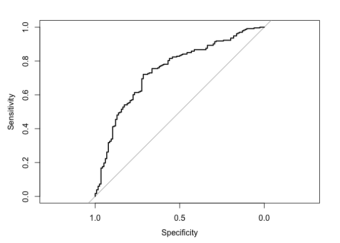

``` r
auc(roc_poly)
```

    ## Area under the curve: 0.745

Looking at the polynomial kernel, I can observe that all predictor variables and tested at different cost levels (0.001, 0.01, 0.1, 1, 5, 10, and 100). The model gets the best cost level at 5 and has a 10-fold CV error rate 0.281 The area under the curve is 0.745. With an AUC of 0.745, this model performs decently.

-   Model 3: Radial Kernal: `vote96 ~ .`

``` r
mh_rad_tune <- tune(svm, vote96 ~ ., data = as_tibble(mhealth_split$train),
                    kernel = "radial",
                    range = list(cost = c(.001, .01, .1, 1, 5, 10, 100)))
summary(mh_rad_tune)
```

    ## 
    ## Parameter tuning of 'svm':
    ## 
    ## - sampling method: 10-fold cross validation 
    ## 
    ## - best parameters:
    ##  cost
    ##     1
    ## 
    ## - best performance: 0.283 
    ## 
    ## - Detailed performance results:
    ##    cost error dispersion
    ## 1 1e-03 0.321     0.0504
    ## 2 1e-02 0.321     0.0504
    ## 3 1e-01 0.307     0.0575
    ## 4 1e+00 0.283     0.0475
    ## 5 5e+00 0.296     0.0573
    ## 6 1e+01 0.285     0.0612
    ## 7 1e+02 0.301     0.0686

``` r
mh_rad <- mh_rad_tune$best.model
summary(mh_rad)
```

    ## 
    ## Call:
    ## best.tune(method = svm, train.x = vote96 ~ ., data = as_tibble(mhealth_split$train), 
    ##     ranges = list(cost = c(0.001, 0.01, 0.1, 1, 5, 10, 100)), 
    ##     kernel = "radial")
    ## 
    ## 
    ## Parameters:
    ##    SVM-Type:  C-classification 
    ##  SVM-Kernel:  radial 
    ##        cost:  1 
    ##       gamma:  0.125 
    ## 
    ## Number of Support Vectors:  519
    ## 
    ##  ( 276 243 )
    ## 
    ## 
    ## Number of Classes:  2 
    ## 
    ## Levels: 
    ##  Not Voted Voted

``` r
fitted <- predict(mh_rad, as_tibble(mhealth_split$test), decision.values = TRUE) %>%
  attributes

roc_rad <- roc(as_tibble(mhealth_split$test)$vote96, fitted$decision.values)
plot(roc_rad)
```

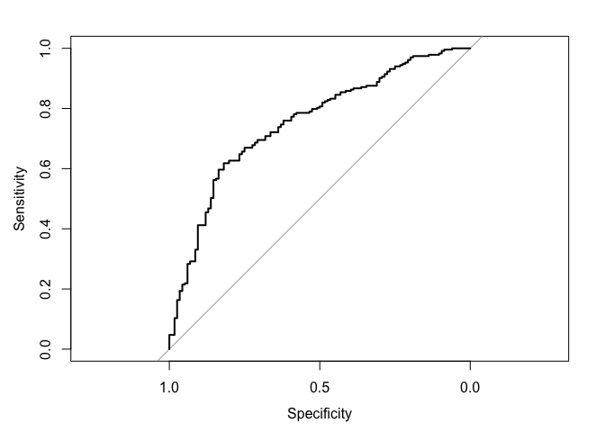

``` r
auc(roc_rad)
```

    ## Area under the curve: 0.752

Looking at the radial kernel, I can observe that all predictor variables and tested at different cost levels (0.001, 0.01, 0.1, 1, 5, 10, and 100). The model gets the best cost level at 1 and has a 10-fold CV error rate 0.283. The area under the curve is 0.752. With an AUC of 0.752, this model performs decently.

-   Model 4: Linear Kernal: `vote96 ~ mhealth_sum + inc10 + black + age`

``` r
mh_lin2_tune <- tune(svm, vote96 ~ mhealth_sum + inc10 + black + age, 
                     data = as_tibble(mhealth_split$train),
                     kernel = "linear",
                     range = list(cost = c(.001, .01, .1, 1, 5, 10, 100)))
summary(mh_lin2_tune)
```

    ## 
    ## Parameter tuning of 'svm':
    ## 
    ## - sampling method: 10-fold cross validation 
    ## 
    ## - best parameters:
    ##  cost
    ##   0.1
    ## 
    ## - best performance: 0.315 
    ## 
    ## - Detailed performance results:
    ##    cost error dispersion
    ## 1 1e-03 0.321     0.0543
    ## 2 1e-02 0.321     0.0543
    ## 3 1e-01 0.315     0.0642
    ## 4 1e+00 0.333     0.0484
    ## 5 5e+00 0.328     0.0534
    ## 6 1e+01 0.328     0.0534
    ## 7 1e+02 0.328     0.0534

``` r
mh_lin2 <- mh_lin2_tune$best.model
summary(mh_lin2)
```

    ## 
    ## Call:
    ## best.tune(method = svm, train.x = vote96 ~ mhealth_sum + inc10 + 
    ##     black + age, data = as_tibble(mhealth_split$train), ranges = list(cost = c(0.001, 
    ##     0.01, 0.1, 1, 5, 10, 100)), kernel = "linear")
    ## 
    ## 
    ## Parameters:
    ##    SVM-Type:  C-classification 
    ##  SVM-Kernel:  linear 
    ##        cost:  0.1 
    ##       gamma:  0.2 
    ## 
    ## Number of Support Vectors:  534
    ## 
    ##  ( 272 262 )
    ## 
    ## 
    ## Number of Classes:  2 
    ## 
    ## Levels: 
    ##  Not Voted Voted

``` r
fitted <- predict(mh_lin2, as_tibble(mhealth_split$test), decision.values = TRUE) %>%
  attributes

roc_line2 <- roc(as_tibble(mhealth_split$test)$vote96, fitted$decision.values)
plot(roc_line2)
```

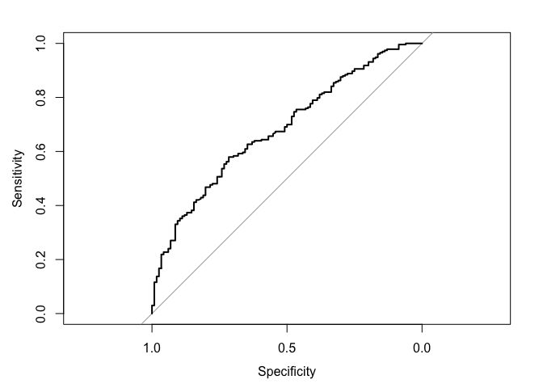

``` r
auc(roc_line2)
```

    ## Area under the curve: 0.682

Looking at the linear kernel but using different set of predictors, I can observe that all predictor variables and tested at different cost levels (0.001, 0.01, 0.1, 1, 5, 10, and 100). The model gets the best cost level at 0.1 and has a 10-fold CV error rate 0.315. The area under the curve is 0.682 With an AUC of 0.682, this model performs decently.

-   Model 5: Polynomial kernel with different degrees

``` r
mh_poly2_tune <- tune(svm, vote96 ~ ., 
                      data = as_tibble(mhealth_split$train),
                      kernel = "polynomial",
                      range = list(cost = c(.001, .01, .1, 1, 5, 10, 100), 
                                   degree = c(2, 3, 4)))
summary(mh_poly2_tune)
```

    ## 
    ## Parameter tuning of 'svm':
    ## 
    ## - sampling method: 10-fold cross validation 
    ## 
    ## - best parameters:
    ##  cost degree
    ##     5      2
    ## 
    ## - best performance: 0.282 
    ## 
    ## - Detailed performance results:
    ##     cost degree error dispersion
    ## 1  1e-03      2 0.321     0.0508
    ## 2  1e-02      2 0.321     0.0508
    ## 3  1e-01      2 0.314     0.0574
    ## 4  1e+00      2 0.288     0.0613
    ## 5  5e+00      2 0.282     0.0560
    ## 6  1e+01      2 0.282     0.0575
    ## 7  1e+02      2 0.285     0.0568
    ## 8  1e-03      3 0.321     0.0508
    ## 9  1e-02      3 0.321     0.0508
    ## 10 1e-01      3 0.314     0.0561
    ## 11 1e+00      3 0.284     0.0617
    ## 12 5e+00      3 0.284     0.0675
    ## 13 1e+01      3 0.293     0.0716
    ## 14 1e+02      3 0.314     0.0428
    ## 15 1e-03      4 0.321     0.0508
    ## 16 1e-02      4 0.321     0.0508
    ## 17 1e-01      4 0.316     0.0556
    ## 18 1e+00      4 0.301     0.0600
    ## 19 5e+00      4 0.303     0.0539
    ## 20 1e+01      4 0.306     0.0623
    ## 21 1e+02      4 0.322     0.0352

``` r
mh_poly2 <- mh_poly2_tune$best.model
summary(mh_poly2)
```

    ## 
    ## Call:
    ## best.tune(method = svm, train.x = vote96 ~ ., data = as_tibble(mhealth_split$train), 
    ##     ranges = list(cost = c(0.001, 0.01, 0.1, 1, 5, 10, 100), 
    ##         degree = c(2, 3, 4)), kernel = "polynomial")
    ## 
    ## 
    ## Parameters:
    ##    SVM-Type:  C-classification 
    ##  SVM-Kernel:  polynomial 
    ##        cost:  5 
    ##      degree:  2 
    ##       gamma:  0.125 
    ##      coef.0:  0 
    ## 
    ## Number of Support Vectors:  489
    ## 
    ##  ( 251 238 )
    ## 
    ## 
    ## Number of Classes:  2 
    ## 
    ## Levels: 
    ##  Not Voted Voted

``` r
fitted <- predict(mh_poly2, as_tibble(mhealth_split$test), decision.values = TRUE) %>%
  attributes

roc_poly2 <- roc(as_tibble(mhealth_split$test)$vote96, fitted$decision.values)
plot(roc_poly2)
```

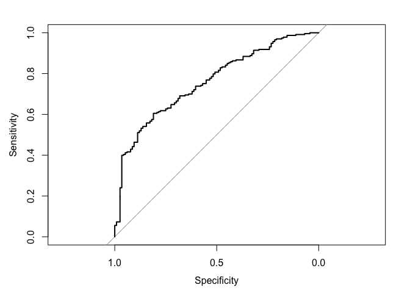

``` r
auc(roc_poly2)
```

    ## Area under the curve: 0.758

Looking at the polynomial kernel with varying degrees, I can observe that all predictor variables and tested at different cost levels (0.001, 0.01, 0.1, 1, 5, 10, and 100). The model gets the best cost level at 5 and has a 10-fold CV error rate 0.282 The area under the curve is 0.758. With an AUC of 0.758, this model performs decently.

-   to determine the optimal model: plotting all four curves in the same plot, and from observing this plot, I can identify that the blue curve, or model 1 using the linear kernal of all predictors, fit the data the best.

``` r
plot(roc_line, print.auc = TRUE, col = "blue")
plot(roc_poly, print.auc = TRUE, col = "red", print.auc.y = .4, add = TRUE)
plot(roc_rad, print.auc = TRUE, col = "orange", print.auc.y = .3, add = TRUE)
plot(roc_line2, print.auc = TRUE, col = "green", print.auc.y = .2, add = TRUE)
plot(roc_poly2, print.auc = TRUE, col = "gold", print.auc.y = .1, add = TRUE)
```


------------------------------------------------------------------------

Part 3: OJ Simpson
==================

**1. What is the relationship between race and belief of OJ Simpson's guilt? Develop a robust statistical learning model and use this model to explain the impact of an individual's race on their beliefs about OJ Simpson's guilt.**

-   load the raw dataset

``` r
simpson <- read_csv("simpson.csv") %>%
    mutate(dem = factor(dem, levels = 0:1, labels = c("Not Dem", "Dem")),
           rep = factor(rep, levels = 0:1, labels = c("Not Rep", "Rep")),
           ind = factor(ind, levels = 0:1, labels = c("Not Ind", "Ind")),
           female = factor(female, levels = 0:1, labels = c("Male", "Female")),
           black = factor(black, levels = 0:1, labels = c("Not Black", "Black")),
           hispanic = factor(hispanic, levels = 0:1, labels = c("Not Hispanic", "Hispanic"))) %>%
    na.omit
```

    ## Parsed with column specification:
    ## cols(
    ##   guilt = col_double(),
    ##   dem = col_double(),
    ##   rep = col_double(),
    ##   ind = col_double(),
    ##   age = col_double(),
    ##   educ = col_character(),
    ##   female = col_double(),
    ##   black = col_double(),
    ##   hispanic = col_double(),
    ##   income = col_character()
    ## )

``` r
simpson_split <- resample_partition(simpson, c(test = 0.3, train = 0.7))
```

-   In order to develop a robust statistical learning model, I decide to first construct a logistic regression model

``` r
set.seed(1234)

getProb <- function(model, data){
  data <- data %>% 
    add_predictions(model) %>% 
    mutate(prob = exp(pred) / (1 + exp(pred)),
           pred_bi = as.numeric(prob > .5))
  return(data)
}

#Split data
simpson_split <- resample_partition(simpson, c(test = 0.3, train = 0.7))

simpson_logit <- glm(guilt ~ black + hispanic, data = simpson_split$train, family = binomial)
summary(simpson_logit)
```

    ## 
    ## Call:
    ## glm(formula = guilt ~ black + hispanic, family = binomial, data = simpson_split$train)
    ## 
    ## Deviance Residuals: 
    ##    Min      1Q  Median      3Q     Max  
    ## -1.835  -0.607   0.641   0.641   2.018  
    ## 
    ## Coefficients:
    ##                  Estimate Std. Error z value Pr(>|z|)    
    ## (Intercept)        1.4789     0.0934   15.84   <2e-16 ***
    ## blackBlack        -3.0789     0.2165  -14.22   <2e-16 ***
    ## hispanicHispanic  -0.2966     0.3167   -0.94     0.35    
    ## ---
    ## Signif. codes:  0 '***' 0.001 '**' 0.01 '*' 0.05 '.' 0.1 ' ' 1
    ## 
    ## (Dispersion parameter for binomial family taken to be 1)
    ## 
    ##     Null deviance: 1229.06  on 991  degrees of freedom
    ## Residual deviance:  947.18  on 989  degrees of freedom
    ## AIC: 953.2
    ## 
    ## Number of Fisher Scoring iterations: 4

According to the summary of regression coefficients presented above, both predictors, `black` and `hispanic` have negative effect to the perception of `guilt`. As seen by the coefficient, if a person is black, then the log-odds of perceiving simpson is guilty would reduce by 3.4564. Similarly, if a person is hispanic, then the log-odds of perceiving simpson is guilty would reduce by 0.3476.

``` r
logistic_test <- getProb(simpson_logit, as.data.frame(simpson_split$test))

# ROC
(auc<- auc(logistic_test$guilt, logistic_test$pred_bi))
```

    ## Area under the curve: 0.733

``` r
# accuracy rate
(accuracy <- mean(logistic_test$guilt == logistic_test$pred_bi, na.rm = TRUE))
```

    ## [1] 0.816

According to the test creterion, the auc, or area under the curve, is 0.733, and the accuracy rate is 81.6%. Thus, this is a relatively decent model to use.

**2. How can you predict whether individuals believe OJ Simpson to be guilty of these murders? Develop a robust statistical learning model to predict whether individuals believe OJ Simpson to be either probably guilty or probably not guilty and demonstrate the effectiveness of this model using methods we have discussed in class.**

-   In order to predict whether individuals believe OJ Simpson to be guilty of these murders, the model I can immediately think of is the tree model. As presented below, the using 10-fold cross validation method, the optimal number of terminal nodes is 4.

``` r
simpson <- read_csv("simpson.csv") %>%
    mutate(guilt = factor(guilt, levels = 0:1, labels = c("Innocent", "Guilty")),
           dem = factor(dem, levels = 0:1, labels = c("Not Dem", "Dem")),
           rep = factor(rep, levels = 0:1, labels = c("Not Rep", "Rep")),
           ind = factor(ind, levels = 0:1, labels = c("Not Ind", "Ind")),
           female = factor(female, levels = 0:1, labels = c("Male", "Female")),
           black = factor(black, levels = 0:1, labels = c("Not Black", "Black")),
           hispanic = factor(hispanic, levels = 0:1, labels = c("Not Hispanic", "Hispanic"))) %>%
    na.omit
```

    ## Parsed with column specification:
    ## cols(
    ##   guilt = col_double(),
    ##   dem = col_double(),
    ##   rep = col_double(),
    ##   ind = col_double(),
    ##   age = col_double(),
    ##   educ = col_character(),
    ##   female = col_double(),
    ##   black = col_double(),
    ##   hispanic = col_double(),
    ##   income = col_character()
    ## )

``` r
simpson_split <- resample_partition(simpson, c(test = 0.3, train = 0.7))

# estimate model
simpson_tree <- tree(guilt ~ ., data = simpson,
                     control = tree.control(nobs = nrow(simpson),
                            mindev = .001))
mod = simpson_tree

err.rate.tree <- function(model, data) {
  data <- as_tibble(data)
  response <- as.character(model$terms[[2]])
  
  pred <- predict(model, newdata = data, type = "class")
  actual <- data[[response]]
  
  return(mean(pred != actual, na.rm = TRUE))
}

# generate 10-fold CV trees
simpson_cv <- simpson %>%
  na.omit() %>%
  crossv_kfold(k = 10) %>%
  mutate(tree = map(train, ~ tree(guilt ~ ., data = .,
     control = tree.control(nobs = nrow(simpson),
                            mindev = .001))))

# calculate each possible prune result for each fold
simpson_cv <- expand.grid(simpson_cv$.id,
                          seq(from = 2, to = ceiling(length(mod$frame$yval) / 2))) %>%
  as_tibble() %>%
  mutate(Var2 = as.numeric(Var2)) %>%
  rename(.id = Var1,
         k = Var2) %>%
  left_join(simpson_cv, by= ".id") %>%
  mutate(prune = map2(tree, k, ~ prune.misclass(.x, best = .y)),
         mse = map2_dbl(prune, test, err.rate.tree))

simpson_cv %>%
  group_by(k) %>%
  summarize(test_mse = mean(mse),
            sd = sd(mse, na.rm = TRUE)) %>%
  ggplot(aes(k, test_mse)) +
  geom_point() +
  geom_line() +
  labs(title = "Simpson Guilt tree",
       subtitle = "guilt ~ .",
       x = "Number of terminal nodes",
       y = "Test error rate")
```


-   Plot the optimal tree

``` r
mod <- prune.tree(simpson_tree, best = 4)

tree_data <- dendro_data(mod)
ggplot(segment(tree_data)) +
  geom_segment(aes(x = x, y = y, xend = xend, yend = yend), 
               alpha = 0.5) +
  geom_text(data = label(tree_data), 
            aes(x = x, y = y, label = label_full), vjust = -0.5, size = 3) +
  geom_text(data = leaf_label(tree_data), 
            aes(x = x, y = y, label = label), vjust = 0.5, size = 3) +
  theme_dendro() +
  labs(title = "Simpson Guilt tree",
       subtitle = "guilt ~.")
```


As the tree map presented above, if the person is black then s/he would typically think Simpson to be innocent. If the person is not black and with an age &lt; 19.5, the person would typically think Simpson is innovent. However, nonblacks who are older than 19.5 would typically think that Simpson is guilty regardless party affiliation.

-   Using the variables to do a random forest model to test its effectiveness and we can see that if we used the three variables that we obtained from 10-fold cv, we are able to obtain an OOB estimatin of error rate of 18.4%. It implies, if we use those three variables and construct a tree, the pribability of getting a correct estimate is more than 4/5 of a time. Thus, this is a decent model to use.

``` r
randomForest(guilt ~ black + age + rep, data = simpson, ntree = 1000)
```

    ## 
    ## Call:
    ##  randomForest(formula = guilt ~ black + age + rep, data = simpson,      ntree = 1000) 
    ##                Type of random forest: classification
    ##                      Number of trees: 1000
    ## No. of variables tried at each split: 1
    ## 
    ##         OOB estimate of  error rate: 18.4%
    ## Confusion matrix:
    ##          Innocent Guilty class.error
    ## Innocent      224    218      0.4932
    ## Guilty         43    931      0.0441
