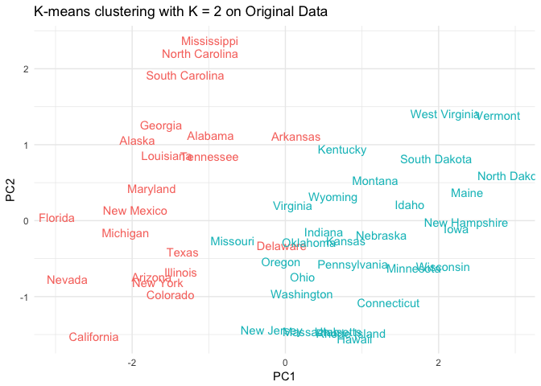
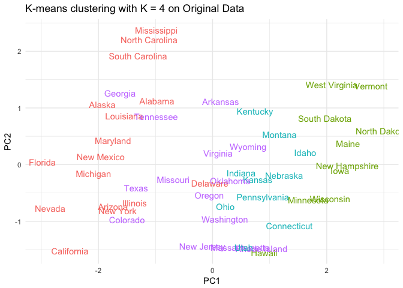
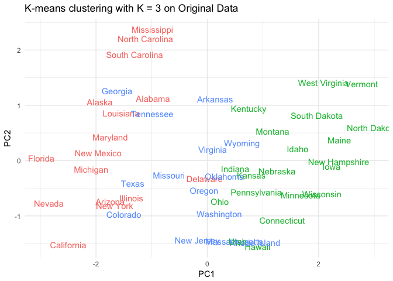
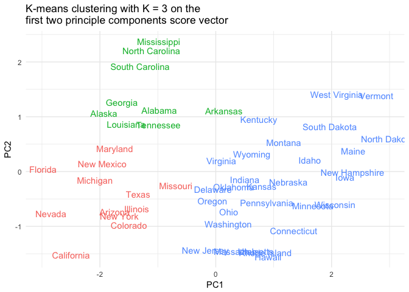
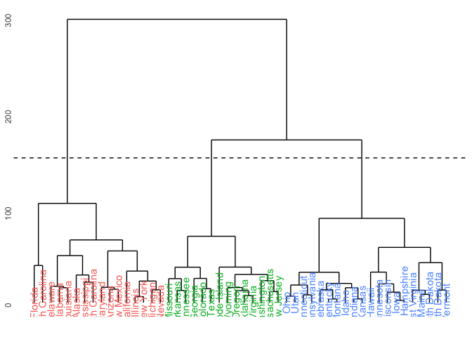
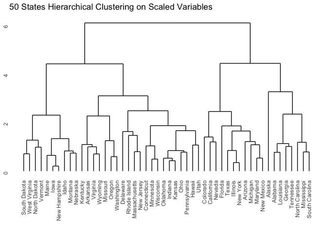

MACS 30100: Problem Set 9
================
Dongping Zhang
3/10/2017

-   [Part I. Attitudes towards feminists](#part-i.-attitudes-towards-feminists)
-   [Part II. Voter turnout and depression](#part-ii.-voter-turnout-and-depression)
-   [Part III. Colleges](#part-iii.-colleges)
-   [Part IV. Clustering states](#part-iv.-clustering-states)

Part I. Attitudes towards feminists
===================================

**1. Split the data into a training and test set (70/30%).**

-   read in the raw feminist dataset

``` r
feminist <- read.csv("feminist.csv") %>%
  na.omit
```

-   split the data into a training and test set (70/30%)

``` r
feminist_split <- resample_partition(feminist, c(test = 0.3, train = 0.7))
feminist_train = as_tibble(feminist_split$train)
feminist_test = as_tibble(feminist_split$test)
```

**2. Calculate the test MSE for KNN models with K= 5, 10, 15, ..., 100, using whatever combination of variables you see fit. Which model produces the lowest test MSE?**

-   the predictors of my choice are: `age`, `female`, `dem`, `rep`, `educ`, and `income`

-   compute MSE for `feminist` dataset using different number of k

``` r
feminist_knn <- data_frame(k = seq(5, 100, 5),
                           knn = map(k, ~ knn.reg(dplyr::select(feminist_train, -feminist), 
                                                  y = feminist_train$feminist,
                                                  test = dplyr::select(feminist_test, -feminist), 
                                                  k = .)),
                           mse = map_dbl(knn, ~ mean((feminist_test$feminist - .$pred)^2)))

# compute the smallest mse for all knn models
print("KNN Model Optimal MSE")
```

    ## [1] "KNN Model Optimal MSE"

``` r
(feminist_knn_mse = min(feminist_knn$mse))
```

    ## [1] 455.7123

``` r
print("KNN Model Optimal K")
```

    ## [1] "KNN Model Optimal K"

``` r
(feminist_knn_k = feminist_knn$k[which(feminist_knn$mse == feminist_knn_mse)])
```

    ## [1] 45

-   After visualizing the mse with the number of Ks, it is observable that MSE dropped significantly from K=5 to K = 30. According to the At K = 45, it would produce the lowest MSE and thus would make the data fit the best.

``` r
ggplot(feminist_knn, aes(k, mse)) +
  geom_line() +
  geom_point() +
  labs(title = "KNN for Feminist",
       x = "K",
       y = "Test mean squared error") +
  scale_x_continuous(breaks = seq(5, 100, 5)) 
```


**3. Calculate the test MSE for weighted KNN models with K = 5, 10, 15, ..., 100 using the same combination of variables as before. Which model produces the lowest test MSE?**

-   compute MSE for `feminist` dataset using different number of k

``` r
feminist_wknn <- data_frame(k = seq(5, 100, 5),
                            wknn = map(k, ~ kknn(feminist ~ ., 
                                                 train = feminist_train, 
                                                 test = feminist_test, k = .)),
                            mse = map_dbl(wknn, ~ 
                                           mean((feminist_test$feminist - .$fitted.values)^2)))

# compute the smallest mse for all knn models
print("Weighted KNN Model Optimal MSE")
```

    ## [1] "Weighted KNN Model Optimal MSE"

``` r
(feminist_wknn_mse = min(feminist_wknn$mse))
```

    ## [1] 437.3657

``` r
print("Weighted KNN Model Optimal K")
```

    ## [1] "Weighted KNN Model Optimal K"

``` r
(feminist_wknn_k = feminist_wknn$k[which(feminist_wknn$mse == feminist_wknn_mse)])
```

    ## [1] 100

-   After visualizing the mse of weighted knn model with the number of Ks, it is observable that as K increases, the model MSE would keep decreasing and thus when K=100, the current model would produce the lowest MSE and thus fit the data the best.

``` r
ggplot(feminist_wknn, aes(k, mse)) +
  geom_line() +
  geom_point() +
  labs(title = "Weighted KNN for Feminist",
       x = "K",
       y = "Test mean squared error") +
  scale_x_continuous(breaks = seq(5, 100, 5))
```


**4. Compare the test MSE for the best KNN/wKNN model(s) to the test MSE for the equivalent linear regression, decision tree, boosting, and random forest methods using the same combination of variables as before. Which performs the best? Why do you think this method performed the best, given your knowledge of how it works?**

-   MSE of equivalent linear regression

``` r
feminist_lm = lm(feminist ~ ., data = feminist_split$train)
(feminist_lm_mse = mse(feminist_lm, feminist_split$test))
```

    ## [1] 435.1107

-   MSE of decision tree
    -   build the tree model and use 10-fold CV to get the optimal number of nodes

    ``` r
    # build the tree model
    feminist_tree <- tree(feminist ~ ., data = feminist_split$train, 
                          control = tree.control(nobs = nrow(feminist_split$train),
                                                mindev = 0))

    # generate 10-fold CV trees
    feminist_cv <- crossv_kfold(feminist, k = 10) %>%
      mutate(tree = map(train, ~ tree(feminist ~. , data = .,
                                      control = tree.control(nobs = nrow(feminist),
                                                            mindev = 0))))

    # calculate each possible prune result for each fold and to generate the plot
    feminist_cv <- expand.grid(feminist_cv$.id, 2:10) %>%
      as_tibble() %>%
      mutate(Var2 = as.numeric(Var2)) %>%
      rename(.id = Var1, k = Var2) %>%
      left_join(feminist_cv, by = ".id") %>%
      mutate(prune = map2(tree, k, ~ prune.tree(.x, best = .y)),
            mse = map2_dbl(prune, test, mse))
    ```

    -   produce the plot of mse vs. nodes

    ``` r
    # generate plot
    feminist_cv %>%
          dplyr::select(k, mse) %>%
          group_by(k) %>%
          summarize(test_mse = mean(mse), sd = sd(mse, na.rm = TRUE)) %>%
          ggplot(aes(k, test_mse)) +
          geom_point() +
          geom_line() +
          labs(x = "Number of terminal nodes",
               y = "Test MSE")
    ```

    

    -   so 3 nodes seems to be the optimal, and thus calculate the lowest mse

    ``` r
    (feminist_tree_mse = mse(prune.tree(feminist_tree, best = 3), feminist_split$test))
    ```

        ## [1] 435.5092

-   MSE of boosting
    -   implementing boosting algorithm

    ``` r
    boost.feminist = gbm(feminist~., data = feminist_split$train, distribution = "gaussian",
                         n.tree= 5000)
    ```

    -   compute mse from the boosting model

    ``` r
    yhat.boost = predict(boost.feminist, newdata = feminist_split$test, n.trees = 5000)
    feminist_test = feminist$feminist[feminist_split$test$idx]
    (feminist_boost_mse = mean((yhat.boost - feminist_test)^2))
    ```

        ## [1] 430.6496

-   MSE of random forest
    -   implement random forest algorithm

    ``` r
    rf.feminist = randomForest(feminist~., data = feminist_split$train,
                               mtry = 3, importance = TRUE)
    ```

    -   compute the mse of the random forest model

    ``` r
    yhat.rf = predict(rf.feminist, newdata = feminist_split$test)
    (feminist_rf_mse = mean((yhat.rf - feminist_test)^2))
    ```

        ## [1] 462.0592

-   Compile all MSEs: given the table below, boosting works the best because the lowest test mse.

``` r
mses <- matrix(c(feminist_knn_mse, feminist_wknn_mse, feminist_lm_mse, 
                 feminist_tree_mse, feminist_boost_mse, feminist_rf_mse), 
               ncol=1, byrow=FALSE)
rownames(mses) <- c("knn", "wknn", "lm", "tree", "boost", "rf")
colnames(mses) <- c("test MSE")
(mses <- as.table(mses))
```

    ##       test MSE
    ## knn   455.7123
    ## wknn  437.3657
    ## lm    435.1107
    ## tree  435.5092
    ## boost 430.6496
    ## rf    462.0592

According to the MSE table above, boosting method would produce the lowest MSE value of 431. The reason boosting works the best is because it is a form of supervised learning that primarily aims to reduce bias by lowering the size of residuals with each tree created, and it collects a set of weak learners to a single strong learner. Due to the amount of bias it could reducec, boosting would typically be one of the best supervised learning methods to choose, and thus woudl likely and expectedly to produce the best result in this case.

------------------------------------------------------------------------

Part II. Voter turnout and depression
=====================================

**1. Split the data into a training and test set (70/30).**

-   load the raw mental health dataset

``` r
mhealth <- read.csv("mental_health.csv") %>%

    na.omit
```

-   split the data into a training and test set (70/30%)

``` r
mhealth_split <- resample_partition(mhealth, c(test = 0.3, train = 0.7))
mhealth_train = as_tibble(mhealth_split$train)
mhealth_test = as_tibble(mhealth_split$test)
```

**2. Calculate the test error rate for KNN models with K = 1, 2, …, 10, using whatever combination of variables you see fit. Which model produces the lowest test MSE?**

-   the predictors of my choice are: `mhealth_sum`, `age`, `educ`, `black`, `female`, `married`, and `inc10`

-   compute MSE for `mhealth` dataset using different number of k

``` r
mhealth_knn <- data_frame(k = 1:10,
                          knn_train = map(k, ~ class::knn(dplyr::select(mhealth_train, -vote96),
                                          test = dplyr::select(mhealth_train, -vote96),
                                          cl = mhealth_train$vote96, k = .)),
                          knn_test = map(k, ~ class::knn(dplyr::select(mhealth_train, -vote96),
                                         test = dplyr::select(mhealth_test, -vote96),
                                         cl = mhealth_train$vote96, k = .)),
                          mse_train = map_dbl(knn_train, ~ mean(mhealth_test$vote96 != .)),
                          mse_test = map_dbl(knn_test, ~ mean(mhealth_test$vote96 != .)))

# compute the smallest mse for all knn models
print("mhealth: KNN Model Optimal MSE")
```

    ## [1] "mhealth: KNN Model Optimal MSE"

``` r
(mhealth_knn_mse = min(mhealth_knn$mse_test))
```

    ## [1] 0.2922636

``` r
print("mhealth: KNN Model Optimal K")
```

    ## [1] "mhealth: KNN Model Optimal K"

``` r
(mhealth_knn_k = mhealth_knn$k[which(mhealth_knn$mse_test == mhealth_knn_mse)])
```

    ## [1] 8

-   After visualizing the mse with the number of Ks, it is observable that MSE dropped significantly from K=3 to K = 8. According to the plot, at K = 8, it would produce the lowest MSE and thus would make the data fit the best.

``` r
ggplot(mhealth_knn, aes(k, mse_test)) +
  geom_line() +
  geom_point() +
  labs(title = "KNN for vote96 in mhealth dataset",
       x = "K",
       y = "Test mean squared error") 
```


**3. Calculate the test error rate for weighted KNN models with K = 1, 2, ..., 10 using the same combination of variables as before. Which model produces the lowest test error rate?**

-   compute MSE for `mhealth` dataset using different number of k

``` r
mhealth_wknn <- data_frame(k = 1:10,
                           wknn = map(k, ~ kknn(vote96 ~., 
                                                train = mhealth_train, 
                                                test = mhealth_test, k =.)),
                           mse = map_dbl(wknn, ~ 
                                 mean(mhealth_test$vote96 != as.numeric(.$fitted.values > 0.5))))

# compute the smallest mse for all knn models
print("Weighted KNN Model Optimal MSE")
```

    ## [1] "Weighted KNN Model Optimal MSE"

``` r
(mhealth_wknn_mse = min(mhealth_wknn$mse))
```

    ## [1] 0.2979943

``` r
print("Weighted KNN Model Optimal K")
```

    ## [1] "Weighted KNN Model Optimal K"

``` r
(mhealth_wknn_k = mhealth_wknn$k[which(mhealth_wknn$mse == mhealth_wknn_mse)])
```

    ## [1] 7 9

-   After visualizing the mse of weighted knn model with the number of Ks, it is observable that as K increases, the model MSE would keep decreasing and thus when K=7 or 9, the current model would produce the lowest MSE, 0.298, and thus fit the data the best.

``` r
ggplot(mhealth_wknn, aes(k, mse)) +
  geom_line() +
  geom_point() +
  labs(title = "Weighted KNN for vote96 in mhealth dataset",
       x = "K",
       y = "Test mean squared error")
```


**4. Compare the test error rate for the best KNN/wKNN model(s) to the test error rate for the equivalent logistic regression, decision tree, boosting, random forest, and SVM methods using the same combination of variables as before. Which performs the best? Why do you think this method performed the best, given your knowledge of how it works?**

-   MSE of logistic regression

``` r
mhealth_logistic <- glm(vote96 ~ ., data = mhealth_train, family = binomial) 
(mhealth_logistic_mse = mse.glm(mhealth_logistic, mhealth_test))
```

    ## [1] 0.185595

-   MSE of decision tree
    -   modify the dataset

    ``` r
    mhealth_tree_data = mhealth_train %>%
      as_tibble() %>%
      mutate(vote96 = factor(vote96, levels = 0:1, labels = c("Not Voted", "Voted")),
             black = factor(black, levels = 0:1, labels = c("Not Black", "Black")),
             female = factor(female, levels = 0:1, labels = c("Not Female", "Female")),
             married = factor(married, levels = 0:1, labels = c("Not Married", "Married")))
    ```

    -   build the tree model

    ``` r
    mhealth_tree <- tree(vote96 ~ ., data = mhealth_train,
                         control = tree.control(nobs = nrow(mhealth_train),
                            mindev = .001))
    mod = mhealth_tree
    ```

    -   create an error\_rate\_tree function

    ``` r
    err.rate.tree <- function(model, data) {
      data <- as_tibble(data)
      response <- as.character(model$terms[[2]])
      pred <- predict(model, newdata = data, type = "class")
      actual <- data[[response]]

      return(mean(pred != actual, na.rm = TRUE))
      }
    ```

    -   generate 10-fold CV trees

    ``` r
    mhealth_cv <- mhealth_tree_data %>%
      na.omit() %>%
      crossv_kfold(k = 10) %>%
      mutate(tree = map(train, ~ tree(vote96 ~ ., data = .,
                                      control = tree.control(nobs = nrow(mhealth_tree_data),
                                                             mindev = .001))))
    ```

    -   calculate each possible prune result for each fold and plot the tree: the best k = 6

    ``` r
    mhealth_cv <- expand.grid(mhealth_cv$.id,
                              seq(from = 2, to = ceiling(length(mod$frame$yval) / 2))) %>%
      as_tibble() %>%
      mutate(Var2 = as.numeric(Var2)) %>%
      rename(.id = Var1, k = Var2) %>%
      left_join(mhealth_cv, by = ".id") %>%
      mutate(prune = map2(tree, k, ~ prune.misclass(.x, best = .y)),
             mse = map2_dbl(prune, test, err.rate.tree))

    mhealth_cv %>%
      group_by(k) %>%
      summarize(test_mse = mean(mse),sd = sd(mse, na.rm = TRUE)) %>%
      ggplot(aes(k, test_mse)) +
      geom_point() +
      geom_line() +
      labs(title = "mhealth voting rate",
           subtitle = "vote96 ~ .",
           x = "Number of terminal nodes",
           y = "Test error rate")
    ```

    
    -   find the min test mse and the optimal k

    ``` r
    all_mses_tree = mhealth_cv %>%
      group_by(k) %>%
      summarize(test_mse = mean(mse),sd = sd(mse, na.rm = TRUE))

    min_mse_of_tree = min(all_mses_tree$test_mse)
    min_k = all_mses_tree$k[which(all_mses_tree$test_mse == min_mse_of_tree)]
    ```

    -   predict the test mse

    ``` r
    (mhealth_tree_mse = mse(prune.tree(mhealth_tree, 6), mhealth_test))
    ```

        ## [1] 0.1962935

-   MSE of boosting
    -   implementing boosting algorithm

    ``` r
    boost.mhealth = gbm(vote96 ~., 
                        data = mhealth_train, 
                        distribution = "bernoulli",
                        n.trees = 1000)
    ```

    -   compute mse from the boosting model

    ``` r
    yhat.boost = predict(boost.mhealth, newdata = mhealth_test, n.trees = 1000)
    mhealth_y = mhealth$vote96[mhealth_split$test$idx]
    (mhealth_boost_mse = mean((yhat.boost - mhealth_y)^2))
    ```

        ## [1] 0.1945142

-   MSE of random forest
    -   implement random forest algorithm

    ``` r
    rf.mhealth = randomForest(factor(vote96) ~ ., 
                              data = mhealth_train, importance = TRUE, mtry = 2)
    ```

    -   compute the mse of the random forest model

    ``` r
    (mhealth_rf_mse = mean(rf.mhealth$err.rate[,1]))
    ```

        ## [1] 0.3070927

-   MSE of SVM

``` r
mh_lin_tune <- tune(svm, vote96 ~ ., data = mhealth_train,
                    kernel = "linear",
                    range = list(cost = c(.001, .01, .1, 1, 5, 10, 100)))
mhealth_svm_mse = mh_lin_tune$best.model$gamma
```

-   Compile all MSEs: given the table below, SVM works the best because of the lowest test mse.

``` r
mses <- matrix(c(mhealth_knn_mse, mhealth_wknn_mse, mhealth_logistic_mse,
                 mhealth_tree_mse, mhealth_boost_mse, mhealth_rf_mse,
                 mhealth_svm_mse), ncol=1, byrow=FALSE)
rownames(mses) <- c("knn", "wknn", "logit", "tree", "boost", "rf", "svm")
colnames(mses) <- c("error rate")
(mses <- as.table(mses))
```

    ##       error rate
    ## knn    0.2922636
    ## wknn   0.2979943
    ## logit  0.1855950
    ## tree   0.1962935
    ## boost  0.1945142
    ## rf     0.3070927
    ## svm    0.1428571

According to the error rate table listed above, the best model is the Support Vector Machine model using linear kernal, which would produce an error rate of 0.143. In the case of SVMs the decision for classification is based on the test observation's location relative to the separating hyperplane. The operation of the SVM algorithm is based on finding the hyperplane that gives the largest minimum distance to the training examples. By adjusting the cost value, this method may have much more flexibility than the other methods, especially would perform better than knn, wknn, and boosting methods.

------------------------------------------------------------------------

Part III. Colleges
==================

**Perform PCA analysis on the college dataset and plot the first two principal components. Describe the results. What variables appear strongly correlated on the first principal component? What about the second principal component?**

-   load the college dataset

``` r
college <- read.csv("College.csv") %>%
  mutate(Private = ifelse(Private == 'Yes', 1, 0))
```

-   visuaize the biplot

``` r
pr.out <- prcomp(college, scale = TRUE)
biplot(pr.out, scale = 0, cex = .4)
```


This principle component score vector have length n = 777 and the principle component loading vector have length p = 18. The biplot visualizes the relationship between the first two principal components for the dataset, including both the scores and the loading vectors.

Due to the the length of this principle component score vector, I visualize the principle component scores to better interpret the biplot. \* first principle component

``` r
print('First Principal Component')
```

    ## [1] "First Principal Component"

``` r
pr.out$rotation[, 1]
```

    ##     Private        Apps      Accept      Enroll   Top10perc   Top25perc 
    ## -0.08900986 -0.19963015 -0.15379708 -0.11779674 -0.36034940 -0.34475068 
    ## F.Undergrad P.Undergrad    Outstate  Room.Board       Books    Personal 
    ## -0.09408770  0.01748305 -0.32766424 -0.26653375 -0.05718904  0.07190001 
    ##         PhD    Terminal   S.F.Ratio perc.alumni      Expend   Grad.Rate 
    ## -0.30325418 -0.30386831  0.21026024 -0.23665864 -0.33301113 -0.27308629

-   second principle component

``` r
print('Second Principal Component')
```

    ## [1] "Second Principal Component"

``` r
pr.out$rotation[, 2]
```

    ##     Private        Apps      Accept      Enroll   Top10perc   Top25perc 
    ##  0.34587868 -0.34362075 -0.37255665 -0.39969665  0.01623782 -0.01772991 
    ## F.Undergrad P.Undergrad    Outstate  Room.Board       Books    Personal 
    ## -0.41073159 -0.29306437  0.19151794  0.09397936 -0.05733827 -0.19275549 
    ##         PhD    Terminal   S.F.Ratio perc.alumni      Expend   Grad.Rate 
    ## -0.11619109 -0.10419229 -0.20439519  0.19406065  0.07029054  0.11783035

The first principal component places approximately equal weight on variables: `Terminal`, `PhD`, `Top10perc`, `Top25perc`, `Expend`, and `Outstate`, because it can be told from the biplot and the PCA score above that vectors' length on the first principal component dimension are roughly the same. I think the reason those variables are strongly correlated make intuitive sense because those variables would largely describe the degree of smartmess of students and faculty, the quality of education (`Expend`), and the attractiveness of the campus (`Outstate`). For example, school with large positive values on the first principle component have would typically have smart and driven students who are typically the top 10% or 25% of their high school class. THen, because there are so many good students, it is expected that those schools would have more faculties holding terminal and PhD degrees to ensure the quality of education. With those faculties, the expense would also be higher. Those types of schools would typically be some private schools like Ivy leagues, thus the student body would be expected to be more diverse and full of outstate students.

The second principle component places more emphasis on variables: `Apps`, `Accept`, `Enroll`, `F.Undergrad`, and `P.Undergrad`. The reason those variables are correlated also make entuitive sense as well. For example, if a school has large positive values on the second principal component would typicaly receive more applications, accept more students. With higher acceptance rate, there would expect to be higher enrollment turnout and higher percentage of enrolling full-time and part-time undergraduates, and I would expect those schools are public state schools.

------------------------------------------------------------------------

Part IV. Clustering states
==========================

**1. Perform PCA on the dataset and plot the observations on the first and second principal components.**

-   load the USAarrest dataset

``` r
arrest <- read.csv("USArrests.csv")
```

-   visuaize the biplot

``` r
pr_out <- prcomp(x = arrest[,2:5], scale = TRUE)
biplot(pr_out, scale = 0, cex = .4, xlabs = arrest$State)
```


As discussed in the lecture, the first principle component, `murder`, `assult`, and `rape`, could be categorized as crime, while the second principle component could be categorized as urban population.

**2. Perform K-means clustering with K = 2. Plot the observations on the first and second principal components and color-code each state based on their cluster membership. Describe your results.**

-   Perform K-means clustering with K = 2. Plot the observations on the first and second principal components with color-coded membership.

``` r
# get the cluster id of each state based on K = 2
kmeans2 = kmeans(dplyr::select(arrest, -State), centers=2, nstart=1)
kmeans2_clusterID = factor(kmeans2$cluster)

# create a complete dataframe with all necessary plotting information needed
kmeans2.df = dplyr::select(as_data_frame(pr_out$x), PC1:PC2) %>%
  mutate(State = arrest$State, cluster_id = kmeans2_clusterID)

ggplot(aes(PC1, PC2, color = cluster_id, label = State), data = kmeans2.df) +
    geom_text() + 
    labs(title = 'K-means clustering with K = 2 on Original Data',
         color = 'Cluster ID') + 
  theme(legend.position="none")
```

 According to the k-means clustering with K = 2 plot above, it seems the above plot cluster all states by PC1, which is the crime rate or the relatively safety of the state. The states cluster in the right-hand side are states with high crime-rate, while the states cluster in the left-hand side are states with low crime-rate. The plot exhibits a clear clustering pattern.

**3. Perform K-means clustering with K = 4. Plot the observations on the first and second principal components and color-code each state based on their cluster membership. Describe your results.**

``` r
kmeans4 = kmeans(dplyr::select(arrest, -State), centers=4, nstart=1)
kmeans4_clusterID = factor(kmeans4$cluster)

kmeans4.df = dplyr::select(as_data_frame(pr_out$x), PC1:PC2) %>%
  mutate(State = arrest$State, cluster_id = kmeans4_clusterID)

ggplot(aes(PC1, PC2, color = cluster_id, label = State), data = kmeans4.df) +
    geom_text() + 
    labs(title = 'K-means clustering with K = 4 on Original Data',
         color = 'Cluster ID') + 
  theme(legend.position="none")
```

 According to the k-means clustering with K = 4 plot above, the clustering patterns seems predominantly governed by PC1 again, which is similar by the previous plot except the number of clusters increased to 4.

**4. Perform K-means clustering with K = 3. Plot the observations on the first and second principal components and color-code each state based on their cluster membership. Describe your results.**

``` r
kmeans3 = kmeans(dplyr::select(arrest, -State), centers=3, nstart=1)
kmeans3_clusterID = factor(kmeans3$cluster)

kmeans3.df = dplyr::select(as_data_frame(pr_out$x), PC1:PC2) %>%
  mutate(State = arrest$State, cluster_id = kmeans3_clusterID)

ggplot(aes(PC1, PC2, color = cluster_id, label = State), data = kmeans3.df) +
    geom_text() + 
    labs(title = 'K-means clustering with K = 3 on Original Data',
         color = 'Cluster ID') + 
  theme(legend.position="none")
```

 According to the k-means clustering with K = 3 plot above, the clusters is still, predominantly governed by PC1 -- the crime rate, in three different clusters. The green cluster consistes of states with the highest crime rate. The blue cluster consistes of states with the medium crime rate. The red cluster consistes of states with the lowest crime rate.

**5. Perform K-means clustering with K = 3 on the first two principal components score vectors, rather than the raw data. Describe your results and compare them to the clustering results with K = 3 based on the raw data.**

``` r
set.seed(1234)
kmeans32 = kmeans(pr_out$x[,1:2], centers=3, nstart=1)
kmeans32_clusterID = factor(kmeans32$cluster)

kmeans32.df = dplyr::select(as_data_frame(pr_out$x), PC1:PC2) %>%
  mutate(State = arrest$State, cluster_id = kmeans32_clusterID)

ggplot(aes(PC1, PC2, color = cluster_id, label = State), data = kmeans32.df) +
    geom_text() + 
    labs(title = 'K-means clustering with K = 3 on the \nfirst two principle components score vector',
         color = 'Cluster ID') + 
  theme(legend.position="none")
```

 According to the k-means clustering on the first two principle components score vector with K = 3 plot above, there are three different clusters. From the perspective of PC1, blue clusters on the far right of the plot seems to be the states that have the highest crime rate. At the same time, the red and green clusters seem to be the states that have relatively lower crime rate. From the perspective of PC2, green cluster are the states with large positive values on the second principal component so they have relatively high levels of urbanization while states in red and blue clusters with large negative values have low levels of urbanization.

**6. Using hierarchical clustering with complete linkage and Euclidean distance, cluster the states.**

``` r
state_names <- dplyr::select(arrest, State)$State
crime_dat <- as.matrix(dplyr::select(arrest, - State))
rownames(crime_dat) <- state_names

hc_complete <- hclust(dist(crime_dat), method = 'complete')

(hc1 <- ggdendrogram(hc_complete, labels = TRUE) + 
  labs(title = '50 States Hierarchical Clustering',
       y = 'Euclidean Distance'))
```


**7. Cut the dendrogram at a height that results in three distinct clusters. Which states belong to which clusters?**

``` r
set.seed(1234)
hight_cut <- hclust(dist(dplyr::select(arrest, -State)), method="complete")

hc_data <- dendro_data(hight_cut)
hclabs <- label(hc_data) %>%
  left_join(data_frame(label = as.factor(seq.int(nrow(arrest))),
                       State = arrest$State,
                       cl = as.factor(cutree(hight_cut, h=150))))
```

    ## Joining, by = "label"

``` r
#--Plot
ggdendrogram(hight_cut) +
  geom_text(data=hclabs,
            aes(label=State, x=x, y=0, color=cl),
            vjust=.5, angle=90) +
  geom_hline(yintercept=150, linetype=2) +
  theme(axis.text.x=element_blank(),
        legend.position="none")
```

 According to the plot above, after cutting the dendrogram at a height that results in three distinct clusters, the blue cluster seems to consist of states that are really safe, the green cluster seems to consist of states that are relatively safe, and the red cluster seems to consist of states that are not safe.

**8. Hierarchically cluster the states using complete linkage and Euclidean distance, after scaling the variables to have standard deviation 1. What effect does scaling the variables have on the hierarchical clustering obtained? In your opinion, should the variables be scaled before the inter-observation dissimilarities are computed? Provide a justification for your answer.**

``` r
hc_complete <- hclust(dist(scale(crime_dat)), method = 'complete')

(hc2 <- ggdendrogram(hc_complete, labels = TRUE) + 
  labs(title = '50 States Hierarchical Clustering on Scaled Variables',
       y = 'Euclidean Distance'))
```



Comparing with plot from 4/a). and the plot above, we are able to observe that after scaling, the euclidean distance has shrinked significantly, which means the dandrogram has become able to weight the importance of each variable proportionally. If there were no scaling, it is highly likely that the standard deviation would greatly affect the result of prediction becasue variables with greater variances would likely distort the clustering even if other variables with smaller variances are also playing a crucial role in measuring the dissimilarities. Thus, using unscaled data is taking the risk of misrepresenting the actual clustering of observations. In conclusion, scaling variables before computing the inter-observation dissimilarities is necessary.
