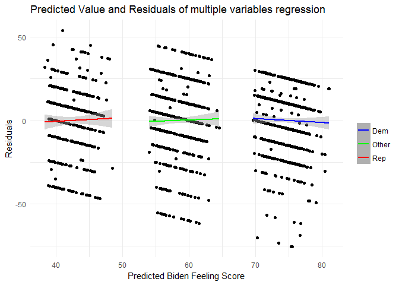

PS \#5: Linear Regression
================
Esha Banerjee
Feb 13, 2017

-   [Describe the data](#describe-the-data)
-   [Simple Linear Regression](#simple-linear-regression)
-   [Multiple Linear Regression](#multiple-linear-regression)
-   [Multiple linear regression model (with even more variables!)](#multiple-linear-regression-model-with-even-more-variables)
-   [Interactive linear regression model](#interactive-linear-regression-model)

``` r
library (knitr)
library(tidyverse)
```

    ## Loading tidyverse: ggplot2
    ## Loading tidyverse: tibble
    ## Loading tidyverse: tidyr
    ## Loading tidyverse: readr
    ## Loading tidyverse: purrr
    ## Loading tidyverse: dplyr

    ## Conflicts with tidy packages ----------------------------------------------

    ## filter(): dplyr, stats
    ## lag():    dplyr, stats

``` r
library(modelr)
library(broom)
```

    ## 
    ## Attaching package: 'broom'

    ## The following object is masked from 'package:modelr':
    ## 
    ##     bootstrap

``` r
biden = read.csv('biden.csv')
```

Describe the data
=================

``` r
ggplot(data = biden, mapping = aes(x = biden)) + 
  geom_histogram(binwidth = 1, 
                 col = 'black', fill ='red') + 
  labs(title = 'Distribution of feeling scores towards Joe Biden (0 = very cold, 100 = very warm)',
      x = 'Feeling score',
      y = 'Frequency count of responses for given score') +
  theme_minimal()
```


``` r
unique(biden$biden)
```

    ##  [1]  90  70  60  50  85  30   0  40  15 100  55  65  80  35  75  20  89
    ## [18]   8   5  95  25  10  88

``` r
length(unique(biden$biden))
```

    ## [1] 23

The count distribution of the histogram shows that the survey responses on the feeling of warmth towards Joe Biden on a scale of 0-100 are mostly clustered around the focal points i.e multiples of 5 or 10. In fact, though we could theoretically have had 101 values, we have only 23 unique values with 20 values being in multiples of 5 or 10.

This is a commonly observed phenomenon in survey responses, rounding of values might represent uncertainty of feelings or uncertainty in mapping that quantity into a numerical response or both.

Most values are clustered at 50, which means most people have no particular feeling towards Biden, but the distribution of scores on either side of the score 50 shows that more people feel warm towards Biden than cold.

Simple Linear Regression
========================

``` r
feeling_age <- lm(biden ~ age, data = biden)
summary(feeling_age)
```

    ## 
    ## Call:
    ## lm(formula = biden ~ age, data = biden)
    ## 
    ## Residuals:
    ##     Min      1Q  Median      3Q     Max 
    ## -64.876 -12.318  -1.257  21.684  39.617 
    ## 
    ## Coefficients:
    ##             Estimate Std. Error t value Pr(>|t|)    
    ## (Intercept) 59.19736    1.64792   35.92   <2e-16 ***
    ## age          0.06241    0.03267    1.91   0.0563 .  
    ## ---
    ## Signif. codes:  0 '***' 0.001 '**' 0.01 '*' 0.05 '.' 0.1 ' ' 1
    ## 
    ## Residual standard error: 23.44 on 1805 degrees of freedom
    ## Multiple R-squared:  0.002018,   Adjusted R-squared:  0.001465 
    ## F-statistic: 3.649 on 1 and 1805 DF,  p-value: 0.05626

``` r
tidy (feeling_age)
```

    ##          term    estimate  std.error statistic       p.value
    ## 1 (Intercept) 59.19736008 1.64791889 35.922496 1.145056e-213
    ## 2         age  0.06240535 0.03266815  1.910281  5.625534e-02

1.  The coefficent of the predictor i.e. age is 0.06241, which is greater than 0, so there is a relationship.

2.  The relationship between the feeling score and age is not a significant one at 0.05 significance level since the p-value is 0.0563. Judging by the estimate and the standard error, age has a coefficient of ~ 0.06 which means that on average, change of age by a year would cause the score to change by 0.06 and since we know the distribution of scores, this obviously does not tell us anything, so the relationship is a very weak one.

3.  The relationship between the predictor and response is positive, since the coefficient of the predictor is positive (0.06241).

``` r
glance(feeling_age)$r.squared
```

    ## [1] 0.002017624

1.  The R-squared value is 0.002, which indicates that it is unable to explain 99.8% of the variation in responses. Hence, it is a bad model.

``` r
predictions <- augment(feeling_age, newdata = data_frame(age = c(45))) %>%
  mutate(ymin = .fitted - .se.fit * 1.96,
         ymax = .fitted + .se.fit * 1.96)
predictions
```

    ##   age .fitted   .se.fit     ymin     ymax
    ## 1  45 62.0056 0.5577123 60.91248 63.09872

1.  The predicted "biden" with age of 45 is 62.0056, the associated 95% confidence interval is (60.91248, 63.09872).

2.  

``` r
ggplot(biden, aes(x = age, y = biden)) +
  geom_point() +
  geom_smooth(method = "lm", color = "yellow") +
  labs(title = 'Joe Biden Feeling Scores (0-100) for age with Least Squares Regression Line',
       y = 'Feeling Score') +
  theme_minimal()
```


Multiple Linear Regression
==========================

``` r
biden_age_gender_edu <- lm(biden ~ age + female + educ, data = biden)
summary (biden_age_gender_edu)
```

    ## 
    ## Call:
    ## lm(formula = biden ~ age + female + educ, data = biden)
    ## 
    ## Residuals:
    ##     Min      1Q  Median      3Q     Max 
    ## -67.084 -14.662   0.703  18.847  45.105 
    ## 
    ## Coefficients:
    ##             Estimate Std. Error t value Pr(>|t|)    
    ## (Intercept) 68.62101    3.59600  19.083  < 2e-16 ***
    ## age          0.04188    0.03249   1.289    0.198    
    ## female       6.19607    1.09670   5.650 1.86e-08 ***
    ## educ        -0.88871    0.22469  -3.955 7.94e-05 ***
    ## ---
    ## Signif. codes:  0 '***' 0.001 '**' 0.01 '*' 0.05 '.' 0.1 ' ' 1
    ## 
    ## Residual standard error: 23.16 on 1803 degrees of freedom
    ## Multiple R-squared:  0.02723,    Adjusted R-squared:  0.02561 
    ## F-statistic: 16.82 on 3 and 1803 DF,  p-value: 8.876e-11

``` r
tidy(biden_age_gender_edu)
```

    ##          term    estimate  std.error statistic      p.value
    ## 1 (Intercept) 68.62101396 3.59600465 19.082571 4.337464e-74
    ## 2         age  0.04187919 0.03248579  1.289154 1.975099e-01
    ## 3      female  6.19606946 1.09669702  5.649755 1.863612e-08
    ## 4        educ -0.88871263 0.22469183 -3.955251 7.941295e-05

1.  There is a statistically significant relationship between the predictors and the response biden. The predictors female and educ are both statistically significant, even at .001 significance level with very low p-values of 1.86e-08 and 7.94e-05 respectively. The predictor age has become more insignificant with the multiple linear regression model compared to the simple linear regression with the p-value now being .198.

2.  The coefficient for female suggests that, with the age and years of education of the respondent held constant, the predicted feeling score for Joe Biden (biden) is ~6.2 points higher if the respondent is female.

``` r
glance(biden_age_gender_edu)$r.squared
```

    ## [1] 0.02722727

1.  The R-squared value for the model is 0.027, which means that age, gender and education can together explain 2.7% variation in the response data, but it fails for 97.3 %. It is 10 times better than the age-only simple linear regression model which could explain 0.2 % variation in data, but it is still a bad model in itself.

``` r
biden %>%
  add_predictions(biden_age_gender_edu) %>%
  add_residuals(biden_age_gender_edu) %>%
  {.} -> grid
griddem <- filter(grid, dem == 1)
gridrep <- filter(grid, rep == 1)
gridother <- filter(grid, dem == 0 & rep == 0)
ggplot(grid, aes(x = pred, y = resid)) +
  geom_point() +
  geom_smooth(method ="lm", aes(y = resid , color = 'Dem'), data = griddem, size = 1) +
  geom_smooth(method ="lm", aes(y = resid, color = 'Rep'), data = gridrep, size = 1) +
  geom_smooth(method ="lm", aes(y = resid, color = 'Other'), data = gridother, size = 1) +
  scale_colour_manual("", values = c("Dem"="blue","Rep"="red", "Other"="green")) +
  labs(title = "Predicted Value and Residuals of model with age, gender, education",
        x = "Predicted Biden Feeling Score",
        y = "Residuals") +
  theme_minimal()
```


1.  Plotting the 3 smooth fit regression lines for the residuals on the predicted values of feeling score for each of the three possible affiliations (Democrat, Republican, and Other), we see that political affiliation has a distinct effect on the residual value. Democrats' predicted feeling score tend to be higher than actual value, while Republicans' score tend to be lower, implying that there is a relationship between party affiliation and Biden feeling Score that the current model fails to address. Absence of party effects is thus a crucial flaw of the model.

Multiple linear regression model (with even more variables!)
============================================================

``` r
biden_mlr = lm(biden ~ age + female + educ + dem + rep, data = biden)
summary(biden_mlr)
```

    ## 
    ## Call:
    ## lm(formula = biden ~ age + female + educ + dem + rep, data = biden)
    ## 
    ## Residuals:
    ##     Min      1Q  Median      3Q     Max 
    ## -75.546 -11.295   1.018  12.776  53.977 
    ## 
    ## Coefficients:
    ##              Estimate Std. Error t value Pr(>|t|)    
    ## (Intercept)  58.81126    3.12444  18.823  < 2e-16 ***
    ## age           0.04826    0.02825   1.708   0.0877 .  
    ## female        4.10323    0.94823   4.327 1.59e-05 ***
    ## educ         -0.34533    0.19478  -1.773   0.0764 .  
    ## dem          15.42426    1.06803  14.442  < 2e-16 ***
    ## rep         -15.84951    1.31136 -12.086  < 2e-16 ***
    ## ---
    ## Signif. codes:  0 '***' 0.001 '**' 0.01 '*' 0.05 '.' 0.1 ' ' 1
    ## 
    ## Residual standard error: 19.91 on 1801 degrees of freedom
    ## Multiple R-squared:  0.2815, Adjusted R-squared:  0.2795 
    ## F-statistic: 141.1 on 5 and 1801 DF,  p-value: < 2.2e-16

``` r
tidy(biden_mlr)
```

    ##          term     estimate std.error  statistic      p.value
    ## 1 (Intercept)  58.81125899 3.1244366  18.822996 2.694143e-72
    ## 2         age   0.04825892 0.0282474   1.708438 8.772744e-02
    ## 3      female   4.10323009 0.9482286   4.327258 1.592601e-05
    ## 4        educ  -0.34533479 0.1947796  -1.772952 7.640571e-02
    ## 5         dem  15.42425563 1.0680327  14.441745 8.144928e-45
    ## 6         rep -15.84950614 1.3113624 -12.086290 2.157309e-32

1.  The relationship between gender and Biden warmth changes. The coefficient for female was 6.1960695 previously, including the dem and rep factors it changes to 4.1032301. So if we hold constant Democratic and Republican party membership, in addition to age, years of education and gender, the increase in predicted Biden feeling score is lower than when the party membership is not held constant.

``` r
glance(biden_mlr)$r.squared
```

    ## [1] 0.2815391

1.  The R-squared value is 0.2815, which means that age, female, educ, dem, rep together can explain 28.15 % of the variation in data. It is thus 10 times better than the model given by age, female, educ.It is still not a good model by itself.

``` r
biden %>%
  add_predictions(biden_mlr) %>%
  add_residuals(biden_mlr) %>%
  {.} -> new_grid
griddem1 <- filter(new_grid, dem == 1)
gridrep1 <- filter(new_grid, rep == 1)
gridother1 <- filter(new_grid, dem == 0 & rep == 0)

ggplot(new_grid, aes(x= pred, y = resid)) +
  geom_point() +
  geom_smooth(method ="lm", aes(y = resid , color = 'Dem'), data = griddem1, size = 1) +
  geom_smooth(method ="lm", aes(y = resid, color = 'Rep'), data = gridrep1, size = 1) +
  geom_smooth(method ="lm", aes(y = resid, color = 'Other'), data = gridother1, size = 1) +
  scale_colour_manual("", values = c("Dem"="blue","Rep"="red", "Other"="green")) +
  labs(title = "Predicted Value and Residuals of multiple variables regression",
        x = "Predicted Biden Feeling Score",
        y = "Residuals")+
  theme_minimal()
```

 3. The plot shows that the previous problem has been fixed.The three fit lines corresponding to different party affiliations are now similar with a slope of approximately 0 as well as a 0 intercept. Thus the relationship between parties and Biden feeling score has been explained well.

Interactive linear regression model
===================================

``` r
biden_party <- filter(biden, dem == 1 | rep == 1)
biden_party_lr <- lm(biden ~ female * dem, data = biden_party)
summary(biden_party_lr)
```

    ## 
    ## Call:
    ## lm(formula = biden ~ female * dem, data = biden_party)
    ## 
    ## Residuals:
    ##     Min      1Q  Median      3Q     Max 
    ## -75.519 -13.070   4.223  11.930  55.618 
    ## 
    ## Coefficients:
    ##             Estimate Std. Error t value Pr(>|t|)    
    ## (Intercept)   39.382      1.455  27.060  < 2e-16 ***
    ## female         6.395      2.018   3.169  0.00157 ** 
    ## dem           33.688      1.835  18.360  < 2e-16 ***
    ## female:dem    -3.946      2.472  -1.597  0.11065    
    ## ---
    ## Signif. codes:  0 '***' 0.001 '**' 0.01 '*' 0.05 '.' 0.1 ' ' 1
    ## 
    ## Residual standard error: 19.42 on 1147 degrees of freedom
    ## Multiple R-squared:  0.3756, Adjusted R-squared:  0.374 
    ## F-statistic:   230 on 3 and 1147 DF,  p-value: < 2.2e-16

``` r
tidy(biden_party_lr)
```

    ##          term  estimate std.error statistic       p.value
    ## 1 (Intercept) 39.382022  1.455363 27.059928 4.045546e-125
    ## 2      female  6.395180  2.017807  3.169371  1.568102e-03
    ## 3         dem 33.687514  1.834799 18.360328  3.295008e-66
    ## 4  female:dem -3.945888  2.471577 -1.596506  1.106513e-01

``` r
grid4 <- biden_party %>%
  data_grid(female, dem)
grid4 <- grid4 %>%
  add_predictions(biden_party_lr)

pred_ci <- augment(biden_party_lr,
                   newdata = grid4) %>%
  mutate(ymin = .fitted - .se.fit * 1.96,
         max = .fitted + .se.fit * 1.96)
pred_ci
```

    ##   female dem     pred  .fitted   .se.fit     ymin      max
    ## 1      0   0 39.38202 39.38202 1.4553632 36.52951 42.23453
    ## 2      0   1 73.06954 73.06954 1.1173209 70.87959 75.25949
    ## 3      1   0 45.77720 45.77720 1.3976638 43.03778 48.51662
    ## 4      1   1 75.51883 75.51883 0.8881114 73.77813 77.25953

The parameter *β*<sub>0</sub> = 39.3820, *β*<sub>1</sub> = 6.3952, *β*<sub>2</sub> = 33.6875, *β*<sub>3</sub> = -3.9459. The standard errors are 1.4554, 2.0178, 1.8348, and 2.4716 respectively.

1.  The predicted Biden warmth feeling thermometer ratings for female Democrats is 75.5188 with 95% confidence intervals (73.7881, 77.2595), 45.7772 for female Republicans with 95% confidence intervals (43.0378, 48.5166), 73.0695 for male Democrats with 95% confidence intervals (70.8796, 75.2595), and 39.3820 for male Republicans with 95% confidence intervals (36.5295, 42.2345).

The relationship between party affiliation and Biden warmth differs for males and females. Females are less affected by party affiliation since female Republicans report much higher Biden warmth feeling scores than male Republicans.

The relationship between gender and Biden warmth differ for Democrats/Republicans. Republicans are more affected by gender since the female Republicans tend to report about 6.3952 points higher warmth scores than male Republicans while female Democrats tend to report about 2.4493 points higher than male Democrats. Thus, we can conclude that Democrats favor Biden regardless of gender, but females, regardless of political affiliation, favor Biden more than males.
