PS 7
================
Esha Banerjee
26 February 2017

``` r
library(broom)
library(modelr)
library(tidyverse)
library(knitr)
library (pander)
library(gam)
library(splines)
theme_set(theme_minimal())
```

``` r
biden <- read_csv("biden.csv") 
clg <- read_csv("college.csv") 
```

Part 1: Sexy Joe Biden (redux)
==============================

#### Estimate the training MSE of the model using the traditional approach.

*Y* = *β*<sub>0</sub> + *β*<sub>1</sub>*X*<sub>1</sub> + *β*<sub>2</sub>*X*<sub>2</sub> + *β*<sub>3</sub>*X*<sub>3</sub> + *β*<sub>4</sub>*X*<sub>4</sub> + *β*<sub>5</sub>*X*<sub>5</sub> + *ϵ*

where *Y* is the Joe Biden feeling thermometer, *X*<sub>1</sub> is age, *X*<sub>2</sub> is gender, *X*<sub>3</sub> is education, *X*<sub>4</sub> is Democrat, and *X*<sub>5</sub> is Republican.

``` r
req_model <- lm(biden ~ age + female + educ + dem + rep , biden)
pander(tidy(req_model))
```

<table style="width:78%;">
<colgroup>
<col width="16%" />
<col width="15%" />
<col width="16%" />
<col width="16%" />
<col width="12%" />
</colgroup>
<thead>
<tr class="header">
<th align="center">term</th>
<th align="center">estimate</th>
<th align="center">std.error</th>
<th align="center">statistic</th>
<th align="center">p.value</th>
</tr>
</thead>
<tbody>
<tr class="odd">
<td align="center">(Intercept)</td>
<td align="center">58.81</td>
<td align="center">3.124</td>
<td align="center">18.82</td>
<td align="center">2.694e-72</td>
</tr>
<tr class="even">
<td align="center">age</td>
<td align="center">0.04826</td>
<td align="center">0.02825</td>
<td align="center">1.708</td>
<td align="center">0.08773</td>
</tr>
<tr class="odd">
<td align="center">female</td>
<td align="center">4.103</td>
<td align="center">0.9482</td>
<td align="center">4.327</td>
<td align="center">1.593e-05</td>
</tr>
<tr class="even">
<td align="center">educ</td>
<td align="center">-0.3453</td>
<td align="center">0.1948</td>
<td align="center">-1.773</td>
<td align="center">0.07641</td>
</tr>
<tr class="odd">
<td align="center">dem</td>
<td align="center">15.42</td>
<td align="center">1.068</td>
<td align="center">14.44</td>
<td align="center">8.145e-45</td>
</tr>
<tr class="even">
<td align="center">rep</td>
<td align="center">-15.85</td>
<td align="center">1.311</td>
<td align="center">-12.09</td>
<td align="center">2.157e-32</td>
</tr>
</tbody>
</table>

``` r
mse <- function(model, data) {
  x <- modelr:::residuals(model, data)
  mean(x ^ 2, na.rm = TRUE)
}
mse_all <- round (mse(req_model, biden), 2)
mse_all
```

    ## [1] 395.27

MSE using traditional approach is 395.27

#### Estimate the test MSE of the model using the validation set approach.

``` r
set.seed(4884)
split <- resample_partition(biden, c(test = 0.3, train = 0.7))
req_model1 <- lm(biden ~ age + female + educ + dem + rep, data = split$train)
pander(tidy(req_model1))
```

<table style="width:78%;">
<colgroup>
<col width="16%" />
<col width="15%" />
<col width="16%" />
<col width="16%" />
<col width="12%" />
</colgroup>
<thead>
<tr class="header">
<th align="center">term</th>
<th align="center">estimate</th>
<th align="center">std.error</th>
<th align="center">statistic</th>
<th align="center">p.value</th>
</tr>
</thead>
<tbody>
<tr class="odd">
<td align="center">(Intercept)</td>
<td align="center">55.11</td>
<td align="center">3.822</td>
<td align="center">14.42</td>
<td align="center">9.586e-44</td>
</tr>
<tr class="even">
<td align="center">age</td>
<td align="center">0.04904</td>
<td align="center">0.0341</td>
<td align="center">1.438</td>
<td align="center">0.1506</td>
</tr>
<tr class="odd">
<td align="center">female</td>
<td align="center">4.579</td>
<td align="center">1.138</td>
<td align="center">4.022</td>
<td align="center">6.122e-05</td>
</tr>
<tr class="even">
<td align="center">educ</td>
<td align="center">-0.04929</td>
<td align="center">0.2393</td>
<td align="center">-0.2059</td>
<td align="center">0.8369</td>
</tr>
<tr class="odd">
<td align="center">dem</td>
<td align="center">14.65</td>
<td align="center">1.274</td>
<td align="center">11.5</td>
<td align="center">3.633e-29</td>
</tr>
<tr class="even">
<td align="center">rep</td>
<td align="center">-16.53</td>
<td align="center">1.592</td>
<td align="center">-10.38</td>
<td align="center">2.829e-24</td>
</tr>
</tbody>
</table>

``` r
mse_valid <- round (mse(req_model1, split$test), 2)
mse_valid
```

    ## [1] 397.85

MSE using validation approach (70:30 split) is 397.85. The validation set approach yields a higher MSE than one obtained from fitting all the data-points which is expected since the MSE considering all data is over-fitted.

#### Repeat the validation set approach 100 times, using 100 different splits of the observations into a training set and a validation set. Comment on the results obtained.

``` r
set.seed(4884)
mse_100 <- replicate(100, {
  split <- resample_partition(biden, c(test = 0.3, train = 0.7))
  train_model <- lm(biden ~ age + female + educ + dem + rep, data = split$train)
  mse(train_model, split$test)
})
mse_valid_100 <- mean(mse_100, na.rm = TRUE)
mse_valid_100
```

    ## [1] 394.517

``` r
hist(mse_100, 
     main="Distribution of MSE using Validation Set Approach 100 times", 
     xlab="MSE values", 
     border="black", 
     col="red")
```

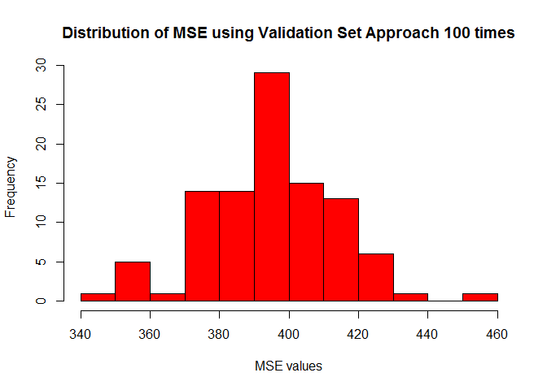

The mean MSE from the 100-time validation approach is 394.52. This value is lower than the traditional MSE using all points, the most frequently occuring MSE's are the ones having values close to the traditional one. The MSE's are distributed over a range of values (375-450). If we chose a different seed or different number of iterations, we might end up with a different mean mse since this approach is highly dependent on composition of training & testing sets. However this particular one, seems to fit the data very well.

#### Estimate the test MSE of the model using the leave-one-out cross-validation (LOOCV) approach. Comment on the results obtained.

``` r
set.seed(4884)
loocv_data <- crossv_kfold(biden, k = nrow(biden))
loocv_models <- map(loocv_data$train, ~ lm(biden ~ age + female + educ + dem + rep, data = .))
loocv_mse <- map2_dbl(loocv_models, loocv_data$test, mse) 
mean(loocv_mse)
```

    ## [1] 397.9555

MSE using LOOCV approach is 397.96. This value is higher than traditional MSE and quite close to the one time validation approach. This approach is computationally expensive and dependent on the split of the data.

#### Estimate the test MSE of the model using the 10-fold cross-validation approach. Comment on the results obtained.

``` r
set.seed(4884)
biden_10fold <- crossv_kfold(biden, k = 10)
biden_10models <- map(biden_10fold$train, ~ lm(biden ~ age + female + educ + dem + rep, data = .))
biden_10mses <- map2_dbl(biden_10models, biden_10fold$test, mse)
mse_10fold <- mean(biden_10mses, na.rm = TRUE)
mse_10fold
```

    ## [1] 398.2761

The 10-fold cross validation approach MSE is 398.28, the highest so far, but still close to the LOOCV approach and much faster computationally. Thus it is better than LOOCV.

#### Repeat the 10-fold cross-validation approach 100 times, using 100 different splits of the observations into 10-folds. Comment on the results obtained.

``` r
set.seed(4884)
MSE_10fold_100 <- replicate(100, {
  biden_10fold <- crossv_kfold(biden, k = 10)
  biden_10models <- map(biden_10fold$train, ~ lm(biden ~ age + female + educ + dem + rep, data = .))
  biden_10mses <- map2_dbl(biden_10models,
                           biden_10fold$test, mse)
  mse_10fold <- mean(biden_10mses, na.rm = TRUE)
})

mse_10fold_100 <- mean(MSE_10fold_100)


hist(MSE_10fold_100, 
     main="Distribution of MSE using 10-fold Cross-Validation Set Approach 100 times", 
     xlab="MSE values", 
     border="black", 
     col="red")
```

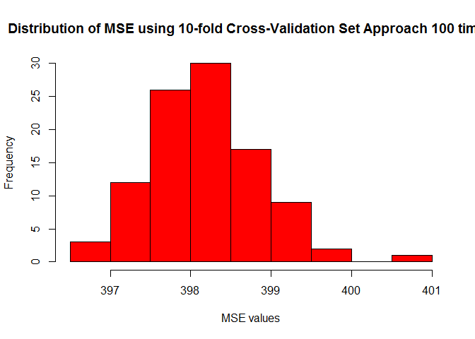

``` r
mse_10fold_100
```

    ## [1] 398.1926

The 10-fold cross validation approach repeated 100 times gives a MSE 398.19, lower than the 10-fold cross validation approach done once or LOOCV. Thus it is better than 10-fold cross-validation done once and is fast enough.

#### Compare the estimated parameters and standard errors from the original model in step 1 (the model estimated using all of the available data) to parameters and standard errors estimated using the bootstrap (*n* = 1000).

``` r
set.seed(4884)
Model_boot <- biden %>%
  modelr::bootstrap(1000) %>%
  mutate(model = map(strap, ~ lm(biden ~ age + female + educ + dem + rep, data = .)),
         coef = map(model, tidy))

Model_boot %>%
  unnest(coef) %>%
  group_by(term) %>%
  summarize(est.boot = mean(estimate),
            se.boot = sd(estimate, na.rm = TRUE))
```

    ## # A tibble: 6 × 3
    ##          term    est.boot    se.boot
    ##         <chr>       <dbl>      <dbl>
    ## 1 (Intercept)  58.8871016 3.15642470
    ## 2         age   0.0489053 0.02856313
    ## 3         dem  15.3935390 1.03611891
    ## 4        educ  -0.3521881 0.20135958
    ## 5      female   4.0816650 0.94397324
    ## 6         rep -15.8656385 1.34410062

``` r
tidy(req_model)
```

    ##          term     estimate std.error  statistic      p.value
    ## 1 (Intercept)  58.81125899 3.1244366  18.822996 2.694143e-72
    ## 2         age   0.04825892 0.0282474   1.708438 8.772744e-02
    ## 3      female   4.10323009 0.9482286   4.327258 1.592601e-05
    ## 4        educ  -0.34533479 0.1947796  -1.772952 7.640571e-02
    ## 5         dem  15.42425563 1.0680327  14.441745 8.144928e-45
    ## 6         rep -15.84950614 1.3113624 -12.086290 2.157309e-32

The original model is `r tidy(req_model)`. The bootstrap standard errors for female, dem, is lower than the standard errors in the original model in step 1, while the bootstrap standard errors for age, educ, rep and the intercept are higher than the standard errors in the original model.

This is intuitive, bootstrap errors are usually larger than the non-bootstrap standard errors because they do not rely on distributional assumptions. The parameters are similar.

Part 2: College (bivariate)
===========================

#### Explore the bivariate relationships between some of the available predictors and Outstate. You should estimate at least 3 simple linear regression models (i.e. only one predictor per model). Use non-linear fitting techniques in order to fit a flexible model to the data, as appropriate.

``` r
mod1 <- lm(Outstate ~ perc.alumni, data = clg)
tidy (mod1)
```

    ##          term  estimate  std.error statistic       p.value
    ## 1 (Intercept) 6259.4803 248.919066  25.14665 1.691632e-102
    ## 2 perc.alumni  183.8379   9.611968  19.12594  4.349522e-67

``` r
mod2 <- lm(Outstate ~ Private, data = clg)
tidy (mod2)
```

    ##          term estimate std.error statistic       p.value
    ## 1 (Intercept) 6813.410  230.4223  29.56924 3.098874e-129
    ## 2  PrivateYes 4988.283  270.2158  18.46037  2.400798e-63

``` r
mod3 <- lm(Outstate ~ PhD, data = clg)
tidy (mod3)
```

    ##          term   estimate  std.error statistic      p.value
    ## 1 (Intercept) 3584.36142 608.838448  5.887213 5.847276e-09
    ## 2         PhD   94.36122   8.175625 11.541774 1.504980e-28

``` r
mod4 <- lm(Outstate ~ Expend, data = clg)
tidy (mod4) 
```

    ##          term   estimate    std.error statistic       p.value
    ## 1 (Intercept) 5433.51228 224.80618488  24.16976  1.257978e-96
    ## 2      Expend    0.51833   0.02047498  25.31529 1.629891e-103

``` r
mod5 <- lm(Outstate ~ Room.Board, data = clg)
tidy (mod5)
```

    ##          term   estimate    std.error   statistic      p.value
    ## 1 (Intercept) -17.445254 447.76785808 -0.03896049 9.689319e-01
    ## 2  Room.Board   2.400012   0.09965361 24.08354107 4.135091e-96

``` r
mod6 <- lm(Outstate ~ Grad.Rate, data = clg)
tidy (mod6)
```

    ##          term estimate  std.error statistic      p.value
    ## 1 (Intercept) 1681.939 467.288500  3.599359 3.392845e-04
    ## 2   Grad.Rate  133.796   6.904714 19.377485 1.628927e-68

``` r
mod7 <- lm(Outstate ~ Top10perc, data = clg)
tidy (mod7)
```

    ##          term  estimate  std.error statistic       p.value
    ## 1 (Intercept) 6906.4586 221.613825  31.16439 7.503509e-139
    ## 2   Top10perc  128.2437   6.774122  18.93141  5.459243e-66

``` r
mod8 <- lm(Outstate ~ Enroll, data = clg)
tidy (mod8)
```

    ##          term     estimate   std.error statistic       p.value
    ## 1 (Intercept) 10965.718933 186.3111148 58.857030 3.425669e-288
    ## 2      Enroll    -0.673164   0.1536347 -4.381589  1.340362e-05

``` r
mod9 <- lm(Outstate ~ Accept, data = clg)
tidy (mod9)
```

    ##          term      estimate    std.error  statistic       p.value
    ## 1 (Intercept)  1.052601e+04 187.08247753 56.2639869 6.714539e-276
    ## 2      Accept -4.227097e-02   0.05893773 -0.7172141  4.734581e-01

``` r
mod10 <- lm(Outstate ~ Apps, data = clg)
tidy (mod10)
```

    ##          term     estimate   std.error statistic       p.value
    ## 1 (Intercept) 1.028417e+04 182.5767467 56.327902 3.310338e-276
    ## 2        Apps 5.213956e-02   0.0372924  1.398128  1.624745e-01

``` r
mod11 <- lm(Outstate ~ Top25perc, data = clg)
tidy (mod11)
```

    ##          term   estimate  std.error statistic      p.value
    ## 1 (Intercept) 4893.79284 376.723097  12.99042 4.737621e-35
    ## 2   Top25perc   99.41235   6.363247  15.62290 4.900964e-48

``` r
mod12 <- lm(Outstate ~ F.Undergrad, data = clg)
tidy (mod12)
```

    ##          term      estimate    std.error statistic       p.value
    ## 1 (Intercept) 11102.7301769 177.40229750 62.585042 2.840943e-305
    ## 2 F.Undergrad    -0.1789399   0.02909188 -6.150853  1.234045e-09

``` r
mod13 <- lm(Outstate ~ P.Undergrad, data = clg)
tidy (mod13)
```

    ##          term      estimate   std.error statistic      p.value
    ## 1 (Intercept) 11013.6377580 160.2613224 68.722993 0.000000e+00
    ## 2 P.Undergrad    -0.6699047   0.0918203 -7.295823 7.353113e-13

``` r
mod14 <- lm(Outstate ~ Books, data = clg)
tidy (mod14)
```

    ##          term     estimate   std.error statistic      p.value
    ## 1 (Intercept) 9920.5419074 501.6938589 19.774095 8.910162e-71
    ## 2       Books    0.9467517   0.8746045  1.082491 2.793710e-01

``` r
mod15 <- lm(Outstate ~ Personal, data = clg)
tidy (mod15)
```

    ##          term     estimate   std.error statistic       p.value
    ## 1 (Intercept) 12823.140052 305.8482978 41.926472 1.751257e-201
    ## 2    Personal    -1.777112   0.2036656 -8.725635  1.605128e-17

``` r
mod16 <- lm(Outstate ~ Terminal, data = clg)
tidy (mod16)
```

    ##          term  estimate  std.error statistic      p.value
    ## 1 (Intercept) 1555.0080 726.337746  2.140888 3.259441e-02
    ## 2    Terminal  111.4851   8.961678 12.440200 1.602173e-32

``` r
mod17 <- lm(Outstate ~ S.F.Ratio, data = clg)
tidy (mod17)
```

    ##          term   estimate std.error statistic       p.value
    ## 1 (Intercept) 18385.6471 444.49995  41.36254 2.484536e-198
    ## 2   S.F.Ratio  -563.8854  30.37346 -18.56507  6.237522e-64

Considering all the available variables, Expend, Room.Board and Grad.Rate are found to be the most significant ones.

Plotting the Outstate vs Expend:

``` r
ex <- lm(Outstate ~ Expend, data = clg)

ggplot(clg, aes(Expend, Outstate)) +
  geom_point(colour="red") + 
  geom_smooth(method = "lm")+
  labs(title = 'Outstate vs. Expenditure',
       y = 'Out of State Tuition',
       x = 'Instructional Expenditure per Student')
```

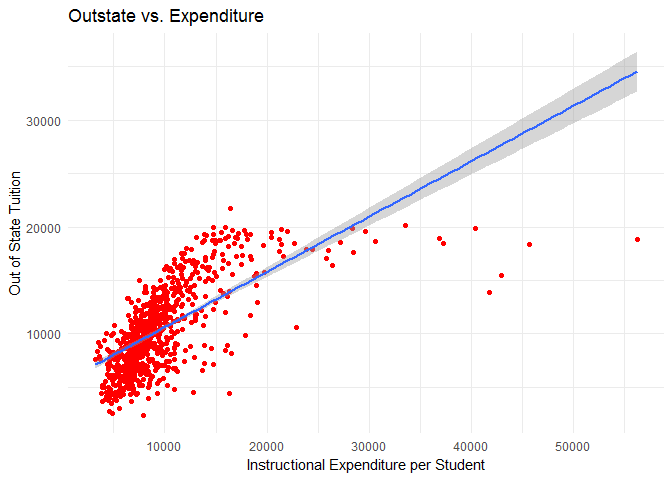

``` r
clg %>%
  add_predictions(ex) %>%
  add_residuals(ex) %>%
ggplot(aes(x = pred, y= resid)) +
  geom_point(aes(y = resid)) +
  geom_point(alpha = .2) +
  geom_hline(yintercept = 0, linetype = 2) +
  labs(title = "Residuals and Predicted Values: Outstate vs. Expenditure",
       x = "Predicted values",
       y = "Residuals")
```

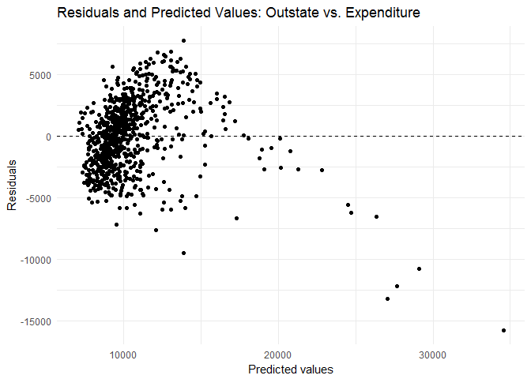 Looking at the graphs, it is evident that the relationship is not a linear one, so we apply a log transformation.

``` r
ex_log <- glm(Outstate ~ log(Expend), data = clg)

ggplot(clg, aes(log(Expend), Outstate)) +
  geom_point(colour="red") + 
  geom_smooth(method = "lm")+
  labs(title = 'Outstate vs. Log(Expenditure)',
       y = 'Out of State Tuition',
       x = 'Instructional Expenditure per Student')
```

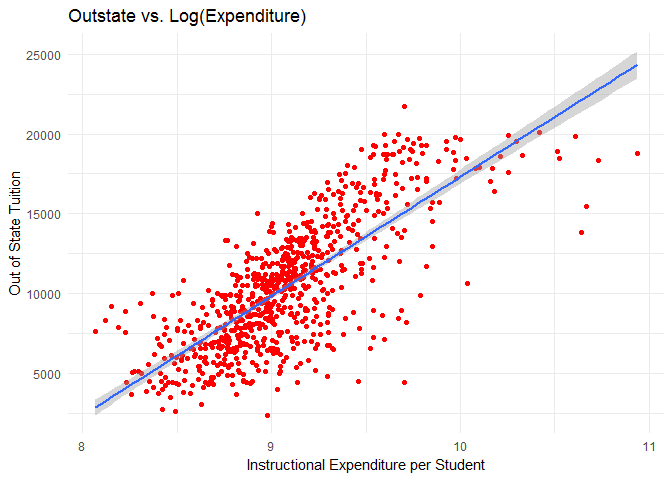

The log transformation leads to a more even distribution of points. Clarifying with the residuals:

``` r
clg %>%
  add_predictions(ex_log) %>%
  add_residuals(ex_log) %>%
ggplot(aes(x = pred, y= resid)) +
  geom_point(aes(y = resid)) +
  geom_point(alpha = .2) +
  geom_hline(yintercept = 0, linetype = 2) +
  labs(title = "Residuals and Predicted Values: Outstate vs. Log(Expenditure)",
       x = "Predicted values",
       y = "Residuals")
```

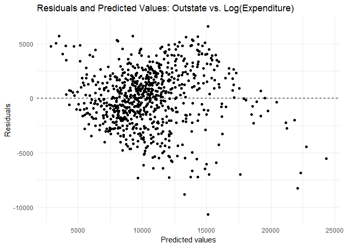 The distribution of the residuals is much more even. Validating this through 10-fold cross-fold validation:

``` r
ex_log_cv10 <- crossv_kfold(clg, k = 10)
ex_log_cv10_model <- map(ex_log_cv10$train, ~ lm(Outstate ~ log(Expend), data = .))

ex_log_cv10_mse <- map2_dbl(ex_log_cv10_model, ex_log_cv10$test, mse)
ex_log_mse <- mean(ex_log_cv10_mse, na.rm = TRUE)

ex_log_mse
```

    ## [1] 6890275

``` r
ex_cv10 <- crossv_kfold(clg, k = 10)
ex_cv10_model <- map(ex_cv10$train, ~ lm(Outstate ~ Expend, data = .))

ex_cv10_mse <- map2_dbl(ex_cv10_model, ex_cv10$test, mse)
ex_mse <- mean(ex_cv10_mse, na.rm = TRUE)

ex_mse
```

    ## [1] 8948690

The 10-fold cross validation approach MSE for log(expenditure) is 6.890274610^{6}, which is much lower than 8.948690210^{6}, the mse for expenditure. So, the log transformation suits the model well.

Considering another significant variable, Room.Board:

``` r
rb <- lm(Outstate ~ Room.Board, data = clg)

ggplot(clg, aes(Room.Board, Outstate)) +
  geom_point(colour="red") + 
  geom_smooth(method = "lm")+
  labs(title = 'Outstate vs. Room & Board Costs',
       y = 'Out of State Tuition',
       x = 'Room & Board Costs')
```

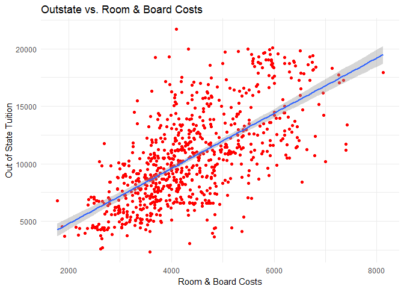

``` r
clg %>%
  add_predictions(rb) %>%
  add_residuals(rb ) %>%
ggplot(aes(x = pred, y= resid)) +
  geom_point(aes(y = resid)) +
  geom_point(alpha = .2) +
  geom_hline(yintercept = 0, linetype = 2) +
  labs(title = "Residuals and Predicted Values: Outstate vs. Room & Board Costs",
       x = "Predicted values",
       y = "Residuals")
```

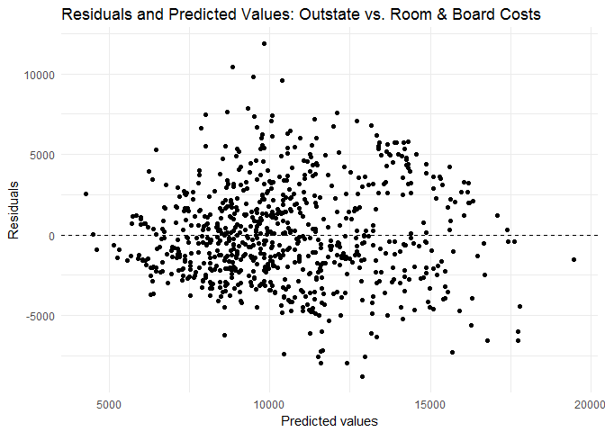 The data fits the linear model close enough, for a better fit we try polynomial regression.

``` r
set.seed(4884)
rb10 <- crossv_kfold(clg, k = 10)
rb_error_fold10 <- vector("numeric", 5)
terms <- 1:5

for(i in terms){
  rb10_models <- map(rb10$train, ~ lm(Outstate ~ poly(Room.Board, i), data = .))
  rb10_mse <- map2_dbl(rb10_models, rb10$test, mse)
  rb_error_fold10[[i]] <- mean(rb10_mse)
}


mse_rb <- round (mse(rb, clg), 2)

data_frame(terms = terms,
           fold10 = rb_error_fold10) %>%
  ggplot(aes(x=terms, y=fold10)) +
  geom_line() +
  geom_hline(aes(yintercept = mse_rb, color = 'MSE for linear regression'), linetype = 'dashed') +
  labs(title = "MSE estimates",
       x = "Degree of Polynomial",
       y = "Mean Squared Error")
```

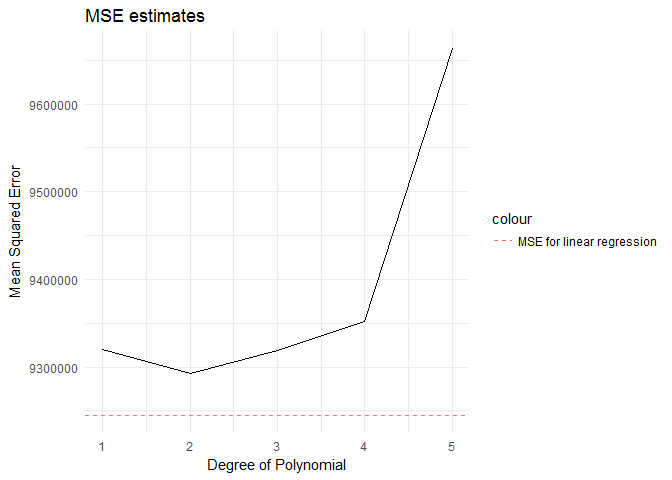

Lowest MSE is obtained for a degree of 5, but that is very difficult to interpret, we choose a degree of 3 which yields a lower value than the traditional linear one.

``` r
rb_3 <- lm(Outstate ~ poly(Room.Board , 3), data = clg)
rb_pred <- add_predictions(clg, rb_3)
rb_pred <- add_residuals(rb_pred, rb_3)

ggplot(rb_pred, aes(x = pred, y = resid)) +
  geom_smooth() +
  geom_point() +
  labs(title="3rd order polynomial model regression for Room & Board Costs",  x ="Predicted expenditure", y = "Residuals") 
```

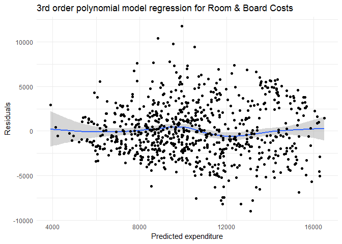

``` r
summary(rb_3)
```

    ## 
    ## Call:
    ## lm(formula = Outstate ~ poly(Room.Board, 3), data = clg)
    ## 
    ## Residuals:
    ##     Min      1Q  Median      3Q     Max 
    ## -8990.6 -2027.0  -333.1  1931.7 11774.8 
    ## 
    ## Coefficients:
    ##                      Estimate Std. Error t value Pr(>|t|)    
    ## (Intercept)             10441        109  95.811   <2e-16 ***
    ## poly(Room.Board, 3)1    73321       3038  24.138   <2e-16 ***
    ## poly(Room.Board, 3)2    -6535       3038  -2.151   0.0318 *  
    ## poly(Room.Board, 3)3    -2891       3038  -0.952   0.3415    
    ## ---
    ## Signif. codes:  0 '***' 0.001 '**' 0.01 '*' 0.05 '.' 0.1 ' ' 1
    ## 
    ## Residual standard error: 3038 on 773 degrees of freedom
    ## Multiple R-squared:  0.4321, Adjusted R-squared:  0.4299 
    ## F-statistic: 196.1 on 3 and 773 DF,  p-value: < 2.2e-16

``` r
summary(rb)
```

    ## 
    ## Call:
    ## lm(formula = Outstate ~ Room.Board, data = clg)
    ## 
    ## Residuals:
    ##     Min      1Q  Median      3Q     Max 
    ## -8781.0 -2070.6  -350.8  1877.4 11877.4 
    ## 
    ## Coefficients:
    ##              Estimate Std. Error t value Pr(>|t|)    
    ## (Intercept) -17.44525  447.76786  -0.039    0.969    
    ## Room.Board    2.40001    0.09965  24.084   <2e-16 ***
    ## ---
    ## Signif. codes:  0 '***' 0.001 '**' 0.01 '*' 0.05 '.' 0.1 ' ' 1
    ## 
    ## Residual standard error: 3044 on 775 degrees of freedom
    ## Multiple R-squared:  0.4281, Adjusted R-squared:  0.4273 
    ## F-statistic:   580 on 1 and 775 DF,  p-value: < 2.2e-16

Even though a polynomial in degree 3 results in a lower MSE, it is not sgnificantly lower, also the r-squared values do not change significantly, so for this case, choosing a linear model is efficient.

Considering another significant factor, Graduation Rate:

``` r
clg_f <- filter(clg, Grad.Rate <= 100)
gr <- lm(Outstate ~ Grad.Rate, data = clg)

ggplot(clg_f, aes(Grad.Rate, Outstate)) +
  geom_point(colour="red") + 
  geom_smooth(method = "lm")+
  labs(title = 'Outstate vs. Graduation Rate',
       y = 'Out of State Tuition',
       x = 'Graduation Rate')
```

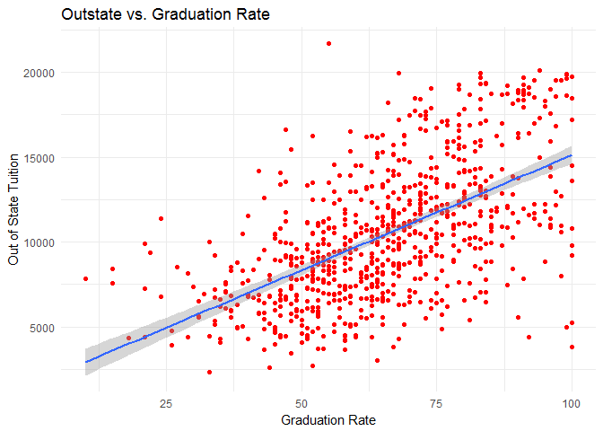

``` r
clg_f %>%
  add_predictions(gr) %>%
  add_residuals(gr) %>%
ggplot(aes(x = pred, y= resid)) +
  geom_point(aes(y = resid)) +
  geom_point(alpha = .2) +
  geom_hline(yintercept = 0, linetype = 2) +
  labs(title = "Residuals and Predicted Values: Outstate vs. Graduation Rate",
       x = "Predicted values",
       y = "Residuals")
```

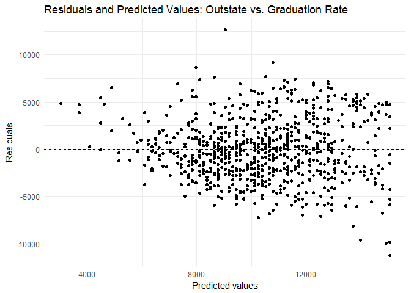 Evidently, the simple linear model doesn't explain the data well. The residuals seem to have heteroscedastic variance.

We use polynomial regression.

``` r
set.seed(4884)
gr10 <- crossv_kfold(clg, k = 10)
gr_error_fold10 <- vector("numeric", 5)
terms <- 1:5

for(i in terms){
  gr10_models <- map(gr10$train, ~ lm(Outstate ~ poly(Grad.Rate, i), data = .))
  gr10_mse <- map2_dbl(gr10_models, gr10$test, mse)
  gr_error_fold10[[i]] <- mean(gr10_mse)
}


mse_gr <- round (mse(gr, clg_f), 2)

data_frame(terms = terms,
           fold10 = gr_error_fold10) %>%
  ggplot(aes(x=terms, y=fold10)) +
  geom_line() +
  geom_hline(aes(yintercept = mse_gr, color = 'MSE for linear regression'), linetype = 'dashed') +
  labs(title = "MSE estimates",
       x = "Degree of Polynomial",
       y = "Mean Squared Error")
```

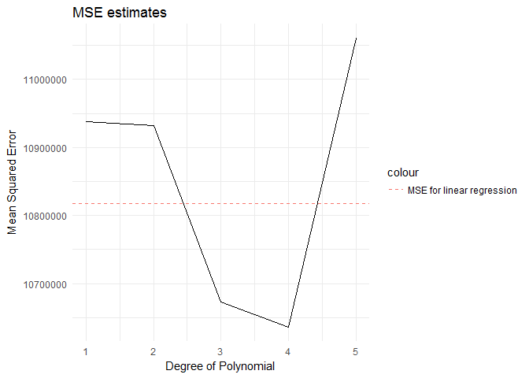 Evidently, degree 4 gives a lower MSE, but we choose 3 for easier interpretation.

``` r
gr_3 <- lm(Outstate ~ poly(Grad.Rate , 3), data = clg)
gr_pred <- add_predictions(clg_f, gr_3)
gr_pred <- add_residuals(gr_pred, gr_3)

ggplot(gr_pred, aes(x = pred, y = resid)) +
  geom_smooth() +
  geom_point() +
  labs(title="3rd order polynomial regression for Graduation Rate",  x ="Predicted Rate", y = "Residuals") 
```

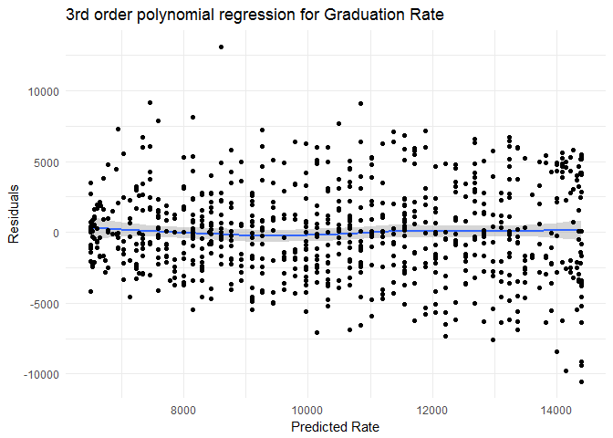

``` r
summary(gr_3)
```

    ## 
    ## Call:
    ## lm(formula = Outstate ~ poly(Grad.Rate, 3), data = clg)
    ## 
    ## Residuals:
    ##      Min       1Q   Median       3Q      Max 
    ## -10551.1  -2194.1   -146.4   2130.6  13097.7 
    ## 
    ## Coefficients:
    ##                     Estimate Std. Error t value Pr(>|t|)    
    ## (Intercept)          10440.7      116.7  89.434  < 2e-16 ***
    ## poly(Grad.Rate, 3)1  64023.5     3254.2  19.674  < 2e-16 ***
    ## poly(Grad.Rate, 3)2   5928.8     3254.2   1.822   0.0689 .  
    ## poly(Grad.Rate, 3)3 -15474.5     3254.2  -4.755 2.36e-06 ***
    ## ---
    ## Signif. codes:  0 '***' 0.001 '**' 0.01 '*' 0.05 '.' 0.1 ' ' 1
    ## 
    ## Residual standard error: 3254 on 773 degrees of freedom
    ## Multiple R-squared:  0.3482, Adjusted R-squared:  0.3457 
    ## F-statistic: 137.7 on 3 and 773 DF,  p-value: < 2.2e-16

``` r
summary(gr)
```

    ## 
    ## Call:
    ## lm(formula = Outstate ~ Grad.Rate, data = clg)
    ## 
    ## Residuals:
    ##      Min       1Q   Median       3Q      Max 
    ## -11221.5  -2251.7   -161.3   2156.5  12659.3 
    ## 
    ## Coefficients:
    ##             Estimate Std. Error t value Pr(>|t|)    
    ## (Intercept) 1681.939    467.289   3.599 0.000339 ***
    ## Grad.Rate    133.796      6.905  19.377  < 2e-16 ***
    ## ---
    ## Signif. codes:  0 '***' 0.001 '**' 0.01 '*' 0.05 '.' 0.1 ' ' 1
    ## 
    ## Residual standard error: 3304 on 775 degrees of freedom
    ## Multiple R-squared:  0.3264, Adjusted R-squared:  0.3255 
    ## F-statistic: 375.5 on 1 and 775 DF,  p-value: < 2.2e-16

The MSE has changed significantly from 1.081818410^{7} to 1.053892610^{7} while the r squared shows that the new model can explain 35 % of the variation in data compared to the previous 33%, so while it is better than the linear one, it is still not very good.

Applying splines, with degree 2 and knot 1, we see it fits the data better.

``` r
set.seed(4884)

gr_s <- glm(Outstate ~ bs(Grad.Rate, degree = 3, df = 3), data = clg_f)

clg_f %>%
  add_predictions(gr_s) %>%
  add_residuals(gr_s) %>%
ggplot(aes(x = pred, y= resid)) +
  geom_point(aes(y = resid)) +
  geom_point(alpha = .2) +
  geom_hline(yintercept = 0, linetype = 2) +
  labs(title = "Residuals and Predicted Values: Outstate vs. Graduation Rate",
       x = "Predicted values",
       y = "Residuals")
```

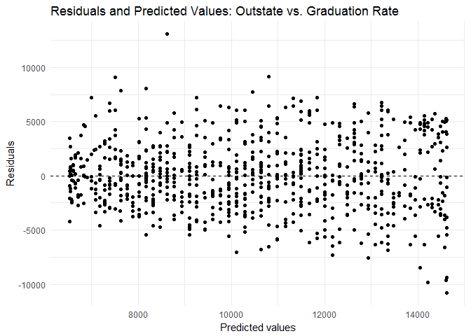

Part 3: College (GAM)
=====================

#### Split the data into a training set and a test set.

``` r
set.seed(4884)
clg_split <- resample_partition(clg, c(test = 0.5, train = 0.5))
```

Estimate an OLS model on the training data, using out-of-state tuition (Outstate) as the response variable and the other six variables as the predictors. Interpret the results and explain your findings, using appropriate techniques (tables, graphs, statistical tests, etc.).

``` r
clg_ols <- lm(Outstate ~ Private + Room.Board + PhD + perc.alumni + Expend + Grad.Rate, data = clg_split$train)
summary(clg_ols)
```

    ## 
    ## Call:
    ## lm(formula = Outstate ~ Private + Room.Board + PhD + perc.alumni + 
    ##     Expend + Grad.Rate, data = clg_split$train)
    ## 
    ## Residuals:
    ##     Min      1Q  Median      3Q     Max 
    ## -6669.4 -1340.6     8.9  1351.6  5333.6 
    ## 
    ## Coefficients:
    ##               Estimate Std. Error t value Pr(>|t|)    
    ## (Intercept) -3.831e+03  6.325e+02  -6.057 3.33e-09 ***
    ## PrivateYes   2.287e+03  3.065e+02   7.460 5.89e-13 ***
    ## Room.Board   1.122e+00  1.173e-01   9.563  < 2e-16 ***
    ## PhD          4.076e+01  8.277e+00   4.925 1.26e-06 ***
    ## perc.alumni  5.181e+01  1.077e+01   4.812 2.16e-06 ***
    ## Expend       2.277e-01  2.398e-02   9.495  < 2e-16 ***
    ## Grad.Rate    2.104e+01  7.571e+00   2.779  0.00573 ** 
    ## ---
    ## Signif. codes:  0 '***' 0.001 '**' 0.01 '*' 0.05 '.' 0.1 ' ' 1
    ## 
    ## Residual standard error: 2089 on 382 degrees of freedom
    ## Multiple R-squared:  0.7473, Adjusted R-squared:  0.7433 
    ## F-statistic: 188.3 on 6 and 382 DF,  p-value: < 2.2e-16

``` r
train <- clg_split$train %>%
  as_tibble()
train %>%
  add_predictions(clg_ols) %>%
  add_residuals(clg_ols) %>%
ggplot(aes(x = pred, y= resid)) +
  geom_point() +
  geom_smooth()
```

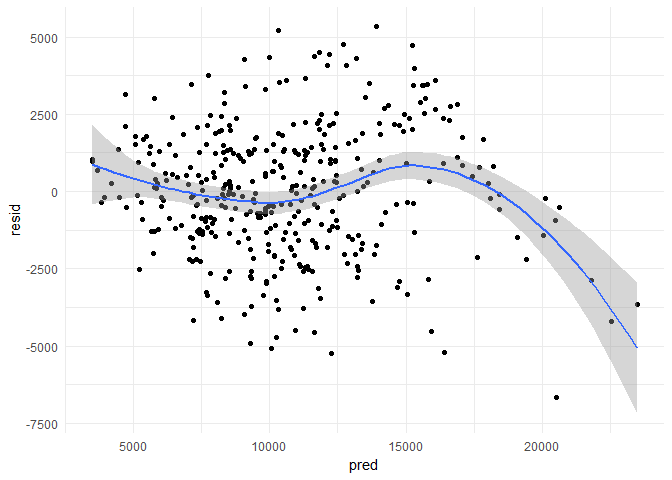

``` r
  labs(title = "Residuals and Predicted Values of OLS",
       x = "Predicted values",
       y = "Residuals")
```

    ## $title
    ## [1] "Residuals and Predicted Values of OLS"
    ## 
    ## $x
    ## [1] "Predicted values"
    ## 
    ## $y
    ## [1] "Residuals"
    ## 
    ## attr(,"class")
    ## [1] "labels"

The model explains 75 % of the variation in data with all variables being statistically significant, but it doesnt satisfactorily explain the data.

Estimate a GAM on the training data, using out-of-state tuition (Outstate) as the response variable and the other six variables as the predictors. You can select any non-linear method (or linear) presented in the readings or in-class to fit each variable. Plot the results, and explain your findings. Interpret the results and explain your findings, using appropriate techniques (tables, graphs, statistical tests, etc.).

``` r
clg_gam <- gam(Outstate ~ PhD + perc.alumni + log(Expend) + bs(Grad.Rate, degree = 3, df = 3) + Private + Room.Board, data = clg_split$train, na.action = na.fail)
summary(clg_gam)
```

    ## 
    ## Call: gam(formula = Outstate ~ PhD + perc.alumni + log(Expend) + bs(Grad.Rate, 
    ##     degree = 3, df = 3) + Private + Room.Board, data = clg_split$train, 
    ##     na.action = na.fail)
    ## Deviance Residuals:
    ##      Min       1Q   Median       3Q      Max 
    ## -5894.24 -1263.35    51.35  1318.38  4840.02 
    ## 
    ## (Dispersion Parameter for gaussian family taken to be 3818547)
    ## 
    ##     Null Deviance: 6593235767 on 388 degrees of freedom
    ## Residual Deviance: 1451047748 on 380 degrees of freedom
    ## AIC: 7010.271 
    ## 
    ## Number of Local Scoring Iterations: 2 
    ## 
    ## Anova for Parametric Effects
    ##                                    Df     Sum Sq    Mean Sq F value
    ## PhD                                 1 1285442479 1285442479 336.631
    ## perc.alumni                         1 1328640079 1328640079 347.944
    ## log(Expend)                         1 1762278713 1762278713 461.505
    ## bs(Grad.Rate, degree = 3, df = 3)   3  232533051   77511017  20.299
    ## Private                             1  262562034  262562034  68.760
    ## Room.Board                          1  270731663  270731663  70.899
    ## Residuals                         380 1451047748    3818547        
    ##                                      Pr(>F)    
    ## PhD                               < 2.2e-16 ***
    ## perc.alumni                       < 2.2e-16 ***
    ## log(Expend)                       < 2.2e-16 ***
    ## bs(Grad.Rate, degree = 3, df = 3) 3.198e-12 ***
    ## Private                           1.947e-15 ***
    ## Room.Board                        7.787e-16 ***
    ## Residuals                                      
    ## ---
    ## Signif. codes:  0 '***' 0.001 '**' 0.01 '*' 0.05 '.' 0.1 ' ' 1

``` r
train %>%
  add_predictions(clg_gam) %>%
  add_residuals(clg_gam) %>%
ggplot(aes(x = pred, y= resid)) +
  geom_point() +
  geom_smooth()
```

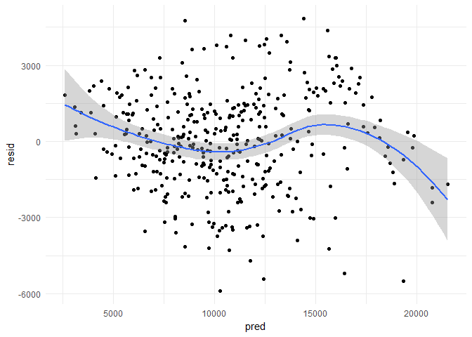

``` r
  labs(title = "Residuals and Predicted Values of GAM",
       x = "Predicted values",
       y = "Residuals")
```

    ## $title
    ## [1] "Residuals and Predicted Values of GAM"
    ## 
    ## $x
    ## [1] "Predicted values"
    ## 
    ## $y
    ## [1] "Residuals"
    ## 
    ## attr(,"class")
    ## [1] "labels"

Based on Part 2, I use a log-transformed 'expend' and spline with 3 degrees of freedom and 2 degrees polynomial on Grad.Rate. I use 'Room.Board', 'perc.alumni', 'PhD' and 'Private' as is. In the GAM regression output, we see that all 6 variables are highly statistically significant similar to the OLS regression. Visually, it still does not satisfactorily fit the data.

Choosing the three most significant ones: log(Expend), perc.alumni and PhD, we plot the following.

``` r
clg_gam_terms <- preplot(clg_gam, se = TRUE, rug = FALSE)

data_frame(x = clg_gam_terms$PhD$x,
           y = clg_gam_terms$PhD$y,
           se.fit = clg_gam_terms$PhD$se.y) %>%
  unique %>%
  mutate(y_low = y - 1.96 * se.fit,
         y_high = y + 1.96 * se.fit) %>%
  ggplot(aes(x, y, ymin = y_low, ymax = y_high)) +
  geom_errorbar() +
  geom_point() +
  labs(title = "GAM of Outstate Tuition",
       x = "PhD",
       y = expression(f[1](phd)))
```

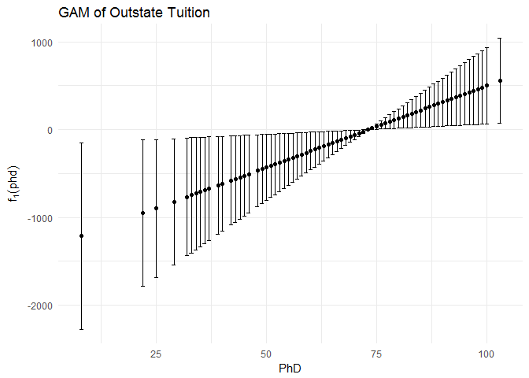

``` r
data_frame(x = clg_gam_terms$`log(Expend)`$x,
           y = clg_gam_terms$`log(Expend)`$y,
           se.fit = clg_gam_terms$`log(Expend)`$se.y) %>%
  mutate(y_low = y - 1.96 * se.fit,
         y_high = y + 1.96 * se.fit) %>%
  ggplot(aes(x, y)) +
  geom_line() +
  geom_line(aes(y = y_low), linetype = 2) +
  geom_line(aes(y = y_high), linetype = 2) +
  labs(title = "GAM of Outstate Tuition",
       subtitle = "Log Transformation",
       x = "Expend",
       y = expression(f[3](expend)))
```

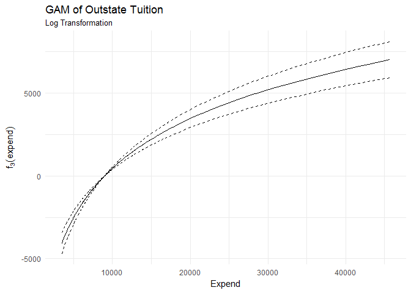

``` r
data_frame(x = clg_gam_terms$perc.alumni$x,
           y = clg_gam_terms$perc.alumni$y,
           se.fit = clg_gam_terms$perc.alumni$se.y) %>%
  unique %>%
  mutate(y_low = y - 1.96 * se.fit,
         y_high = y + 1.96 * se.fit) %>%
  ggplot(aes(x, y, ymin = y_low, ymax = y_high)) +
  geom_errorbar() +
  geom_point() +
  labs(title = "GAM of Outstate Tuition",
       x = "perc.alumni",
       y = expression(f[2](perc.alumni)))
```

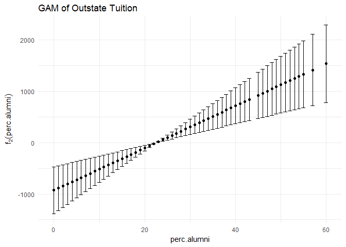 As PhD increases, outstate continuously increases as well. It seems to be a linear relationship. Percent of alumni who donate also has a similar linearly postive relationship with outstate tuition. The amount of money spent on each student (Expend) has a curvilinear relationship with out of state tuition that has especially small confidence intervals right around 10,0000.

#### Use the test set to evaluate the model fit of the estimated OLS and GAM models, and explain the results obtained.

``` r
mse <- function(model, data) {
  x <- modelr:::residuals(model, data)
  mean(x ^ 2, na.rm = TRUE)
}
mse_ols <- mse(clg_ols, clg_split$test)
mse_gam <- mse(clg_gam, clg_split$test)
mse_ols
```

    ## [1] 4052472

``` r
mse_gam
```

    ## [1] 3892569

MSE value of GAM model on the test set is 3.892568710^{6} which is slightly smaller than the OLS model, the value of which is 4.052472110^{6} . Thus the GAM model indeed is better than OLS.

#### For which variables, if any, is there evidence of a non-linear relationship with the response?

``` r
gam1 = gam(Outstate ~ PhD + perc.alumni + log(Expend) + bs(Grad.Rate, degree = 3, df = 3) + Private + Room.Board, data = clg_split$train, na.action = na.fail)

gam2 = gam(Outstate ~ lo(PhD) + perc.alumni + log(Expend) + bs(Grad.Rate, degree = 3, df = 3) + Private + Room.Board, data = clg_split$train, na.action = na.fail)

gam3 = gam(Outstate ~ PhD + lo(perc.alumni) + log(Expend) + bs(Grad.Rate, degree = 3, df = 3) + Private + Room.Board, data = clg_split$train, na.action = na.fail)

gam4 = gam(Outstate ~ PhD + perc.alumni + Expend + bs(Grad.Rate, degree = 3, df = 3) + Private + Room.Board, data = clg_split$train, na.action = na.fail)

gam5 = gam(Outstate ~ PhD + perc.alumni + log(Expend) + Grad.Rate + Private + Room.Board, data = clg_split$train, na.action = na.fail)

gam6 = gam(Outstate ~ PhD + perc.alumni + log(Expend) + bs(Grad.Rate, degree = 3, df = 3) + Private + lo(Room.Board), data = clg_split$train, na.action = na.fail)

anova(gam1, gam2, gam3, gam4, gam5, gam6)
```

    ## Analysis of Deviance Table
    ## 
    ## Model 1: Outstate ~ PhD + perc.alumni + log(Expend) + bs(Grad.Rate, degree = 3, 
    ##     df = 3) + Private + Room.Board
    ## Model 2: Outstate ~ lo(PhD) + perc.alumni + log(Expend) + bs(Grad.Rate, 
    ##     degree = 3, df = 3) + Private + Room.Board
    ## Model 3: Outstate ~ PhD + lo(perc.alumni) + log(Expend) + bs(Grad.Rate, 
    ##     degree = 3, df = 3) + Private + Room.Board
    ## Model 4: Outstate ~ PhD + perc.alumni + Expend + bs(Grad.Rate, degree = 3, 
    ##     df = 3) + Private + Room.Board
    ## Model 5: Outstate ~ PhD + perc.alumni + log(Expend) + Grad.Rate + Private + 
    ##     Room.Board
    ## Model 6: Outstate ~ PhD + perc.alumni + log(Expend) + bs(Grad.Rate, degree = 3, 
    ##     df = 3) + Private + lo(Room.Board)
    ##   Resid. Df Resid. Dev       Df   Deviance  Pr(>Chi)    
    ## 1    380.00 1451047748                                  
    ## 2    377.30 1418565290  2.69752   32482457  0.026656 *  
    ## 3    377.55 1439502074 -0.24421  -20936783  0.002599 ** 
    ## 4    380.00 1638214719 -2.45330 -198712645 7.776e-12 ***
    ## 5    382.00 1482724945 -2.00000  155489773              
    ## 6    376.97 1417484068  5.03057   65240878  0.003976 ** 
    ## ---
    ## Signif. codes:  0 '***' 0.001 '**' 0.01 '*' 0.05 '.' 0.1 ' ' 1

From the anova tests, it seems that Expend has a non-linear relationship with the response as the significance of the models having linear and non-linear terms for expend vary considerably.
