PS 8: tree-based methods and support vector machines
================
Esha Banerjee
5 March 2017

Part 1: Sexy Joe Biden (redux times two)
========================================

#### Split data into a training set (70%) and a validation set (30%). Be sure to set your seed prior to this part of your code to guarantee reproducibility of results.

#### Fit a decision tree to the training data, with biden as the response variable and the other variables as predictors. Plot the tree and interpret the results. What is the test MSE? Leave the control options for tree() at their default values

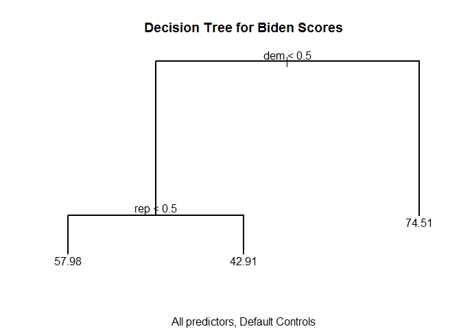

    ## [1] 423.709

We evaluate the model with the testing data and find that the mean squared error is 423.7090397.

The model shows that being a Democrat is the strongest predictor of feelings of warmth toward Joe Biden, being a Republican is the second-strongest predictor. These splits indicate that party affiliation is the most important factor in predicting an individual's feelings of warmth toward Joe Biden.

#### Now fit another tree to the training data with the following control options: tree(control = tree.control(nobs = \# number of rows in the training set,mindev = 0)). Use cross-validation to determine the optimal level of tree complexity, plot the optimal tree, and interpret the results. Does pruning the tree improve the test MSE?

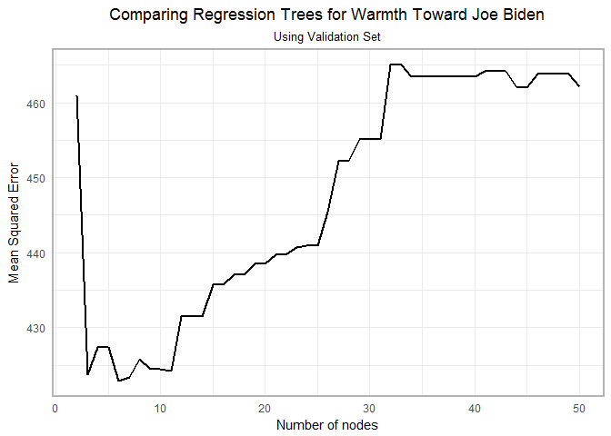

    ## [1] 497.3772

Using cross validation, we find that the MSE is lowest for a tree with 6 nodes.

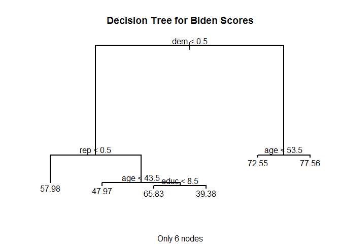

    ## [1] 422.8927

Pruning to 6 nodes reduces the MSE from 423.7090397 (which was obtained using all defaults) to 422.8926521.However 497.377166 which was obtained in this set after splitting and before pruning gave a high mse for the test data implying that it overfitted during training with the 70 % data. The tree indicates that for Democrats, age is the next most important variable. Among Republicans age is important followed by education but educationis a factor only for voters aged 43.5 years and above. Gender, strangely has no effect.

#### Use the bagging approach to analyze this data. What test MSE do you obtain? Obtain variable importance measures and interpret the results.

    ## 
    ## Call:
    ##  randomForest(formula = biden ~ ., data = biden_bag_data_train,      mtry = 5, ntree = 500, importance = TRUE) 
    ##                Type of random forest: regression
    ##                      Number of trees: 500
    ## No. of variables tried at each split: 5
    ## 
    ##           Mean of squared residuals: 482.4251
    ##                     % Var explained: 10.76

    ## [1] 501.2769

The MSE for the model with bagging is 501.2769109 , which is much higher than we had for the pruned tree with 422.8926521. The % variation explained is also very low, at 10.76%.

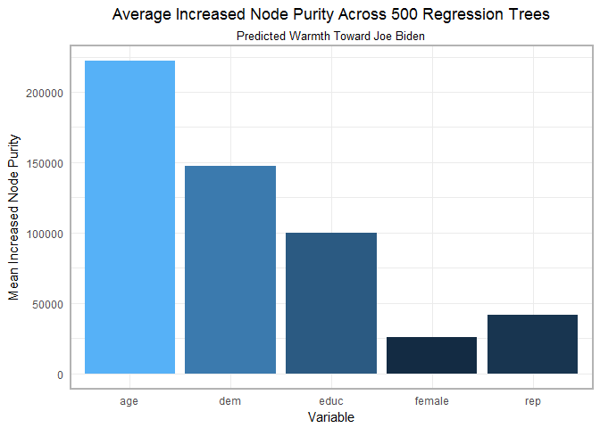 The variable importance plot shows that age and Democrat are the two most important variables as these yield the greatest average decrease in node impurity across 500 bagged regression trees. Despite the higher test MSE, the bagged tree model is likely a better model than the pruned tree above because the bagged model uses bootstrapping to create 500 different training sets, whereas the pruned tree above uses only a single training set.It can thus address variances based on the composition of the sets better. Here too, gender is the least important variable. The bagged model accounts only for 10.76% of the variance in feelings of warmth toward Joe Biden.

#### Use the random forest approach to analyze this data. What test MSE do you obtain? Obtain variable importance measures and interpret the results. Describe the effect of *m*, the number of variables considered at each split, on the error rate obtained.

    ## 
    ## Call:
    ##  randomForest(formula = biden ~ ., data = biden_bag_data_train,      mtry = 2, ntree = 500) 
    ##                Type of random forest: regression
    ##                      Number of trees: 500
    ## No. of variables tried at each split: 2
    ## 
    ##           Mean of squared residuals: 395.5181
    ##                     % Var explained: 26.83

    ## [1] 424.9684

The random forest model gives a test MSE of 424.9683515, which is much lower than the one returned by bagging 501.2769109. Random forest also explains variance (26.83%) in the data compared to the bagged model (10.76%). Still, with the % var explained is low, so that there are probably other unknown variables that effect feelings of warmth for Joe Biden.

The notable decrease in MSE is attributable to the effect of limiting the variables available every split to only randomly-selected predictors. This ensures that the trees in the random forest model are uncorrelated to each other, the variance in the final models is lower, and hence the test MSE is lower.

Plotting the importance of the predictors:

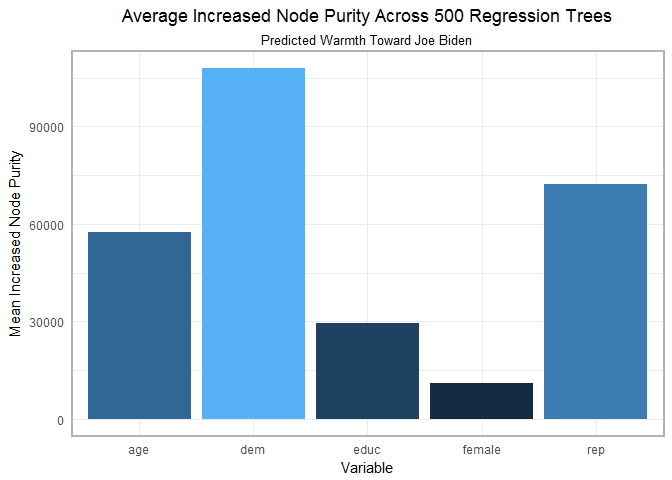 The random forest model estimates that Democrat is the sinlge most important predictor of feelings toward Joe Biden and that Republican is next in line. As was the case with the bagging model, gender is the least important predictor.

#### Use the boosting approach to analyze the data. What test MSE do you obtain? How does the value of the shrinkage parameter *λ* influence the test MSE?

We first run the boosting model using depths of 1,2 and 4 respoectively, to find the optimal number of iterations for lowest MSE.

    ## Distribution not specified, assuming gaussian ...
    ## Distribution not specified, assuming gaussian ...
    ## Distribution not specified, assuming gaussian ...

    ## Using OOB method...
    ## Using OOB method...
    ## Using OOB method...

|  Depth|  Optimal number of iterations|
|------:|-----------------------------:|
|      1|                          3468|
|      2|                          2665|
|      4|                          2160|

    ## Distribution not specified, assuming gaussian ...

    ## Distribution not specified, assuming gaussian ...

    ## Distribution not specified, assuming gaussian ...

    ## Using 3468 trees...

    ## [1] 422.9558

    ## Using 2665 trees...

    ## [1] 420.7636

    ## Using 2160 trees...

    ## [1] 422.5238

The boosting model with a depth of 1 has a test MSE of 422.9558048; for the model with a depth of 2, it is 420.7635695 and for the model with a depth of 4 it is 422.5237557. The boosting approach yields the lowest MSE for trees with two splits compared to those with one or four splits. These values are much better than those obtained by bagging and random forest models.

Next, we increase the value of the *λ* from the default of .001 to .1:

    ## Distribution not specified, assuming gaussian ...

    ## Distribution not specified, assuming gaussian ...

    ## Distribution not specified, assuming gaussian ...

    ## Using 3468 trees...

    ## [1] 440.0276

    ## Using 2665 trees...

    ## [1] 446.2872

    ## Using 2160 trees...

    ## [1] 463.2061

We notice that all the MSE values have increased.Shrinkage is used for reducing, or shrinking, the impact of each additional fitted base-learner (tree). It reduces the size of incremental steps and thus penalizes the importance of each consecutive iteration. So since we increased the step size, the negative impact of an erroneous boosting iteration could not be rectified and we end up with a high MSE.

Part 2: Modeling voter turnout
==============================

#### Use cross-validation techniques and standard measures of model fit (e.g. test error rate, PRE, ROC curves/AUC) to compare and evaluate at least five tree-based models of voter turnout. Select the best model and interpret the results using whatever methods you see fit (graphs, tables, model fit statistics, predictions for hypothetical observations, etc.)

    ## node), split, n, deviance, yval, (yprob)
    ##       * denotes terminal node
    ## 
    ## 1) root 816 1040.0 1 ( 0.3346 0.6654 )  
    ##   2) educ < 15.5 601  807.0 1 ( 0.3960 0.6040 )  
    ##     4) educ < 11.5 133  183.1 0 ( 0.5489 0.4511 ) *
    ##     5) educ > 11.5 468  607.5 1 ( 0.3526 0.6474 ) *
    ##   3) educ > 15.5 215  191.0 1 ( 0.1628 0.8372 ) *

    ## [1] 0.3065903

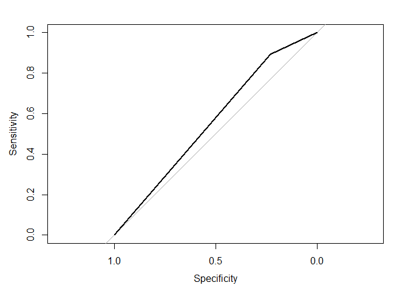

    ## Area under the curve: 0.561

    ## node), split, n, deviance, yval, (yprob)
    ##       * denotes terminal node
    ## 
    ## 1) root 816 1040.0 1 ( 0.3346 0.6654 )  
    ##   2) mhealth_sum < 4.5 637  741.1 1 ( 0.2684 0.7316 )  
    ##     4) educ < 15.5 444  565.2 1 ( 0.3333 0.6667 ) *
    ##     5) educ > 15.5 193  141.0 1 ( 0.1192 0.8808 ) *
    ##   3) mhealth_sum > 4.5 179  244.6 0 ( 0.5698 0.4302 ) *

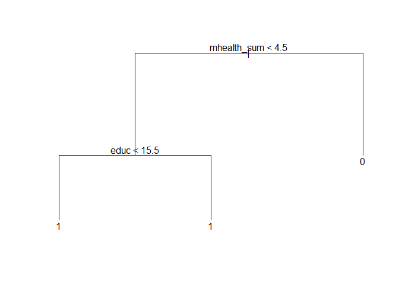

    ## [1] 0.3037249

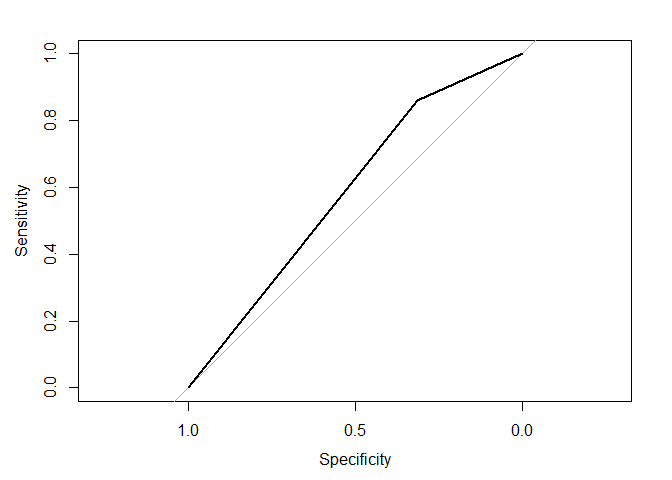

    ## Area under the curve: 0.5875

    ## node), split, n, deviance, yval, (yprob)
    ##       * denotes terminal node
    ## 
    ##  1) root 816 1040.00 1 ( 0.3346 0.6654 )  
    ##    2) age < 39.5 358  495.70 1 ( 0.4804 0.5196 )  
    ##      4) educ < 12.5 140  172.70 0 ( 0.6929 0.3071 )  
    ##        8) educ < 11.5 40   26.01 0 ( 0.9000 0.1000 ) *
    ##        9) educ > 11.5 100  133.70 0 ( 0.6100 0.3900 ) *
    ##      5) educ > 12.5 218  280.60 1 ( 0.3440 0.6560 )  
    ##       10) mhealth_sum < 4.5 172  201.70 1 ( 0.2733 0.7267 )  
    ##         20) educ < 15.5 94  124.10 1 ( 0.3723 0.6277 ) *
    ##         21) educ > 15.5 78   66.97 1 ( 0.1538 0.8462 ) *
    ##       11) mhealth_sum > 4.5 46   61.58 0 ( 0.6087 0.3913 ) *
    ##    3) age > 39.5 458  483.30 1 ( 0.2205 0.7795 )  
    ##      6) mhealth_sum < 4.5 378  353.20 1 ( 0.1772 0.8228 )  
    ##       12) educ < 9.5 34   46.66 1 ( 0.4412 0.5588 ) *
    ##       13) educ > 9.5 344  292.20 1 ( 0.1512 0.8488 )  
    ##         26) age < 48.5 122  133.80 1 ( 0.2377 0.7623 ) *
    ##         27) age > 48.5 222  147.80 1 ( 0.1036 0.8964 ) *
    ##      7) mhealth_sum > 4.5 80  109.10 1 ( 0.4250 0.5750 )  
    ##       14) mhealth_sum < 8.5 58   80.13 0 ( 0.5345 0.4655 ) *
    ##       15) mhealth_sum > 8.5 22   17.53 1 ( 0.1364 0.8636 ) *

    ## [1] 0.3094556

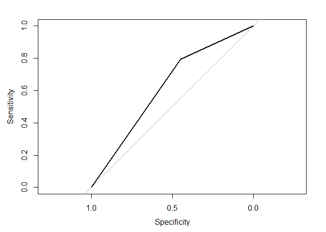

    ## Area under the curve: 0.6214

    ## node), split, n, deviance, yval, (yprob)
    ##       * denotes terminal node
    ## 
    ##  1) root 816 1040.00 1 ( 0.3346 0.6654 )  
    ##    2) age < 39.5 358  495.70 1 ( 0.4804 0.5196 )  
    ##      4) educ < 12.5 140  172.70 0 ( 0.6929 0.3071 )  
    ##        8) educ < 11.5 40   26.01 0 ( 0.9000 0.1000 ) *
    ##        9) educ > 11.5 100  133.70 0 ( 0.6100 0.3900 ) *
    ##      5) educ > 12.5 218  280.60 1 ( 0.3440 0.6560 )  
    ##       10) mhealth_sum < 4.5 172  201.70 1 ( 0.2733 0.7267 )  
    ##         20) educ < 15.5 94  124.10 1 ( 0.3723 0.6277 ) *
    ##         21) educ > 15.5 78   66.97 1 ( 0.1538 0.8462 ) *
    ##       11) mhealth_sum > 4.5 46   61.58 0 ( 0.6087 0.3913 ) *
    ##    3) age > 39.5 458  483.30 1 ( 0.2205 0.7795 )  
    ##      6) inc10 < 2.40745 151  198.10 1 ( 0.3642 0.6358 ) *
    ##      7) inc10 > 2.40745 307  259.40 1 ( 0.1498 0.8502 )  
    ##       14) inc10 < 12.7897 267  245.40 1 ( 0.1723 0.8277 )  
    ##         28) age < 48.5 102  121.80 1 ( 0.2843 0.7157 ) *
    ##         29) age > 48.5 165  109.50 1 ( 0.1030 0.8970 ) *
    ##       15) inc10 > 12.7897 40    0.00 1 ( 0.0000 1.0000 ) *

    ## [1] 0.2922636

    ## Area under the curve: 0.6065

    ## node), split, n, deviance, yval, (yprob)
    ##       * denotes terminal node
    ## 
    ##  1) root 816 1040.00 1 ( 0.3346 0.6654 )  
    ##    2) age < 39.5 358  495.70 1 ( 0.4804 0.5196 )  
    ##      4) educ < 12.5 140  172.70 0 ( 0.6929 0.3071 )  
    ##        8) educ < 11.5 40   26.01 0 ( 0.9000 0.1000 ) *
    ##        9) educ > 11.5 100  133.70 0 ( 0.6100 0.3900 ) *
    ##      5) educ > 12.5 218  280.60 1 ( 0.3440 0.6560 )  
    ##       10) mhealth_sum < 4.5 172  201.70 1 ( 0.2733 0.7267 )  
    ##         20) educ < 15.5 94  124.10 1 ( 0.3723 0.6277 ) *
    ##         21) educ > 15.5 78   66.97 1 ( 0.1538 0.8462 ) *
    ##       11) mhealth_sum > 4.5 46   61.58 0 ( 0.6087 0.3913 ) *
    ##    3) age > 39.5 458  483.30 1 ( 0.2205 0.7795 )  
    ##      6) inc10 < 2.40745 151  198.10 1 ( 0.3642 0.6358 ) *
    ##      7) inc10 > 2.40745 307  259.40 1 ( 0.1498 0.8502 )  
    ##       14) inc10 < 12.7897 267  245.40 1 ( 0.1723 0.8277 )  
    ##         28) age < 48.5 102  121.80 1 ( 0.2843 0.7157 ) *
    ##         29) age > 48.5 165  109.50 1 ( 0.1030 0.8970 ) *
    ##       15) inc10 > 12.7897 40    0.00 1 ( 0.0000 1.0000 ) *

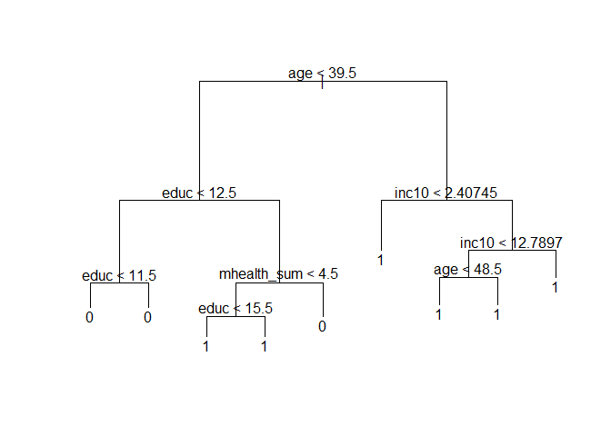

    ## [1] 0.2922636

    ## Area under the curve: 0.6065

 Chosing a combination of different variables: education for first model, education and mental health score for the second, education, age and mental health score in the third, education, age, income and mental health score in the fourth and all variables in the fifth. The area under the curve is highest at 0.621 for the model containing education, age and mental health score. While the error is slightly higher (0.30) than the last two (~ 0.29), it can be overlooked since the other variables are not better predictors.

Looking at the tree for the third model, age is the most important factor, followed by education and mental health score. We can interpret the tree for model 3 (shown below) using hypothetical observations. For younger people, education is the more dominant factor than mental health score when it comes to voting. People younger than 39.5 years are most likely to vote if they have a high education of more then 12.5 years. Older people are more likely to have voted, even if they have received only some education.

    ## node), split, n, deviance, yval, (yprob)
    ##       * denotes terminal node
    ## 
    ##  1) root 816 1040.00 1 ( 0.3346 0.6654 )  
    ##    2) age < 39.5 358  495.70 1 ( 0.4804 0.5196 )  
    ##      4) educ < 12.5 140  172.70 0 ( 0.6929 0.3071 )  
    ##        8) educ < 11.5 40   26.01 0 ( 0.9000 0.1000 ) *
    ##        9) educ > 11.5 100  133.70 0 ( 0.6100 0.3900 ) *
    ##      5) educ > 12.5 218  280.60 1 ( 0.3440 0.6560 )  
    ##       10) mhealth_sum < 4.5 172  201.70 1 ( 0.2733 0.7267 )  
    ##         20) educ < 15.5 94  124.10 1 ( 0.3723 0.6277 ) *
    ##         21) educ > 15.5 78   66.97 1 ( 0.1538 0.8462 ) *
    ##       11) mhealth_sum > 4.5 46   61.58 0 ( 0.6087 0.3913 ) *
    ##    3) age > 39.5 458  483.30 1 ( 0.2205 0.7795 )  
    ##      6) mhealth_sum < 4.5 378  353.20 1 ( 0.1772 0.8228 )  
    ##       12) educ < 9.5 34   46.66 1 ( 0.4412 0.5588 ) *
    ##       13) educ > 9.5 344  292.20 1 ( 0.1512 0.8488 )  
    ##         26) age < 48.5 122  133.80 1 ( 0.2377 0.7623 ) *
    ##         27) age > 48.5 222  147.80 1 ( 0.1036 0.8964 ) *
    ##      7) mhealth_sum > 4.5 80  109.10 1 ( 0.4250 0.5750 )  
    ##       14) mhealth_sum < 8.5 58   80.13 0 ( 0.5345 0.4655 ) *
    ##       15) mhealth_sum > 8.5 22   17.53 1 ( 0.1364 0.8636 ) *

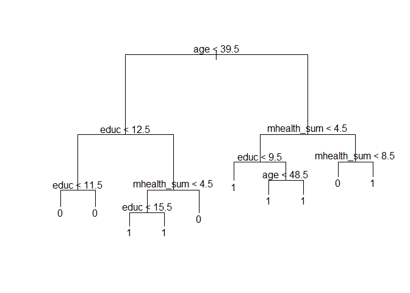 \#\#\#\# Use cross-validation techniques and standard measures of model fit to compare and evaluate at least five SVM models of voter turnout. Select the best model and interpret the results using whatever methods you see fit.

    ## 
    ## Call:
    ## best.tune(method = svm, train.x = vote96 ~ educ + age + mhealth_sum, 
    ##     data = as_tibble(mh_split$train), ranges = list(cost = c(0.001, 
    ##         0.01, 0.1, 1, 5, 10, 100)), kernel = "linear")
    ## 
    ## 
    ## Parameters:
    ##    SVM-Type:  C-classification 
    ##  SVM-Kernel:  linear 
    ##        cost:  10 
    ##       gamma:  0.3333333 
    ## 
    ## Number of Support Vectors:  521
    ## 
    ##  ( 261 260 )
    ## 
    ## 
    ## Number of Classes:  2 
    ## 
    ## Levels: 
    ##  0 1

    ## Area under the curve: 0.7468

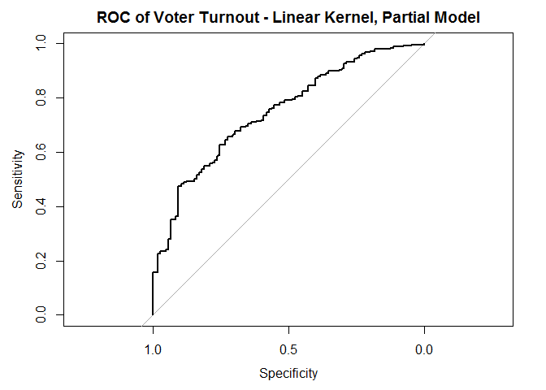 Area under the curve: 0.7468

    ## 
    ## Call:
    ## best.tune(method = svm, train.x = vote96 ~ ., data = as_tibble(mh_split$train), 
    ##     ranges = list(cost = c(0.001, 0.01, 0.1, 1, 5, 10, 100)), 
    ##     kernel = "linear")
    ## 
    ## 
    ## Parameters:
    ##    SVM-Type:  C-classification 
    ##  SVM-Kernel:  linear 
    ##        cost:  100 
    ##       gamma:  0.125 
    ## 
    ## Number of Support Vectors:  515
    ## 
    ##  ( 259 256 )
    ## 
    ## 
    ## Number of Classes:  2 
    ## 
    ## Levels: 
    ##  0 1

    ## Area under the curve: 0.7502

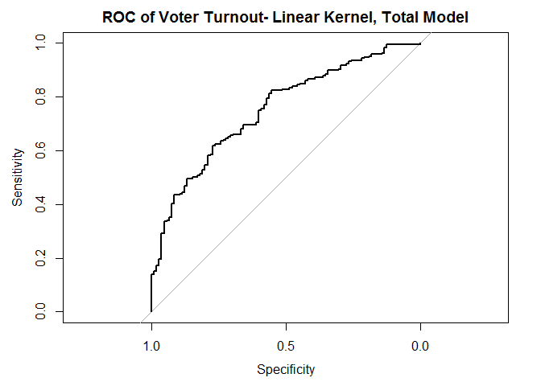 Area under the curve: 0.7502

    ## 
    ## Call:
    ## best.tune(method = svm, train.x = vote96 ~ age + educ + mhealth_sum, 
    ##     data = as_tibble(mh_split$train), ranges = list(cost = c(0.001, 
    ##         0.01, 0.1, 1, 5, 10, 100)), kernel = "polynomial")
    ## 
    ## 
    ## Parameters:
    ##    SVM-Type:  C-classification 
    ##  SVM-Kernel:  polynomial 
    ##        cost:  100 
    ##      degree:  3 
    ##       gamma:  0.3333333 
    ##      coef.0:  0 
    ## 
    ## Number of Support Vectors:  508
    ## 
    ##  ( 256 252 )
    ## 
    ## 
    ## Number of Classes:  2 
    ## 
    ## Levels: 
    ##  0 1

    ## Area under the curve: 0.7411

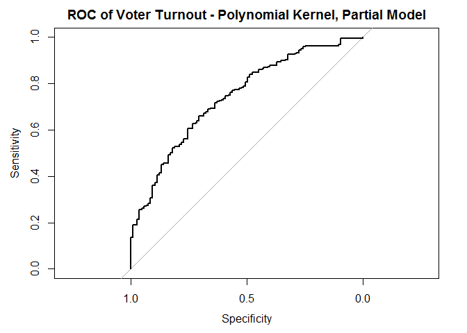

Area under the curve: 0.7411

    ## 
    ## Call:
    ## best.tune(method = svm, train.x = vote96 ~ ., data = as_tibble(mh_split$train), 
    ##     ranges = list(cost = c(0.001, 0.01, 0.1, 1, 5, 10, 100)), 
    ##     kernel = "polynomial")
    ## 
    ## 
    ## Parameters:
    ##    SVM-Type:  C-classification 
    ##  SVM-Kernel:  polynomial 
    ##        cost:  1 
    ##      degree:  3 
    ##       gamma:  0.125 
    ##      coef.0:  0 
    ## 
    ## Number of Support Vectors:  518
    ## 
    ##  ( 268 250 )
    ## 
    ## 
    ## Number of Classes:  2 
    ## 
    ## Levels: 
    ##  0 1

    ## Area under the curve: 0.7416

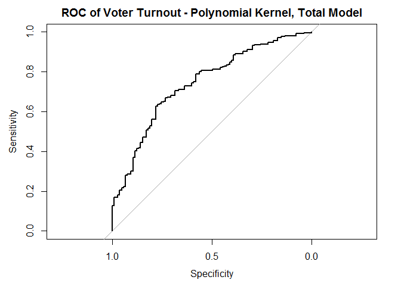

Area under the curve: 0.7395

    ## 
    ## Call:
    ## best.tune(method = svm, train.x = vote96 ~ ., data = as_tibble(mh_split$train), 
    ##     ranges = list(cost = c(0.001, 0.01, 0.1, 1, 5, 10, 100)), 
    ##     kernel = "radial")
    ## 
    ## 
    ## Parameters:
    ##    SVM-Type:  C-classification 
    ##  SVM-Kernel:  radial 
    ##        cost:  1 
    ##       gamma:  0.125 
    ## 
    ## Number of Support Vectors:  515
    ## 
    ##  ( 271 244 )
    ## 
    ## 
    ## Number of Classes:  2 
    ## 
    ## Levels: 
    ##  0 1

    ## Area under the curve: 0.7466

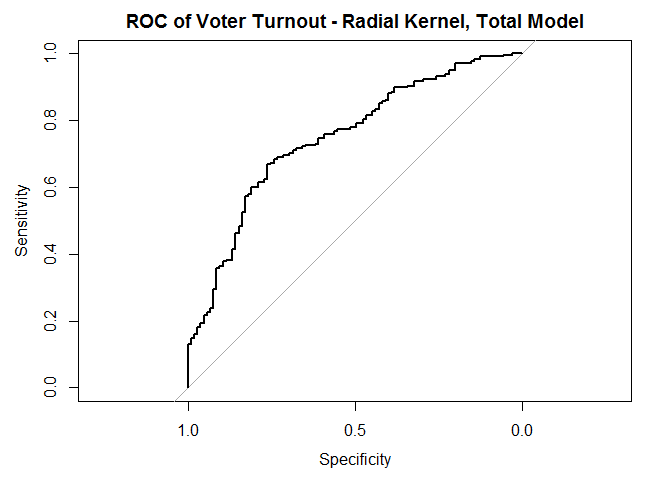 Area under the curve: 0.7466

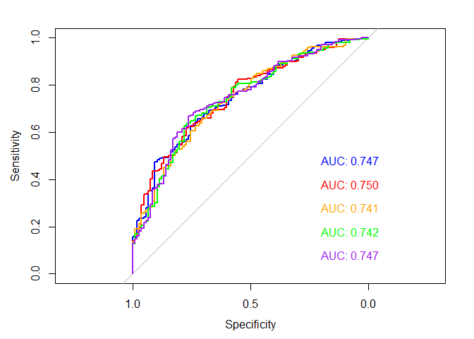

Looking at the area under the curve, the best model is the linear one with all the variables. Its error however is high, This model has a cost of 1, so the margins are narrow around the linear hyperplane. As we can see from the plot below, the error hovers around 0.32 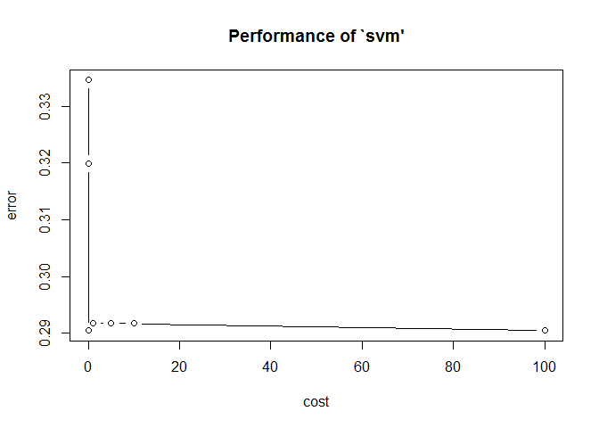 \# Part 3: OJ Simpson

#### What is the relationship between race and belief of OJ Simpson's guilt? Develop a robust statistical learning model and use this model to explain the impact of an individual's race on their beliefs about OJ Simpson's guilt.

Starting off with linear regression just to get a basic idea, it is seen that the variable black is highly significant in predicting the belief in Simpson's guilt.Dealing with the non-binary variables: age, educationand income, age can be significant but its not substantive, education and income seem to be significant which is intuitive since education and income are often influenced by race.

    ## 
    ## Call:
    ## lm(formula = guilt ~ age, data = oj)
    ## 
    ## Residuals:
    ##     Min      1Q  Median      3Q     Max 
    ## -0.8814 -0.6235  0.2740  0.3376  0.4047 
    ## 
    ## Coefficients:
    ##              Estimate Std. Error t value Pr(>|t|)    
    ## (Intercept) 0.5316786  0.0335835  15.832  < 2e-16 ***
    ## age         0.0035330  0.0007077   4.992 6.71e-07 ***
    ## ---
    ## Signif. codes:  0 '***' 0.001 '**' 0.01 '*' 0.05 '.' 0.1 ' ' 1
    ## 
    ## Residual standard error: 0.4597 on 1414 degrees of freedom
    ## Multiple R-squared:  0.01732,    Adjusted R-squared:  0.01663 
    ## F-statistic: 24.92 on 1 and 1414 DF,  p-value: 6.709e-07

    ## 
    ## Call:
    ## lm(formula = guilt ~ income, data = oj)
    ## 
    ## Residuals:
    ##     Min      1Q  Median      3Q     Max 
    ## -0.8688 -0.5569  0.2190  0.3503  0.4794 
    ## 
    ## Coefficients:
    ##                         Estimate Std. Error t value Pr(>|t|)    
    ## (Intercept)              0.64972    0.02417  26.883  < 2e-16 ***
    ## income$30,000-$50,000    0.03612    0.03227   1.119 0.263208    
    ## income$50,000-$75,000    0.13123    0.03961   3.313 0.000945 ***
    ## incomeOVER $75,000       0.21903    0.04332   5.056 4.83e-07 ***
    ## incomeREFUSED/NO ANSWER -0.12917    0.05845  -2.210 0.027276 *  
    ## incomeUNDER $15,000     -0.09283    0.04269  -2.175 0.029823 *  
    ## ---
    ## Signif. codes:  0 '***' 0.001 '**' 0.01 '*' 0.05 '.' 0.1 ' ' 1
    ## 
    ## Residual standard error: 0.4547 on 1410 degrees of freedom
    ## Multiple R-squared:  0.04105,    Adjusted R-squared:  0.03765 
    ## F-statistic: 12.07 on 5 and 1410 DF,  p-value: 1.809e-11

    ## 
    ## Call:
    ## lm(formula = guilt ~ educ, data = oj)
    ## 
    ## Residuals:
    ##     Min      1Q  Median      3Q     Max 
    ## -0.7964 -0.6409  0.2036  0.3591  0.4720 
    ## 
    ## Coefficients:
    ##                                     Estimate Std. Error t value Pr(>|t|)
    ## (Intercept)                          0.79638    0.02172  36.669  < 2e-16
    ## educHIGH SCHOOL GRAD                -0.15546    0.03012  -5.162 2.79e-07
    ## educNOT A HIGH SCHOOL GRAD          -0.26838    0.04626  -5.802 8.07e-09
    ## educREFUSED                          0.20362    0.26451   0.770    0.442
    ## educSOME COLLEGE(TRADE OR BUSINESS) -0.12608    0.03225  -3.910 9.67e-05
    ##                                        
    ## (Intercept)                         ***
    ## educHIGH SCHOOL GRAD                ***
    ## educNOT A HIGH SCHOOL GRAD          ***
    ## educREFUSED                            
    ## educSOME COLLEGE(TRADE OR BUSINESS) ***
    ## ---
    ## Signif. codes:  0 '***' 0.001 '**' 0.01 '*' 0.05 '.' 0.1 ' ' 1
    ## 
    ## Residual standard error: 0.4566 on 1411 degrees of freedom
    ## Multiple R-squared:  0.03243,    Adjusted R-squared:  0.02969 
    ## F-statistic: 11.82 on 4 and 1411 DF,  p-value: 1.888e-09

    ## 
    ## Call:
    ## lm(formula = guilt ~ dem + rep + black + hispanic + female, data = oj)
    ## 
    ## Residuals:
    ##     Min      1Q  Median      3Q     Max 
    ## -0.8864 -0.1365  0.1717  0.2150  0.9001 
    ## 
    ## Coefficients:
    ##             Estimate Std. Error t value Pr(>|t|)    
    ## (Intercept)  0.78495    0.03322  23.630  < 2e-16 ***
    ## dem          0.03660    0.03422   1.069  0.28503    
    ## rep          0.10147    0.03495   2.903  0.00375 ** 
    ## black       -0.62695    0.02726 -22.995  < 2e-16 ***
    ## hispanic    -0.05501    0.04062  -1.354  0.17590    
    ## female      -0.05812    0.02085  -2.787  0.00538 ** 
    ## ---
    ## Signif. codes:  0 '***' 0.001 '**' 0.01 '*' 0.05 '.' 0.1 ' ' 1
    ## 
    ## Residual standard error: 0.3852 on 1410 degrees of freedom
    ## Multiple R-squared:  0.312,  Adjusted R-squared:  0.3096 
    ## F-statistic: 127.9 on 5 and 1410 DF,  p-value: < 2.2e-16

    ##          term    estimate  std.error  statistic       p.value
    ## 1 (Intercept)  0.78495083 0.03321771  23.630490 2.815886e-104
    ## 2         dem  0.03659985 0.03422151   1.069498  2.850282e-01
    ## 3         rep  0.10146704 0.03494954   2.903244  3.750656e-03
    ## 4       black -0.62695090 0.02726455 -22.995096  1.262703e-99
    ## 5    hispanic -0.05500863 0.04062158  -1.354172  1.758984e-01
    ## 6      female -0.05811636 0.02084963  -2.787405  5.384502e-03

    ## 
    ## Call:
    ## lm(formula = guilt ~ black + hispanic, data = oj)
    ## 
    ## Residuals:
    ##     Min      1Q  Median      3Q     Max 
    ## -0.8149 -0.1647  0.1851  0.1851  0.9002 
    ## 
    ## Coefficients:
    ##             Estimate Std. Error t value Pr(>|t|)    
    ## (Intercept)  0.81490    0.01180   69.05   <2e-16 ***
    ## black       -0.65021    0.02634  -24.68   <2e-16 ***
    ## hispanic    -0.06487    0.04079   -1.59    0.112    
    ## ---
    ## Signif. codes:  0 '***' 0.001 '**' 0.01 '*' 0.05 '.' 0.1 ' ' 1
    ## 
    ## Residual standard error: 0.3876 on 1413 degrees of freedom
    ## Multiple R-squared:  0.3016, Adjusted R-squared:  0.3006 
    ## F-statistic: 305.1 on 2 and 1413 DF,  p-value: < 2.2e-16

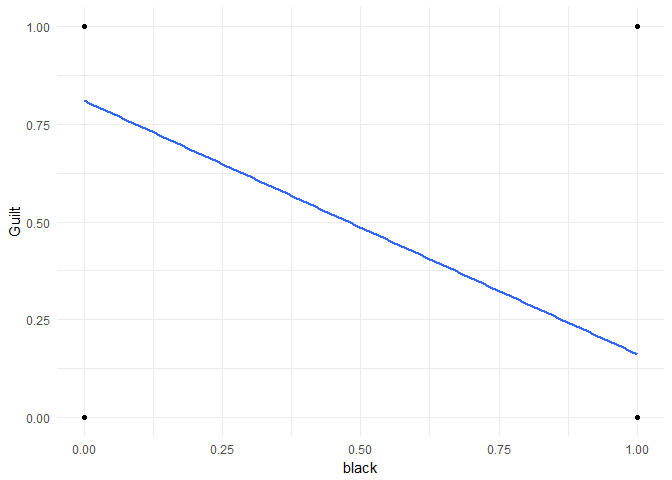 Plotting moddels considering the variables, we find it is safe to not consider the factors other than black and hispanic for estimation purposes. 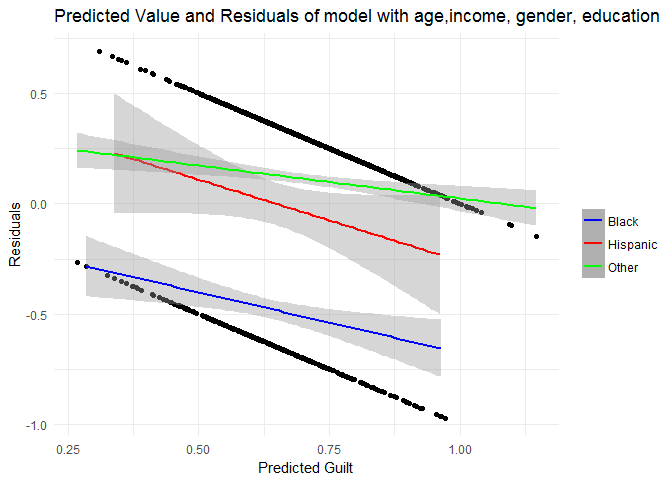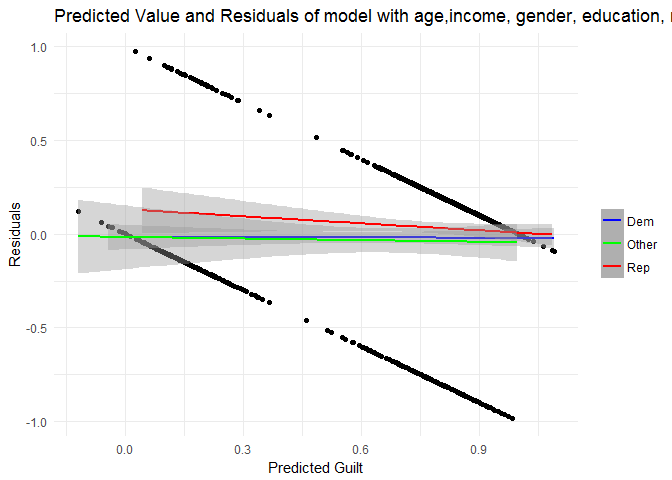 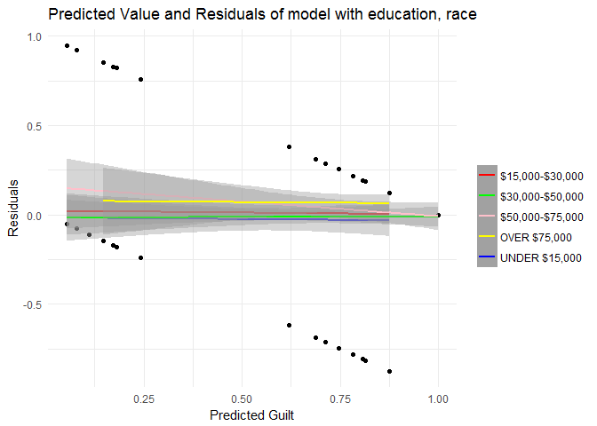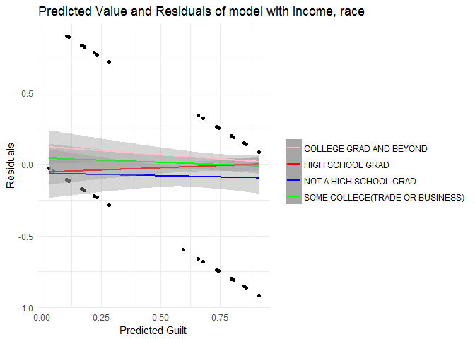 Concentrating on race: 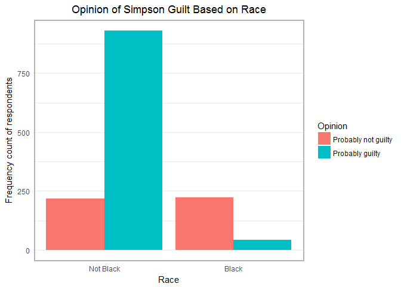 High proportion of non-black people believe OJ Simpson to be guilty. Considering a logistic regression, since we are using dichotomous variables to predict a dichotomous outcome (belief or no-belief in guilt), it seems to be the most logical choice.

    ## 
    ## Call:
    ## glm(formula = guilt ~ black, family = binomial, data = oj)
    ## 
    ## Deviance Residuals: 
    ##     Min       1Q   Median       3Q      Max  
    ## -1.8233  -0.5926   0.6487   0.6487   1.9110  
    ## 
    ## Coefficients:
    ##             Estimate Std. Error z value Pr(>|z|)    
    ## (Intercept)  1.45176    0.07524   19.30   <2e-16 ***
    ## black       -3.10221    0.18271  -16.98   <2e-16 ***
    ## ---
    ## Signif. codes:  0 '***' 0.001 '**' 0.01 '*' 0.05 '.' 0.1 ' ' 1
    ## 
    ## (Dispersion parameter for binomial family taken to be 1)
    ## 
    ##     Null deviance: 1758.1  on 1415  degrees of freedom
    ## Residual deviance: 1352.2  on 1414  degrees of freedom
    ## AIC: 1356.2
    ## 
    ## Number of Fisher Scoring iterations: 4

    ## 
    ## Call:
    ## glm(formula = guilt ~ hispanic, family = binomial, data = oj)
    ## 
    ## Deviance Residuals: 
    ##     Min       1Q   Median       3Q      Max  
    ## -1.5319  -1.5319   0.8603   0.8603   0.9291  
    ## 
    ## Coefficients:
    ##             Estimate Std. Error z value Pr(>|z|)    
    ## (Intercept)  0.80328    0.05957  13.484   <2e-16 ***
    ## hispanic    -0.18650    0.22098  -0.844    0.399    
    ## ---
    ## Signif. codes:  0 '***' 0.001 '**' 0.01 '*' 0.05 '.' 0.1 ' ' 1
    ## 
    ## (Dispersion parameter for binomial family taken to be 1)
    ## 
    ##     Null deviance: 1758.1  on 1415  degrees of freedom
    ## Residual deviance: 1757.4  on 1414  degrees of freedom
    ## AIC: 1761.4
    ## 
    ## Number of Fisher Scoring iterations: 4

    ## 
    ## Call:
    ## glm(formula = guilt ~ black + hispanic, family = binomial, data = oj)
    ## 
    ## Deviance Residuals: 
    ##     Min       1Q   Median       3Q      Max  
    ## -1.8374  -0.5980   0.6394   0.6394   2.0758  
    ## 
    ## Coefficients:
    ##             Estimate Std. Error z value Pr(>|z|)    
    ## (Intercept)  1.48367    0.07853  18.892   <2e-16 ***
    ## black       -3.11438    0.18316 -17.003   <2e-16 ***
    ## hispanic    -0.40056    0.25315  -1.582    0.114    
    ## ---
    ## Signif. codes:  0 '***' 0.001 '**' 0.01 '*' 0.05 '.' 0.1 ' ' 1
    ## 
    ## (Dispersion parameter for binomial family taken to be 1)
    ## 
    ##     Null deviance: 1758.1  on 1415  degrees of freedom
    ## Residual deviance: 1349.8  on 1413  degrees of freedom
    ## AIC: 1355.8
    ## 
    ## Number of Fisher Scoring iterations: 4

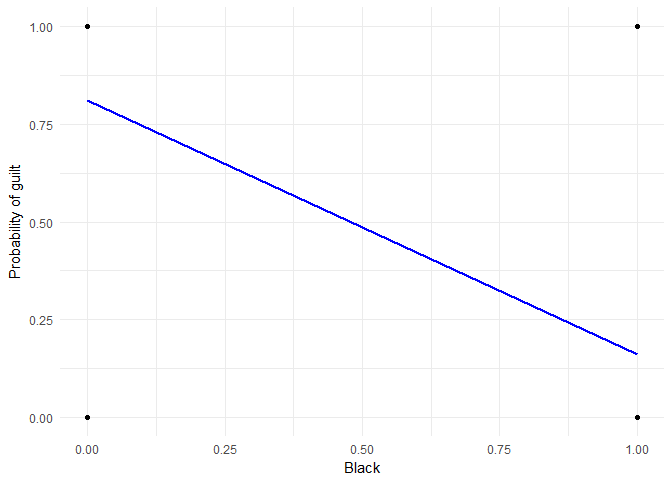

    ## [1] 81.5678

    ## [1] 68.78531

    ## [1] 81.5678

    ## [1] 40.95023

    ## [1] 0

    ## [1] 40.95023

    ## Area under the curve: 0.7313

    ## Area under the curve: 0.5061

    ## Area under the curve: 0.7397

The model with both black and hispanic as factors have the highest area under the curve but it is only marginally more than the one with only black in it. Also, there is no significant error reduction from black only to black + hispanic model. Beingblack reduces the log-odds of an individuals belief in OJ's guilt by -3.1022, i.e.,it lowers likelihood of believing in OJ's guilt.

Race is a highly dominant factor, so using a decision tree makes sense. It is also easy to interpret. 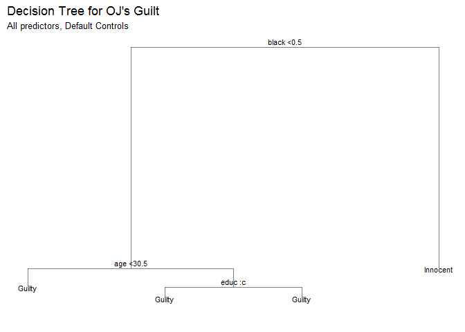 The decision tree clearly shows that being black is the single most important predictor of belief in Simpson's guilt. Using the Random forest approach with all variables,

    ## 
    ## Call:
    ##  randomForest(formula = Opinion ~ ., data = oj_data_train, mtry = 3,      ntree = 2000) 
    ##                Type of random forest: classification
    ##                      Number of trees: 2000
    ## No. of variables tried at each split: 3
    ## 
    ##         OOB estimate of  error rate: 19.56%
    ## Confusion matrix:
    ##          Innocent Guilty class.error
    ## Innocent      161    149   0.4806452
    ## Guilty         45    637   0.0659824

The error rate is only 19.1%which is pretty good. This is comparable to the values from using logistic regression too (Logistic regression makes most sense in this classification problem). Validating our belief in race to be a guiding factor: 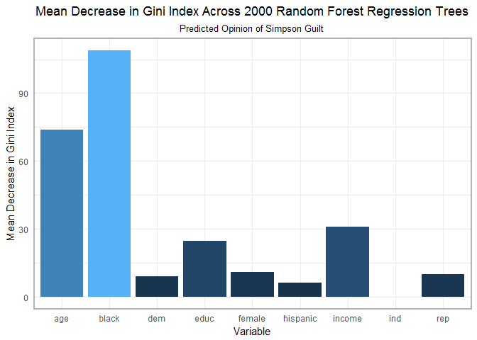 it yields the highest decrease in Gini Index.

Using linear SVM with all variables

    ## 
    ## Parameter tuning of 'svm':
    ## 
    ## - sampling method: 10-fold cross validation 
    ## 
    ## - best parameters:
    ##  cost
    ##  0.01
    ## 
    ## - best performance: 0.1844343 
    ## 
    ## - Detailed performance results:
    ##    cost     error dispersion
    ## 1 1e-03 0.3125455 0.04260242
    ## 2 1e-02 0.1844343 0.03901566
    ## 3 1e-01 0.1844343 0.03901566
    ## 4 1e+00 0.1844343 0.03901566
    ## 5 5e+00 0.1844343 0.03901566
    ## 6 1e+01 0.1844343 0.03901566
    ## 7 1e+02 0.1844343 0.03901566

    ## 
    ## Call:
    ## best.tune(method = svm, train.x = Opinion ~ ., data = na.omit(as_tibble(oj_data_train)), 
    ##     ranges = list(cost = c(0.001, 0.01, 0.1, 1, 5, 10, 100)), 
    ##     kernel = "linear")
    ## 
    ## 
    ## Parameters:
    ##    SVM-Type:  C-classification 
    ##  SVM-Kernel:  linear 
    ##        cost:  0.01 
    ##       gamma:  0.05882353 
    ## 
    ## Number of Support Vectors:  637
    ## 
    ##  ( 327 310 )
    ## 
    ## 
    ## Number of Classes:  2 
    ## 
    ## Levels: 
    ##  Innocent Guilty

    ## 
    ## Call:
    ## best.tune(method = svm, train.x = Opinion ~ ., data = na.omit(as_tibble(oj_data_train)), 
    ##     ranges = list(cost = c(0.001, 0.01, 0.1, 1, 5, 10, 100)), 
    ##     kernel = "linear")
    ## 
    ## 
    ## Parameters:
    ##    SVM-Type:  C-classification 
    ##  SVM-Kernel:  linear 
    ##        cost:  0.01 
    ##       gamma:  0.05882353 
    ## 
    ## Number of Support Vectors:  637
    ## 
    ##  ( 327 310 )
    ## 
    ## 
    ## Number of Classes:  2 
    ## 
    ## Levels: 
    ##  Innocent Guilty

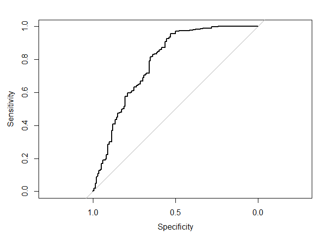

    ## Area under the curve: 0.7841

Area under the curve: 0.7841. So, it doesnt better our accuracy from Random Forest. Cross validation using logistic regression with black being the only variable and random forest with all variables both seem to be good approaches, but I would choose random forest as the better one as it will lead to better results for different seeds. We know from previous work that the cross-validation (70:30) split becomes highly dictated by set composition.
