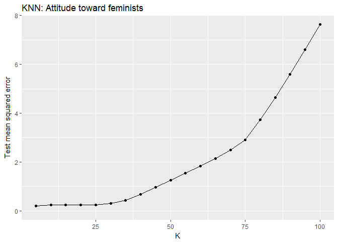
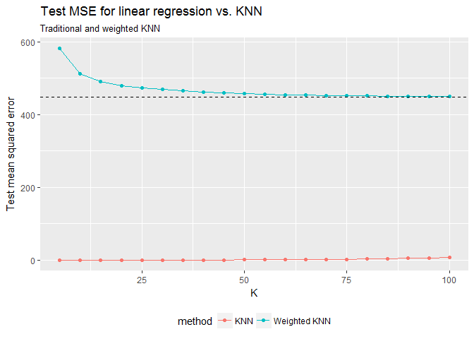
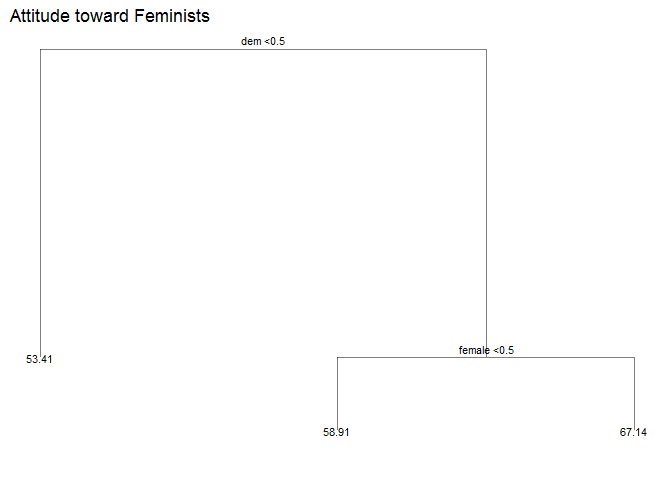
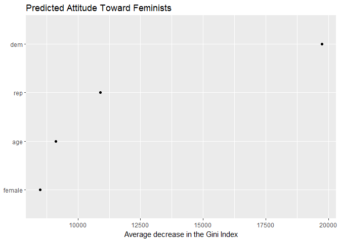
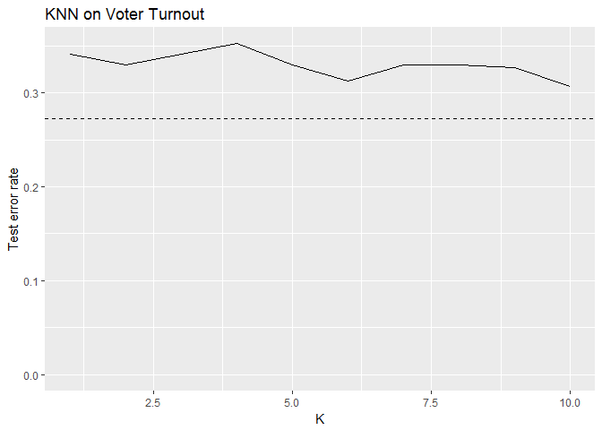

PS 9
================
Esha Banerjee
12 March 2017

``` r
library(tidyverse)
library(forcats)
library(broom)
library(modelr)
library(stringr)
library(rcfss)
library(pROC)
library(grid)
library(gridExtra)
library(FNN)
library(kknn)
library(tree)
library(e1071)
library(ggdendro)
library(randomForest)
library(gbm)
library(pander)
library(knitr)
```

``` r
fm = read_csv('feminist.csv')
mh = read_csv('mental_health.csv')
clg = read_csv('College.csv')
usa = read_csv('USArrests.csv')
```

Attitudes towards feminists
===========================

#### Split the data into a training and test set (70/30%).

``` r
fm<-fm %>%
  na.omit()
fm_split <- resample_partition(fm, c(test = 0.3, train = 0.7))
fm_train <- as_tibble(fm_split$train)
fm_test <- as_tibble(fm_split$test)
```

#### Calculate the test MSE for KNN models with *K* = 5, 10, 15, …, 100, using whatever combination of variables you see fit. Which model produces the lowest test MSE?

``` r
mse <- function(model, data) {
  x <- modelr:::residuals(model, data)
  mean(x ^ 2, na.rm = TRUE)
}

mse_lm <- lm(feminist ~ female + age + dem + rep, data = fm_train) %>%
  mse(.,fm_test)
mse_lm
```

    ## [1] 447

``` r
mse_knn <- data_frame(k = seq(5, 100, by = 5), 
                      knn = map(k, ~ knn.reg(select(fm_train, -age, -female, -dem, -rep), y = fm_train$feminist, test = select(fm_test, -age, -female, -dem, -rep), k = .)), 
                      mse = map_dbl(knn, ~ mean((fm_test$feminist - .$pred)^2))) 


ggplot(mse_knn, aes(k, mse)) +
  geom_line() +
  geom_point() +
  labs(title = "KNN: Attitude toward feminists",
       x = "K",
       y = "Test mean squared error") +
  expand_limits(y = 0)
```



``` r
knn_mse_fem<-min(mse_knn$mse)
knn_mse_fem
```

    ## [1] 0.199

MSE is lowest for the model with the variables age, female, dem, rep & K = 5.

#### Calculate the test MSE for weighted KNN models with *K* = 5, 10, 15, …, 100 using the same combination of variables as before. Which model produces the lowest test MSE?

``` r
mse_knn_w <- data_frame(k = seq(5, 100, by = 5), 
                      wknn = map(k, ~ kknn(feminist ~ age + educ + female + income + dem + rep, train = fm_train, test = fm_test, k = .)), 
                      mse_wknn = map_dbl(wknn, ~ mean((fm_test$feminist - .$fitted.values)^2))) %>%
  left_join(mse_knn, by = "k") %>%
  mutate(mse_knn = mse)%>%
  select (k, mse_knn, mse_wknn) %>%
  gather(method,mse, -k) %>%
  mutate(method = str_replace(method, "mse_", ""))%>%
  mutate(method = factor (method, levels = c("knn","wknn"), labels = c("KNN","Weighted KNN")))


mse_knn_w %>%
  ggplot(aes(k, mse, color = method)) +
  geom_line() +
  geom_point() +
  geom_hline(yintercept = mse_lm, linetype = 2) +
  labs(title = "Test MSE for linear regression vs. KNN",
       subtitle = "Traditional and weighted KNN",
       x = "K",
       y = "Test mean squared error",
       method = NULL) +
  expand_limits(y = 0) +
  theme(legend.position = "bottom")
```

 Traditional KNN with K = 5 gives lowest MSE.

#### Compare the test MSE for the best KNN/wKNN model(s) to the test MSE for the equivalent linear regression, decision tree, boosting, and random forest methods using the same combination of variables as before. Which performs the best? Why do you think this method performed the best, given your knowledge of how it works?

``` r
set.seed(111)
# Decision tree
tree <- tree(feminist ~ female + age + dem + rep, data = fm_train)
tree_data <- dendro_data(tree)

ggplot(segment(tree_data)) +
  geom_segment(aes(x = x, y = y, xend = xend, yend = yend), alpha = 0.5) +
  geom_text(data = label(tree_data), aes(x = x, y = y, label = label_full), vjust = -0.5, size = 3) +
  geom_text(data = leaf_label(tree_data), aes(x = x, y = y, label = label), vjust = 0.5, size = 3) +
  theme_dendro() +
  labs(title = "Attitude toward Feminists")
```



``` r
mse_tree <- mse(tree, fm_test)
mse_tree
```

    ## [1] 456

``` r
#RF
rf<- randomForest(feminist ~ female + age + dem + rep, data = fm_train, ntree = 500)

data_frame(var = rownames(importance(rf)),
           MeanDecreaseRSS = importance(rf)[,1]) %>%
  mutate(var = fct_reorder(var, MeanDecreaseRSS, fun = median)) %>%
  ggplot(aes(var, MeanDecreaseRSS)) +
  geom_point() +
  coord_flip() +
  labs(title = "Predicting Feminist Attitude Score",
       subtitle = "Random Forest",
       x = NULL,
       y = "Average decrease in the Gini Index")
```



``` r
mse_rf <- mse(rf, fm_test)
mse_rf
```

    ## [1] 445

``` r
set.seed(111)
feminist_models <- list("boosting_depth1" = gbm(as.numeric(feminist) - 1 ~ female + age + dem + rep,
                                               data = fm_train,
                                               n.trees = 10000, interaction.depth = 1),
                       "boosting_depth2" = gbm(as.numeric(feminist) - 1 ~ female + age + dem + rep,
                                               data = fm_train,
                                               n.trees = 10000, interaction.depth = 2),
                       "boosting_depth4" = gbm(as.numeric(feminist) - 1 ~ female + age + dem + rep,
                                               data = fm_train,
                                               n.trees = 10000, interaction.depth = 4))
```

    ## Distribution not specified, assuming gaussian ...
    ## Distribution not specified, assuming gaussian ...
    ## Distribution not specified, assuming gaussian ...

``` r
data_frame(depth = c(1, 2, 4),
           model = feminist_models[c("boosting_depth1", "boosting_depth2", "boosting_depth4")],
           optimal = map_dbl(model, gbm.perf, plot.it = FALSE)) %>%
  select(-model) %>%
  kable(caption = "Optimal number of boosting iterations",
               col.names = c("Depth", "Optimal number of iterations"))
```

    ## Using OOB method...
    ## Using OOB method...
    ## Using OOB method...

|  Depth|  Optimal number of iterations|
|------:|-----------------------------:|
|      1|                          2352|
|      2|                          1693|
|      4|                          1308|

``` r
predict.gbm <- function (object, newdata, n.trees, type = "link", single.tree = FALSE, ...) {
  if (missing(n.trees)) {
    if (object$train.fraction < 1) {
      n.trees <- gbm.perf(object, method = "test", plot.it = FALSE)
    }
    else if (!is.null(object$cv.error)) {
      n.trees <- gbm.perf(object, method = "cv", plot.it = FALSE)
    }
    else {
      n.trees <- length(object$train.error)
    }
    cat(paste("Using", n.trees, "trees...\n"))
    gbm::predict.gbm(object, newdata, n.trees, type, single.tree, ...)
  }
}
```

Colleges
========

#### Perform PCA analysis on the college dataset and plot the first two principal components. Describe the results. What variables appear strongly correlated on the first principal component? What about the second principal component?

``` r
# convert the private to a numeric variable
c <- clg %>%
  mutate(Private = ifelse (Private =="Yes",1,0 ) )
# However, it seems the vector of Private does associate any major clusters, I ignore it. 


pr.out <- prcomp(c, scale = TRUE)
biplot(pr.out, scale = 0, cex = .6)
```


``` r
pr.out <- prcomp(clg[,2:18], scale = TRUE)

pr.out$rotation
```

    ##                 PC1     PC2     PC3     PC4      PC5      PC6     PC7
    ## Apps         0.2488 -0.3316  0.0631 -0.2813 -0.00574 -0.01624 -0.0425
    ## Accept       0.2076 -0.3721  0.1012 -0.2678 -0.05579  0.00753 -0.0129
    ## Enroll       0.1763 -0.4037  0.0830 -0.1618  0.05569 -0.04256 -0.0277
    ## Top10perc    0.3543  0.0824 -0.0351  0.0515  0.39543 -0.05269 -0.1613
    ## Top25perc    0.3440  0.0448  0.0241  0.1098  0.42653  0.03309 -0.1185
    ## F.Undergrad  0.1546 -0.4177  0.0614 -0.1004  0.04345 -0.04345 -0.0251
    ## P.Undergrad  0.0264 -0.3151 -0.1397  0.1586 -0.30239 -0.19120  0.0610
    ## Outstate     0.2947  0.2496 -0.0466 -0.1313 -0.22253 -0.03000  0.1085
    ## Room.Board   0.2490  0.1378 -0.1490 -0.1850 -0.56092  0.16276  0.2097
    ## Books        0.0648 -0.0563 -0.6774 -0.0871  0.12729  0.64105 -0.1497
    ## Personal    -0.0425 -0.2199 -0.4997  0.2307  0.22231 -0.33140  0.6338
    ## PhD          0.3183 -0.0583  0.1270  0.5347 -0.14017  0.09126 -0.0011
    ## Terminal     0.3171 -0.0464  0.0660  0.5194 -0.20472  0.15493 -0.0285
    ## S.F.Ratio   -0.1770 -0.2467  0.2898  0.1612  0.07939  0.48705  0.2193
    ## perc.alumni  0.2051  0.2466  0.1470 -0.0173  0.21630 -0.04734  0.2433
    ## Expend       0.3189  0.1317 -0.2267 -0.0793 -0.07596 -0.29812 -0.2266
    ## Grad.Rate    0.2523  0.1692  0.2081 -0.2691  0.10927  0.21616  0.5599
    ##                  PC8      PC9    PC10    PC11    PC12     PC13    PC14
    ## Apps         0.10309 -0.09023 -0.0525  0.0430 -0.0241  0.59583  0.0806
    ## Accept       0.05627 -0.17786 -0.0411 -0.0584  0.1451  0.29264  0.0335
    ## Enroll      -0.05866 -0.12856 -0.0345 -0.0694 -0.0111 -0.44464 -0.0857
    ## Top10perc    0.12268  0.34110 -0.0640 -0.0081 -0.0386  0.00102 -0.1078
    ## Top25perc    0.10249  0.40371 -0.0145 -0.2731  0.0894  0.02188  0.1517
    ## F.Undergrad -0.07889 -0.05944 -0.0208 -0.0812 -0.0562 -0.52362 -0.0564
    ## P.Undergrad -0.57078  0.56067  0.2231  0.1007  0.0635  0.12600  0.0193
    ## Outstate    -0.00985 -0.00457 -0.1867  0.1432  0.8234 -0.14186 -0.0340
    ## Room.Board   0.22145  0.27502 -0.2983 -0.3593 -0.3546 -0.06975 -0.0584
    ## Books       -0.21329 -0.13366  0.0820  0.0319  0.0282  0.01144 -0.0668
    ## Personal     0.23266 -0.09447 -0.1360 -0.0186  0.0393  0.03945  0.0275
    ## PhD          0.07704 -0.18518  0.1235  0.0404 -0.0232  0.12770 -0.6911
    ## Terminal     0.01216 -0.25494  0.0886 -0.0590 -0.0165 -0.05831  0.6710
    ## S.F.Ratio    0.08360  0.27454 -0.4720  0.4450  0.0110 -0.01772  0.0414
    ## perc.alumni -0.67852 -0.25533 -0.4230 -0.1307 -0.1827  0.10409 -0.0272
    ## Expend       0.05416 -0.04914 -0.1323  0.6921 -0.3260 -0.09375  0.0731
    ## Grad.Rate    0.00534  0.04190  0.5903  0.2198 -0.1221 -0.06920  0.0365
    ##                 PC15     PC16      PC17
    ## Apps        -0.13341 -0.45914 -0.358970
    ## Accept       0.14550  0.51857  0.543427
    ## Enroll      -0.02959  0.40432 -0.609651
    ## Top10perc   -0.69772  0.14874  0.144986
    ## Top25perc    0.61727 -0.05187 -0.080348
    ## F.Undergrad -0.00992 -0.56036  0.414705
    ## P.Undergrad -0.02095  0.05273 -0.009018
    ## Outstate    -0.03835 -0.10159 -0.050900
    ## Room.Board  -0.00340  0.02593 -0.001146
    ## Books        0.00944 -0.00288 -0.000773
    ## Personal     0.00309  0.01289  0.001114
    ## PhD          0.11206 -0.02981 -0.013813
    ## Terminal    -0.15891  0.02708 -0.006209
    ## S.F.Ratio    0.02090  0.02125  0.002222
    ## perc.alumni  0.00842 -0.00333  0.019187
    ## Expend       0.22774  0.04388  0.035310
    ## Grad.Rate    0.00339  0.00501  0.013071

``` r
biplot(pr.out, scale = 0, cex = .8, xlabs=rep(".", nrow(clg)))
```


