PS 9
================
Esha Banerjee
12 March 2017

``` r
library(tidyverse)
library(forcats)
library(broom)
library(modelr)
library(stringr)
library(rcfss)
library(pROC)
library(grid)
library(gridExtra)
library(FNN)
library(kknn)
library(tree)
library(e1071)
library(ggdendro)
library(randomForest)
library(gbm)
library(pander)
library(knitr)
```

``` r
fm = read_csv('feminist.csv')
mh = read_csv('mental_health.csv')
clg = read_csv('College.csv')
arrests = read_csv('USArrests.csv')
```

Attitudes towards feminists
===========================

#### Split the data into a training and test set (70/30%).

``` r
fm<-fm %>%
  na.omit()
fm_split <- resample_partition(fm, c(test = 0.3, train = 0.7))
fm_train <- as_tibble(fm_split$train)
fm_test <- as_tibble(fm_split$test)
```

#### Calculate the test MSE for KNN models with *K* = 5, 10, 15, …, 100, using whatever combination of variables you see fit. Which model produces the lowest test MSE?

``` r
mse <- function(model, data) {
  x <- modelr:::residuals(model, data)
  mean(x ^ 2, na.rm = TRUE)
}

mse_lm <- lm(feminist ~ female + age + dem + rep, data = fm_train) %>%
  mse(.,fm_test)
mse_lm
```

    ## [1] 447.1426

``` r
mse_knn <- data_frame(k = seq(5, 100, by = 5), 
                      knn = map(k, ~ knn.reg(select(fm_train, -feminist, -educ, -income ), y = fm_train$feminist, test = select(fm_test, -feminist, -educ, -income), k = .)), 
                      mse = map_dbl(knn, ~ mean((fm_test$feminist - .$pred)^2))) 


ggplot(mse_knn, aes(k, mse)) +
  geom_line() +
  geom_point() +
  labs(title = "KNN: Attitude toward feminists",
       x = "K",
       y = "Test mean squared error") +
  expand_limits(y = 0)
```


``` r
knn_mse_fem<-min(mse_knn$mse)
knn_mse_fem
```

    ## [1] 463.1369

MSE is lowest for the model with the variables age, female, dem, rep & K = 5.

#### Calculate the test MSE for weighted KNN models with *K* = 5, 10, 15, …, 100 using the same combination of variables as before. Which model produces the lowest test MSE?

``` r
mse_knn_w <- data_frame(k = seq(5, 100, by = 5), 
                      wknn = map(k, ~ kknn(feminist ~ age + female  + dem + rep, train = fm_train, test = fm_test, k = .)), 
                      mse_wknn = map_dbl(wknn, ~ mean((fm_test$feminist - .$fitted.values)^2))) %>%
  left_join(mse_knn, by = "k") %>%
  mutate(mse_knn = mse)%>%
  select (k, mse_knn, mse_wknn) %>%
  gather(method,mse, -k) %>%
  mutate(method = str_replace(method, "mse_", ""))%>%
  mutate(method = factor (method, levels = c("knn","wknn"), labels = c("KNN","Weighted KNN")))


mse_knn_w %>%
  ggplot(aes(k, mse, color = method)) +
  geom_line() +
  geom_point() +
  geom_hline(yintercept = mse_lm, linetype = 2) +
  labs(title = "Test MSE for linear regression vs. KNN",
       subtitle = "Traditional and weighted KNN",
       x = "K",
       y = "Test mean squared error",
       method = NULL) +
  expand_limits(y = 0) +
  theme(legend.position = "bottom")
```

 Traditional KNN with K = 5 gives lowest MSE.

#### Compare the test MSE for the best KNN/wKNN model(s) to the test MSE for the equivalent linear regression, decision tree, boosting, and random forest methods using the same combination of variables as before. Which performs the best? Why do you think this method performed the best, given your knowledge of how it works?

``` r
set.seed(111)
# Decision tree
tree <- tree(feminist ~ female + age + dem + rep, data = fm_train)
tree_data <- dendro_data(tree)

ggplot(segment(tree_data)) +
  geom_segment(aes(x = x, y = y, xend = xend, yend = yend), alpha = 0.5) +
  geom_text(data = label(tree_data), aes(x = x, y = y, label = label_full), vjust = -0.5, size = 3) +
  geom_text(data = leaf_label(tree_data), aes(x = x, y = y, label = label), vjust = 0.5, size = 3) +
  theme_dendro() +
  labs(title = "Attitude toward Feminists")
```


``` r
mse_tree <- mse(tree, fm_test)
mse_tree
```

    ## [1] 456.2566

``` r
#RF
rf<- randomForest(feminist ~ female + age + dem + rep, data = fm_train, ntree = 500)

data_frame(var = rownames(importance(rf)),
           MeanDecreaseRSS = importance(rf)[,1]) %>%
  mutate(var = fct_reorder(var, MeanDecreaseRSS, fun = median)) %>%
  ggplot(aes(var, MeanDecreaseRSS)) +
  geom_point() +
  coord_flip() +
  labs(title = "Predicted Attitude Toward Feminists",
       x = NULL,
       y = "Average decrease in the Gini Index")
```


``` r
mse_rf <- mse(rf, fm_test)
mse_rf
```

    ## [1] 445.3172

``` r
set.seed(111)
# Boosting
feminist_models <- list("boosting_depth1" = gbm(as.numeric(feminist) - 1 ~ female + age + dem + rep,
                                               data = fm_train,
                                               n.trees = 10000, interaction.depth = 1),
                       "boosting_depth2" = gbm(as.numeric(feminist) - 1 ~ female + age + dem + rep,
                                               data = fm_train,
                                               n.trees = 10000, interaction.depth = 2),
                       "boosting_depth4" = gbm(as.numeric(feminist) - 1 ~ female + age + dem + rep,
                                               data = fm_train,
                                               n.trees = 10000, interaction.depth = 4))
```

    ## Distribution not specified, assuming gaussian ...
    ## Distribution not specified, assuming gaussian ...
    ## Distribution not specified, assuming gaussian ...

``` r
data_frame(depth = c(1, 2, 4),
           model = feminist_models[c("boosting_depth1", "boosting_depth2", "boosting_depth4")],
           optimal = map_dbl(model, gbm.perf, plot.it = FALSE)) %>%
  select(-model) %>%
  kable(caption = "Optimal number of boosting iterations",
               col.names = c("Depth", "Optimal number of iterations"))
```

    ## Using OOB method...
    ## Using OOB method...
    ## Using OOB method...

|  Depth|  Optimal number of iterations|
|------:|-----------------------------:|
|      1|                          2352|
|      2|                          1693|
|      4|                          1308|

``` r
predict.gbm <- function (object, newdata, n.trees, type = "link", single.tree = FALSE, ...) {
  if (missing(n.trees)) {
    if (object$train.fraction < 1) {
      n.trees <- gbm.perf(object, method = "test", plot.it = FALSE)
    }
    else if (!is.null(object$cv.error)) {
      n.trees <- gbm.perf(object, method = "cv", plot.it = FALSE)
    }
    else {
      n.trees <- length(object$train.error)
    }
    cat(paste("Using", n.trees, "trees...\n"))
    gbm::predict.gbm(object, newdata, n.trees, type, single.tree, ...)
  }
}

fm_boost_1 = gbm(as.numeric(feminist) - 1 ~ .,
                                               data = fm_train,
                                               n.trees = 2352, interaction.depth = 1)
```

    ## Distribution not specified, assuming gaussian ...

``` r
fm_boost_2 = gbm(as.numeric(feminist) - 1 ~ .,
                                               data = fm_train,
                                               n.trees = 1693, interaction.depth = 2)
```

    ## Distribution not specified, assuming gaussian ...

``` r
fm_boost_4 = gbm(as.numeric(feminist) - 1 ~ .,
                                               data = fm_train,
                                               n.trees = 1308, interaction.depth = 4)
```

    ## Distribution not specified, assuming gaussian ...

``` r
mse_1 = mse(fm_boost_1,fm_test)
```

    ## Using 2352 trees...

``` r
mse_1
```

    ## [1] 446.4609

``` r
mse_2 = mse(fm_boost_2,fm_test)
```

    ## Using 1693 trees...

``` r
mse_2
```

    ## [1] 445.7057

``` r
mse_4 = mse(fm_boost_4,fm_test)
```

    ## Using 1308 trees...

``` r
mse_4
```

    ## [1] 444.8929

``` r
Methods <- c("Linear model", "Decision Tree", "Random Forests", "Boosting", "KNN")
MSE <- c(mse_lm, mse_tree, mse_rf, mse_2, knn_mse_fem)
MSE
```

    ## [1] 447.1426 456.2566 445.3172 445.7057 463.1369

``` r
kable(data.frame(Methods, MSE))
```

| Methods        |       MSE|
|:---------------|---------:|
| Linear model   |  447.1426|
| Decision Tree  |  456.2566|
| Random Forests |  445.3172|
| Boosting       |  445.7057|
| KNN            |  463.1369|

Voter turnout and depression
============================

#### Split the data into a training and test set (70/30).

``` r
mh <- mh %>%
  select(vote96, age, inc10, educ, mhealth_sum)%>%
  na.omit()

set.seed(111)
mh_split <- resample_partition(mh, c(test = 0.3, train = 0.7))
mh_train <- as_tibble(mh_split$train)
mh_test <- as_tibble(mh_split$test)
```

#### Calculate the test error rate for KNN models with (K = 1,2,,10), using whatever combination of variables you see fit. Which model produces the lowest test MSE?

``` r
set.seed(111)
## estimate the MSE for GLM and KNN models:
# Define logit2prob():
logit2prob <- function(x){
  exp(x) / (1 + exp(x))
}

# estimate the MSE for GLM
mh_glm <- glm(vote96 ~ age + inc10 + mhealth_sum + educ, data = mh_train, family = binomial) 
# estimate the error rate for this model:
x<- mh_test %>%
  add_predictions(mh_glm) %>%
  mutate (pred = logit2prob(pred),
          prob = pred,
          pred = as.numeric(pred > 0.5))
err.rate.glm <-mean(x$vote96 != x$pred)

# estimate the MSE for KNN K=1,2,...,10
mse_knn <- data_frame(k = seq(1, 10, by = 1),
                      knn_train = map(k, ~ class::knn(select(mh_train, -vote96),
                                                test = select(mh_train, -vote96),
                                                cl = mh_train$vote96, k = .)),
                      knn_test = map(k, ~ class::knn(select(mh_train, -vote96),
                                                test = select(mh_test, -vote96),
                                                cl = mh_train$vote96, k = .)),
                      mse_train = map_dbl(knn_train, ~ mean(mh_test$vote96 != .)),
                      mse_test = map_dbl(knn_test, ~ mean(mh_test$vote96 != .)))


ggplot(mse_knn, aes(k, mse_test)) +
  geom_line() +
  geom_hline(yintercept = err.rate.glm, linetype = 2) +
  labs(x = "K",
       y = "Test error rate",
       title = "KNN on Vote Turnout") +
  expand_limits(y = 0)
```


``` r
hm_knn_mse<-min(mse_knn$mse_test)
```

#### Calculate the test error rate for weighted KNN models with (K = 1,2,,10) using the same combination of variables as before. Which model produces the lowest test error rate?

``` r
set.seed(111)
mse_wknn <- data_frame(k = seq(1, 10, by = 1),
                      wknn = map(k, ~ kknn(vote96 ~., train = mh_train, test = mh_test, k =.)),
                      mse_test_wknn = map_dbl(wknn, ~ mean(mh_test$vote96 != as.numeric(.$fitted.values > 0.5))))

mse_wknn_mh <- min(mse_wknn$mse_test_wknn)

err<-mse_wknn %>%
  left_join(mse_knn, by = "k") %>%
  select(k, mse_test_wknn, mse_test) %>%
  gather(method,mse, -k) %>%
  mutate(method = factor(method, levels =c("mse_test_wknn","mse_test"), labels = c("Weighted KNN","KNN")))

err %>%
  ggplot(aes(k, mse, color = method)) +
  geom_line() +
  geom_point() +
  geom_hline(yintercept = err.rate.glm, linetype = 2) +
  labs(title = "Test MSE for linear regression vs. KNN, on Vote Turnout",
       subtitle = "Traditional and weighted KNN",
       x = "K",
       y = "Test mean squared error",
       method = NULL) +
  expand_limits(y = 0) +
  theme(legend.position = "bottom")
```

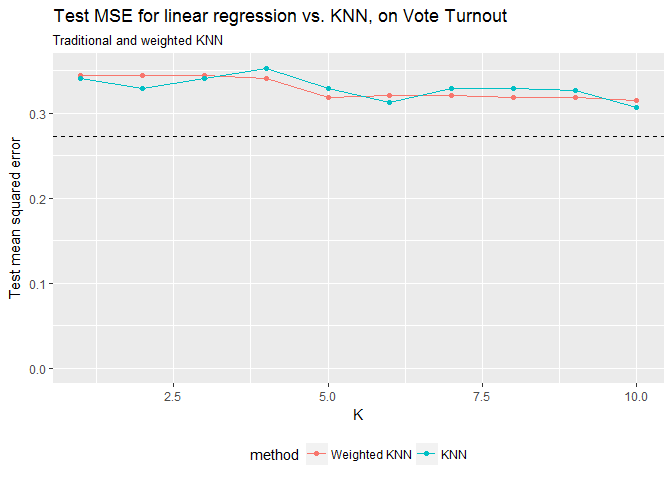

#### Compare the test error rate for the best KNN/wKNN model(s) to the test error rate for the equivalent logistic regression, decision tree, boosting, random forest, and SVM methods using the same combination of variables as before. Which performs the best? Why do you think this method performed the best, given your knowledge of how it works?

``` r
set.seed(111)
mh_tree <- tree(vote96 ~ ., data = mh_train,
     control = tree.control(nobs = nrow(mh),
                            mindev = 0))
mh_rf <- randomForest(vote96 ~., data = mh_train, ntree = 500)
mh_boost <- gbm(mh_train$vote96 ~ ., data=mh_train, n.trees = 10000, interaction.depth = 2)
```

    ## Distribution not specified, assuming bernoulli ...

``` r
mh_tune <- tune(svm, vote96 ~., data = mh_train, 
                          kernel = "linear", 
                          range = list(cost = c(.001, 0.01, .1, 1, 5, 10, 100)))
mh_lm_best <- mh_tune$best.model
mh_poly_tune <- tune(svm, vote96 ~ ., data = mh_train,
                     kernel = "polynomial",
                     range = list(cost = c(.001, .01, .1, 1, 5, 10, 100)))
mh_best <- mh_poly_tune$best.model


mse_lmsvm <- mse(mh_best, mh_test)
mse_glm <- mse(mh_glm, mh_test)
mse_tree <- mse(mh_tree, mh_test)
mse_rf <- mse(mh_rf, mh_test)
mse_boost <- mse(mh_boost, mh_test)
```

    ## Using 10000 trees...

``` r
mse_polysvm <- mse(mh_best, mh_test)

Methods <- c("Logistic model", "Decision Tree", "Random Forests", "Boosting", "Support Vector Machine (Poly)", "Support vector Machine (linear)", "Weighted KNN")
Errors <- c(mse_glm, mse_tree, mse_rf, mse_boost, mse_polysvm, mse_lmsvm, mse_wknn_mh)

kable(data.frame(Methods, Errors))
```

| Methods                         |     Errors|
|:--------------------------------|----------:|
| Logistic model                  |  1.0748561|
| Decision Tree                   |  0.2686692|
| Random Forests                  |  0.1968784|
| Boosting                        |  1.7338439|
| Support Vector Machine (Poly)   |  0.2719548|
| Support vector Machine (linear) |  0.2719548|
| Weighted KNN                    |  0.3151862|

Colleges
========

#### Perform PCA analysis on the college dataset and plot the first two principal components. Describe the results. What variables appear strongly correlated on the first principal component? What about the second principal component?

``` r
# convert the private to a numeric variable
c <- clg %>%
  mutate(Private = ifelse (Private =="Yes",1,0 ) )
# However, it seems the vector of Private does associate any major clusters, I ignore it. 


pr.out <- prcomp(c, scale = TRUE)
biplot(pr.out, scale = 0, cex = .6)
```

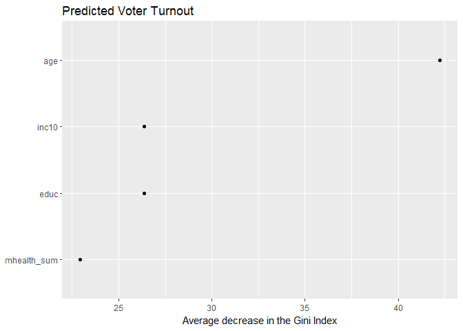

``` r
pr.out <- prcomp(clg[,2:18], scale = TRUE)

pr.out$rotation
```

    ##                     PC1         PC2         PC3         PC4         PC5
    ## Apps         0.24876560 -0.33159823  0.06309210 -0.28131053 -0.00574141
    ## Accept       0.20760150 -0.37211675  0.10124906 -0.26781735 -0.05578609
    ## Enroll       0.17630359 -0.40372425  0.08298557 -0.16182677  0.05569364
    ## Top10perc    0.35427395  0.08241182 -0.03505553  0.05154725  0.39543434
    ## Top25perc    0.34400128  0.04477866  0.02414794  0.10976654  0.42653359
    ## F.Undergrad  0.15464096 -0.41767377  0.06139298 -0.10041234  0.04345437
    ## P.Undergrad  0.02644250 -0.31508783 -0.13968172  0.15855849 -0.30238541
    ## Outstate     0.29473642  0.24964352 -0.04659887 -0.13129136 -0.22253200
    ## Room.Board   0.24903045  0.13780888 -0.14896739 -0.18499599 -0.56091947
    ## Books        0.06475752 -0.05634184 -0.67741165 -0.08708922  0.12728883
    ## Personal    -0.04252854 -0.21992922 -0.49972112  0.23071057  0.22231102
    ## PhD          0.31831287 -0.05831132  0.12702837  0.53472483 -0.14016633
    ## Terminal     0.31705602 -0.04642945  0.06603755  0.51944302 -0.20471973
    ## S.F.Ratio   -0.17695789 -0.24666528  0.28984840  0.16118949  0.07938825
    ## perc.alumni  0.20508237  0.24659527  0.14698927 -0.01731422  0.21629741
    ## Expend       0.31890875  0.13168986 -0.22674398 -0.07927349 -0.07595812
    ## Grad.Rate    0.25231565  0.16924053  0.20806465 -0.26912907  0.10926791
    ##                      PC6          PC7          PC8          PC9
    ## Apps        -0.016237442 -0.042486349  0.103090398 -0.090227080
    ## Accept       0.007534685 -0.012949720  0.056270962 -0.177864814
    ## Enroll      -0.042557980 -0.027692894 -0.058662355 -0.128560713
    ## Top10perc   -0.052692798 -0.161332069  0.122678028  0.341099863
    ## Top25perc    0.033091590 -0.118485556  0.102491967  0.403711989
    ## F.Undergrad -0.043454235 -0.025076363 -0.078889644 -0.059441918
    ## P.Undergrad -0.191198583  0.061042346 -0.570783816  0.560672902
    ## Outstate    -0.030000391  0.108528966 -0.009845998 -0.004573329
    ## Room.Board   0.162755446  0.209744235  0.221453442  0.275022548
    ## Books        0.641054950 -0.149692034 -0.213293009 -0.133663353
    ## Personal    -0.331398003  0.633790064  0.232660840 -0.094468890
    ## PhD          0.091255521 -0.001096413  0.077040000 -0.185181525
    ## Terminal     0.154927646 -0.028477011  0.012161330 -0.254938198
    ## S.F.Ratio    0.487045875  0.219259358  0.083604874  0.274544380
    ## perc.alumni -0.047340014  0.243321156 -0.678523654 -0.255334907
    ## Expend      -0.298118619 -0.226584481  0.054159377 -0.049138881
    ## Grad.Rate    0.216163313  0.559943937  0.005335539  0.041904305
    ##                    PC10         PC11        PC12         PC13        PC14
    ## Apps        -0.05250980  0.043046207 -0.02407091  0.595830975  0.08063280
    ## Accept      -0.04114008 -0.058405585  0.14510245  0.292642398  0.03346743
    ## Enroll      -0.03448791 -0.069398883 -0.01114315 -0.444638207 -0.08569672
    ## Top10perc   -0.06402578 -0.008104814 -0.03855430  0.001023036 -0.10782819
    ## Top25perc   -0.01454923 -0.273128469  0.08935156  0.021883880  0.15174211
    ## F.Undergrad -0.02084718 -0.081157818 -0.05617677 -0.523622267 -0.05637288
    ## P.Undergrad  0.22310581  0.100693324  0.06353607  0.125997650  0.01928575
    ## Outstate    -0.18667536  0.143220673  0.82344378 -0.141856014 -0.03401154
    ## Room.Board  -0.29832424 -0.359321731 -0.35455973 -0.069748585 -0.05842898
    ## Books        0.08202922  0.031940037  0.02815937  0.011437996 -0.06684946
    ## Personal    -0.13602762 -0.018578473  0.03926403  0.039454742  0.02752862
    ## PhD          0.12345220  0.040372325 -0.02322243  0.127696382 -0.69112615
    ## Terminal     0.08857846 -0.058973403 -0.01648504 -0.058313466  0.67100861
    ## S.F.Ratio   -0.47204525  0.445000727  0.01102621 -0.017715270  0.04137410
    ## perc.alumni -0.42299971 -0.130727978 -0.18266065  0.104088088 -0.02715421
    ## Expend      -0.13228633  0.692088870 -0.32598230 -0.093746450  0.07312252
    ## Grad.Rate    0.59027107  0.219839000 -0.12210670 -0.069196978  0.03647674
    ##                     PC15         PC16         PC17
    ## Apps        -0.133405806 -0.459139498 -0.358970400
    ## Accept       0.145497511  0.518568789  0.543427250
    ## Enroll      -0.029589609  0.404318439 -0.609651110
    ## Top10perc   -0.697722522  0.148738723  0.144986329
    ## Top25perc    0.617274818 -0.051868340 -0.080347844
    ## F.Undergrad -0.009916410 -0.560363054  0.414705279
    ## P.Undergrad -0.020951598  0.052731304 -0.009017890
    ## Outstate    -0.038354479 -0.101594830 -0.050899592
    ## Room.Board  -0.003401971  0.025929338 -0.001146396
    ## Books        0.009438879 -0.002882829 -0.000772632
    ## Personal     0.003090014  0.012890402  0.001114334
    ## PhD          0.112055599 -0.029807547 -0.013813337
    ## Terminal    -0.158909651  0.027075981 -0.006209327
    ## S.F.Ratio    0.020899128  0.021247629  0.002222152
    ## perc.alumni  0.008417894 -0.003334062  0.019186974
    ## Expend       0.227742017  0.043880323  0.035309822
    ## Grad.Rate    0.003394336  0.005008447  0.013071002

``` r
biplot(pr.out, scale = 0, cex = .8, xlabs=rep(".", nrow(clg)))
```

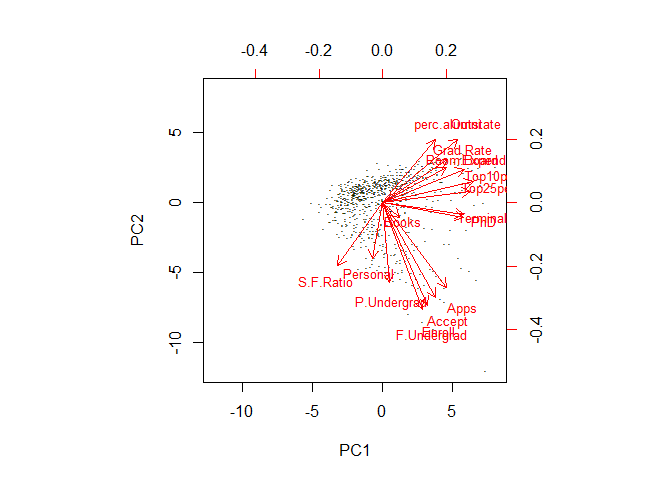

``` r
# Principal Component Analysis 
states_label <-arrests$State
arrests_df <- arrests[c("Murder", "Assault", "UrbanPop", "Rape")]
pr.out <- prcomp(arrests_df, scale = TRUE)
pr.out$rotation 
```

    ##                 PC1        PC2        PC3         PC4
    ## Murder   -0.5358995  0.4181809 -0.3412327  0.64922780
    ## Assault  -0.5831836  0.1879856 -0.2681484 -0.74340748
    ## UrbanPop -0.2781909 -0.8728062 -0.3780158  0.13387773
    ## Rape     -0.5434321 -0.1673186  0.8177779  0.08902432

``` r
biplot(pr.out, scale = 0, cex = .6)
```

 \#\#\#Part 2

``` r
kmeans_fit2 <- kmeans(arrests_df, 2, nstart = 20)
biplot(pr.out, scale = 0, cex = .6)
```


``` r
PC1 <- as.data.frame(pr.out$x)$PC1
PC2 <- as.data.frame(pr.out$x)$PC2
#plot(PC1, PC2, label=arrests_label)
state_group <- as.factor(kmeans_fit2$cluster)
d <- data.frame(x=PC1, y=PC2, name=states_label)
p <- ggplot(d, aes(x, y, label=name, color=state_group))
p +  geom_text() + labs(title = "PCA: Divide States into 2 Groups (K-Means Clustering, K=2)")
```

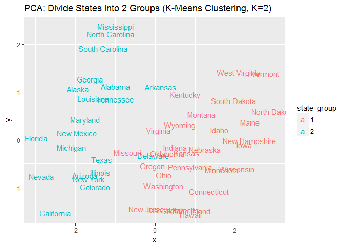 \#\#\#Part 3

``` r
kmeans_fit4 <- kmeans(arrests_df, 4, nstart = 20)

biplot(pr.out, scale = 0, cex = .6)
```

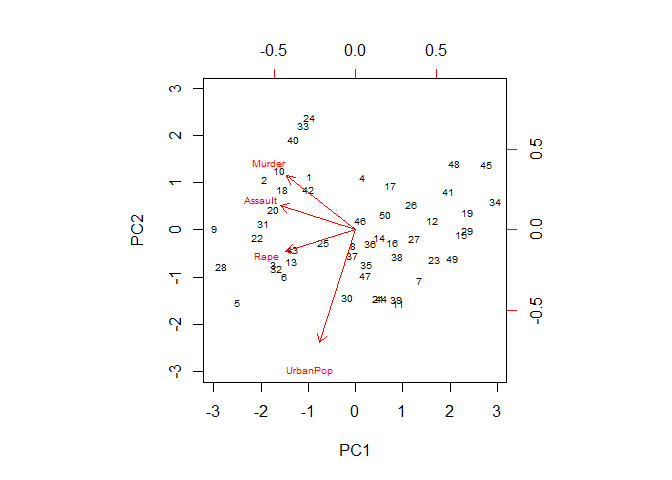

``` r
PC1 <- as.data.frame(pr.out$x)$PC1
PC2 <- as.data.frame(pr.out$x)$PC2

plot(PC1, PC2, label=states_label)
```

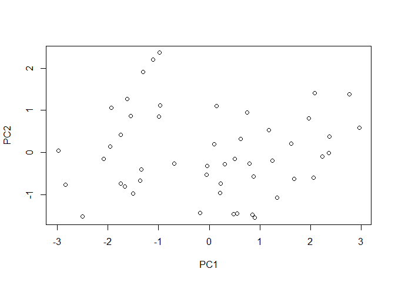

``` r
state_group <- as.factor(kmeans_fit4$cluster)

d <- data.frame(x=PC1, y=PC2, name=states_label)
p <- ggplot(d, aes(x, y, label=name, color=state_group))
p +  geom_text() + labs(title = "PCA: Divide States into 4 Groups (K-Means Clustering, K=4)")
```

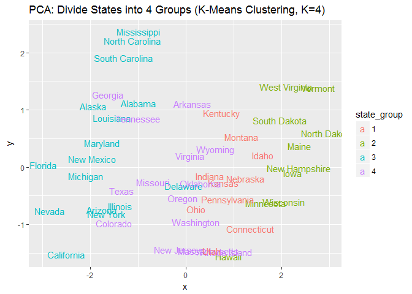 \#\#\#Part 4

``` r
kmeans_fit3 <- kmeans(arrests_df, 3, nstart = 20)
biplot(pr.out, scale = 0, cex = .6)
```


``` r
PC1 <- as.data.frame(pr.out$x)$PC1
PC2 <- as.data.frame(pr.out$x)$PC2

#plot(PC1, PC2, label=arrests_label)

state_group <- as.factor(kmeans_fit3$cluster)

d <- data.frame(x=PC1, y=PC2, name=states_label)
p <- ggplot(d, aes(x, y, label=name, color=state_group))
p +  geom_text() + labs(title = "PCA: Divide States into 3 Groups (K-Means Clustering, K=3)")
```

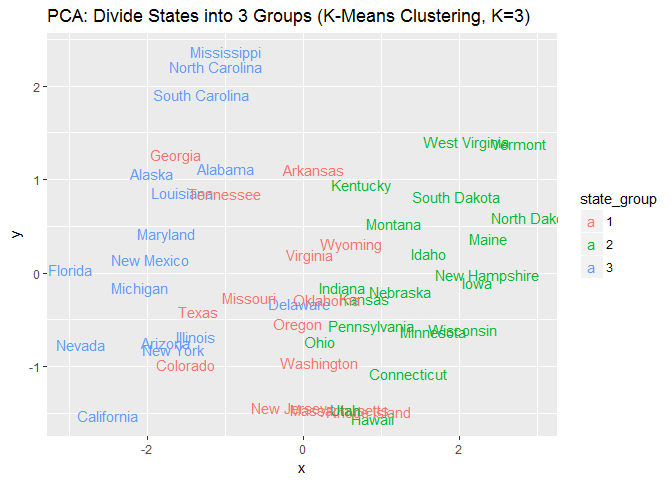 \#\#\#Part 5

``` r
pr.out <- prcomp(arrests_df, scale = TRUE)
PCS <- data.frame(v1=PC1, v2=PC2)
kmeans_fit3_pca <- kmeans(PCS, 3, nstart = 20)
state_group <- as.factor(kmeans_fit3_pca$cluster)
d <- data.frame(x=PC1, y=PC2, name=states_label)
p <- ggplot(d, aes(x, y, label=name, color=state_group))
p +  geom_text() + labs(title = "PCA: Divide States into 3 Groups based on PC1, PC2 (K-Means Clustering, K=2)")
```

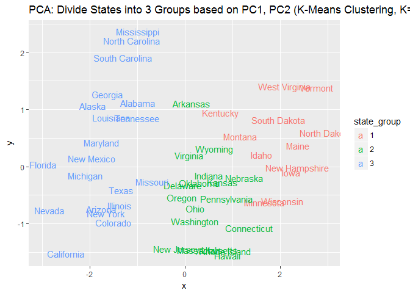

### Part 6

``` r
hc.complete <- hclust(dist(arrests_df), method = "complete")

# plot
ggdendrogram(hc.complete) + labs(title = 'US Arrests Heirarchical Clustering')
```


``` r
h <- 150
# extract dendro data
hcdata <- dendro_data(hc.complete)
hclabs <- label(hcdata) %>%
  left_join(data_frame(label = as.factor(seq.int(nrow(arrests_df))),
                       cl = as.factor(cutree(hc.complete, h = h))))

# plot dendrogram
ggdendrogram(hc.complete, labels = FALSE) +
  geom_text(data = hclabs,
            aes(label = label, x = x, y = 0, color = cl),
            vjust = .5, angle = 90) +
  geom_hline(yintercept = h, linetype = 2) +
  theme(axis.text.x = element_blank(),
        legend.position = "none")
```

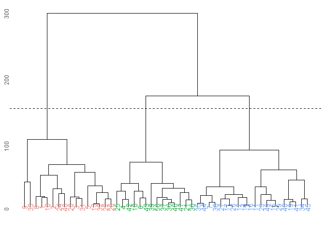

### Part 8

``` r
hc.standard <- hclust(dist(scale(arrests_df)), method = "complete")

#plot
ggdendrogram(hc.standard) + labs(title = 'US Arrests Standardized Heirarchical Clustering')
```

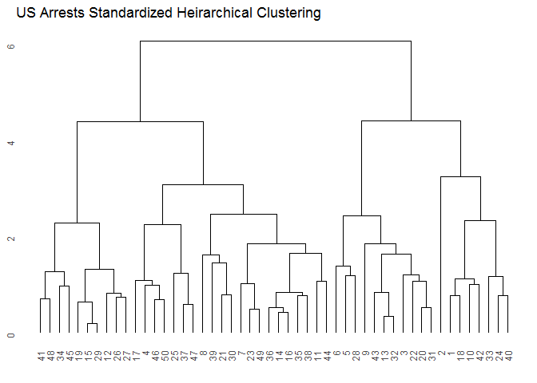
