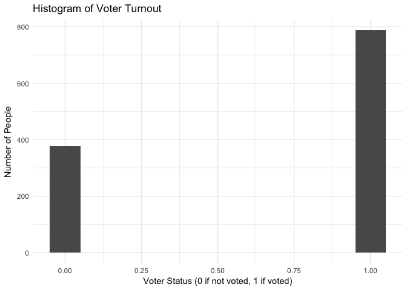
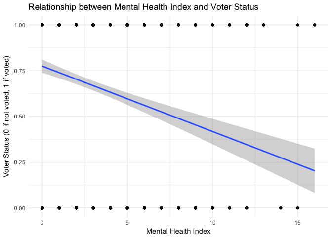
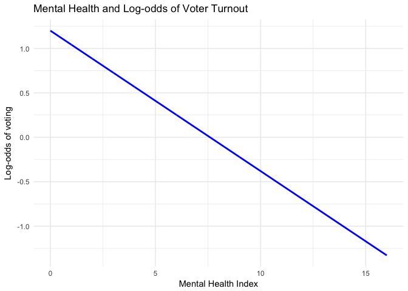
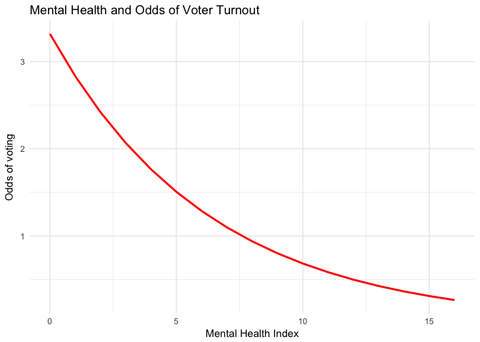
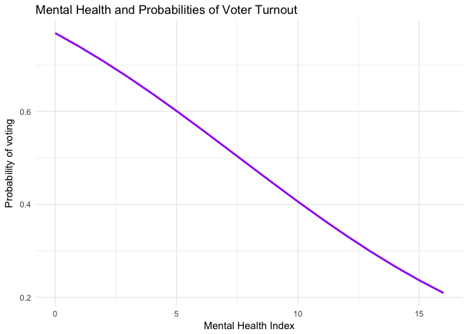
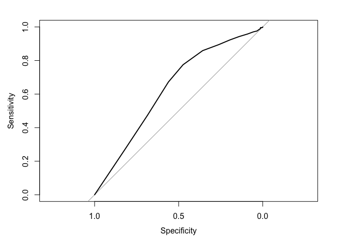
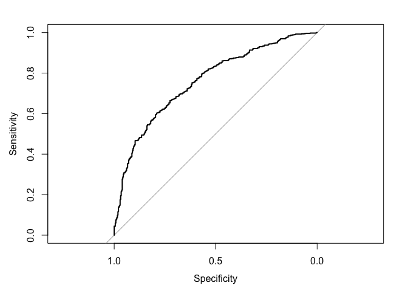
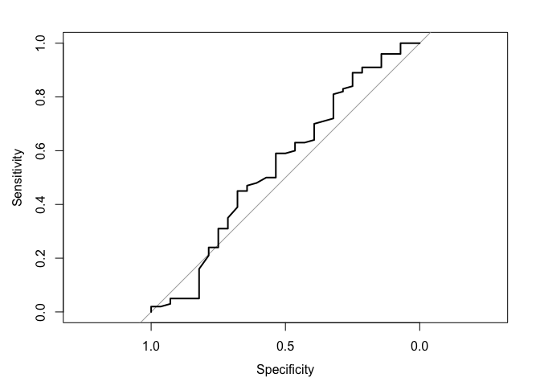

Perspectives PS6
================
Haylee Ham
2/19/2017

Part 1: Modeling Voter Turnout
------------------------------

### Describe the data

``` r
ggplot(mental_wona, aes(vote96)) + geom_histogram(binwidth = 0.1) + labs(title="Histogram of Voter Turnout", x="Voter Status (0 if not voted, 1 if voted)", y="Number of People")
```



The unconditional probability of a given individual turning out to vote is 62.959%.

``` r
ggplot(mental_wona, aes(mhealth_sum, vote96)) + geom_point() + geom_smooth(method=lm) + labs(title= "Relationship between Mental Health Index and Voter Status", x="Mental Health Index", y="Voter Status (0 if not voted, 1 if voted)")
```

 This scatterplot tells us that as the mental health index decreases voter turnout also decreases. That is to say that individuals with severe depression are less likely to vote as those with less severe (or absence of) depression. However, using a linear smoothing line assumes that the `vote96` variable is continuous and has values in between 0 and 1. Since `vote96` is a binary variable, it only has values of 0 and 1 and the line inhabiting space in between those values does not make interpretable sense. We can interpret it as the probability of voting given a certain mental health index, however the line can extend beyond the bounds of the voter status and into negative values and values greater than one, which cannot be interpreted as probabilities.

### Basic Model

1.  The relationship between mental health index and voter turnout does appear to be statistically significant. The predictor variable `mhealth_sum` has a p-value of about 3.13e-13, which is very close to zero and statistically significant. Substantively, the coefficient on `mhealth_sum` is about -0.14, which means that the log-odds of voting decreases by 0.14 for each one unit increase is mental health index. This seems to also be a substantive relationship.

``` r
logit2prob <- function(x){
  exp(x) / (1 + exp(x))
}

prob2odds <- function(x){
   x / (1 - x)
 }
 
 prob2logodds <- function(x){
   log(prob2odds(x))
 }

voter_mental <- glm(vote96 ~ mhealth_sum, data = mental_wona, family = binomial)

tidy(voter_mental)
```

    ##          term   estimate  std.error statistic      p.value
    ## 1 (Intercept)  1.1994307 0.09191375 13.049523 6.394650e-39
    ## 2 mhealth_sum -0.1579842 0.02157023 -7.324175 2.403735e-13

``` r
voter_mental_pred <- mental_wona %>%
  add_predictions(voter_mental, var='init') %>%
  mutate(prob = logit2prob(init)) %>%
  mutate(odds = prob2odds(prob))
```

1.  In terms of log-odds, the estimated parameter for mental health can be interpreted directly from the estimate as follows: for every one unit increase in `mhealth_sum` the log-odds of voting decreases by -0.143.

``` r
ggplot(aes(mhealth_sum), data = voter_mental_pred) +
  geom_line(aes(y = init), color = "blue", size = 1) +
  labs(title = "Mental Health and Log-odds of Voter Turnout", x = "Mental Health Index", y = "Log-odds of voting")
```



1.  The estimated parameter for mental health is terms of odds can be interpreted as the odds that someone is going to vote given a certain mental health index. For example, the odds of a person with a health index of 1 has about a 3:1 odds of voting. This means that they are three times as likely to vote as they are to not vote. This odds ratio decreases as the mental health index decreases.

``` r
ggplot(aes(mhealth_sum), data = voter_mental_pred) +
  geom_line(aes(y = odds), color = "red", size = 1) +
  labs(title = "Mental Health and Odds of Voter Turnout", x = "Mental Health Index", y = "Odds of voting")
```



1.  The estimated parameter for mental health is terms of probabilities can be interpreted as simple probabilities. That is, when an individual's mental health index is 5, the individual has about a 60% chance of voting, as can be seen by the 0.6 on the y-axis in line with the 5 on the x-axis. As the mental health index increases the probability that an individual will vote decreases. The difference seen in voter turnout caused by a mental health index increase from 1 to 2 is about -0.029 and the difference in mental health index increase form 5 to 6 is about -0.035.

``` r
ggplot(aes(mhealth_sum), data = voter_mental_pred) +
  geom_line(aes(y = prob), color = "purple", size = 1) +
  labs(title = "Mental Health and Probabilities of Voter Turnout", x = "Mental Health Index", y = "Probability of voting")
```



``` r
specific_prob <- data.frame(mhealth_sum = c(1,2,5,6)) %>%
      add_predictions(voter_mental) %>%
      mutate(pred = logit2prob(pred))

first_diff1 = specific_prob[2,]$pred - specific_prob[1,]$pred
print(first_diff1)
```

    ## [1] -0.03158982

``` r
first_diff2 = specific_prob[4,]$pred - specific_prob[3,]$pred
print(first_diff2)
```

    ## [1] -0.03841835

1.  The accuracy rate of this model is about 67.78%. The proportional reduction in error is -0.014. The AUC is 0.6243. The accuracy rate and the AUC are both mediocre scores for a model and the PRE score indicates that error has actually been increased over the useless classifier. This is not a very good model.

``` r
voter_mental_accuracy <- mental_wona%>%
  add_predictions(voter_mental) %>%
  mutate(prob = logit2prob(pred),
         pred = as.numeric(prob > .5))

vm_acc <- mean(voter_mental_accuracy$vote96 == voter_mental_accuracy$pred, na.rm = TRUE)

# function to calculate PRE for a logistic regression model
PRE <- function(model){
  # get the actual values for y from the data
  y <- model$y
  
  # get the predicted values for y from the model
  y.hat <- round(model$fitted.values)
  
  # calculate the errors for the null model and your model
  E1 <- sum(y != median(y))
  E2 <- sum(y != y.hat)
  
  # calculate the proportional reduction in error
  PRE <- (E1 - E2) / E1
  return(PRE)
}

E2 <- 1 - vm_acc
E1 <- 1 - mean(voter_mental_accuracy$vote96, na.rm = TRUE)
PRE <- (E1 - E2) / E1

roc_x <- roc(voter_mental_accuracy$vote96, voter_mental_accuracy$prob)
plot(roc_x)
```



``` r
auc_x <- auc(voter_mental_accuracy$vote96, voter_mental_accuracy$prob)
```

### Multiple Variable Model

``` r
my_voter <- glm(vote96 ~ mhealth_sum + age + educ + married + inc10, data = mental_wona, family = binomial)
```

1.  The probability distribution (random component) of the `vote96` variable is binomial. Since each instance of the `vote96` variable is simply a Bernoulli random variable between 0 and 1, when we aggregate all of the Bernoulli random trials we have a binomal random variable.
    $$Pr(\\sum\_{i=1}^{n}vote96\_i = k|p) = \\binom{n}{k}p^k(1-p)^{n-k}$$
     The linear predictor for this model is the linear function of all of the regressors.
    *v**o**t**e*96<sub>*i*</sub> = *β*<sub>0</sub> + *β*<sub>1</sub>*m**h**e**a**l**t**h*\_*s**u**m* + *β*<sub>2</sub>*a**g**e* + *β*<sub>3</sub>*e**d**u**c* + *β*<sub>4</sub>*m**a**r**r**i**e**d* + *β*<sub>5</sub>*i**n**c*10
     The link function transforms the expectation of the response variable to be the linear predictor. Since we are dealing with a binomial random variable, in order to transform it we use the following link function:
    $$g(vote96\_i) = \\frac{e^{vote96\_i}}{1 + e^{vote96\_i}}$$

2.  My model includes the variables `mhealth_sum`, `age`, `educ`, `married`, and `inc10`. The estiamted parameters and p-values for each are found below.

``` r
tidy(my_voter)
```

    ##          term    estimate   std.error statistic      p.value
    ## 1 (Intercept) -4.20013255 0.497962144 -8.434642 3.322174e-17
    ## 2 mhealth_sum -0.08833233 0.023603047 -3.742412 1.822621e-04
    ## 3         age  0.04211267 0.004791127  8.789721 1.499322e-18
    ## 4        educ  0.22527055 0.029376045  7.668512 1.740032e-14
    ## 5     married  0.29385585 0.153009044  1.920513 5.479314e-02
    ## 6       inc10  0.06623878 0.026206947  2.527527 1.148689e-02

1.  For my own model with my five chosen parameters, it can clearly be seen that this model is an improvement over the single variable model. The accuracy rate is about 72% and the proportional reduction in error over the useless classifier is about 0.14. The AUC has also increased to be about 0.76. While still leaving some of the variation of the `vote96` response variable unexplained, this model does explain more than our single variable model.

Upon initially estimating the model with all possible predictor variables, I removed `female` and `black` because they did not have a significant p-value. As can be seen in the table in part 2, all predictor variables in this model are significant at a 90% confidence interval, with the `married` variable being the least significant. All variables have a positive effect on the log-odds of voting other than an increase the mental health index `mhealth_sum`.

``` r
my_voter_acc <- mental_wona %>%
  add_predictions(my_voter) %>%
  mutate(prob = logit2prob(pred))

my_acc <- mean(my_voter_acc$vote96 == my_voter_acc$prob, na.rm = TRUE)

PRE <- function(model){
  # get the actual values for y from the data
  y <- model$y
  
  # get the predicted values for y from the model
  y.hat <- round(model$fitted.values)
  
  # calculate the errors for the null model and your model
  E1 <- sum(y != median(y))
  E2 <- sum(y != y.hat)
  
  # calculate the proportional reduction in error
  PRE <- (E1 - E2) / E1
  return(PRE)
}

pre_vote <- PRE(my_voter)

roc_x1 <- roc(my_voter_acc$vote96, my_voter_acc$prob)
plot(roc_x1)
```



``` r
auc_x1 <- auc(my_voter_acc$vote96, my_voter_acc$prob)
```

Part 2: Modeling tv consumption
-------------------------------

``` r
tv_df <- read.csv('data/gss2006.csv')
tv_df <- na.omit(tv_df)
my_tv <- glm(tvhours ~ educ + grass + hrsrelax + black, data = tv_df, family = poisson)
```

### Estimate a regression model

1.  The probability distribution (random component) of the `tvhours` variable is a poisson random variable, since `tvhours` uses counts.
    $$Pr(tvhours = k|\\lambda) = \\frac{\\lambda^{k}e^{-\\lambda}}{k!}$$
     The linear predictor for this model is the linear function of all of the regressors.
    *t**v**h**o**u**r**s*<sub>*i*</sub> = *β*<sub>0</sub> + *β*<sub>1</sub>*a**g**e* + *β*<sub>2</sub>*c**h**i**l**d**s* + *β*<sub>3</sub>*e**d**u**c* + *β*<sub>4</sub>*f**e**m**a**l**e* + *β*<sub>5</sub>*g**r**a**s**s* + *β*<sub>6</sub>*h**r**s**r**e**l**a**x*+
    *β*<sub>7</sub>*b**l**a**c**k* + *β*<sub>8</sub>*s**o**c**i**a**l*<sub>*c*</sub>*o**n**n**e**c**t* + *β*<sub>9</sub>*v**o**t**e**d*04 + *β*<sub>10</sub>*x**m**o**v**i**e* + *β*<sub>11</sub>*z**o**d**i**a**c* + *β*<sub>12</sub>*d**e**m*+
    *β*<sub>13</sub>*r**e**p* + *β*<sub>14</sub>*i**n**d*

The link function transforms the expectation of the response variable to be the linear predictor. Since we are dealing with a poisson random variable, in order to transform it we use the following link function:
*g*(*v**o**t**e*96<sub>*i*</sub>)=log(*t**v**h**o**u**r**s*<sub>*i*</sub>)

1.  My model includes the variables `educ`, `grass`, `hrsrelax`, `black`. The estiamted parameters and p-values for each are found below.

``` r
tidy(my_tv)
```

    ##          term    estimate   std.error statistic      p.value
    ## 1 (Intercept)  1.22488226 0.169478878  7.227345 4.925291e-13
    ## 2        educ -0.03896934 0.011063455 -3.522348 4.277426e-04
    ## 3       grass -0.10786991 0.061855046 -1.743914 8.117401e-02
    ## 4    hrsrelax  0.04663217 0.009462026  4.928349 8.292733e-07
    ## 5       black  0.45063811 0.072396089  6.224620 4.827261e-10

1.  For my model, I initially used all variables and then removed insignificant variables one by one until all variables were significant. This left the variables `educ`, `grass`, `hrslrelax`, and `black`. The coefficients of `educ` and `grass` are negative, indicating that those the hours of tv watched decreases with each unit increase of education and for those who believe that marijuana should be legalized. The coefficients of `hrsrelax` and `black` are positive, indicating that the hours of tv watched increases for each increas in hours spent relaxing and if an individual is black.

This model does not perform very well. The accuracy rate is only about 22.7% and the proportional reduction in error is -0.02. The signs on the coefficients can definitely fit into a sane narrative, however the magnitude of the effect on the `black` variable seems exceptionally large. Possibly there is some omitted variable bias that is pushing more effect onto the `black` variable that could belong in some sort of socioeconomic variable instead.

``` r
my_tv_pred <-  tv_df %>%
  add_predictions(my_tv, var = 'init_tv') %>%
  mutate(prob_tv = logit2prob(init_tv)) %>%
  mutate(odds_tv = prob2odds(prob_tv)) %>%
  mutate(pred_tv = ifelse(prob_tv > .5, 1, 0))

my_tv_acc <- mean(my_tv_pred[['tvhours']] == my_tv_pred$pred_tv)

# function to calculate PRE for a logistic regression model
PRE <- function(model){
  # get the actual values for y from the data
  y <- model$y
  
  # get the predicted values for y from the model
  y.hat <- round(model$fitted.values)
  
  # calculate the errors for the null model and your model
  E1 <- sum(y != median(y))
  E2 <- sum(y != y.hat)
  
  # calculate the proportional reduction in error
  PRE <- (E1 - E2) / E1
  return(PRE)
}

pre_tv <- PRE(my_tv)
roc_x <- roc(my_tv_pred$tvhours, my_tv_pred$prob_tv)
plot(roc_x)
```



``` r
auc_tv <- auc(my_tv_pred$tvhours, my_tv_pred$prob_tv)
```
