Perspectives Assignment 7
================
Haylee Ham
2/25/2017

-   [Part 1: Sexy Joe Biden](#part-1-sexy-joe-biden)
-   [Part 2: College (Bivariate)](#part-2-college-bivariate)
-   [Part 3: College (GAM)](#part-3-college-gam)

### Part 1: Sexy Joe Biden

``` r
biden_df <- read.csv('data/biden.csv')
biden_lm <- lm(biden ~ age + female + educ + dem + rep, data = biden_df)
tidy(biden_lm)
```

    ##          term estimate std.error statistic  p.value
    ## 1 (Intercept)  58.8113    3.1244     18.82 2.69e-72
    ## 2         age   0.0483    0.0282      1.71 8.77e-02
    ## 3      female   4.1032    0.9482      4.33 1.59e-05
    ## 4        educ  -0.3453    0.1948     -1.77 7.64e-02
    ## 5         dem  15.4243    1.0680     14.44 8.14e-45
    ## 6         rep -15.8495    1.3114    -12.09 2.16e-32

1.  

``` r
mse <- function(model, data) {
  x <- modelr:::residuals(model, data)
  mean(x ^ 2, na.rm = TRUE)
}
mse(biden_lm, biden_df)
```

    ## [1] 395

1.  

``` r
set.seed(1234)
biden_split <- resample_partition(biden_df, c(test = 0.3, train = 0.7))
biden_lm_train <- lm(biden ~ age + female + educ + dem + rep, data = biden_split$train)
mse(biden_lm_train, biden_split$test)
```

    ## [1] 400

The MSE for the entire data set on the linear model fitted using the entire data set is higher than the MSE for the testing data on the linear model fitted using the testing data. The MSE is higher using test and training data since when we fit the linear model using the entire dataset, we were already accounting for all of the data and knew how it performed with the model.

1.  

``` r
mse_100 <- numeric(100)

for (i in 1:100) {
biden_split_100 <- resample_partition(biden_df, c(test = 0.3, train = 0.7))
biden_lm_train_100 <- lm(biden ~ age + female + educ + dem + rep, data = biden_split_100$train)
current_mse <- mse(biden_lm_train_100, biden_split_100$test)
mse_100[i] <- current_mse
}

mse_100
```

    ##   [1] 412 378 398 410 399 377 405 396 351 398 433 414 385 392 396 427 409
    ##  [18] 404 414 420 412 382 392 428 392 399 420 378 434 431 391 409 409 404
    ##  [35] 372 440 424 401 396 429 384 371 428 418 398 352 378 396 410 400 405
    ##  [52] 371 410 412 397 389 425 398 389 414 438 341 358 398 394 420 400 396
    ##  [69] 422 388 455 434 380 404 405 403 401 375 368 422 440 397 370 419 399
    ##  [86] 396 387 429 395 383 415 409 388 415 384 416 409 412 394 398

``` r
mean(mse_100)
```

    ## [1] 402

``` r
sd(mse_100)
```

    ## [1] 20.7

``` r
histogram(mse_100, type='density', col='forestgreen', main='Distribution of MSE values for testing data')
```

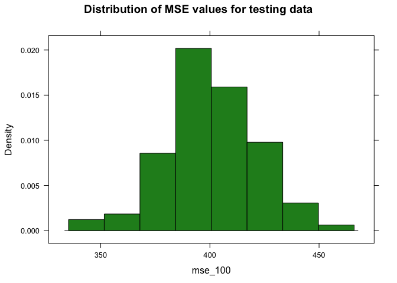 The 100 MSE calculations from splitting the data 100 times gives values that are clearly in the same range as the initial split. The mean of the 100 splits MSEs is 399 with a standard deviation of 23.6. The histogram shows a fairly normal distribution of the MSEs.

1.  

``` r
loocv_data <- crossv_kfold(biden_df, k = nrow(biden_df))
loocv_models <- map(loocv_data$train, ~ lm(biden ~ age + female + educ + dem + rep, data = .))
loocv_mse <- map2_dbl(loocv_models, loocv_data$test, mse)
mean(loocv_mse)
```

    ## [1] 398

The results of the leave-one-out cross-validation has a mean of 398. This method has yielded very similar results to the previous method of splitting the data 70/30 into training and testing data. The leave-one-out cross-validation ran much slower than the validation set method and obtained a slightly lower MSE. Consideration must be taken over whether speed or accuracy is more important in the application.

1.  

``` r
loocv_data <- crossv_kfold(biden_df, k = 10)
loocv_models <- map(loocv_data$train, ~ lm(biden ~ age + female + educ + dem + rep, data = .))
loocv_mse <- map2_dbl(loocv_models, loocv_data$test, mse)
mean(loocv_mse)
```

    ## [1] 398

The results of the 10-fold cross-validation approach is exactly the same as the MSE from the leave-one-out cross-validation. The MSEs for both methods are 398. Since the 10-fold cross-validation method runs so much faster, I believe it is the superior method.

1.  

``` r
mse_k100 <- numeric(100)

for (i in 1:100) {
loocv_data <- crossv_kfold(biden_df, k = 10)
loocv_models <- map(loocv_data$train, ~ lm(biden ~ age + female + educ + dem + rep, data = .))
loocv_mse <- map2_dbl(loocv_models, loocv_data$test, mse)
current_kmse <- mean(loocv_mse)
mse_k100[i] <- current_kmse
}

mse_k100
```

    ##   [1] 398 398 398 399 398 398 398 398 397 398 399 398 398 398 398 398 398
    ##  [18] 398 397 397 397 398 398 397 398 398 398 400 398 397 398 398 398 399
    ##  [35] 397 398 397 398 398 399 398 398 399 399 397 398 398 398 398 398 398
    ##  [52] 397 398 398 398 398 399 397 399 398 398 398 399 397 398 398 398 397
    ##  [69] 397 398 398 398 397 398 398 399 398 398 398 398 399 399 396 397 398
    ##  [86] 398 398 398 398 398 398 398 398 398 398 398 398 398 399 398

``` r
mean(mse_k100)
```

    ## [1] 398

``` r
sd(mse_k100)
```

    ## [1] 0.539

``` r
histogram(mse_k100, type='density', col='red', main='Distribution of 10-fold CV MSE values for testing data')
```

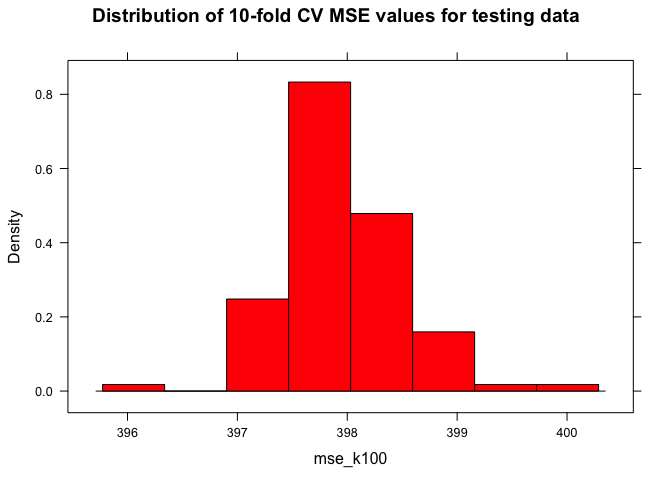 The mean of the 100 10-fold cross-validation obtained MSEs is again 398.

1.  

``` r
auto_boot <- biden_df %>%
  modelr::bootstrap(1000) %>%
  mutate(model = map(strap, ~ lm(biden ~ age + female + educ + dem + rep, data = .)),
         coef = map(model, tidy))

auto_boot %>%
  unnest(coef) %>%
  group_by(term) %>%
  summarize(est.boot = mean(estimate),
            se.boot = sd(estimate, na.rm = TRUE))
```

    ## # A tibble: 6 × 3
    ##          term est.boot se.boot
    ##         <chr>    <dbl>   <dbl>
    ## 1 (Intercept)  58.9134  2.9781
    ## 2         age   0.0477  0.0288
    ## 3         dem  15.4302  1.1072
    ## 4        educ  -0.3495  0.1921
    ## 5      female   4.0880  0.9488
    ## 6         rep -15.8743  1.4443

``` r
tidy(biden_lm)
```

    ##          term estimate std.error statistic  p.value
    ## 1 (Intercept)  58.8113    3.1244     18.82 2.69e-72
    ## 2         age   0.0483    0.0282      1.71 8.77e-02
    ## 3      female   4.1032    0.9482      4.33 1.59e-05
    ## 4        educ  -0.3453    0.1948     -1.77 7.64e-02
    ## 5         dem  15.4243    1.0680     14.44 8.14e-45
    ## 6         rep -15.8495    1.3114    -12.09 2.16e-32

The estimates and standard errors derived from the original model and the bootstrap method are quite similar. The standard errors are for the most part slightly larger from the bootstrap method than for the original model. This is because no assumptions were made about the distribution of the data and so the bootstrap method is not as confident about the estimates being made as the original model is by making assumptions about the population.

### Part 2: College (Bivariate)

``` r
college_df <- read.csv('data/College.csv')
ten_lm <- lm(Outstate ~ S.F.Ratio, data = college_df)
expend_lm <- lm(Outstate ~ Expend, data = college_df)
personal_lm <- lm(Outstate ~ Terminal, data = college_df)
```

#### S.F.Ratio as the predictor variable

I chose `S.F.Ratio` as my first predictor variable for the simple linear regression model. The variable is the ratio between students and faculty at the university. This first graph shows the relationship between `S.F.Ratio` and `Outstate`, drawing a linear regression line. The linear line of best fit shows a downward trend that does not account for the increased density of data points above and below the line is various places.

``` r
ggplot(college_df, aes(S.F.Ratio, Outstate)) +
  geom_point() +
  geom_smooth(method = "lm") +
  labs(title="Relationship between S.F.Ratio and Outstate")
```

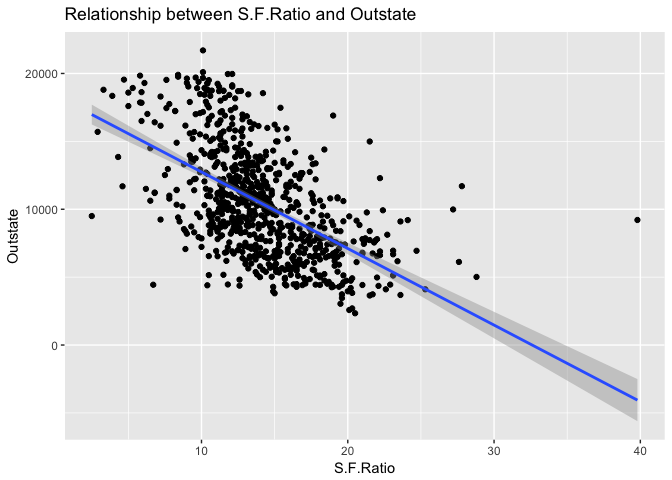

The second graph below allows R to draw the line that it sees fit to reduce the MSE and clearly a linear line was not drawn.

``` r
ggplot(college_df, aes(S.F.Ratio, Outstate)) +
  geom_point() +
  geom_smooth(method = "auto") +
  labs(title="Relationship between S.F.Ratio and Outstate")
```

    ## `geom_smooth()` using method = 'loess'

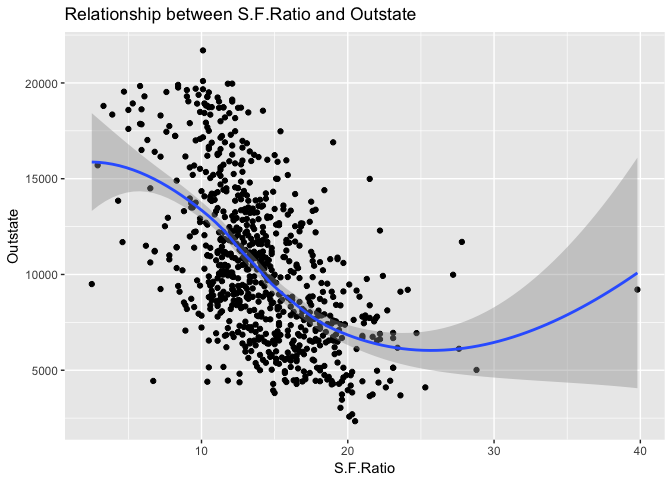

By looking at the third graph below showing the relationship between the predicted variables and residuals and there is not a linear relationship between the predicted values and the residuals. Therefore, we can gain accuracy by relaxing the linearity assumption.

``` r
sim_linear <- college_df
sim_linear_mod <- glm(Outstate ~ S.F.Ratio, data = sim_linear)

sim_linear_pred <- sim_linear %>%
  add_predictions(sim_linear_mod) %>%
  add_residuals(sim_linear_mod)

ggplot(sim_linear_pred, aes(pred, resid)) +
  geom_point() +
  geom_smooth(se = FALSE) +
  labs(title = "Predicted vs. Residuals for the S.F.Ratio predictor",
       x = "Predicted values",
       y = "Residuals")
```

    ## `geom_smooth()` using method = 'loess'

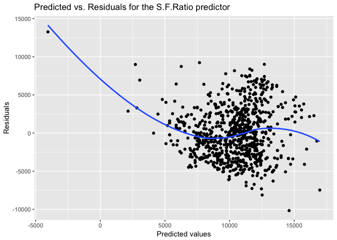

I decided to try the regression spline by fitting a cubic spline first with 10 knots. The resulting line of best fit shows the cubic relationship between the data in a way that the linear line of best fit could not.

``` r
sim_piece <- college_df

# estimate models
sim_piece_smooth <- glm(Outstate ~ bs(S.F.Ratio, knots = c(10)), data = sim_piece)

# draw the plot
sim_piece %>%
  add_predictions(sim_piece_smooth) %>%
  ggplot(aes(S.F.Ratio)) +
  geom_point(aes(y = Outstate)) +
  geom_line(aes(y = pred), size = 1) +
  labs(title = "Cubic spline between S.F.Ratio and Outstate",
       x = "S.F.Ratio",
       y = "Outstate")
```

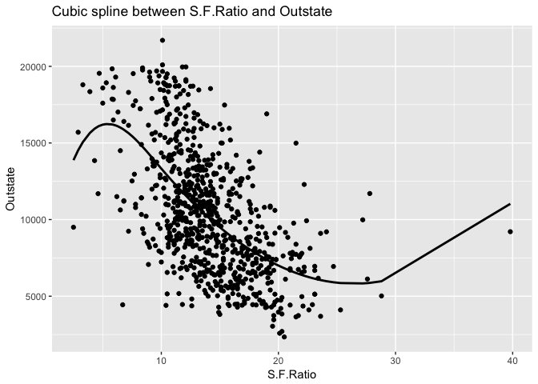

Next it is time to choose how many knots to use in the cubic spline. I believe that the 10 knot line is overfitting the data and the curves on the 1 knot line appear too severe. I believe that the 5 knot cubic spline is the most appropriate line for this data.

``` r
data_frame(terms = c(1, 5, 10),
           models = map(terms, ~ glm(Outstate ~ bs(S.F.Ratio, df = . + 3), data = sim_piece)),
           pred = map(models, ~ add_predictions(sim_piece, .))) %>%
  unnest(pred) %>%
  ggplot(aes(S.F.Ratio, Outstate)) +
  geom_point(data = sim_piece, alpha = .2) +
  geom_line(aes(y = pred, color = factor(terms))) +
  labs(title = "Cubic spline between S.F.Ratio and Outstate",
       x = "S.F.Ratio",
       y = "Outstate",
       color = "Knots")
```

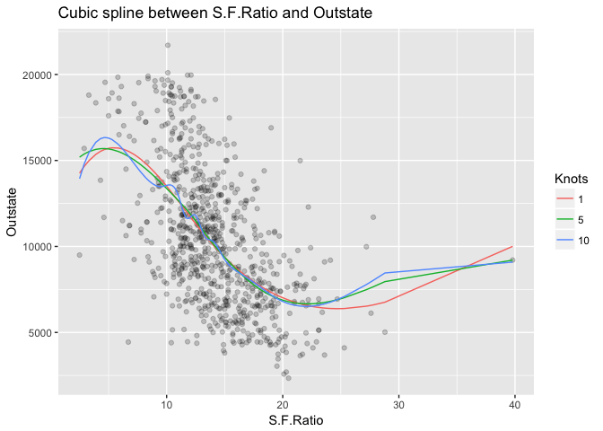

#### Terminal as the predictor variable

For my second predictor variable, I chose `Terminal`, the variable that measures the percent of the faculty at the college who has a terminal degree. The first graph shows the relationship between `Terminal` and `Outstate`, by allowing a loess smoother to draw a line of best fit, it can be seen that the relationship is perhaps not linear.

``` r
ggplot(college_df, aes(Terminal, Outstate)) +
  geom_point() +
  geom_smooth(method = "auto") +
  labs(title="Relationship between Terminal and Outstate")
```

    ## `geom_smooth()` using method = 'loess'

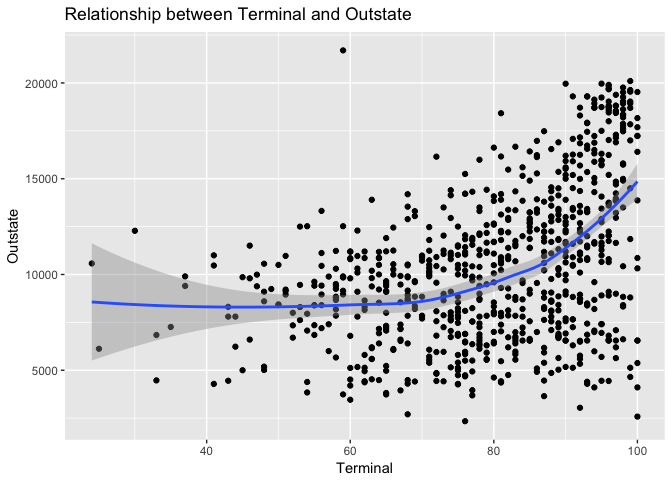

To investigate further, I plotted the residuals against the predicted values to see if there were patterns. If the relationship between the two variables is linear, the residuals and predicted values will not have any discernable patterns and the plotted line would be horizontal with an expected value of 0 for the residuals.

``` r
sim_linear_mod <- glm(Outstate ~ Terminal, data = college_df)

sim_linear_pred <- college_df %>%
  add_predictions(sim_linear_mod) %>%
  add_residuals(sim_linear_mod)

ggplot(sim_linear_pred, aes(pred, resid)) +
  geom_point() +
  geom_smooth(se = FALSE) +
  labs(title = "Plot of residuals of solely linear model: Terminal vs Outstate",
       x = "Predicted values",
       y = "Residuals")
```

    ## `geom_smooth()` using method = 'loess'


This plot gives more evidence to support the claim that the relationship between `Terminal` and `Outstate` is not linear. The line of best fit for the above plot does have a systematic pattern by curving upward and the range increasing as the predicted values increase.

Now that we have decided to relax the linearity assumption, I first plotted the linear regression line.

``` r
ggplot(sim_linear_mod, aes(Terminal)) +
  geom_point(data = college_df, aes(Terminal, Outstate)) +
  geom_line(aes(y = .fitted), col="blue") +
  labs(title = "Outstate Tuition costs and Terminal Professors",
       x = "Terminal Percentage",
       y = "Out of State Tuition")
```

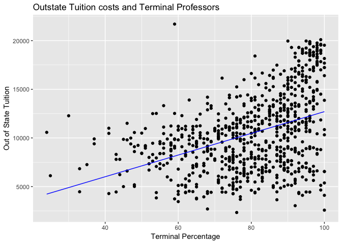

I then created a general linear regression model using the squared values for `Terminal`. I also calculated the mean squared errors for the relaxed linear model to compare to the linear model. The results show that a one unit increase in professors with terminal degrees results in a *s**q**r**t*(0.794) increase in out of state tuition. The MSE for this regresssion line is smaller than for the linear regression where `Terminal` is not squared, which indicates that this model better fits our data.

``` r
term_out = glm(Outstate ~ I(Terminal^2), data = college_df)
summary(term_out) 
```

    ## 
    ## Call:
    ## glm(formula = Outstate ~ I(Terminal^2), data = college_df)
    ## 
    ## Deviance Residuals: 
    ##    Min      1Q  Median      3Q     Max  
    ## -10585   -2845     326    2400   13711  
    ## 
    ## Coefficients:
    ##               Estimate Std. Error t value Pr(>|t|)    
    ## (Intercept)   5.22e+03   4.13e+02    12.7   <2e-16 ***
    ## I(Terminal^2) 7.94e-01   5.96e-02    13.3   <2e-16 ***
    ## ---
    ## Signif. codes:  0 '***' 0.001 '**' 0.01 '*' 0.05 '.' 0.1 ' ' 1
    ## 
    ## (Dispersion parameter for gaussian family taken to be 13185062)
    ## 
    ##     Null deviance: 1.2559e+10  on 776  degrees of freedom
    ## Residual deviance: 1.0218e+10  on 775  degrees of freedom
    ## AIC: 14948
    ## 
    ## Number of Fisher Scoring iterations: 2

``` r
mse(sim_linear_mod, college_df)
```

    ## [1] 13473357

``` r
mse(term_out, college_df)
```

    ## [1] 13151124

I then plotted the line of best fit for the model with the `Terminal` variable squared. The resulting line looks like a better fit with the data, gently curving with the pattern of the data.

``` r
attach(college_df)
# plot the curve
ggplot(term_out, aes(Terminal)) +
  geom_point(data = college_df, aes(Terminal, Outstate)) +
  geom_line(aes(y = .fitted), col="blue") +
  labs(title = "Outstate Tuition costs and Terminal Professors",
       x = "Terminal squared",
       y = "Out of State Tuition")
```

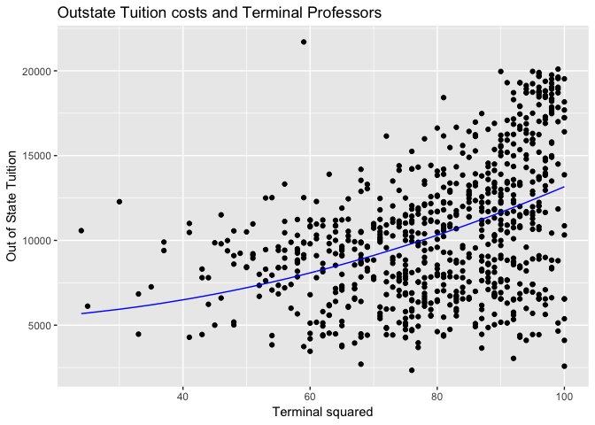

Next, I ran a polynomial regression with the `Terminal` variable to the second, third, and fourth degree to see if this would fit the model better. This MSE is smaller than the first relaxed-linear model, however it appears as though the relationship between outstate and the polynomial versions of terminal are insignificant. I would therefore chose the first relaxed linear model, with `Terminal` only squared as the best model.

``` r
term_out_glm = glm(Outstate ~ I(Terminal^2) + I(Terminal^3) + I(Terminal^4), data = college_df)
summary(term_out_glm)
```

    ## 
    ## Call:
    ## glm(formula = Outstate ~ I(Terminal^2) + I(Terminal^3) + I(Terminal^4), 
    ##     data = college_df)
    ## 
    ## Deviance Residuals: 
    ##    Min      1Q  Median      3Q     Max  
    ## -12326   -2614     208    2443   13235  
    ## 
    ## Coefficients:
    ##                Estimate Std. Error t value Pr(>|t|)   
    ## (Intercept)    7.46e+03   2.50e+03    2.98    0.003 **
    ## I(Terminal^2)  2.46e+00   3.13e+00    0.79    0.432   
    ## I(Terminal^3) -6.51e-02   5.83e-02   -1.12    0.264   
    ## I(Terminal^4)  4.79e-04   2.98e-04    1.61    0.108   
    ## ---
    ## Signif. codes:  0 '***' 0.001 '**' 0.01 '*' 0.05 '.' 0.1 ' ' 1
    ## 
    ## (Dispersion parameter for gaussian family taken to be 12651367)
    ## 
    ##     Null deviance: 1.2559e+10  on 776  degrees of freedom
    ## Residual deviance: 9.7795e+09  on 773  degrees of freedom
    ## AIC: 14918
    ## 
    ## Number of Fisher Scoring iterations: 2

``` r
mse(term_out_glm, college_df)
```

    ## [1] 12586237

``` r
mse(sim_linear_mod, college_df)
```

    ## [1] 13473357

#### Expend as the predictor variable

I chose `Expend` as my third predictor variable. Plotting a linear line of best fit, as shown below, is clearly not explaining the trend of the data very well. It appears that there is some bulging with the trend of the data that may need to be addressed using the Bulging Rule.

``` r
ggplot(college_df, aes(Expend, Outstate)) +
  geom_point() +
  geom_smooth(method = "lm") +
  labs(title="Relationship between Expend and Outstate")
```

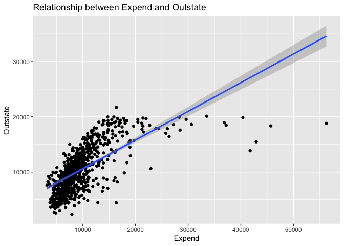

Also, as can be seen in the plot below, there appears to be deviations from the expected horizontal line of best fit between the Predicted Values and the Residuals. This leads us to the conclusion that we may need to relax the linear assumption.

``` r
sim_linear <- college_df
sim_linear_mod <- glm(Outstate ~ Expend, data = sim_linear)

sim_linear_pred <- sim_linear %>%
  add_predictions(sim_linear_mod) %>%
  add_residuals(sim_linear_mod)

ggplot(sim_linear_pred, aes(pred, resid)) +
  geom_point() +
  geom_smooth(se = FALSE) +
  labs(title = "Predicted vs. Residuals for the Expend predictor",
       x = "Predicted values",
       y = "Residuals")
```

    ## `geom_smooth()` using method = 'loess'

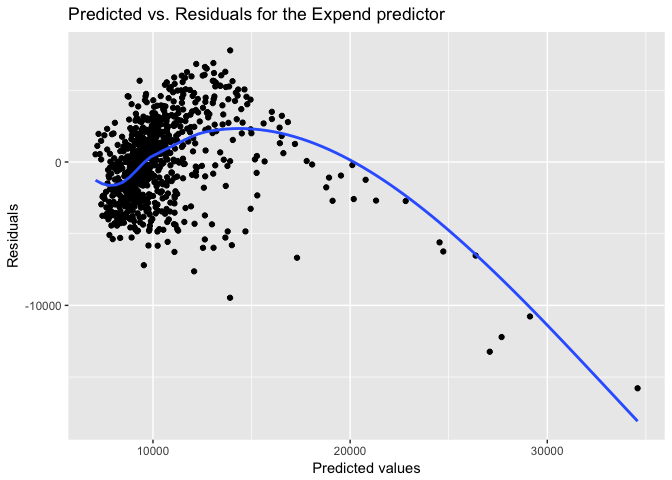

Based on the bulge of the data to the upper left, I choose to transform the data from x to log(x), taking the log of the `Expend` values. The line created by this model appears to fit the data much better than the original simple model.

``` r
expend_log = glm(Outstate~log(Expend), data=college_df)

college_df %>%
  add_predictions(expend_log) %>%
  add_residuals(expend_log) %>%
  {.} -> expend_log_grid

ggplot(college_df, aes(x=Expend, y=Outstate)) +
  geom_point() +
  geom_line(aes(y=pred), data=expend_log_grid, color='blue', size=1) +
  labs(title='Relationship between Outstate and log(Expend)')
```

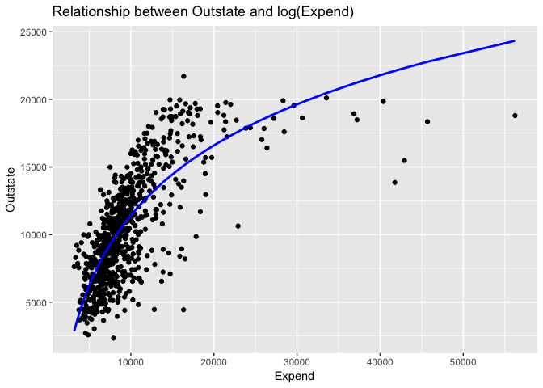

In order to further validate the log model, I calcuclate the MSE values for the original simple model and the new log model. The MSE for the log model is lower than the original simple model by a significant amount, from an MSE of 8847579 to 6830217 for the model where `Expend` has been logged.

``` r
mse(sim_linear_mod, college_df)
```

    ## [1] 8847579

``` r
mse(expend_log, college_df)
```

    ## [1] 6830217

``` r
tidy(expend_log)
```

    ##          term estimate std.error statistic   p.value
    ## 1 (Intercept)   -57502      2090     -27.5 8.35e-117
    ## 2 log(Expend)     7482       230      32.5 4.06e-147

The interpretation of this new model is that for every percent increase in `Expend` the out of state tuition will increase by $74.82.

### Part 3: College (GAM)

1.  

``` r
college_split <- resample_partition(college_df, c(test = 0.3, train = 0.7))
```

1.  The model with all 6 designated predictors does a fairly good job at explaining the variation in the response variable, with an R-squared of 76.5%. All of the predictor variables are significant at a 99% confidence interval. As shown below, being a private university increases the outstate tuition by 2,690 dollars, with each additional dollar spent on room and board the outstate tuition increases by $1.05. When percent of faculty with PhD's increases by one percent, the out of state tuition rises by 34.30 dollars. When percent of alumni who donate increases by one percent, the out of state tuition rises by 62.50 dollars. With each additional dollar spent by the institution on the students, out of state tuition increases by 0.219 dollars. And, finally, if the graduation rate increases by one percent, the out of state tuition increases by 26.00 dollars. All of the six predictor variables have a positive relationship with the response variable.

``` r
college_lm <- lm(Outstate ~ Private + Room.Board + PhD + perc.alumni + Expend + Grad.Rate,
                 data=college_split$train)
summary(college_lm)
```

    ## 
    ## Call:
    ## lm(formula = Outstate ~ Private + Room.Board + PhD + perc.alumni + 
    ##     Expend + Grad.Rate, data = college_split$train)
    ## 
    ## Residuals:
    ##    Min     1Q Median     3Q    Max 
    ##  -7469  -1254     -8   1215  10584 
    ## 
    ## Coefficients:
    ##              Estimate Std. Error t value Pr(>|t|)    
    ## (Intercept) -3.76e+03   5.48e+02   -6.85  2.0e-11 ***
    ## PrivateYes   2.48e+03   2.46e+02   10.08  < 2e-16 ***
    ## Room.Board   1.08e+00   1.02e-01   10.49  < 2e-16 ***
    ## PhD          3.13e+01   7.08e+00    4.42  1.2e-05 ***
    ## perc.alumni  5.42e+01   9.25e+00    5.86  8.2e-09 ***
    ## Expend       1.95e-01   2.01e-02    9.69  < 2e-16 ***
    ## Grad.Rate    3.47e+01   6.41e+00    5.41  9.5e-08 ***
    ## ---
    ## Signif. codes:  0 '***' 0.001 '**' 0.01 '*' 0.05 '.' 0.1 ' ' 1
    ## 
    ## Residual standard error: 2050 on 537 degrees of freedom
    ## Multiple R-squared:  0.746,  Adjusted R-squared:  0.743 
    ## F-statistic:  263 on 6 and 537 DF,  p-value: <2e-16

Now I will look at each of the 6 predictors individually. Since private is a binary variable, I will choose to leave it untransformed and allow R to create a dummy variable for it. Looking at both `Room.Board` and `Grad.Rate`'s graphs, I will choose a spline with 3 degrees of freedom and a 2 degree polynomial. Looking at `PhD`'s curve, I will choose to square `PhD`. `perc.alumni` looks generally linear and so I will simply leave it as is. As with in Part 2, I will log `Expend`.

``` r
college_train = data.frame(college_split$train)

ggplot(college_train, aes(Private, Outstate)) +
  geom_point() +
  geom_smooth(method = "auto") +
  labs(title="Relationship between Private and Outstate")
```

    ## `geom_smooth()` using method = 'loess'

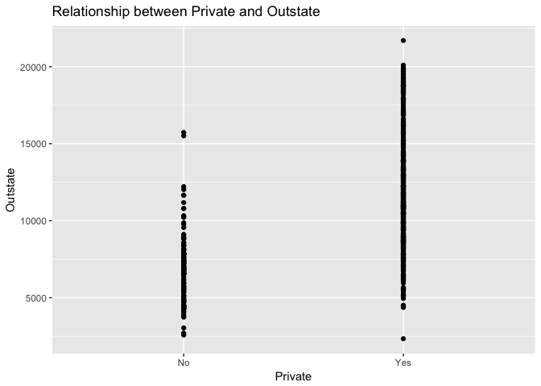

``` r
ggplot(college_train, aes(Room.Board, Outstate)) +
  geom_point() +
  geom_smooth(method = "auto") +
  labs(title="Relationship between Room.Board and Outstate")
```

    ## `geom_smooth()` using method = 'loess'

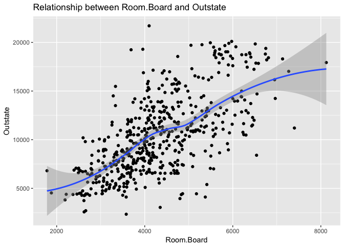

``` r
ggplot(college_train, aes(PhD, Outstate)) +
  geom_point() +
  geom_smooth(method = "auto") +
  labs(title="Relationship between PhD and Outstate")
```

    ## `geom_smooth()` using method = 'loess'

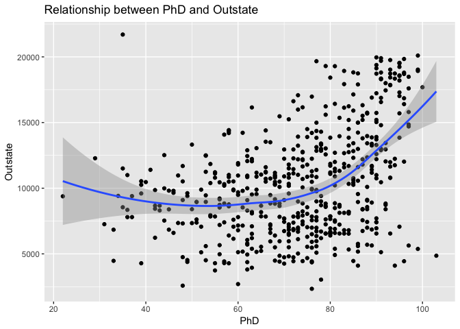

``` r
ggplot(college_train, aes(perc.alumni, Outstate)) +
  geom_point() +
  geom_smooth(method = "auto") +
  labs(title="Relationship between perc.alumni and Outstate")
```

    ## `geom_smooth()` using method = 'loess'

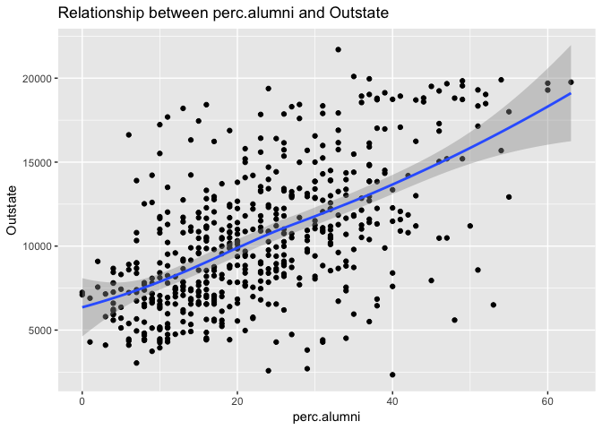

``` r
ggplot(college_train, aes(Expend, Outstate)) +
  geom_point() +
  geom_smooth(method = "auto") +
  labs(title="Relationship between Expend and Outstate")
```

    ## `geom_smooth()` using method = 'loess'

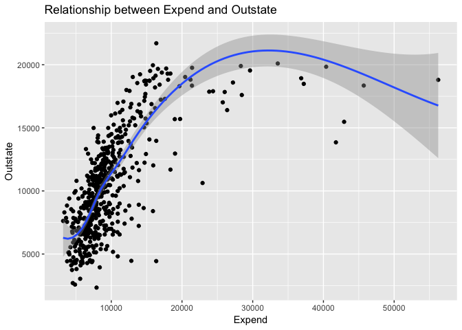

``` r
ggplot(college_train, aes(Grad.Rate, Outstate)) +
  geom_point() +
  geom_smooth(method = "auto") +
  labs(title="Relationship between Grad.Rate and Outstate")
```

    ## `geom_smooth()` using method = 'loess'

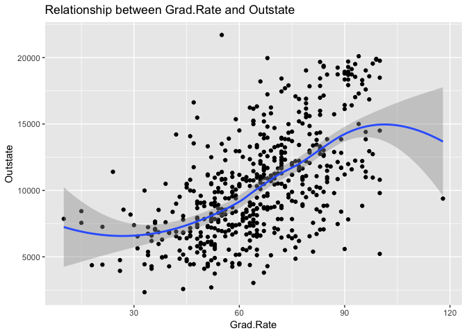

1.  I have created the GAM model with the functions stipulated above.

``` r
college_gam <- gam(Outstate ~ Private + bs(Room.Board, degree=2, df=3) + I(PhD^2) + perc.alumni + log(Expend) + bs(Grad.Rate, degree=2, df=3), data=college_train)

summary(college_gam)
```

    ## 
    ## Call: gam(formula = Outstate ~ Private + bs(Room.Board, degree = 2, 
    ##     df = 3) + I(PhD^2) + perc.alumni + log(Expend) + bs(Grad.Rate, 
    ##     degree = 2, df = 3), data = college_train)
    ## Deviance Residuals:
    ##      Min       1Q   Median       3Q      Max 
    ## -7228.68 -1198.42     3.48  1178.62  9077.56 
    ## 
    ## (Dispersion Parameter for gaussian family taken to be 3804152)
    ## 
    ##     Null Deviance: 8.88e+09 on 543 degrees of freedom
    ## Residual Deviance: 2.03e+09 on 533 degrees of freedom
    ## AIC: 9799 
    ## 
    ## Number of Local Scoring Iterations: 2 
    ## 
    ## Anova for Parametric Effects
    ##                                     Df   Sum Sq  Mean Sq F value  Pr(>F)
    ## Private                              1 2.56e+09 2.56e+09   672.5 < 2e-16
    ## bs(Room.Board, degree = 2, df = 3)   3 2.38e+09 7.93e+08   208.5 < 2e-16
    ## I(PhD^2)                             1 7.55e+08 7.55e+08   198.5 < 2e-16
    ## perc.alumni                          1 4.66e+08 4.66e+08   122.4 < 2e-16
    ## log(Expend)                          1 5.71e+08 5.71e+08   150.1 < 2e-16
    ## bs(Grad.Rate, degree = 2, df = 3)    3 1.27e+08 4.22e+07    11.1 4.5e-07
    ## Residuals                          533 2.03e+09 3.80e+06                
    ##                                       
    ## Private                            ***
    ## bs(Room.Board, degree = 2, df = 3) ***
    ## I(PhD^2)                           ***
    ## perc.alumni                        ***
    ## log(Expend)                        ***
    ## bs(Grad.Rate, degree = 2, df = 3)  ***
    ## Residuals                             
    ## ---
    ## Signif. codes:  0 '***' 0.001 '**' 0.01 '*' 0.05 '.' 0.1 ' ' 1

I will graph each predictor variable separately again this time within the transformation of its applied function.

``` r
college_gam_terms <- preplot(college_gam, se = TRUE, rug = FALSE)

## Private
data_frame(x = college_gam_terms$Private$x,
           y = college_gam_terms$Private$y,
           se.fit = college_gam_terms$Private$se.y) %>%
  unique %>%
  mutate(y_low = y - 1.96 * se.fit,
         y_high = y + 1.96 * se.fit) %>%
  ggplot(aes(x, y, ymin = y_low, ymax = y_high)) +
  geom_point() +
  geom_errorbar() +
  labs(title = "GAM of Out of State Tuition",
       x = "Private",
       y = expression(f[1](Private)))
```

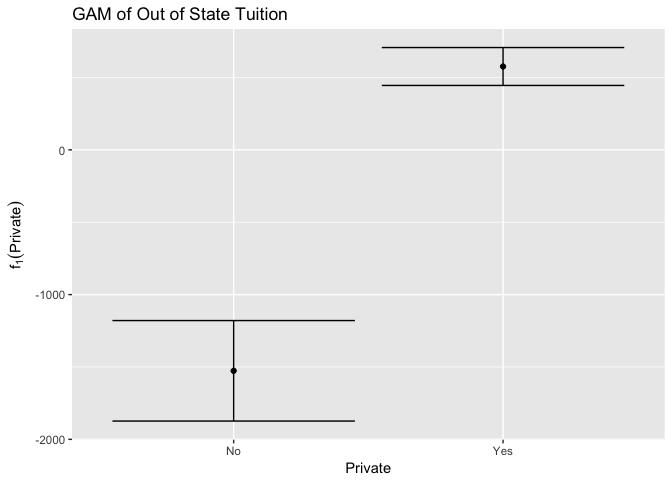

``` r
## Room.Board
data_frame(x = college_gam_terms$`bs(Room.Board, degree = 2, df = 3)`$x,
           y = college_gam_terms$`bs(Room.Board, degree = 2, df = 3)`$y,
           se.fit = college_gam_terms$`bs(Room.Board, degree = 2, df = 3)`$se.y) %>%
  mutate(y_low = y - 1.96 * se.fit,
         y_high = y + 1.96 * se.fit) %>%
  ggplot(aes(x, y)) +
  geom_line() +
  geom_line(aes(y = y_low), linetype = 2) +
  geom_line(aes(y = y_high), linetype = 2) +
  labs(title = "GAM of Out of State Tuition",
       subtitle = "Spline",
       x = "Room.Board",
       y = expression(f[2](Room.Board)))
```

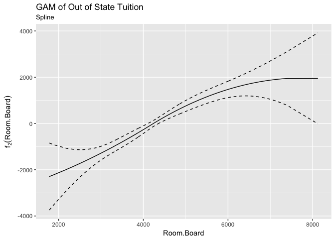

``` r
## PhD
data_frame(x = college_gam_terms$`I(PhD^2)`$x,
           y = college_gam_terms$`I(PhD^2)`$y,
           se.fit = college_gam_terms$`I(PhD^2)`$se.y) %>%
  mutate(y_low = y - 1.96 * se.fit,
         y_high = y + 1.96 * se.fit) %>%
  ggplot(aes(x, y)) +
  geom_line() +
  geom_line(aes(y = y_low), linetype = 2) +
  geom_line(aes(y = y_high), linetype = 2) +
  labs(title = "GAM of Out of State Tuition",
       subtitle = "Square X",
       x = "PhD",
       y = expression(f[3](PhD)))
```

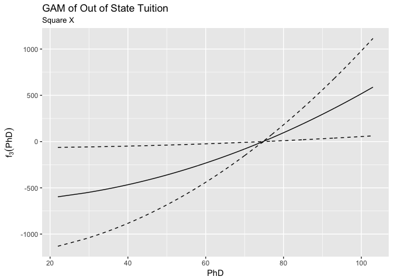

``` r
## perc.alumni
data_frame(x = college_gam_terms$perc.alumni$x,
           y = college_gam_terms$perc.alumni$y,
           se.fit = college_gam_terms$perc.alumni$se.y) %>%
  mutate(y_low = y - 1.96 * se.fit,
         y_high = y + 1.96 * se.fit) %>%
  ggplot(aes(x, y)) +
  geom_line() +
  geom_line(aes(y = y_low), linetype = 2) +
  geom_line(aes(y = y_high), linetype = 2) +
  labs(title = "GAM of Out of State Tuition",
       subtitle = "Linear Regression",
       x = "perc.alumni",
       y = expression(f[4](perc.alumni)))
```

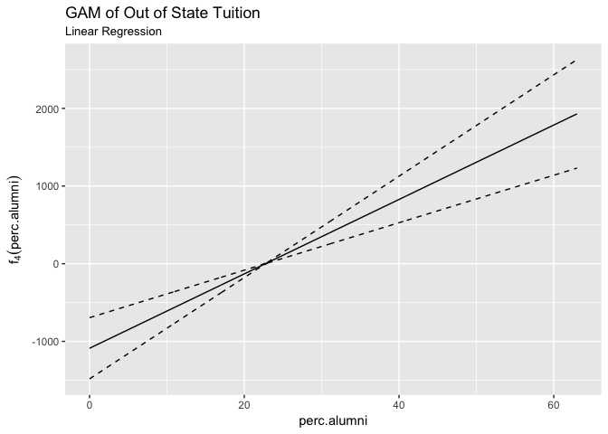

``` r
## Expend
data_frame(x = college_gam_terms$`log(Expend)`$x,
           y = college_gam_terms$`log(Expend)`$y,
           se.fit = college_gam_terms$`log(Expend)`$se.y) %>%
  mutate(y_low = y - 1.96 * se.fit,
         y_high = y + 1.96 * se.fit) %>%
  ggplot(aes(x, y)) +
  geom_line() +
  geom_line(aes(y = y_low), linetype = 2) +
  geom_line(aes(y = y_high), linetype = 2) +
  labs(title = "GAM of Out of State Tuition",
       subtitle = "Log Transformation",
       x = "Expend",
       y = expression(f[5](Expend)))
```

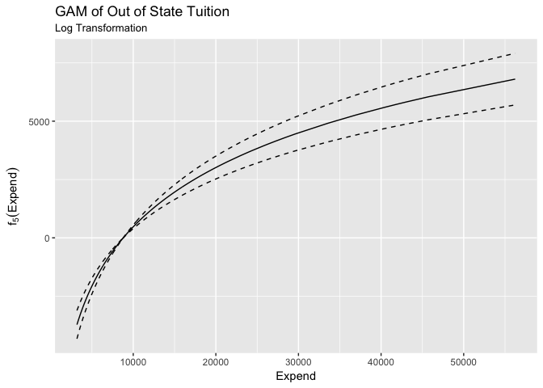

``` r
## Grad.Rate
data_frame(x = college_gam_terms$`bs(Grad.Rate, degree = 2, df = 3)`$x,
           y = college_gam_terms$`bs(Grad.Rate, degree = 2, df = 3)`$y,
           se.fit = college_gam_terms$`bs(Grad.Rate, degree = 2, df = 3)`$se.y) %>%
  mutate(y_low = y - 1.96 * se.fit,
         y_high = y + 1.96 * se.fit) %>%
  ggplot(aes(x, y)) +
  geom_line() +
  geom_line(aes(y = y_low), linetype = 2) +
  geom_line(aes(y = y_high), linetype = 2) +
  labs(title = "GAM of Out of State Tuition",
       subtitle = "Spline",
       x = "Grad.Rate",
       y = expression(f[6](Grad.Rate)))
```

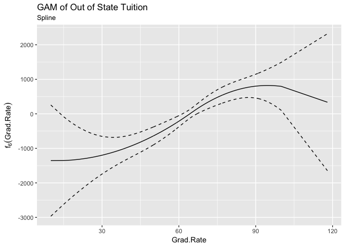

The six plots above all seem to show predictor variables that have significant relationships with the response variable once all other variables are controlled for. None of the plots have become flat and they all seem to have relatively narrow confidence intervals at a 95% level. The effect of being a private college has a substantial effect and is statistically significant from zero sinec the confidence intervals do not overlap. Room and Board costs appear to have appear to have a fairly constant positive relationship with out of state tuition with confidence intervals becoming wider on both ends where, presumably, there are very few observations. The squared percent of faculty with PhD's has a curvilinear postive relationship with out of state tuition. Percent of alumni who donate has a linearly postive relationship with out of state tuition, indicating that the effect on out of state tuition is monotonically increasing. The amount of money spent on each student (`Expend`) has a curvilinear relationship with out of state tuition that has especially small confidence intervals right around 10,0000. Lastly, the graduation rate has a spline that shows probably the weakest relationship with out of state tuition. Above 90% and below 45% of graduation rate, the confidence intervals become very wide. In between those values, there is a strictly postive relationship indicating that an higher graduation rate does coincide with higher out of state tuition at least between 45%-90% graduation rate.

1.  In order to test for goodness of fit between the OLS and the GAM models, I have calculated the MSE for each mode. The MSE for the OLS model is 4,767,656 and the MSE for the GAM model is 4,204,468. The MSEs allow us to conclude that the GAM model, which allows for non-linear relationships between the predictors and the response, is a better fit for the data and is a more accurate model.

``` r
ols_mse <- mse(college_lm, college_split$test)
gam_mse <- mse(college_gam, college_split$test)

ols_mse
```

    ## [1] 4037176

``` r
gam_mse
```

    ## [1] 3679473

1.  I conclude that there is evidence that `Expend`, `PhD`, and `Grad.Rate` may have a non-linear relationship with the response. In looking at the graphs above, `Expend` looks to not have a constant change in the response variable and instead has a positive relationship with a coefficient that becomes smaller as the values of `Expend` increase. `PhD` also appears to have a curvilinear relationship with the response and the confidence intervals seem narrow enough to suppport this idea. `Grad.Rate`'s relationship with the response variable has an S shape that increases dramatically for the values between 45 and 90 and then begins to decline after that, although the confidence intervals become too wide at both ends to be sure of this conclusion.
