Classification PS
================
Haylee Ham
3/5/2017

Part 1
------

### 1

``` r
biden <- read_csv("data/biden.csv")
```

    ## Parsed with column specification:
    ## cols(
    ##   biden = col_integer(),
    ##   female = col_integer(),
    ##   age = col_integer(),
    ##   educ = col_integer(),
    ##   dem = col_integer(),
    ##   rep = col_integer()
    ## )

``` r
set.seed(1234)
biden.split <- resample_partition(biden, c(test = .3, train = .7))
```

### 2

``` r
# estimate model
biden_tree <- tree(biden ~ ., data = biden.split$train)

# plot tree
tree_data <- dendro_data(biden_tree)


ptree <- ggplot(segment(tree_data)) +
  geom_segment(aes(x = x, y = y, xend = xend, yend = yend), 
               alpha = 0.5) +
  geom_text(data = label(tree_data), 
            aes(x = x, y = y, label = label_full), vjust = -0.5, size = 3) +
  geom_text(data = leaf_label(tree_data), 
            aes(x = x, y = y, label = label), vjust = 0.5, size = 3) +
  theme_dendro()+
  labs(title = 'Decision Tree for Biden Scores',
       subtitle = 'All predictors, Default Controls')

# function to get MSE
mse <- function(model, data) {
  x <- modelr:::residuals(model, data)
  mean(x ^ 2, na.rm = TRUE)
}

mse_biden_1 = mse(biden_tree,biden.split$test)
leaf_vals <- leaf_label(tree_data)$yval
ptree
```

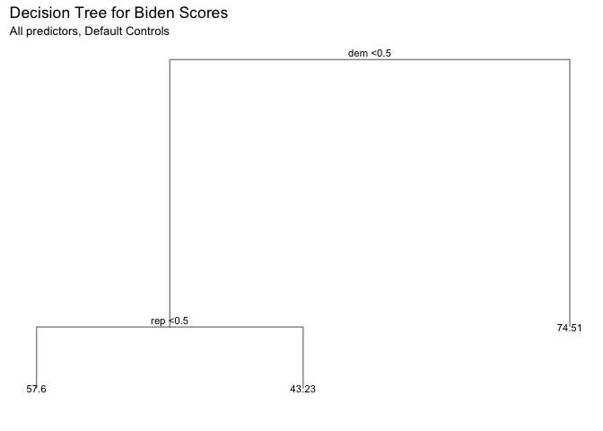 The value of the MSE is 406.4167458.

### 3

``` r
set.seed(1234)

biden_tree_2 <- tree(biden ~ ., data = biden.split$train,
     control = tree.control(nobs = nrow(biden.split$train),
                            mindev = 0))
mod <- biden_tree_2

mse_biden_2 <- mse(biden_tree_2, biden.split$test)

num_nodes <- 2:25
pruned_trees <- map(num_nodes, prune.tree, tree = biden_tree_2, k = NULL)
test_mses <- map_dbl(pruned_trees, mse, data = biden.split$test)

tree.opt <- pruned_trees[[which.min(test_mses)]]
opt_test_mse <- mse(tree.opt, biden.split$test)

tibble(num_nodes = num_nodes, test_mse = test_mses) %>%
  ggplot(aes(x = num_nodes, y = test_mse)) +
  geom_line() + 
  labs(title = 'Test MSE for Different Numbers of Terminal Nodes',
       subtitle = '(Test MSE calculated on Test data defined in Step 1)',
       x = 'Terminal Nodes in Tree',
       y = 'Test MSE')
```

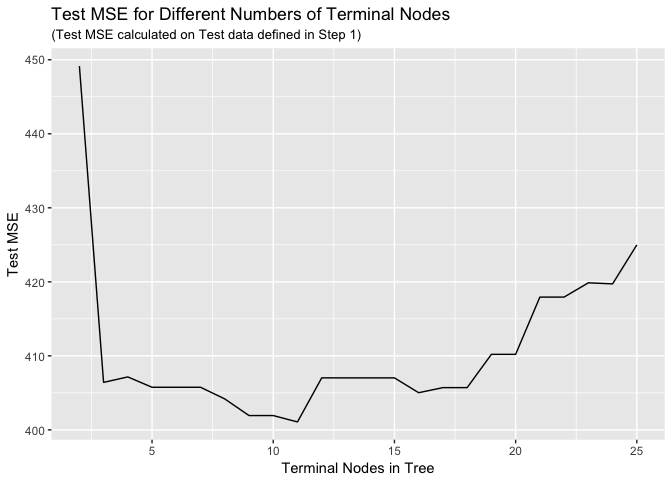

``` r
biden_pruned <- prune.tree(biden_tree_2, best=11)
mse_pruned = mse(biden_pruned,biden.split$test)
```

Using cross validation, it appears that the tree with the lowest MSE is a tree with 11 nodes. Pruning our tree to have 11 nodes reduces the MSE from 481.4899366 to 401.0746405. The new tree looks like this:

``` r
plot(biden_pruned, col='#F29C6D', lwd=2.5)
title("Best 11 Regression Tree for Biden Scores")
text(biden_pruned)
```

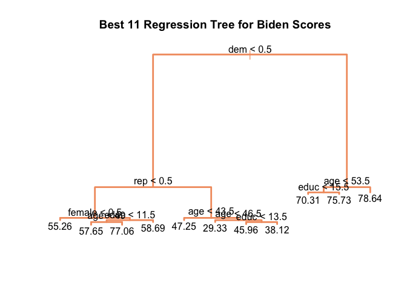 The new tree predicts that Biden feeling ratings will be consistently high among Democrats, especially high among those older than 53.5 years. Those who are not Democrats, specifically Republicans, will have the lowest Biden feeling ratings, with the lowest rating being predicted for Republicans younger than 46.5 years old. For Democrats, age is the most important predictor, followed by education. For Republicans, the same pattern is seen. For those who are not Democrats and not Republicans, gender is the most important indicator.

### 4

``` r
df = read.csv('data/biden.csv')
df$Party[df$dem == 1] = 'Democrat'
df$Party[df$dem == 0 & df$rep == 0] = 'No Affiliation'
df$Party[df$rep == 1] = 'Republican'

set.seed(1234)

biden_split7030 = resample_partition(df, c(test = 0.3, train = 0.7))
biden_train70 = biden_split7030$train %>%
                tbl_df()
biden_test30 = biden_split7030$test %>%
               tbl_df()

biden_bag_data_train = biden_train70 %>%
                       select(-Party) %>%
                       mutate_each(funs(as.factor(.)), dem, rep) %>%
                       na.omit

biden_bag_data_test = biden_test30 %>%
                      select(-Party) %>%
                      mutate_each(funs(as.factor(.)), dem, rep) %>%
                      na.omit

# estimate model
(bag_biden <- randomForest(biden ~ ., data = biden_bag_data_train, mtry = 5, ntree = 500, importance=TRUE))
```

    ## 
    ## Call:
    ##  randomForest(formula = biden ~ ., data = biden_bag_data_train,      mtry = 5, ntree = 500, importance = TRUE) 
    ##                Type of random forest: regression
    ##                      Number of trees: 500
    ## No. of variables tried at each split: 5
    ## 
    ##           Mean of squared residuals: 497.3165
    ##                     % Var explained: 8.91

``` r
# find MSE
mse_bag_biden = mse(bag_biden, biden_bag_data_test)
```

Using the bagging approach, we obtain an MSE of 486.1014025, which is much higher than the MSE from the pruned tree. The amount of variation explained is very low at 8.91%.

``` r
set.seed(1234)

bag_biden_importance = as.data.frame(importance(bag_biden))

ggplot(bag_biden_importance, mapping=aes(x=rownames(bag_biden_importance), y=IncNodePurity)) +
       geom_bar(stat="identity", aes(fill=IncNodePurity)) +
       labs(title = "Average Increased Node Purity Across 500 Regression Trees",
       subtitle = "Predicted Warmth Toward Joe Biden (2008)",
       x = "Variable",
       y = "Mean Increased Node Purity") + 
       theme(plot.title = element_text(hjust = 0.5), plot.subtitle = element_text(hjust = 0.5),
             panel.border = element_rect(linetype = "solid", color = "grey70", fill=NA, size=1.1), legend.position = 'none') 
```

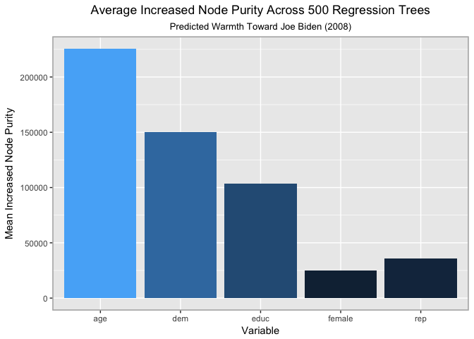 As can be seen from the above graph, `age` and `dem` are the variables with the highest average increases in node purity across 500 bagged regression trees. This means that `age` and `dem` are the most indicative variables in the model, while `female` is the least indicative variable.

### 5

``` r
set.seed(1234)

(biden_rf <- randomForest(biden ~ ., data = biden_bag_data_train,mtry =2,ntree = 500))
```

    ## 
    ## Call:
    ##  randomForest(formula = biden ~ ., data = biden_bag_data_train,      mtry = 2, ntree = 500) 
    ##                Type of random forest: regression
    ##                      Number of trees: 500
    ## No. of variables tried at each split: 2
    ## 
    ##           Mean of squared residuals: 404.3644
    ##                     % Var explained: 25.94

``` r
mse_rf = mse(biden_rf, biden_bag_data_test)

rf_biden_importance = as.data.frame(importance(biden_rf))

ggplot(rf_biden_importance, mapping=aes(x=rownames(rf_biden_importance), y=IncNodePurity)) +
       geom_bar(stat="identity", aes(fill=IncNodePurity)) +
       labs(title = "Average Increased Node Purity Across 500 Regression Trees",
       subtitle = "Predicted Warmth Toward Joe Biden (2008)",
       x = "Variable",
       y = "Mean Increased Node Purity") + 
       theme(plot.title = element_text(hjust = 0.5), plot.subtitle = element_text(hjust = 0.5),
             panel.border = element_rect(linetype = "solid", color = "grey70", fill=NA, size=1.1), legend.position = 'none')
```

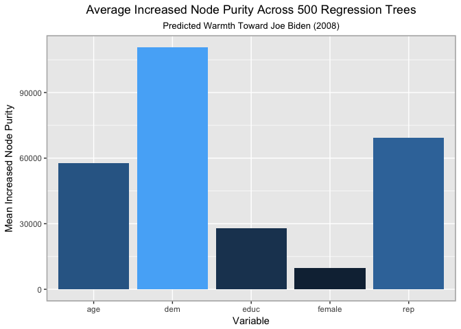 The MSE for this model is 403.306433, which is much less than the MSE from the bagged method of 486.1014025.

``` r
varImpPlot(biden_rf)
```

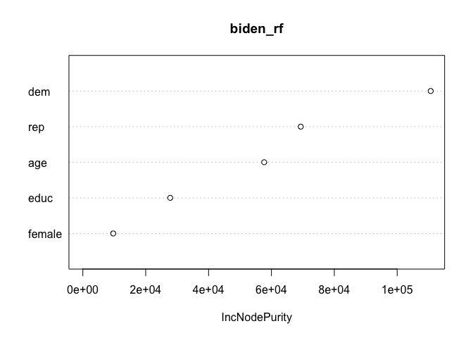

``` r
importance(biden_rf)
```

    ##        IncNodePurity
    ## female      9658.604
    ## age        57686.343
    ## educ       27792.406
    ## dem       110670.025
    ## rep        69331.466

The random forest model with mtry of 2 shows that `dem` and `rep` are the most important variables in the model because they result in the highest increase in node purity. m is the random sample of predictors from the entire set of p predictors that are chosen to be included in the model. Using the random sample of m means that we avoid the possibility that all of our trees will look very similiar and be dominated by one or two variables. Using a random sample of predictors lowers the error rate obtained, since the effects of the rest of the variables will be able to be discerned as we create trees that are not consistently dominated by the strongest variables.

### 6

``` r
set.seed(1234)
biden_models <- list("boosting_depth1" = gbm(as.numeric(biden) - 1 ~ .,
                                               data = biden_bag_data_train,
                                               n.trees = 10000, interaction.depth = 1),
                       "boosting_depth2" = gbm(as.numeric(biden) - 1 ~ .,
                                               data = biden_bag_data_train,
                                               n.trees = 10000, interaction.depth = 2),
                       "boosting_depth4" = gbm(as.numeric(biden) - 1 ~ .,
                                               data = biden_bag_data_train,
                                               n.trees = 10000, interaction.depth = 4))
```

    ## Distribution not specified, assuming gaussian ...
    ## Distribution not specified, assuming gaussian ...
    ## Distribution not specified, assuming gaussian ...

``` r
data_frame(depth = c(1, 2, 4),
           model = biden_models[c("boosting_depth1", "boosting_depth2", "boosting_depth4")],
           optimal = map_dbl(model, gbm.perf, plot.it = FALSE)) %>%
  select(-model) %>%
  knitr::kable(caption = "Optimal number of boosting iterations",
               col.names = c("Depth", "Optimal number of iterations"))
```

    ## Using OOB method...

    ## Warning in .f(.x[[i]], ...): OOB generally underestimates the optimal
    ## number of iterations although predictive performance is reasonably
    ## competitive. Using cv.folds>0 when calling gbm usually results in improved
    ## predictive performance.

    ## Using OOB method...

    ## Warning in .f(.x[[i]], ...): OOB generally underestimates the optimal
    ## number of iterations although predictive performance is reasonably
    ## competitive. Using cv.folds>0 when calling gbm usually results in improved
    ## predictive performance.

    ## Using OOB method...

    ## Warning in .f(.x[[i]], ...): OOB generally underestimates the optimal
    ## number of iterations although predictive performance is reasonably
    ## competitive. Using cv.folds>0 when calling gbm usually results in improved
    ## predictive performance.

|  Depth|  Optimal number of iterations|
|------:|-----------------------------:|
|      1|                          3302|
|      2|                          2700|
|      4|                          2094|

``` r
biden_boost_1 = gbm(as.numeric(biden) - 1 ~ .,
                                               data = biden_bag_data_train,
                                               n.trees = 3302, interaction.depth = 1)
```

    ## Distribution not specified, assuming gaussian ...

``` r
biden_boost_2 = gbm(as.numeric(biden) - 1 ~ .,
                                               data = biden_bag_data_train,
                                               n.trees = 2700, interaction.depth = 2)
```

    ## Distribution not specified, assuming gaussian ...

``` r
biden_boost_4 = gbm(as.numeric(biden) - 1 ~ .,
                                               data = biden_bag_data_train,
                                               n.trees = 2094, interaction.depth = 4)
```

    ## Distribution not specified, assuming gaussian ...

``` r
predict.gbm <- function (object, newdata, n.trees, type = "link", single.tree = FALSE, ...) {
  if (missing(n.trees)) {
    if (object$train.fraction < 1) {
      n.trees <- gbm.perf(object, method = "test", plot.it = FALSE)
    }
    else if (!is.null(object$cv.error)) {
      n.trees <- gbm.perf(object, method = "cv", plot.it = FALSE)
    }
    else {
      n.trees <- length(object$train.error)
    }
    cat(paste("Using", n.trees, "trees...\n"))
    gbm::predict.gbm(object, newdata, n.trees, type, single.tree, ...)
  }
}
mse_1 = mse(biden_boost_1,biden_bag_data_test)
```

    ## Using 3302 trees...

``` r
mse_1
```

    ## [1] 405.5757

``` r
mse_2 = mse(biden_boost_2,biden_bag_data_test)
```

    ## Using 2700 trees...

``` r
mse_2
```

    ## [1] 402.9977

``` r
mse_4 = mse(biden_boost_4,biden_bag_data_test)
```

    ## Using 2094 trees...

``` r
mse_4
```

    ## [1] 404.6245

From the above results, we can see that using a depth of 2 with 2700 trees results in the lowest MSE of 402.9977. All of the MSEs obtained from each depth are lower than the MSEs obtained from the bagging and random forest methods.

``` r
set.seed(1234)

biden_boost_1 = gbm(as.numeric(biden) - 1 ~ .,
                                               data = biden_bag_data_train,
                                               n.trees = 3302, interaction.depth = 1,shrinkage=0.0005)
```

    ## Distribution not specified, assuming gaussian ...

``` r
biden_boost_2 = gbm(as.numeric(biden) - 1 ~ .,
                                               data = biden_bag_data_train,
                                               n.trees = 2700, interaction.depth = 2,shrinkage=0.0005)
```

    ## Distribution not specified, assuming gaussian ...

``` r
biden_boost_4 = gbm(as.numeric(biden) - 1 ~ .,
                                               data = biden_bag_data_train,
                                               n.trees = 2094, interaction.depth = 4,shrinkage=0.0005)
```

    ## Distribution not specified, assuming gaussian ...

``` r
mse_1 = mse(biden_boost_1,biden_bag_data_test)
```

    ## Using 3302 trees...

``` r
mse_1
```

    ## [1] 421.6508

``` r
mse_2 = mse(biden_boost_2,biden_bag_data_test)
```

    ## Using 2700 trees...

``` r
mse_2
```

    ## [1] 418.6148

``` r
mse_4 = mse(biden_boost_4,biden_bag_data_test)
```

    ## Using 2094 trees...

``` r
mse_4
```

    ## [1] 423.2495

Decreasing the value of the shrinkage parameter to be 0.0005 has increased the values of the MSE. Lambda is the rate at which the boosting method learns and so decreasing this rate will decrease the rate at which the model learns. Keeping the number of trees constant will result in higher MSEs since the model is not learning quickly enough to lower the error within the constraint of the number of trees it has been given.

Part 2
------

### 1

``` r
(mh <- read_csv("data/mental_health.csv") %>%
  mutate_each(funs(as.factor(.)), vote96, black, female, married) %>%
  na.omit)
```

    ## Parsed with column specification:
    ## cols(
    ##   vote96 = col_double(),
    ##   mhealth_sum = col_double(),
    ##   age = col_double(),
    ##   educ = col_double(),
    ##   black = col_double(),
    ##   female = col_double(),
    ##   married = col_double(),
    ##   inc10 = col_double()
    ## )

    ## # A tibble: 1,165 × 8
    ##    vote96 mhealth_sum   age  educ  black female married   inc10
    ##    <fctr>       <dbl> <dbl> <dbl> <fctr> <fctr>  <fctr>   <dbl>
    ## 1       1           0    60    12      0      0       0  4.8149
    ## 2       1           1    36    12      0      0       1  8.8273
    ## 3       0           7    21    13      0      0       0  1.7387
    ## 4       0           6    29    13      0      0       0 10.6998
    ## 5       1           1    41    15      1      1       1  8.8273
    ## 6       1           2    48    20      0      0       1  8.8273
    ## 7       0           9    20    12      0      1       0  7.2223
    ## 8       0          12    27    11      0      1       0  1.2037
    ## 9       1           2    28    16      0      0       1  7.2223
    ## 10      1           0    72    14      0      0       1  4.0124
    ## # ... with 1,155 more rows

``` r
set.seed(5678)
mh_split <- resample_partition(mh, p = c("test" = .3, "train" = .7))
```

``` r
mh_tree <- tree(vote96 ~ educ, data = as_tibble(mh_split$train))
mh_tree
```

    ## node), split, n, deviance, yval, (yprob)
    ##       * denotes terminal node
    ## 
    ## 1) root 816 1033.0 1 ( 0.3284 0.6716 )  
    ##   2) educ < 14.5 554  746.0 1 ( 0.4007 0.5993 )  
    ##     4) educ < 11.5 132  182.7 0 ( 0.5227 0.4773 ) *
    ##     5) educ > 11.5 422  552.7 1 ( 0.3626 0.6374 ) *
    ##   3) educ > 14.5 262  243.5 1 ( 0.1756 0.8244 ) *

``` r
plot(mh_tree)
text(mh_tree, pretty = 0)
```


``` r
fitted <- predict(mh_tree, as_tibble(mh_split$test), type = "class")
tree_err <- mean(as_tibble(mh_split$test)$vote96 != fitted)
tree_err
```

    ## [1] 0.3008596

``` r
roc_tree1 <- roc(as.numeric(as_tibble(mh_split$test)$vote96), as.numeric(fitted))
plot(roc_tree1)
```


``` r
auc(roc_tree1)
```

    ## Area under the curve: 0.5792

``` r
mh_tree <- tree(vote96 ~ educ + mhealth_sum, data = as_tibble(mh_split$train))
mh_tree
```

    ## node), split, n, deviance, yval, (yprob)
    ##       * denotes terminal node
    ## 
    ## 1) root 816 1033.0 1 ( 0.3284 0.6716 )  
    ##   2) mhealth_sum < 4.5 639  740.3 1 ( 0.2660 0.7340 )  
    ##     4) educ < 15.5 450  570.1 1 ( 0.3289 0.6711 ) *
    ##     5) educ > 15.5 189  136.0 1 ( 0.1164 0.8836 ) *
    ##   3) mhealth_sum > 4.5 177  243.3 0 ( 0.5537 0.4463 ) *

``` r
plot(mh_tree)
text(mh_tree, pretty = 0)
```


``` r
fitted <- predict(mh_tree, as_tibble(mh_split$test), type = "class")
tree_err <- mean(as_tibble(mh_split$test)$vote96 != fitted)
tree_err
```

    ## [1] 0.3008596

``` r
roc_tree2 <- roc(as.numeric(as_tibble(mh_split$test)$vote96), as.numeric(fitted))
plot(roc_tree2)
```

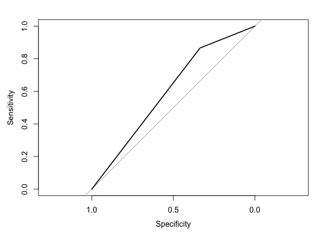

``` r
auc(roc_tree2)
```

    ## Area under the curve: 0.6012

``` r
mh_tree <- tree(vote96 ~ educ + mhealth_sum + age, data = as_tibble(mh_split$train))
mh_tree
```

    ## node), split, n, deviance, yval, (yprob)
    ##       * denotes terminal node
    ## 
    ##  1) root 816 1033.000 1 ( 0.32843 0.67157 )  
    ##    2) age < 44.5 448  614.000 1 ( 0.43750 0.56250 )  
    ##      4) educ < 13.5 243  332.900 0 ( 0.56379 0.43621 ) *
    ##      5) educ > 13.5 205  246.100 1 ( 0.28780 0.71220 )  
    ##       10) mhealth_sum < 3.5 153  156.900 1 ( 0.20915 0.79085 )  
    ##         20) educ < 16.5 119  136.500 1 ( 0.26050 0.73950 ) *
    ##         21) educ > 16.5 34    9.023 1 ( 0.02941 0.97059 ) *
    ##       11) mhealth_sum > 3.5 52   72.010 0 ( 0.51923 0.48077 ) *
    ##    3) age > 44.5 368  363.800 1 ( 0.19565 0.80435 )  
    ##      6) educ < 12.5 180  216.400 1 ( 0.28889 0.71111 )  
    ##       12) mhealth_sum < 4.5 138  144.500 1 ( 0.21739 0.78261 ) *
    ##       13) mhealth_sum > 4.5 42   58.130 0 ( 0.52381 0.47619 ) *
    ##      7) educ > 12.5 188  127.400 1 ( 0.10638 0.89362 ) *

``` r
plot(mh_tree)
text(mh_tree, pretty = 0)
```


``` r
fitted <- predict(mh_tree, as_tibble(mh_split$test), type = "class")
tree_err <- mean(as_tibble(mh_split$test)$vote96 != fitted)
tree_err
```

    ## [1] 0.2893983

``` r
roc_tree3 <- roc(as.numeric(as_tibble(mh_split$test)$vote96), as.numeric(fitted))
plot(roc_tree3)
```


``` r
auc(roc_tree3)
```

    ## Area under the curve: 0.6857

``` r
mh_tree <- tree(vote96 ~ educ + mhealth_sum + age + inc10, data = as_tibble(mh_split$train))
mh_tree
```

    ## node), split, n, deviance, yval, (yprob)
    ##       * denotes terminal node
    ## 
    ##  1) root 816 1033.00 1 ( 0.3284 0.6716 )  
    ##    2) age < 44.5 448  614.00 1 ( 0.4375 0.5625 )  
    ##      4) educ < 13.5 243  332.90 0 ( 0.5638 0.4362 ) *
    ##      5) educ > 13.5 205  246.10 1 ( 0.2878 0.7122 )  
    ##       10) mhealth_sum < 3.5 153  156.90 1 ( 0.2092 0.7908 )  
    ##         20) inc10 < 2.40745 31   42.68 1 ( 0.4516 0.5484 ) *
    ##         21) inc10 > 2.40745 122  102.10 1 ( 0.1475 0.8525 )  
    ##           42) educ < 16.5 89   89.62 1 ( 0.2022 0.7978 ) *
    ##           43) educ > 16.5 33    0.00 1 ( 0.0000 1.0000 ) *
    ##       11) mhealth_sum > 3.5 52   72.01 0 ( 0.5192 0.4808 ) *
    ##    3) age > 44.5 368  363.80 1 ( 0.1957 0.8043 )  
    ##      6) educ < 12.5 180  216.40 1 ( 0.2889 0.7111 )  
    ##       12) mhealth_sum < 4.5 138  144.50 1 ( 0.2174 0.7826 )  
    ##         24) inc10 < 1.08335 31   42.68 1 ( 0.4516 0.5484 ) *
    ##         25) inc10 > 1.08335 107   90.29 1 ( 0.1495 0.8505 ) *
    ##       13) mhealth_sum > 4.5 42   58.13 0 ( 0.5238 0.4762 ) *
    ##      7) educ > 12.5 188  127.40 1 ( 0.1064 0.8936 ) *

``` r
plot(mh_tree)
text(mh_tree, pretty = 0)
```


``` r
fitted <- predict(mh_tree, as_tibble(mh_split$test), type = "class")
tree_err <- mean(as_tibble(mh_split$test)$vote96 != fitted)
tree_err
```

    ## [1] 0.2893983

``` r
roc_tree4 <- roc(as.numeric(as_tibble(mh_split$test)$vote96), as.numeric(fitted))
plot(roc_tree4)
```

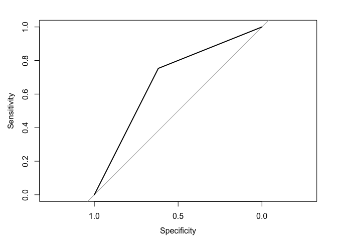

``` r
auc(roc_tree4)
```

    ## Area under the curve: 0.6857

``` r
mh_tree <- tree(vote96 ~ ., data = as_tibble(mh_split$train))
mh_tree
```

    ## node), split, n, deviance, yval, (yprob)
    ##       * denotes terminal node
    ## 
    ##  1) root 816 1033.00 1 ( 0.3284 0.6716 )  
    ##    2) age < 44.5 448  614.00 1 ( 0.4375 0.5625 )  
    ##      4) educ < 13.5 243  332.90 0 ( 0.5638 0.4362 ) *
    ##      5) educ > 13.5 205  246.10 1 ( 0.2878 0.7122 )  
    ##       10) mhealth_sum < 3.5 153  156.90 1 ( 0.2092 0.7908 )  
    ##         20) inc10 < 2.40745 31   42.68 1 ( 0.4516 0.5484 ) *
    ##         21) inc10 > 2.40745 122  102.10 1 ( 0.1475 0.8525 )  
    ##           42) educ < 16.5 89   89.62 1 ( 0.2022 0.7978 ) *
    ##           43) educ > 16.5 33    0.00 1 ( 0.0000 1.0000 ) *
    ##       11) mhealth_sum > 3.5 52   72.01 0 ( 0.5192 0.4808 ) *
    ##    3) age > 44.5 368  363.80 1 ( 0.1957 0.8043 )  
    ##      6) educ < 12.5 180  216.40 1 ( 0.2889 0.7111 )  
    ##       12) mhealth_sum < 4.5 138  144.50 1 ( 0.2174 0.7826 )  
    ##         24) inc10 < 1.08335 31   42.68 1 ( 0.4516 0.5484 ) *
    ##         25) inc10 > 1.08335 107   90.29 1 ( 0.1495 0.8505 ) *
    ##       13) mhealth_sum > 4.5 42   58.13 0 ( 0.5238 0.4762 ) *
    ##      7) educ > 12.5 188  127.40 1 ( 0.1064 0.8936 ) *

``` r
plot(mh_tree)
text(mh_tree, pretty = 0)
```

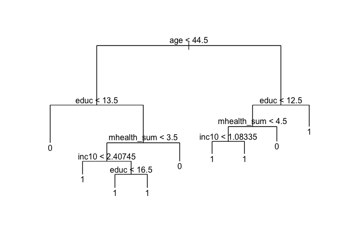

``` r
fitted <- predict(mh_tree, as_tibble(mh_split$test), type = "class")
tree_err <- mean(as_tibble(mh_split$test)$vote96 != fitted)
tree_err
```

    ## [1] 0.2893983

``` r
roc_tree5 <- roc(as.numeric(as_tibble(mh_split$test)$vote96), as.numeric(fitted))
plot(roc_tree5)
```


``` r
auc(roc_tree5)
```

    ## Area under the curve: 0.6857

``` r
plot(roc_tree1, print.auc = TRUE, col = "blue", print.auc.x = .2)
plot(roc_tree2, print.auc = TRUE, col = "red", print.auc.x = .2, print.auc.y = .4, add = TRUE)
plot(roc_tree3, print.auc = TRUE, col = "orange", print.auc.x = .2, print.auc.y = .3, add = TRUE)
plot(roc_tree4, print.auc = TRUE, col = "green", print.auc.x = .2, print.auc.y = .2, add = TRUE)
plot(roc_tree5, print.auc = TRUE, col = "purple", print.auc.x = .2, print.auc.y = .1, add = TRUE)
```

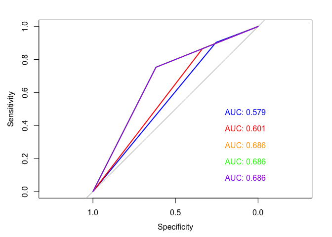

As can be seen above, the models I chose were varying in which predictor variables were chosen. The first model contains only the predictor variable `educ`. The second model contains `educ` and `mhealth_sum`. In the third model I included `educ`, `mhealth_sum`, and `age`. The fourth model is the same as the third except I also added `inc10`. Finally, the fifth model includes all possible predictor variables, which means that it adds `black`, `female` and `married` to the predictors already in model 4. The areas under the curve and the test tree errors are exactly the same for models 3, 4, and 5. As can be seen in the final graph above, the area under the curve for these models is the highest at 0.686. Since the addition of the predictors of `black`, `female`, `married`, and `inc10` do not add any area under the curve or diminish the error in the tree, I believe that model 3 is the optimal model. It has the highest area under the curve and lowest error while not adding variables that do not increase the predictive abilities of the model while increasing computational cost.

With an AUC of 0.686 and an error of 0.289, model 3 is the best model. Age is the most important predictor, followed by education and mental health index. We can interpret the tree for model 3 (seen below) using hypothetical observations. First, an individual who is less than 44.5 years old and has less than 13.5 years of education is predicted to not have voted. On the other hand, an individual (individual A) who is less than 44.5 years old and has greater than 13.5 years of education and a health index of less than 3.5 is predicted to have voted. If an individual has all of the same characteristics as individual A except with a mental health index greater than 3.5 is predicted to not have voted. For individuals older than 44.5 years old, the line of demarcation for education is at 12.5 years rather than 13.5. An individual older than 44.5 years old and with less than 12.5 years of education will be predicted to not have voted if they have a mental health index greater than 4.5.

It is interesting to not that younger individuals who have less education are predicted to not have voted regardless of their mental health index and older individuals with more education are predicted to have voted regardless of their mental health index.

``` r
mh_tree <- tree(vote96 ~ educ + mhealth_sum + age, data = as_tibble(mh_split$train))
mh_tree
```

    ## node), split, n, deviance, yval, (yprob)
    ##       * denotes terminal node
    ## 
    ##  1) root 816 1033.000 1 ( 0.32843 0.67157 )  
    ##    2) age < 44.5 448  614.000 1 ( 0.43750 0.56250 )  
    ##      4) educ < 13.5 243  332.900 0 ( 0.56379 0.43621 ) *
    ##      5) educ > 13.5 205  246.100 1 ( 0.28780 0.71220 )  
    ##       10) mhealth_sum < 3.5 153  156.900 1 ( 0.20915 0.79085 )  
    ##         20) educ < 16.5 119  136.500 1 ( 0.26050 0.73950 ) *
    ##         21) educ > 16.5 34    9.023 1 ( 0.02941 0.97059 ) *
    ##       11) mhealth_sum > 3.5 52   72.010 0 ( 0.51923 0.48077 ) *
    ##    3) age > 44.5 368  363.800 1 ( 0.19565 0.80435 )  
    ##      6) educ < 12.5 180  216.400 1 ( 0.28889 0.71111 )  
    ##       12) mhealth_sum < 4.5 138  144.500 1 ( 0.21739 0.78261 ) *
    ##       13) mhealth_sum > 4.5 42   58.130 0 ( 0.52381 0.47619 ) *
    ##      7) educ > 12.5 188  127.400 1 ( 0.10638 0.89362 ) *

``` r
plot(mh_tree)
text(mh_tree, pretty = 0)
```


### 2

Model 1: Linear Kernel with education, age, mhealthsum

``` r
set.seed(1234)
mh_split <- resample_partition(mh, p = c("test" = .3, "train" = .7))

mh_lin_tune <- tune(svm, vote96 ~ educ + age + mhealth_sum, data = as_tibble(mh_split$train),
                    kernel = "linear",
                    range = list(cost = c(.001, .01, .1, 1, 5, 10, 100)))

mh_lin <- mh_lin_tune$best.model
summary(mh_lin)
```

    ## 
    ## Call:
    ## best.tune(method = svm, train.x = vote96 ~ educ + age + mhealth_sum, 
    ##     data = as_tibble(mh_split$train), ranges = list(cost = c(0.001, 
    ##         0.01, 0.1, 1, 5, 10, 100)), kernel = "linear")
    ## 
    ## 
    ## Parameters:
    ##    SVM-Type:  C-classification 
    ##  SVM-Kernel:  linear 
    ##        cost:  1 
    ##       gamma:  0.3333333 
    ## 
    ## Number of Support Vectors:  511
    ## 
    ##  ( 255 256 )
    ## 
    ## 
    ## Number of Classes:  2 
    ## 
    ## Levels: 
    ##  0 1

``` r
fitted <- predict(mh_lin, as_tibble(mh_split$test), decision.values = TRUE) %>%
  attributes


roc_line <- roc(as_tibble(mh_split$test)$vote96, fitted$decision.values)
```

    ## Warning in roc.default(as_tibble(mh_split$test)$vote96, fitted
    ## $decision.values): Deprecated use a matrix as predictor. Unexpected results
    ## may be produced, please pass a numeric vector.

``` r
auc(roc_line)
```

    ## Area under the curve: 0.7365

``` r
plot(roc_line, main = "ROC of Voter Turnout - Linear Kernel, Partial Model")
```

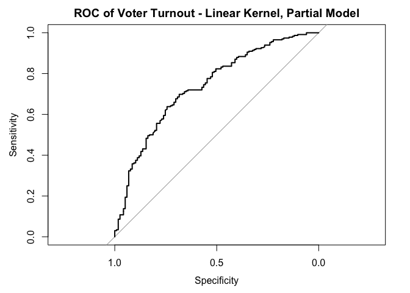 The area under the curve is 0.737.

Model 2: Linear Kernel with all variables

``` r
mh_lin_all <- tune(svm, vote96 ~ ., data = as_tibble(mh_split$train),
                    kernel = "linear",
                    range = list(cost = c(.001, .01, .1, 1, 5, 10, 100)))

mh_lall <- mh_lin_all$best.model
summary(mh_lall)
```

    ## 
    ## Call:
    ## best.tune(method = svm, train.x = vote96 ~ ., data = as_tibble(mh_split$train), 
    ##     ranges = list(cost = c(0.001, 0.01, 0.1, 1, 5, 10, 100)), 
    ##     kernel = "linear")
    ## 
    ## 
    ## Parameters:
    ##    SVM-Type:  C-classification 
    ##  SVM-Kernel:  linear 
    ##        cost:  10 
    ##       gamma:  0.125 
    ## 
    ## Number of Support Vectors:  507
    ## 
    ##  ( 255 252 )
    ## 
    ## 
    ## Number of Classes:  2 
    ## 
    ## Levels: 
    ##  0 1

``` r
fitted <- predict(mh_lall, as_tibble(mh_split$test), decision.values = TRUE) %>%
  attributes


roc_line_all <- roc(as_tibble(mh_split$test)$vote96, fitted$decision.values)
```

    ## Warning in roc.default(as_tibble(mh_split$test)$vote96, fitted
    ## $decision.values): Deprecated use a matrix as predictor. Unexpected results
    ## may be produced, please pass a numeric vector.

``` r
auc(roc_line_all)
```

    ## Area under the curve: 0.746

``` r
plot(roc_line_all, main = "ROC of Voter Turnout- Linear Kernel, Total Model")
```

 Area under the curve is 0.746.

Model 3: Polynomial Kernel with education, age, mhealth

``` r
mh_poly_tune <- tune(svm, vote96 ~ age + educ + mhealth_sum, data = as_tibble(mh_split$train),
                    kernel = "polynomial",
                    range = list(cost = c(.001, .01, .1, 1, 5, 10, 100)))

mh_poly <- mh_poly_tune$best.model
summary(mh_poly)
```

    ## 
    ## Call:
    ## best.tune(method = svm, train.x = vote96 ~ age + educ + mhealth_sum, 
    ##     data = as_tibble(mh_split$train), ranges = list(cost = c(0.001, 
    ##         0.01, 0.1, 1, 5, 10, 100)), kernel = "polynomial")
    ## 
    ## 
    ## Parameters:
    ##    SVM-Type:  C-classification 
    ##  SVM-Kernel:  polynomial 
    ##        cost:  10 
    ##      degree:  3 
    ##       gamma:  0.3333333 
    ##      coef.0:  0 
    ## 
    ## Number of Support Vectors:  494
    ## 
    ##  ( 248 246 )
    ## 
    ## 
    ## Number of Classes:  2 
    ## 
    ## Levels: 
    ##  0 1

``` r
fitted <- predict(mh_poly, as_tibble(mh_split$test), decision.values = TRUE) %>%
  attributes

roc_poly <- roc(as_tibble(mh_split$test)$vote96, fitted$decision.values)
```

    ## Warning in roc.default(as_tibble(mh_split$test)$vote96, fitted
    ## $decision.values): Deprecated use a matrix as predictor. Unexpected results
    ## may be produced, please pass a numeric vector.

``` r
auc(roc_poly)
```

    ## Area under the curve: 0.7428

``` r
plot(roc_poly, main = "ROC of Voter Turnout - Polynomial Kernel, Partial Model")
```

 The area under the curve is 0.741.

Model 4: Polynomial Model A

``` r
mh_poly_all <- tune(svm, vote96 ~ ., data = as_tibble(mh_split$train),
                    kernel = "polynomial",
                    range = list(cost = c(.001, .01, .1, 1, 5, 10, 100)))

mh_poly <- mh_poly_all$best.model
summary(mh_poly)
```

    ## 
    ## Call:
    ## best.tune(method = svm, train.x = vote96 ~ ., data = as_tibble(mh_split$train), 
    ##     ranges = list(cost = c(0.001, 0.01, 0.1, 1, 5, 10, 100)), 
    ##     kernel = "polynomial")
    ## 
    ## 
    ## Parameters:
    ##    SVM-Type:  C-classification 
    ##  SVM-Kernel:  polynomial 
    ##        cost:  5 
    ##      degree:  3 
    ##       gamma:  0.125 
    ##      coef.0:  0 
    ## 
    ## Number of Support Vectors:  495
    ## 
    ##  ( 258 237 )
    ## 
    ## 
    ## Number of Classes:  2 
    ## 
    ## Levels: 
    ##  0 1

``` r
fitted <- predict(mh_poly, as_tibble(mh_split$test), decision.values = TRUE) %>%
  attributes

roc_poly_all <- roc(as_tibble(mh_split$test)$vote96, fitted$decision.values)
```

    ## Warning in roc.default(as_tibble(mh_split$test)$vote96, fitted
    ## $decision.values): Deprecated use a matrix as predictor. Unexpected results
    ## may be produced, please pass a numeric vector.

``` r
auc(roc_poly_all)
```

    ## Area under the curve: 0.7413

``` r
plot(roc_poly_all, main = "ROC of Voter Turnout - Polynomial Kernel, Total Model")
```

 Area under the curve: 0.741.

Model 5: Radial Kernel

``` r
mh_rad_tune <- tune(svm, vote96 ~ ., data = as_tibble(mh_split$train),
                    kernel = "radial",
                    range = list(cost = c(.001, .01, .1, 1, 5, 10, 100)))

mh_rad <- mh_rad_tune$best.model
summary(mh_rad)
```

    ## 
    ## Call:
    ## best.tune(method = svm, train.x = vote96 ~ ., data = as_tibble(mh_split$train), 
    ##     ranges = list(cost = c(0.001, 0.01, 0.1, 1, 5, 10, 100)), 
    ##     kernel = "radial")
    ## 
    ## 
    ## Parameters:
    ##    SVM-Type:  C-classification 
    ##  SVM-Kernel:  radial 
    ##        cost:  5 
    ##       gamma:  0.125 
    ## 
    ## Number of Support Vectors:  494
    ## 
    ##  ( 258 236 )
    ## 
    ## 
    ## Number of Classes:  2 
    ## 
    ## Levels: 
    ##  0 1

``` r
fitted <- predict(mh_rad, as_tibble(mh_split$test), decision.values = TRUE) %>%
  attributes

roc_rad <- roc(as_tibble(mh_split$test)$vote96, fitted$decision.values)
```

    ## Warning in roc.default(as_tibble(mh_split$test)$vote96, fitted
    ## $decision.values): Deprecated use a matrix as predictor. Unexpected results
    ## may be produced, please pass a numeric vector.

``` r
auc(roc_rad)
```

    ## Area under the curve: 0.7369

``` r
plot(roc_rad, main= "ROC of Voter Turnout - Radial Kernel, Total Model")
```

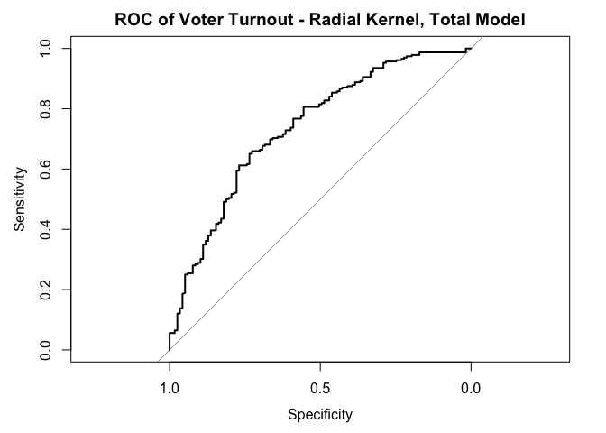 Area under the curve is 0.737.

``` r
plot(roc_line, print.auc = TRUE, col = "blue", print.auc.x = .2)
plot(roc_line_all, print.auc = TRUE, col = "red", print.auc.x = .2, print.auc.y = .4, add = TRUE)
plot(roc_poly, print.auc = TRUE, col = "orange", print.auc.x = .2, print.auc.y = .3, add = TRUE)
plot(roc_poly_all, print.auc = TRUE, col = "green", print.auc.x = .2, print.auc.y = .2, add = TRUE)
plot(roc_rad, print.auc = TRUE, col = "purple", print.auc.x = .2, print.auc.y = .1, add = TRUE)
```


The model with the highest area under the curve is the second model, the linear kernel with all possible predictors. However, this model also has a cost that is ten times that of the first model, which is also a linear kernel but only including predictors for education, age, and mental health index. This model has a cost of 1 and very low error at that cost of less than 0.3, as can be seen in the first plot below. Because of this, even with a low cost the margins are narrow around the linear hyperplane.

The second plot below shows the performance for the model with the highest AUC, which is the linear kernal model with all possible predictors. As can be seen, the second model also has a very low error rate at a cost of 10. Performing at a cost of 1, this model would have a relatively higher error rate compared to the first model, though still below 0.3. Because of the low error rate, I would choose the second model, the linear kernal with all possible predictors, as the best model. Even though it does have a high cost, it also has substantially greater area under the curve of 0.746, when compared to the first model of 0.737.

``` r
plot(mh_lin_tune)
```


``` r
plot(mh_lin_all)
```


Part 3
------

### 1

In order the find the relationship between race and O.J. Simpson's guilt, I decided an obvious option was to use logistic regression. Since `guilt` is a dichotomous variable and also the response variable, a logistic regression would correctly exhibit the effect of the predictor variables on the log odds of finding O.J. guilty. As can be seen in the summary below, by including every possible predictor variable, we see that being a republican increases the log odds of finding him guilting by about 0.5 and is significant at a 95% confidence interval. As age increased, the log odds of finding him guilty also increased. Other significant effects on the response variable were seen: being a high school grad and not being a high school grad both decreased the log odds, being a female and being black also decreased the log odds, and also refusing to state income also decreased the log odds and making an income of over $75,000 increased the log odds (though only at a 90% confidence level).

``` r
oj <- read.csv('data/simpson.csv')

oj_log <- glm(guilt ~ ., data = oj, family = binomial)
summary(oj_log)
```

    ## 
    ## Call:
    ## glm(formula = guilt ~ ., family = binomial, data = oj)
    ## 
    ## Deviance Residuals: 
    ##     Min       1Q   Median       3Q      Max  
    ## -2.5152  -0.5298   0.5031   0.6697   2.3807  
    ## 
    ## Coefficients: (1 not defined because of singularities)
    ##                                       Estimate Std. Error z value Pr(>|z|)
    ## (Intercept)                           0.965141   0.345218   2.796  0.00518
    ## dem                                   0.074649   0.224194   0.333  0.73916
    ## rep                                   0.513657   0.234447   2.191  0.02846
    ## ind                                         NA         NA      NA       NA
    ## age                                   0.019306   0.004423   4.365 1.27e-05
    ## educHIGH SCHOOL GRAD                 -0.425116   0.190683  -2.229  0.02578
    ## educNOT A HIGH SCHOOL GRAD           -1.131850   0.282606  -4.005 6.20e-05
    ## educREFUSED                          13.322001 478.030491   0.028  0.97777
    ## educSOME COLLEGE(TRADE OR BUSINESS)  -0.288948   0.200376  -1.442  0.14929
    ## female                               -0.358785   0.149088  -2.407  0.01610
    ## black                                -2.923476   0.193334 -15.121  < 2e-16
    ## hispanic                             -0.196967   0.259145  -0.760  0.44722
    ## income$30,000-$50,000                -0.122000   0.190129  -0.642  0.52109
    ## income$50,000-$75,000                 0.178103   0.247478   0.720  0.47173
    ## incomeOVER $75,000                    0.521352   0.311864   1.672  0.09458
    ## incomeREFUSED/NO ANSWER              -0.906884   0.315046  -2.879  0.00399
    ## incomeUNDER $15,000                  -0.180074   0.239591  -0.752  0.45230
    ##                                        
    ## (Intercept)                         ** 
    ## dem                                    
    ## rep                                 *  
    ## ind                                    
    ## age                                 ***
    ## educHIGH SCHOOL GRAD                *  
    ## educNOT A HIGH SCHOOL GRAD          ***
    ## educREFUSED                            
    ## educSOME COLLEGE(TRADE OR BUSINESS)    
    ## female                              *  
    ## black                               ***
    ## hispanic                               
    ## income$30,000-$50,000                  
    ## income$50,000-$75,000                  
    ## incomeOVER $75,000                  .  
    ## incomeREFUSED/NO ANSWER             ** 
    ## incomeUNDER $15,000                    
    ## ---
    ## Signif. codes:  0 '***' 0.001 '**' 0.01 '*' 0.05 '.' 0.1 ' ' 1
    ## 
    ## (Dispersion parameter for binomial family taken to be 1)
    ## 
    ##     Null deviance: 1758.1  on 1415  degrees of freedom
    ## Residual deviance: 1271.1  on 1400  degrees of freedom
    ##   (153 observations deleted due to missingness)
    ## AIC: 1303.1
    ## 
    ## Number of Fisher Scoring iterations: 13

Having recently watched the Netflix miniseries about O.J. Simpson :) , I know that the lawyers were concerned with the effect that being a black female compared with being a white female would have on the perception of O.J. and his guilt. In that vein, I decided to include interaction effects between gender and race, `female` and `black` in particular. As can be seen in the summary below, the interaction between `female` and `black` is surprisingly not significant; meaning that

``` r
oj_log_interaction <- glm(guilt ~ . + female*black, data = oj, family = binomial())
tidy(oj_log_interaction)
```

    ##                                   term    estimate    std.error
    ## 1                          (Intercept)  1.02368732 3.484924e-01
    ## 2                                  dem  0.07300811 2.252523e-01
    ## 3                                  rep  0.50408949 2.354764e-01
    ## 4                                  age  0.01939309 4.417034e-03
    ## 5                 educHIGH SCHOOL GRAD -0.42955252 1.911400e-01
    ## 6           educNOT A HIGH SCHOOL GRAD -1.14636552 2.832417e-01
    ## 7                          educREFUSED 13.33285959 4.759686e+02
    ## 8  educSOME COLLEGE(TRADE OR BUSINESS) -0.29011334 2.008275e-01
    ## 9                               female -0.46044490 1.665844e-01
    ## 10                               black -3.24531889 3.056969e-01
    ## 11                            hispanic -0.19881832 2.592675e-01
    ## 12               income$30,000-$50,000 -0.10221874 1.906433e-01
    ## 13               income$50,000-$75,000  0.18780752 2.481189e-01
    ## 14                  incomeOVER $75,000  0.52601720 3.122321e-01
    ## 15             incomeREFUSED/NO ANSWER -0.89401669 3.151194e-01
    ## 16                 incomeUNDER $15,000 -0.16310058 2.389501e-01
    ## 17                        female:black  0.54654893 3.850219e-01
    ##       statistic      p.value
    ## 1    2.93747395 3.308980e-03
    ## 2    0.32411705 7.458494e-01
    ## 3    2.14072197 3.229647e-02
    ## 4    4.39052307 1.130783e-05
    ## 5   -2.24731929 2.461963e-02
    ## 6   -4.04730463 5.181079e-05
    ## 7    0.02801206 9.776525e-01
    ## 8   -1.44458967 1.485732e-01
    ## 9   -2.76403426 5.709155e-03
    ## 10 -10.61613176 2.507373e-26
    ## 11  -0.76684623 4.431729e-01
    ## 12  -0.53617801 5.918355e-01
    ## 13   0.75692559 4.490944e-01
    ## 14   1.68469931 9.204660e-02
    ## 15  -2.83707259 4.552926e-03
    ## 16  -0.68257168 4.948775e-01
    ## 17   1.41952679 1.557455e-01

If we were to simplisitcally look at the relationship between race and O.J. Simpson's guilt, we could include a simple logistic model with only one predictor variable about race. With this model, we see that the variable `black` is very significant and lowers the log odds that a person will find O.J. guilty.

``` r
oj_race <- glm(guilt ~ black, data = oj, family = binomial())
summary(oj_race)
```

    ## 
    ## Call:
    ## glm(formula = guilt ~ black, family = binomial(), data = oj)
    ## 
    ## Deviance Residuals: 
    ##     Min       1Q   Median       3Q      Max  
    ## -1.8233  -0.5926   0.6487   0.6487   1.9110  
    ## 
    ## Coefficients:
    ##             Estimate Std. Error z value Pr(>|z|)    
    ## (Intercept)  1.45176    0.07524   19.30   <2e-16 ***
    ## black       -3.10221    0.18271  -16.98   <2e-16 ***
    ## ---
    ## Signif. codes:  0 '***' 0.001 '**' 0.01 '*' 0.05 '.' 0.1 ' ' 1
    ## 
    ## (Dispersion parameter for binomial family taken to be 1)
    ## 
    ##     Null deviance: 1758.1  on 1415  degrees of freedom
    ## Residual deviance: 1352.2  on 1414  degrees of freedom
    ##   (153 observations deleted due to missingness)
    ## AIC: 1356.2
    ## 
    ## Number of Fisher Scoring iterations: 4

``` r
logit2prob <- function(x){
 exp(x) / (1 + exp(x))
}

accuracy_race <- oj %>%
  add_predictions(oj_race) %>%
  mutate(pred = logit2prob(pred),
         pred = as.numeric(pred > .5))

accuracy_log <- oj %>%
  add_predictions(oj_log) %>%
  mutate(pred = logit2prob(pred),
         pred = as.numeric(pred > .5))
```

    ## Warning in predict.lm(object, newdata, se.fit, scale = 1, type =
    ## ifelse(type == : prediction from a rank-deficient fit may be misleading

``` r
model_accuracy_race = mean(accuracy_race$guilt == accuracy_race$pred, na.rm = TRUE)
model_accuracy_log = mean(accuracy_log$guilt == accuracy_log$pred, na.rm = TRUE)

PRE <- function(model){
  y <- model$y

   y.hat <- round(model$fitted.values)
   
  E1 <- sum(y != median(y))
  E2 <- sum(y != y.hat)


  PRE <- (E1 - E2) / E1
  return(PRE)
}

pre_race <- PRE(oj_race)
auc_race <- auc(accuracy_race$guilt, accuracy_race$pred)
 
model_accuracy_race
```

    ## [1] 0.815678

``` r
pre_race
```

    ## [1] 0.4095023

``` r
auc_race
```

    ## Area under the curve: 0.7313

``` r
pre_log <- PRE(oj_log)
auc_log <- auc(accuracy_log$guilt, accuracy_log$pred)

model_accuracy_log
```

    ## [1] 0.8163842

``` r
pre_log
```

    ## [1] 0.4117647

``` r
auc_log
```

    ## Area under the curve: 0.7362

In both the simple logistic model and the logistic model including all of the possible predictors, `black` is statistically significant and substantially negative. Both estimated betas for the `black` variable are similar to one another, with log odds of -2.9 for the larger model and -3.1 for the simple model. As for accuracy ratings of both models, they are as follows. For the simple model, the model accuracy is about 81.57% with a proportional error reduction of about 0.41 and an area under the curve of 0.731.

The larger model with all possible predictors, is only marginally more accurate, with an accuracy rating of 81.63% and a pre of 0.41 and an area under the curve of 0.736. Both models have a high accuracy rate and both show a substantial and statistically significant negative relationship between being black and finding O.J. Simpson guilty.

### 2

In order to predict whether individuals believe O.J. Simpson to be guilty, I believe it is best to use a tree-based model. Since we are looking for prediction, a decision tree is appropriate since it produces only predictions and not probabilities. The logistic regression used in part one produces probabilities and would not be appropriate for making predictions.

I will first create a tree using a model that includes all possible predictors and plot an unpruned tree.

``` r
set.seed(1234)
oj_split = resample_partition(oj, c(test=.3, train=.7))
oj_train = oj_split$train

ojj <- oj_train %>%
  as_tibble() %>%
  mutate(guilty = factor(guilt, levels = 0:1, labels = c("Not Guilty", "Guilty")))

# estimate model
oj_tree <- tree(guilt ~ ., data = oj,
                     control = tree.control(nobs = nrow(oj),
                            mindev = .001))

# plot unpruned tree
mod <- oj_tree

tree_data <- dendro_data(mod)
ggplot(segment(tree_data)) +
  geom_segment(aes(x = x, y = y, xend = xend, yend = yend), 
               alpha = 0.5) +
  geom_text(data = label(tree_data), 
            aes(x = x, y = y, label = label), vjust = -0.5, size = 3) +
  geom_text(data = leaf_label(tree_data), 
            aes(x = x, y = y, label = label), vjust = 0.5, size = 3) +
  theme_dendro()
```


``` r
mse1 = mse(oj_tree, oj_split$test)
msetest = mse(mod, oj_split$test)
mse1
```

    ## [1] 0.1106595

``` r
msetest
```

    ## [1] 0.1106595

The MSE for this first unpruned tree is 0.111.

But, an unpruned tree is quite difficult to interpret and so I will now find out how many nodes the tree should be pruned to. The graph below shows that the test error rate will be lowest when the tree is pruned to 3 nodes.

``` r
err.rate.tree <- function(model, data) {
  data <- as_tibble(data)
  response <- as.character(model$terms[[2]])
  
  pred <- predict(model, newdata = data, type = "class")
  actual <- data[[response]]
  
  return(mean(pred != actual, na.rm = TRUE))
}

oj_cv2 <- oj %>%
  na.omit() %>%
  crossv_kfold(k = 10) %>%
  mutate(tree = map(train, ~ tree(guilt ~ ., data = .,
     control = tree.control(nobs = nrow(oj),
                            mindev = .001))))

oj_cv2 <- expand.grid(oj_cv2$.id, 2:10) %>%
  as_tibble() %>%
  mutate(Var2 = as.numeric(Var2)) %>%
  rename(.id = Var1,
          k = Var2) %>%
  left_join(oj_cv2) %>%
  mutate(prune = map2(tree, k, ~ prune.tree(.x, best = .y)),
        mse = map2_dbl(prune, test, mse))
```

    ## Joining, by = ".id"

    ## Warning in left_join_impl(x, y, by$x, by$y, suffix$x, suffix$y): joining
    ## character vector and factor, coercing into character vector

``` r
oj_cv2 %>%
  group_by(k) %>%
  summarize(test_mse = mean(mse),
            sd = sd(mse, na.rm = TRUE)) %>%
  ggplot(aes(k, test_mse)) +
  geom_point() +
  geom_line() +
  labs(title = "OJ Simpson guilt tree",
       x = "Number of terminal nodes",
       y = "Test error rate")
```

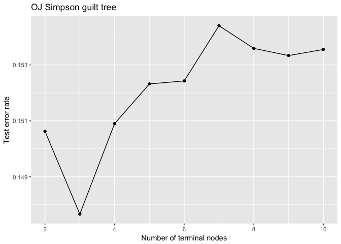

I will now prune the original tree down to 3 nodes. This tree shows that black individuals are predicted to find O.J. not guilty, regardless of age. For individuals who are not black, age becomes an important factor. In the non-black node, older individuals are more likely to find O.J. guilty than are younger individuals. In the first tree shown below it can be seen that the line of demarcation for age is 19.5 years old.

``` r
mod1 <- prune.tree(oj_tree, best = 3)

tree_data <- dendro_data(mod1)
plot(mod1)
text(mod1, pretty = 0)
```

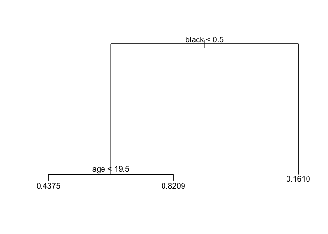

``` r
ggplot(segment(tree_data)) +
  geom_segment(aes(x = x, y = y, xend = xend, yend = yend), 
               alpha = 0.5) +
  geom_text(data = label(tree_data), 
            aes(x = x, y = y, label = label), vjust = -0.5, size = 3) +
  geom_text(data = leaf_label(tree_data), 
            aes(x = x, y = y, label = label), vjust = 0.5, size = 3) +
  theme_dendro() +
  labs(title = "OJ Simpson guilt tree")
```


``` r
mse2 = mse(mod1, oj_split$test)
mse2
```

    ## [1] 0.1386412

The mean squared error for this pruned tree is now about 0.139. This is slightly higher than the original tree, indicating that we have lost some valuable information. This tree could be considered best since it is very easy to read and it has a low test error rate. However, it seems to offer very little information, especially since it only includes two variables in its analysis. We could predict guilt perception better with more nodes, however the graph above shows a spike in the test error rate increasing substantially for node counts other than 3.

In order to try to find a better tree, I will use a bagging method.

``` r
oj_train = oj_split$train %>%
                tbl_df()
oj_test = oj_split$test %>%
               tbl_df()

oj_bag_train = oj_train %>%
                na.omit

oj_bag_test = oj_test %>%
                na.omit

# estimate model
(oj_bag <- randomForest(guilt ~ ., data = oj_bag_train, mtry = 5, ntree = 500, importance=TRUE))
```

    ## Warning in randomForest.default(m, y, ...): The response has five or fewer
    ## unique values. Are you sure you want to do regression?

    ## 
    ## Call:
    ##  randomForest(formula = guilt ~ ., data = oj_bag_train, mtry = 5,      ntree = 500, importance = TRUE) 
    ##                Type of random forest: regression
    ##                      Number of trees: 500
    ## No. of variables tried at each split: 5
    ## 
    ##           Mean of squared residuals: 0.1654249
    ##                     % Var explained: 23.61

``` r
# find MSE
mse3 = mse(oj_bag, oj_bag_test)
mse3
```

    ## [1] 0.1513893

The MSE of this bagged method is larger than before, now 0.151. The percent variance explained is now 23.6%.

``` r
oj_import = as.data.frame(importance(oj_bag))

ggplot(oj_import, mapping=aes(x=rownames(oj_import), y=IncNodePurity)) +
       geom_bar(stat="identity", aes(fill=IncNodePurity)) +
       labs(title = "Average Increased Node Purity Across 500 Regression Trees",
       x = "Variable",
       y = "Mean Increased Node Purity") + 
       theme(plot.title = element_text(hjust = 0.5), plot.subtitle = element_text(hjust = 0.5),
             panel.border = element_rect(linetype = "solid", color = "grey70", fill=NA, size=1.1), legend.position = 'none')
```

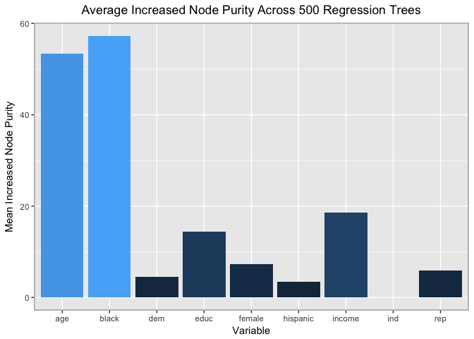 This graph shows that `age` and `black` are the indicators which most increase node purity. This means that they are the variables that best predict how an individual perceives O.J.'s guilt.

``` r
(oj_rf <- randomForest(guilt ~ ., data = oj_bag_train, mtry =2,ntree = 500))
```

    ## Warning in randomForest.default(m, y, ...): The response has five or fewer
    ## unique values. Are you sure you want to do regression?

    ## 
    ## Call:
    ##  randomForest(formula = guilt ~ ., data = oj_bag_train, mtry = 2,      ntree = 500) 
    ##                Type of random forest: regression
    ##                      Number of trees: 500
    ## No. of variables tried at each split: 2
    ## 
    ##           Mean of squared residuals: 0.1552354
    ##                     % Var explained: 28.32

``` r
mse4 = mse(oj_rf, oj_bag_test)
mse4
```

    ## [1] 0.1412956

Using a random forest method, the MSE is 0.141 and is still higher than it was in the original and pruned tree.

``` r
oj_bag_test %>%
  na.omit()
```

    ## # A tibble: 429 × 10
    ##    guilt   dem   rep   ind   age                            educ female
    ##    <dbl> <dbl> <dbl> <dbl> <dbl>                          <fctr>  <dbl>
    ## 1      1     0     1     0    29         COLLEGE GRAD AND BEYOND      1
    ## 2      1     0     1     0    43                HIGH SCHOOL GRAD      1
    ## 3      1     1     0     0    33         COLLEGE GRAD AND BEYOND      1
    ## 4      1     1     0     0    47 SOME COLLEGE(TRADE OR BUSINESS)      1
    ## 5      1     1     0     0    73 SOME COLLEGE(TRADE OR BUSINESS)      0
    ## 6      0     1     0     0    70 SOME COLLEGE(TRADE OR BUSINESS)      1
    ## 7      0     1     0     0    69          NOT A HIGH SCHOOL GRAD      1
    ## 8      1     0     1     0    33         COLLEGE GRAD AND BEYOND      0
    ## 9      1     1     0     0    34         COLLEGE GRAD AND BEYOND      0
    ## 10     0     1     0     0    31          NOT A HIGH SCHOOL GRAD      1
    ## # ... with 419 more rows, and 3 more variables: black <dbl>,
    ## #   hispanic <dbl>, income <fctr>

``` r
oj_bag_train %>%
  na.omit()
```

    ## # A tibble: 987 × 10
    ##    guilt   dem   rep   ind   age                            educ female
    ##    <dbl> <dbl> <dbl> <dbl> <dbl>                          <fctr>  <dbl>
    ## 1      1     0     1     0    29                HIGH SCHOOL GRAD      0
    ## 2      1     1     0     0    21 SOME COLLEGE(TRADE OR BUSINESS)      1
    ## 3      1     0     1     0    36 SOME COLLEGE(TRADE OR BUSINESS)      0
    ## 4      1     0     1     0    33 SOME COLLEGE(TRADE OR BUSINESS)      0
    ## 5      0     0     1     0    27                HIGH SCHOOL GRAD      1
    ## 6      0     0     0     0    58 SOME COLLEGE(TRADE OR BUSINESS)      1
    ## 7      0     1     0     0    49                HIGH SCHOOL GRAD      1
    ## 8      0     1     0     0    68          NOT A HIGH SCHOOL GRAD      1
    ## 9      0     1     0     0    49 SOME COLLEGE(TRADE OR BUSINESS)      0
    ## 10     0     0     1     0    26          NOT A HIGH SCHOOL GRAD      1
    ## # ... with 977 more rows, and 3 more variables: black <dbl>,
    ## #   hispanic <dbl>, income <fctr>

``` r
set.seed(1234)
oj_models <- list("boosting_depth1" = gbm(as.numeric(guilt) ~ .,
                                               data = oj_bag_train,
                                               n.trees = 10000, interaction.depth = 1),
                  "boosting_depth2" = gbm(as.numeric(guilt) ~ .,
                                               data = oj_bag_train,
                                               n.trees = 10000, interaction.depth = 2),
                  "boosting_depth4" = gbm(as.numeric(guilt) ~ .,
                                               data = oj_bag_train,
                                               n.trees = 10000, interaction.depth = 4))
```

    ## Distribution not specified, assuming bernoulli ...

    ## Warning in gbm.fit(x, y, offset = offset, distribution = distribution, w =
    ## w, : variable 3: ind has no variation.

    ## Distribution not specified, assuming bernoulli ...

    ## Warning in gbm.fit(x, y, offset = offset, distribution = distribution, w =
    ## w, : variable 3: ind has no variation.

    ## Distribution not specified, assuming bernoulli ...

    ## Warning in gbm.fit(x, y, offset = offset, distribution = distribution, w =
    ## w, : variable 3: ind has no variation.

``` r
data_frame(depth = c(1, 2, 4),
           model = oj_models[c("boosting_depth1", "boosting_depth2", "boosting_depth4")],
           optimal = map_dbl(model, gbm.perf, plot.it = FALSE)) %>%
  select(-model) %>%
  knitr::kable(caption = "Optimal number of boosting iterations",
               col.names = c("Depth", "Optimal number of iterations"))
```

    ## Using OOB method...

    ## Warning in .f(.x[[i]], ...): OOB generally underestimates the optimal
    ## number of iterations although predictive performance is reasonably
    ## competitive. Using cv.folds>0 when calling gbm usually results in improved
    ## predictive performance.

    ## Using OOB method...

    ## Warning in .f(.x[[i]], ...): OOB generally underestimates the optimal
    ## number of iterations although predictive performance is reasonably
    ## competitive. Using cv.folds>0 when calling gbm usually results in improved
    ## predictive performance.

    ## Using OOB method...

    ## Warning in .f(.x[[i]], ...): OOB generally underestimates the optimal
    ## number of iterations although predictive performance is reasonably
    ## competitive. Using cv.folds>0 when calling gbm usually results in improved
    ## predictive performance.

|  Depth|  Optimal number of iterations|
|------:|-----------------------------:|
|      1|                          3582|
|      2|                          2389|
|      4|                          1952|

``` r
oj1 = gbm(as.numeric(guilt) ~ .,
                                               data = oj_bag_train,
                                               n.trees = 3302, interaction.depth = 1)
```

    ## Distribution not specified, assuming bernoulli ...

    ## Warning in gbm.fit(x, y, offset = offset, distribution = distribution, w =
    ## w, : variable 3: ind has no variation.

``` r
oj2 = gbm(as.numeric(guilt) ~ .,
                                               data = oj_bag_train,
                                               n.trees = 2700, interaction.depth = 2)
```

    ## Distribution not specified, assuming bernoulli ...

    ## Warning in gbm.fit(x, y, offset = offset, distribution = distribution, w =
    ## w, : variable 3: ind has no variation.

``` r
oj4 = gbm(as.numeric(guilt) ~ .,
                                               data = oj_bag_train,
                                               n.trees = 2094, interaction.depth = 4)
```

    ## Distribution not specified, assuming bernoulli ...

    ## Warning in gbm.fit(x, y, offset = offset, distribution = distribution, w =
    ## w, : variable 3: ind has no variation.

``` r
predict.gbm <- function (object, newdata, n.trees, type = "link", single.tree = FALSE, ...) {
  if (missing(n.trees)) {
    if (object$train.fraction < 1) {
      n.trees <- gbm.perf(object, method = "test", plot.it = FALSE)
    }
    else if (!is.null(object$cv.error)) {
      n.trees <- gbm.perf(object, method = "cv", plot.it = FALSE)
    }
    else {
      n.trees <- length(object$train.error)
    }
    cat(paste("Using", n.trees, "trees...\n"))
    gbm::predict.gbm(object, newdata, n.trees, type, single.tree, ...)
  }
}
mseb_1 = mse(oj1,oj_bag_test)
```

    ## Using 3302 trees...

``` r
mseb_2 = mse(oj2,oj_bag_test)
```

    ## Using 2700 trees...

``` r
mseb_4 = mse(oj4,oj_bag_test)
```

    ## Using 2094 trees...

``` r
mseb_1
```

    ## [1] 0.7270504

``` r
mseb_2
```

    ## [1] 0.8119591

``` r
mseb_4
```

    ## [1] 0.7779782

Using the boosted method, a tree with depth of 1 has an MSE of 0.727. A tree with depth 2 has an MSE of 0.812 and a tree with a depth of 4 has an MSE of 0.778. Each of these MSE are higher than the MSE of the original unpruned tree and the tree pruned to 3 nodes, which had a MSE of 0.111.

Out of all of these possible trees, I believe that the best tree is the first pruned tree, pruned to three nodes. It has a very low MSE but it very easy to interpret, as compared to the original unpruned tree.
