Problem Set 9
================
Haylee Ham
2017-03-15

Attitudes towards feminists
---------------------------

### Part 1

``` r
set.seed(1234)
feminist_split <- resample_partition(feminist, p=c(test = 0.3, train = 0.7))
feminist_train <- feminist_split$train %>%
  tbl_df()
feminist_test <- feminist_split$test %>%
  tbl_df()

test_label <- feminist_test$feminist
train_label <- feminist_train$feminist
```

### Part 2

``` r
train_data <- feminist_train[c("female", "age", "educ", "dem", "rep")]
test_data <- feminist_test[c("female", "age", "educ", "dem", "rep")]

# define mse function
mse <- function(model, data) {
  x <- model - data
  mean(x ^ 2, na.rm = TRUE)
}

set.seed(1234)
prediction <- knn(train = train_data, test = test_data, cl = train_label, k=2)
prediction_int <- unfactor(prediction)
```

    ## Warning in if (check.numeric(v = obj, na.rm = FALSE)) {: the condition has
    ## length > 1 and only the first element will be used

``` r
ks <- seq(5, 100, 5)
mses <- list()
for(i in 1:20){
  prediction <- knn(train = train_data, test = test_data, cl = train_label, k=i*5)
  prediction_int <- unfactor(prediction)
  mses[[i]] <- mse(prediction_int, test_label)
}
```

    ## Warning in if (check.numeric(v = obj, na.rm = FALSE)) {: the condition has
    ## length > 1 and only the first element will be used

    ## Warning in if (check.numeric(v = obj, na.rm = FALSE)) {: the condition has
    ## length > 1 and only the first element will be used

    ## Warning in if (check.numeric(v = obj, na.rm = FALSE)) {: the condition has
    ## length > 1 and only the first element will be used

    ## Warning in if (check.numeric(v = obj, na.rm = FALSE)) {: the condition has
    ## length > 1 and only the first element will be used

    ## Warning in if (check.numeric(v = obj, na.rm = FALSE)) {: the condition has
    ## length > 1 and only the first element will be used

    ## Warning in if (check.numeric(v = obj, na.rm = FALSE)) {: the condition has
    ## length > 1 and only the first element will be used

    ## Warning in if (check.numeric(v = obj, na.rm = FALSE)) {: the condition has
    ## length > 1 and only the first element will be used

    ## Warning in if (check.numeric(v = obj, na.rm = FALSE)) {: the condition has
    ## length > 1 and only the first element will be used

    ## Warning in if (check.numeric(v = obj, na.rm = FALSE)) {: the condition has
    ## length > 1 and only the first element will be used

    ## Warning in if (check.numeric(v = obj, na.rm = FALSE)) {: the condition has
    ## length > 1 and only the first element will be used

    ## Warning in if (check.numeric(v = obj, na.rm = FALSE)) {: the condition has
    ## length > 1 and only the first element will be used

    ## Warning in if (check.numeric(v = obj, na.rm = FALSE)) {: the condition has
    ## length > 1 and only the first element will be used

    ## Warning in if (check.numeric(v = obj, na.rm = FALSE)) {: the condition has
    ## length > 1 and only the first element will be used

    ## Warning in if (check.numeric(v = obj, na.rm = FALSE)) {: the condition has
    ## length > 1 and only the first element will be used

    ## Warning in if (check.numeric(v = obj, na.rm = FALSE)) {: the condition has
    ## length > 1 and only the first element will be used

    ## Warning in if (check.numeric(v = obj, na.rm = FALSE)) {: the condition has
    ## length > 1 and only the first element will be used

    ## Warning in if (check.numeric(v = obj, na.rm = FALSE)) {: the condition has
    ## length > 1 and only the first element will be used

    ## Warning in if (check.numeric(v = obj, na.rm = FALSE)) {: the condition has
    ## length > 1 and only the first element will be used

    ## Warning in if (check.numeric(v = obj, na.rm = FALSE)) {: the condition has
    ## length > 1 and only the first element will be used

    ## Warning in if (check.numeric(v = obj, na.rm = FALSE)) {: the condition has
    ## length > 1 and only the first element will be used

``` r
plot(ks, mses, type="b", xlab="Number of Clusters",
     ylab="MSE",
     main="MSE of KNN Model",
     pch=20, cex=2)
```

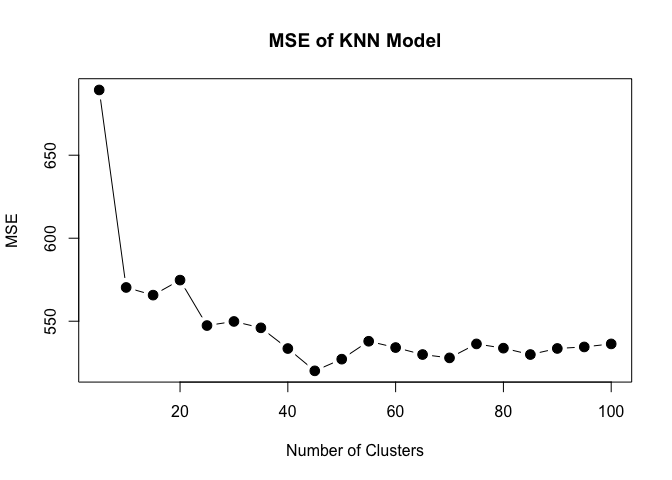

``` r
min_unweighted_mse <- mses[11]
min_unweighted_mse
```

    ## [[1]]
    ## [1] 538

I chose `female`, `age`, `educ`, `dem`, and `rep`. The model with the lowest MSE is the model with k = 45.

### Part 3

``` r
set.seed(1234)
library(kknn)
model <- kknn(feminist_train$feminist ~ ., train=feminist_train, test=feminist_test, 2)
mses <- list()
for(i in 1:20){
  model <- kknn(feminist_train$feminist ~ ., train=feminist_train, test=feminist_test, k=i*5)
  mses[[i]] <- mse(test_label, model$fitted.values)
}

plot(ks, mses, type="b", xlab="Number of Clusters",
     ylab="MSEs",
     main="MSE of Weighted KNN Model",
     pch=20, cex=2)
```

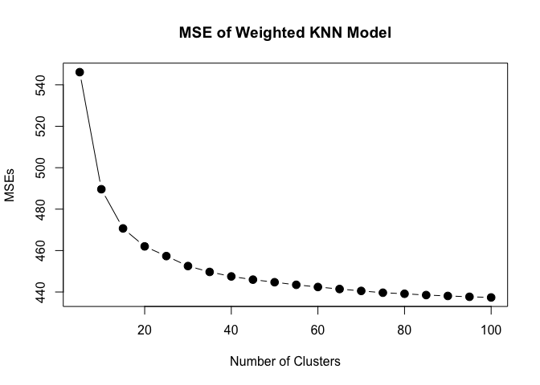

``` r
min_weighted_mse = mses[20]
```

The model with the lowest MSE is the model with k = 100.

### Part 4

``` r
set.seed(1234)

lm <- lm(feminist_train$feminist ~ ., data=feminist_train)
tree <- tree(feminist_train$feminist ~ ., data=feminist_train, control = tree.control(nobs = nrow(feminist_train), mindev = 0))
randfor <- randomForest(feminist_train$feminist ~ ., data=feminist_train, ntree = 500)
boost <- gbm(feminist_train$feminist ~ ., data=feminist_train, n.trees = 2000, interaction.depth = 2)
```

    ## Distribution not specified, assuming gaussian ...

``` r
mse_lm <- mse(predict(lm, feminist_test), test_label)
mse_tree <- mse(predict(tree, feminist_test), test_label)
mse_randfor <- mse(predict(randfor, feminist_test), test_label)
mse_boost <- mse(predict(boost, feminist_test, n.trees=2000), test_label)
mse_lm
```

    ## [1] 435

``` r
mse_tree
```

    ## [1] 597

``` r
mse_randfor
```

    ## [1] 438

``` r
mse_boost
```

    ## [1] 432

The boosting method resulted in the lowest mean squared error. I believe that boosting performed the best because it learns how to reduce the error with each tree and can find a very small MSE when it has 2000 trees to work with (which is the highest number of trees that R will let me use).

Voter turnout and depression
----------------------------

### Part 1

``` r
set.seed(1234)
health <- health %>%
  select(vote96, age, female, educ, mhealth_sum) %>%
  na.omit()

health_split <- resample_partition(health, p=c(test = 0.3, train = 0.7))
train_data <- health_split$train %>%
  tbl_df()
test_data <- health_split$test %>%
  tbl_df()

test_label <- test_data$vote96
train_label <- train_data$vote96
```

### Part 2

``` r
# define mse function
mse <- function(model, data) {
  x <- model - data
  mean(x ^ 2, na.rm = TRUE)
}

set.seed(1234)
prediction <- knn(train = train_data, test = test_data, cl = train_label, k=2)
prediction_int <- unfactor(prediction)
```

    ## Warning in if (check.numeric(v = obj, na.rm = FALSE)) {: the condition has
    ## length > 1 and only the first element will be used

``` r
ks <- seq(5, 100, 5)
mses <- list()
for(i in 1:20){
  prediction <- knn(train = train_data, test = test_data, cl = train_label, k=i*5)
  prediction_int <- unfactor(prediction)
  mses[[i]] <- mse(prediction_int, test_label)
}
```

    ## Warning in if (check.numeric(v = obj, na.rm = FALSE)) {: the condition has
    ## length > 1 and only the first element will be used

    ## Warning in if (check.numeric(v = obj, na.rm = FALSE)) {: the condition has
    ## length > 1 and only the first element will be used

    ## Warning in if (check.numeric(v = obj, na.rm = FALSE)) {: the condition has
    ## length > 1 and only the first element will be used

    ## Warning in if (check.numeric(v = obj, na.rm = FALSE)) {: the condition has
    ## length > 1 and only the first element will be used

    ## Warning in if (check.numeric(v = obj, na.rm = FALSE)) {: the condition has
    ## length > 1 and only the first element will be used

    ## Warning in if (check.numeric(v = obj, na.rm = FALSE)) {: the condition has
    ## length > 1 and only the first element will be used

    ## Warning in if (check.numeric(v = obj, na.rm = FALSE)) {: the condition has
    ## length > 1 and only the first element will be used

    ## Warning in if (check.numeric(v = obj, na.rm = FALSE)) {: the condition has
    ## length > 1 and only the first element will be used

    ## Warning in if (check.numeric(v = obj, na.rm = FALSE)) {: the condition has
    ## length > 1 and only the first element will be used

    ## Warning in if (check.numeric(v = obj, na.rm = FALSE)) {: the condition has
    ## length > 1 and only the first element will be used

    ## Warning in if (check.numeric(v = obj, na.rm = FALSE)) {: the condition has
    ## length > 1 and only the first element will be used

    ## Warning in if (check.numeric(v = obj, na.rm = FALSE)) {: the condition has
    ## length > 1 and only the first element will be used

    ## Warning in if (check.numeric(v = obj, na.rm = FALSE)) {: the condition has
    ## length > 1 and only the first element will be used

    ## Warning in if (check.numeric(v = obj, na.rm = FALSE)) {: the condition has
    ## length > 1 and only the first element will be used

    ## Warning in if (check.numeric(v = obj, na.rm = FALSE)) {: the condition has
    ## length > 1 and only the first element will be used

    ## Warning in if (check.numeric(v = obj, na.rm = FALSE)) {: the condition has
    ## length > 1 and only the first element will be used

    ## Warning in if (check.numeric(v = obj, na.rm = FALSE)) {: the condition has
    ## length > 1 and only the first element will be used

    ## Warning in if (check.numeric(v = obj, na.rm = FALSE)) {: the condition has
    ## length > 1 and only the first element will be used

    ## Warning in if (check.numeric(v = obj, na.rm = FALSE)) {: the condition has
    ## length > 1 and only the first element will be used

    ## Warning in if (check.numeric(v = obj, na.rm = FALSE)) {: the condition has
    ## length > 1 and only the first element will be used

``` r
plot(ks, mses, type="b", xlab="Number of Clusters",
     ylab="MSE",
     main="MSE of KNN Model",
     pch=20, cex=2)
```

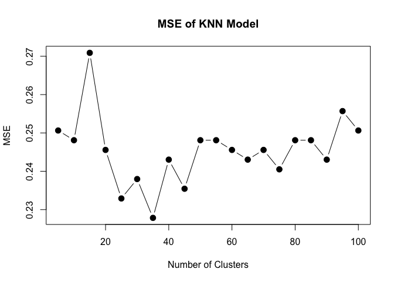

``` r
min_unweighted_mse <- mses[11]
min_unweighted_mse
```

    ## [[1]]
    ## [1] 0.248

I chose `age`, `educ`, `female`, and `mhealth_sum`. The model with the lowest MSE is the model with k = 35.

### Part 3

``` r
set.seed(1234)
library(kknn)
model <- kknn(train_data$vote96 ~ ., train=train_data, test=test_data, 2)
mses <- list()
for(i in 1:20){
  model <- kknn(train_data$vote96 ~ ., train=train_data, test=test_data, k=i*5)
  mses[[i]] <- mse(test_label, model$fitted.values)
}

plot(ks, mses, type="b", xlab="Number of Clusters",
     ylab="MSEs",
     main="MSE of Weighted KNN Model",
     pch=20, cex=2)
```

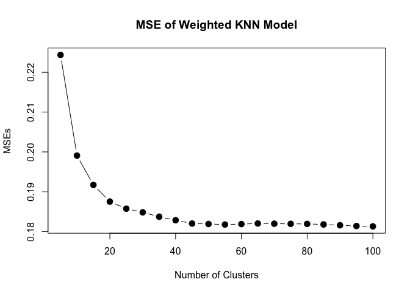

``` r
min_weighted_mse = mses[20]
```

The model with the lowest MSE is the model with k = 100.

### Part 4

``` r
set.seed(1234)

glm <- glm(train_data$vote96 ~ ., data=train_data, family=binomial)
tree <- tree(train_data$vote96 ~ ., data=train_data, control = tree.control(nobs = nrow(train_data), mindev = 0))
randfor <- randomForest(train_data$vote96 ~ ., data=train_data, ntree = 500)
```

    ## Warning in randomForest.default(m, y, ...): The response has five or fewer
    ## unique values. Are you sure you want to do regression?

``` r
boost <- gbm(train_data$vote96 ~ ., data=train_data, n.trees = 2000, interaction.depth = 2)
```

    ## Distribution not specified, assuming bernoulli ...

``` r
mse_glm <- mse(predict(glm, test_data), test_label)
mse_tree <- mse(predict(tree, test_data), test_label)
mse_randfor <- mse(predict(randfor, test_data), test_label)
mse_boost <- mse(predict(boost, test_data, n.trees=2000), test_label)
mse_glm
```

    ## [1] 1.07

``` r
mse_tree
```

    ## [1] 0.225

``` r
mse_randfor
```

    ## [1] 0.181

``` r
mse_boost
```

    ## [1] 0.411

The random forest method resulted in the lowest mean squared error. I believe that in this case random forest performed better than trees due to the decreased variance that random forests result in as they ignore some subset of the variables with each iteration. I believe that it must have been the randomly ignored subsets that also put it over the top to beat out the logistic model and the boosting model. Perhaps there were some variables that were dominating the trees in the boosting method and dominating the meaningfulness of the logistic method that, when ignored, resulted in a much better fit.

Colleges
--------

``` r
college = College
college$Private = as.numeric(college$Private)

college_pca = prcomp(college, scale = TRUE)
college_pca_1_2 = as.data.frame(college_pca$rotation)[1:2]
college_pca_1_2
```

    ##                 PC1     PC2
    ## Private     -0.0890  0.3459
    ## Apps        -0.1996 -0.3436
    ## Accept      -0.1538 -0.3726
    ## Enroll      -0.1178 -0.3997
    ## Top10perc   -0.3603  0.0162
    ## Top25perc   -0.3448 -0.0177
    ## F.Undergrad -0.0941 -0.4107
    ## P.Undergrad  0.0175 -0.2931
    ## Outstate    -0.3277  0.1915
    ## Room.Board  -0.2665  0.0940
    ## Books       -0.0572 -0.0573
    ## Personal     0.0719 -0.1928
    ## PhD         -0.3033 -0.1162
    ## Terminal    -0.3039 -0.1042
    ## S.F.Ratio    0.2103 -0.2044
    ## perc.alumni -0.2367  0.1941
    ## Expend      -0.3330  0.0703
    ## Grad.Rate   -0.2731  0.1178

``` r
biplot(college_pca, scale = 0, cex = c(.1,.6))
```


For the first component, the strongest variables are `Top10perc`, `Top25perc`, `Outstate`, `Terminal`, `Expend`, and `PhD`. All of these variables have negative scores. It seems that all of these variables are very correlated. This means that the universities with high scores for PC1 have low levels of students in the top percentiles, low out of state tuition, low percentage of faculty with terminal degrees and PhDs and low expenditure per student.

The second component has very strong negative magnitudes for `Apps`, `Accept`, `Enroll`, `F.Undergraduate`. It also has a very positive magnitude for `Private`, `Outstate`, and `perc.alumni`. This suggests that those mentioned negative variables are also all correlated and that universities with high scores for PC2 will have lower levels of applications, acceptance rates, number of new students enrolled, and number of full-time undergraduates. On the other hand, these same universities will largely be private universities with high out of state tuition, and a percentage of alumni who donate.

Clustering States
-----------------

### Part 1

``` r
# Principal Component Analysis 
states_label <-arrests$State
arrests_df <- arrests[c("Murder", "Assault", "UrbanPop", "Rape")]
pr.out <- prcomp(arrests_df, scale = TRUE)
pr.out$rotation 
```

    ##             PC1    PC2    PC3    PC4
    ## Murder   -0.536  0.418 -0.341  0.649
    ## Assault  -0.583  0.188 -0.268 -0.743
    ## UrbanPop -0.278 -0.873 -0.378  0.134
    ## Rape     -0.543 -0.167  0.818  0.089

``` r
biplot(pr.out, scale = 0, cex = .6)
```


### Part 2

``` r
kmeans_fit2 <- kmeans(arrests_df, 2, nstart = 20)
biplot(pr.out, scale = 0, cex = .6)
```


``` r
PC1 <- as.data.frame(pr.out$x)$PC1
PC2 <- as.data.frame(pr.out$x)$PC2
plot(PC1, PC2, label=states_label)
```

    ## Warning in plot.window(...): "label" is not a graphical parameter

    ## Warning in plot.xy(xy, type, ...): "label" is not a graphical parameter

    ## Warning in axis(side = side, at = at, labels = labels, ...): "label" is not
    ## a graphical parameter

    ## Warning in axis(side = side, at = at, labels = labels, ...): "label" is not
    ## a graphical parameter

    ## Warning in box(...): "label" is not a graphical parameter

    ## Warning in title(...): "label" is not a graphical parameter


``` r
state_group <- as.factor(kmeans_fit2$cluster)
d <- data.frame(x=PC1, y=PC2, name=states_label)
p <- ggplot(d, aes(x, y, label=name, color=state_group))
p +  geom_text() + labs(title = "PCA: Divide States into 2 Groups (K-Means Clustering, K=2)")
```

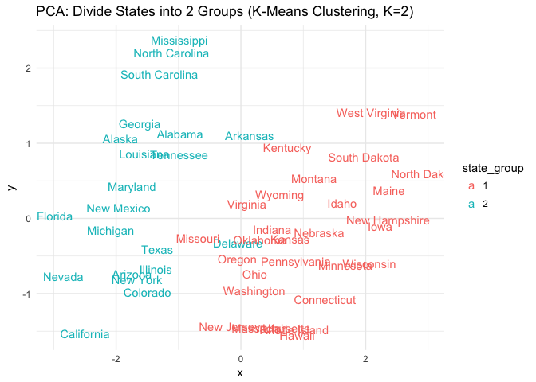

With K set equal to 2, the states appear to generally be split geographically, with the red group being more southern states and the blue states being more northerly. The states are split among a diagonal between their x and y values.

### Part 3

``` r
kmeans_fit4 <- kmeans(arrests_df, 4, nstart = 20)

biplot(pr.out, scale = 0, cex = .6)
```


``` r
PC1 <- as.data.frame(pr.out$x)$PC1
PC2 <- as.data.frame(pr.out$x)$PC2

plot(PC1, PC2, label=states_label)
```

    ## Warning in plot.window(...): "label" is not a graphical parameter

    ## Warning in plot.xy(xy, type, ...): "label" is not a graphical parameter

    ## Warning in axis(side = side, at = at, labels = labels, ...): "label" is not
    ## a graphical parameter

    ## Warning in axis(side = side, at = at, labels = labels, ...): "label" is not
    ## a graphical parameter

    ## Warning in box(...): "label" is not a graphical parameter

    ## Warning in title(...): "label" is not a graphical parameter


``` r
state_group <- as.factor(kmeans_fit4$cluster)

d <- data.frame(x=PC1, y=PC2, name=states_label)
p <- ggplot(d, aes(x, y, label=name, color=state_group))
p +  geom_text() + labs(title = "PCA: Divide States into 4 Groups (K-Means Clustering, K=4)")
```

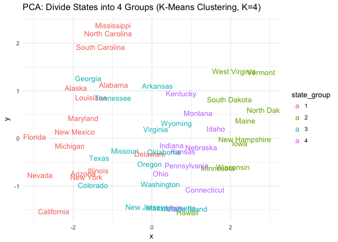

With K set equal to 4, we can see four groups that are mostly split by their x value. This means that the groups are mainly differentiated by their PC1 level, which is mostly correlated to their level of violent crimes.

### Part 4

``` r
kmeans_fit3 <- kmeans(arrests_df, 3, nstart = 20)
biplot(pr.out, scale = 0, cex = .6)
```

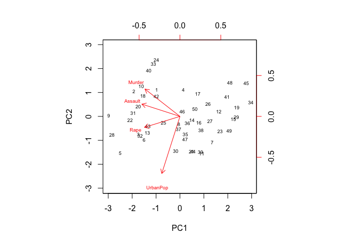

``` r
PC1 <- as.data.frame(pr.out$x)$PC1
PC2 <- as.data.frame(pr.out$x)$PC2

plot(PC1, PC2, label=states_label)
```

    ## Warning in plot.window(...): "label" is not a graphical parameter

    ## Warning in plot.xy(xy, type, ...): "label" is not a graphical parameter

    ## Warning in axis(side = side, at = at, labels = labels, ...): "label" is not
    ## a graphical parameter

    ## Warning in axis(side = side, at = at, labels = labels, ...): "label" is not
    ## a graphical parameter

    ## Warning in box(...): "label" is not a graphical parameter

    ## Warning in title(...): "label" is not a graphical parameter


``` r
state_group <- as.factor(kmeans_fit3$cluster)

d <- data.frame(x=PC1, y=PC2, name=states_label)
p <- ggplot(d, aes(x, y, label=name, color=state_group))
p +  geom_text() + labs(title = "PCA: Divide States into 3 Groups (K-Means Clustering, K=3)")
```

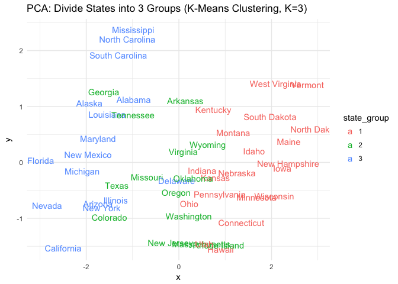

With K set equal to 3, we again see that the states are largely divided along PC1 lines.

### Part 5

``` r
pr.out <- prcomp(arrests_df, scale = TRUE)
PCS <- data.frame(v1=PC1, v2=PC2)
kmeans_fit3_pca <- kmeans(PCS, 3, nstart = 20)
state_group <- as.factor(kmeans_fit3_pca$cluster)
d <- data.frame(x=PC1, y=PC2, name=states_label)
p <- ggplot(d, aes(x, y, label=name, color=state_group))
p +  geom_text() + labs(title = "PCA: Divide States into 3 Groups based on PC1, PC2 (K-Means Clustering, K=2)")
```

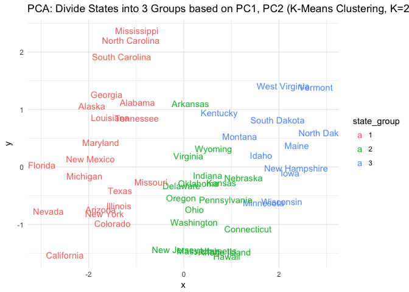

Performing the K means clustering using the principal component score vectors rather than the raw data resulted in cleaner breaks between the groups. The values of the groups spanning the y-axis appear the same but there is less overlap of the x values between the groups.

### Part 6

``` r
hc.complete <- hclust(dist(arrests_df), method = "complete")

hcdata <- dendro_data(hc.complete)
hclabs <- label(hcdata) %>%
  left_join (data_frame (label = as.factor (seq.int(nrow(arrests))),
                         cl = as.factor(arrests$State)))
```

    ## Joining, by = "label"

    ## Warning in left_join_impl(x, y, by$x, by$y, suffix$x, suffix$y): joining
    ## factors with different levels, coercing to character vector

``` r
ggdendrogram(hcdata, labels = FALSE) + geom_text(data = hclabs,
            aes(label = cl, x = x, y = 0),
            vjust = .5, angle = 90, size=2.0) + 
  labs(title = 'US Arrests Heirarchical Clustering') +
  theme(axis.text.x = element_blank(),
        legend.position = "none")
```

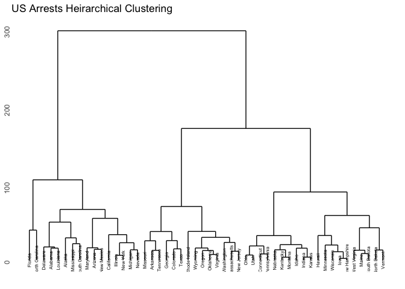

### Part 7

``` r
h <- 150
hc.complete <- hclust(dist(arrests_df), method = "complete")

hcdata <- dendro_data(hc.complete)
hclabs <- label(hcdata) %>%
  left_join (data_frame (label = as.factor (seq.int(nrow(arrests))),
                         cl = as.factor(arrests$State)))
```

    ## Joining, by = "label"

    ## Warning in left_join_impl(x, y, by$x, by$y, suffix$x, suffix$y): joining
    ## factors with different levels, coercing to character vector

``` r
ggdendrogram(hc.complete, labels = FALSE) +
  geom_text(data = hclabs,
            aes(label = cl, x = x, y = 0),
            vjust = .5, angle = 90, size = 2.0) +
  geom_hline(yintercept = h, linetype = 2) +
  theme(axis.text.x = element_blank(),
        legend.position = "none") +
  labs(title = 'US Arrests Heirarchical Clustering')
```


When restricted to three distinct clusters, it appears that the first and second clusters each have a number of southern states in them but the third cluster has states that are not in the southern United States.

### Part 8

``` r
hc.standard <- hclust(dist(scale(arrests_df)), method = "complete")
hcdata.s <- dendro_data(hc.standard)
hclabs.s <- label(hcdata.s) %>%
  left_join (data_frame (label = as.factor (seq.int(nrow(arrests))),
                         cl = as.factor(arrests$State)))
```

    ## Joining, by = "label"

    ## Warning in left_join_impl(x, y, by$x, by$y, suffix$x, suffix$y): joining
    ## factors with different levels, coercing to character vector

``` r
ggdendrogram(hcdata.s, labels = FALSE) + geom_text(data = hclabs.s,
            aes(label = cl, x = x, y = 0),
            vjust = .5, angle = 90, size=2.0) +
  labs(title = 'US Arrests Standardized Heirarchical Clustering') +
  theme(axis.text.x = element_blank(),
        legend.position = "none")
```

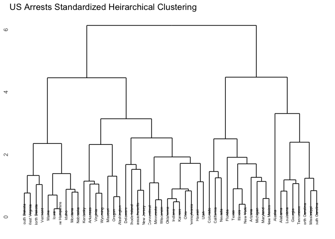

After being sclaed, the graph becomes seemingly more complicated and the height of the tree shrinks significantly. The highest edge of the tree falls at 6 Euclidean distance units, whereas before standardization the height of the tree reached 300 Euclidean distance units. The standardization seems like a very rational choice and I believe that this should occur before the inter-observation dissimilarities are computed. These dissimilaries are skewed by each state's standard deviation and, before scaling, such a devivation could vary greatly. After standardization, these standard deviations are much more centered and each state is able to more equally add the dissimilarities between the observations.
