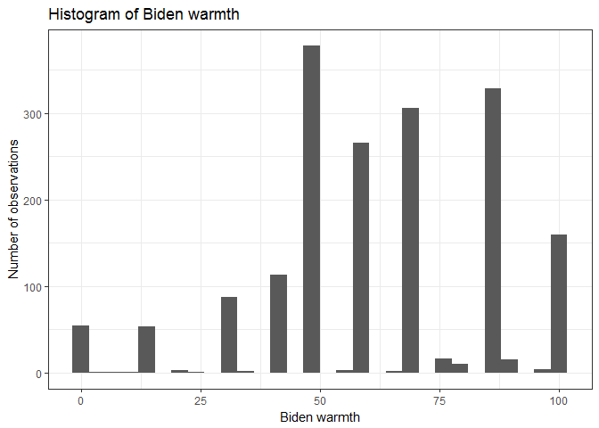
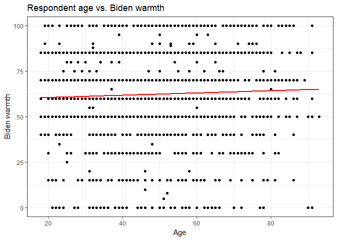
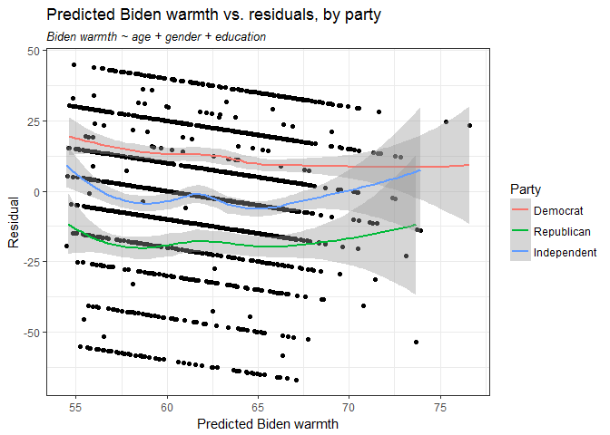
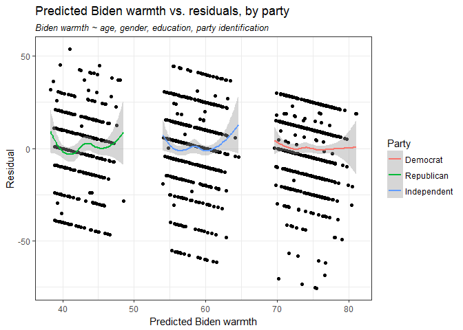

# Problem set #5: linear regression
Soo Wan Kim  
February 12, 2017  


# Describe the data (1 point)

Plot a histogram of `biden` with a binwidth of `1`. Make sure to give the graph a title and proper $x$ and $y$-axis labels. In a few sentences, describe any interesting features of the graph.


```r
ggplot(data = bidenfeels, mapping = aes(biden)) + 
  geom_histogram(bindwidth = 1) + 
  labs(title = "Histogram of Biden warmth",
       x = "Biden warmth", 
       y = "Number of observations") + 
  theme_bw()
```

<!-- -->

The bin with the highest number of observations is 50, the neutral bin. However, there were many more people who felt warmly about Joe Biden than those who felt coldly, indicating that he was popular among respondents.

# Simple linear regression (2 points)

  1. **Is there a relationship between the predictor and the response?**
  2. **How strong is the relationship between the predictor and the response?**
  3. **Is the relationship between the predictor and the response positive or negative?**


```r
slr_mod <- lm(biden ~ age, data = bidenfeels)
tidy(slr_mod)
```

```
##          term    estimate  std.error statistic       p.value
## 1 (Intercept) 59.19736008 1.64791889 35.922496 1.145056e-213
## 2         age  0.06240535 0.03266815  1.910281  5.625534e-02
```

There is a weak positive relationship between the predictor and the response. The regression output suggests that an increase in age by one year would increase Biden warmth by about 0.06 points.

  4. **Report the $R^2$ of the model. What percentage of the variation in `biden` does `age` alone explain? Is this a good or bad model?**


```r
glance(slr_mod)
```

```
##     r.squared adj.r.squared    sigma statistic    p.value df    logLik
## 1 0.002017624   0.001464725 23.44485  3.649174 0.05625534  2 -8263.475
##        AIC      BIC deviance df.residual
## 1 16532.95 16549.45 992137.7        1805
```

The $R^2$ of the model is 0.0020176. `age` explains only 0.2017624% of the variation in `biden`, which suggests this is a bad model.

  5. **What is the predicted `biden` associated with an `age` of 45? What are the associated 95% confidence intervals?**


```r
(pred_ci <- augment(slr_mod, newdata = data.frame(age = 45)) %>%
  mutate(ymin = .fitted - .se.fit * 1.96,
         ymax = .fitted + .se.fit * 1.96))
```

```
##   age .fitted   .se.fit     ymin     ymax
## 1  45 62.0056 0.5577123 60.91248 63.09872
```

The predicted `biden` associated with `age` = 45 is 62.005601. The associated 95% confidence intervals are (60.9124849, 63.0987172).

  6. **Plot the response and predictor. Draw the least squares regression line.**


```r
#make grid of data points
grid <- bidenfeels %>% 
  data_grid(age) %>% 
  add_predictions(slr_mod) 

#plot response and predictor + least squares regression line
ggplot(data = bidenfeels, aes(x = age)) +
  geom_point(aes(y = biden)) +
  geom_line(aes(y = pred), data = grid, color = "red", size = 1) +
  labs(title = "Respondent age vs. Biden warmth",
       x = "Age", 
       y = "Biden warmth") + 
  theme_bw() 
```

<!-- -->


# Multiple linear regression (2 points)

  1. **Is there a statistically significant relationship between the predictors and response?**
  2. **What does the parameter for `female` suggest?**


```r
mlr_mod <- lm(biden ~ age + female + educ, data = bidenfeels)
tidy(mlr_mod)
```

```
##          term    estimate  std.error statistic      p.value
## 1 (Intercept) 68.62101396 3.59600465 19.082571 4.337464e-74
## 2         age  0.04187919 0.03248579  1.289154 1.975099e-01
## 3      female  6.19606946 1.09669702  5.649755 1.863612e-08
## 4        educ -0.88871263 0.22469183 -3.955251 7.941295e-05
```

There is a statistically significant relationship between the response and the predictors gender and education at the 0.05 level. The parameter for `female` suggests that being female is likely to raise a person's feelings of warmth toward Joe Biden by about 6 points.

  3. **Report the $R^2$ of the model. What percentage of the variation in `biden` does age, gender, and education explain? Is this a better or worse model than the age-only model?**
  

```r
glance(mlr_mod)
```

```
##    r.squared adj.r.squared    sigma statistic      p.value df    logLik
## 1 0.02722727    0.02560868 23.15967  16.82159 8.876492e-11  4 -8240.359
##        AIC      BIC deviance df.residual
## 1 16490.72 16518.22 967075.7        1803
```
  
The $R^2$ for this model is 0.0272273. Age, gender, and education explain 2.7227269% of the variation in `biden`. This is still pretty low, but an improvement over the age-only model.
  
  4. **Generate a plot comparing the predicted values and residuals, drawing separate smooth fit lines for each party ID type. Is there a problem with this model? If so, what?**
  

```r
bidenfeels_mlr <- bidenfeels %>%
  add_predictions(mlr_mod) %>% #add predictions
  add_residuals(mlr_mod) %>% #add residuals
  mutate(partyID = "Independent") #create party variable
bidenfeels_mlr$partyID[bidenfeels$rep == 1] <- "Republican" 
bidenfeels_mlr$partyID[bidenfeels$dem == 1] <- "Democrat"
bidenfeels_mlr$partyID <- as.factor(bidenfeels_mlr$partyID) #set as factor variable
bidenfeels_mlr$partyID <- factor(bidenfeels_mlr$partyID, #reorder (make plot legend more intuitive?)
                                 levels = c("Democrat", "Republican", "Independent"))

#plot predicted values and residuals + least squares regression lines
ggplot(data = bidenfeels_mlr, mapping = aes(x = pred, y = resid)) +
  geom_point() + 
  geom_smooth(data = bidenfeels_mlr, aes(color = partyID)) + 
  labs(title = "Predicted Biden warmth vs. residuals, by party",
       subtitle = "Biden warmth ~ age + gender + education",
       x = "Predicted Biden warmth", 
       y = "Residual",
       color = "Party") + 
  theme_bw() + 
  theme(plot.subtitle = element_text(face="italic"))
```

<!-- -->

The model does not take into account party identification, which appears to be a significant factor in the outcome judging by the differences in residual distribution. The model underestimates Biden warmth for Democrats and overestimates it for Republicans.  

# Multiple linear regression model (with even more variables!) (3 points)

  1. **Did the relationship between gender and Biden warmth change?**


```r
mlr2_mod <- lm(biden ~ age + female + educ + dem + rep, data = bidenfeels)
tidy(mlr2_mod)
```

```
##          term     estimate std.error  statistic      p.value
## 1 (Intercept)  58.81125899 3.1244366  18.822996 2.694143e-72
## 2         age   0.04825892 0.0282474   1.708438 8.772744e-02
## 3      female   4.10323009 0.9482286   4.327258 1.592601e-05
## 4        educ  -0.34533479 0.1947796  -1.772952 7.640571e-02
## 5         dem  15.42425563 1.0680327  14.441745 8.144928e-45
## 6         rep -15.84950614 1.3113624 -12.086290 2.157309e-32
```

The relationship between gender and Biden warmth is weaker with this model, but still positive and statistically significant. Party identification appears to have a much stronger effect than gender.

  2. **Report the $R^2$ of the model. What percentage of the variation in `biden` does age, gender, education, and party identification explain? Is this a better or worse model than the age + gender + education model?**


```r
glance(mlr2_mod)
```

```
##   r.squared adj.r.squared    sigma statistic       p.value df    logLik
## 1 0.2815391     0.2795445 19.91449  141.1495 1.500182e-126  6 -7966.563
##        AIC      BIC deviance df.residual
## 1 15947.13 15985.62 714253.2        1801
```

The $R^2$ for this model is 0.2815391. Age, gender, education, and party identification explain 28.1539147% of the variation in `biden`, much higher than in the previous two models. This model is a significant improvement, at least based on $R^2$.
  
  3. **Generate a plot comparing the predicted values and residuals, drawing separate smooth fit lines for each party ID type. By adding variables for party ID to the regression model, did we fix the previous problem?**


```r
bidenfeels_mlr2 <- bidenfeels %>%
  add_predictions(mlr2_mod) %>% #add predictions
  add_residuals(mlr2_mod) %>% #add residuals
  mutate(partyID = "Independent") #create party variable
bidenfeels_mlr2$partyID[bidenfeels$rep == 1] <- "Republican" 
bidenfeels_mlr2$partyID[bidenfeels$dem == 1] <- "Democrat"
bidenfeels_mlr2$partyID <- as.factor(bidenfeels_mlr2$partyID) #set as factor variable
bidenfeels_mlr2$partyID <- factor(bidenfeels_mlr2$partyID, #reorder (make plot legend more intuitive?)
                                 levels = c("Democrat", "Republican", "Independent"))

#plot predicted values and residuals + least squares regression lines
ggplot(data = bidenfeels_mlr2, mapping = aes(x = pred, y = resid)) +
  geom_point() + 
  geom_smooth(data = bidenfeels_mlr2, aes(color = partyID)) + 
  labs(title = "Predicted Biden warmth vs. residuals, by party",
       subtitle = "Biden warmth ~ age, gender, education, party identification",
       x = "Predicted Biden warmth", 
       y = "Residual",
       color = "Party") + 
  theme_bw() + 
  theme(plot.subtitle = element_text(face="italic"))
```

<!-- -->


This model generates residuals that are roughly centered around zero for Democrats, Republicans, and independents, which fixes the problem with the previous model.

# Interactive linear regression model (2 points)

  1. **Estimate predicted Biden warmth feeling thermometer ratings and 95% confidence intervals for female Democrats, female Republicans, male Democrats, and male Republicans. Does the relationship between party ID and Biden warmth differ for males/females? Does the relationship between gender and Biden warmth differ for Democrats/Republicans?**


```r
bidenfeels_noInd <- bidenfeels %>%
  filter(rep == 1 | dem == 1) #filter out independents

mlr3_mod <- lm(biden ~ female * dem, data = bidenfeels_noInd) #fit linear model
tidy(mlr3_mod)
```

```
##          term  estimate std.error statistic       p.value
## 1 (Intercept) 39.382022  1.455363 27.059928 4.045546e-125
## 2      female  6.395180  2.017807  3.169371  1.568102e-03
## 3         dem 33.687514  1.834799 18.360328  3.295008e-66
## 4  female:dem -3.945888  2.471577 -1.596506  1.106513e-01
```

```r
#make grid of values
int_grid <- bidenfeels_noInd %>% 
  data_grid(female, dem) %>% 
  add_predictions(mlr3_mod) 

#get confidence intervals
(pred_ci <- augment(mlr3_mod, newdata = int_grid) %>%
  mutate(ymin = .fitted - .se.fit * 1.96,
         ymax = .fitted + .se.fit * 1.96))
```

```
##   female dem     pred  .fitted   .se.fit     ymin     ymax
## 1      0   0 39.38202 39.38202 1.4553632 36.52951 42.23453
## 2      0   1 73.06954 73.06954 1.1173209 70.87959 75.25949
## 3      1   0 45.77720 45.77720 1.3976638 43.03778 48.51662
## 4      1   1 75.51883 75.51883 0.8881114 73.77813 77.25953
```

For both Republicans and Democrats, women exhibit greater warmth for Biden. On the other hand, both male and female Democrats exhibit much greater Biden warmth than either male or female Republicans. The difference in Biden warmth between Democrats and Republicans for men (about 33.7 points) is higher than that for women (about 29.7 points), indicating a stronger negative interaction between party ID and Biden warmth among men than among women. The difference in predicted warmth between males and females for Republicans (about 6.4 points) is higher than that for Democrats (about 2.4 points), indicating a stronger positive interaction between being female and Biden warmth among Republicans.


    
