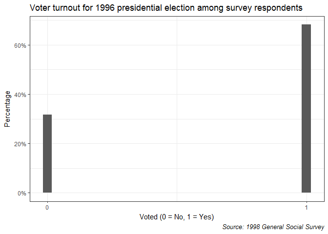
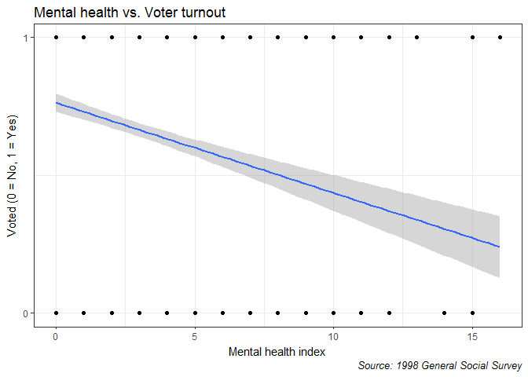
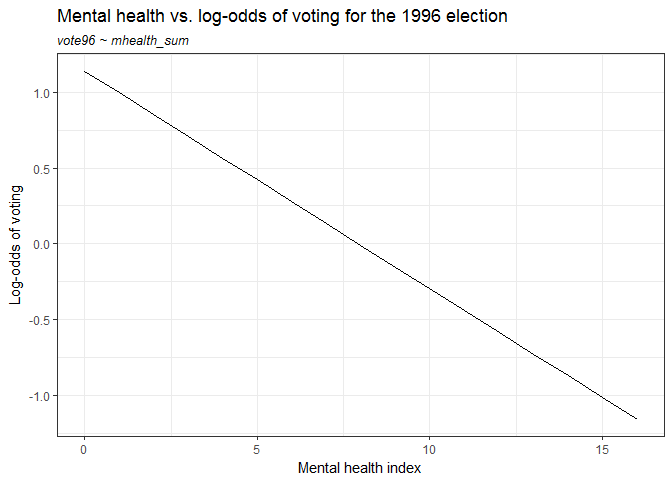
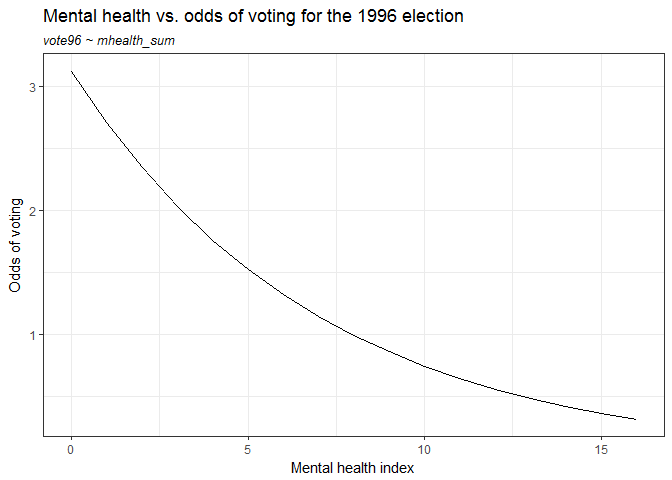
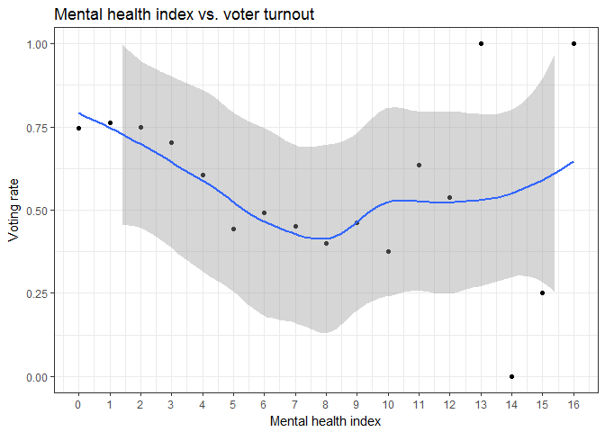
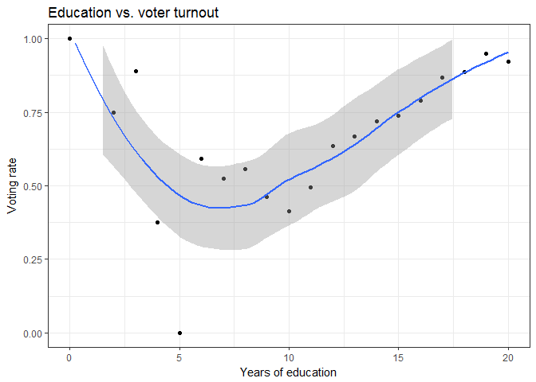
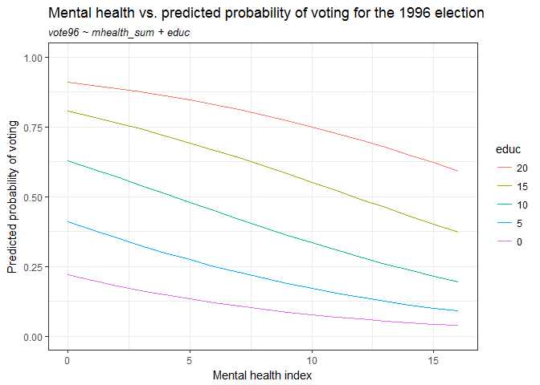
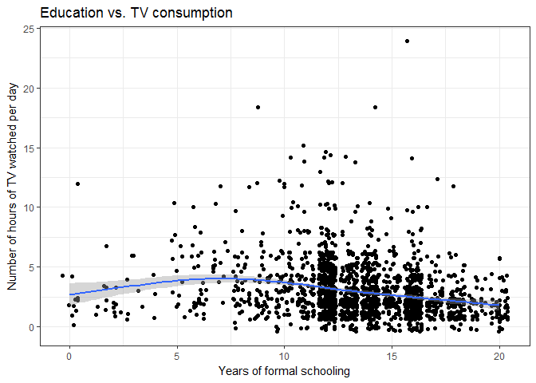
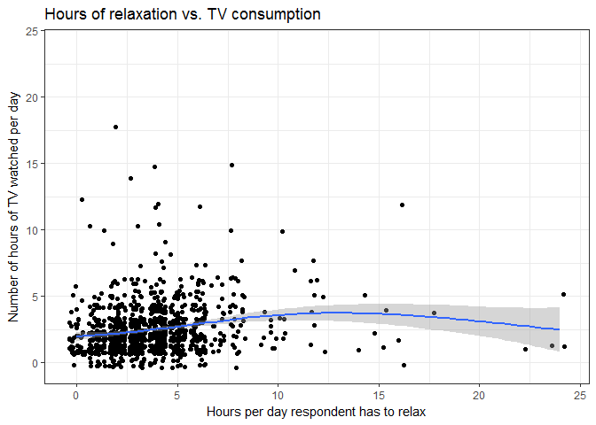
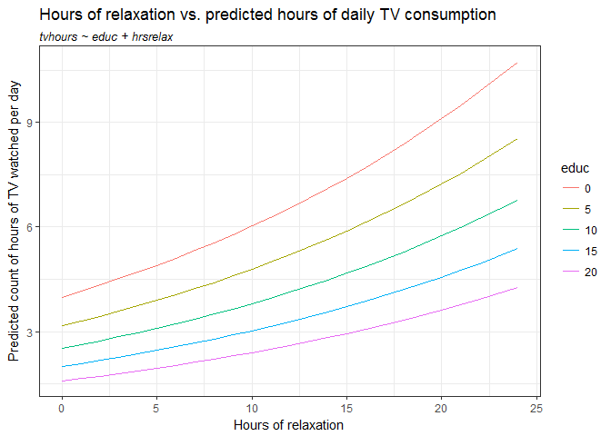

# Problem set #6: Generalized linear models
Soo Wan Kim  
February 18, 2017  


# Part 1: Modeling voter turnout
## Describe the data (1 point)

  1. **Plot a histogram of voter turnout. Make sure to give the graph a title and proper $x$ and $y$-axis labels. What is the unconditional probability of a given individual turning out to vote?**
  

```r
ggplot(data = mhealth, mapping = aes(x = vote96)) +
  geom_histogram(aes(y=..count../sum(..count..))) + 
  scale_x_continuous(breaks = c(0,1), labels = c(0,1)) +
  scale_y_continuous(labels = scales::percent) + 
  labs(title = "Voter turnout for 1996 presidential election among survey respondents",
       x = "Voted (0 = No, 1 = Yes)",
       y = "Percentage",
       caption = "Source: 1998 General Social Survey") + 
  theme(plot.caption = element_text(face =  "italic"))
```

<!-- -->

The unconditional probability of a given individual turning out to vote is 0.6823574.

  2. **Generate a scatterplot of the relationship between mental health and observed voter turnout and overlay a linear smoothing line. What information does this tell us? What is problematic about this linear smoothing line?**
  

```r
ggplot(data = mhealth, mapping = aes(x = mhealth_sum, y = vote96)) + 
  geom_point() + 
  geom_smooth(method = "lm") + 
  scale_y_continuous(breaks = c(0,1), labels = c(0,1)) +
  labs(title = "Mental health vs. Voter turnout",
       x = "Mental health index",
       y = "Voted (0 = No, 1 = Yes)",
       caption = "Source: 1998 General Social Survey") + 
  theme(plot.caption = element_text(face =  "italic"))
```

<!-- -->

Depression has a negative correlation with voter turnout. The problem with the linear smoothing line, however is that `vote96` is a categorical variable with values 0 and 1, not a continuous variable. Thus, the relationship between the two variables cannot be linear.

##Basic model (3 points)

**Estimate a logistic regression model of the relationship between mental health and voter turnout.**


```r
glm_sing <- glm(vote96 ~ mhealth_sum, data = mhealth,
            family = binomial)
summary(glm_sing)
```

```
## 
## Call:
## glm(formula = vote96 ~ mhealth_sum, family = binomial, data = mhealth)
## 
## Deviance Residuals: 
##     Min       1Q   Median       3Q      Max  
## -1.6834  -1.2977   0.7452   0.8428   1.6911  
## 
## Coefficients:
##             Estimate Std. Error z value Pr(>|z|)    
## (Intercept)  1.13921    0.08444  13.491  < 2e-16 ***
## mhealth_sum -0.14348    0.01969  -7.289 3.13e-13 ***
## ---
## Signif. codes:  0 '***' 0.001 '**' 0.01 '*' 0.05 '.' 0.1 ' ' 1
## 
## (Dispersion parameter for binomial family taken to be 1)
## 
##     Null deviance: 1672.1  on 1321  degrees of freedom
## Residual deviance: 1616.7  on 1320  degrees of freedom
##   (1510 observations deleted due to missingness)
## AIC: 1620.7
## 
## Number of Fisher Scoring iterations: 4
```


  1. **Is the relationship between mental health and voter turnout statistically and/or substantively significant?**

The relationship between mental health and voter turnout is highly statistically significant, with a p-value less than 0.001. It is difficult to tell whether the relationship is substantively significant because the estimates are in log-odds.  

  2. **Interpret the estimated parameter for mental health in terms of log-odds. Generate a graph of the relationship between mental health and the log-odds of voter turnout.**

For every unit increase in `mhealth_sum`, the log-odds of voting for the 1996 election decreases by -0.1434752.


```r
mhealth_grid <- mhealth %>%
  data_grid(mhealth_sum) %>%
  add_predictions(glm_sing)

ggplot(data = mhealth_grid, mapping = aes(x = mhealth_sum, y = pred)) + 
  geom_line() + 
  labs(title = "Mental health vs. log-odds of voting for the 1996 election",
       subtitle = "vote96 ~ mhealth_sum",
       x = "Mental health index",
       y = "Log-odds of voting") + 
  theme(plot.subtitle = element_text(face = "italic"))
```

<!-- -->

  3. **Interpret the estimated parameter for mental health in terms of odds. Generate a graph of the relationship between mental health and the odds of voter turnout.**

For every unit increase in `mhealth_sum`, the log of the odds of voting for the 1996 election decreases by -0.1434752.


```r
logit2odds <- function(x){
  exp(x)
}

mhealth_grid <- mhealth_grid %>%
  mutate(odds = logit2odds(pred))

ggplot(data = mhealth_grid, mapping = aes(x = mhealth_sum, y = odds)) + 
  geom_line() + 
  labs(title = "Mental health vs. odds of voting for the 1996 election",
       subtitle = "vote96 ~ mhealth_sum",
       x = "Mental health index",
       y = "Odds of voting") + 
  theme(plot.subtitle = element_text(face = "italic"))
```

<!-- -->


  4. **Interpret the estimated parameter for mental health in terms of probabilities. Generate a graph of the relationship between mental health and the probability of voter turnout. What is the first difference for an increase in the mental health index from 1 to 2? What about for 5 to 6?**
  
For every unit increase in `mhealth_sum`, $\frac{e^x}{(1 + e^x)}$ of probablity x of voting for the 1996 election decreases by -0.1434752.


```r
logit2prob <- function(x){
  exp(x) / (1 + exp(x))
}

mhealth_grid <- mhealth_grid %>%
  mutate(prob = logit2prob(pred))

ggplot(data = mhealth_grid, mapping = aes(x = mhealth_sum, y = prob)) + 
  geom_line() + 
  labs(title = "Mental health vs. probability of voting for the 1996 election",
       subtitle = "vote96 ~ mhealth_sum",
       x = "Mental health index",
       y = "Probability of voting") + 
  theme(plot.subtitle = element_text(face = "italic"))
```

<!-- -->


```r
#first differences in probability of voting for increase in mental health index

#1 to 2
fd_12 <- mhealth_grid$prob[mhealth_grid$mhealth_sum == 1] - mhealth_grid$prob[mhealth_grid$mhealth_sum == 2]
#5 to 6
fd_56 <- mhealth_grid$prob[mhealth_grid$mhealth_sum == 5] - mhealth_grid$prob[mhealth_grid$mhealth_sum == 6]
```

The first difference for an increase in the mental health index from 1 to 2 is 0.0291782. The first difference for an increase from 5 to 6 is 0.0347782.

  5. **Estimate the accuracy rate, proportional reduction in error (PRE), and the AUC for this model. Do you consider it to be a good model?**
  

```r
#estimate accuracy rate

mh_accuracy <- mhealth %>%
  add_predictions(glm_sing) %>%
  mutate(pred = logit2prob(pred),
         prob = pred,
         pred = as.numeric(pred > .5))

acc_rate <- mean(mh_accuracy$vote96 == mh_accuracy$pred, na.rm = TRUE)

#estimate PRE

# function to calculate PRE for a logistic regression model
PRE <- function(model){
  # get the actual values for y from the data
  y <- model$y
  
  # get the predicted values for y from the model
  y.hat <- round(model$fitted.values)
  
  # calculate the errors for the null model and your model
  E1 <- sum(y != median(y))
  E2 <- sum(y != y.hat)
  
  # calculate the proportional reduction in error
  PRE <- (E1 - E2) / E1
  return(PRE)
}

pre <- PRE(glm_sing)

#estimate AUC

auc_mh <- auc(mh_accuracy$vote96, mh_accuracy$prob)
```

For the `mhealth_sum`-only model, the accuracy rate is 0.677761, the proportional reduction in error is 0.0161663%, and the AUC is 0.6243087. This model works better than a random coin flip (50-50 chance of voting). On the other hand, it just barely outperforms the useless classifier, as the error is reduced by only 0.0161663%. So I would say this is a poor model.

##Multiple variable model (3 points)

**Using the other variables in the dataset, derive and estimate a multiple variable logistic regression model of voter turnout.**

To derive the linear predictor, I plot the relationship between voting and two predictors in the exploratory graphs below:

```r
#Voting rate by mhealth_sum
vote_mhealth <- mhealth %>%
  group_by(mhealth_sum) %>%
  summarize(vote_mean = mean(vote96, na.rm = TRUE))

#Voting rate by educ
vote_educ <- mhealth %>%
  group_by(educ) %>%
  summarize(vote_mean = mean(vote96, na.rm = TRUE))

#plot
mhealth_plot <- ggplot(data = vote_mhealth, mapping = aes(x = mhealth_sum, y = vote_mean)) + 
  geom_point() + 
  geom_smooth() + 
  ylim(0,1) + 
  scale_x_continuous(breaks = seq(0,16,1)) + 
  labs(title = "Mental health index vs. voter turnout",
       x = "Mental health index", 
       y = "Voting rate")

educ_plot <- ggplot(data = vote_educ, mapping = aes(x = educ, y = vote_mean)) + 
  geom_point() + 
  geom_smooth() + 
  ylim(0,1) + 
  labs(title = "Education vs. voter turnout",
       x = "Years of education", 
       y = "Voting rate")
```


```r
mhealth_plot
```

<!-- -->

The relationship between voting rate and the mental health score appears to follow a downward sloping line at first, then become positive at the score of 8. However, the pattern is likely due to the low frequency of higher scores, as shown below. For the multivariate logistic model I assume that the relationship is a linear one.


```r
#produce frequency table for each mental health score, each NA values for vote96 removed

vote_mhealth_na <- mhealth %>%
  filter(!is.na(vote96) & !is.na(mhealth_sum)) %>%
  group_by(mhealth_sum) %>%
  summarize(count = n())

vote_mhealth_na %>%
  kable(caption = "Frequency table, mhealth_sum\n(NA values for vote96 removed",
        col.names = c("mhealth_sum", "Count"),
        format = "html")
```

<table>
<caption>Frequency table, mhealth_sum
(NA values for vote96 removed</caption>
 <thead>
  <tr>
   <th style="text-align:right;"> mhealth_sum </th>
   <th style="text-align:right;"> Count </th>
  </tr>
 </thead>
<tbody>
  <tr>
   <td style="text-align:right;"> 0 </td>
   <td style="text-align:right;"> 337 </td>
  </tr>
  <tr>
   <td style="text-align:right;"> 1 </td>
   <td style="text-align:right;"> 232 </td>
  </tr>
  <tr>
   <td style="text-align:right;"> 2 </td>
   <td style="text-align:right;"> 227 </td>
  </tr>
  <tr>
   <td style="text-align:right;"> 3 </td>
   <td style="text-align:right;"> 124 </td>
  </tr>
  <tr>
   <td style="text-align:right;"> 4 </td>
   <td style="text-align:right;"> 124 </td>
  </tr>
  <tr>
   <td style="text-align:right;"> 5 </td>
   <td style="text-align:right;"> 70 </td>
  </tr>
  <tr>
   <td style="text-align:right;"> 6 </td>
   <td style="text-align:right;"> 53 </td>
  </tr>
  <tr>
   <td style="text-align:right;"> 7 </td>
   <td style="text-align:right;"> 40 </td>
  </tr>
  <tr>
   <td style="text-align:right;"> 8 </td>
   <td style="text-align:right;"> 35 </td>
  </tr>
  <tr>
   <td style="text-align:right;"> 9 </td>
   <td style="text-align:right;"> 26 </td>
  </tr>
  <tr>
   <td style="text-align:right;"> 10 </td>
   <td style="text-align:right;"> 16 </td>
  </tr>
  <tr>
   <td style="text-align:right;"> 11 </td>
   <td style="text-align:right;"> 11 </td>
  </tr>
  <tr>
   <td style="text-align:right;"> 12 </td>
   <td style="text-align:right;"> 13 </td>
  </tr>
  <tr>
   <td style="text-align:right;"> 13 </td>
   <td style="text-align:right;"> 4 </td>
  </tr>
  <tr>
   <td style="text-align:right;"> 14 </td>
   <td style="text-align:right;"> 3 </td>
  </tr>
  <tr>
   <td style="text-align:right;"> 15 </td>
   <td style="text-align:right;"> 4 </td>
  </tr>
  <tr>
   <td style="text-align:right;"> 16 </td>
   <td style="text-align:right;"> 3 </td>
  </tr>
</tbody>
</table>


```r
educ_plot
```

<!-- -->

Based on the graph, the relationship between number of years of education and voting rate appears parabolic, but based on the frequency table below it is probably the lack of observations for educ < 6 that drives the downward slope in the beginning. I assume that the relationship between the variables is linear, as the voting rates for educ >= 6 suggest.


```r
vote_educ_na <- mhealth %>%
  filter(!is.na(vote96) & !is.na(educ)) %>%
  group_by(educ) %>%
  summarize(count = n())

vote_educ_na %>%
  kable(caption = "Frequency table, educ\n(NA values for vote96 removed",
        col.names = c("educ", "count"),
        format = "html")
```

<table>
<caption>Frequency table, educ
(NA values for vote96 removed</caption>
 <thead>
  <tr>
   <th style="text-align:right;"> educ </th>
   <th style="text-align:right;"> count </th>
  </tr>
 </thead>
<tbody>
  <tr>
   <td style="text-align:right;"> 0 </td>
   <td style="text-align:right;"> 2 </td>
  </tr>
  <tr>
   <td style="text-align:right;"> 2 </td>
   <td style="text-align:right;"> 4 </td>
  </tr>
  <tr>
   <td style="text-align:right;"> 3 </td>
   <td style="text-align:right;"> 9 </td>
  </tr>
  <tr>
   <td style="text-align:right;"> 4 </td>
   <td style="text-align:right;"> 8 </td>
  </tr>
  <tr>
   <td style="text-align:right;"> 5 </td>
   <td style="text-align:right;"> 7 </td>
  </tr>
  <tr>
   <td style="text-align:right;"> 6 </td>
   <td style="text-align:right;"> 22 </td>
  </tr>
  <tr>
   <td style="text-align:right;"> 7 </td>
   <td style="text-align:right;"> 21 </td>
  </tr>
  <tr>
   <td style="text-align:right;"> 8 </td>
   <td style="text-align:right;"> 70 </td>
  </tr>
  <tr>
   <td style="text-align:right;"> 9 </td>
   <td style="text-align:right;"> 65 </td>
  </tr>
  <tr>
   <td style="text-align:right;"> 10 </td>
   <td style="text-align:right;"> 104 </td>
  </tr>
  <tr>
   <td style="text-align:right;"> 11 </td>
   <td style="text-align:right;"> 117 </td>
  </tr>
  <tr>
   <td style="text-align:right;"> 12 </td>
   <td style="text-align:right;"> 776 </td>
  </tr>
  <tr>
   <td style="text-align:right;"> 13 </td>
   <td style="text-align:right;"> 252 </td>
  </tr>
  <tr>
   <td style="text-align:right;"> 14 </td>
   <td style="text-align:right;"> 334 </td>
  </tr>
  <tr>
   <td style="text-align:right;"> 15 </td>
   <td style="text-align:right;"> 133 </td>
  </tr>
  <tr>
   <td style="text-align:right;"> 16 </td>
   <td style="text-align:right;"> 395 </td>
  </tr>
  <tr>
   <td style="text-align:right;"> 17 </td>
   <td style="text-align:right;"> 76 </td>
  </tr>
  <tr>
   <td style="text-align:right;"> 18 </td>
   <td style="text-align:right;"> 105 </td>
  </tr>
  <tr>
   <td style="text-align:right;"> 19 </td>
   <td style="text-align:right;"> 40 </td>
  </tr>
  <tr>
   <td style="text-align:right;"> 20 </td>
   <td style="text-align:right;"> 65 </td>
  </tr>
</tbody>
</table>

The random component for this model is the Bernoulli distribution:
$Pr(Y_i = y_i | \pi) = \pi_i^{y_i}(1 - \pi_i)^{(1 - y_i)}$

The linear predictor is:
$\eta_i = \beta_0 + \beta_1x_{1i} + \beta_2x_{2i}$

where $x_1$ is mental health and $x_2$ is education level.

The link function is the logit function:
$\pi_i = \frac{e^{\eta_i}}{(1 + e^{\eta_i})}$

  2. **Estimate the model and report your results.**
  

```r
glm_mult <- glm(vote96 ~ mhealth_sum + educ, 
                data = mhealth, family = binomial)
summary(glm_mult)
```

```
## 
## Call:
## glm(formula = vote96 ~ mhealth_sum + educ, family = binomial, 
##     data = mhealth)
## 
## Deviance Residuals: 
##     Min       1Q   Median       3Q      Max  
## -2.1940  -1.2195   0.6583   0.8753   2.0873  
## 
## Coefficients:
##             Estimate Std. Error z value Pr(>|z|)    
## (Intercept) -1.26144    0.31515  -4.003 6.27e-05 ***
## mhealth_sum -0.12117    0.02033  -5.960 2.52e-09 ***
## educ         0.17870    0.02300   7.770 7.87e-15 ***
## ---
## Signif. codes:  0 '***' 0.001 '**' 0.01 '*' 0.05 '.' 0.1 ' ' 1
## 
## (Dispersion parameter for binomial family taken to be 1)
## 
##     Null deviance: 1668.3  on 1318  degrees of freedom
## Residual deviance: 1544.6  on 1316  degrees of freedom
##   (1513 observations deleted due to missingness)
## AIC: 1550.6
## 
## Number of Fisher Scoring iterations: 4
```

  3. **Interpret the results.** 


```r
logit2prob <- function(x){
  exp(x) / (1 + exp(x))
}

mhealth_mult <- filter(mhealth, !is.na(educ)) %>%
  data_grid(mhealth_sum, educ = seq(0, max(educ), by = 5)) %>%
  add_predictions(glm_mult) %>%
  mutate(prob = logit2prob(pred),
         educ = factor(educ, levels = rev(seq(0, max(educ), by = 5))))

ggplot(data = mhealth_mult, mapping = aes(x = mhealth_sum, y = prob, color = educ)) + 
  geom_line() + 
  ylim(0,1) + 
  labs(title = "Mental health vs. predicted probability of voting for the 1996 election",
       subtitle = "vote96 ~ mhealth_sum + educ",
       x = "Mental health index",
       y = "Predicted probability of voting") + 
  theme(plot.subtitle = element_text(face = "italic"))
```

<!-- -->

The estimates for both mental health and education are highly statistically significant with p-values < 0.001. For a one-point increase in the mental health score, the log-odds of voting decreases by 0.12117. For a one-year increase in years of education, the log-odds of voting increases by 0.17870. When years of education are divided into levels, education level is more important than mental health in terms of voting, as an increase in education level increases the predicted probability of voting at every mental health score. At the highest level of education, even at mental health scores above 15 (signaling extreme depression) individuals are still more likely to vote than not.

#Part 2: Modeling tv consumption

##Estimate a regression model (3 points)

To derive the linear predictor, I plot the relationship between voting and two predictors in the exploratory graphs below:


```r
ggplot(data = gss, mapping = aes(x = educ, y = tvhours)) + 
  geom_point(position = "jitter") + 
  geom_smooth() + 
  labs(title = "Education vs. TV consumption",
       x = "Years of formal schooling",
       y = "Number of hours of TV watched per day")
```

<!-- -->


```r
ggplot(data = gss, mapping = aes(x = hrsrelax, y = tvhours)) + 
  geom_point(position = "jitter") + 
  geom_smooth() + 
  labs(title = "Hours of relaxation vs. TV consumption",
       x = "Hours per day respondent has to relax",
       y = "Number of hours of TV watched per day")
```

<!-- -->

The relationships between the predictors and TV consumption appears fairly linear where observations are plentiful.

1. **Write out the three components of the GLM for your specific model of interest.**

The random component for this model is the Poisson distribution:

$P(Y_i = y_i | \mu) = \frac{\mu^ke^{-y_i}}{y_i!}$

The linear predictor is:

$\eta_i = \beta_0 + \beta_1x_{1i} + \beta_2x_{2i}$

where $X_1$ is years of formal education and $X_2$ is hours of relaxation.

The canonical link function for the Poisson distribution is the log function:

$\mu_i = ln(\eta_i)$

  2. **Estimate the model and report your results.**


```r
glm_pois <- glm(tvhours ~ educ + hrsrelax, 
                data = gss, family = "poisson")
summary(glm_pois)
```

```
## 
## Call:
## glm(formula = tvhours ~ educ + hrsrelax, family = "poisson", 
##     data = gss)
## 
## Deviance Residuals: 
##     Min       1Q   Median       3Q      Max  
## -3.0498  -0.8283  -0.1850   0.4012   6.5603  
## 
## Coefficients:
##              Estimate Std. Error z value Pr(>|z|)    
## (Intercept)  1.383360   0.101152  13.676  < 2e-16 ***
## educ        -0.046050   0.006917  -6.658 2.78e-11 ***
## hrsrelax     0.041264   0.006131   6.730 1.70e-11 ***
## ---
## Signif. codes:  0 '***' 0.001 '**' 0.01 '*' 0.05 '.' 0.1 ' ' 1
## 
## (Dispersion parameter for poisson family taken to be 1)
## 
##     Null deviance: 1334.2  on 1118  degrees of freedom
## Residual deviance: 1246.3  on 1116  degrees of freedom
##   (3391 observations deleted due to missingness)
## AIC: 4116.2
## 
## Number of Fisher Scoring iterations: 5
```

  3. **Interpret the results.**


```r
gss_pois <- filter(gss, !is.na(educ)) %>%
  data_grid(hrsrelax, educ = seq(0, max(educ), by = 5)) %>%
  add_predictions(glm_pois) %>%
  mutate(count = exp(pred),
         educ = factor(educ))

ggplot(data = gss_pois, mapping = aes(x = hrsrelax, y = count, color = educ)) + 
  geom_line() + 
  labs(title = "Hours of relaxation vs. predicted hours of daily TV consumption",
       subtitle = "tvhours ~ educ + hrsrelax",
       x = "Hours of relaxation",
       y = "Predicted count of hours of TV watched per day") + 
  theme(plot.subtitle = element_text(face = "italic"))
```

<!-- -->

Estimates for years of education and hours of relaxation are highly significant, both with p-values < 0.001. For a one-year increase in years of education, the log-count of TV consumption decreases by 0.046050. For a one-hour increase in hours of relaxation per day, the log-count of TV consumption increases by 0.041264. When years of education are divided into levels, education level is more important than hours of relaxation. With every decrease in education level, predicted TV consumption increases at every value of `hrsrelax`.

The model appears to be over-dispersed, but the dispersion parameter still closer to 1 than not.


```r
gss_quasimod <- glm(tvhours ~ educ + hrsrelax, family = "quasipoisson", data = gss)
summary(gss_quasimod)
```

```
## 
## Call:
## glm(formula = tvhours ~ educ + hrsrelax, family = "quasipoisson", 
##     data = gss)
## 
## Deviance Residuals: 
##     Min       1Q   Median       3Q      Max  
## -3.0498  -0.8283  -0.1850   0.4012   6.5603  
## 
## Coefficients:
##              Estimate Std. Error t value Pr(>|t|)    
## (Intercept)  1.383360   0.114310  12.102  < 2e-16 ***
## educ        -0.046050   0.007816  -5.891 5.06e-09 ***
## hrsrelax     0.041264   0.006929   5.955 3.48e-09 ***
## ---
## Signif. codes:  0 '***' 0.001 '**' 0.01 '*' 0.05 '.' 0.1 ' ' 1
## 
## (Dispersion parameter for quasipoisson family taken to be 1.277099)
## 
##     Null deviance: 1334.2  on 1118  degrees of freedom
## Residual deviance: 1246.3  on 1116  degrees of freedom
##   (3391 observations deleted due to missingness)
## AIC: NA
## 
## Number of Fisher Scoring iterations: 5
```


