Problem set \#7: resampling and nonlinearity
================
Soo Wan Kim
February 25, 2017

-   [Part 1: Sexy Joe Biden (redux) \[4 points\]](#part-1-sexy-joe-biden-redux-4-points)
    -   [Question 1](#question-1)
    -   [Question 2](#question-2)
    -   [Question 3](#question-3)
    -   [Question 4](#question-4)
    -   [Question 5](#question-5)
    -   [Question 6](#question-6)
    -   [Question 7](#question-7)
-   [Part 2: College (bivariate) \[3 points\]](#part-2-college-bivariate-3-points)
    -   [Private or public](#private-or-public)
    -   [Room and board costs](#room-and-board-costs)
    -   [Percent of faculty with Ph.D.'s](#percent-of-faculty-with-ph.d.s)
    -   [Percent of alumni who donate](#percent-of-alumni-who-donate)
    -   [Instructional expenditure per student](#instructional-expenditure-per-student)
    -   [Graduation rate](#graduation-rate)
-   [Part 3: College (GAM) \[3 points\]](#part-3-college-gam-3-points)
    -   [Questions 1 & 2](#questions-1-2)
    -   [Question 3](#question-3-1)
    -   [Question 4](#question-4-1)
    -   [Question 5](#question-5-1)

Part 1: Sexy Joe Biden (redux) \[4 points\]
===========================================

#### Question 1

**Estimate the training MSE of the model using the traditional approach. Fit the linear regression model using the entire dataset and calculate the mean squared error for the training set.**

``` r
#function to calculate MSE
mse <- function(model, data) {
  x <- modelr:::residuals(model, data)
  mean(x ^ 2, na.rm = TRUE)
}

#estimate model
glm_trad <- glm(biden ~ age + female + educ + dem + rep, data = biden)
pander(tidy(glm_trad))
```

<table style="width:78%;">
<colgroup>
<col width="16%" />
<col width="15%" />
<col width="16%" />
<col width="16%" />
<col width="12%" />
</colgroup>
<thead>
<tr class="header">
<th align="center">term</th>
<th align="center">estimate</th>
<th align="center">std.error</th>
<th align="center">statistic</th>
<th align="center">p.value</th>
</tr>
</thead>
<tbody>
<tr class="odd">
<td align="center">(Intercept)</td>
<td align="center">58.81</td>
<td align="center">3.124</td>
<td align="center">18.82</td>
<td align="center">2.694e-72</td>
</tr>
<tr class="even">
<td align="center">age</td>
<td align="center">0.04826</td>
<td align="center">0.02825</td>
<td align="center">1.708</td>
<td align="center">0.08773</td>
</tr>
<tr class="odd">
<td align="center">female</td>
<td align="center">4.103</td>
<td align="center">0.9482</td>
<td align="center">4.327</td>
<td align="center">1.593e-05</td>
</tr>
<tr class="even">
<td align="center">educ</td>
<td align="center">-0.3453</td>
<td align="center">0.1948</td>
<td align="center">-1.773</td>
<td align="center">0.07641</td>
</tr>
<tr class="odd">
<td align="center">dem</td>
<td align="center">15.42</td>
<td align="center">1.068</td>
<td align="center">14.44</td>
<td align="center">8.145e-45</td>
</tr>
<tr class="even">
<td align="center">rep</td>
<td align="center">-15.85</td>
<td align="center">1.311</td>
<td align="center">-12.09</td>
<td align="center">2.157e-32</td>
</tr>
</tbody>
</table>

``` r
entire_mse <- mse(glm_trad, biden) #calculate MSE
```

The MSE for the model trained on the entire dataset is 395.2701693.

#### Question 2

**Estimate the test MSE of the model using the validation set approach. How does this value compare to the training MSE from step 1?**

``` r
biden_split <- resample_partition(biden, c(test = 0.3, train = 0.7)) #split data into 70/30 training/test set
biden_train <- biden_split$train %>% 
  tbl_df()
biden_test <- biden_split$test %>% 
  tbl_df()

biden_train_lm <- glm(biden ~ age + female + educ + dem + rep, data = biden_train) #estimate model on training set
pander(tidy(biden_train_lm))
```

<table style="width:78%;">
<colgroup>
<col width="16%" />
<col width="15%" />
<col width="16%" />
<col width="16%" />
<col width="12%" />
</colgroup>
<thead>
<tr class="header">
<th align="center">term</th>
<th align="center">estimate</th>
<th align="center">std.error</th>
<th align="center">statistic</th>
<th align="center">p.value</th>
</tr>
</thead>
<tbody>
<tr class="odd">
<td align="center">(Intercept)</td>
<td align="center">57.34</td>
<td align="center">3.698</td>
<td align="center">15.51</td>
<td align="center">9.235e-50</td>
</tr>
<tr class="even">
<td align="center">age</td>
<td align="center">0.03728</td>
<td align="center">0.03362</td>
<td align="center">1.109</td>
<td align="center">0.2677</td>
</tr>
<tr class="odd">
<td align="center">female</td>
<td align="center">4.172</td>
<td align="center">1.127</td>
<td align="center">3.703</td>
<td align="center">0.0002223</td>
</tr>
<tr class="even">
<td align="center">educ</td>
<td align="center">-0.2602</td>
<td align="center">0.2322</td>
<td align="center">-1.12</td>
<td align="center">0.2628</td>
</tr>
<tr class="odd">
<td align="center">dem</td>
<td align="center">16.33</td>
<td align="center">1.277</td>
<td align="center">12.79</td>
<td align="center">2.657e-35</td>
</tr>
<tr class="even">
<td align="center">rep</td>
<td align="center">-14.61</td>
<td align="center">1.558</td>
<td align="center">-9.375</td>
<td align="center">3.086e-20</td>
</tr>
</tbody>
</table>

``` r
validation_mse <- mse(biden_train_lm, biden_test) #calculate MSE using test set
```

The MSE calculated using the validation approach is 399.8303029. This is slightly higher than the MSE calculated using the traditional approach (395.2701693). The model fitted using the validation approach only used 70% of the observations, so it is somewhat worse at predicting the results observed in the dataset than the model fitted on all the data.

#### Question 3

**Repeat the validation set approach 100 times, using 100 different splits of the observations into a training set and a validation set. Comment on the results obtained.**

``` r
mse_list <- vector(, 100) #set up empty vector of 100 items

#function to calculate the validation set MSE a certain number of times
validation_mse <- function(data, model, reps) {
  count <- 0
  while (count < reps) {
    split <- resample_partition(biden, c(test = 0.3, train = 0.7)) #split data into 70/30 training/test set
    train <- tbl_df(split$train) 
    test <- dplyr::tbl_df(split$test)
    train_lm <- glm(model, data = data) #estimate model
    validation_mse <- mse(train_lm, test) #calculate MSE
    mse_list[count + 1] <- validation_mse #append MSE values into vector
    count <- count + 1
  }
  return(mse_list)
}

#vector of results from repeating validation approach 100 times
mse_list <- validation_mse(biden, biden ~ age + female + educ + dem + rep, 100)

summary(mse_list)
```

    ##    Min. 1st Qu.  Median    Mean 3rd Qu.    Max. 
    ##   338.0   385.7   396.8   398.1   412.7   450.2

``` r
mse_sd <- sd(mse_list)
```

The MSEs vary quite a bit, ranging from 338 to 450. The standard deviation of MSE estimates is 20.6102169. This shows that the results are highly dependent on which observations are picked for the training set. The average of these values is very close to the MSE obtained using the entire dataset.

#### Question 4

**Estimate the test MSE of the model using the leave-one-out cross-validation (LOOCV) approach. Comment on the results obtained.**

``` r
loocv_data <- crossv_kfold(biden, k = nrow(biden)) #divide data into k folds where k = number of observations
loocv_models <- map(loocv_data$train, ~ glm(biden ~ age + female + educ + dem + rep, data = .)) #estimate model
loocv_mse_map <- map2_dbl(loocv_models, loocv_data$test, mse) #calculate MSEs
loocv_mse <- mean(loocv_mse_map, na.rm = TRUE) #get mean of MSEs
```

The MSE calculated using the LOOCV approach is 397.9555046. This is similar to the MSE obtained using the entire dataset and the validation approach, and particularly to the mean of the MSEs obtained by repeating the validation approach 100 times.

#### Question 5

**Estimate the test MSE of the model using the 10-fold cross-validation approach. Comment on the results obtained.**

``` r
biden_cv10 <- crossv_kfold(biden, k = 10) %>% #divide data set into 10 folds
  mutate(model = map(train, ~ lm(biden ~ age + female + educ + dem + rep, data = .)), #estimate model
         mse = map2_dbl(model, test, mse)) #calculate MSEs
cv10_mse <- mean(biden_cv10$mse, na.rm = TRUE) #get mean MSE
```

The MSE calculated using the 10-fold cross-validation approach is 398.0728532. Again, this is similar to the other MSE estimates. It is especially very close to the LOOCV MSE and the mean of the MSEs from repeating the validation set approach 100 times.

#### Question 6

**Repeat the 10-fold cross-validation approach 100 times, using 100 different splits of the observations into 10-folds. Comment on the results obtained.**

``` r
cv10_mse_list <- vector(, 100) #create vector of length 100

#function
cv10_mse <- function(data, model, reps) {
  count <- 0
  while (count < reps) {
    folded <- crossv_kfold(data, k = 10) #divide data set into 10 folds
    folded$mod <- map(folded$train, ~glm(model, data = .)) #estimate model
    folded$mse <- map2_dbl(folded$mod, folded$test, mse) #calculate MSEs
    cv10_mse <- mean(folded$mse, na.rm = TRUE) #get mean of MSEs
    cv10_mse_list[count + 1] <- cv10_mse #store in vector
    count <- count + 1
  }
  return(cv10_mse_list)
}

cv10_mse_list <- cv10_mse(biden, biden ~ age + female + educ + dem + rep, 100)
summary(cv10_mse_list)
```

    ##    Min. 1st Qu.  Median    Mean 3rd Qu.    Max. 
    ##   396.3   397.6   397.9   398.0   398.3   400.3

``` r
mse_sd <- sd(cv10_mse_list)
```

This time, the estimates vary very little, with a standard deviation of only 0.5394957. This shows that the 10-fold cross validation method produces estimates much more reliable and unbiased than those of the validation set approach. However, the mean of the estimates using this method is almost identical to the mean of the MSEs from repeating the validation set approach 100 times.

#### Question 7

**Compare the estimated parameters and standard errors from the original model in step 1 (the model estimated using all of the available data) to parameters and standard errors estimated using the bootstrap (*n* = 1000).**

**Original model estimates**

``` r
pander(tidy(glm_trad))
```

<table style="width:78%;">
<colgroup>
<col width="16%" />
<col width="15%" />
<col width="16%" />
<col width="16%" />
<col width="12%" />
</colgroup>
<thead>
<tr class="header">
<th align="center">term</th>
<th align="center">estimate</th>
<th align="center">std.error</th>
<th align="center">statistic</th>
<th align="center">p.value</th>
</tr>
</thead>
<tbody>
<tr class="odd">
<td align="center">(Intercept)</td>
<td align="center">58.81</td>
<td align="center">3.124</td>
<td align="center">18.82</td>
<td align="center">2.694e-72</td>
</tr>
<tr class="even">
<td align="center">age</td>
<td align="center">0.04826</td>
<td align="center">0.02825</td>
<td align="center">1.708</td>
<td align="center">0.08773</td>
</tr>
<tr class="odd">
<td align="center">female</td>
<td align="center">4.103</td>
<td align="center">0.9482</td>
<td align="center">4.327</td>
<td align="center">1.593e-05</td>
</tr>
<tr class="even">
<td align="center">educ</td>
<td align="center">-0.3453</td>
<td align="center">0.1948</td>
<td align="center">-1.773</td>
<td align="center">0.07641</td>
</tr>
<tr class="odd">
<td align="center">dem</td>
<td align="center">15.42</td>
<td align="center">1.068</td>
<td align="center">14.44</td>
<td align="center">8.145e-45</td>
</tr>
<tr class="even">
<td align="center">rep</td>
<td align="center">-15.85</td>
<td align="center">1.311</td>
<td align="center">-12.09</td>
<td align="center">2.157e-32</td>
</tr>
</tbody>
</table>

**Bootstrap estimates**

``` r
#estimate model using bootstrap, display in tidy format
boot <- biden %>%
  modelr::bootstrap(1000) %>%
  mutate(model = map(strap, ~ glm(biden ~ age + female + educ + dem + rep, data = .)), 
         coef = map(model, tidy))

boot_est <- boot %>%
  unnest(coef) %>%
  group_by(term) %>%
  summarize(est.boot = mean(estimate),
            se.boot = sd(estimate, na.rm = TRUE))
boot_est
```

    ## # A tibble: 6 × 3
    ##          term     est.boot    se.boot
    ##         <chr>        <dbl>      <dbl>
    ## 1 (Intercept)  58.91337251 2.97814255
    ## 2         age   0.04770968 0.02883481
    ## 3         dem  15.43020645 1.10724812
    ## 4        educ  -0.34950530 0.19214401
    ## 5      female   4.08800549 0.94879605
    ## 6         rep -15.87431840 1.44433208

The estimates for parameters and standard errors are very nearly the same across the two approaches.

Part 2: College (bivariate) \[3 points\]
========================================

``` r
college <- read.csv("data/College.csv")
```

#### Private or public

Since `Private` is a categorical variable with only two values, I fit a linear model with no transformation, as follows:

``` r
private_mod <- glm(Outstate ~ Private, data = college)
pander(tidy(private_mod))
```

<table style="width:82%;">
<colgroup>
<col width="16%" />
<col width="15%" />
<col width="16%" />
<col width="16%" />
<col width="16%" />
</colgroup>
<thead>
<tr class="header">
<th align="center">term</th>
<th align="center">estimate</th>
<th align="center">std.error</th>
<th align="center">statistic</th>
<th align="center">p.value</th>
</tr>
</thead>
<tbody>
<tr class="odd">
<td align="center">(Intercept)</td>
<td align="center">6813</td>
<td align="center">230.4</td>
<td align="center">29.57</td>
<td align="center">3.099e-129</td>
</tr>
<tr class="even">
<td align="center">PrivateYes</td>
<td align="center">4988</td>
<td align="center">270.2</td>
<td align="center">18.46</td>
<td align="center">2.401e-63</td>
</tr>
</tbody>
</table>

The estimated effect of a university being private is large and highly statistically significant. A private university is expected to have an out-of-state tuition rate around $5000 higher than that of a public university.

``` r
private_mod_pred <- college %>%
  add_predictions(private_mod) %>%
  add_residuals(private_mod)

ggplot(private_mod_pred, aes(resid)) +
  geom_freqpoly(aes(color = Private)) + 
  labs(title ="Distribution of residuals for private/public-only model", 
       subtitle = "Outstate ~ Private")
```


The residuals peak around 0 for both private and public universities, but residuals are somewhat more negative for private universities and there appear to be some clustering in different areas, suggesting that other factors have important effects.

#### Room and board costs

``` r
ggplot(college, aes(Room.Board, Outstate)) +
  geom_point() +
  geom_smooth() + 
  labs(title = "Room and board costs vs. Out-of-state tuition",
       subtitle = "Fitted with smoothing line",
       x = "Room and board costs ($)",
       y = "Out-of-state tuition ($)")
```

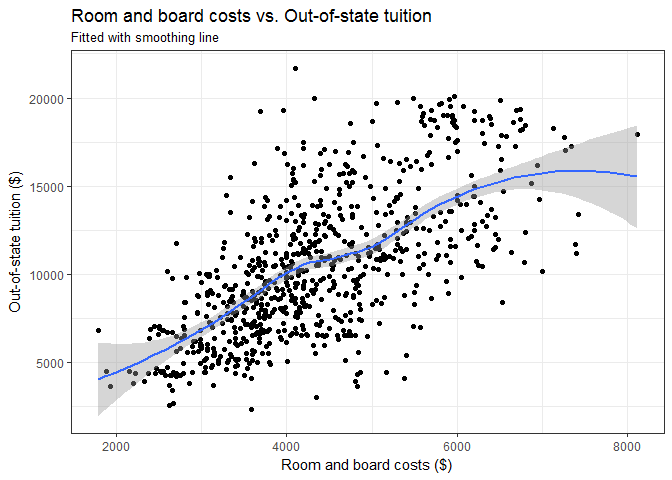

The relationship appears fairly linear, but it looks like the relationship could be quadratic or cubic for some ranges of the x value. I fit a more flexible model using splines below.

``` r
# function to simplify things
RB_spline_cv <- function(data, degree = 3, df = NULL){
  # estimate the model on each fold
  models <- map(data$train, ~ glm(Outstate ~ bs(Room.Board, df = df, degree = degree),
                                  data = .))
  # calculate mse for each test fold
  models_mse <- map2_dbl(models, data$test, mse)
  
  return(mean(models_mse, na.rm = TRUE))
}

# fold the data
college_kfold <- crossv_kfold(college, k = 10)

# estimate mse for polynomial degrees in 1:10
RB_degree_mse <- data_frame(degrees = 1:10,
                                    mse = map_dbl(degrees, ~ RB_spline_cv(college_kfold, degree = ., df = 3 + .))) %>%
  arrange(mse)

# estimate mse for degrees of freedom (aka knots)
RB_df_mse <- data_frame(df = 1:10,
                                mse = map_dbl(df, ~ RB_spline_cv(college_kfold, df = 3 + .))) %>%
  arrange(mse)

ggplot(RB_degree_mse, aes(degrees, mse)) +
  geom_point() +
  geom_line() +
  scale_x_continuous(breaks = 1:10) +
  labs(title = "Optimal number of degrees for out-of-state tuition spline regression",
       subtitle = "Knots = 3",
       x = "Highest-order polynomial",
       y = "10-fold CV MSE")
```

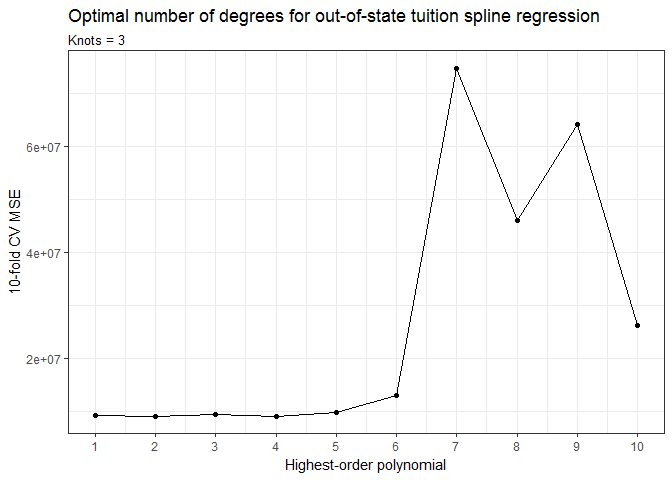

``` r
ggplot(RB_df_mse, aes(df, mse)) +
  geom_point() +
  geom_line() +
  scale_x_continuous(breaks = 1:10) +
  labs(title = "Optimal number of knots for out-of-state tuition spline regression",
       subtitle = "Highest-order polynomial = 3",
       x = "Knots",
       y = "10-fold CV MSE")
```

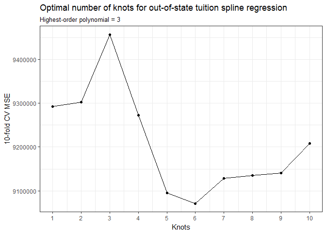

The estimates and resulting graphs are different every time I calculate the MSEs, but the number of degrees does not appear to make a significant difference in terms of MSE as long as the number is less than 7 (MSE does not reach a noticeable global minimum). The optimal number of knots is between 5 and 7.

Using 2 degrees and 6 knots, the regression estimates are as follows:

``` r
RB_optim <- glm(Outstate ~ bs(Room.Board, df = 6, degree = 2), data = college)
summary(RB_optim)
```

    ## 
    ## Call:
    ## glm(formula = Outstate ~ bs(Room.Board, df = 6, degree = 2), 
    ##     data = college)
    ## 
    ## Deviance Residuals: 
    ##     Min       1Q   Median       3Q      Max  
    ## -8622.3  -2010.1   -301.7   1949.7  11175.9  
    ## 
    ## Coefficients:
    ##                                     Estimate Std. Error t value Pr(>|t|)
    ## (Intercept)                           4459.3     1483.9   3.005 0.002741
    ## bs(Room.Board, df = 6, degree = 2)1    930.8     2051.8   0.454 0.650205
    ## bs(Room.Board, df = 6, degree = 2)2   4386.6     1417.9   3.094 0.002048
    ## bs(Room.Board, df = 6, degree = 2)3   6662.4     1562.0   4.265 2.24e-05
    ## bs(Room.Board, df = 6, degree = 2)4   6005.7     1518.5   3.955 8.36e-05
    ## bs(Room.Board, df = 6, degree = 2)5  14624.8     1726.1   8.473  < 2e-16
    ## bs(Room.Board, df = 6, degree = 2)6   8454.1     2320.3   3.644 0.000287
    ##                                        
    ## (Intercept)                         ** 
    ## bs(Room.Board, df = 6, degree = 2)1    
    ## bs(Room.Board, df = 6, degree = 2)2 ** 
    ## bs(Room.Board, df = 6, degree = 2)3 ***
    ## bs(Room.Board, df = 6, degree = 2)4 ***
    ## bs(Room.Board, df = 6, degree = 2)5 ***
    ## bs(Room.Board, df = 6, degree = 2)6 ***
    ## ---
    ## Signif. codes:  0 '***' 0.001 '**' 0.01 '*' 0.05 '.' 0.1 ' ' 1
    ## 
    ## (Dispersion parameter for gaussian family taken to be 9040487)
    ## 
    ##     Null deviance: 1.2559e+10  on 776  degrees of freedom
    ## Residual deviance: 6.9612e+09  on 770  degrees of freedom
    ## AIC: 14659
    ## 
    ## Number of Fisher Scoring iterations: 2

The relationship is highly statistically significant for all knots other than the first, possibly due to lack of data for lower values of `Room.Board`. The p-value is also relatively big for the last knot, suggesting the observations were more sparse at the higher end of the predictor value. Given more data, the overall relationship could be linear, but it could also be that the effect of `Room.Board` is different at extreme values. On the whole, it looks like higher room and board costs are associated with higher tuition rates.

``` r
augment(RB_optim, newdata = data_grid(college, Room.Board)) %>%
  mutate(.fitted_low = .fitted - 1.96 * .se.fit,
         .fitted_high = .fitted + 1.96 * .se.fit) %>%
  ggplot(aes(Room.Board, .fitted)) +
  geom_point(data = college, aes(y = Outstate), alpha = .1) +
  geom_line() +
  geom_line(aes(y = .fitted_low), linetype = 2) +
  geom_line(aes(y = .fitted_high), linetype = 2) +
  geom_vline(xintercept = attr(bs(college$Room.Board, df = 6, degree = 2), "knots"),
             linetype = 2, color = "blue") +
  labs(title = "Second-order polynomial spline of out-of-state tuition",
       subtitle = "Knots = 6",
       x= "Room and board costs ($)",
       y = "Predicted out-of-state tuition ($)")
```

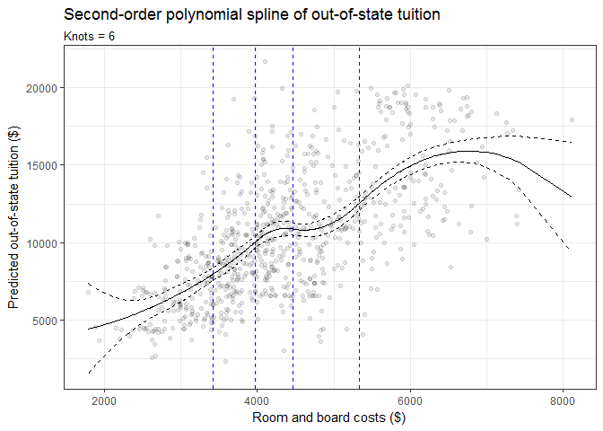

#### Percent of faculty with Ph.D.'s

``` r
ggplot(college, aes(PhD, Outstate)) +
  geom_point() +
  geom_smooth() + 
  labs(title = "Percent of faculty with PhDs vs. Out-of-state tuition",
       subtitle = "Fitted with smoothing line",
       x = "Percent of faculty with PhDs",
       y = "Out-of-state tuition ($)")
```

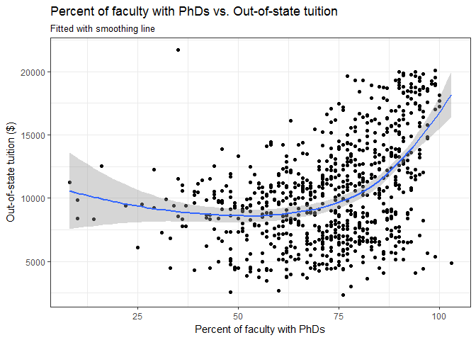

Based on the plot, it looks like the relationship between `PhD` and `Outstate` could be cubic. I first fit a model with monotonic transformation (log of `Outstate` regressed on `PhD`), then a spline regression.

``` r
college <- college %>%
  mutate(logoutstate = log(Outstate)) #take log of Outstate

ggplot(college, aes(x = PhD, y = logoutstate)) + 
  geom_point() +
  geom_smooth() + 
  labs(title = "Percent of faculty with PhDs vs. Log out-of-state tuition",
       subtitle = "Fitted with smoothing line",
       x = "Percent of faculty with PhDs",
       y = "Log of out-of-state tuition in dollars")
```

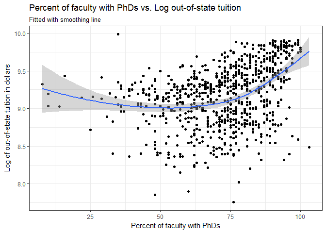

The smoothing line is flatter, but still follows a curve rather than a straight line. It does not look like there are different patterns for different ranges of `PhDsq`, and the curve is fairly smooth. To confirm, I calculate the optimal conditions for a spline regression below.

``` r
# function to simplify things
phd_spline_cv <- function(data, degree = 3, df = NULL){
  # estimate the model on each fold
  models <- map(data$train, ~ glm(Outstate ~ bs(PhD, df = df, degree = degree),
                                  data = .))
  # calculate mse for each test fold
  models_mse <- map2_dbl(models, data$test, mse)
  
  return(mean(models_mse, na.rm = TRUE))
}

# fold the data
college_kfold <- crossv_kfold(college, k = 10)

# estimate mse for polynomial degrees in 1:10
phd_degree_mse <- data_frame(degrees = 1:10,
                                    mse = map_dbl(degrees, ~ phd_spline_cv(college_kfold, degree = ., df = 3 + .))) %>%
  arrange(mse)

# estimate mse for degrees of freedom (aka knots)
phd_df_mse <- data_frame(df = 1:10,
                                mse = map_dbl(df, ~ phd_spline_cv(college_kfold, df = 3 + .))) %>%
  arrange(mse)

ggplot(phd_degree_mse, aes(degrees, mse)) +
  geom_point() +
  geom_line() +
  scale_x_continuous(breaks = 1:10) +
  labs(title = "Optimal number of degrees for out-of-state tuition spline regression",
       subtitle = "Knots = 3",
       x = "Highest-order polynomial",
       y = "10-fold CV MSE")
```

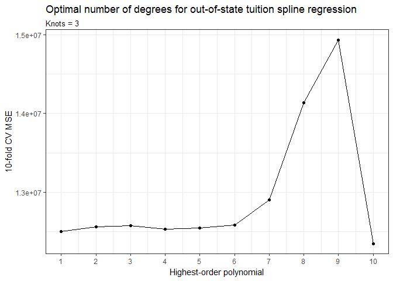

``` r
ggplot(phd_df_mse, aes(df, mse)) +
  geom_point() +
  geom_line() +
  scale_x_continuous(breaks = 1:10) +
  labs(title = "Optimal number of knots for out-of-state tuition spline regression",
       subtitle = "Highest-order polynomial = 3",
       x = "Knots",
       y = "10-fold CV MSE")
```

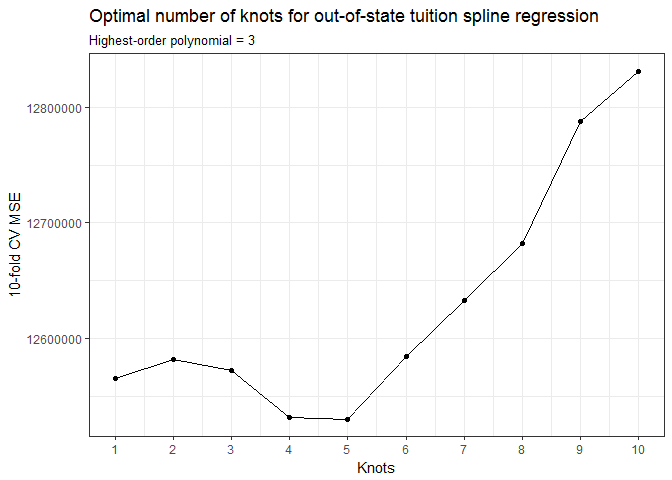

Again, the estimates are not stable, but on the whole it seems that increasing the number of degrees or knots from 1 does not significantly improve model fit. Thus, I apply another transformation (squaring `PhD`) to allow for a linear regression.

``` r
college <- college %>%
  mutate(PhDsq = PhD^2) #take square of PhD

phd_optim <- glm(logoutstate ~ PhDsq, data = college)
summary(phd_optim)
```

    ## 
    ## Call:
    ## glm(formula = logoutstate ~ PhDsq, data = college)
    ## 
    ## Deviance Residuals: 
    ##      Min        1Q    Median        3Q       Max  
    ## -1.43320  -0.26819   0.09182   0.28455   1.10068  
    ## 
    ## Coefficients:
    ##              Estimate Std. Error t value Pr(>|t|)    
    ## (Intercept) 8.802e+00  3.671e-02  239.79   <2e-16 ***
    ## PhDsq       6.740e-05  6.153e-06   10.95   <2e-16 ***
    ## ---
    ## Signif. codes:  0 '***' 0.001 '**' 0.01 '*' 0.05 '.' 0.1 ' ' 1
    ## 
    ## (Dispersion parameter for gaussian family taken to be 0.1422486)
    ## 
    ##     Null deviance: 127.31  on 776  degrees of freedom
    ## Residual deviance: 110.24  on 775  degrees of freedom
    ## AIC: 693.74
    ## 
    ## Number of Fisher Scoring iterations: 2

The relationship is statistically significant, but the parameter estimate is close to zero. The estimate suggests that a one-point increase in the square of the percentage of faculty with PhDs increases the out-of-state tuition by less than 1%.

``` r
ggplot(college, aes(x = PhDsq, y = logoutstate)) + 
  geom_point() +
  geom_smooth(method = "lm") + 
  labs(title = "Percent of faculty with PhDs (squared) vs. Log out-of-state tuition",
       subtitle = "Fitted with OLS line",
       x = "Square of percent of faculty with PhDs",
       y = "Log of out-of-state tuition in dollars")
```


#### Percent of alumni who donate

``` r
ggplot(college, aes(perc.alumni, Outstate)) +
  geom_point() +
  geom_smooth() + 
  labs(title = "Percent of alumni who donate vs. Out-of-state tuition",
       subtitle = "Fitted with smoothing line",
       x = "Percent of alumni who donate",
       y = "Out-of-state tuition ($)")
```

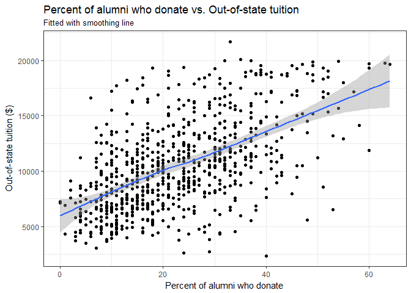

The relation appears strikingly linear. Indeed, the optimal number of degrees and knots (df) for a spline regression are both 1, as shown below:

``` r
# function to simplify things
perc_spline_cv <- function(data, degree = 3, df = NULL){
  # estimate the model on each fold
  models <- map(data$train, ~ glm(Outstate ~ bs(perc.alumni, df = df, degree = degree),
                                  data = .))
  # calculate mse for each test fold
  models_mse <- map2_dbl(models, data$test, mse)
  
  return(mean(models_mse, na.rm = TRUE))
}

# fold the data
college_kfold <- crossv_kfold(college, k = 10)

# estimate mse for polynomial degrees in 1:10
perc_degree_mse <- data_frame(degrees = 1:10,
                                    mse = map_dbl(degrees, ~ perc_spline_cv(college_kfold, degree = ., df = 3 + .))) %>%
  arrange(mse)

# estimate mse for degrees of freedom (aka knots)
perc_df_mse <- data_frame(df = 1:10,
                                mse = map_dbl(df, ~ perc_spline_cv(college_kfold, df = 3 + .))) %>%
  arrange(mse)

ggplot(perc_degree_mse, aes(degrees, mse)) +
  geom_point() +
  geom_line() +
  scale_x_continuous(breaks = 1:10) +
  labs(title = "Optimal number of degrees for out-of-state tuition spline regression",
       subtitle = "Knots = 3",
       x = "Highest-order polynomial",
       y = "10-fold CV MSE")
```

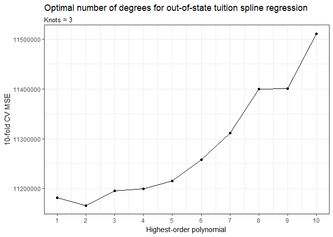

``` r
ggplot(perc_df_mse, aes(df, mse)) +
  geom_point() +
  geom_line() +
  scale_x_continuous(breaks = 1:10) +
  labs(title = "Optimal number of knots for out-of-state tuition spline regression",
       subtitle = "Highest-order polynomial = 3",
       x = "Knots",
       y = "10-fold CV MSE")
```

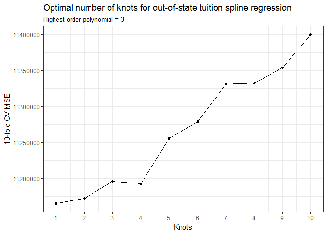

Thus, I estimate a linear model with no transformation.

``` r
perc_optim <- glm(Outstate ~ perc.alumni, data = college)
summary(perc_optim)
```

    ## 
    ## Call:
    ## glm(formula = Outstate ~ perc.alumni, data = college)
    ## 
    ## Deviance Residuals: 
    ##      Min        1Q    Median        3Q       Max  
    ## -11273.0   -2250.9    -361.5    2016.9    9731.4  
    ## 
    ## Coefficients:
    ##             Estimate Std. Error t value Pr(>|t|)    
    ## (Intercept) 6259.480    248.919   25.15   <2e-16 ***
    ## perc.alumni  183.838      9.612   19.13   <2e-16 ***
    ## ---
    ## Signif. codes:  0 '***' 0.001 '**' 0.01 '*' 0.05 '.' 0.1 ' ' 1
    ## 
    ## (Dispersion parameter for gaussian family taken to be 11009186)
    ## 
    ##     Null deviance: 1.2559e+10  on 776  degrees of freedom
    ## Residual deviance: 8.5321e+09  on 775  degrees of freedom
    ## AIC: 14807
    ## 
    ## Number of Fisher Scoring iterations: 2

The relationship is highly statistically significant and the effect appears to be substantial. A one-percent increase in the percent of alumni who donate is associated with an increase of about $180 in out-of-state tuition. This seems counterintuitive, as more donations would increase funds for subsidizing tuition.

#### Instructional expenditure per student

``` r
ggplot(college, aes(Expend, Outstate)) +
  geom_point() +
  geom_smooth() + 
  labs(title = "Expenditure per student vs. Out-of-state tuition",
       subtitle = "Fitted with smoothing line",
       x = "Instructional expenditure per student ($)",
       y = "Out-of-state tuition ($)")
```

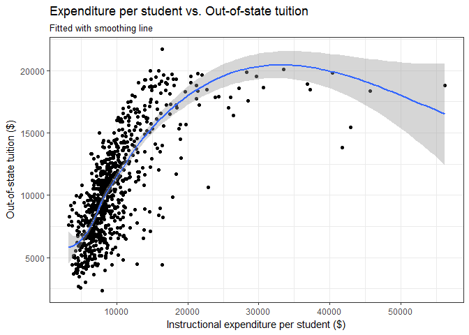

The relationship looks like it follows a cube root or log pattern overall, but there appears to be some discontinuity at the lower end.

``` r
# function to simplify things
exp_spline_cv <- function(data, degree = 3, df = NULL){
  # estimate the model on each fold
  models <- map(data$train, ~ glm(Outstate ~ bs(Expend, df = df, degree = degree),
                                  data = .))
  # calculate mse for each test fold
  models_mse <- map2_dbl(models, data$test, mse)
  
  return(mean(models_mse, na.rm = TRUE))
}

# fold the data
college_kfold <- crossv_kfold(college, k = 10)

# estimate mse for polynomial degrees in 1:10
exp_degree_mse <- data_frame(degrees = 1:10,
                                    mse = map_dbl(degrees, ~ exp_spline_cv(college_kfold, degree = ., df = 3 + .))) %>%
  arrange(mse)

# estimate mse for degrees of freedom (aka knots)
exp_df_mse <- data_frame(df = 1:10, mse = map_dbl(df, ~ exp_spline_cv(college_kfold, df = 3 + .))) %>%
  arrange(mse)

ggplot(exp_degree_mse, aes(degrees, mse)) +
  geom_point() +
  geom_line() +
  scale_x_continuous(breaks = 1:10) +
  labs(title = "Optimal number of degrees for out-of-state tuition spline regression",
       subtitle = "Knots = 3",
       x = "Highest-order polynomial",
       y = "10-fold CV MSE")
```

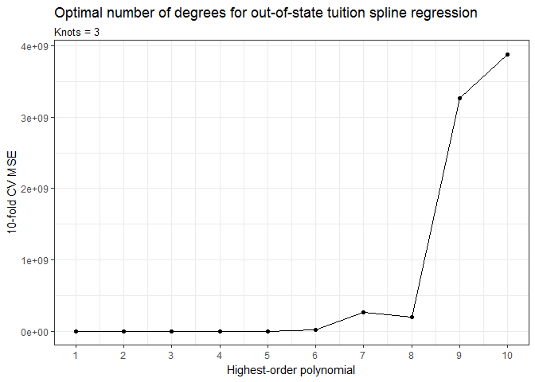

``` r
ggplot(exp_df_mse, aes(df, mse)) +
  geom_point() +
  geom_line() +
  scale_x_continuous(breaks = 1:10) +
  labs(title = "Optimal number of knots for out-of-state tuition spline regression",
       subtitle = "Highest-order polynomial = 3",
       x = "Knots",
       y = "10-fold CV MSE")
```

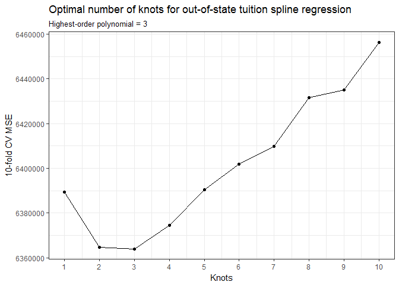

Again, the number of degrees is unimportant. The optimal number of knots appears to be 2 or 3. Using 3 degrees and 2 knots, the regression estimates are as follows:

``` r
exp_optim <- glm(Outstate ~ bs(Expend, df = 2, degree = 3), data = college)
summary(exp_optim)
```

    ## 
    ## Call:
    ## glm(formula = Outstate ~ bs(Expend, df = 2, degree = 3), data = college)
    ## 
    ## Deviance Residuals: 
    ##      Min        1Q    Median        3Q       Max  
    ## -11428.4   -1513.1     199.9    1722.1    5932.1  
    ## 
    ## Coefficients:
    ##                                 Estimate Std. Error t value Pr(>|t|)    
    ## (Intercept)                       3711.4      281.8  13.169  < 2e-16 ***
    ## bs(Expend, df = 2, degree = 3)1  25021.1     1349.2  18.545  < 2e-16 ***
    ## bs(Expend, df = 2, degree = 3)2  10135.6     2350.3   4.312 1.82e-05 ***
    ## bs(Expend, df = 2, degree = 3)3  14308.5     2377.5   6.018 2.72e-09 ***
    ## ---
    ## Signif. codes:  0 '***' 0.001 '**' 0.01 '*' 0.05 '.' 0.1 ' ' 1
    ## 
    ## (Dispersion parameter for gaussian family taken to be 6450537)
    ## 
    ##     Null deviance: 1.2559e+10  on 776  degrees of freedom
    ## Residual deviance: 4.9863e+09  on 773  degrees of freedom
    ## AIC: 14394
    ## 
    ## Number of Fisher Scoring iterations: 2

The relationship is highly statistically significant and substantial at all knots. This suggests an increase in expenditure per student substantially raises tuition costs on average, which makes sense given that tuition rates help cover the costs of instruction.

``` r
augment(exp_optim, newdata = data_grid(college, Expend)) %>%
  mutate(.fitted_low = .fitted - 1.96 * .se.fit,
         .fitted_high = .fitted + 1.96 * .se.fit) %>%
  ggplot(aes(Expend, .fitted)) +
  geom_point(data = college, aes(y = Outstate), alpha = .1) +
  geom_line() +
  geom_line(aes(y = .fitted_low), linetype = 2) +
  geom_line(aes(y = .fitted_high), linetype = 2) +
  geom_vline(xintercept = attr(bs(college$Expend, df = 2, degree = 3), "knots"),
             linetype = 2, color = "blue") +
  labs(title = "Third-order polynomial spline of out-of-state tuition",
       subtitle = "Knots = 2",
       x= "Expenditure per student ($)",
       y = "Predicted out-of-state tuition ($)")
```

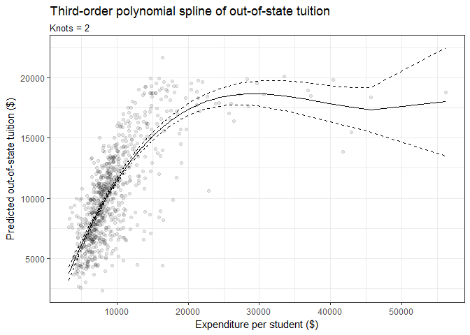

#### Graduation rate

``` r
#clean data
college$Grad.Rate[college$Grad.Rate > 100] <- NA
 
ggplot(filter(college, !is.na(Grad.Rate)), aes(Grad.Rate, Outstate)) +
  geom_point() +
  geom_smooth() + 
  labs(title = "Graduation rate vs. Out-of-state tuition",
       subtitle = "Fitted with smoothing line",
       x = "Graduation rate",
       y = "Out-of-state tuition ($)")
```

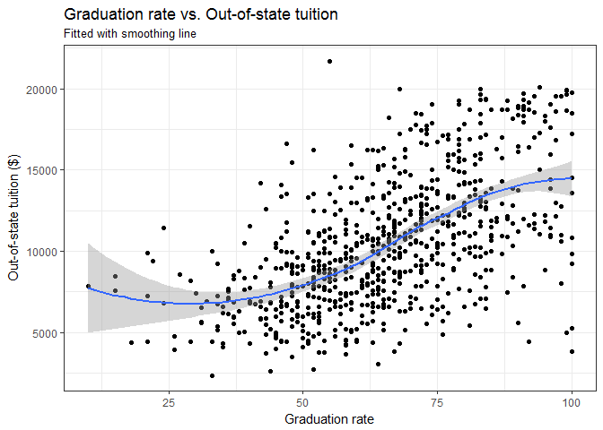

The smoothing line follows an interesting, almost S-shaped curve. It looks like the relationship could be linear with better data. In fact, the optimal number of degrees and knots (df) for a spline regression are both 1.

``` r
# function to simplify things
grad_spline_cv <- function(data, degree = 3, df = NULL){
  # estimate the model on each fold
  models <- map(data$train, ~ glm(Outstate ~ bs(Grad.Rate, df = df, degree = degree),
                                  data = .))
  # calculate mse for each test fold
  models_mse <- map2_dbl(models, data$test, mse)
  
  return(mean(models_mse, na.rm = TRUE))
}

# fold the data
college_kfold <- crossv_kfold(college, k = 10)

# estimate mse for polynomial degrees in 1:10
grad_degree_mse <- data_frame(degrees = 1:10,
                                    mse = map_dbl(degrees, ~ grad_spline_cv(college_kfold, degree = ., df = 3 + .))) %>%
  arrange(mse)

# estimate mse for degrees of freedom (aka knots)
grad_df_mse <- data_frame(df = 1:10, mse = map_dbl(df, ~ grad_spline_cv(college_kfold, df = 3 + .))) %>%
  arrange(mse)

ggplot(grad_degree_mse, aes(degrees, mse)) +
  geom_point() +
  geom_line() +
  scale_x_continuous(breaks = 1:10) +
  labs(title = "Optimal number of degrees for out-of-state tuition spline regression",
       subtitle = "Knots = 3",
       x = "Highest-order polynomial",
       y = "10-fold CV MSE")
```

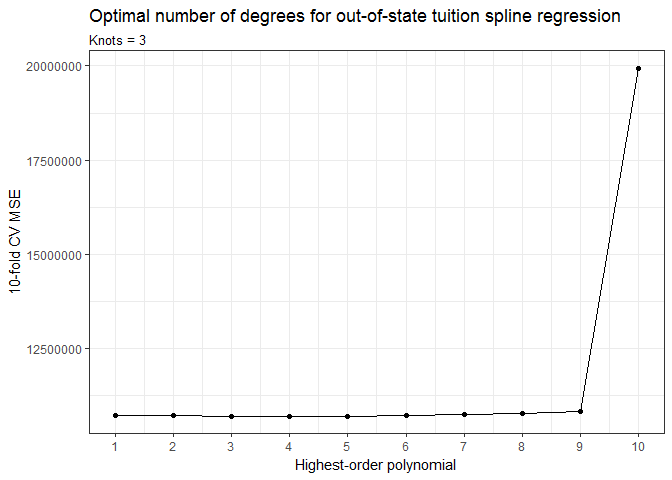

``` r
ggplot(grad_df_mse, aes(df, mse)) +
  geom_point() +
  geom_line() +
  scale_x_continuous(breaks = 1:10) +
  labs(title = "Optimal number of knots for out-of-state tuition spline regression",
       subtitle = "Highest-order polynomial = 3",
       x = "Knots",
       y = "10-fold CV MSE")
```

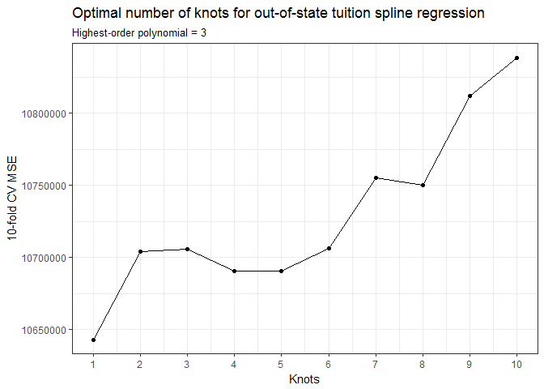

Thus, I fit a linear model with no transformation, as follows:

``` r
grad_optim <- glm(Outstate ~ Grad.Rate, data = college)
summary(grad_optim)
```

    ## 
    ## Call:
    ## glm(formula = Outstate ~ Grad.Rate, data = college)
    ## 
    ## Deviance Residuals: 
    ##      Min        1Q    Median        3Q       Max  
    ## -11297.0   -2243.2    -164.8    2123.0   12668.4  
    ## 
    ## Coefficients:
    ##             Estimate Std. Error t value Pr(>|t|)    
    ## (Intercept) 1569.395    467.976   3.354 0.000837 ***
    ## Grad.Rate    135.676      6.924  19.595  < 2e-16 ***
    ## ---
    ## Signif. codes:  0 '***' 0.001 '**' 0.01 '*' 0.05 '.' 0.1 ' ' 1
    ## 
    ## (Dispersion parameter for gaussian family taken to be 10844996)
    ## 
    ##     Null deviance: 1.2558e+10  on 775  degrees of freedom
    ## Residual deviance: 8.3940e+09  on 774  degrees of freedom
    ##   (1 observation deleted due to missingness)
    ## AIC: 14777
    ## 
    ## Number of Fisher Scoring iterations: 2

The effect is both substantial and highly significant. A one-percent increase in the graduation rate is expected to raise out-of-state tuition by around $135. This is probably because the tuition rate is calculated based on the value of the education, which includes the probability of graduating with a degree.

``` r
#clean data
college$Grad.Rate[college$Grad.Rate > 100] <- NA
 
ggplot(filter(college, !is.na(Grad.Rate)), aes(Grad.Rate, Outstate)) +
  geom_point() +
  geom_smooth(method = "lm") + 
  labs(title = "Graduation rate vs. Out-of-state tuition",
       subtitle = "Fitted with OLS regression line",
       x = "Graduation rate",
       y = "Out-of-state tuition ($)")
```

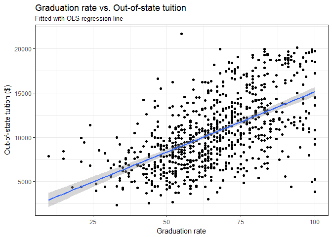

Part 3: College (GAM) \[3 points\]
==================================

#### Questions 1 & 2

**Split the data into a training set and a test set.**

``` r
college_split <- resample_partition(college, c(test = 0.3, train = 0.7)) #split data into 70/30 training/test set
college_train <- college_split$train %>% 
  tbl_df()
college_test <- college_split$test %>% 
  tbl_df()
```

**Estimate an OLS model on the training data, using out-of-state tuition (Outstate) as the response variable and the other six variables as the predictors. Interpret the results and explain your findings, using appropriate techniques (tables, graphs, statistical tests, etc.).**

``` r
college_train_lm <- glm(Outstate ~ Private + Room.Board + PhD + perc.alumni + Expend + Grad.Rate, 
                       data = college_train) #estimate model on training set
summary(college_train_lm)
```

    ## 
    ## Call:
    ## glm(formula = Outstate ~ Private + Room.Board + PhD + perc.alumni + 
    ##     Expend + Grad.Rate, data = college_train)
    ## 
    ## Deviance Residuals: 
    ##     Min       1Q   Median       3Q      Max  
    ## -6388.5  -1371.8     17.8   1254.8  10324.9  
    ## 
    ## Coefficients:
    ##               Estimate Std. Error t value Pr(>|t|)    
    ## (Intercept) -3.151e+03  5.287e+02  -5.961 4.55e-09 ***
    ## PrivateYes   2.629e+03  2.529e+02  10.395  < 2e-16 ***
    ## Room.Board   1.041e+00  1.019e-01  10.218  < 2e-16 ***
    ## PhD          2.983e+01  7.054e+00   4.228 2.77e-05 ***
    ## perc.alumni  5.330e+01  8.958e+00   5.949 4.86e-09 ***
    ## Expend       2.006e-01  1.999e-02  10.034  < 2e-16 ***
    ## Grad.Rate    2.808e+01  6.430e+00   4.367 1.51e-05 ***
    ## ---
    ## Signif. codes:  0 '***' 0.001 '**' 0.01 '*' 0.05 '.' 0.1 ' ' 1
    ## 
    ## (Dispersion parameter for gaussian family taken to be 4206524)
    ## 
    ##     Null deviance: 8769894168  on 543  degrees of freedom
    ## Residual deviance: 2258903451  on 537  degrees of freedom
    ## AIC: 9849.9
    ## 
    ## Number of Fisher Scoring iterations: 2

All of the predictors have a statistically significant relationship with out-of-state tuition. Room and board costs and expenditure per student have very small effects, however. The biggest impact comes from whether the university is private. Out-of-state tuition is expected to be higher by more than $2000 dollars if the university is private rather than public. The percent of alumni who donate, the percent of faculty with PhDs, and the graduation rate have much smaller but still tangible effects, all in the positive direction.

As the variance-covariance matrix below shows, the relationships are probably not independent. For example, The percent of faculty with PhDs has a high positive correlation with whether the university is private, possibly because private universities are more likely to have the financial resources to attract more highly trained faculty. The percent of alumni who donate is highly negatively correlated with whether the university is private, again possibly because private universities tend to be wealthier. Interestingly, graduation rate is negatively correlated with the university being private as well. The effect of the university being private or public likely biases the separate effects of these factors with the model used. To better account for the independent effects of other factors, the model should incorporate interaction effects between predictors.

``` r
vcov(college_train_lm)
```

    ##              (Intercept)    PrivateYes    Room.Board           PhD
    ## (Intercept) 279519.68016 -3.294742e+04 -1.515255e+01 -2.242332e+03
    ## PrivateYes  -32947.41922  6.398143e+04 -7.831334e+00  7.847352e+02
    ## Room.Board     -15.15255 -7.831334e+00  1.037828e-02 -1.744804e-01
    ## PhD          -2242.33218  7.847352e+02 -1.744804e-01  4.976502e+01
    ## perc.alumni    488.42894 -8.045798e+02  1.244079e-01 -1.196196e+01
    ## Expend           3.11609 -4.150226e-01 -5.883424e-04 -3.807559e-02
    ## Grad.Rate     -910.11771 -2.179712e+02 -1.347867e-01 -8.388769e+00
    ##               perc.alumni        Expend     Grad.Rate
    ## (Intercept)  488.42894180  3.1160903799 -9.101177e+02
    ## PrivateYes  -804.57978687 -0.4150225816 -2.179712e+02
    ## Room.Board     0.12440786 -0.0005883424 -1.347867e-01
    ## PhD          -11.96195506 -0.0380755853 -8.388769e+00
    ## perc.alumni   80.25202788 -0.0383624670 -1.606342e+01
    ## Expend        -0.03836247  0.0003995609 -7.278632e-03
    ## Grad.Rate    -16.06342263 -0.0072786323  4.135056e+01

### Question 3

**Estimate a GAM on the training data, using out-of-state tuition (Outstate) as the response variable and the other six variables as the predictors. You can select any non-linear method (or linear) presented in the readings or in-class to fit each variable. Plot the results, and explain your findings. Interpret the results and explain your findings, using appropriate techniques (tables, graphs, statistical tests, etc.).**

Below I fit a GAM using the specifications from part 2.

``` r
college_gam <- gam(Outstate ~ Private + PhDsq + perc.alumni + Grad.Rate + 
                     bs(Room.Board, df = 6, degree = 2) + 
                     bs(Expend, df = 2, degree = 3), 
                   data = college_train, na.action = na.fail)
summary(college_gam)
```

    ## 
    ## Call: gam(formula = Outstate ~ Private + PhDsq + perc.alumni + Grad.Rate + 
    ##     bs(Room.Board, df = 6, degree = 2) + bs(Expend, df = 2, degree = 3), 
    ##     data = college_train, na.action = na.fail)
    ## Deviance Residuals:
    ##      Min       1Q   Median       3Q      Max 
    ## -7120.20 -1164.96   -45.29  1237.03  8037.96 
    ## 
    ## (Dispersion Parameter for gaussian family taken to be 3584350)
    ## 
    ##     Null Deviance: 8769894168 on 543 degrees of freedom
    ## Residual Deviance: 1899705537 on 530 degrees of freedom
    ## AIC: 9769.718 
    ## 
    ## Number of Local Scoring Iterations: 2 
    ## 
    ## Anova for Parametric Effects
    ##                                     Df     Sum Sq    Mean Sq F value
    ## Private                              1 2602754534 2602754534 726.144
    ## PhDsq                                1 2257782108 2257782108 629.900
    ## perc.alumni                          1  366052655  366052655 102.125
    ## Grad.Rate                            1  251726245  251726245  70.229
    ## bs(Room.Board, df = 6, degree = 2)   6  729585347  121597558  33.925
    ## bs(Expend, df = 2, degree = 3)       3  662287743  220762581  61.591
    ## Residuals                          530 1899705537    3584350        
    ##                                       Pr(>F)    
    ## Private                            < 2.2e-16 ***
    ## PhDsq                              < 2.2e-16 ***
    ## perc.alumni                        < 2.2e-16 ***
    ## Grad.Rate                          4.771e-16 ***
    ## bs(Room.Board, df = 6, degree = 2) < 2.2e-16 ***
    ## bs(Expend, df = 2, degree = 3)     < 2.2e-16 ***
    ## Residuals                                       
    ## ---
    ## Signif. codes:  0 '***' 0.001 '**' 0.01 '*' 0.05 '.' 0.1 ' ' 1

#### Private or Public

``` r
# get graphs of each term
college_gam_terms <- preplot(college_gam, se = TRUE, rug = FALSE)

## private
data_frame(x = college_gam_terms$Private$x,
           y = college_gam_terms$Private$y,
           se.fit = college_gam_terms$Private$se.y) %>%
  unique %>%
  mutate(y_low = y - 1.96 * se.fit,
         y_high = y + 1.96 * se.fit,
         x = factor(x)) %>%
  ggplot(aes(x, y, ymin = y_low, ymax = y_high)) +
  geom_errorbar() +
  geom_point() +
  scale_x_discrete(labels = c("Public", "Private")) + 
  labs(title = "GAM of out-of-state tuition",
       x = NULL,
       y = expression(f[1](Private)))
```

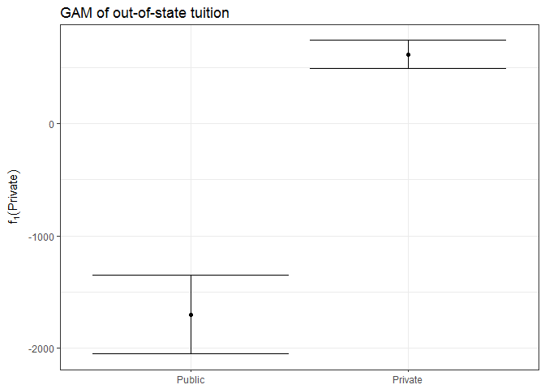

The effect of university type is statistically and substantively significant. A private university likely to have a much higher tuition rate than a public university.

#### Percent of faculty with Ph.D.'s (squared)

``` r
data_frame(x = college_gam_terms$PhDsq$x,
           y = college_gam_terms$PhDsq$y,
           se.fit = college_gam_terms$PhDsq$se.y) %>%
  mutate(y_low = y - 1.96 * se.fit,
         y_high = y + 1.96 * se.fit) %>%
  ggplot(aes(x, y)) +
  geom_line() +
  geom_line(aes(y = y_low), linetype = 2) +
  geom_line(aes(y = y_high), linetype = 2) +
  labs(title = "GAM of out-of-state tuition",
       x = "Square of percent of faculty with PhDs",
       y = expression(f[2](PhDsq)))
```

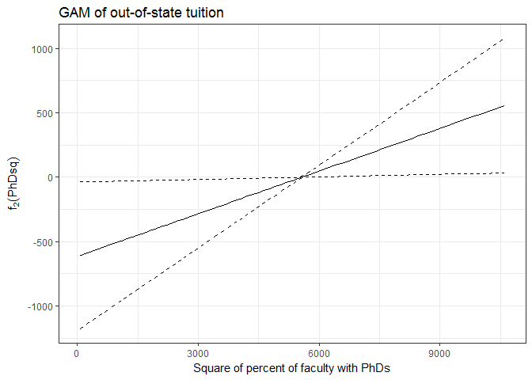

The 95% confidence intervals get extremely wide as x-values approach the minimum or maximum, and practically always include 0 for every value of `PhDsq`. This suggests the relationship with out-of-state tuition is not significant.

#### Percent of alumni who donate

``` r
data_frame(x = college_gam_terms$perc.alumni$x,
           y = college_gam_terms$perc.alumni$y,
           se.fit = college_gam_terms$perc.alumni$se.y) %>%
  mutate(y_low = y - 1.96 * se.fit,
         y_high = y + 1.96 * se.fit) %>%
  ggplot(aes(x, y)) +
  geom_line() +
  geom_line(aes(y = y_low), linetype = 2) +
  geom_line(aes(y = y_high), linetype = 2) +
  labs(title = "GAM of out-of-state tuition",
       x = "Percent of alumni who donate",
       y = expression(f[3](perc.alumni)))
```

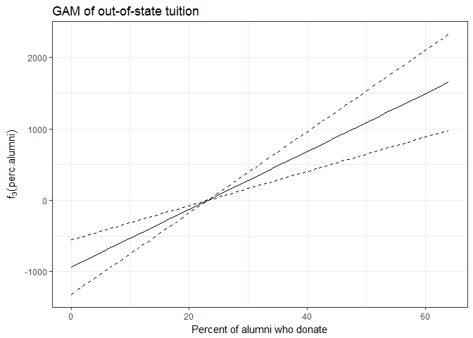

The 95% confidence intervals get wide toward the ends, but the effect appears to be substantial judging by the slope of the line.

#### Graduation rate

``` r
data_frame(x = college_gam_terms$Grad.Rate$x,
           y = college_gam_terms$Grad.Rate$y,
           se.fit = college_gam_terms$Grad.Rate$se.y) %>%
  mutate(y_low = y - 1.96 * se.fit,
         y_high = y + 1.96 * se.fit) %>%
  ggplot(aes(x, y)) +
  geom_line() +
  geom_line(aes(y = y_low), linetype = 2) +
  geom_line(aes(y = y_high), linetype = 2) +
  labs(title = "GAM of out-of-state tuition",
       x = "Graduation Rate",
       y = expression(f[4](Grad.Rate)))
```

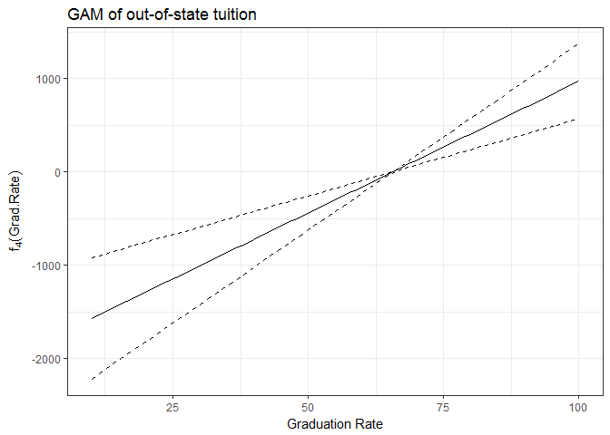

Again, the confidence intervals are sizable, but the slope of the line suggests graduation rate still has a significant effect.

#### Room and board costs

``` r
data_frame(x = college_gam_terms$`bs(Room.Board, df = 6, degree = 2)`$x,
           y = college_gam_terms$`bs(Room.Board, df = 6, degree = 2)`$y,
           se.fit = college_gam_terms$`bs(Room.Board, df = 6, degree = 2)`$se.y) %>%
  mutate(y_low = y - 1.96 * se.fit,
         y_high = y + 1.96 * se.fit) %>%
  ggplot(aes(x, y)) +
  geom_line() +
  geom_line(aes(y = y_low), linetype = 2) +
  geom_line(aes(y = y_high), linetype = 2) +
  labs(title = "GAM of out-of-state tuition",
       subtitle = "Second-order polynomial spline, 6 knots",
       x = "Room and board costs ($)",
       y = expression(f[5](Room.Board)))
```

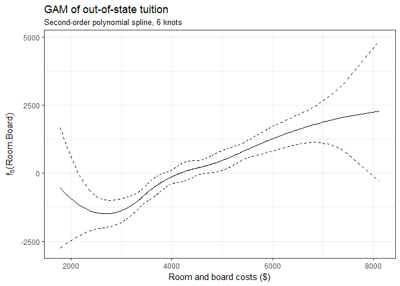

The 95% confidence intervals get very wide toward the ends of the x-axis but are fairly narrow in the middle range. There does appear to be a significant, if not large effect of room and board costs on out-of-state tuition.

#### Instructional expenditure per student

``` r
data_frame(x = college_gam_terms$`bs(Expend, df = 2, degree = 3)`$x,
           y = college_gam_terms$`bs(Expend, df = 2, degree = 3)`$y,
           se.fit = college_gam_terms$`bs(Expend, df = 2, degree = 3)`$se.y) %>%
  mutate(y_low = y - 1.96 * se.fit,
         y_high = y + 1.96 * se.fit) %>%
  ggplot(aes(x, y)) +
  geom_line() +
  geom_line(aes(y = y_low), linetype = 2) +
  geom_line(aes(y = y_high), linetype = 2) +
  labs(title = "GAM of out-of-state tuition",
       subtitle = "Third-order polynomial spline, 2 knots",
       x = "Instructional expenditure per student ($)",
       y = expression(f[6](Expend)))
```

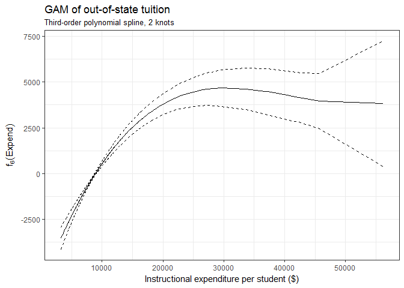

The confidence intervals get progressively wider as `Expend` increases, probably because of sparse observations. On the other hand, the curve shows a clear and dramatic upward trend before it starts to slope downward at the higher values of `Expend`. This suggests that expenditure per student does have a significant effect on out-of-state tuition, at least when expenditure is not very high.

### Question 4

**Use the test set to evaluate the model fit of the estimated OLS and GAM models, and explain the results obtained.**

``` r
OLS_validation_mse <- mse(college_train_lm, college_test)
GAM_validation_mse <- mse(college_gam, college_test)

college_pred <- college_test %>%
  add_residuals(college_train_lm) %>%
  rename(resid_OLS = resid) %>%
  add_residuals(college_gam) 

# distribution of residuals
ggplot(college_pred) +
  geom_freqpoly(aes(resid), color = "red") + 
  geom_freqpoly(aes(resid_OLS), color = "blue") + 
  labs(title ="Distribution of residuals for OLS and GAM models", 
       caption = "Blue = OLS, Red = GAM")
```

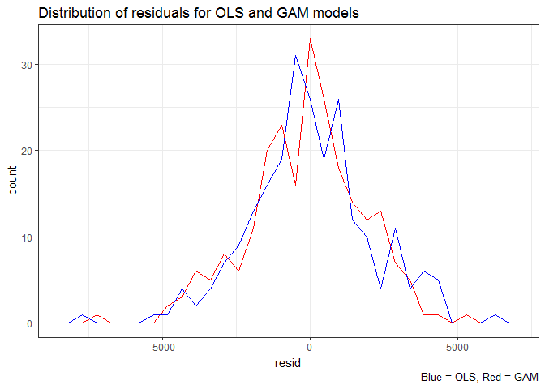

The MSE for the OLS model is 4.000135810^{6}, and the MSE for the GAM model is 3.712314510^{6}. The GAM MSE is lower, suggesting that the GAM model is a better fit. The distribution of residuals suggests that it is also less biased. The residuals from the GAM model peak at zero, whereas the OLS residuals peak to the left of zero.

### Question 5

**For which variables, if any, is there evidence of a non-linear relationship with the response?**

To test for non-linearity, I conducted ANOVA tests on all of the non-binary predictor variables. There is evidence of a non-linear relationship with `Outstate` for only `PhD` and `Expend`, which makes sense given the graphs plotted previously.

#### PhD

``` r
#PhD
gam.m1=gam(Outstate~ Private + Room.Board + PhD + perc.alumni + Expend + Grad.Rate, 
           data=college_train, na.action = na.fail)
gam.m2=gam(Outstate~ Private + Room.Board + bs(PhD, degree = 2) + perc.alumni + Expend + Grad.Rate,  
           data=college_train, na.action = na.fail)
anova(gam.m1, gam.m2, test="F")
```

    ## Analysis of Deviance Table
    ## 
    ## Model 1: Outstate ~ Private + Room.Board + PhD + perc.alumni + Expend + 
    ##     Grad.Rate
    ## Model 2: Outstate ~ Private + Room.Board + bs(PhD, degree = 2) + perc.alumni + 
    ##     Expend + Grad.Rate
    ##   Resid. Df Resid. Dev Df Deviance      F    Pr(>F)    
    ## 1       537 2258903451                                 
    ## 2       536 2209391161  1 49512291 12.012 0.0005711 ***
    ## ---
    ## Signif. codes:  0 '***' 0.001 '**' 0.01 '*' 0.05 '.' 0.1 ' ' 1

#### Expend

``` r
#Expend
gam.m1=gam(Outstate~ Private + Room.Board + PhD + perc.alumni + Expend + Grad.Rate, 
           data=college_train, na.action = na.fail)
gam.m2=gam(Outstate~ Private + Room.Board + PhD + perc.alumni + bs(Expend, degree = 2) + Grad.Rate,  
           data=college_train, na.action = na.fail)
anova(gam.m1, gam.m2, test="F")
```

    ## Analysis of Deviance Table
    ## 
    ## Model 1: Outstate ~ Private + Room.Board + PhD + perc.alumni + Expend + 
    ##     Grad.Rate
    ## Model 2: Outstate ~ Private + Room.Board + PhD + perc.alumni + bs(Expend, 
    ##     degree = 2) + Grad.Rate
    ##   Resid. Df Resid. Dev Df  Deviance      F    Pr(>F)    
    ## 1       537 2258903451                                  
    ## 2       536 1947889334  1 311014117 85.582 < 2.2e-16 ***
    ## ---
    ## Signif. codes:  0 '***' 0.001 '**' 0.01 '*' 0.05 '.' 0.1 ' ' 1
