Problem set \#8: tree-based methods and support vector machines
================
Soo Wan Kim
March 4, 2017

-   [Part 1: Sexy Joe Biden (redux times two) \[3 points\]](#part-1-sexy-joe-biden-redux-times-two-3-points)
    -   [Subpart 1](#subpart-1)
    -   [Subpart 2](#subpart-2)
    -   [Subpart 3](#subpart-3)
    -   [Subpart 4](#subpart-4)
    -   [Subpart 5](#subpart-5)
    -   [Subpart 6](#subpart-6)
    -   [MSE by Method Comparison Chart](#mse-by-method-comparison-chart)
-   [Part 2: Modeling voter turnout \[3 points\]](#part-2-modeling-voter-turnout-3-points)
    -   [Subpart 1](#subpart-1-1)
    -   [Subpart 2](#subpart-2-1)

Part 1: Sexy Joe Biden (redux times two) \[3 points\]
=====================================================

### Subpart 1

**Split the data into a training set (70%) and a validation set (30%).**

``` r
biden <- read.csv("data/biden.csv") #import data

biden_split <- resample_partition(biden, c(test = 0.3, train = 0.7)) #split data into 70/30 training/test set
biden_train <- biden_split$train %>% 
  tbl_df()
biden_test <- biden_split$test %>% 
  tbl_df()
```

### Subpart 2

**Fit a decision tree to the training data, with `biden` as the response variable and the other variables as predictors. Plot the tree and interpret the results. What is the test MSE? Leave the control options for `tree()` at their default values.**

``` r
biden_tree <- tree(biden ~ ., data = biden_train) #fit tree
mod <- biden_tree

# plot tree
tree_data <- dendro_data(mod)

ggplot(segment(tree_data)) +
  labs(title = "Decision tree of Biden warmth",
       subtitle = "Default control options") + 
  geom_segment(aes(x = x, y = y, xend = xend, yend = yend), 
               alpha = 0.5) +
  geom_text(data = label(tree_data), 
            aes(x = x, y = y, label = label_full), vjust = -0.5, size = 3) +
  geom_text(data = leaf_label(tree_data), 
            aes(x = x, y = y, label = label), vjust = 0.5, size = 3) +
  theme_dendro()
```

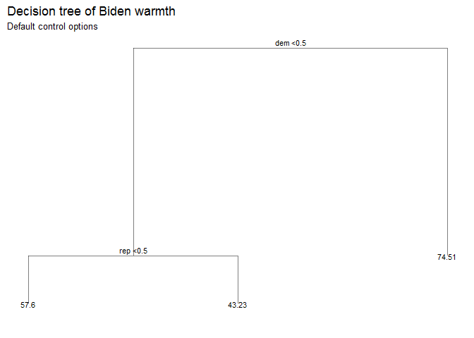

``` r
mse_default <- mse(mod, biden_test)
```

The plot includes only two variables, `dem` and `rep`, suggesting that party identification is the most important factor in this model. The plot shows that Democrats are more likely to have higher Biden warmth than non-Democrats, and independents are more likely to have higher Biden warmth than Republicans. The test MSE is 406.4167458.

### Subpart 3

**Now fit another tree to the training data with the following `control` options:**

`tree(control = tree.control(nobs = # number of rows in the training set,                               mindev = 0))`

**Use cross-validation to determine the optimal level of tree complexity, plot the optimal tree, and interpret the results. Does pruning the tree improve the test MSE?**

``` r
biden_tree2 <- tree(biden ~ ., data = biden_train, #fit another tree
                    control = tree.control(nobs = nrow(biden_train),
                            mindev = 0))

# generate 10-fold CV trees
biden_cv <- crossv_kfold(biden, k = 10) %>%
  mutate(tree = map(train, ~ tree(biden ~ ., data = .,
     control = tree.control(nobs = nrow(biden),
                            mindev = 0))))

# calculate each possible prune result for each fold
biden_cv <- expand.grid(biden_cv$.id, 2:10) %>%
  as_tibble() %>%
  mutate(Var2 = as.numeric(Var2)) %>%
  rename(.id = Var1,
         k = Var2) %>%
  left_join(biden_cv) %>%
  mutate(prune = map2(tree, k, ~ prune.tree(.x, best = .y)),
         mse = map2_dbl(prune, test, mse))

#display test MSE for each number of terminal nodes
biden_cv %>%
  select(k, mse) %>%
  group_by(k) %>%
  summarize(test_mse = mean(mse),
            sd = sd(mse, na.rm = TRUE)) %>%
  ggplot(aes(k, test_mse)) +
  geom_point() +
  geom_line() +
  labs(title = "MSE at each number of terminal nodes",
       subtitle = "Customized control options",
       x = "Number of terminal nodes",
       y = "MSE")
```

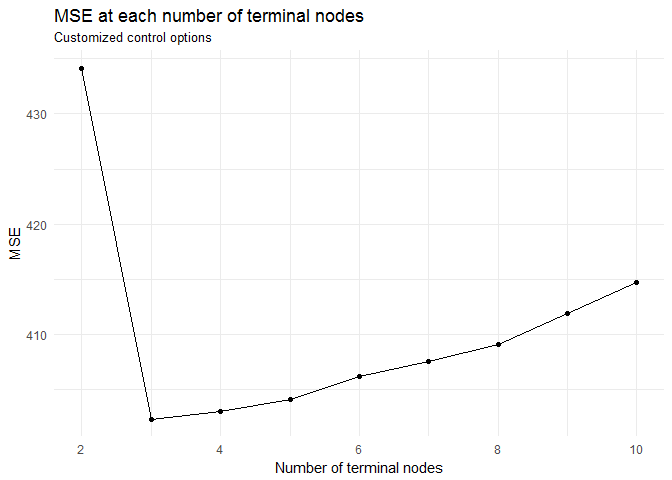

The optimal number of terminal nodes is 3.

``` r
#function to calculate MSE
mse <- function(model, data) {
  x <- modelr:::residuals(model, data)
  mean(x ^ 2, na.rm = TRUE)
}

biden_tree2 <- tree(biden ~ ., data = biden_train, 
                    control = tree.control(nobs = nrow(biden_train),
                            mindev = 0))

mod <- prune.tree(biden_tree2, best = 3)

# plot tree
tree_data <- dendro_data(mod)
ggplot(segment(tree_data)) +
  labs(title = "Decision tree of biden warmth",
       subtitle = "Updated control options, 3 terminal nodes") + 
  geom_segment(aes(x = x, y = y, xend = xend, yend = yend), 
               alpha = 0.5) +
  geom_text(data = label(tree_data), 
            aes(x = x, y = y, label = label_full), vjust = -0.5, size = 3) +
  geom_text(data = leaf_label(tree_data), 
            aes(x = x, y = y, label = label), vjust = 0.5, size = 3) +
  theme_dendro()
```

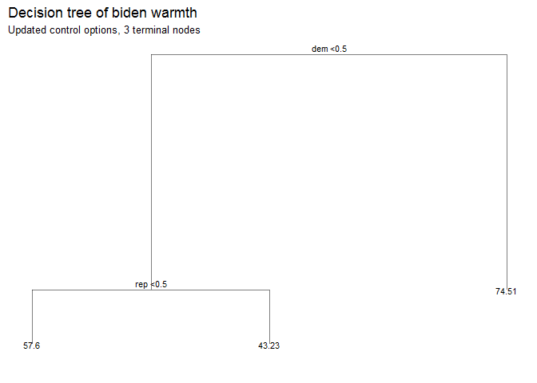

``` r
mse_whole <- mse(biden_tree2, biden_test)
mse_pruned <- mse(mod, biden_test)
```

This tree is identical to the one produced in subpart 2. Without pruning, the test MSE for this model is 481.4899366. Pruning reduces it to 406.4167458, showing that pruning improves model fit.

### Subpart 4

**Use the bagging approach to analyze this data. What test MSE do you obtain? Obtain variable importance measures and interpret the results.**

``` r
biden_rf_data <- biden %>% #prep data for random forest method
    mutate_each(funs(as.factor(.)), female, dem, rep) %>%
    na.omit

biden_rf_split <- resample_partition(biden_rf_data, c(test = 0.3, train = 0.7)) #split data into 70/30 training/test set
biden_rf_train <- biden_rf_split$train %>% 
  tbl_df()
biden_rf_test <- biden_rf_split$test %>% 
  tbl_df()

(biden_bag <- randomForest(biden ~ ., data = biden_rf_train, #bagging
                             mtry = 5, ntree = 500))
```

    ## 
    ## Call:
    ##  randomForest(formula = biden ~ ., data = biden_rf_train, mtry = 5,      ntree = 500) 
    ##                Type of random forest: regression
    ##                      Number of trees: 500
    ## No. of variables tried at each split: 5
    ## 
    ##           Mean of squared residuals: 478.105
    ##                     % Var explained: 13.52

``` r
mse_bagged <- mse(biden_bag, biden_rf_test)

data_frame(var = rownames(importance(biden_bag)),
           MeanDecreaseGini = importance(biden_bag)[,1]) %>%
  mutate(var = fct_reorder(var, MeanDecreaseGini, fun = median)) %>%
  ggplot(aes(var, MeanDecreaseGini)) +
  geom_point() +
  coord_flip() +
  labs(title = "Predicting Biden warmth",
       subtitle = "Bagging",
       x = NULL,
       y = "Average decrease in the Gini Index")
```


Using the bagging approach, age appears to be the most influential factor, followed by being a Democrat and then by education. The test MSE for the bagging approach is 512.6503892.

### Subpart 5

**Use the random forest approach to analyze this data. What test MSE do you obtain? Obtain variable importance measures and interpret the results. Describe the effect of *m*, the number of variables considered at each split, on the error rate obtained.**

``` r
(biden_rf <- randomForest(biden ~ ., data = biden_rf_train, #fit Random Forest
                            ntree = 500))
```

    ## 
    ## Call:
    ##  randomForest(formula = biden ~ ., data = biden_rf_train, ntree = 500) 
    ##                Type of random forest: regression
    ##                      Number of trees: 500
    ## No. of variables tried at each split: 1
    ## 
    ##           Mean of squared residuals: 412.9224
    ##                     % Var explained: 25.31

``` r
mse_rf <- mse(biden_rf, biden_rf_test)

data_frame(var = rownames(importance(biden_rf)),
           MeanDecreaseGini = importance(biden_rf)[,1]) %>%
  mutate(var = fct_reorder(var, MeanDecreaseGini, fun = median)) %>%
  ggplot(aes(var, MeanDecreaseGini)) +
  geom_point() +
  coord_flip() +
  labs(title = "Predicting Biden warmth",
       subtitle = "Random Forest",
       x = NULL,
       y = "Average decrease in the Gini Index")
```

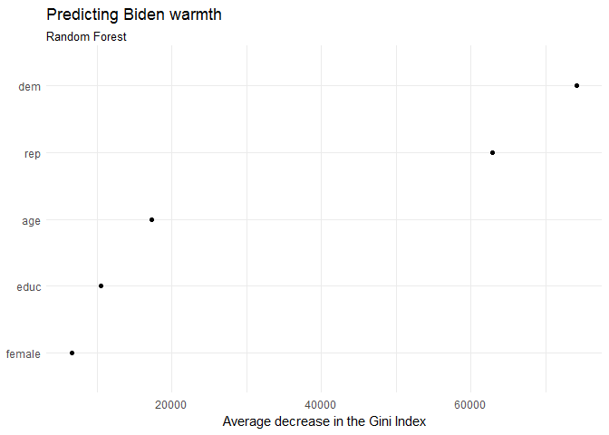

Using the random forest approach, party identification is the most important factor, with other factors having much smaller effects. The test MSE is 388.2563494, showing that the random forest approach improves on the bagging approach. Decreasing *m* reduces the error rate by reducing bias in model estimation.

### Subpart 6

**Use the boosting approach to analyze the data. What test MSE do you obtain? How does the value of the shrinkage parameter *λ* influence the test MSE?**

First, we calculate the optimal number of iterations when depth = 4:

``` r
biden_boost <- gbm(biden ~ ., data = biden_train, 
                   distribution = "gaussian", n.trees = 5000, interaction.depth = 4)

opt_iter <- gbm.perf(biden_boost, plot.it=FALSE)
```

    ## Using OOB method...

``` r
opt_iter
```

    ## [1] 2097

Then we fit the boosting model with the optimal number of trees.

``` r
biden_boost_opt <- gbm(biden ~ ., data = biden_train, 
                   distribution = "gaussian", n.trees = opt_iter[[1]], interaction.depth = 4)

summary(biden_boost_opt)
```

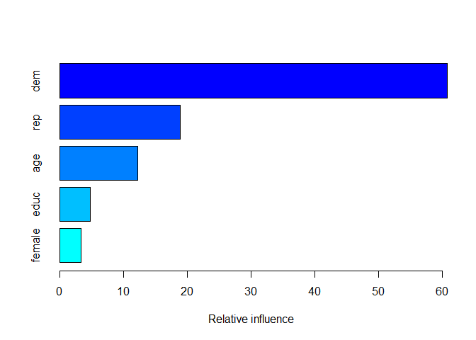

    ##           var   rel.inf
    ## dem       dem 60.762848
    ## rep       rep 18.851629
    ## age       age 12.209014
    ## educ     educ  4.806662
    ## female female  3.369847

``` r
yhat_boost <- predict(biden_boost_opt, newdata = biden_test, n.trees = opt_iter[[1]])
mse_boost <- mean((yhat_boost - biden_test$biden)^2)
```

Party identification is the most influential factor, followed by age.

Partial dependence plots for `dem`, `rep`, `age`, and `educ`:

``` r
par(mfrow =c(2,2))
plot(biden_boost,i="dem")
plot(biden_boost,i="rep")
plot(biden_boost,i="age")
plot(biden_boost,i="educ")
```

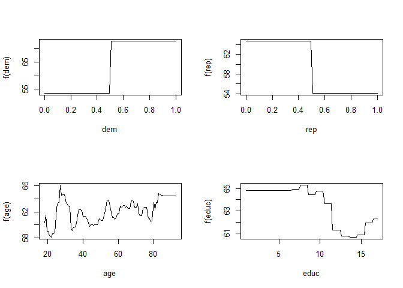

Expected Biden warmth increases with Democratic party identification and decreases with Republican party identification. There is an overall upward trend as age increases, and an overall downward trend as education increases.

The test MSE is 404.6510492.

Increasing the shrinkage parameter *λ* increases the MSE, as shown below:

``` r
#fit different models with varying lambda values
biden_boost1 <- gbm(biden ~ ., data = biden_train, 
                   distribution = "gaussian", n.trees = opt_iter[[1]], interaction.depth = 4,
                   shrinkage = 0.001, verbose = F)

biden_boost2 <- gbm(biden ~ ., data = biden_train, 
                   distribution = "gaussian", n.trees = opt_iter[[1]], interaction.depth = 4,
                   shrinkage = 0.005, verbose = F)
                   
biden_boost3 <- gbm(biden ~ ., data = biden_train, 
                   distribution = "gaussian", n.trees = opt_iter[[1]], interaction.depth = 4,
                   shrinkage = 0.02, verbose = F)

biden_boost4 <- gbm(biden ~ ., data = biden_train, 
                   distribution = "gaussian", n.trees = opt_iter[[1]], interaction.depth = 4,
                   shrinkage = 0.03, verbose = F)

biden_boost5 <- gbm(biden ~ ., data = biden_train, 
                   distribution = "gaussian", n.trees = opt_iter[[1]], interaction.depth = 4,
                   shrinkage = 0.1, verbose = F)

boost_models <- c(biden_boost1, biden_boost2, biden_boost3, biden_boost4, biden_boost5)

#calculate MSEs for each
mse_booster <- function(model) {
  yhat_boost <- predict(model, newdata = biden_test, n.trees = opt_iter[[1]])
  mse <- mean((yhat_boost - biden_test$biden)^2)
}

boost_mse_vals <- as.data.frame(c(mse_booster(biden_boost1), mse_booster(biden_boost2), 
                    mse_booster(biden_boost3), mse_booster(biden_boost4), mse_booster(biden_boost5)))

#report in graph
boost_lambda_vals <- as.data.frame(c(0.001, 0.005, 0.02, 0.03, 0.1))
boost_df <- cbind(boost_lambda_vals, boost_mse_vals)
colnames(boost_df) <- c("Lambda", "MSE")

ggplot(data = boost_df, mapping = aes(x = Lambda, y = MSE)) + 
  geom_point() + 
  geom_line() + 
  labs(title = "Test MSEs for different shrinkage parameters, depth = 4",
       subtitle = "Using boosting to predict Biden warmth",
       x = "Lambda",
       y = "Test MSE")
```

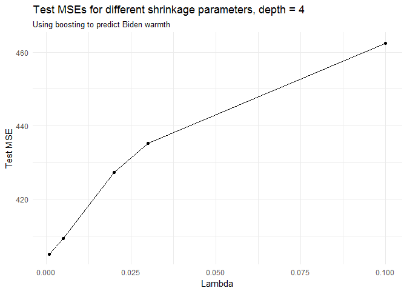

### MSE by Method Comparison Chart

``` r
#make chart of mse values by method 
subpart_list <- as.data.frame(c(2, 3, 3, 4, 5, 6))
desc_list <- as.data.frame(c("Single tree, default control options", 
                             "Single tree, not pruned", 
                             "Single tree, pruned (3 leaves)", 
                             "Bagging", "Random forest", "Boosting"))
mse_list <- as.data.frame(c(mse_default, mse_whole, 
                            mse_pruned, mse_bagged, mse_rf, mse_boost))

mse_df <- cbind(subpart_list, desc_list)
mse_df <- cbind(mse_df, mse_list)
colnames(mse_df) <- c("Subpart", "Method", "MSE")

kable(mse_df, format = "html")
```

<table>
<thead>
<tr>
<th style="text-align:right;">
Subpart
</th>
<th style="text-align:left;">
Method
</th>
<th style="text-align:right;">
MSE
</th>
</tr>
</thead>
<tbody>
<tr>
<td style="text-align:right;">
2
</td>
<td style="text-align:left;">
Single tree, default control options
</td>
<td style="text-align:right;">
406.4167
</td>
</tr>
<tr>
<td style="text-align:right;">
3
</td>
<td style="text-align:left;">
Single tree, not pruned
</td>
<td style="text-align:right;">
481.4899
</td>
</tr>
<tr>
<td style="text-align:right;">
3
</td>
<td style="text-align:left;">
Single tree, pruned (3 leaves)
</td>
<td style="text-align:right;">
406.4167
</td>
</tr>
<tr>
<td style="text-align:right;">
4
</td>
<td style="text-align:left;">
Bagging
</td>
<td style="text-align:right;">
512.6504
</td>
</tr>
<tr>
<td style="text-align:right;">
5
</td>
<td style="text-align:left;">
Random forest
</td>
<td style="text-align:right;">
388.2563
</td>
</tr>
<tr>
<td style="text-align:right;">
6
</td>
<td style="text-align:left;">
Boosting
</td>
<td style="text-align:right;">
404.6510
</td>
</tr>
</tbody>
</table>
Part 2: Modeling voter turnout \[3 points\]
===========================================

### Subpart 1

**Use cross-validation techniques and standard measures of model fit (e.g. test error rate, PRE, ROC curves/AUC) to compare and evaluate at least five tree-based models of voter turnout. Select the best model and interpret the results using whatever methods you see fit (graphs, tables, model fit statistics, predictions for hypothetical observations, etc.)**

For this part of the problem I will estimate five random forest models:

1.  vote96 ~ mhealth\_sum
2.  vote96 ~ mhealth\_sum + I(mhealth\_sum^2)
3.  vote96 ~ mhealth\_sum + age
4.  vote96 ~ mhealth\_sum + inc10
5.  vote96 ~ mhealth\_sum + educ + inc10

I use the validation set approach (70/30 training-test split) to train and test each model.

``` r
mh <- read.csv("data/mental_health.csv")

#define regression models
model1 <- vote96 ~ mhealth_sum
model2 <- vote96 ~ mhealth_sum + I(mhealth_sum^2)
model3 <- vote96 ~ mhealth_sum + age
model4 <- vote96 ~ mhealth_sum + inc10
model5 <- vote96 ~ mhealth_sum + educ + inc10

mh_rf_data <- mh %>% #prep data for random forest method
  select(-black, -female, -married) %>%
  na.omit

mh_rf_split <- resample_partition(mh_rf_data, c(test = 0.3, train = 0.7)) #split data into 70/30 training/test set
mh_rf_train <- mh_rf_split$train %>% 
  tbl_df()
mh_rf_test <- mh_rf_split$test %>% 
  tbl_df()

#estimate random forest models
mh_rf1 <- randomForest(model1, data = mh_rf_train, ntree = 500)
mh_rf2 <- randomForest(model2, data = mh_rf_train, ntree = 500)
mh_rf3 <- randomForest(model3, data = mh_rf_train, ntree = 500)
mh_rf4 <- randomForest(model4, data = mh_rf_train, ntree = 500)
mh_rf5 <- randomForest(model5, data = mh_rf_train, ntree = 500)
```

``` r
#Test each model and report the results

#Test MSEs
mse_list <- as.data.frame(c(mse(mh_rf1, mh_rf_test), 
                            mse(mh_rf2, mh_rf_test), 
                            mse(mh_rf3, mh_rf_test), 
                            mse(mh_rf4, mh_rf_test), 
                            mse(mh_rf5, mh_rf_test)))

#test error rate
mh_model_accuracy <- mh_rf_test %>%
  as_tibble() %>%
  add_predictions(mh_rf1) %>% #model 1
  mutate(pred1 = as.numeric(pred > .5)) %>%
  rename(prob1 = pred) %>%
  add_predictions(mh_rf2) %>% #model 2
  mutate(pred2 = as.numeric(pred > .5)) %>%
  rename(prob2 = pred) %>%
  add_predictions(mh_rf3) %>% #model 3
  mutate(pred3 = as.numeric(pred > .5)) %>%
  rename(prob3 = pred) %>%
  add_predictions(mh_rf4) %>%
  mutate(pred4 = as.numeric(pred > .5)) %>%
  rename(prob4 = pred) %>%
  add_predictions(mh_rf5) %>%
  mutate(pred5 = as.numeric(pred > .5)) %>%
  rename(prob5 = pred)

mh_model_acc1 <- mean(mh_model_accuracy$vote96 == mh_model_accuracy$pred1, na.rm = TRUE)
mh_model_acc2 <- mean(mh_model_accuracy$vote96 == mh_model_accuracy$pred2, na.rm = TRUE)
mh_model_acc3 <- mean(mh_model_accuracy$vote96 == mh_model_accuracy$pred3, na.rm = TRUE)
mh_model_acc4 <- mean(mh_model_accuracy$vote96 == mh_model_accuracy$pred4, na.rm = TRUE)
mh_model_acc5 <- mean(mh_model_accuracy$vote96 == mh_model_accuracy$pred5, na.rm = TRUE)

acc_list <- as.data.frame(c(mh_model_acc1,
              mh_model_acc2,
              mh_model_acc3,
              mh_model_acc4,
              mh_model_acc5))

#PREs
# get the actual values for y from the data
y <- mh_model_accuracy$vote96
# get the predicted values for y from the model
y.hat1 <- mh_model_accuracy$pred1
y.hat2 <- mh_model_accuracy$pred2
y.hat3 <- mh_model_accuracy$pred3
y.hat4 <- mh_model_accuracy$pred4
y.hat5 <- mh_model_accuracy$pred5

# calculate the errors for the null model and each rf model

getmode <- function(v) { #function to calculate mode
   uniqv <- unique(v)
   uniqv[which.max(tabulate(match(v, uniqv)))]
}

vote_mode <- getmode(mh_model_accuracy$vote96)

E1 <- sum(y != vote_mode)
E2_1 <- sum(y != y.hat1)
E2_2 <- sum(y != y.hat2)
E2_3 <- sum(y != y.hat3)
E2_4 <- sum(y != y.hat4)
E2_5 <- sum(y != y.hat5)

# calculate the proportional reduction in error
pre1 <- (E1 - E2_1) / E1
pre2 <- (E1 - E2_2) / E1
pre3 <- (E1 - E2_3) / E1
pre4 <- (E1 - E2_4) / E1
pre5 <- (E1 - E2_5) / E1

pre_list <- as.data.frame(c(pre1, pre2, pre3, pre4, pre5))

#put metrics in one table and report

model_list <- as.data.frame(c("vote96 ~ mhealth_sum",
                              "vote96 ~ mhealth_sum + I(mhealth_sum^2)",
                              "vote96 ~ mhealth_sum + age",
                              "vote96 ~ mhealth_sum + inc10",
                              "vote96 ~ mhealth_sum + educ + inc10"))

eval_df <- cbind(model_list, mse_list)
eval_df <- cbind(eval_df, acc_list)
eval_df <- cbind(eval_df, pre_list)

colnames(eval_df) <- c("Model", "Test MSE", "Test accuracy", "PRE")

kable(eval_df, caption = "Test MSEs, accuracy rates, and PREs for random forest models", format = "html")
```

<table>
<caption>
Test MSEs, accuracy rates, and PREs for random forest models
</caption>
<thead>
<tr>
<th style="text-align:left;">
Model
</th>
<th style="text-align:right;">
Test MSE
</th>
<th style="text-align:right;">
Test accuracy
</th>
<th style="text-align:right;">
PRE
</th>
</tr>
</thead>
<tbody>
<tr>
<td style="text-align:left;">
vote96 ~ mhealth\_sum
</td>
<td style="text-align:right;">
0.2146718
</td>
<td style="text-align:right;">
0.6733524
</td>
<td style="text-align:right;">
0.0000000
</td>
</tr>
<tr>
<td style="text-align:left;">
vote96 ~ mhealth\_sum + I(mhealth\_sum^2)
</td>
<td style="text-align:right;">
0.2141773
</td>
<td style="text-align:right;">
0.6962751
</td>
<td style="text-align:right;">
0.0701754
</td>
</tr>
<tr>
<td style="text-align:left;">
vote96 ~ mhealth\_sum + age
</td>
<td style="text-align:right;">
0.2143814
</td>
<td style="text-align:right;">
0.6876791
</td>
<td style="text-align:right;">
0.0438596
</td>
</tr>
<tr>
<td style="text-align:left;">
vote96 ~ mhealth\_sum + inc10
</td>
<td style="text-align:right;">
0.2192961
</td>
<td style="text-align:right;">
0.6647564
</td>
<td style="text-align:right;">
-0.0263158
</td>
</tr>
<tr>
<td style="text-align:left;">
vote96 ~ mhealth\_sum + educ + inc10
</td>
<td style="text-align:right;">
0.2036966
</td>
<td style="text-align:right;">
0.7048711
</td>
<td style="text-align:right;">
0.0964912
</td>
</tr>
</tbody>
</table>
I plot the ROC curves below:

``` r
roc1 <- roc(mh_model_accuracy$vote96, mh_model_accuracy$prob1)
roc2 <- roc(mh_model_accuracy$vote96, mh_model_accuracy$prob2)
roc3 <- roc(mh_model_accuracy$vote96, mh_model_accuracy$prob3)
roc4 <- roc(mh_model_accuracy$vote96, mh_model_accuracy$prob4)
roc5 <- roc(mh_model_accuracy$vote96, mh_model_accuracy$prob5)

plot.new()
plot(roc1, print.auc = TRUE, col = "red", print.auc.x = .2)
plot(roc2, print.auc = TRUE, col = "blue", print.auc.x = .2, print.auc.y = .1, add = TRUE)
plot(roc3, print.auc = TRUE, col = "green", print.auc.x = .2, print.auc.y = .2, add = TRUE)
plot(roc4, print.auc = TRUE, col = "orange", print.auc.x = .2, print.auc.y = .3, add = TRUE)
plot(roc5, print.auc = TRUE, col = "purple", print.auc.x = .2, print.auc.y = .4, add = TRUE)
```

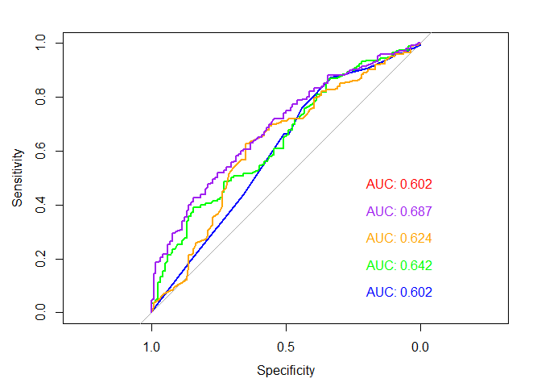

The purple line represents the `vote96 ~ mhealth_sum + educ + inc10` model. Overall, the `vote96 ~ mhealth_sum + educ + inc10` model performs best.

``` r
mh_rf5
```

    ## 
    ## Call:
    ##  randomForest(formula = model5, data = mh_rf_train, ntree = 500) 
    ##                Type of random forest: regression
    ##                      Number of trees: 500
    ## No. of variables tried at each split: 1
    ## 
    ##           Mean of squared residuals: 0.2078628
    ##                     % Var explained: 5.02

``` r
data_frame(var = rownames(importance(mh_rf5)),
           MeanDecreaseGini = importance(mh_rf5)[,1]) %>%
  mutate(var = fct_reorder(var, MeanDecreaseGini, fun = median)) %>%
  ggplot(aes(var, MeanDecreaseGini)) +
  geom_point() +
  coord_flip() +
  labs(title = "Predicting voting turnout",
       subtitle = "Random Forest",
       x = NULL,
       y = "Average decrease in the Gini Index")
```

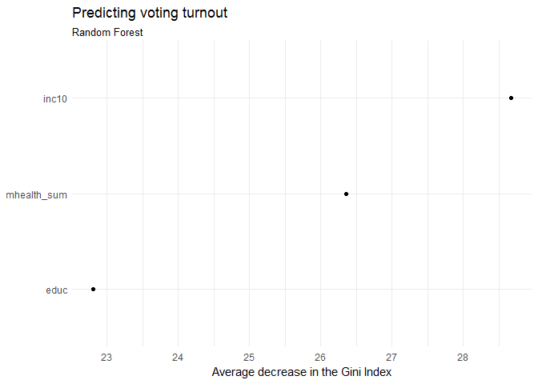

``` r
mse_rf5 <- mse(mh_rf5, mh_rf_test)
```

Based on this model, income is the most influential factor affecting voter turnout, followed by education level. Mental health does not appear to have a large effect. The test MSE for this model is 0.2036966. The test accuracy rate is 0.7048711, meaning it predicted voting accurately 70.49% of the time. The PRE is 0.0964912, indicating that it outperforms the useless classifier by a narrow margin. The AUC is 0.6874393, which is respectably close to 1.

### Subpart 2

**Use cross-validation techniques and standard measures of model fit (e.g. test error rate, PRE, ROC curves/AUC) to compare and evaluate at least five SVM models of voter turnout. Select the best model and interpret the results using whatever methods you see fit (graphs, tables, model fit statistics, predictions for hypothetical observations, etc.)**

I evaluate the following six models (with optimal cost parameters, as determined by 10-fold CV):

1.  vote96 ~ mhealth\_sum (linear kernel)
2.  vote96 ~ mhealth\_sum (polynomial kernel)
3.  vote96 ~ mhealth\_sum (radial kernel)
4.  vote96 ~ mhealth\_sum + educ + inc10 (linear kernel)
5.  vote96 ~ mhealth\_sum + educ + inc10 (polynomial kernel)
6.  vote96 ~ mhealth\_sum + educ + inc10 (radial kernel)

``` r
#fit each model with optimal cost parameter
mh_svm1_tune <- tune(svm, vote96 ~ mhealth_sum, data = as_tibble(mh_rf_train),
                    kernel = "linear",
                    range = list(cost = c(.001, .01, .1, 1, 5, 10, 100)))

mh_svm2_tune <- tune(svm, vote96 ~ mhealth_sum, data = as_tibble(mh_rf_train),
                    kernel = "polynomial",
                    range = list(cost = c(.001, .01, .1, 1, 5, 10, 100)))

mh_svm3_tune <- tune(svm, vote96 ~ mhealth_sum, data = as_tibble(mh_rf_train),
                    kernel = "radial",
                    range = list(cost = c(.001, .01, .1, 1, 5, 10, 100)))

mh_svm4_tune <- tune(svm, vote96 ~ mhealth_sum + educ + inc10, data = as_tibble(mh_rf_train),
                    kernel = "linear",
                    range = list(cost = c(.001, .01, .1, 1, 5, 10, 100)))

mh_svm5_tune <- tune(svm, vote96 ~ mhealth_sum + educ + inc10, data = as_tibble(mh_rf_train),
                    kernel = "polynomial",
                    range = list(cost = c(.001, .01, .1, 1, 5, 10, 100)))

mh_svm6_tune <- tune(svm, vote96 ~ mhealth_sum + educ + inc10, data = as_tibble(mh_rf_train),
                    kernel = "radial",
                    range = list(cost = c(.001, .01, .1, 1, 5, 10, 100)))

mh_svm1 <- mh_svm1_tune$best.model
mh_svm2 <- mh_svm2_tune$best.model
mh_svm3 <- mh_svm3_tune$best.model
mh_svm4 <- mh_svm4_tune$best.model
mh_svm5 <- mh_svm5_tune$best.model
mh_svm6 <- mh_svm6_tune$best.model
```

``` r
#Test MSEs
mse_svm1 <- mse(mh_svm1, mh_rf_test)
mse_svm2 <- mse(mh_svm2, mh_rf_test)
mse_svm3 <- mse(mh_svm3, mh_rf_test)
mse_svm4 <- mse(mh_svm4, mh_rf_test)
mse_svm5 <- mse(mh_svm5, mh_rf_test)
mse_svm6 <- mse(mh_svm6, mh_rf_test)

mse_list <- as.data.frame(c(mse_svm1,
                            mse_svm2,
                            mse_svm3,
                            mse_svm4,
                            mse_svm5,
                            mse_svm6))

#test error rate
mh_model_accuracy <- mh_rf_test %>%
  as_tibble() %>%
  add_predictions(mh_svm1) %>% #model 1
  mutate(pred1 = as.numeric(pred > .5)) %>%
  rename(prob1 = pred) %>%
  add_predictions(mh_svm2) %>% #model 2
  mutate(pred2 = as.numeric(pred > .5)) %>%
  rename(prob2 = pred) %>%
  add_predictions(mh_svm3) %>% #model 3
  mutate(pred3 = as.numeric(pred > .5)) %>%
  rename(prob3 = pred) %>%
  add_predictions(mh_svm4) %>%
  mutate(pred4 = as.numeric(pred > .5)) %>%
  rename(prob4 = pred) %>%
  add_predictions(mh_svm5) %>%
  mutate(pred5 = as.numeric(pred > .5)) %>%
  rename(prob5 = pred) %>% 
  add_predictions(mh_svm6) %>%
  mutate(pred6 = as.numeric(pred > .5)) %>%
  rename(prob6 = pred)

mh_model_acc1 <- mean(mh_model_accuracy$vote96 == mh_model_accuracy$pred1, na.rm = TRUE)
mh_model_acc2 <- mean(mh_model_accuracy$vote96 == mh_model_accuracy$pred2, na.rm = TRUE)
mh_model_acc3 <- mean(mh_model_accuracy$vote96 == mh_model_accuracy$pred3, na.rm = TRUE)
mh_model_acc4 <- mean(mh_model_accuracy$vote96 == mh_model_accuracy$pred4, na.rm = TRUE)
mh_model_acc5 <- mean(mh_model_accuracy$vote96 == mh_model_accuracy$pred5, na.rm = TRUE)
mh_model_acc6 <- mean(mh_model_accuracy$vote96 == mh_model_accuracy$pred6, na.rm = TRUE)

acc_list <- as.data.frame(c(mh_model_acc1,
              mh_model_acc2,
              mh_model_acc3,
              mh_model_acc4,
              mh_model_acc5,
              mh_model_acc6))

#PREs
# get the actual values for y from the data
y <- mh_model_accuracy$vote96
# get the predicted values for y from the model
y.hat1 <- mh_model_accuracy$pred1
y.hat2 <- mh_model_accuracy$pred2
y.hat3 <- mh_model_accuracy$pred3
y.hat4 <- mh_model_accuracy$pred4
y.hat5 <- mh_model_accuracy$pred5
y.hat6 <- mh_model_accuracy$pred6

# calculate the errors for the null model and each rf model

getmode <- function(v) { #function to calculate mode
   uniqv <- unique(v)
   uniqv[which.max(tabulate(match(v, uniqv)))]
}

vote_mode <- getmode(mh_model_accuracy$vote96)

E1 <- sum(y != vote_mode)
E2_1 <- sum(y != y.hat1)
E2_2 <- sum(y != y.hat2)
E2_3 <- sum(y != y.hat3)
E2_4 <- sum(y != y.hat4)
E2_5 <- sum(y != y.hat5)
E2_6 <- sum(y != y.hat6)

# calculate the proportional reduction in error
pre1 <- (E1 - E2_1) / E1
pre2 <- (E1 - E2_2) / E1
pre3 <- (E1 - E2_3) / E1
pre4 <- (E1 - E2_4) / E1
pre5 <- (E1 - E2_5) / E1
pre6 <- (E1 - E2_6) / E1

pre_list <- as.data.frame(c(pre1, pre2, pre3, pre4, pre5, pre6))

#put metrics in one table and report

model_list <- as.data.frame(c("vote96 ~ mhealth_sum (linear kernel)",
                              "vote96 ~ mhealth_sum (polynomial kernel)",
                              "vote96 ~ mhealth_sum (radial kernel)",
                              "vote96 ~ mhealth_sum + educ + inc10 (linear kernel)",
                              "vote96 ~ mhealth_sum + educ + inc10 (polynomial kernel)",
                              "vote96 ~ mhealth_sum + educ + inc10 (radial kernel)"
                              ))

eval_df <- cbind(model_list, mse_list)
eval_df <- cbind(eval_df, acc_list)
eval_df <- cbind(eval_df, pre_list)

colnames(eval_df) <- c("Model", "Test MSE", "Test accuracy", "PRE")

kable(eval_df, caption = "Test MSEs, accuracy rates, and PREs for SVM models", format = "html")
```

<table>
<caption>
Test MSEs, accuracy rates, and PREs for SVM models
</caption>
<thead>
<tr>
<th style="text-align:left;">
Model
</th>
<th style="text-align:right;">
Test MSE
</th>
<th style="text-align:right;">
Test accuracy
</th>
<th style="text-align:right;">
PRE
</th>
</tr>
</thead>
<tbody>
<tr>
<td style="text-align:left;">
vote96 ~ mhealth\_sum (linear kernel)
</td>
<td style="text-align:right;">
0.2980267
</td>
<td style="text-align:right;">
0.6733524
</td>
<td style="text-align:right;">
0.0000000
</td>
</tr>
<tr>
<td style="text-align:left;">
vote96 ~ mhealth\_sum (polynomial kernel)
</td>
<td style="text-align:right;">
0.2962525
</td>
<td style="text-align:right;">
0.6647564
</td>
<td style="text-align:right;">
-0.0263158
</td>
</tr>
<tr>
<td style="text-align:left;">
vote96 ~ mhealth\_sum (radial kernel)
</td>
<td style="text-align:right;">
0.2613199
</td>
<td style="text-align:right;">
0.6762178
</td>
<td style="text-align:right;">
0.0087719
</td>
</tr>
<tr>
<td style="text-align:left;">
vote96 ~ mhealth\_sum + educ + inc10 (linear kernel)
</td>
<td style="text-align:right;">
0.2981515
</td>
<td style="text-align:right;">
0.6733524
</td>
<td style="text-align:right;">
0.0000000
</td>
</tr>
<tr>
<td style="text-align:left;">
vote96 ~ mhealth\_sum + educ + inc10 (polynomial kernel)
</td>
<td style="text-align:right;">
0.2893324
</td>
<td style="text-align:right;">
0.6676218
</td>
<td style="text-align:right;">
-0.0175439
</td>
</tr>
<tr>
<td style="text-align:left;">
vote96 ~ mhealth\_sum + educ + inc10 (radial kernel)
</td>
<td style="text-align:right;">
0.2508319
</td>
<td style="text-align:right;">
0.6934097
</td>
<td style="text-align:right;">
0.0614035
</td>
</tr>
</tbody>
</table>
``` r
roc1 <- roc(mh_model_accuracy$vote96, mh_model_accuracy$prob1)
roc2 <- roc(mh_model_accuracy$vote96, mh_model_accuracy$prob2)
roc3 <- roc(mh_model_accuracy$vote96, mh_model_accuracy$prob3)
roc4 <- roc(mh_model_accuracy$vote96, mh_model_accuracy$prob4)
roc5 <- roc(mh_model_accuracy$vote96, mh_model_accuracy$prob5)
roc6 <- roc(mh_model_accuracy$vote96, mh_model_accuracy$prob6)

plot.new()
plot(roc1, print.auc = TRUE, col = "red", print.auc.x = .2)
plot(roc2, print.auc = TRUE, col = "blue", print.auc.x = .2, print.auc.y = .1, add = TRUE)
plot(roc3, print.auc = TRUE, col = "green", print.auc.x = .2, print.auc.y = .2, add = TRUE)
plot(roc4, print.auc = TRUE, col = "orange", print.auc.x = .2, print.auc.y = .3, add = TRUE)
plot(roc5, print.auc = TRUE, col = "purple", print.auc.x = .2, print.auc.y = .4, add = TRUE)
plot(roc6, print.auc = TRUE, col = "black", print.auc.x = .2, print.auc.y = .6, add = TRUE)
```

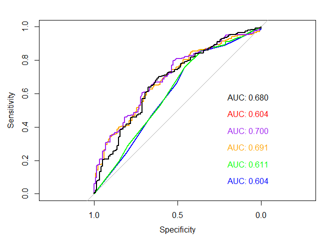

The ROC curves are mostly very close together. The black line represents the `vote96 ~ mhealth_sum + educ + inc10` model using a radial kernel. Overall, this model performs best.

``` r
mh_svm6
```

    ## 
    ## Call:
    ## best.tune(method = svm, train.x = vote96 ~ mhealth_sum + educ + 
    ##     inc10, data = as_tibble(mh_rf_train), ranges = list(cost = c(0.001, 
    ##     0.01, 0.1, 1, 5, 10, 100)), kernel = "radial")
    ## 
    ## 
    ## Parameters:
    ##    SVM-Type:  eps-regression 
    ##  SVM-Kernel:  radial 
    ##        cost:  5 
    ##       gamma:  0.3333333 
    ##     epsilon:  0.1 
    ## 
    ## 
    ## Number of Support Vectors:  536

``` r
mh_model_resid <- mh_rf_test %>%
  as_tibble() %>%
  add_residuals(mh_svm6) %>%
  add_predictions(mh_svm6) %>%
  mutate(pred = as.numeric(pred > .5))

ggplot(data = mh_model_resid, mapping = aes(x = mhealth_sum, y = pred)) + 
  geom_point() + 
  geom_smooth() + 
  scale_y_continuous(breaks = c(0,1)) + 
  labs(title = "Predicted voting vs. mental health score",
       subtitle = "SVM: vote96 ~ mhealth_sum + educ + inc10 (radial kernel)",
       x = "Mental health score",
       y = "Predicted voting (1 = Voted, 0 = Did not vote)")
```

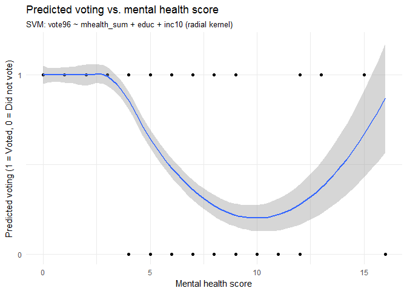

Based on the model, depression appears to negatively affect voting turnout until the mental health score reaches around 8, at which point the relationship reverses. However, the 95% confidence interval also widens as the score increases, probably because of sparse data.

``` r
ggplot(data = mh_model_resid, mapping = aes(x = educ, y = pred)) + 
  geom_point() + 
  geom_smooth() + 
  scale_y_continuous(breaks = c(0,1)) + 
  labs(title = "Predicted voting vs. education level",
       subtitle = "SVM: vote96 ~ mhealth_sum + educ + inc10 (radial kernel)",
       x = "Number of years of formal education",
       y = "Predicted voting (1 = Voted, 0 = Did not vote)")
```

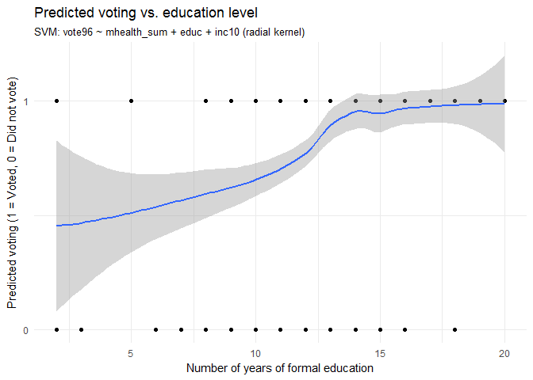

``` r
ggplot(data = mh_model_resid, mapping = aes(x = inc10, y = pred)) + 
  geom_point() + 
  geom_smooth() + 
  scale_y_continuous(breaks = c(0,1)) + 
  labs(title = "Predicted voting vs. income",
       subtitle = "SVM: vote96 ~ mhealth_sum + educ + inc10 (radial kernel)",
       x = "Family income, in $10,000s",
       y = "Predicted voting (1 = Voted, 0 = Did not vote)")
```

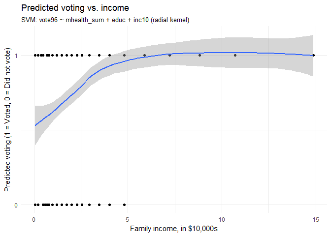

There seems to be a positive relationship between both education and income with voting.

``` r
ggplot(data = mh_model_resid, mapping = aes(x = vote96, y = resid)) + 
  geom_boxplot(aes(group = vote96)) + 
  scale_x_continuous(breaks = c(0,1)) + 
  labs(title = "Residuals by actual voting behavior",
       subtitle = "SVM: vote96 ~ mhealth_sum + educ + inc10 (radial kernel)",
       x = "Voting outcome (1 = Voted, 0 = Did not vote)")
```


There is more variance among the residuals for cases where respondents did not vote.

The test MSE for this model is 0.2508319, higher than that for the random forest model. The test accuracy rate is 0.6934097, meaning it predicted voting accurately 69.34% of the time. The PRE is 0.0614035, indicating that it outperforms the useless classifier by a narrow margin. The AUC is 0.6804965, significantly lower than the AUC for the random forest model.
