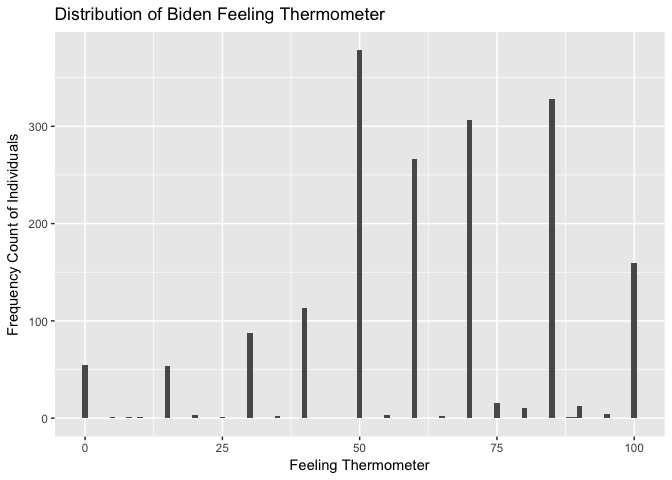
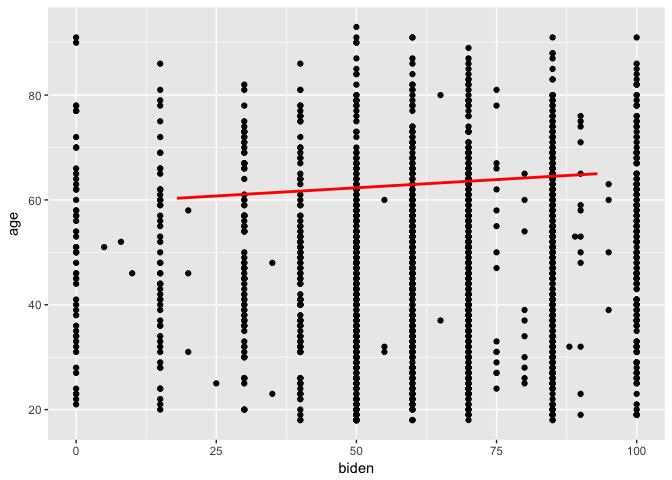
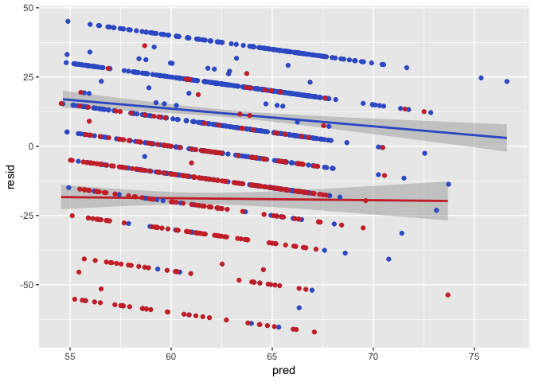
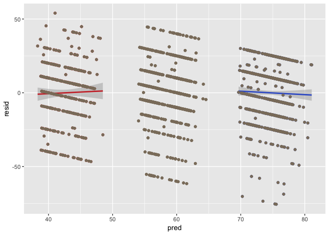

Problem set \#5: linear regression
================
Rodrigo Valdes-Ortiz
**Due Monday February 13th at 11:30am**

-   [Task 1 - Describe the data](#task-1---describe-the-data)
-   [Task 2 - Simple linear regression](#task-2---simple-linear-regression)
    -   [1.](#section)
    -   [2.](#section-1)
    -   [3.](#section-2)
    -   [4.](#section-3)
    -   [5.](#section-4)
    -   [6.](#section-5)
-   [Task 3 - Multiple linear regression](#task-3---multiple-linear-regression)
    -   [1.](#section-6)
    -   [2.](#section-7)
    -   [3.](#section-8)
    -   [4.](#section-9)
-   [Task 4 - Multiple linear regression model (with even more variables!)](#task-4---multiple-linear-regression-model-with-even-more-variables)
    -   [1.](#section-10)
    -   [2.](#section-11)
    -   [3.](#section-12)
-   [Task 5 - Interactive linear regression model](#task-5---interactive-linear-regression-model)
    -   [1.](#section-13)

Task 1 - Describe the data
==========================

According to the histogram, the warm attitudes towards Joe Biden are more numerous than the cold feelings, considering that warm is a feeling thermometer above fifty units. The variable appears to be discrete due to jumps of five units between the bars.

``` r
ggplot(df, mapping = aes(x = biden)) +
  geom_histogram(binwidth = 1) +
  labs(title = "Distribution of Biden Feeling Thermometer",
       x = "Feeling Thermometer",
       y = "Frequency Count of Individuals")
```



Task 2 - Simple linear regression
=================================

``` r
biden1 <- lm(biden ~ age, data = df)
summary(biden1)
```

    ## 
    ## Call:
    ## lm(formula = biden ~ age, data = df)
    ## 
    ## Residuals:
    ##     Min      1Q  Median      3Q     Max 
    ## -64.876 -12.318  -1.257  21.684  39.617 
    ## 
    ## Coefficients:
    ##             Estimate Std. Error t value Pr(>|t|)    
    ## (Intercept) 59.19736    1.64792   35.92   <2e-16 ***
    ## age          0.06241    0.03267    1.91   0.0563 .  
    ## ---
    ## Signif. codes:  0 '***' 0.001 '**' 0.01 '*' 0.05 '.' 0.1 ' ' 1
    ## 
    ## Residual standard error: 23.44 on 1805 degrees of freedom
    ## Multiple R-squared:  0.002018,   Adjusted R-squared:  0.001465 
    ## F-statistic: 3.649 on 1 and 1805 DF,  p-value: 0.05626

``` r
# tidy(biden1)

grid <- df %>% 
  data_grid(age) 

grid <- grid %>% 
  add_predictions(biden1) 
```

1.
--

There is a relationship. However, it is not significant, then, unimportant.

2.
--

The relationship is feeble, only significant at the 10%. The zero is in the confidence interval. It is not strong, and the graph provides some insight of the limited effect of age on the perception of Joe Biden.

3.
--

The relationship is positive. More years old means better opinion of Joe Biden. However, it is not significant at the traditional levels, 5%. Then, it is possible to argue that there is not a relationship.

4.
--

The R^2 of the model is 0.002018. It represents the 0.2% percent of the variation. It is a wrong model.

5.
--

The prediction for the perception of Joe Biden for an individual of an age of 45 is 62.0056, while the confidence interval is from 60.91177 to 63.09943

``` r
newdata = data.frame(age = 45)
predict(biden1, newdata, interval="confidence")
```

    ##       fit      lwr      upr
    ## 1 62.0056 60.91177 63.09943

6.
--

``` r
ggplot(df, aes(x = biden)) +
  geom_point(aes(y = age)) +
  geom_line(aes(y = pred, x = age), data = grid, color = "red", size = 1)
```



Task 3 - Multiple linear regression
===================================

``` r
biden2 <- lm(biden ~ age + female + educ, data = df)
summary(biden2)
```

    ## 
    ## Call:
    ## lm(formula = biden ~ age + female + educ, data = df)
    ## 
    ## Residuals:
    ##     Min      1Q  Median      3Q     Max 
    ## -67.084 -14.662   0.703  18.847  45.105 
    ## 
    ## Coefficients:
    ##             Estimate Std. Error t value Pr(>|t|)    
    ## (Intercept) 68.62101    3.59600  19.083  < 2e-16 ***
    ## age          0.04188    0.03249   1.289    0.198    
    ## female       6.19607    1.09670   5.650 1.86e-08 ***
    ## educ        -0.88871    0.22469  -3.955 7.94e-05 ***
    ## ---
    ## Signif. codes:  0 '***' 0.001 '**' 0.01 '*' 0.05 '.' 0.1 ' ' 1
    ## 
    ## Residual standard error: 23.16 on 1803 degrees of freedom
    ## Multiple R-squared:  0.02723,    Adjusted R-squared:  0.02561 
    ## F-statistic: 16.82 on 3 and 1803 DF,  p-value: 8.876e-11

``` r
# tidy(biden2)

grid2 <- data.frame("age" = df$age,
                    "female" = df$female,
                    "educ" = df$educ,
                    "rep" = df$rep,
                    "dem" = df$dem,
                    "biden" = df$biden)
grid2 <- grid2 %>% 
  add_predictions(biden2) 
```

1.
--

Yes, the variables female and education are significant. Also, the F statistic indicates that the model has an overall significance.

2.
--

It suggests that the feeling thermometer increases about six units against males with the same characteristics besides gender.

3.
--

The R^2 of the model is 0.02723, which represent 2.7% of the variation. It is a better model that the age-only model due to the R^2 is more than ten times bigger. However, it generates non-normal distributed errors, which are also big in magnitude.

``` r
grid2$resid <- grid2$biden - grid2$pred
hist(grid2$resid)
```


4.
--

The problem is that the different views of democrats and republicans are not controlled in the model. As a result, the residuals for democrats are positive, while the residuals for republicans are negative. Add a variable for a party can increase the accuracy of the model.

``` r
ggplot(grid2, aes(x=pred, y=resid, colour=factor(colour))) + 
  geom_smooth(data=subset(grid2, dem == 1), method = "lm", color = "royalblue3") +
  geom_smooth(data=subset(grid2, rep == 1), method = "lm", color = "brown3") +
  geom_point(data=subset(grid2, dem == 1), color = "royalblue3") +
  geom_point(data=subset(grid2, rep == 1), color = "brown3")
```



Task 4 - Multiple linear regression model (with even more variables!)
=====================================================================

``` r
biden3 <- lm(biden ~ age + female + educ + dem + rep, data = df)
summary(biden3)
```

    ## 
    ## Call:
    ## lm(formula = biden ~ age + female + educ + dem + rep, data = df)
    ## 
    ## Residuals:
    ##     Min      1Q  Median      3Q     Max 
    ## -75.546 -11.295   1.018  12.776  53.977 
    ## 
    ## Coefficients:
    ##              Estimate Std. Error t value Pr(>|t|)    
    ## (Intercept)  58.81126    3.12444  18.823  < 2e-16 ***
    ## age           0.04826    0.02825   1.708   0.0877 .  
    ## female        4.10323    0.94823   4.327 1.59e-05 ***
    ## educ         -0.34533    0.19478  -1.773   0.0764 .  
    ## dem          15.42426    1.06803  14.442  < 2e-16 ***
    ## rep         -15.84951    1.31136 -12.086  < 2e-16 ***
    ## ---
    ## Signif. codes:  0 '***' 0.001 '**' 0.01 '*' 0.05 '.' 0.1 ' ' 1
    ## 
    ## Residual standard error: 19.91 on 1801 degrees of freedom
    ## Multiple R-squared:  0.2815, Adjusted R-squared:  0.2795 
    ## F-statistic: 141.1 on 5 and 1801 DF,  p-value: < 2.2e-16

``` r
# tidy(biden3)

grid3 <- data.frame("age" = df$age,
                    "female" = df$female,
                    "educ" = df$educ,
                    "rep" = df$rep,
                    "dem" = df$dem,
                    "biden" = df$biden)
grid3 <- grid3 %>% 
  add_predictions(biden3) 


grid3$resid <- grid3$biden - grid3$pred
```

1.
--

Yes, after controlling for party, the coefficient of female decrease in magnitude and it increases its significance. The coefficient of female explains less variance in the model, but the model is better specified.

2.
--

The R^2 is 0.28, which means that the model explains 28% of the variation in the data. Then, it is better than the former model in task 3, because age + gender + education only explains less than the 3% of the variance.

3.
--

The errors are closer to zero in the mean for the three different cases, democrat, republican, and independent. As a result, the model is better than the former one, where it was a problem of specification due to the lack of party affiliation. However, maybe there is still an issue with the errors according to the histogram, the distribution is biased to positive errors.

``` r
ggplot(grid3, aes(x=pred, y=resid, colour=factor(colour))) + 
geom_smooth(data=subset(grid3, dem == 1), method = "lm", color = "royalblue3") +
  geom_smooth(data=subset(grid3, rep == 1), method = "lm", color = "brown3") +
  geom_point(data=subset(grid3, dem == 1), color = "royalblue3") +
  geom_point(data=subset(grid3, rep == 1), color = "brown3") +
  geom_point(data=subset(grid3, dem == 0, rep = 0), color = "bisque4") +
  geom_point(data=subset(grid3, rep == 0, dem = 0), color = "bisque4")
```



``` r
hist(grid3$resid)
```


Task 5 - Interactive linear regression model
============================================

``` r
newdf <- subset(df, rep == 1 | dem == 1, 
                select=c(female, dem, rep, biden))

biden4 <- lm(biden ~ female * dem, data = newdf)
summary(biden4)
```

    ## 
    ## Call:
    ## lm(formula = biden ~ female * dem, data = newdf)
    ## 
    ## Residuals:
    ##     Min      1Q  Median      3Q     Max 
    ## -75.519 -13.070   4.223  11.930  55.618 
    ## 
    ## Coefficients:
    ##             Estimate Std. Error t value Pr(>|t|)    
    ## (Intercept)   39.382      1.455  27.060  < 2e-16 ***
    ## female         6.395      2.018   3.169  0.00157 ** 
    ## dem           33.688      1.835  18.360  < 2e-16 ***
    ## female:dem    -3.946      2.472  -1.597  0.11065    
    ## ---
    ## Signif. codes:  0 '***' 0.001 '**' 0.01 '*' 0.05 '.' 0.1 ' ' 1
    ## 
    ## Residual standard error: 19.42 on 1147 degrees of freedom
    ## Multiple R-squared:  0.3756, Adjusted R-squared:  0.374 
    ## F-statistic:   230 on 3 and 1147 DF,  p-value: < 2.2e-16

``` r
# tidy(biden4)

female = c(1, 1, 0, 0) 
dem = c(1, 0, 1, 0) 
eval_df = data.frame(female, dem)

predict(biden4, eval_df, interval="confidence")
```

    ##        fit      lwr      upr
    ## 1 75.51883 73.77632 77.26133
    ## 2 45.77720 43.03494 48.51947
    ## 3 73.06954 70.87731 75.26176
    ## 4 39.38202 36.52655 42.23750

1.
--

The results in the table represent: 1) female Democrats, 2) female Republicans, 3) male Democrats, and 4) male Republicans.

The results differ for females and males, including when the model control by party affiliation. Furthermore, being female increases the Biden warmth perception by about five units.

We conclude that there is a relationship between party affiliation and gender in the case of Biden warmth index. For instance, the difference between female Republicans and male Republicans is about six units, while the difference between female Democrats and male Democrats is only about 2.5 units. Then, the effect not only different for Democrats or Republicans but also there is an interaction between gender and party affiliation, then just a dummy control by party affiliation is not enough.
