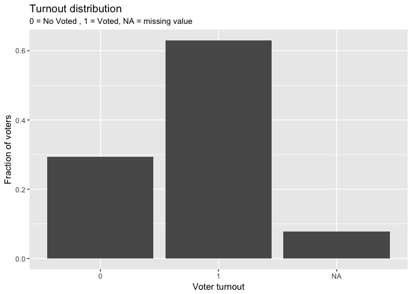
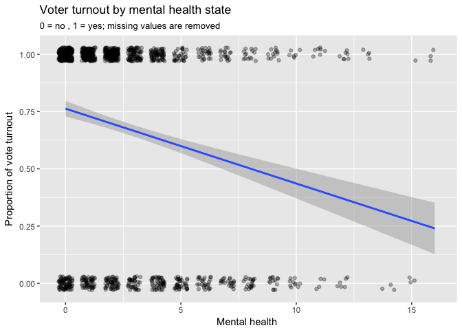
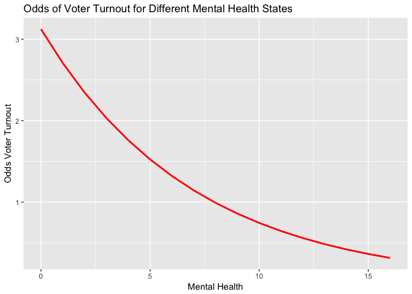
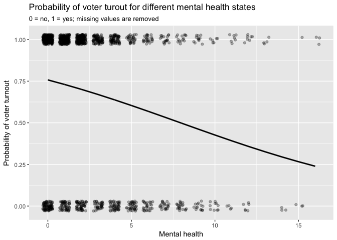
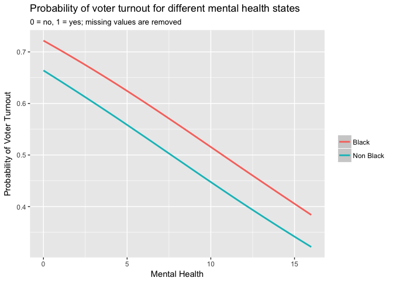
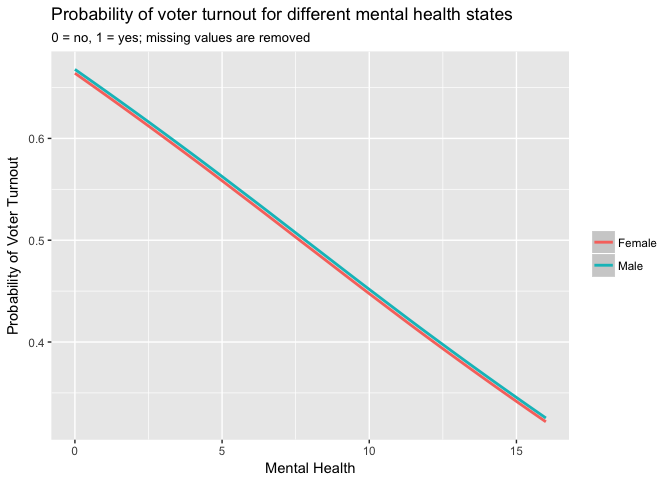
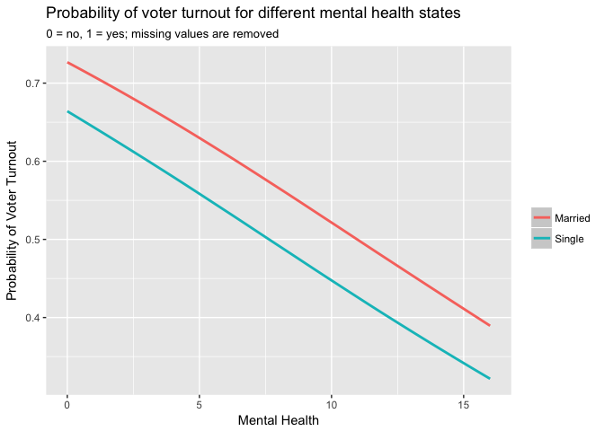
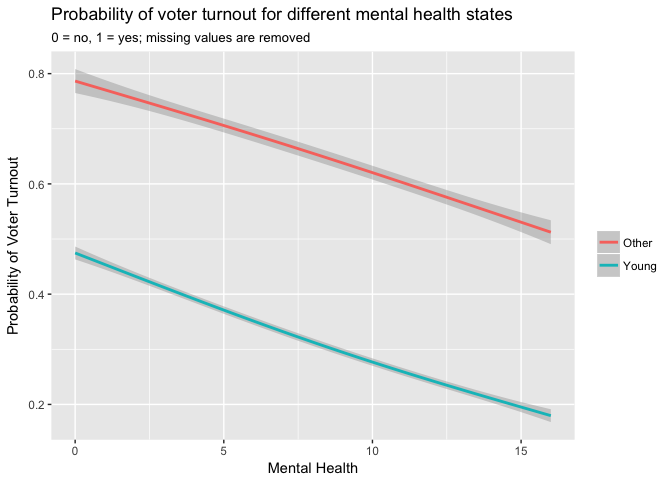

PS6\_Rodrigo\_Valdes
================
Rodrigo Valdes
February 20, 2017

-   [Describe the data](#describe-the-data)
-   [Basic Model](#basic-model)
-   [Multiple Variable Model](#multiple-variable-model)
-   [TV Model](#tv-model)

Describe the data
-----------------

1.1. Histogram

``` r
data1 %>%
  group_by(vote96) %>%
  count() %>%
  ggplot(aes(x=as.character(vote96), y=n/sum(n))) +
  geom_bar(stat='identity') +
  labs(title = "Turnout distribution",
       subtitle = '0 = No Voted , 1 = Voted, NA = missing value',
       x = 'Voter turnout',
       y = 'Fraction of voters')
```



To calculate the conditional probability, I will only use the data for the people that we know if voted or not. That is to say; I will not consider the missing values. It can produce a small bias, but it is the best assumption given the structure of the data.

``` r
# unconditional probability
prob <- data1 %>%
  group_by(vote96) %>%
  filter(vote96!='NA') %>%
  count() %>%
  mutate('unconditional probability' = n/sum(n)) %>%
  select(-n)
```

Unconditional probabilities. The zero represents not vote.

``` r
prob
```

    ## # A tibble: 2 × 2
    ##   vote96 `unconditional probability`
    ##    <dbl>                       <dbl>
    ## 1      0                   0.3176426
    ## 2      1                   0.6823574

1.2. Plot

According to the graph, depressed people tend to vote less. The correlation between mental health and proportion of vote turnout is negative. Then, there is an insight that the theory that says that depressed people tend to participate less in elections is correct.

``` r
# scatterplot
data1 %>%
  ggplot(aes(mhealth_sum, vote96)) +
  geom_jitter(na.rm=TRUE, height=.03, width=.3, alpha=.3) +
  geom_smooth(method='lm') +
  labs(title = "Voter turnout by mental health state",
       subtitle = '0 = no , 1 = yes; missing values are removed',
       x = 'Mental health ',
       y = 'Proportion of vote turnout')
```

    ## Warning: Removed 1510 rows containing non-finite values (stat_smooth).

 Note: I utilize jitter to show there are many observations by mental health index.

Basic Model
-----------

1.  The summary of the model depicts that the coefficient for mental health is highly significant, well above the 1%. For the case of mental health equal two, the median, the change in the probability of vote when the index in mental health increases from two to three is: -0.031. Furthermore, the same relationship for a change from ten to eleven is -0.035. Then, the number is substantial, especially regarding the change from completely mental health to completely depressed. For instance, the change in the probability of vote for a healthy person (index zero) against an entirely depressed individual (index fifteen) is about 0.5. Then, the mental health can affect the probability of vote drastically.

``` r
fit_logistic_sim <- glm(vote96 ~ mhealth_sum, data=data1, family=binomial())
summary(fit_logistic_sim)
```

    ## 
    ## Call:
    ## glm(formula = vote96 ~ mhealth_sum, family = binomial(), data = data1)
    ## 
    ## Deviance Residuals: 
    ##     Min       1Q   Median       3Q      Max  
    ## -1.6834  -1.2977   0.7452   0.8428   1.6911  
    ## 
    ## Coefficients:
    ##             Estimate Std. Error z value Pr(>|z|)    
    ## (Intercept)  1.13921    0.08444  13.491  < 2e-16 ***
    ## mhealth_sum -0.14348    0.01969  -7.289 3.13e-13 ***
    ## ---
    ## Signif. codes:  0 '***' 0.001 '**' 0.01 '*' 0.05 '.' 0.1 ' ' 1
    ## 
    ## (Dispersion parameter for binomial family taken to be 1)
    ## 
    ##     Null deviance: 1672.1  on 1321  degrees of freedom
    ## Residual deviance: 1616.7  on 1320  degrees of freedom
    ##   (1510 observations deleted due to missingness)
    ## AIC: 1620.7
    ## 
    ## Number of Fisher Scoring iterations: 4

``` r
# mlv(data1$mhealth_sum, method = "mfv", na.rm=TRUE)
# mean(data1$mhealth_sum, na.rm=TRUE)
median(data1$mhealth_sum, na.rm=TRUE)
```

    ## [1] 2

``` r
# Evaluation on changes in mental health

exponential_part_3 <- exp(1.13921 + -0.14348 * 3)
exponential_part_2 <- exp(1.13921 + -0.14348 * 2)

change <- ((exponential_part_3)/(1+exponential_part_3) - (exponential_part_2)/(1+exponential_part_2))
change
```

    ## [1] -0.0309096

``` r
exponential_part_11 <- exp(1.13921 + -0.14348 * 11)
exponential_part_10 <- exp(1.13921 + -0.14348 * 10)
change2 <- ((exponential_part_11)/(1+exponential_part_11) - (exponential_part_10)/(1+exponential_part_10))
change2
```

    ## [1] -0.0346733

``` r
exponential_part_15 <- exp(1.13921 + -0.14348 * 15)
exponential_part_0 <- exp(1.13921 + -0.14348 * 0)
change3 <- ((exponential_part_15)/(1+exponential_part_15) - (exponential_part_0)/(1+exponential_part_0))
change3
```

    ## [1] -0.4911395

Basic Model 2.

The coefficient for mental health, -0.14348, is the change in log-odds when mental health changes in one unit. The graph shows the linear relationship in the log-odds.

``` r
logit2prob <- function(x){
  exp(x) / (1 + exp(x))
}
prob2odds <- function(x){
  x / (1 - x)
}
prob2logodds <- function(x){
  log(prob2odds(x))
}

# augment the dataset using the defined functions
vote_mental_pred <- data1 %>%
  add_predictions(fit_logistic_sim) %>%
  # predicted values are in the log-odds form - convert to probabilities
  mutate(prob = logit2prob(pred)) %>%
  mutate(odds = prob2odds(prob)) %>%
  mutate(logodds = prob2logodds(prob))
```

``` r
ggplot(vote_mental_pred, aes(x = mhealth_sum)) +
  geom_line(aes(y = logodds), color = "blue", size = 1) +
  labs(title = "Log-odds of voter turnout for different mental health states",
       x = "Mental Health",
       y = "Log-odds of Voter Turnout")
```

    ## Warning: Removed 1418 rows containing missing values (geom_path).


1.  The figure represents the relationship between odds and the mental health. For a healthy mental person, the probability of voting is three times the probability of not voting. On the other hand, for a mentally unhealthy person (mental health about 15), the possibility of not voting is about three times the probability of voting.

``` r
ggplot(vote_mental_pred, aes(x = mhealth_sum)) +
  geom_line(aes(y = odds), color = "red", size = 1) +
  labs(title = "Odds of Voter Turnout for Different Mental Health States",
       x = "Mental Health",
       y = "Odds Voter Turnout")
```

    ## Warning: Removed 1418 rows containing missing values (geom_path).



``` r
geom_point(aes(y = vote96))
```

    ## mapping: y = vote96 
    ## geom_point: na.rm = FALSE
    ## stat_identity: na.rm = FALSE
    ## position_identity

1.  The change in probability depends on the initial values.

``` r
ggplot(vote_mental_pred, aes(x = mhealth_sum)) +
#  geom_point(aes(y = vote96)) +
  geom_jitter(aes(y=vote96), na.rm=TRUE, height=.03, width=.3, alpha=.3) +
  geom_line(aes(y = prob), color = "black", size = 1) +
  labs(title = "Probability of voter turout for different mental health states",
       subtitle = '0 = no, 1 = yes; missing values are removed',
       x = "Mental health",
       y = "Probability of voter turnout")
```

    ## Warning: Removed 1418 rows containing missing values (geom_path).



``` r
exponential_part_2 <- exp(1.13921 + -0.14348 * 2)
exponential_part_1 <- exp(1.13921 + -0.14348 * 1)
change2_1 <- ((exponential_part_2)/(1+exponential_part_2) - (exponential_part_1)/(1+exponential_part_1))

exponential_part_6 <- exp(1.13921 + -0.14348 * 6)
exponential_part_5 <- exp(1.13921 + -0.14348 * 5)
change5_6 <- ((exponential_part_6)/(1+exponential_part_6) - (exponential_part_5)/(1+exponential_part_5))

cat("The difference in probability for an increase in the mental health index from 1 to 2 is", change2_1)
```

    ## The difference in probability for an increase in the mental health index from 1 to 2 is -0.0291793

``` r
cat("The difference in probability for an increase in the mental health index from 5 to 6 is", change5_6)
```

    ## The difference in probability for an increase in the mental health index from 5 to 6 is -0.03477953

1.  It is not a good model. The performance of this is worst than a naive assumption of everyone vote, in the case of the accuracy rate. The PRE is quite small, just 0.016, and the AUC supports the conclusion that this model is not the best.

``` r
accuracy <- data1 %>%
  add_predictions(fit_logistic_sim) %>%
  mutate(pred = logit2prob(pred),
         prob = pred,
         pred = as.numeric(pred > .5))

accuracy_rate <- mean(accuracy$vote96 == accuracy$pred, na.rm = TRUE)
cat("Accuracy rate:", accuracy_rate)
```

    ## Accuracy rate: 0.677761

``` r
# function to calculate PRE for a logistic regression model
PRE <- function(model){
  # get the actual values for y from the data
  y <- model$y

  # get the predicted values for y from the model
  y.hat <- round(model$fitted.values)

  # calculate the errors for the null model and your model
  E1 <- sum(y != median(y))
  E2 <- sum(y != y.hat)

  # calculate the proportional reduction in error
  PRE <- (E1 - E2) / E1
  return(PRE)
}

cat("Proportional reduction in error:", PRE(fit_logistic_sim))
```

    ## Proportional reduction in error: 0.01616628

``` r
# auc <- auc(accuracy$vote96, accuracy$prob)
# auc
```

Multiple Variable Model
-----------------------

1.  

1.1. Probability distribution: Bernoulli,

Pr\((Y_i = y_i | \pi)\) = \(\pi_i^{y_i}\) \((1 - \pi_i)^{1-y_i}\)

1.2. Linear predictor:

\(\eta_i = \beta_0 + \beta_1 X_{1,i} + \beta_2 X_{2,i} + \beta_3 X_{3,i} + \beta_4 X_{4,i} + \beta_5 X_{5,i} + \beta_6 X_{6,i} + \beta_7 X_{7,i}\)

\(X_1\) is mhealth, \(X_2\) is age, \(X_3\) is educ, \(X_4\) is black, \(X_5\) is female, \(X_6\) is married, and \(X_7\) is inc10.

1.3.

Link function: logit,

\(\pi_i\) \(=\) \(e^{\eta_i}\) / (1 + \(e^{\eta_i}\))

1.  Results

``` r
fit_logistic_mul <- glm(vote96 ~ ., data=data1, family=binomial())
summary(fit_logistic_mul)
```

    ## 
    ## Call:
    ## glm(formula = vote96 ~ ., family = binomial(), data = data1)
    ## 
    ## Deviance Residuals: 
    ##     Min       1Q   Median       3Q      Max  
    ## -2.4843  -1.0258   0.5182   0.8428   2.0758  
    ## 
    ## Coefficients:
    ##              Estimate Std. Error z value Pr(>|z|)    
    ## (Intercept) -4.304103   0.508103  -8.471  < 2e-16 ***
    ## mhealth_sum -0.089102   0.023642  -3.769 0.000164 ***
    ## age          0.042534   0.004814   8.835  < 2e-16 ***
    ## educ         0.228686   0.029532   7.744 9.65e-15 ***
    ## black        0.272984   0.202585   1.347 0.177820    
    ## female      -0.016969   0.139972  -0.121 0.903507    
    ## married      0.296915   0.153164   1.939 0.052557 .  
    ## inc10        0.069614   0.026532   2.624 0.008697 ** 
    ## ---
    ## Signif. codes:  0 '***' 0.001 '**' 0.01 '*' 0.05 '.' 0.1 ' ' 1
    ## 
    ## (Dispersion parameter for binomial family taken to be 1)
    ## 
    ##     Null deviance: 1468.3  on 1164  degrees of freedom
    ## Residual deviance: 1241.8  on 1157  degrees of freedom
    ##   (1667 observations deleted due to missingness)
    ## AIC: 1257.8
    ## 
    ## Number of Fisher Scoring iterations: 4

1.  Interpret the results

Only five variables are significant at the standard level of significance (0.05), including the intercept. These results are in log-odds. To make them more easy to interpret. I will utilize a base case, in the median and mode of the variables.

``` r
median(data1$mhealth_sum, na.rm=TRUE)
```

    ## [1] 2

``` r
median(data1$age, na.rm=TRUE)
```

    ## [1] 42

``` r
median(data1$educ, na.rm=TRUE)
```

    ## [1] 13

``` r
mlv(data1$black, method = "mfv", na.rm=TRUE)
```

    ## Mode (most likely value): 0 
    ## Bickel's modal skewness: 0.1412429 
    ## Call: mlv.default(x = data1$black, method = "mfv", na.rm = TRUE)

``` r
mlv(data1$female, method = "mfv", na.rm=TRUE)
```

    ## Mode (most likely value): 1 
    ## Bickel's modal skewness: -0.4350282 
    ## Call: mlv.default(x = data1$female, method = "mfv", na.rm = TRUE)

``` r
mlv(data1$married, method = "mfv", na.rm=TRUE)
```

    ## Mode (most likely value): 0 
    ## Bickel's modal skewness: 0.4754504 
    ## Call: mlv.default(x = data1$married, method = "mfv", na.rm = TRUE)

``` r
median(data1$inc10, na.rm=TRUE)
```

    ## [1] 3.4774

Even controlling for all the variables in the set, the relationship between vote probability and mental health is high. The change in probability in the median and mode of the variables, in a change of mental health from one to two is -0.02.

``` r
exp_part_2 = exp(-4.304103 + (2 * -0.089102) + 42*0.042534 + 13*0.228686 + 0*0.272984 + 1*-0.016969 + 0*0.296915 + 3.4774*0.069614)

exp_part_1 = exp(-4.304103 + (1 * -0.089102) + 42*0.042534 + 13*0.228686 + 0*0.272984 + 1*-0.016969 + 0*0.296915 + 3.4774*0.069614)

prob_p2 <- exp_part_2/(1+exp_part_2)
prob_p1 <- exp_part_1/(1+exp_part_1)

cat("The change in probability for an change of mental health from 1 to 2 is:", prob_p2 - prob_p1)
```

    ## The change in probability for an change of mental health from 1 to 2 is: -0.02068793

The accuracy rate is still modest against the simplified case. Then, in this indicator, it is not a very good model. Also, in the proportional reduction in error, the model perform better than the former model. However, a reduction of 15% in error is still modest.

``` r
accuracy_mul <- data1 %>%
  add_predictions(fit_logistic_mul) %>%
  mutate(pred = logit2prob(pred),
         prob = pred,
         pred = as.numeric(pred > .5))

accuracy_rate_mul <- mean(accuracy_mul$vote96 == accuracy_mul$pred, na.rm = TRUE)
cat("Accuracy rate:", accuracy_rate_mul);
```

    ## Accuracy rate: 0.7236052

``` r
cat("Proportional reduction in error:", PRE(fit_logistic_mul));
```

    ## Proportional reduction in error: 0.1481481

``` r
cat("Area Under the Curve:", auc(accuracy_mul$vote96, accuracy_mul$prob))
```

    ## Area Under the Curve: 0.759624

The following graphs depict some features of the model. For instance, black and married persons will have more probability to vote, nonetheless their mental health. Another interesting characteristic is that the difference between male and female is small. Finally, people below 30 years old tend to vote less frequently than people above 30 years old.

``` r
vote_mental_pred2 <- data1 %>%
  data_grid(mhealth_sum, black, .model=fit_logistic_mul) %>%
  add_predictions(fit_logistic_mul) %>%
  # predicted values are in the log-odds form - convert to probabilities
  mutate(prob = logit2prob(pred))

ggplot(vote_mental_pred2, aes(x = mhealth_sum, y = prob, color = ifelse(black > 0.5 , "Black", "Non Black"))) +
  geom_smooth() +
  labs(title = "Probability of voter turnout for different mental health states",
       subtitle = '0 = no, 1 = yes; missing values are removed',
       x = "Mental Health",
       y = "Probability of Voter Turnout") +
  guides(color = guide_legend(''))
```

    ## `geom_smooth()` using method = 'loess'



``` r
vote_mental_pred2 <- data1 %>%
  data_grid(mhealth_sum, female, .model=fit_logistic_mul) %>%
  add_predictions(fit_logistic_mul) %>%
  # predicted values are in the log-odds form - convert to probabilities
  mutate(prob = logit2prob(pred))

ggplot(vote_mental_pred2, aes(x = mhealth_sum, y = prob, color = ifelse(female > 0.5 , "Female", "Male"))) +
  geom_smooth() +
  labs(title = "Probability of voter turnout for different mental health states",
       subtitle = '0 = no, 1 = yes; missing values are removed',
       x = "Mental Health",
       y = "Probability of Voter Turnout") +
  guides(color = guide_legend(''))
```

    ## `geom_smooth()` using method = 'loess'



``` r
vote_mental_pred2 <- data1 %>%
  data_grid(mhealth_sum, married, .model=fit_logistic_mul) %>%
  add_predictions(fit_logistic_mul) %>%
  # predicted values are in the log-odds form - convert to probabilities
  mutate(prob = logit2prob(pred))

ggplot(vote_mental_pred2, aes(x = mhealth_sum, y = prob, color = ifelse(married > 0.5 , "Married", "Single"))) +
  geom_smooth() +
  labs(title = "Probability of voter turnout for different mental health states",
       subtitle = '0 = no, 1 = yes; missing values are removed',
       x = "Mental Health",
       y = "Probability of Voter Turnout") +
  guides(color = guide_legend(''))
```

    ## `geom_smooth()` using method = 'loess'



``` r
vote_mental_pred2 <- data1 %>%
  data_grid(mhealth_sum, age, .model=fit_logistic_mul) %>%
  add_predictions(fit_logistic_mul) %>%
  # predicted values are in the log-odds form - convert to probabilities
  mutate(prob = logit2prob(pred))

ggplot(vote_mental_pred2, aes(x = mhealth_sum, y = prob, color = ifelse(age < 31 , "Young", "Other"))) +
  geom_smooth() +
  labs(title = "Probability of voter turnout for different mental health states",
       subtitle = '0 = no, 1 = yes; missing values are removed',
       x = "Mental Health",
       y = "Probability of Voter Turnout") +
  guides(color = guide_legend(''))
```

    ## `geom_smooth()` using method = 'gam'



TV Model
--------

1.  Components

1.1. Probability: the Poisson distribution,

Pr\((Y_i = y_i | \mu)\) = \(\mu^{y_i}\) \(e^{-\mu}\) / \(y_i!\)

1.2. Linear predictor:

\(\eta_i = \beta_0 + \beta_1 X_{1,i} + \beta_2 X_{2,i} + \beta_3 X_{3,i} + \beta_4 X_{4,i} + \beta_5 X_{5,i} + \beta_6 X_{6,i} + \beta_7 X_{7,i}\), where \(X_1\) is age, \(X_2\) is educ, \(X_3\) is female, \(X_4\) is hours per day to relax, \(X_5\) is black, \(X_6\) is voted in the 2004 election, and \(X_7\) is x-rated movie.

1.3. Link function: the log,

\(\mu_i\) \(=\) ln(\(\eta_i\))

``` r
fit_poisson_mul2 <- glm(tvhours ~ age +educ +female +hrsrelax +black +voted04 +xmovie, data=data2, family=poisson())
summary(fit_poisson_mul2)
```

    ## 
    ## Call:
    ## glm(formula = tvhours ~ age + educ + female + hrsrelax + black + 
    ##     voted04 + xmovie, family = poisson(), data = data2)
    ## 
    ## Deviance Residuals: 
    ##     Min       1Q   Median       3Q      Max  
    ## -3.0003  -0.7263  -0.0847   0.4573   5.3696  
    ## 
    ## Coefficients:
    ##               Estimate Std. Error z value Pr(>|z|)    
    ## (Intercept)  1.0356595  0.1915846   5.406 6.45e-08 ***
    ## age          0.0005042  0.0024095   0.209   0.8342    
    ## educ        -0.0274218  0.0111770  -2.453   0.0142 *  
    ## female       0.0178870  0.0604775   0.296   0.7674    
    ## hrsrelax     0.0484390  0.0094520   5.125 2.98e-07 ***
    ## black        0.4294380  0.0683026   6.287 3.23e-10 ***
    ## voted04     -0.1188564  0.0700460  -1.697   0.0897 .  
    ## xmovie       0.1020168  0.0675854   1.509   0.1312    
    ## ---
    ## Signif. codes:  0 '***' 0.001 '**' 0.01 '*' 0.05 '.' 0.1 ' ' 1
    ## 
    ## (Dispersion parameter for poisson family taken to be 1)
    ## 
    ##     Null deviance: 579.41  on 489  degrees of freedom
    ## Residual deviance: 482.59  on 482  degrees of freedom
    ##   (4020 observations deleted due to missingness)
    ## AIC: 1753.8
    ## 
    ## Number of Fisher Scoring iterations: 5

``` r
# Interpretation

educ_int = exp(-0.0274218)
hrealx_int = exp(0.0484390)
black_int = exp(0.4294380)

cat("The change in watching tv by year of education is", educ_int)
```

    ## The change in watching tv by year of education is 0.9729508

``` r
cat("The change in watching tv by hour of relax is", hrealx_int)
```

    ## The change in watching tv by hour of relax is 1.049631

``` r
cat("The change in watching tv for black against others is", black_int)
```

    ## The change in watching tv for black against others is 1.536394

The regression using the quasi-Poisson method shows that the dispersion parameter is close to 1. Then, underdispersion does not appear to be a significant problem.

``` r
fit_quasi <- glm(formula = tvhours ~ age +educ +female +hrsrelax +black +voted04 +xmovie, data=data2, family="quasipoisson")
summary(fit_quasi)
```

    ## 
    ## Call:
    ## glm(formula = tvhours ~ age + educ + female + hrsrelax + black + 
    ##     voted04 + xmovie, family = "quasipoisson", data = data2)
    ## 
    ## Deviance Residuals: 
    ##     Min       1Q   Median       3Q      Max  
    ## -3.0003  -0.7263  -0.0847   0.4573   5.3696  
    ## 
    ## Coefficients:
    ##               Estimate Std. Error t value Pr(>|t|)    
    ## (Intercept)  1.0356595  0.2002313   5.172 3.40e-07 ***
    ## age          0.0005042  0.0025182   0.200   0.8414    
    ## educ        -0.0274218  0.0116814  -2.347   0.0193 *  
    ## female       0.0178870  0.0632070   0.283   0.7773    
    ## hrsrelax     0.0484390  0.0098785   4.903 1.29e-06 ***
    ## black        0.4294380  0.0713852   6.016 3.54e-09 ***
    ## voted04     -0.1188564  0.0732073  -1.624   0.1051    
    ## xmovie       0.1020168  0.0706357   1.444   0.1493    
    ## ---
    ## Signif. codes:  0 '***' 0.001 '**' 0.01 '*' 0.05 '.' 0.1 ' ' 1
    ## 
    ## (Dispersion parameter for quasipoisson family taken to be 1.092302)
    ## 
    ##     Null deviance: 579.41  on 489  degrees of freedom
    ## Residual deviance: 482.59  on 482  degrees of freedom
    ##   (4020 observations deleted due to missingness)
    ## AIC: NA
    ## 
    ## Number of Fisher Scoring iterations: 5
