PA8
================
Rodrigo Valdes
March 5, 2017

-   [Part 1](#part-1)
    -   ["1.1 Split the data"](#split-the-data)
    -   ["1.2 Fit a decision tree""](#fit-a-decision-tree)
    -   ["1.3 Fit a decision tree with controls""](#fit-a-decision-tree-with-controls)
    -   ["1.4 Baggaing Approach"](#baggaing-approach)
    -   ["1.5 Random Forest"](#random-forest)
    -   ["1.6 Boosting"](#boosting)
-   [2 Modeling voter turnout](#modeling-voter-turnout)
    -   ["2.1 Tree-Based Models""](#tree-based-models)
        -   ["2.1.1 Tree-Based Models"](#tree-based-models-1)
        -   ["2.1.2 Tree Number 2"](#tree-number-2)
        -   ["2.1.3 Tree Number 3 - Simple"](#tree-number-3---simple)
        -   ["2.1.4 Tree Number 4 - Bagging"](#tree-number-4---bagging)
        -   ["2.1.5 Tree Number 4 - Random Forest"](#tree-number-4---random-forest)
    -   ["2.2 SVM models""](#svm-models)
        -   ["2.2.1 Support Vector Classifier""](#support-vector-classifier)
        -   ["2.2.2 Polynomial Kernel""](#polynomial-kernel)
        -   ["2.2.3 Radial Kernel""](#radial-kernel)
        -   ["2.2.4 Sigmoid Kernel""](#sigmoid-kernel)
        -   ["2.2.5 Polinomial Kernel wih Different Degrees"](#polinomial-kernel-wih-different-degrees)
        -   [2.2.6 Selecting models](#selecting-models)
-   ["3. Simpson"](#simpson)
    -   ["3.1 Inference"](#inference)
    -   ["3.1 Prediction"](#prediction)

Part 1
======

``` r
# Define useful functions

mse <- function(model, data) {
  x <- modelr:::residuals(model, data)
  mean(x ^ 2, na.rm = TRUE)
}

err.rate.tree <- function(model, data) {
  data <- as_tibble(data)
  response <- as.character(model$terms[[2]])

  pred <- predict(model, newdata = data, type = "class")
  actual <- data[[response]]

  return(mean(pred != actual, na.rm = TRUE))
}
```

"1.1 Split the data"
--------------------

``` r
# To split the data in testing and training
set.seed(007)
biden_split <- resample_partition(data1, c(test = 0.3, train = 0.7))

biden_train <- biden_split$train %>%
  tbl_df()

biden_test <- biden_split$test %>%
  tbl_df()
```

"1.2 Fit a decision tree""
--------------------------

``` r
# Joe Biden

biden_tree <- tree(biden ~ female + age + educ + dem + rep, data = biden_split$train)

# plot tree
tree_data <- dendro_data(biden_tree)

ggplot(segment(tree_data)) +
  geom_segment(aes(x = x, y = y, xend = xend, yend = yend), 
               alpha = 0.5) +
  geom_text(data = label(tree_data), 
            aes(x = x, y = y, label = "Nodes"), vjust = -0.5, size = 3) +
  geom_text(data = leaf_label(tree_data), 
            aes(x = x, y = y, label = label), vjust = 0.5, size = 3) +
  theme_dendro() +
  labs(title = "Biden Thermometer Tree - Default Values",
       subtitle = "female + age + dem + rep + educ")
```

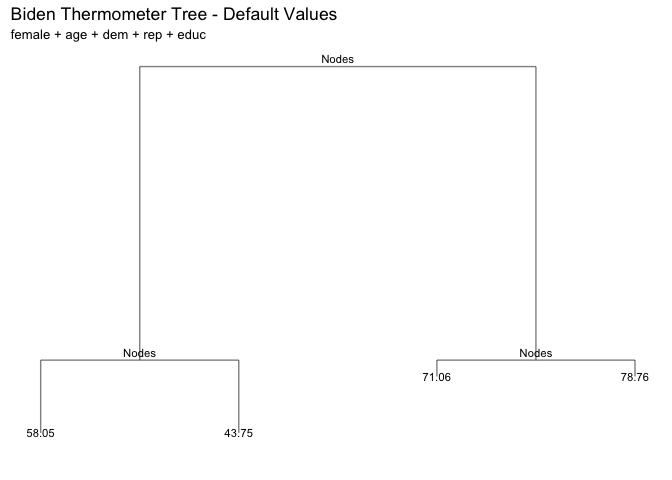

``` r
# MSE
biden_tree_default_testmse <- mse(biden_tree, biden_split$test)
biden_tree_default_testmse
```

    ## [1] 441.441

The test MSE is 441.441.

The tree shows that if you are not a democrat or republican, your predicted biden index is 58.05. If you are not democrat and republican, 43.75. Furthermore, if you are democrat and young the value is 78.7, and democrat and old 71.06.

"1.3 Fit a decision tree with controls""
----------------------------------------

``` r
set.seed(007)

biden_tree_controls <- tree(biden ~ female + age + educ + dem + rep, data = biden_split$train, control = tree.control(nobs = nrow(biden_split$train), mindev = 0))

tree_data <- dendro_data(biden_tree_controls)

ggplot(segment(tree_data)) +
  geom_segment(aes(x = x, y = y, xend = xend, yend = yend), 
               alpha = 0.5) +
  geom_text(data = label(tree_data), 
            aes(x = x, y = y, label = "Terminal Nodes"), vjust = 0.5, size = 3) +
  geom_text(data = leaf_label(tree_data), 
            aes(x = x, y = y, label = label), vjust = 0.5, size = 3) +
  theme_dendro()
```

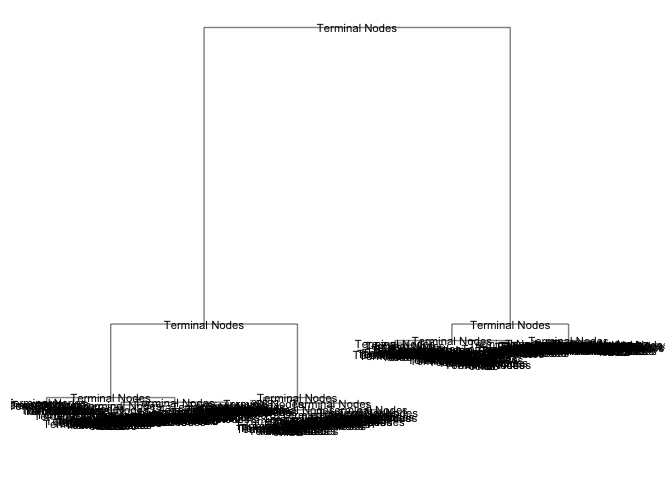

``` r
# MSE
biden_tree_controls_testmse <- mse(biden_tree_controls, biden_split$test)
biden_tree_controls_testmse
```

    ## [1] 536.092

``` r
# generate 10-fold CV trees
set.seed(007)

biden_cv <- crossv_kfold(data1, k = 10) %>%
  mutate(tree = map(train, ~ tree(biden ~ female + age + educ + dem + rep, data = ., control = tree.control(nobs = nrow(data1),
                            mindev = 0))))

# calculate each possible prune result for each fold
biden_cv <- expand.grid(biden_cv$.id, 2:10) %>%
  as_tibble() %>%
  mutate(Var2 = as.numeric(Var2)) %>%
  rename(.id = Var1,
         k = Var2) %>%
  left_join(biden_cv) %>%
  mutate(prune = map2(tree, k, ~ prune.tree(.x, best = .y)),
         mse = map2_dbl(prune, test, mse))
```

    ## Joining, by = ".id"

    ## Warning in left_join_impl(x, y, by$x, by$y, suffix$x, suffix$y): joining
    ## character vector and factor, coercing into character vector

``` r
biden_cv %>%
  select(k, mse) %>%
  group_by(k) %>%
  summarize(test_mse = mean(mse),
            sd = sd(mse, na.rm = TRUE)) %>%
  ggplot(aes(k, test_mse)) +
  geom_point() +
  geom_line() +
  labs(x = "Number of terminal nodes",
       y = "Test MSE",
       title = "Biden Thermometer",
       subtitle = "All variables")
```

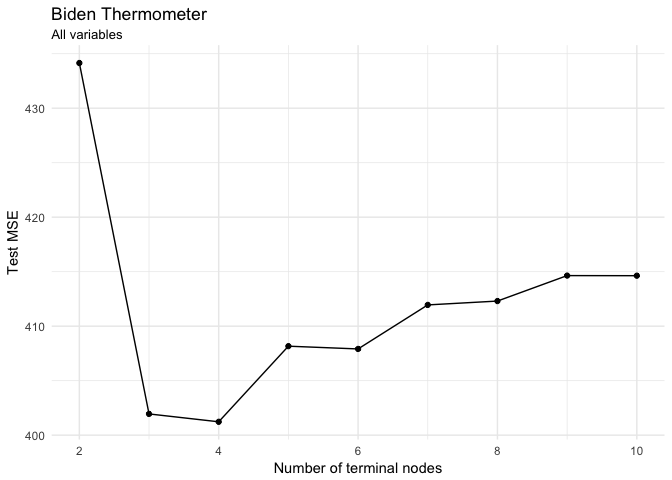

``` r
biden_cv %>%
  select(k, mse) %>%
  group_by(k) %>%
  summarize(test_mse = mean(mse),
            sd = sd(mse, na.rm = TRUE))
```

    ## # A tibble: 9 × 3
    ##       k test_mse      sd
    ##   <dbl>    <dbl>   <dbl>
    ## 1     2  434.146 59.4959
    ## 2     3  401.948 56.7898
    ## 3     4  401.227 58.4811
    ## 4     5  408.165 57.8610
    ## 5     6  407.911 55.0169
    ## 6     7  411.951 50.6220
    ## 7     8  412.305 50.1705
    ## 8     9  414.641 49.7768
    ## 9    10  414.631 49.7681

According to the graph, the optimal number for tree complexity is four, which produces the minimum MSE. Using four increase the accurancy of the tree versus the model without pruning, and the interpretability of results is still high.

The plot of the optimal tree:

``` r
mod <- prune.tree(biden_tree_controls, best = 4)

# plot tree
tree_data <- dendro_data(mod)

ggplot(segment(tree_data)) +
  geom_segment(aes(x = x, y = y, xend = xend, yend = yend), 
               alpha = 0.5) +
  geom_text(data = label(tree_data), 
            aes(x = x, y = y, label = "Terminal Nodes"), vjust = -0.5, size = 3) +
  geom_text(data = leaf_label(tree_data), 
            aes(x = x, y = y, label = label), vjust = 0.5, size = 3) +
  theme_dendro() +
  labs(title = "Biden Thermometer Controls - n = 4",
       subtitle = "female + age + dem + rep + educ")
```

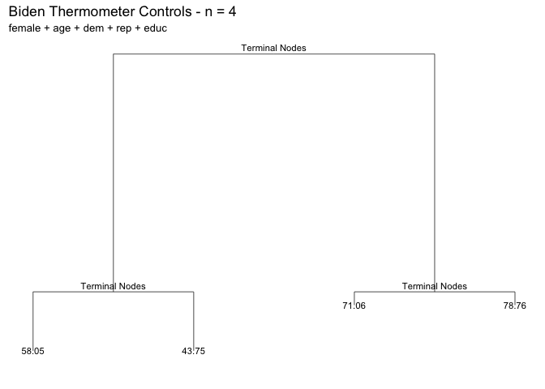

"1.4 Baggaing Approach"
-----------------------

``` r
(biden_bag <- randomForest(biden ~ ., data = data1,
                             mtry = 5, ntree = 500))
```

    ## 
    ## Call:
    ##  randomForest(formula = biden ~ ., data = data1, mtry = 5, ntree = 500) 
    ##                Type of random forest: regression
    ##                      Number of trees: 500
    ## No. of variables tried at each split: 5
    ## 
    ##           Mean of squared residuals: 491.866
    ##                     % Var explained: 10.6

Estimation of the OOB error rate

``` r
system.time({
  randomForest(biden ~ ., data = data1,
                              mtry = 5, ntree = 500)
})
```

    ##    user  system elapsed 
    ##   6.798   0.065   6.970

Importance of variables

``` r
data_frame(var = rownames(importance(biden_bag)),
           MeanDecreaseGini = importance(biden_bag)[,1]) %>%
  mutate(var = fct_reorder(var, MeanDecreaseGini, fun = median)) %>%
  ggplot(aes(var, MeanDecreaseGini)) +
  geom_point() +
  coord_flip() +
  labs(title = "Predicting Biden Warm Index",
       subtitle = "Bagging",
       x = NULL,
       y = "Average decrease in the Gini Index")
```

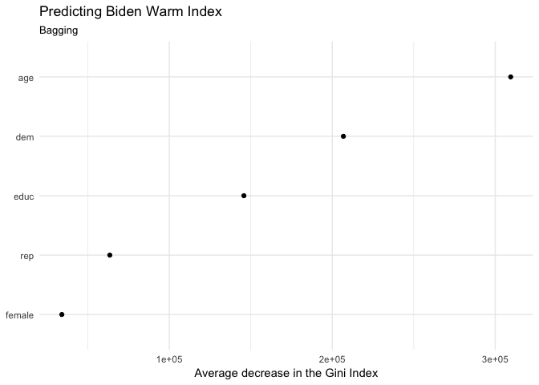

The graph depicts that the most importat variables for this model are: age, democrat, and education. However, it contradicts some of the previous models in the case of republican, and the intuition that female might have an effect in the Biden's perception.

"1.5 Random Forest"
-------------------

``` r
# Random forest model
(biden_rf <- randomForest(biden ~ ., data = data1,
                            ntree = 500))
```

    ## 
    ## Call:
    ##  randomForest(formula = biden ~ ., data = data1, ntree = 500) 
    ##                Type of random forest: regression
    ##                      Number of trees: 500
    ## No. of variables tried at each split: 1
    ## 
    ##           Mean of squared residuals: 404.84
    ##                     % Var explained: 26.41

``` r
data_frame(var = rownames(importance(biden_rf)),
           MeanDecreaseRSS = importance(biden_rf)[,1]) %>%
  mutate(var = fct_reorder(var, MeanDecreaseRSS, fun = median)) %>%
  ggplot(aes(var, MeanDecreaseRSS)) +
  geom_point() +
  coord_flip() +
  labs(title = "Predicting Biden Thermometer",
       subtitle = "Random Forest",
       x = NULL,
       y = "Average decrease in the RSS")
```

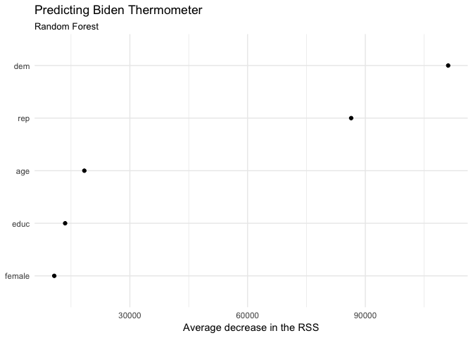

``` r
# Comparison

data_frame(var = rownames(importance(biden_rf)),
           `Random forest` = importance(biden_rf)[,1]) %>%
  left_join(data_frame(var = rownames(importance(biden_rf)),
           Bagging = importance(biden_bag)[,1])) %>%
  mutate(var = fct_reorder(var, Bagging, fun = median)) %>%
  gather(model, gini, -var) %>%
  ggplot(aes(var, gini, color = model)) +
  geom_point() +
  coord_flip() +
  labs(title = "Predicting Biden Warm Index",
       x = NULL,
       y = "Average decrease in the RSS",
       color = "Method")
```

    ## Joining, by = "var"


The out-of-the-bag MSE is 406.585, which is slighty lower than the bagging model.

The most important variables in the random forest are democrat and republican, which are intuitive results. It is interesting that the variable age, is extremely less important in the random forest against bagging. The average decrease is smaller in the random forest as the m increase.

"1.6 Boosting"
--------------

``` r
set.seed(007)

biden_boost <- gbm(biden ~ ., data = biden_split$train, n.trees = 10000, interaction.depth = 1)
```

    ## Distribution not specified, assuming gaussian ...

``` r
yhat.boost = predict(biden_boost, newdata = biden_split$test, n.trees = 10000)

mean((yhat.boost - data1[biden_split$test[2]$idx, ]$biden)^2)
```

    ## [1] 432.755

``` r
mses <- numeric(4)
shrinkages <- numeric(4)
for (s in 1:4){
  shrinkages[s] <- 10^(-s)
  biden_boost <- gbm(biden ~ ., data = biden_split$train, n.trees = 10000, interaction.depth = 1, shrinkage = shrinkages[s])
  yhat.boost = predict(biden_boost, newdata = biden_split$test, n.trees = 10000)
  mses[s] <- mean((yhat.boost - data1[biden_split$test[2]$idx, ]$biden)^2)
}
```

    ## Distribution not specified, assuming gaussian ...
    ## Distribution not specified, assuming gaussian ...
    ## Distribution not specified, assuming gaussian ...
    ## Distribution not specified, assuming gaussian ...

``` r
data_frame(mse = mses, shrinkage = shrinkages) %>% 
  ggplot(aes(shrinkage, mse)) +
  geom_point() +
  geom_line() +
  labs(title = "Predicting Biden thermometer",
       subtitle = "female + age + dem + rep + educ",
       x = "Shrinkage",
       y = "Test MSE")
```

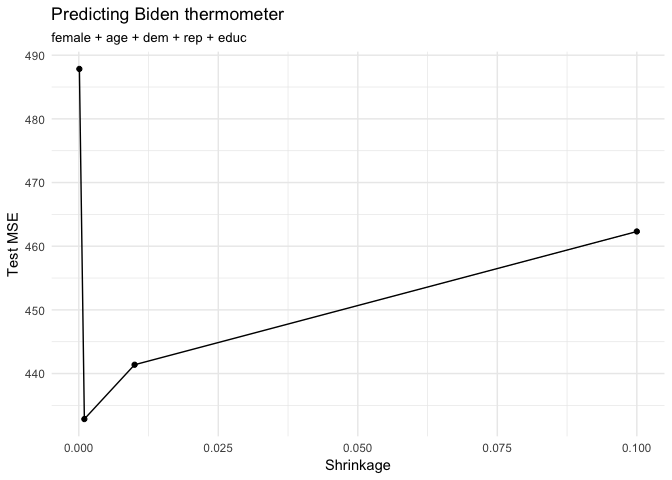

The graph shows that the MSE reach it minimum when the shrinkage is 0.001, afterwards, it goes up. Then, in this case, a higher shrinkage parameter has a negative effect in the model with values above 0.001.

2 Modeling voter turnout
========================

"2.1 Tree-Based Models""
------------------------

I will split the data in 70% for training and 30% for testing.

``` r
set.seed(007)
mh_split <- resample_partition(data2, c(test = 0.3, train = 0.7))

mh_train <- mh_split$train %>%
  tbl_df()

mh_test <- mh_split$test %>%
  tbl_df()
```

### "2.1.1 Tree-Based Models"

``` r
# set.seed(007)
#Split data
mh_split <- resample_partition(data2, c(test = 0.3, train = 0.7))

#Grow tree
mental_tree_default <- tree(vote96 ~ mhealth_sum + age + educ + black + female + married + inc10, data = mh_split$train)

#Plot tree
tree_data <- dendro_data(mental_tree_default)

ggplot(segment(tree_data)) +
  geom_segment(aes(x = x, y = y, xend = xend, yend = yend), alpha = 0.5) +
  geom_text(data = label(tree_data), aes(x = x, y = y, label = "label"), vjust = -0.5, size = 3) +
  geom_text(data = leaf_label(tree_data), aes(x = x, y = y, label = label), vjust = 0.5, size = 3) +
  theme_dendro() +
  labs(title = "Voter turnout tree",
       subtitle = "mhealth_sum + age + educ + black + female + married + inc10")
```


``` r
fitted <- predict(mental_tree_default, as_tibble(mh_split$test), type = "class")

roc_td <- roc(as.numeric(as_tibble(mh_split$test)$vote96), as.numeric(fitted))
plot(roc_td)
```

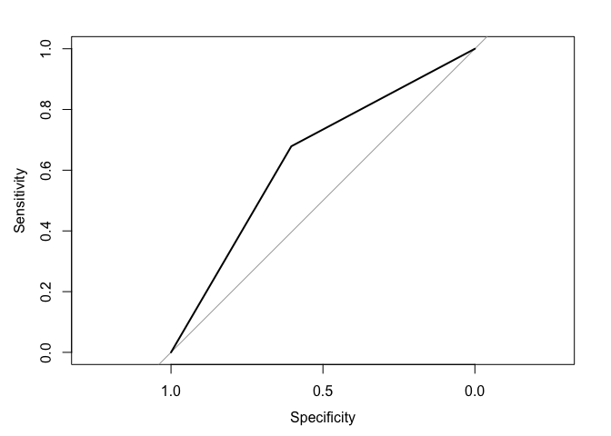

``` r
auc(roc_td)
```

    ## Area under the curve: 0.641

``` r
mental_tree_default_testerr <- err.rate.tree(mental_tree_default, mh_split$test)
mental_tree_default_testerr
```

    ## [1] 0.344221

``` r
real <- as.numeric(na.omit(as_tibble(mh_split$test)$vote96))
E1 <- mean(as.numeric(real != median(real)))
E2 <- mental_tree_default_testerr
PRE <- (E1 - E2) / E1
PRE
```

    ## [1] -0.118367

This model doe snot reduces the error rate agaist the base case. Then, this is not a good model.

### "2.1.2 Tree Number 2"

``` r
#Grow tree
mental_tree_default_2 <- tree(vote96 ~ mhealth_sum + age + educ + black + female + married + inc10, data = mh_split$train, control = tree.control(nobs = nrow(mh_split$train), mindev = 0))

#Plot tree
tree_data_2 <- dendro_data(mental_tree_default_2)

ggplot(segment(tree_data_2)) +
  geom_segment(aes(x = x, y = y, xend = xend, yend = yend), alpha = 0.5) +
  geom_text(data = label(tree_data), aes(x = x, y = y, label = "label"), vjust = -0.5, size = 3) +
  geom_text(data = leaf_label(tree_data), aes(x = x, y = y, label = label), vjust = 0.5, size = 3) +
  theme_dendro() +
  labs(title = "Voter turnout tree",
       subtitle = "mhealth_sum + age + educ + black + female + married + inc10")
```

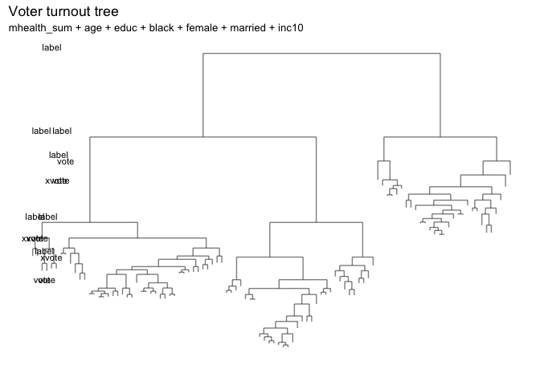

``` r
fitted_2 <- predict(mental_tree_default_2, as_tibble(mh_split$test), type = "class")

roc_td_2 <- roc(as.numeric(as_tibble(mh_split$test)$vote96), as.numeric(fitted_2))
plot(roc_td_2)
```

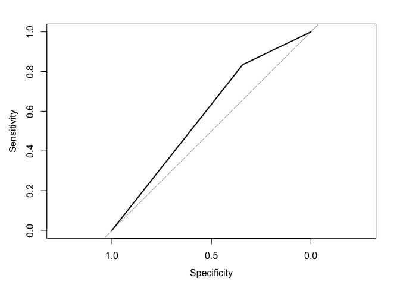

``` r
auc(roc_td_2)
```

    ## Area under the curve: 0.589

``` r
mental_tree_default_controls <- err.rate.tree(mental_tree_default_2, mh_split$test)
mental_tree_default_controls
```

    ## [1] 0.319095

``` r
real <- as.numeric(na.omit(as_tibble(mh_split$test)$vote96))
E1 <- mean(as.numeric(real != median(real)))
E2 <- mental_tree_default_controls
PRE <- (E1 - E2) / E1
PRE
```

    ## [1] -0.0367347

This model performace is even worst that the base model because it increases the error rate.

### "2.1.3 Tree Number 3 - Simple"

``` r
mh_tree <- tree(vote96 ~ educ + mhealth_sum, data = as_tibble(mh_split$train))
mh_tree
```

    ## node), split, n, deviance, yval, (yprob)
    ##       * denotes terminal node
    ## 
    ## 1) root 925 1170 vote ( 0.329 0.671 )  
    ##   2) educ < 14.5 640  865 vote ( 0.406 0.594 )  
    ##     4) mhealth_sum < 4.5 479  617 vote ( 0.344 0.656 ) *
    ##     5) mhealth_sum > 4.5 161  218 xvote ( 0.590 0.410 ) *
    ##   3) educ > 14.5 285  245 vote ( 0.154 0.846 )  
    ##     6) educ < 18.5 248  232 vote ( 0.177 0.823 ) *
    ##     7) educ > 18.5 37    0 vote ( 0.000 1.000 ) *

``` r
plot(mh_tree)
text(mh_tree, pretty = 0)
```

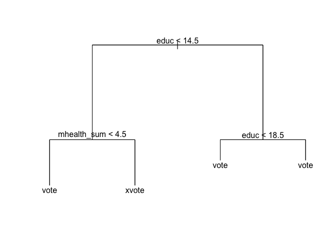

``` r
fitted <- predict(mh_tree, as_tibble(mh_split$test), type = "class")
tree_err <- mean(as_tibble(mh_split$test)$vote96 != fitted)
tree_err
```

    ## [1] NA

``` r
roc_tree2 <- roc(as.numeric(as_tibble(mh_split$test)$vote96), as.numeric(fitted))
plot(roc_tree2)
```

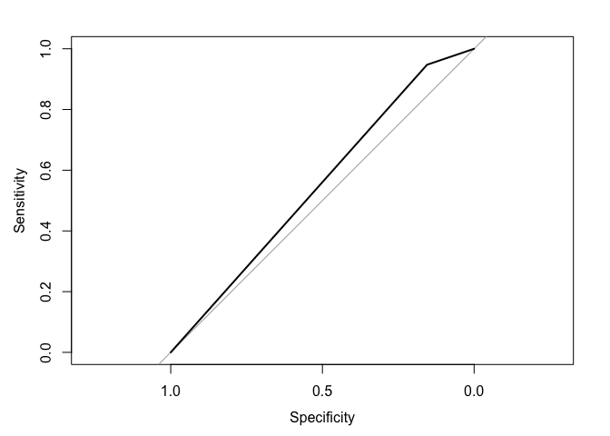

``` r
auc(roc_tree2)
```

    ## Area under the curve: 0.551

``` r
mental_tree_simple <- err.rate.tree(mh_tree, mh_split$test)
```

``` r
real <- as.numeric(na.omit(as_tibble(mh_split$test)$vote96))
E1 <- mean(as.numeric(real != median(real)))
E2 <- mental_tree_simple
PRE <- (E1 - E2) / E1
PRE
```

    ## [1] 0.0367347

This model also increases the error rate.

### "2.1.4 Tree Number 4 - Bagging"

``` r
set.seed(007)

mental_bag <- randomForest(vote96 ~ ., data = na.omit(as_tibble(mh_split$train)), mtry = 7, ntree = 500)
mental_bag
```

    ## 
    ## Call:
    ##  randomForest(formula = vote96 ~ ., data = na.omit(as_tibble(mh_split$train)),      mtry = 7, ntree = 500) 
    ##                Type of random forest: classification
    ##                      Number of trees: 500
    ## No. of variables tried at each split: 7
    ## 
    ##         OOB estimate of  error rate: 31.2%
    ## Confusion matrix:
    ##       xvote vote class.error
    ## xvote   117  147    0.556818
    ## vote    107  443    0.194545

``` r
data_frame(var = rownames(importance(mental_bag)),
           MeanDecreaseRSS = importance(mental_bag)[,1]) %>%
  mutate(var = fct_reorder(var, MeanDecreaseRSS, fun = median)) %>%
  ggplot(aes(var, MeanDecreaseRSS)) +
  geom_point() +
  coord_flip() +
  labs(title = "Predicting voter turnout",
       subtitle = "Bagging",
       x = NULL,
       y = "Average decrease in the Gini Index")
```


``` r
fitted <- predict(mental_bag, na.omit(as_tibble(mh_split$test)), type = "prob")[,2]

roc_b <- roc(na.omit(as_tibble(mh_split$test))$vote96, fitted)
plot(roc_b)
```

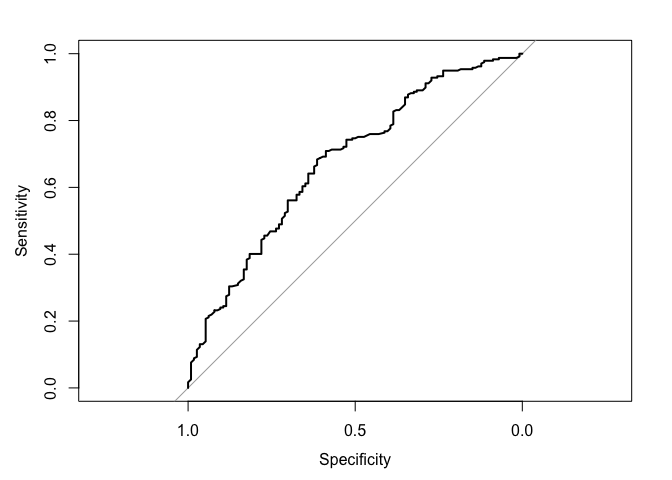

``` r
# AUC
auc(roc_b)
```

    ## Area under the curve: 0.676

``` r
# PRE
real <- as.numeric(na.omit(as_tibble(mh_split$test)$vote96))
E1 <- mean(as.numeric(real != median(real)))
E2 <- 0.2966
PRE <- (E1 - E2) / E1
PRE
```

    ## [1] 0.0363527

This model slightly reduces the error rate by about 10%. Then, in this measure, it is better than the two previous models.

### "2.1.5 Tree Number 4 - Random Forest"

``` r
set.seed(007)

mental_rf <- randomForest(vote96 ~ ., data = na.omit(as_tibble(mh_split$train)), ntree = 500)
mental_rf
```

    ## 
    ## Call:
    ##  randomForest(formula = vote96 ~ ., data = na.omit(as_tibble(mh_split$train)),      ntree = 500) 
    ##                Type of random forest: classification
    ##                      Number of trees: 500
    ## No. of variables tried at each split: 2
    ## 
    ##         OOB estimate of  error rate: 29.36%
    ## Confusion matrix:
    ##       xvote vote class.error
    ## xvote   103  161    0.609848
    ## vote     78  472    0.141818

``` r
data_frame(var = rownames(importance(mental_rf)),
           MeanDecreaseRSS = importance(mental_rf)[,1]) %>%
  mutate(var = fct_reorder(var, MeanDecreaseRSS, fun = median)) %>%
  ggplot(aes(var, MeanDecreaseRSS)) +
  geom_point() +
  coord_flip() +
  labs(title = "Predicting voter turnout",
       subtitle = "Random forest",
       x = NULL,
       y = "Average decrease in the Gini Index")
```

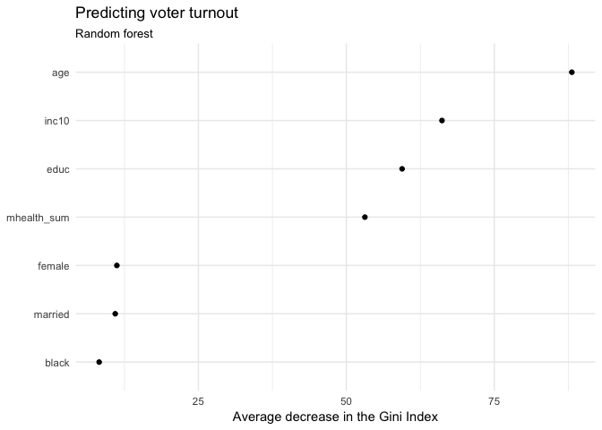

``` r
#ROC
fitted <- predict(mental_rf, na.omit(as_tibble(mh_split$test)), type = "prob")[,2]

roc_rf <- roc(na.omit(as_tibble(mh_split$test))$vote96, fitted)
plot(roc_rf)
```

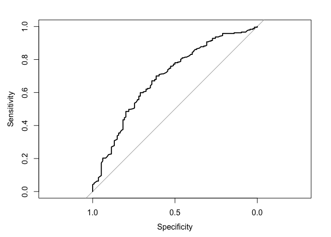

``` r
auc(roc_rf)
```

    ## Area under the curve: 0.691

``` r
#PRE
real <- as.numeric(na.omit(as_tibble(mh_split$test)$vote96))
E1 <- mean(as.numeric(real != median(real)))
E2 <- 0.2855
PRE <- (E1 - E2) / E1
PRE
```

    ## [1] 0.0724163

The reduction in the error term is 13.3%, then, in this measure, this is the best of the forme five models.

"2.2 SVM models""
-----------------

### "2.2.1 Support Vector Classifier""

Linear

``` r
set.seed(007)
(mh <- read_csv("data/mental_health.csv") %>%
  mutate_each(funs(as.factor(.)), vote96, black, female, married) %>%
  na.omit)
```

    ## Parsed with column specification:
    ## cols(
    ##   vote96 = col_double(),
    ##   mhealth_sum = col_double(),
    ##   age = col_double(),
    ##   educ = col_double(),
    ##   black = col_double(),
    ##   female = col_double(),
    ##   married = col_double(),
    ##   inc10 = col_double()
    ## )

    ## # A tibble: 1,165 × 8
    ##    vote96 mhealth_sum   age  educ  black female married   inc10
    ##    <fctr>       <dbl> <dbl> <dbl> <fctr> <fctr>  <fctr>   <dbl>
    ## 1       1           0    60    12      0      0       0  4.8149
    ## 2       1           1    36    12      0      0       1  8.8273
    ## 3       0           7    21    13      0      0       0  1.7387
    ## 4       0           6    29    13      0      0       0 10.6998
    ## 5       1           1    41    15      1      1       1  8.8273
    ## 6       1           2    48    20      0      0       1  8.8273
    ## 7       0           9    20    12      0      1       0  7.2223
    ## 8       0          12    27    11      0      1       0  1.2037
    ## 9       1           2    28    16      0      0       1  7.2223
    ## 10      1           0    72    14      0      0       1  4.0124
    ## # ... with 1,155 more rows

``` r
mh_split <- resample_partition(mh, p = c("test" = .3, "train" = .7))
```

``` r
mh_lin_tune <- tune(svm, vote96 ~ ., data = as_tibble(mh_split$train),
                    kernel = "linear",
                    range = list(cost = c(.001, .01, .1, 1, 5, 10, 100)))
summary(mh_lin_tune)
```

    ## 
    ## Parameter tuning of 'svm':
    ## 
    ## - sampling method: 10-fold cross validation 
    ## 
    ## - best parameters:
    ##  cost
    ##     1
    ## 
    ## - best performance: 0.283168 
    ## 
    ## - Detailed performance results:
    ##    cost    error dispersion
    ## 1 1e-03 0.322433  0.0597643
    ## 2 1e-02 0.301581  0.0590618
    ## 3 1e-01 0.284417  0.0569220
    ## 4 1e+00 0.283168  0.0633004
    ## 5 5e+00 0.283168  0.0635610
    ## 6 1e+01 0.283168  0.0635610
    ## 7 1e+02 0.284402  0.0642271

``` r
mh_lin <- mh_lin_tune$best.model
summary(mh_lin)
```

    ## 
    ## Call:
    ## best.tune(method = svm, train.x = vote96 ~ ., data = as_tibble(mh_split$train), 
    ##     ranges = list(cost = c(0.001, 0.01, 0.1, 1, 5, 10, 100)), 
    ##     kernel = "linear")
    ## 
    ## 
    ## Parameters:
    ##    SVM-Type:  C-classification 
    ##  SVM-Kernel:  linear 
    ##        cost:  1 
    ##       gamma:  0.125 
    ## 
    ## Number of Support Vectors:  494
    ## 
    ##  ( 247 247 )
    ## 
    ## 
    ## Number of Classes:  2 
    ## 
    ## Levels: 
    ##  0 1

``` r
# ROC
fitted <- predict(mh_lin, as_tibble(mh_split$test), decision.values = TRUE) %>%
  attributes

roc_line <- roc(as_tibble(mh_split$test)$vote96, fitted$decision.values)
```

    ## Warning in roc.default(as_tibble(mh_split$test)$vote96, fitted
    ## $decision.values): Deprecated use a matrix as predictor. Unexpected results
    ## may be produced, please pass a numeric vector.

``` r
# AUC
auc(roc_line)
```

    ## Area under the curve: 0.722

``` r
#PRE
real <- na.omit(as.numeric(as_tibble(mh_split$test)$vote96))
E1 <- mean(as.numeric(real != median(real)))
E2 <- 0.283168
PRE <- (E1 - E2) / E1
PRE
```

    ## [1] 0.140647

### "2.2.2 Polynomial Kernel""

``` r
mh_poly_tune <- tune(svm, vote96 ~ ., data = as_tibble(mh_split$train),
                    kernel = "polynomial",
                    range = list(cost = c(.001, .01, .1, 1, 5, 10, 100)))
summary(mh_poly_tune)
```

    ## 
    ## Parameter tuning of 'svm':
    ## 
    ## - sampling method: 10-fold cross validation 
    ## 
    ## - best parameters:
    ##  cost
    ##     1
    ## 
    ## - best performance: 0.28916 
    ## 
    ## - Detailed performance results:
    ##    cost    error dispersion
    ## 1 1e-03 0.322222  0.0591386
    ## 2 1e-02 0.322222  0.0591386
    ## 3 1e-01 0.308777  0.0623685
    ## 4 1e+00 0.289160  0.0590704
    ## 5 5e+00 0.291629  0.0554658
    ## 6 1e+01 0.292803  0.0526376
    ## 7 1e+02 0.313671  0.0553538

``` r
mh_poly <- mh_poly_tune$best.model
summary(mh_poly)
```

    ## 
    ## Call:
    ## best.tune(method = svm, train.x = vote96 ~ ., data = as_tibble(mh_split$train), 
    ##     ranges = list(cost = c(0.001, 0.01, 0.1, 1, 5, 10, 100)), 
    ##     kernel = "polynomial")
    ## 
    ## 
    ## Parameters:
    ##    SVM-Type:  C-classification 
    ##  SVM-Kernel:  polynomial 
    ##        cost:  1 
    ##      degree:  3 
    ##       gamma:  0.125 
    ##      coef.0:  0 
    ## 
    ## Number of Support Vectors:  506
    ## 
    ##  ( 263 243 )
    ## 
    ## 
    ## Number of Classes:  2 
    ## 
    ## Levels: 
    ##  0 1

``` r
fitted <- predict(mh_poly, as_tibble(mh_split$test), decision.values = TRUE) %>%
  attributes

roc_poly <- roc(as_tibble(mh_split$test)$vote96, fitted$decision.values)
```

    ## Warning in roc.default(as_tibble(mh_split$test)$vote96, fitted
    ## $decision.values): Deprecated use a matrix as predictor. Unexpected results
    ## may be produced, please pass a numeric vector.

``` r
plot(roc_poly)
```

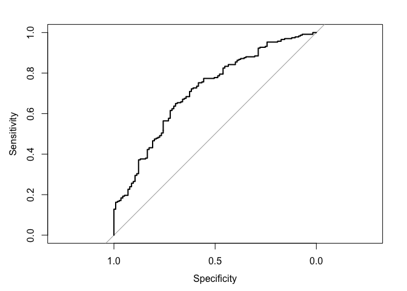

``` r
auc(roc_poly)
```

    ## Area under the curve: 0.714

``` r
#PRE
real <- na.omit(as.numeric(as_tibble(mh_split$test)$vote96))
E1 <- mean(as.numeric(real != median(real)))
E2 <- 0.28916
PRE <- (E1 - E2) / E1
PRE
```

    ## [1] 0.122462

### "2.2.3 Radial Kernel""

``` r
mh_rad_tune <- tune(svm, vote96 ~ ., data = as_tibble(mh_split$train),
                    kernel = "radial",
                    range = list(cost = c(.001, .01, .1, 1, 5, 10, 100)))
summary(mh_rad_tune)
```

    ## 
    ## Parameter tuning of 'svm':
    ## 
    ## - sampling method: 10-fold cross validation 
    ## 
    ## - best parameters:
    ##  cost
    ##   0.1
    ## 
    ## - best performance: 0.281813 
    ## 
    ## - Detailed performance results:
    ##    cost    error dispersion
    ## 1 1e-03 0.322313  0.0427485
    ## 2 1e-02 0.322313  0.0427485
    ## 3 1e-01 0.281813  0.0552679
    ## 4 1e+00 0.288106  0.0522897
    ## 5 5e+00 0.292999  0.0436480
    ## 6 1e+01 0.300346  0.0556988
    ## 7 1e+02 0.326137  0.0489702

``` r
mh_rad <- mh_rad_tune$best.model
summary(mh_rad)
```

    ## 
    ## Call:
    ## best.tune(method = svm, train.x = vote96 ~ ., data = as_tibble(mh_split$train), 
    ##     ranges = list(cost = c(0.001, 0.01, 0.1, 1, 5, 10, 100)), 
    ##     kernel = "radial")
    ## 
    ## 
    ## Parameters:
    ##    SVM-Type:  C-classification 
    ##  SVM-Kernel:  radial 
    ##        cost:  0.1 
    ##       gamma:  0.125 
    ## 
    ## Number of Support Vectors:  533
    ## 
    ##  ( 271 262 )
    ## 
    ## 
    ## Number of Classes:  2 
    ## 
    ## Levels: 
    ##  0 1

``` r
fitted <- predict(mh_rad, as_tibble(mh_split$test), decision.values = TRUE) %>%
  attributes


# ROC
roc_rad <- roc(as_tibble(mh_split$test)$vote96, fitted$decision.values)
```

    ## Warning in roc.default(as_tibble(mh_split$test)$vote96, fitted
    ## $decision.values): Deprecated use a matrix as predictor. Unexpected results
    ## may be produced, please pass a numeric vector.

``` r
plot(roc_rad)
```


``` r
# AUC
auc(roc_rad)
```

    ## Area under the curve: 0.711

``` r
#PRE
real <- na.omit(as.numeric(as_tibble(mh_split$test)$vote96))
E1 <- mean(as.numeric(real != median(real)))
E2 <- 0.283002 
PRE <- (E1 - E2) / E1
PRE
```

    ## [1] 0.14115

### "2.2.4 Sigmoid Kernel""

``` r
set.seed(007)
mh_sig_tune <- tune(svm, vote96 ~ ., data = as_tibble(mh_split$train),
                    kernel = "sigmoid",
                    range = list(cost = c(.001, .01, .1, 1, 5, 10, 100)))
summary(mh_sig_tune)
```

    ## 
    ## Parameter tuning of 'svm':
    ## 
    ## - sampling method: 10-fold cross validation 
    ## 
    ## - best parameters:
    ##  cost
    ##   0.1
    ## 
    ## - best performance: 0.298916 
    ## 
    ## - Detailed performance results:
    ##    cost    error dispersion
    ## 1 1e-03 0.322147  0.0635386
    ## 2 1e-02 0.322147  0.0635386
    ## 3 1e-01 0.298916  0.0578873
    ## 4 1e+00 0.329584  0.0561695
    ## 5 5e+00 0.370024  0.0523826
    ## 6 1e+01 0.370024  0.0539368
    ## 7 1e+02 0.365146  0.0540878

``` r
mh_sig <- mh_sig_tune$best.model
summary(mh_sig)
```

    ## 
    ## Call:
    ## best.tune(method = svm, train.x = vote96 ~ ., data = as_tibble(mh_split$train), 
    ##     ranges = list(cost = c(0.001, 0.01, 0.1, 1, 5, 10, 100)), 
    ##     kernel = "sigmoid")
    ## 
    ## 
    ## Parameters:
    ##    SVM-Type:  C-classification 
    ##  SVM-Kernel:  sigmoid 
    ##        cost:  0.1 
    ##       gamma:  0.125 
    ##      coef.0:  0 
    ## 
    ## Number of Support Vectors:  527
    ## 
    ##  ( 264 263 )
    ## 
    ## 
    ## Number of Classes:  2 
    ## 
    ## Levels: 
    ##  0 1

``` r
fitted <- predict(mh_sig, as_tibble(mh_split$test), decision.values = TRUE) %>%
  attributes

#ROC
roc_sig <- roc(as_tibble(mh_split$test)$vote96, fitted$decision.values)
```

    ## Warning in roc.default(as_tibble(mh_split$test)$vote96, fitted
    ## $decision.values): Deprecated use a matrix as predictor. Unexpected results
    ## may be produced, please pass a numeric vector.

``` r
plot(roc_sig)
```

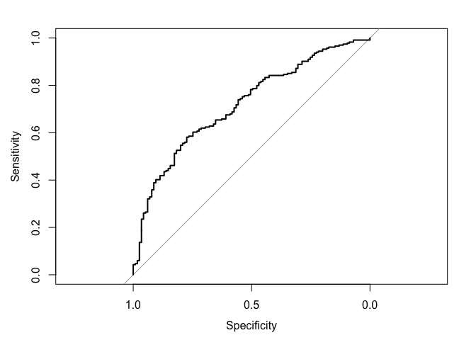

``` r
auc(roc_sig)
```

    ## Area under the curve: 0.719

``` r
#PRE
real <- na.omit(as.numeric(as_tibble(mh_split$test)$vote96))
E1 <- mean(as.numeric(real != median(real)))
E2 <- 0.298916 
PRE <- (E1 - E2) / E1
PRE
```

    ## [1] 0.0928549

### "2.2.5 Polinomial Kernel wih Different Degrees"

``` r
set.seed(007)

mh_poly_tune2 <- tune(svm, vote96 ~ mhealth_sum + age + educ + inc10, data = as_tibble(mh_split$train),
                    kernel = "polynomial",
                    range = list(cost = c(.001, .01, .1, 1, 5, 10, 100), degree = c(3, 4, 5)))
summary(mh_poly_tune2)
```

    ## 
    ## Parameter tuning of 'svm':
    ## 
    ## - sampling method: 10-fold cross validation 
    ## 
    ## - best parameters:
    ##  cost degree
    ##     5      3
    ## 
    ## - best performance: 0.286676 
    ## 
    ## - Detailed performance results:
    ##     cost degree    error dispersion
    ## 1  1e-03      3 0.322147  0.0635386
    ## 2  1e-02      3 0.313595  0.0647357
    ## 3  1e-01      3 0.300136  0.0630737
    ## 4  1e+00      3 0.289145  0.0601314
    ## 5  5e+00      3 0.286676  0.0652333
    ## 6  1e+01      3 0.289130  0.0620668
    ## 7  1e+02      3 0.292818  0.0621929
    ## 8  1e-03      4 0.323366  0.0630252
    ## 9  1e-02      4 0.313565  0.0648422
    ## 10 1e-01      4 0.314815  0.0662703
    ## 11 1e+00      4 0.316064  0.0567875
    ## 12 5e+00      4 0.316064  0.0608194
    ## 13 1e+01      4 0.317284  0.0598699
    ## 14 1e+02      4 0.318503  0.0602641
    ## 15 1e-03      5 0.324616  0.0644815
    ## 16 1e-02      5 0.314800  0.0681657
    ## 17 1e-01      5 0.307483  0.0621369
    ## 18 1e+00      5 0.306233  0.0618417
    ## 19 5e+00      5 0.308717  0.0516477
    ## 20 1e+01      5 0.306263  0.0496932
    ## 21 1e+02      5 0.305014  0.0500947

``` r
#Best
mh_poly2 <- mh_poly_tune2$best.model
summary(mh_poly2)
```

    ## 
    ## Call:
    ## best.tune(method = svm, train.x = vote96 ~ mhealth_sum + age + 
    ##     educ + inc10, data = as_tibble(mh_split$train), ranges = list(cost = c(0.001, 
    ##     0.01, 0.1, 1, 5, 10, 100), degree = c(3, 4, 5)), kernel = "polynomial")
    ## 
    ## 
    ## Parameters:
    ##    SVM-Type:  C-classification 
    ##  SVM-Kernel:  polynomial 
    ##        cost:  5 
    ##      degree:  3 
    ##       gamma:  0.25 
    ##      coef.0:  0 
    ## 
    ## Number of Support Vectors:  483
    ## 
    ##  ( 243 240 )
    ## 
    ## 
    ## Number of Classes:  2 
    ## 
    ## Levels: 
    ##  0 1

``` r
#ROC
fitted <- predict(mh_poly2, as_tibble(mh_split$test), decision.values = TRUE) %>%
  attributes

roc_poly2 <- roc(as_tibble(mh_split$test)$vote96, fitted$decision.values)
```

    ## Warning in roc.default(as_tibble(mh_split$test)$vote96, fitted
    ## $decision.values): Deprecated use a matrix as predictor. Unexpected results
    ## may be produced, please pass a numeric vector.

``` r
plot(roc_poly2)
```

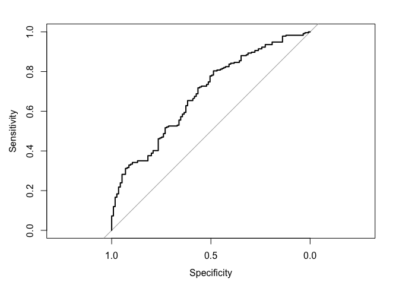

``` r
auc(roc_poly2)
```

    ## Area under the curve: 0.687

``` r
#PRE
real <- na.omit(as.numeric(as_tibble(mh_split$test)$vote96))
E1 <- mean(as.numeric(real != median(real)))
E2 <- 0.286676
PRE <- (E1 - E2) / E1
PRE
```

    ## [1] 0.130001

### 2.2.6 Selecting models

``` r
plot(roc_line, print.auc = TRUE, col = "blue")
plot(roc_poly, print.auc = TRUE, col = "red", print.auc.y = .4, add = TRUE)
plot(roc_rad, print.auc = TRUE, col = "orange", print.auc.y = .3, add = TRUE)
plot(roc_sig, print.auc = TRUE, col = "green", print.auc.y = .2, add = TRUE)
plot(roc_poly2, print.auc = TRUE, col = "black", print.auc.y = .1, add = TRUE)
```

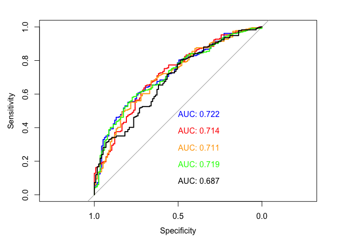

The best one is the blue, the polinomial one, which has the hightest value for the area under the curve, which is the comprehensive measure.

"3. Simpson"
============

``` r
simpson <- read_csv("data/simpson.csv")
```

    ## Parsed with column specification:
    ## cols(
    ##   guilt = col_double(),
    ##   dem = col_double(),
    ##   rep = col_double(),
    ##   ind = col_double(),
    ##   age = col_double(),
    ##   educ = col_character(),
    ##   female = col_double(),
    ##   black = col_double(),
    ##   hispanic = col_double(),
    ##   income = col_character()
    ## )

``` r
simpson$male <- with(simpson, ifelse(female == 1, 0, 1))
simpson$white <- with(simpson, ifelse(black == 0 & hispanic == 0,1,0))
```

"3.1 Inference"
---------------

The starting point is the logistic regresison due its interpretability for cases with two outcomes, in this case guilty or not. However, I estimated five models.

``` r
black_educ_income <- glm(guilt ~black+educ+income,data = simpson, family = binomial)
all_vars <- glm(guilt ~black+educ+income+age+rep+dem,data = simpson, family = binomial)
black_male <- glm(guilt ~black*male,data = simpson, family = binomial)
white_female <- glm(guilt ~white*female,data = simpson, family = binomial)
black_age <- glm(guilt~black+age,data=simpson,family=binomial)
```

``` r
black_only <- glm(guilt ~black,data = simpson, family = binomial)
summary(black_only)
```

    ## 
    ## Call:
    ## glm(formula = guilt ~ black, family = binomial, data = simpson)
    ## 
    ## Deviance Residuals: 
    ##    Min      1Q  Median      3Q     Max  
    ## -1.823  -0.593   0.649   0.649   1.911  
    ## 
    ## Coefficients:
    ##             Estimate Std. Error z value Pr(>|z|)    
    ## (Intercept)   1.4518     0.0752    19.3   <2e-16 ***
    ## black        -3.1022     0.1827   -17.0   <2e-16 ***
    ## ---
    ## Signif. codes:  0 '***' 0.001 '**' 0.01 '*' 0.05 '.' 0.1 ' ' 1
    ## 
    ## (Dispersion parameter for binomial family taken to be 1)
    ## 
    ##     Null deviance: 1758.1  on 1415  degrees of freedom
    ## Residual deviance: 1352.2  on 1414  degrees of freedom
    ##   (153 observations deleted due to missingness)
    ## AIC: 1356
    ## 
    ## Number of Fisher Scoring iterations: 4

``` r
logit2prob <- function(x){
  exp(x) / (1 + exp(x))
}

accuracy <- simpson %>%
  add_predictions(black_only) %>%
  mutate(pred = logit2prob(pred),
         pred = as.numeric(pred > .5))

model_accuracy = mean(accuracy$guilt == accuracy$pred, na.rm = TRUE)

PRE <- function(model){
  # get the actual values for y from the data
  y <- model$y

  # get the predicted values for y from the model
   y.hat <- round(model$fitted.values)

  # calculate the errors for the null model and your model
  E1 <- sum(y != median(y))
  E2 <- sum(y != y.hat)

  # calculate the proportional reduction in error
  PRE <- (E1 - E2) / E1
  return(PRE)
}

pre <- PRE(black_only)
auc_x <- auc(accuracy$guilt, accuracy$pred)

# Results
model_accuracy
```

    ## [1] 0.815678

``` r
pre
```

    ## [1] 0.409502

``` r
auc_x
```

    ## Area under the curve: 0.731

The relationship between race and belief is very strong, verified by the small p-value. Being black reduces the log-odds of an individuals belief in OJ's guilt by -3.1022, i.e., lowers the likelihood of believing in OJ's guilt by around 14%.

The model's accuracy is 81.6%, which is good. The proportional error reduction is 41%, which is substantial. The AUC shows a 0.23 increase over the useless classifier.

"3.1 Prediction"
----------------

``` r
set.seed(007) # For reproducibility
oj = read.csv('data/simpson.csv')
oj = oj[(!is.na(oj$guilt)), ]
oj$Opinion = factor(oj$guilt, levels = c(0,1), labels = c("Innocent", "Guilty"))
```

``` r
oj_split7030 = resample_partition(oj, c(test = 0.3, train = 0.7))
oj_train70 = oj_split7030$train %>%
                tbl_df()
oj_test30 = oj_split7030$test %>%
               tbl_df()

oj_data_train = oj_train70 %>%
                select(-guilt) %>%
                mutate_each(funs(as.factor(.)), dem, rep) %>%
                na.omit

oj_data_test = oj_test30 %>%
               select(-guilt) %>%
               mutate_each(funs(as.factor(.)), dem, rep) %>%
               na.omit

# estimate model
oj_tree <- tree(Opinion ~ ., data = oj_data_train)

# plot tree
tree_data <- dendro_data(oj_tree)

ptree <- ggplot(segment(tree_data)) +
  geom_segment(aes(x = x, y = y, xend = xend, yend = yend), 
               alpha = 0.5) +
  geom_text(data = label(tree_data), 
            aes(x = x, y = y, label = "label"), vjust = -0.5, size = 3) +
  geom_text(data = leaf_label(tree_data), 
            aes(x = x, y = y, label = label), vjust = 0.5, size = 3) +
  theme_dendro()+
  labs(title = "Decision Tree for OJ's Guilt",
       subtitle = 'All predictors, Default Controls')
ptree
```

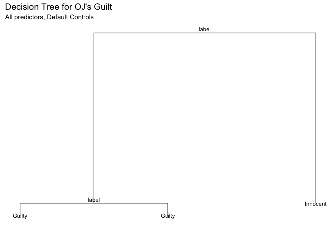

In this case, being black has a significa relationship also.

``` r
mse <- function(model, data) {
  x <- modelr:::residuals(model, data)
  mean(x ^ 2, na.rm = TRUE)
}

(rf_oj = randomForest(Opinion ~ ., data = oj_data_train, mtry = 3,ntree = 500))
```

    ## 
    ## Call:
    ##  randomForest(formula = Opinion ~ ., data = oj_data_train, mtry = 3,      ntree = 500) 
    ##                Type of random forest: classification
    ##                      Number of trees: 500
    ## No. of variables tried at each split: 3
    ## 
    ##         OOB estimate of  error rate: 20.16%
    ## Confusion matrix:
    ##          Innocent Guilty class.error
    ## Innocent      161    157   0.4937107
    ## Guilty         43    631   0.0637982

We notice an error rate of 20.6%, which is a success rate of about 80%.

``` r
rf_oj_importance = as.data.frame(importance(rf_oj))

ggplot(rf_oj_importance, mapping=aes(x=rownames(rf_oj_importance), y=MeanDecreaseGini)) +
       geom_bar(stat="identity", aes(fill=MeanDecreaseGini)) + 
       labs(title = "Mean Decrease in Gini Index Across 500 Random Forest Regression Trees",
       subtitle = "Predicted Opinion of Simpson Guilt",
       x = "Variable",
       y = "Mean Decrease in Gini Index") + 
       theme(plot.title = element_text(hjust = 0.5), plot.subtitle = element_text(hjust = 0.5),
             panel.border = element_rect(linetype = "solid", color = "grey70", fill=NA, size=1.1), legend.position = 'none') 
```

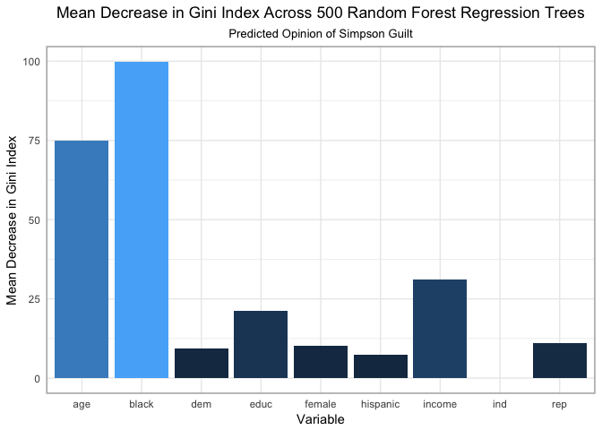

The variable black is the most importat to predic opinion, followed by age, income, and education.
