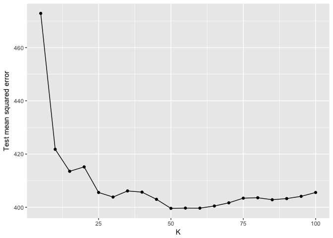
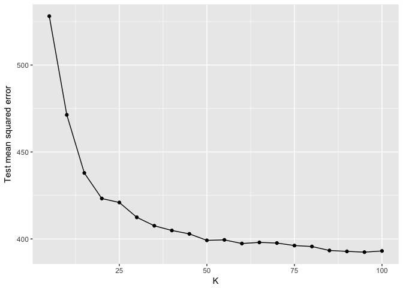
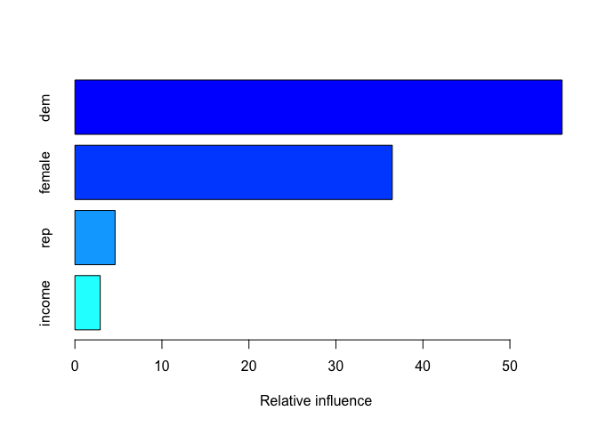
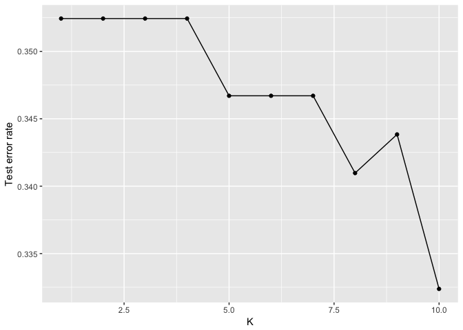
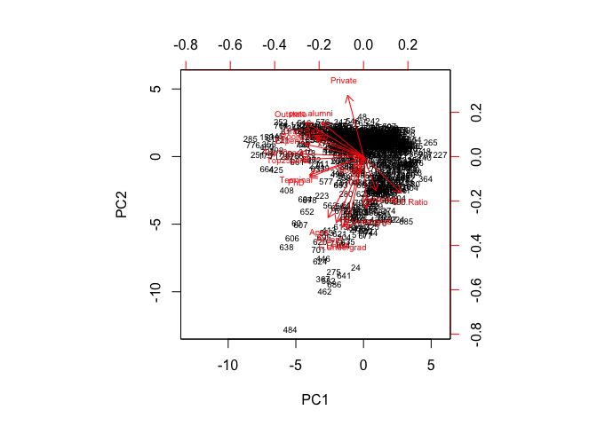
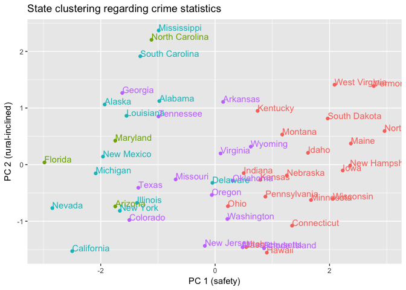
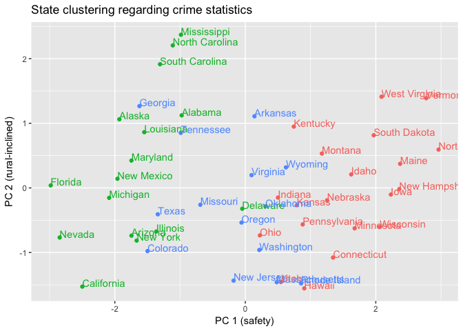
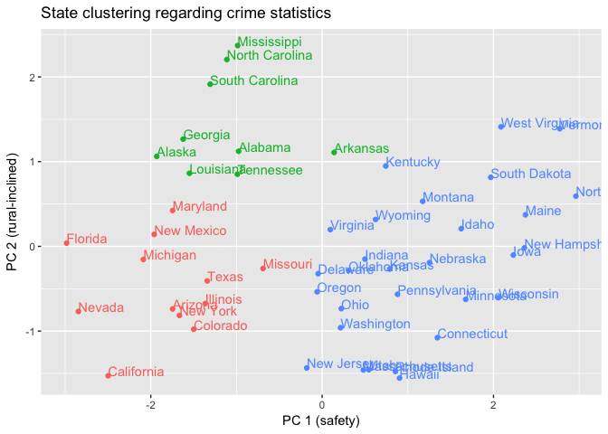
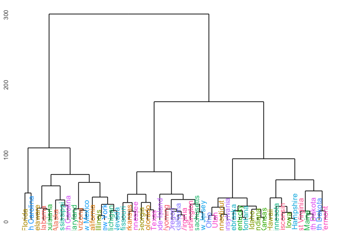
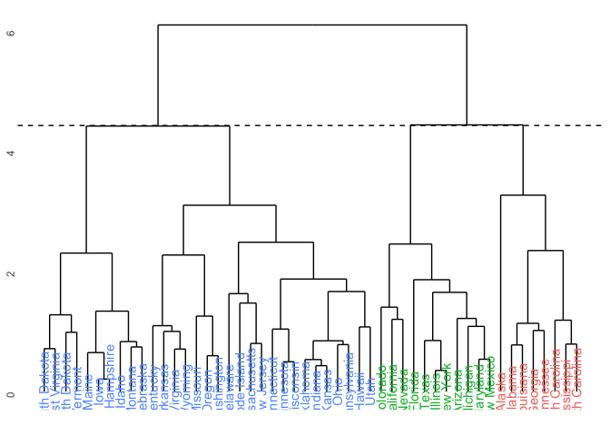

PA9
================
Rodrigo Valdes
March 15, 2017

-   [Feminism](#feminism)
    -   [1.Split the data](#split-the-data)
    -   [2. Calculate the test MSE for KNN models with K = 5, 10, 15,.., 100.](#calculate-the-test-mse-for-knn-models-with-k-5-10-15..-100.)
    -   [3. Calculate the test MSE for weighted KNN models with 5, 10, 15,.., 100, using the same combination of variables as before.](#calculate-the-test-mse-for-weighted-knn-models-with-5-10-15..-100-using-the-same-combination-of-variables-as-before.)
    -   [4.Compare the test MSE for the best KNN/wKNN model(s) to the test MSE for the equivalent linear regression, decision tree, boosting, and random forest methods using the same combination of variables as before.](#compare-the-test-mse-for-the-best-knnwknn-models-to-the-test-mse-for-the-equivalent-linear-regression-decision-tree-boosting-and-random-forest-methods-using-the-same-combination-of-variables-as-before.)
-   [Voter turnout and depression](#voter-turnout-and-depression)
    -   [1. Split the data](#split-the-data-1)
    -   [2. Calculate the test error rate for KNN models with K = 1, 2,.., 10, using whatever combination of variables you see fit. Which model produces the lowest test error rate?](#calculate-the-test-error-rate-for-knn-models-with-k-1-2..-10-using-whatever-combination-of-variables-you-see-fit.-which-model-produces-the-lowest-test-error-rate)
    -   [3. Calculate the test MSE for weighted KNN models with K = 1, 2,.., 10 using the same combination of variables as before. Which model produces the lowest test error rate?](#calculate-the-test-mse-for-weighted-knn-models-with-k-1-2..-10-using-the-same-combination-of-variables-as-before.-which-model-produces-the-lowest-test-error-rate)
    -   [4.Compare the test error rate for the best KNN/wKNN model(s) to the test error rate for the equivalent logistic regression, decision tree, boosting, random forest, and SVM methods using the same combination of variables as before. Which performs the best? Why do you think this method performed the best, given your knowledge of how it works?](#compare-the-test-error-rate-for-the-best-knnwknn-models-to-the-test-error-rate-for-the-equivalent-logistic-regression-decision-tree-boosting-random-forest-and-svm-methods-using-the-same-combination-of-variables-as-before.-which-performs-the-best-why-do-you-think-this-method-performed-the-best-given-your-knowledge-of-how-it-works)
-   [Colleges](#colleges)
    -   [Perform PCA analysis on the college dataset and plot the first two principal components. Describe the results. What variables appear strongly correlated on the first principal component? What about the second principal component?](#perform-pca-analysis-on-the-college-dataset-and-plot-the-first-two-principal-components.-describe-the-results.-what-variables-appear-strongly-correlated-on-the-first-principal-component-what-about-the-second-principal-component)
-   [Clustering states](#clustering-states)
    -   [1.Perform PCA on the dataset and plot the observations on the first and second principal components.](#perform-pca-on-the-dataset-and-plot-the-observations-on-the-first-and-second-principal-components.)
    -   [2.Perform K-means clustering with K = 2. Plot the observations on the first and second principal components and color-code each state based on their cluster membership. Describe your results.](#perform-k-means-clustering-with-k-2.-plot-the-observations-on-the-first-and-second-principal-components-and-color-code-each-state-based-on-their-cluster-membership.-describe-your-results.)
    -   [3.Perform K-means clustering with K = 4. Plot the observations on the first and second principal components and color-code each state based on their cluster membership. Describe your results.](#perform-k-means-clustering-with-k-4.-plot-the-observations-on-the-first-and-second-principal-components-and-color-code-each-state-based-on-their-cluster-membership.-describe-your-results.)
    -   [4.Perform K-means clustering with K = 3. Plot the observations on the first and second principal components and color-code each state based on their cluster membership. Describe your results.](#perform-k-means-clustering-with-k-3.-plot-the-observations-on-the-first-and-second-principal-components-and-color-code-each-state-based-on-their-cluster-membership.-describe-your-results.)
    -   [5.Perform K-means clustering with K = 3 on the first two principal components score vectors, rather than the raw data. Describe your results and compare them to the clustering results with K = 3 based on the raw data.](#perform-k-means-clustering-with-k-3-on-the-first-two-principal-components-score-vectors-rather-than-the-raw-data.-describe-your-results-and-compare-them-to-the-clustering-results-with-k-3-based-on-the-raw-data.)
    -   [6.Using hierarchical clustering with complete linkage and Euclidean distance, cluster the states.](#using-hierarchical-clustering-with-complete-linkage-and-euclidean-distance-cluster-the-states.)
    -   [7.Cut the dendrogram at a height that results in three distinct clusters. Which states belong to which clusters?](#cut-the-dendrogram-at-a-height-that-results-in-three-distinct-clusters.-which-states-belong-to-which-clusters)
    -   [8.Hierarchically cluster the states using complete linkage and Euclidean distance, after scaling the variables to have standard deviation 1. What effect does scaling the variables have on the hierarchical clustering obtained? In your opinion, should the variables be scaled before the inter-observation dissimilarities are computed? Provide a justification for your answer.](#hierarchically-cluster-the-states-using-complete-linkage-and-euclidean-distance-after-scaling-the-variables-to-have-standard-deviation-1.-what-effect-does-scaling-the-variables-have-on-the-hierarchical-clustering-obtained-in-your-opinion-should-the-variables-be-scaled-before-the-inter-observation-dissimilarities-are-computed-provide-a-justification-for-your-answer.)

``` r
#--Dfs
df_feminist <- read_csv("data/feminist.csv")
```

    ## Parsed with column specification:
    ## cols(
    ##   feminist = col_integer(),
    ##   female = col_integer(),
    ##   age = col_integer(),
    ##   educ = col_integer(),
    ##   income = col_integer(),
    ##   dem = col_integer(),
    ##   rep = col_integer()
    ## )

``` r
df_feministF <- read_csv("data/feminist.csv") %>%
  mutate_each(funs(as.factor(.)), female, dem, rep)
```

    ## Parsed with column specification:
    ## cols(
    ##   feminist = col_integer(),
    ##   female = col_integer(),
    ##   age = col_integer(),
    ##   educ = col_integer(),
    ##   income = col_integer(),
    ##   dem = col_integer(),
    ##   rep = col_integer()
    ## )

``` r
df_mental <- read_csv("data/mental_health.csv") %>% drop_na()
```

    ## Parsed with column specification:
    ## cols(
    ##   vote96 = col_double(),
    ##   mhealth_sum = col_double(),
    ##   age = col_double(),
    ##   educ = col_double(),
    ##   black = col_double(),
    ##   female = col_double(),
    ##   married = col_double(),
    ##   inc10 = col_double()
    ## )

``` r
df_mentalF <- read_csv("data/mental_health.csv") %>%
  drop_na() %>% 
  mutate_each(funs(as.factor(.)), vote96, black, female, married)
```

    ## Parsed with column specification:
    ## cols(
    ##   vote96 = col_double(),
    ##   mhealth_sum = col_double(),
    ##   age = col_double(),
    ##   educ = col_double(),
    ##   black = col_double(),
    ##   female = col_double(),
    ##   married = col_double(),
    ##   inc10 = col_double()
    ## )

``` r
df_college <- read_csv("data/College.csv") %>%
  mutate(Private = as.numeric(as.factor(Private)))
```

    ## Parsed with column specification:
    ## cols(
    ##   Private = col_character(),
    ##   Apps = col_double(),
    ##   Accept = col_double(),
    ##   Enroll = col_double(),
    ##   Top10perc = col_double(),
    ##   Top25perc = col_double(),
    ##   F.Undergrad = col_double(),
    ##   P.Undergrad = col_double(),
    ##   Outstate = col_double(),
    ##   Room.Board = col_double(),
    ##   Books = col_double(),
    ##   Personal = col_double(),
    ##   PhD = col_double(),
    ##   Terminal = col_double(),
    ##   S.F.Ratio = col_double(),
    ##   perc.alumni = col_double(),
    ##   Expend = col_double(),
    ##   Grad.Rate = col_double()
    ## )

``` r
df_arrest <- read_csv("data/USArrests.csv")
```

    ## Parsed with column specification:
    ## cols(
    ##   State = col_character(),
    ##   Murder = col_double(),
    ##   Assault = col_integer(),
    ##   UrbanPop = col_integer(),
    ##   Rape = col_double()
    ## )

``` r
#--Functions
mse <- function(model, data) {
  x <- modelr:::residuals(model, data)
  mean(x ^ 2, na.rm = TRUE)
}

err.rate.tree <- function(model, data) {
  data <- as_tibble(data)
  response <- as.character(model$terms[[2]])
  
  pred <- predict(model, newdata = data, type = "class")
  actual <- data[[response]]
  
  return(mean(pred != actual, na.rm = TRUE))
}

Cols <- function(vec){
  cols=rainbow(length(unique(vec)))
  
  return (cols[as.numeric(as.factor(vec))])
}
```

Feminism
========

1.Split the data
----------------

``` r
set.seed(007)
#--Split data
dfs_feminist <- resample_partition(df_feminist, c(test = 0.3, train = 0.7))
df_feminist_tr <- as_tibble(dfs_feminist$train)
df_feminist_te <- as_tibble(dfs_feminist$test)

#--Split data with factor
dfs_feministF <- resample_partition(df_feministF, c(test = 0.3, train = 0.7))
df_feministF_tr <- as_tibble(dfs_feministF$train)
df_feministF_te <- as_tibble(dfs_feministF$test)
```

2. Calculate the test MSE for KNN models with K = 5, 10, 15,.., 100.
--------------------------------------------------------------------

First, I will analyse which variables fit with the model.

``` r
test_varibles <- lm(formula = feminist ~ ., data = df_feminist_te)

summary(test_varibles)
```

    ## 
    ## Call:
    ## lm(formula = feminist ~ ., data = df_feminist_te)
    ## 
    ## Residuals:
    ##    Min     1Q Median     3Q    Max 
    ## -63.08 -11.66  -1.19  11.40  54.55 
    ## 
    ## Coefficients:
    ##             Estimate Std. Error t value Pr(>|t|)    
    ## (Intercept) 52.36127    5.73879    9.12  < 2e-16 ***
    ## female       5.14668    1.75472    2.93  0.00350 ** 
    ## age          0.00989    0.05042    0.20  0.84451    
    ## educ         0.36164    0.39638    0.91  0.36199    
    ## income      -0.34107    0.15997   -2.13  0.03345 *  
    ## dem          7.47965    1.91745    3.90  0.00011 ***
    ## rep         -8.31091    2.36846   -3.51  0.00049 ***
    ## ---
    ## Signif. codes:  0 '***' 0.001 '**' 0.01 '*' 0.05 '.' 0.1 ' ' 1
    ## 
    ## Residual standard error: 19.5 on 540 degrees of freedom
    ## Multiple R-squared:  0.124,  Adjusted R-squared:  0.114 
    ## F-statistic: 12.7 on 6 and 540 DF,  p-value: 1.87e-13

Based on the above results, I will select female, income, democrat and republican.

``` r
set.seed(007)

#--KNN and mse
KNN_1 <- data_frame(k = seq(5, 100, by=5),
                    knn = map(k, ~ knn.reg(select(df_feminist_tr, -feminist, -age, -educ),
                                           y=df_feminist_tr$feminist,
                                           test=select(df_feminist_te, -feminist, -age, -educ),
                                           k=.)
                    ),
                    mse = map_dbl(knn, ~ mean((df_feminist_te$feminist - .$pred)^2)))

KNN_1
```

    ## # A tibble: 20 × 3
    ##        k          knn   mse
    ##    <dbl>       <list> <dbl>
    ## 1      5 <S3: knnReg> 472.9
    ## 2     10 <S3: knnReg> 421.8
    ## 3     15 <S3: knnReg> 413.5
    ## 4     20 <S3: knnReg> 415.2
    ## 5     25 <S3: knnReg> 405.6
    ## 6     30 <S3: knnReg> 403.8
    ## 7     35 <S3: knnReg> 406.1
    ## 8     40 <S3: knnReg> 405.7
    ## 9     45 <S3: knnReg> 403.0
    ## 10    50 <S3: knnReg> 399.6
    ## 11    55 <S3: knnReg> 399.7
    ## 12    60 <S3: knnReg> 399.7
    ## 13    65 <S3: knnReg> 400.5
    ## 14    70 <S3: knnReg> 401.7
    ## 15    75 <S3: knnReg> 403.4
    ## 16    80 <S3: knnReg> 403.6
    ## 17    85 <S3: knnReg> 402.8
    ## 18    90 <S3: knnReg> 403.3
    ## 19    95 <S3: knnReg> 404.1
    ## 20   100 <S3: knnReg> 405.6

``` r
ggplot(KNN_1, aes(k, mse)) +
  geom_line() +
  geom_point() +
  labs(x = "K",
       y = "Test mean squared error")
```



The lowest MSE is produced by the model with 50 k. After 50, MSE increases again.

3. Calculate the test MSE for weighted KNN models with 5, 10, 15,.., 100, using the same combination of variables as before.
----------------------------------------------------------------------------------------------------------------------------

``` r
set.seed(007)

#--wKNN and mse
wKNN_1 <- data_frame(k = seq(5, 100, by=5),
                    knn = map(k, ~ kknn(feminist ~ female + income + dem + rep,
                                        train=df_feminist_tr,
                                        test=df_feminist_te, k =.)
                    ),
                    mse = map_dbl(knn, ~ mean((df_feminist_te$feminist - .$fitted.values)^2)))

wKNN_1
```

    ## # A tibble: 20 × 3
    ##        k        knn   mse
    ##    <dbl>     <list> <dbl>
    ## 1      5 <S3: kknn> 528.1
    ## 2     10 <S3: kknn> 471.3
    ## 3     15 <S3: kknn> 438.0
    ## 4     20 <S3: kknn> 423.3
    ## 5     25 <S3: kknn> 421.0
    ## 6     30 <S3: kknn> 412.4
    ## 7     35 <S3: kknn> 407.6
    ## 8     40 <S3: kknn> 404.9
    ## 9     45 <S3: kknn> 402.9
    ## 10    50 <S3: kknn> 399.2
    ## 11    55 <S3: kknn> 399.5
    ## 12    60 <S3: kknn> 397.4
    ## 13    65 <S3: kknn> 398.0
    ## 14    70 <S3: kknn> 397.7
    ## 15    75 <S3: kknn> 396.2
    ## 16    80 <S3: kknn> 395.7
    ## 17    85 <S3: kknn> 393.4
    ## 18    90 <S3: kknn> 392.9
    ## 19    95 <S3: kknn> 392.4
    ## 20   100 <S3: kknn> 393.1

``` r
ggplot(wKNN_1, aes(k, mse)) +
  geom_line() +
  geom_point() +
  labs(x = "K",
       y = "Test mean squared error")
```



The lowest MSE is when k = 95, which contrast with the k = 50 of the former model.

4.Compare the test MSE for the best KNN/wKNN model(s) to the test MSE for the equivalent linear regression, decision tree, boosting, and random forest methods using the same combination of variables as before.
-----------------------------------------------------------------------------------------------------------------------------------------------------------------------------------------------------------------

Linear regression.

``` r
set.seed(007)

#--Linear regression
lm_1 <- lm(feminist ~ female + income + dem + rep, data=df_feminist_tr)
summary(lm_1)
```

    ## 
    ## Call:
    ## lm(formula = feminist ~ female + income + dem + rep, data = df_feminist_tr)
    ## 
    ## Residuals:
    ##    Min     1Q Median     3Q    Max 
    ## -66.14 -10.82  -2.09  13.66  52.61 
    ## 
    ## Coefficients:
    ##             Estimate Std. Error t value Pr(>|t|)    
    ## (Intercept)   53.990      1.601   33.72  < 2e-16 ***
    ## female         6.034      1.239    4.87  1.3e-06 ***
    ## income        -0.127      0.100   -1.26    0.207    
    ## dem            6.500      1.327    4.90  1.1e-06 ***
    ## rep           -3.556      1.670   -2.13    0.033 *  
    ## ---
    ## Signif. codes:  0 '***' 0.001 '**' 0.01 '*' 0.05 '.' 0.1 ' ' 1
    ## 
    ## Residual standard error: 21.2 on 1272 degrees of freedom
    ## Multiple R-squared:  0.0631, Adjusted R-squared:  0.0602 
    ## F-statistic: 21.4 on 4 and 1272 DF,  p-value: <2e-16

``` r
mse_lm1 <- mse(lm_1, df_feminist_te)
mse_lm1
```

    ## [1] 384.1

Decision tree

``` r
tree_1 <- tree(feminist ~ female + income + dem + rep, data=df_feminist_tr)
summary(tree_1)
```

    ## 
    ## Regression tree:
    ## tree(formula = feminist ~ female + income + dem + rep, data = df_feminist_tr)
    ## Variables actually used in tree construction:
    ## [1] "dem"    "female"
    ## Number of terminal nodes:  3 
    ## Residual mean deviance:  451 = 575000 / 1270 
    ## Distribution of residuals:
    ##    Min. 1st Qu.  Median    Mean 3rd Qu.    Max. 
    ##  -66.60  -14.50   -4.53    0.00   15.50   45.50

``` r
mse_tree1 <- mse(tree_1, df_feminist_te)
mse_tree1
```

    ## [1] 400.1

Boosting

``` r
boost_1 <- gbm(feminist ~ female + income + dem + rep , data=df_feminist_tr, n.trees=500)
```

    ## Distribution not specified, assuming gaussian ...

``` r
summary(boost_1)
```



    ##           var rel.inf
    ## dem       dem  55.998
    ## female female  36.477
    ## rep       rep   4.616
    ## income income   2.908

``` r
yhat.boost = predict(boost_1, newdata=df_feminist_te, n.trees=500)
mse_boost_1 <- mean((yhat.boost - df_feminist_te$feminist)^2)
mse_boost_1
```

    ## [1] 415.2

Random Forest

``` r
rf_1 <- randomForest(feminist ~ female + income + dem + rep, data=df_feminist_tr, ntree=500)
summary(rf_1)
```

    ##                 Length Class  Mode     
    ## call               4   -none- call     
    ## type               1   -none- character
    ## predicted       1277   -none- numeric  
    ## mse              500   -none- numeric  
    ## rsq              500   -none- numeric  
    ## oob.times       1277   -none- numeric  
    ## importance         4   -none- numeric  
    ## importanceSD       0   -none- NULL     
    ## localImportance    0   -none- NULL     
    ## proximity          0   -none- NULL     
    ## ntree              1   -none- numeric  
    ## mtry               1   -none- numeric  
    ## forest            11   -none- list     
    ## coefs              0   -none- NULL     
    ## y               1277   -none- numeric  
    ## test               0   -none- NULL     
    ## inbag              0   -none- NULL     
    ## terms              3   terms  call

``` r
mse_rf1 <- mse(rf_1, df_feminist_te)
mse_rf1
```

    ## [1] 390.8

``` r
# Linear
mse_lm1
```

    ## [1] 384.1

``` r
# Tree
mse_tree1
```

    ## [1] 400.1

``` r
# Boosting
mse_boost_1
```

    ## [1] 415.2

``` r
# Random Forest
mse_rf1
```

    ## [1] 390.8

The best model, according to the MSEs, is the linear one. There are three possible reasons; the first one is that the data generation process is linear, then, the best model must be linear. The second is that I selected the variables for this part of the assignment based on a linear model, then, the selection of the variables can affect the outcome. Finally, the non-parametric methods can be overfitting with small samples, and those may not perform well when it is difficult to classify element inside "clusters." That is to say when people with similar characteristics have opposite views regarding feminism. Those observations can be better analyzed in the linear model, due to each independent variable has an independent effect.

Voter turnout and depression
============================

1. Split the data
-----------------

``` r
set.seed(007)

#--Split data
dfs_mental <- resample_partition(df_mental, c(test = 0.3, train = 0.7))
df_mental_tr <- as_tibble(dfs_mental$train)
df_mental_te <- as_tibble(dfs_mental$test)

#--Split data with factor
dfs_mentalF <- resample_partition(df_mentalF, c(test = 0.3, train = 0.7))
df_mentalF_tr <- as_tibble(dfs_mentalF$train)
df_mentalF_te <- as_tibble(dfs_mentalF$test)
```

2. Calculate the test error rate for KNN models with K = 1, 2,.., 10, using whatever combination of variables you see fit. Which model produces the lowest test error rate?
---------------------------------------------------------------------------------------------------------------------------------------------------------------------------

``` r
set.seed(007)

#--KNN and err
KNN_2 <- data_frame(k = 1:10,
                    knn = map(k, ~ knn(train=select(df_mental_tr, -vote96),
                                       test=select(df_mental_te, -vote96),
                                       cl=df_mental_tr$vote96,
                                       k=.)),
                    err = map_dbl(knn, ~ mean(df_mental_te$vote96 != .))
                    )
KNN_2
```

    ## # A tibble: 10 × 3
    ##        k          knn    err
    ##    <int>       <list>  <dbl>
    ## 1      1 <fctr [349]> 0.3639
    ## 2      2 <fctr [349]> 0.3926
    ## 3      3 <fctr [349]> 0.3524
    ## 4      4 <fctr [349]> 0.3553
    ## 5      5 <fctr [349]> 0.3467
    ## 6      6 <fctr [349]> 0.3467
    ## 7      7 <fctr [349]> 0.3209
    ## 8      8 <fctr [349]> 0.3209
    ## 9      9 <fctr [349]> 0.3152
    ## 10    10 <fctr [349]> 0.3181

``` r
ggplot(KNN_2, aes(k, err)) +
  geom_line() +
  geom_point() +
  labs(x = "K",
       y = "Test error rate")
```


The lowest MSE is when k = 9.

3. Calculate the test MSE for weighted KNN models with K = 1, 2,.., 10 using the same combination of variables as before. Which model produces the lowest test error rate?
--------------------------------------------------------------------------------------------------------------------------------------------------------------------------

``` r
set.seed(007)

#--wKNN and err
wKNN_2 <- data_frame(k = 1:10,
                     knn = map(k, ~ kknn(vote96 ~ .,
                                         train=df_mentalF_tr,
                                         test=df_mentalF_te, k =.)
                     ),
                     err = map_dbl(knn, ~ mean(df_mentalF_te$vote96 != .$fitted.values)))

wKNN_2
```

    ## # A tibble: 10 × 3
    ##        k        knn    err
    ##    <int>     <list>  <dbl>
    ## 1      1 <S3: kknn> 0.3524
    ## 2      2 <S3: kknn> 0.3524
    ## 3      3 <S3: kknn> 0.3524
    ## 4      4 <S3: kknn> 0.3524
    ## 5      5 <S3: kknn> 0.3467
    ## 6      6 <S3: kknn> 0.3467
    ## 7      7 <S3: kknn> 0.3467
    ## 8      8 <S3: kknn> 0.3410
    ## 9      9 <S3: kknn> 0.3438
    ## 10    10 <S3: kknn> 0.3324

``` r
ggplot(wKNN_2, aes(k, err)) +
  geom_line() +
  geom_point() +
  labs(x = "K",
       y = "Test error rate")
```



The lowest MSE is when k = 10.

4.Compare the test error rate for the best KNN/wKNN model(s) to the test error rate for the equivalent logistic regression, decision tree, boosting, random forest, and SVM methods using the same combination of variables as before. Which performs the best? Why do you think this method performed the best, given your knowledge of how it works?
------------------------------------------------------------------------------------------------------------------------------------------------------------------------------------------------------------------------------------------------------------------------------------------------------------------------------------------------------

Logistic regression

``` r
set.seed(007)

#--Linear regression
logis_2 <- glm(vote96 ~ ., data=df_mentalF_tr, family=binomial)

summary(logis_2)
```

    ## 
    ## Call:
    ## glm(formula = vote96 ~ ., family = binomial, data = df_mentalF_tr)
    ## 
    ## Deviance Residuals: 
    ##    Min      1Q  Median      3Q     Max  
    ## -2.499  -1.012   0.499   0.806   1.832  
    ## 
    ## Coefficients:
    ##             Estimate Std. Error z value Pr(>|z|)    
    ## (Intercept) -4.13065    0.61620   -6.70  2.0e-11 ***
    ## mhealth_sum -0.09963    0.03010   -3.31  0.00093 ***
    ## age          0.04543    0.00591    7.69  1.5e-14 ***
    ## educ         0.21733    0.03537    6.14  8.0e-10 ***
    ## black1       0.09271    0.24205    0.38  0.70170    
    ## female1     -0.12537    0.17008   -0.74  0.46104    
    ## married1     0.13341    0.18785    0.71  0.47760    
    ## inc10        0.09159    0.03289    2.78  0.00536 ** 
    ## ---
    ## Signif. codes:  0 '***' 0.001 '**' 0.01 '*' 0.05 '.' 0.1 ' ' 1
    ## 
    ## (Dispersion parameter for binomial family taken to be 1)
    ## 
    ##     Null deviance: 1003.95  on 815  degrees of freedom
    ## Residual deviance:  844.27  on 808  degrees of freedom
    ## AIC: 860.3
    ## 
    ## Number of Fisher Scoring iterations: 4

``` r
logistic_2 <- df_mentalF_te %>%
  add_predictions(logis_2) %>%
  mutate(prob = exp(pred) / (1 + exp(pred))) %>%
  mutate(pred_bi = as.numeric(prob > .5))

err_logistic2 <- mean(df_mentalF_te$vote96 != logistic_2$pred_bi)
err_logistic2
```

    ## [1] 0.3037

Decision tree

``` r
tree_2 <- tree(vote96 ~ ., data=df_mentalF_tr)
summary(tree_2)
```

    ## 
    ## Classification tree:
    ## tree(formula = vote96 ~ ., data = df_mentalF_tr)
    ## Variables actually used in tree construction:
    ## [1] "age"         "educ"        "inc10"       "married"     "mhealth_sum"
    ## Number of terminal nodes:  7 
    ## Residual mean deviance:  1.04 = 842 / 809 
    ## Misclassification error rate: 0.262 = 214 / 816

``` r
err_tree2 <- err.rate.tree(tree_2, df_mentalF_te)
err_tree2
```

    ## [1] 0.3266

Boosting

``` r
boost_2 <- gbm(as.character(vote96) ~ ., data=df_mentalF_tr, n.trees=500)
```

    ## Distribution not specified, assuming bernoulli ...

``` r
summary(boost_2)
```


    ##                     var rel.inf
    ## age                 age  54.236
    ## mhealth_sum mhealth_sum  32.772
    ## educ               educ   9.170
    ## inc10             inc10   3.822
    ## black             black   0.000
    ## female           female   0.000
    ## married         married   0.000

``` r
yhat.boost <- predict(boost_2, newdata=df_mentalF_te, n.trees=500)
yhat.boost_bi <- as.numeric(yhat.boost > .5)
err_boost_2 <- mean(yhat.boost_bi != df_mentalF_te$vote96)
err_boost_2
```

    ## [1] 0.3238

Random forest

``` r
rf_2 <- randomForest(vote96 ~ ., data=df_mentalF_tr, ntree=500)
summary(rf_2)
```

    ##                 Length Class  Mode     
    ## call               4   -none- call     
    ## type               1   -none- character
    ## predicted        816   factor numeric  
    ## err.rate        1500   -none- numeric  
    ## confusion          6   -none- numeric  
    ## votes           1632   matrix numeric  
    ## oob.times        816   -none- numeric  
    ## classes            2   -none- character
    ## importance         7   -none- numeric  
    ## importanceSD       0   -none- NULL     
    ## localImportance    0   -none- NULL     
    ## proximity          0   -none- NULL     
    ## ntree              1   -none- numeric  
    ## mtry               1   -none- numeric  
    ## forest            14   -none- list     
    ## y                816   factor numeric  
    ## test               0   -none- NULL     
    ## inbag              0   -none- NULL     
    ## terms              3   terms  call

``` r
err_rf2 <- err.rate.tree(rf_2, df_mentalF_te)
err_rf2
```

    ## [1] 0.3037

SVM

``` r
svmlin_2 <- svm(vote96 ~ ., data=df_mentalF_tr, kernel="linear", cost=5)
summary(svmlin_2)
```

    ## 
    ## Call:
    ## svm(formula = vote96 ~ ., data = df_mentalF_tr, kernel = "linear", 
    ##     cost = 5)
    ## 
    ## 
    ## Parameters:
    ##    SVM-Type:  C-classification 
    ##  SVM-Kernel:  linear 
    ##        cost:  5 
    ##       gamma:  0.125 
    ## 
    ## Number of Support Vectors:  493
    ## 
    ##  ( 249 244 )
    ## 
    ## 
    ## Number of Classes:  2 
    ## 
    ## Levels: 
    ##  0 1

``` r
yhat.svm <- predict(svmlin_2, newdata=df_mentalF_te)
err_svm_2 <- mean(yhat.svm != df_mentalF_te$vote96)
err_svm_2
```

    ## [1] 0.3095

Comparison

``` r
# Logistic
err_logistic2
```

    ## [1] 0.3037

``` r
# Tree
err_tree2
```

    ## [1] 0.3266

``` r
# Boosting
err_boost_2
```

    ## [1] 0.3238

``` r
# Random Forest
err_rf2
```

    ## [1] 0.3037

``` r
# SVM
err_svm_2
```

    ## [1] 0.3095

The best models are logistic regression and random forest. However, those are very close followed by KNN, decision trees, boosting, SVMs, and wKNNN. All the models have similar results, and those might depend on the precise specifications of each one. In this case, there are good results for parametric and non-parametric approaches. On the other hand, maybe random forest is appropriate to predict this kind of behaviour (dummy and which depends on human actions) because it is possible to identify characteristics that easily defined the outcomes.

Colleges
========

Perform PCA analysis on the college dataset and plot the first two principal components. Describe the results. What variables appear strongly correlated on the first principal component? What about the second principal component?
-------------------------------------------------------------------------------------------------------------------------------------------------------------------------------------------------------------------------------------

``` r
set.seed(007)

pca_3 <- prcomp(df_college, scale = TRUE)
pca_3$rotation
```

    ##                  PC1      PC2       PC3       PC4      PC5       PC6
    ## Private     -0.08901  0.34588 -0.151387 -0.231135  0.04429 -0.031448
    ## Apps        -0.19963 -0.34362 -0.004821 -0.305009 -0.02297 -0.008618
    ## Accept      -0.15380 -0.37256  0.025351 -0.317486  0.03144  0.013074
    ## Enroll      -0.11780 -0.39970  0.027576 -0.204836 -0.06567 -0.043065
    ## Top10perc   -0.36035  0.01624 -0.004681  0.107519 -0.38823 -0.059923
    ## Top25perc   -0.34475 -0.01773  0.058948  0.146260 -0.40981  0.020615
    ## F.Undergrad -0.09409 -0.41073  0.016806 -0.143032 -0.04659 -0.045743
    ## P.Undergrad  0.01748 -0.29306 -0.149371  0.097767  0.32797 -0.196779
    ## Outstate    -0.32766  0.19152 -0.066363 -0.128799  0.20325 -0.020296
    ## Room.Board  -0.26653  0.09398 -0.182114 -0.182427  0.52626  0.183029
    ## Books       -0.05719 -0.05734 -0.662310  0.089301 -0.15856  0.648309
    ## Personal     0.07190 -0.19276 -0.469563  0.290643 -0.18799 -0.347055
    ## PhD         -0.30325 -0.11619  0.208486  0.464586  0.20595  0.071892
    ## Terminal    -0.30387 -0.10419  0.146720  0.460404  0.26556  0.138323
    ## S.F.Ratio    0.21026 -0.20440  0.292254  0.074900 -0.05154  0.469366
    ## perc.alumni -0.23666  0.19406  0.159443 -0.010001 -0.21514 -0.051661
    ## Expend      -0.33301  0.07029 -0.217318 -0.007201  0.05709 -0.284475
    ## Grad.Rate   -0.27309  0.11783  0.172615 -0.268200 -0.14119  0.221848
    ##                    PC7       PC8      PC9     PC10     PC11      PC12
    ## Private      0.1783453 -0.032314  0.08498 -0.25960  0.67976 -0.245690
    ## Apps        -0.0610468  0.099177 -0.08409 -0.05815 -0.01038 -0.041806
    ## Accept      -0.0154741  0.054225 -0.16527 -0.08948  0.14263 -0.004545
    ## Enroll      -0.0082368 -0.063261 -0.11681 -0.07407  0.10583  0.034260
    ## Top10perc   -0.1444061  0.097143  0.35568 -0.05936 -0.02213  0.015181
    ## Top25perc   -0.0798886  0.078063  0.42245 -0.04356  0.13817  0.231232
    ## F.Undergrad  0.0002822 -0.083930 -0.04976 -0.05044  0.07836  0.062500
    ## P.Undergrad  0.1629649 -0.569890  0.54320  0.22948  0.04507 -0.121136
    ## Outstate     0.0949478  0.004122 -0.01143 -0.19733  0.06425 -0.255436
    ## Room.Board   0.1451417  0.248673  0.24424 -0.18986 -0.28076  0.485832
    ## Books       -0.1413707 -0.225032 -0.13326  0.07584  0.02042 -0.037193
    ## Personal     0.6091673  0.301427 -0.12160 -0.11688 -0.04678  0.020377
    ## PhD          0.0313471  0.070547 -0.16287  0.05600  0.17054 -0.090813
    ## Terminal     0.0038470  0.004632 -0.23315  0.02122  0.17843  0.010674
    ## S.F.Ratio    0.2757975  0.094498  0.28451 -0.44771 -0.21620 -0.424754
    ## perc.alumni  0.2863609 -0.640386 -0.29053 -0.34631 -0.26002  0.218230
    ## Expend      -0.2801681  0.037568 -0.05618 -0.03295 -0.45505 -0.548290
    ## Grad.Rate    0.5016531  0.077732 -0.02261  0.66005 -0.10309 -0.155926
    ##                 PC13       PC14     PC15      PC16       PC17       PC18
    ## Private      0.40065 -1.006e-02 -0.02320 -0.005373 -0.0447956  0.0077948
    ## Apps         0.03740  5.954e-01 -0.08068  0.133747 -0.4586034  0.3632833
    ## Accept      -0.07362  2.934e-01 -0.03335 -0.146347  0.5121883 -0.5474624
    ## Enroll       0.05907 -4.463e-01  0.08153  0.028481  0.4039065  0.6071737
    ## Top10perc    0.04435  9.187e-05  0.10617  0.697422  0.1480179 -0.1463078
    ## Top25perc   -0.09978  2.378e-02 -0.14867 -0.616897 -0.0501939  0.0806060
    ## F.Undergrad  0.06973 -5.251e-01  0.05339  0.009842 -0.5697247 -0.4089377
    ## P.Undergrad -0.02285  1.261e-01 -0.01956  0.020679  0.0506477  0.0089628
    ## Outstate    -0.80365 -1.280e-01  0.05720  0.041948 -0.0786221  0.0480235
    ## Room.Board   0.20140 -7.231e-02  0.05597  0.003513  0.0288899  0.0003683
    ## Books       -0.02491  1.183e-02  0.06768 -0.009266 -0.0017277  0.0006031
    ## Personal    -0.03788  4.009e-02 -0.02661 -0.003041  0.0129110 -0.0012111
    ## PhD          0.11722  1.246e-01  0.68645 -0.112695 -0.0358423  0.0151276
    ## Terminal     0.05437 -5.913e-02 -0.67455  0.157864  0.0202765  0.0071430
    ## S.F.Ratio    0.05841 -1.918e-02 -0.04487 -0.021720  0.0148271 -0.0012969
    ## perc.alumni  0.09156  1.031e-01  0.02684 -0.008155 -0.0004831 -0.0197045
    ## Expend       0.29930 -9.861e-02 -0.08087 -0.228764  0.0383172 -0.0348629
    ## Grad.Rate    0.07293 -7.005e-02 -0.03722 -0.003274  0.0069960 -0.0135066

``` r
biplot(pca_3, scale = 0, cex = .6)
```



The variables positive related with the first principal component are part-time undergrads, personal, and student-faculty ratio. The variables positive correlated with the second principal component are private, top 10%, outstate, room board, percent alumni who donate, expend, and graduation rate. Then, apparently, it is possible to name the first principal component of "big state university," and the second one as "elite private university." As depicted in the graph, those more elite and "positive" features are related to the PC2, and the more regular ones to the PC1.

Clustering states
=================

1.Perform PCA on the dataset and plot the observations on the first and second principal components.
----------------------------------------------------------------------------------------------------

``` r
set.seed(007)

pca_4 <- prcomp(select(df_arrest, -State), scale = TRUE)
pca_4$rotation
```

    ##              PC1     PC2     PC3      PC4
    ## Murder   -0.5359  0.4182 -0.3412  0.64923
    ## Assault  -0.5832  0.1880 -0.2681 -0.74341
    ## UrbanPop -0.2782 -0.8728 -0.3780  0.13388
    ## Rape     -0.5434 -0.1673  0.8178  0.08902

``` r
biplot(pca_4, scale = 0, cex = .6, xlabs=df_arrest$State)
```


2.Perform K-means clustering with K = 2. Plot the observations on the first and second principal components and color-code each state based on their cluster membership. Describe your results.
-----------------------------------------------------------------------------------------------------------------------------------------------------------------------------------------------

``` r
set.seed(007)

kmean_4_2 <- kmeans(select(df_arrest, -State), centers=2, nstart=1)
kmean_4_2
```

    ## K-means clustering with 2 clusters of sizes 29, 21
    ## 
    ## Cluster means:
    ##   Murder Assault UrbanPop  Rape
    ## 1  4.841   109.8    64.03 16.25
    ## 2 11.857   255.0    67.62 28.11
    ## 
    ## Clustering vector:
    ##  [1] 2 2 2 2 2 2 1 2 2 2 1 1 2 1 1 1 1 2 1 2 1 2 1 2 1 1 1 2 1 1 2 2 2 1 1
    ## [36] 1 1 1 1 2 1 2 2 1 1 1 1 1 1 1
    ## 
    ## Within cluster sum of squares by cluster:
    ## [1] 54762 41637
    ##  (between_SS / total_SS =  72.9 %)
    ## 
    ## Available components:
    ## 
    ## [1] "cluster"      "centers"      "totss"        "withinss"    
    ## [5] "tot.withinss" "betweenss"    "size"         "iter"        
    ## [9] "ifault"

``` r
ggplot(mapping=aes(x=pca_4$x[,1], y=pca_4$x[,2], label=df_arrest$State, color=factor(kmean_4_2$cluster))) +
  geom_point() +
  geom_text(hjust=0, vjust=0) +
  scale_color_discrete(guide=FALSE) +
  labs(title = "State clustering regarding crime statistics",
       x = "PC 1 (safety)",
       y = "PC 2 (rural-inclined)")
```


Apparently, the green cluster corresponds to southern states, and the orange cluster to midwest and northern states (take into account that I am not American). Until I know, southern states tend to be more dangerous, depicted by the clusters.

3.Perform K-means clustering with K = 4. Plot the observations on the first and second principal components and color-code each state based on their cluster membership. Describe your results.
-----------------------------------------------------------------------------------------------------------------------------------------------------------------------------------------------

``` r
set.seed(007)

kmean_4_4 <- kmeans(select(df_arrest, -State), centers=4, nstart=1)
kmean_4_4
```

    ## K-means clustering with 4 clusters of sizes 20, 4, 12, 14
    ## 
    ## Cluster means:
    ##   Murder Assault UrbanPop  Rape
    ## 1  4.270   87.55    59.75 14.39
    ## 2 11.950  316.50    68.00 26.70
    ## 3 11.767  257.92    68.42 28.93
    ## 4  8.214  173.29    70.64 22.84
    ## 
    ## Clustering vector:
    ##  [1] 3 3 2 4 3 4 1 3 2 4 1 1 3 1 1 1 1 3 1 2 4 3 1 3 4 1 1 3 1 4 3 3 2 1 1
    ## [36] 4 4 1 4 3 1 4 4 1 1 4 4 1 1 4
    ## 
    ## Within cluster sum of squares by cluster:
    ## [1] 19264  2546  6706  9137
    ##  (between_SS / total_SS =  89.4 %)
    ## 
    ## Available components:
    ## 
    ## [1] "cluster"      "centers"      "totss"        "withinss"    
    ## [5] "tot.withinss" "betweenss"    "size"         "iter"        
    ## [9] "ifault"

``` r
ggplot(mapping=aes(x=pca_4$x[,1], y=pca_4$x[,2], label=df_arrest$State, color=factor(kmean_4_4$cluster))) +
  geom_point() +
  geom_text(hjust=0, vjust=0) +
  scale_color_discrete(guide=FALSE) +
  labs(title = "State clustering regarding crime statistics",
       x = "PC 1 (safety)",
       y = "PC 2 (rural-inclined)")
```



The classification became tricky. Now, the clusters are not intuitive, and there is overlapping among them.

4.Perform K-means clustering with K = 3. Plot the observations on the first and second principal components and color-code each state based on their cluster membership. Describe your results.
-----------------------------------------------------------------------------------------------------------------------------------------------------------------------------------------------

``` r
set.seed(007)

kmean_4_3 <- kmeans(select(df_arrest, -State), centers=3, nstart=1)
kmean_4_3
```

    ## K-means clustering with 3 clusters of sizes 20, 16, 14
    ## 
    ## Cluster means:
    ##   Murder Assault UrbanPop  Rape
    ## 1  4.270   87.55    59.75 14.39
    ## 2 11.812  272.56    68.31 28.38
    ## 3  8.214  173.29    70.64 22.84
    ## 
    ## Clustering vector:
    ##  [1] 2 2 2 3 2 3 1 2 2 3 1 1 2 1 1 1 1 2 1 2 3 2 1 2 3 1 1 2 1 3 2 2 2 1 1
    ## [36] 3 3 1 3 2 1 3 3 1 1 3 3 1 1 3
    ## 
    ## Within cluster sum of squares by cluster:
    ## [1] 19264 19564  9137
    ##  (between_SS / total_SS =  86.5 %)
    ## 
    ## Available components:
    ## 
    ## [1] "cluster"      "centers"      "totss"        "withinss"    
    ## [5] "tot.withinss" "betweenss"    "size"         "iter"        
    ## [9] "ifault"

``` r
ggplot(mapping=aes(x=pca_4$x[,1], y=pca_4$x[,2], label=df_arrest$State, color=factor(kmean_4_3$cluster))) +
  geom_point() +
  geom_text(hjust=0, vjust=0) +
  scale_color_discrete(guide=FALSE) +
  labs(title = "State clustering regarding crime statistics",
       x = "PC 1 (safety)",
       y = "PC 2 (rural-inclined)")
```



There is less overlap between clusters. Then, apparently, an adequate number of groups can be two or three.

5.Perform K-means clustering with K = 3 on the first two principal components score vectors, rather than the raw data. Describe your results and compare them to the clustering results with K = 3 based on the raw data.
-------------------------------------------------------------------------------------------------------------------------------------------------------------------------------------------------------------------------

``` r
set.seed(1234)

kmean_4_3p <- kmeans(pca_4$x[,1:2], centers=3, nstart=1)
kmean_4_3p
```

    ## K-means clustering with 3 clusters of sizes 12, 9, 29
    ## 
    ## Cluster means:
    ##      PC1     PC2
    ## 1 -1.869 -0.4767
    ## 2 -1.148  1.4180
    ## 3  1.130 -0.2428
    ## 
    ## Clustering vector:
    ##  [1] 2 2 1 2 1 1 3 3 1 2 3 3 1 3 3 3 3 2 3 1 3 1 3 2 1 3 3 1 3 3 1 1 2 3 3
    ## [36] 3 3 3 3 2 3 2 1 3 3 3 3 3 3 3
    ## 
    ## Within cluster sum of squares by cluster:
    ## [1]  8.053  5.500 43.156
    ##  (between_SS / total_SS =  66.6 %)
    ## 
    ## Available components:
    ## 
    ## [1] "cluster"      "centers"      "totss"        "withinss"    
    ## [5] "tot.withinss" "betweenss"    "size"         "iter"        
    ## [9] "ifault"

``` r
ggplot(mapping=aes(x=pca_4$x[,1], y=pca_4$x[,2], label=df_arrest$State, color=factor(kmean_4_3p$cluster))) +
  geom_point() +
  geom_text(hjust=0, vjust=0) +
  scale_color_discrete(guide=FALSE) +
  labs(title = "State clustering regarding crime statistics",
       x = "PC 1 (safety)",
       y = "PC 2 (rural-inclined)")
```



Use the score vectors helps to define clearly the clusters against the former implementation. The classification is intuitive.

6.Using hierarchical clustering with complete linkage and Euclidean distance, cluster the states.
-------------------------------------------------------------------------------------------------

``` r
set.seed(007)

h <- 0
hc_4 <- hclust(dist(select(df_arrest, -State)), method="complete")

#--Extract dendro data
hcdata <- dendro_data(hc_4)
hclabs <- label(hcdata) %>%
  left_join(data_frame(label = as.factor(seq.int(nrow(df_arrest))),
                       State = df_arrest$State,
                       cl = as.factor(cutree(hc_4, h=h))))
```

    ## Joining, by = "label"

    ## Warning in left_join_impl(x, y, by$x, by$y, suffix$x, suffix$y): joining
    ## factors with different levels, coercing to character vector

``` r
#--Plot
ggdendrogram(hc_4) +
  geom_text(data=hclabs,
            aes(label=State, x=x, y=0, color=cl),
            vjust=.5, angle=90) +
  theme(axis.text.x=element_blank(),
        legend.position="none")
```



7.Cut the dendrogram at a height that results in three distinct clusters. Which states belong to which clusters?
----------------------------------------------------------------------------------------------------------------

``` r
set.seed(1234)

h <- 150
hc_4 <- hclust(dist(select(df_arrest, -State)), method="complete")

#--Extract dendro data
hcdata <- dendro_data(hc_4)
hclabs <- label(hcdata) %>%
  left_join(data_frame(label = as.factor(seq.int(nrow(df_arrest))),
                       State = df_arrest$State,
                       cl = as.factor(cutree(hc_4, h=h))))
```

    ## Joining, by = "label"

    ## Warning in left_join_impl(x, y, by$x, by$y, suffix$x, suffix$y): joining
    ## factors with different levels, coercing to character vector

``` r
ggdendrogram(hc_4) +
  geom_text(data=hclabs,
            aes(label=State, x=x, y=0, color=cl),
            vjust=.5, angle=90) +
  geom_hline(yintercept=h, linetype=2) +
  theme(axis.text.x=element_blank(),
        legend.position="none")
```


First unsafe cluster, includes FL, SC, DE, AL, LA, AK, MS, NC, MD, AZ, NM, CA, IL, NY, MI, and NV.

Second cluster not safe or unsafe, includes MS, AR, TN, GA, TX, RI, WY, OR, OK, VA, WA, MA, and NJ.

Third cluster, safe, includes OH, UT, CT, PA, NE, KY, MT, IN, AR, HI, MN, WI, IA, NH, WV, ME, ND, SD, and VT.

8.Hierarchically cluster the states using complete linkage and Euclidean distance, after scaling the variables to have standard deviation 1. What effect does scaling the variables have on the hierarchical clustering obtained? In your opinion, should the variables be scaled before the inter-observation dissimilarities are computed? Provide a justification for your answer.
-------------------------------------------------------------------------------------------------------------------------------------------------------------------------------------------------------------------------------------------------------------------------------------------------------------------------------------------------------------------------------------

``` r
set.seed(1234)

#--Scaling (standardization)
df_arrest_s <- scale(select(df_arrest, -State))

h <- 4.41
hc_42 <- hclust(dist(df_arrest_s), method="complete")

#--Extract dendro data
hcdata <- dendro_data(hc_42)
hclabs <- label(hcdata) %>%
  left_join(data_frame(label = as.factor(seq.int(nrow(df_arrest))),
                       State = df_arrest$State,
                       cl = as.factor(cutree(hc_42, h=h))))
```

    ## Joining, by = "label"

    ## Warning in left_join_impl(x, y, by$x, by$y, suffix$x, suffix$y): joining
    ## factors with different levels, coercing to character vector

``` r
#--Plot
ggdendrogram(hc_42) +
  geom_text(data=hclabs,
            aes(label=State, x=x, y=0, color=cl),
            vjust=.5, angle=90) +
  geom_hline(yintercept=h, linetype=2) +
  theme(axis.text.x=element_blank(),
        legend.position="none")
```



Scaling the variables to a standard deviation of one have effects on the distribution of clusters. First of all, there is not possible to cut the tree in three clusters now. If we believe that all variables have the same importance for clustering, then, we must standarize to prevent that the size of the variables defines the outcomes of our analysis.
