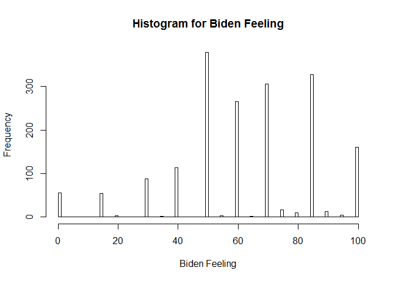
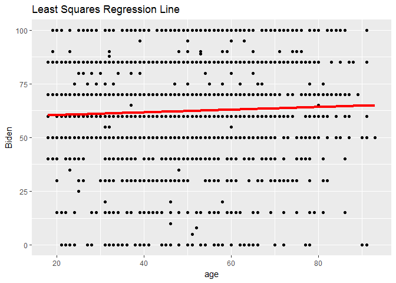
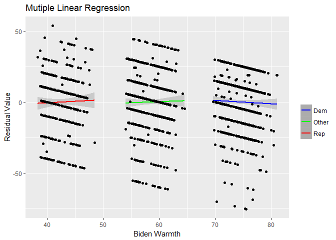

problem 1
---------

A discription of the data.

The histogram shows that in general people like Biden. The reason behind
this conclusion is that we could find most "longer bars" in the graph
fall into either equal or larger than 50.

problem 2
---------

    ## 
    ## Call:
    ## lm(formula = biden ~ age, data = bdata)
    ## 
    ## Residuals:
    ##     Min      1Q  Median      3Q     Max 
    ## -64.876 -12.318  -1.257  21.684  39.617 
    ## 
    ## Coefficients:
    ##             Estimate Std. Error t value Pr(>|t|)    
    ## (Intercept) 59.19736    1.64792   35.92   <2e-16 ***
    ## age          0.06241    0.03267    1.91   0.0563 .  
    ## ---
    ## Signif. codes:  0 '***' 0.001 '**' 0.01 '*' 0.05 '.' 0.1 ' ' 1
    ## 
    ## Residual standard error: 23.44 on 1805 degrees of freedom
    ## Multiple R-squared:  0.002018,   Adjusted R-squared:  0.001465 
    ## F-statistic: 3.649 on 1 and 1805 DF,  p-value: 0.05626

1.I would say there is a relationship between age and biden feeling,
since from above summary we find the p value is 0.05626, which indicates
the assumption of no relationship between age and feeling should be
rejected.

2.The relation is not so strong, since usually we would like the p value
to be less than 0.01 in order to consider the relationship to be strong.

3.It is positive.

4.The r squared is 0.002018, which means 0.2% of the variation is
explaained by this model. It is not good enough.

1.  

<!-- -->

    ##   age .fitted   .se.fit     ymin     ymax
    ## 1  45 62.0056 0.5577123 60.91248 63.09872

As we can see in the form above, the predicted biden is 62.0056. The 95%
condidence interval is \[60.91248,63.09872\].

1.  

problem3
--------

    ## 
    ## Call:
    ## lm(formula = biden ~ age + female + educ, data = bdata)
    ## 
    ## Residuals:
    ##     Min      1Q  Median      3Q     Max 
    ## -67.084 -14.662   0.703  18.847  45.105 
    ## 
    ## Coefficients:
    ##             Estimate Std. Error t value Pr(>|t|)    
    ## (Intercept) 68.62101    3.59600  19.083  < 2e-16 ***
    ## age          0.04188    0.03249   1.289    0.198    
    ## female       6.19607    1.09670   5.650 1.86e-08 ***
    ## educ        -0.88871    0.22469  -3.955 7.94e-05 ***
    ## ---
    ## Signif. codes:  0 '***' 0.001 '**' 0.01 '*' 0.05 '.' 0.1 ' ' 1
    ## 
    ## Residual standard error: 23.16 on 1803 degrees of freedom
    ## Multiple R-squared:  0.02723,    Adjusted R-squared:  0.02561 
    ## F-statistic: 16.82 on 3 and 1803 DF,  p-value: 8.876e-11

1.  From the form above we could say female and education have
    statistically significant relationship with response becuase those
    two have small p value. On the other hand, age does not have a
    significant relationship with response.

2.It means when holding age and education the same, females tend to have
6.19607 highter point for biden.

3.R-suqared is 0.02723. About 2.73% of the variation in biden is
explained by age, gender and education.It is better than the age-only
model.

1.  

There may be a problem with the plot because the predicted Biden warmth
tends to be higher for Democrats, the predicted Biden warmth tends to be
lower for republicans.

problem4
--------

    ## 
    ## Call:
    ## lm(formula = biden ~ age + female + educ + dem + rep, data = bdata)
    ## 
    ## Residuals:
    ##     Min      1Q  Median      3Q     Max 
    ## -75.546 -11.295   1.018  12.776  53.977 
    ## 
    ## Coefficients:
    ##              Estimate Std. Error t value Pr(>|t|)    
    ## (Intercept)  58.81126    3.12444  18.823  < 2e-16 ***
    ## age           0.04826    0.02825   1.708   0.0877 .  
    ## female        4.10323    0.94823   4.327 1.59e-05 ***
    ## educ         -0.34533    0.19478  -1.773   0.0764 .  
    ## dem          15.42426    1.06803  14.442  < 2e-16 ***
    ## rep         -15.84951    1.31136 -12.086  < 2e-16 ***
    ## ---
    ## Signif. codes:  0 '***' 0.001 '**' 0.01 '*' 0.05 '.' 0.1 ' ' 1
    ## 
    ## Residual standard error: 19.91 on 1801 degrees of freedom
    ## Multiple R-squared:  0.2815, Adjusted R-squared:  0.2795 
    ## F-statistic: 141.1 on 5 and 1801 DF,  p-value: < 2.2e-16

1.The relationship does change. The value decreases, but the sigh didn't
change.

2.The R-squared value is 0.2815, which explains 28.15% percent of the
variation of Biden warmth. It is better than the two previous models.

1.  

Yes, it fixed the previous problem.

problem 5
---------

    ## 
    ## Call:
    ## lm(formula = biden ~ female * dem, data = bfdata)
    ## 
    ## Residuals:
    ##     Min      1Q  Median      3Q     Max 
    ## -75.519 -13.070   4.223  11.930  55.618 
    ## 
    ## Coefficients:
    ##             Estimate Std. Error t value Pr(>|t|)    
    ## (Intercept)   39.382      1.455  27.060  < 2e-16 ***
    ## female         6.395      2.018   3.169  0.00157 ** 
    ## dem           33.688      1.835  18.360  < 2e-16 ***
    ## female:dem    -3.946      2.472  -1.597  0.11065    
    ## ---
    ## Signif. codes:  0 '***' 0.001 '**' 0.01 '*' 0.05 '.' 0.1 ' ' 1
    ## 
    ## Residual standard error: 19.42 on 1147 degrees of freedom
    ## Multiple R-squared:  0.3756, Adjusted R-squared:  0.374 
    ## F-statistic:   230 on 3 and 1147 DF,  p-value: < 2.2e-16

    ##   female dem  .fitted   .se.fit     ymin     ymax
    ## 1      0   0 39.38202 1.4553632 36.52951 42.23453
    ## 2      0   1 73.06954 1.1173209 70.87959 75.25949
    ## 3      1   0 45.77720 1.3976638 43.03778 48.51662
    ## 4      1   1 75.51883 0.8881114 73.77813 77.25953

Yes, both relationships differs. For party ID on gender, male democrats
have more than 30 points higher biden warmth than male republicans.
Female democrats only have more than 20 points higher than femalie
republicans. As for gender on party ID, female democarts have around 2.4
point higher point than male democarts. Female repulicans have around
6.3 point higher than male repulicans.
