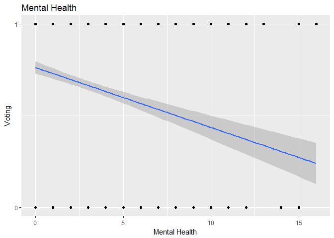
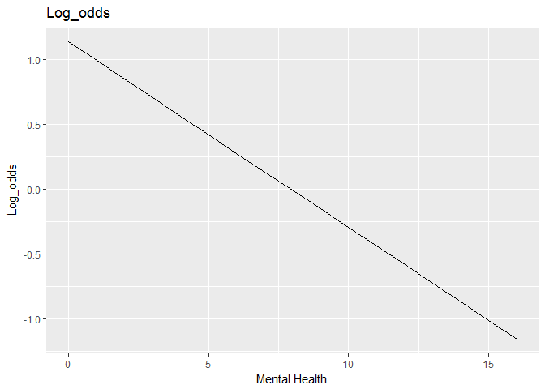
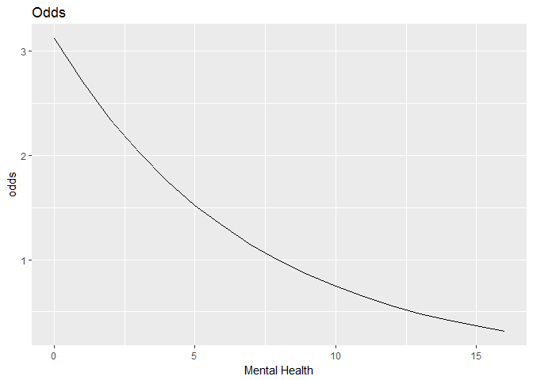
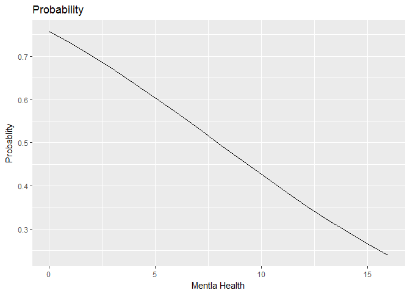

problem 1
---------

    ## Warning: Removed 219 rows containing non-finite values (stat_count).

    ## [1] 0.6295904

The unconditional probability is 0.6295904.

    ## Warning: Removed 1510 rows containing non-finite values (stat_smooth).

    ## Warning: Removed 1510 rows containing missing values (geom_point).

The graph indicates that people with poor mental health tend to vote
less. The problem with the plot is that this is a categorical varibale
but we are using value between 0 and 1, which means between two
categories. It doesn't make sense.

problem 2
---------

    ##          term   estimate  std.error statistic      p.value
    ## 1 (Intercept)  1.1392097 0.08444019 13.491321 1.759191e-41
    ## 2 mhealth_sum -0.1434752 0.01968511 -7.288516 3.133883e-13

1.The relationship is significant since the p-value is very small.

    ## Warning: Removed 1418 rows containing missing values (geom_path).

2.When we use log\_odds, we are saying whenever the mental health index
increase by 1, the log odds of voting agains not voting decrease by
0.1434752

1.  

<!-- -->

    ## Warning: Removed 1418 rows containing missing values (geom_path).

It means when the mental health index goes up 1 unit, the odds of voting
will increase 1.15%.

1.  

<!-- -->

    ## Warning: Removed 1418 rows containing missing values (geom_path).

    ## [1] -0.02917824

    ## [1] -0.03477821

The firt difference from 1 to 2 is -0.02917824. The first difference
form 5 yo 6 is -0.03477821.

1.  

<!-- -->

    ## [1] 0.677761

    ## [1] 0.01616628

    ## Area under the curve: 0.6243

The accuracy rate of the model is 0.677761. The PRE is 0.01616628 and
the AUC is 0.6243. I would say it is not that a good model.

problem 3
---------

The random component is Bernoulli distribution.

*P**r*(*Y**i* = *y**i*|*π*)=*π**i**y**i*(1 − *π**i*)1 − *y**i*
 The linear predictor:

*η**i* = *β*0 + *β*1*X**m**h**e**a**l**t**h**s**u**m*, *i* + *β*2*X**a**g**e*, *i* + *β*3*X**e**d**u**c*, *i* + *β*4*X**b**l**a**c**k*, *i* + *β*5*X**f**e**m**a**l**e*, *i* + *β*6*X**m**a**r**r**i**e**d*, *i* + *β*7*X**i**n**c*10, *i*
 The link function:

$$pi\_i = \\frac{e^{\\eta\_i}}{1 + e^{\\eta\_i}}$$

    ##          term    estimate   std.error  statistic      p.value
    ## 1 (Intercept) -4.30410314 0.508103096 -8.4709248 2.434523e-17
    ## 2 mhealth_sum -0.08910191 0.023642197 -3.7687660 1.640566e-04
    ## 3         age  0.04253412 0.004814133  8.8352601 9.986562e-19
    ## 4        educ  0.22868627 0.029531656  7.7437673 9.651356e-15
    ## 5       black  0.27298352 0.202585333  1.3474989 1.778196e-01
    ## 6      female -0.01696914 0.139971531 -0.1212328 9.035067e-01
    ## 7     married  0.29691482 0.153163585  1.9385471 5.255651e-02
    ## 8       inc10  0.06961381 0.026532274  2.6237407 8.696996e-03

1.  

<!-- -->

    ## [1] 0.7236052

    ## [1] 0.1481481

    ## Area under the curve: 0.7596

From the result above we know that the accuracy of the model is 72.36%,
and the PRE is 0.148, and the AUC is 0.7596. I would say the model works
well. I would say amoung all the factors we choose, education seems to
be the one factor with the most influence, since it has both relatively
high estimate value and small p value. Then married or not plays a row.
It has high estimation values, and acceptiable level p-value.

problem 4
---------

1.The random part:Poisson distribution
$$Pr(Y\_i = yi|\\lambda) = \\frac{\\lambda^{k}e^{-\\lambda}}{k!}$$
 The linear predictor:
*η**i* = *β*0 + *β*1*X**a**g**e*, *i* + *β*2*X**c**h**i**l**d**s*, *i* + *β*3*X**e**d**u**c*, *i* + *β*4*X**f**e**m**a**l**e*, *i* + *β*5*X**g**r**a**s**s*, *i* + *β*6*X**h**r**s**r**e**l**a**x*, *i* + *β*7*X**b**l**a**c**k*, *i* + *β*8*X**s**o**c**i**a**l**c**o**n**n**e**c**t*, *i* + *β*9*X**v**o**t**e**d*04 + *β*10*X**x**m**o**v**i**e*, *i* + *β*11*X**z**o**d**i**a**c*, *i* + *β*12*X**d**e**m*, *i* + *β*13*X**r**e**p*, *i* + *β*14*X**i**n**d*, *i*
 Link function:
*λ**i* = *l**n*(*η**i*)
 2.

    ##                 term      estimate  std.error   statistic      p.value
    ## 1        (Intercept)  1.0795865332 0.24197937  4.46148172 8.139489e-06
    ## 2                age  0.0016521563 0.00283970  0.58180660 5.606970e-01
    ## 3             childs -0.0003896381 0.02387285 -0.01632139 9.869780e-01
    ## 4               educ -0.0292174017 0.01263513 -2.31239477 2.075594e-02
    ## 5             female  0.0457000419 0.06529870  0.69986145 4.840138e-01
    ## 6              grass -0.1002725928 0.06861458 -1.46138902 1.439087e-01
    ## 7           hrsrelax  0.0468472156 0.01027902  4.55755697 5.175205e-06
    ## 8              black  0.4657923645 0.08416286  5.53441700 3.122653e-08
    ## 9     social_connect  0.0437348968 0.04079985  1.07193760 2.837481e-01
    ## 10           voted04 -0.0994787227 0.07856798 -1.26614844 2.054599e-01
    ## 11            xmovie  0.0708407795 0.07734198  0.91594210 3.596973e-01
    ## 12       zodiacAries -0.1011363820 0.15082478 -0.67055546 5.025038e-01
    ## 13      zodiacCancer  0.0267776138 0.14515566  0.18447516 8.536407e-01
    ## 14   zodiacCapricorn -0.2155760173 0.16570344 -1.30097493 1.932670e-01
    ## 15      zodiacGemini  0.0285894938 0.14811434  0.19302313 8.469409e-01
    ## 16         zodiacLeo -0.1515676052 0.15532153 -0.97583129 3.291481e-01
    ## 17       zodiacLibra -0.0392537020 0.13791025 -0.28463223 7.759259e-01
    ## 18         zodiacNaN -0.2985239737 0.21261263 -1.40407452 1.602967e-01
    ## 19      zodiacPisces -0.1446730925 0.16498953 -0.87686227 3.805615e-01
    ## 20 zodiacSagittarius -0.2177845756 0.15776382 -1.38044690 1.674491e-01
    ## 21     zodiacScorpio  0.0225910524 0.15384596  0.14684202 8.832567e-01
    ## 22      zodiacTaurus -0.1273890642 0.16447992 -0.77449616 4.386374e-01
    ## 23       zodiacVirgo -0.1240441866 0.15644951 -0.79287040 4.278533e-01
    ## 24               dem  0.0103275813 0.09170546  0.11261686 9.103343e-01
    ## 25               rep  0.0148615484 0.09276621  0.16020433 8.727201e-01

    ## [1] 0.2267574

    ## Area under the curve: 0.5896

3.From the data above we know that black or not play a major role here
since its estimation value is large and p value is small. The second
second important factor is the hrsrelax. Overall, the accuracy of the
model is 22.67%, the AUC is 0.5896. I would evaluate this model as not
so good.
