problem 1
---------

1.  

<!-- -->

    ## [1] 395.2702

The mean squared error is 395.27.

1.  

<!-- -->

    ## [1] 399.8303

The new MSE is 411.54, which is larger than the previous MSE. This is
reasonable since now the training set is only a small portion of the
data, it will not suit the other part as good as the presvious approach.

1.  

<!-- -->

    ## [1] 401.6489

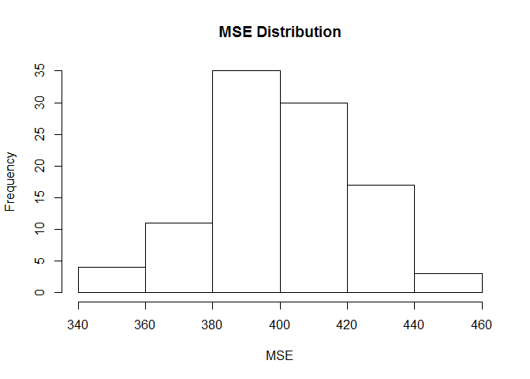

The new MSE we get is 401.51, which is better than the previous
approach. The histogram above shows the distribution of the MSE from 100
trails.

1.  

<!-- -->

    ## [1] 397.9555

The MSE is 397.96, which is lower than using previous approach.

1.  

<!-- -->

    ## [1] 398.0729

The MSE value is 397.69, which is slightly lower than the previous one.
However, it only computes 10 times, which is much more effienct than the
previous approach.

1.  

<!-- -->

    ## [1] 397.9661

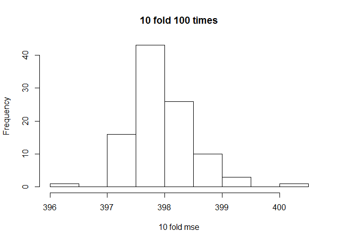

The MSE value is 398.01, which is still very close to the previous
approach. However, this time the ditribution has less deviation, which
means this approach is more stable.

1.  

<!-- -->

    ## # A tibble: 6 × 3
    ##          term     est.boot    se.boot
    ##         <chr>        <dbl>      <dbl>
    ## 1 (Intercept)  58.91337251 2.97814255
    ## 2         age   0.04770968 0.02883481
    ## 3         dem  15.43020645 1.10724812
    ## 4        educ  -0.34950530 0.19214401
    ## 5      female   4.08800549 0.94879605
    ## 6         rep -15.87431840 1.44433208

    ## 
    ## Call:
    ## lm(formula = biden ~ ., data = bdata)
    ## 
    ## Residuals:
    ##     Min      1Q  Median      3Q     Max 
    ## -75.546 -11.295   1.018  12.776  53.977 
    ## 
    ## Coefficients:
    ##              Estimate Std. Error t value Pr(>|t|)    
    ## (Intercept)  58.81126    3.12444  18.823  < 2e-16 ***
    ## female        4.10323    0.94823   4.327 1.59e-05 ***
    ## age           0.04826    0.02825   1.708   0.0877 .  
    ## educ         -0.34533    0.19478  -1.773   0.0764 .  
    ## dem          15.42426    1.06803  14.442  < 2e-16 ***
    ## rep         -15.84951    1.31136 -12.086  < 2e-16 ***
    ## ---
    ## Signif. codes:  0 '***' 0.001 '**' 0.01 '*' 0.05 '.' 0.1 ' ' 1
    ## 
    ## Residual standard error: 19.91 on 1801 degrees of freedom
    ## Multiple R-squared:  0.2815, Adjusted R-squared:  0.2795 
    ## F-statistic: 141.1 on 5 and 1801 DF,  p-value: < 2.2e-16

The estimates we get from bootstrap are close to estimates we get in
step 1. For the standard deviations, some are slightly higher and some
are slightly lower, but all in acceptable level. This is due to the fact
that bootstrap treats the sample as the population, so there is no
pre-assumption for the distribution in the population.

problem 2
---------

First, we explore relation between outstate and expend.

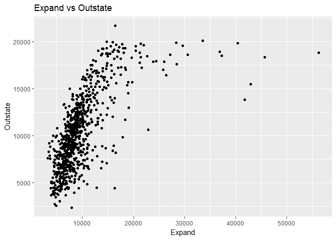

It seems we should use log exand to estimate the outstate.
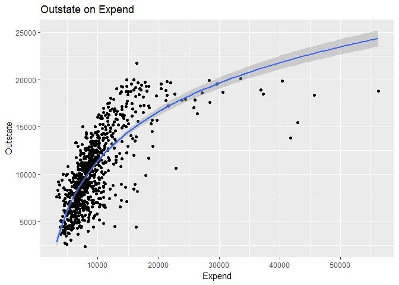

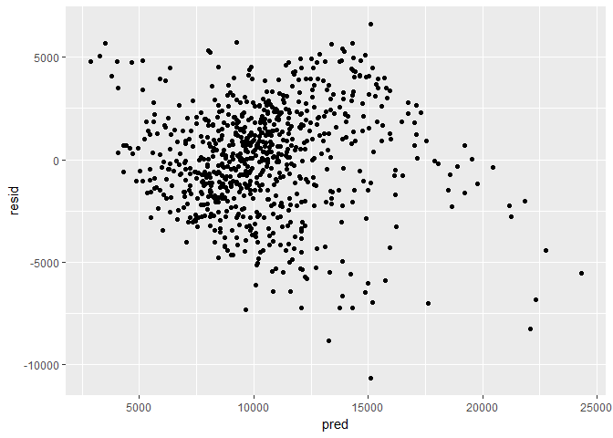

The residuals distributes around 0 evenly. So let's compare MSE value
for lienar and log model to see if truely log is better.

    ## [1] 6902170

compare with linear model.

    ## [1] 8847579

As we can see, the MSE value for log model is lower than linear model,
which proves our pick of log model is better.

Second, let's exam Outstate on Room.Board.
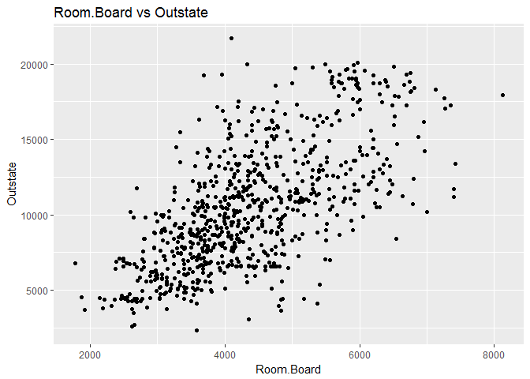

It seems like linear. Let's check the residuals.
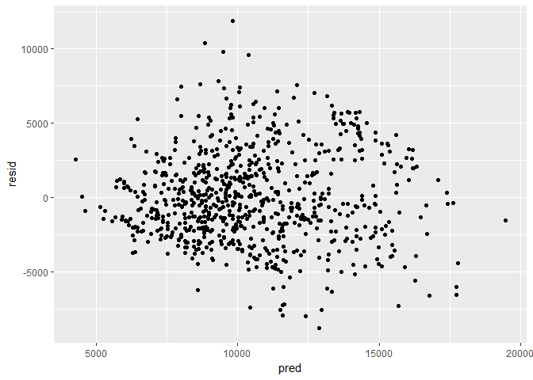 The
residuals distributes around 0 evenly. Then we use 10-fold to better
investigate the model.
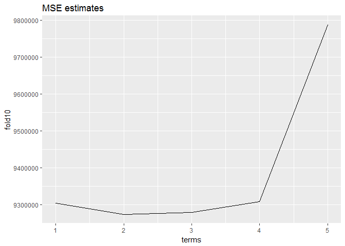

The result shows that 1,2,3 order have relatively same result and are
all better than 4,5 order. So I will stick with linear relationship.

Last, since Americans are rich and generous, let's exam the donation.
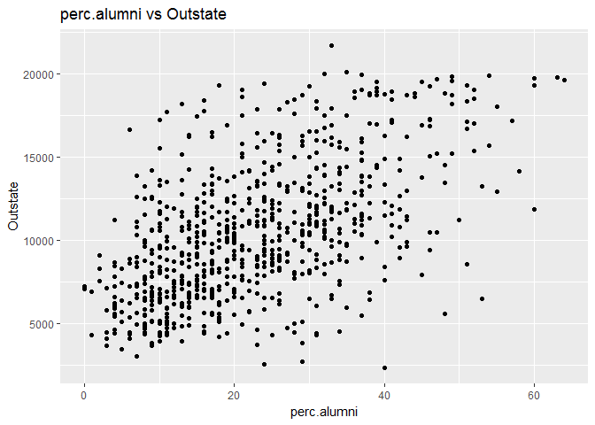

The relationship appears to be linear, let's check the residuals.

The residuals distributes around 0 evenly. Then we use 10-fold to better
investigate the model.
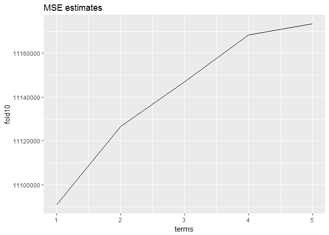

As we can see, linear relation is no doubt the best choice we have.

problem 3
---------

1.  2.  

<!-- -->

    ## 
    ## Call:
    ## lm(formula = Outstate ~ Private + Room.Board + PhD + perc.alumni + 
    ##     Expend + Grad.Rate, data = split_d$train)
    ## 
    ## Residuals:
    ##     Min      1Q  Median      3Q     Max 
    ## -6056.2 -1298.9   -23.7  1266.4  5961.5 
    ## 
    ## Coefficients:
    ##               Estimate Std. Error t value Pr(>|t|)    
    ## (Intercept) -3.754e+03  5.022e+02  -7.475 3.17e-13 ***
    ## PrivateYes   2.858e+03  2.458e+02  11.627  < 2e-16 ***
    ## Room.Board   9.427e-01  9.588e-02   9.832  < 2e-16 ***
    ## PhD          4.444e+01  6.738e+00   6.594 1.02e-10 ***
    ## perc.alumni  4.336e+01  8.671e+00   5.000 7.76e-07 ***
    ## Expend       1.934e-01  1.960e-02   9.869  < 2e-16 ***
    ## Grad.Rate    2.900e+01  6.271e+00   4.625 4.71e-06 ***
    ## ---
    ## Signif. codes:  0 '***' 0.001 '**' 0.01 '*' 0.05 '.' 0.1 ' ' 1
    ## 
    ## Residual standard error: 1983 on 537 degrees of freedom
    ## Multiple R-squared:  0.7536, Adjusted R-squared:  0.7508 
    ## F-statistic: 273.7 on 6 and 537 DF,  p-value: < 2.2e-16

As we can see, the R-square is 0.7626, which means the model could
explain 76.26% of the change in the tranning set. It is accecptable. All
six variables have significant influence for the response variable. In
details, a private university will raise the tuition 2662 dollars. 1
unit of increase in room and board costs, percent of faculty with PhD's,
percent of alumni who donate, instrucational expenditure per student and
graduation rate will result $1.06,$33.66,$48.87,$0.1931,$29.51 in the
tuition accodingly.

1.  

<!-- -->

    ## 
    ## Call: gam(formula = Outstate ~ Private + Room.Board + lo(PhD) + perc.alumni + 
    ##     log(Expend) + Grad.Rate, data = split_d$train)
    ## Deviance Residuals:
    ##     Min      1Q  Median      3Q     Max 
    ## -6796.3 -1206.5   -19.1  1230.5  5147.7 
    ## 
    ## (Dispersion Parameter for gaussian family taken to be 3439680)
    ## 
    ##     Null Deviance: 8565873893 on 543 degrees of freedom
    ## Residual Deviance: 1837575135 on 534.2286 degrees of freedom
    ## AIC: 9743.171 
    ## 
    ## Number of Local Scoring Iterations: 2 
    ## 
    ## Anova for Parametric Effects
    ##                 Df     Sum Sq    Mean Sq F value    Pr(>F)    
    ## Private       1.00 2527888760 2527888760 734.920 < 2.2e-16 ***
    ## Room.Board    1.00 2098926210 2098926210 610.210 < 2.2e-16 ***
    ## lo(PhD)       1.00  908495500  908495500 264.122 < 2.2e-16 ***
    ## perc.alumni   1.00  311949131  311949131  90.691 < 2.2e-16 ***
    ## log(Expend)   1.00  507652983  507652983 147.587 < 2.2e-16 ***
    ## Grad.Rate     1.00   93132457   93132457  27.076 2.793e-07 ***
    ## Residuals   534.23 1837575135    3439680                      
    ## ---
    ## Signif. codes:  0 '***' 0.001 '**' 0.01 '*' 0.05 '.' 0.1 ' ' 1
    ## 
    ## Anova for Nonparametric Effects
    ##             Npar Df Npar F    Pr(F)   
    ## (Intercept)                           
    ## Private                               
    ## Room.Board                            
    ## lo(PhD)         2.8 4.5364 0.004801 **
    ## perc.alumni                           
    ## log(Expend)                           
    ## Grad.Rate                             
    ## ---
    ## Signif. codes:  0 '***' 0.001 '**' 0.01 '*' 0.05 '.' 0.1 ' ' 1

As we can see, all parameters tend to have significant statistical
relationship.
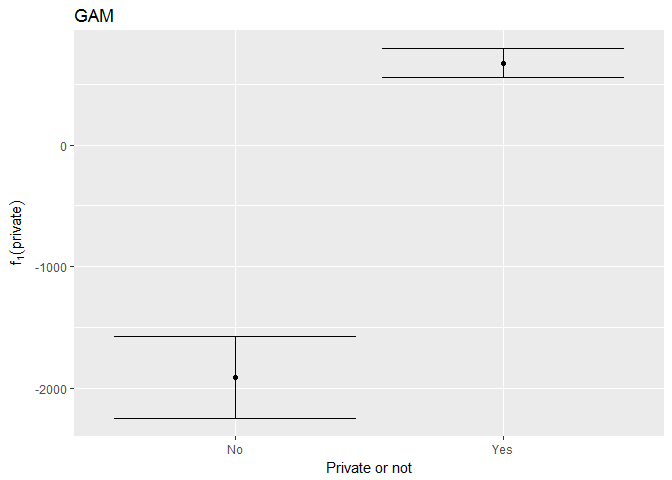

As we can see, being public has a signifcant negetive influence on the
tuition, and being private has less but postive influence on tuition.

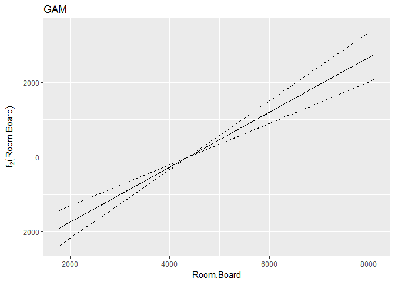

As we can see, when room expenditure increases, the tuition tends to
increase.However, the confidence interval tends to expand at the head
and tail.

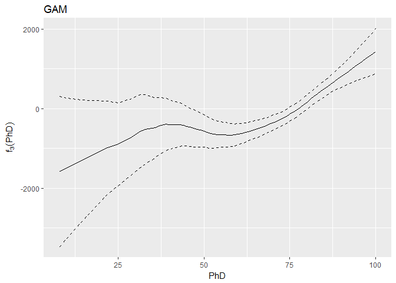

As we can see, the tuition tends to increase when PhD percentage
increases. However, the confidence intercal becomes really wide when PhD
percentage is lower than 25%.

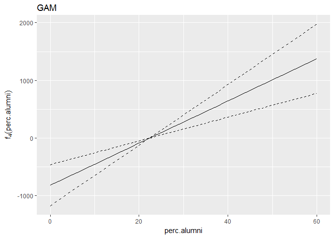

As we can see, the tuition tends to increase when percentage of alumni
donation increases. However, the confidence interval tends to be wide
when the percentage is larger than 50%.

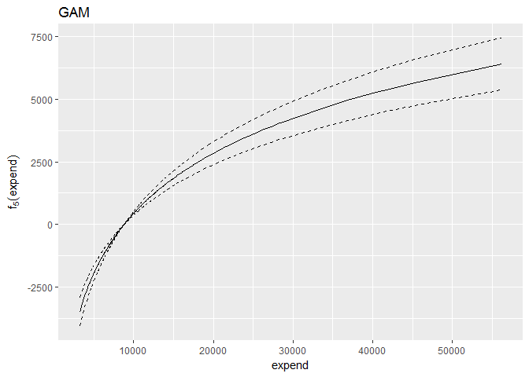

As we can the tuition tends to increase when expend increase. And the
confidence interval expands a little with the increase of expend.

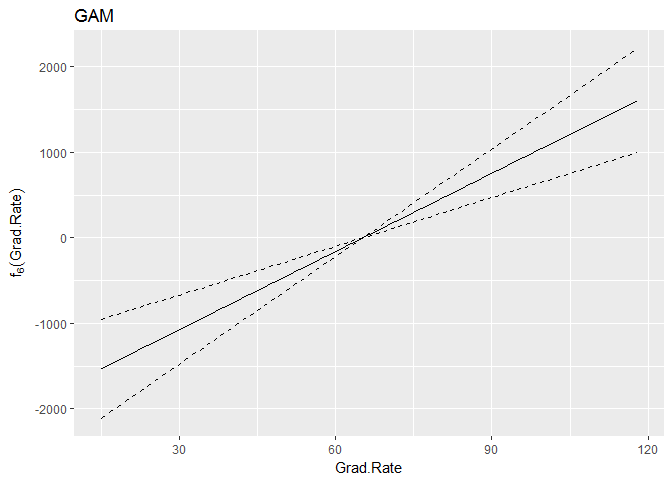

As we can see, the tuition tends to increase when graduation rate
increases. The confidence interval tends to expand at the head and the
tail.

1.  

<!-- -->

    ## [1] 4659983

    ## [1] 4481653

The MSE value for ols is 5068316, the MSE value for gam is 4516359.
Since the MSE value of gam is much smaller than ols, we could say gam
estimates the model better.

5.From the analysis above, we could conclude that the expend has a
nonlinear relationship with tuition.
