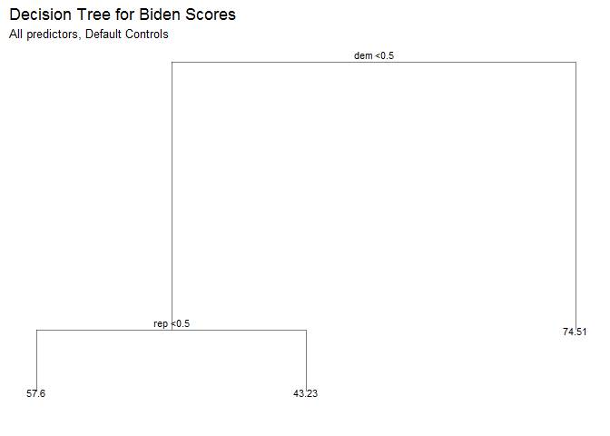
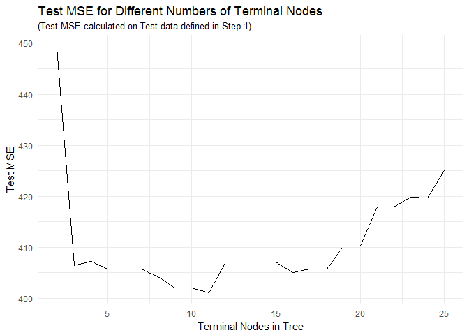
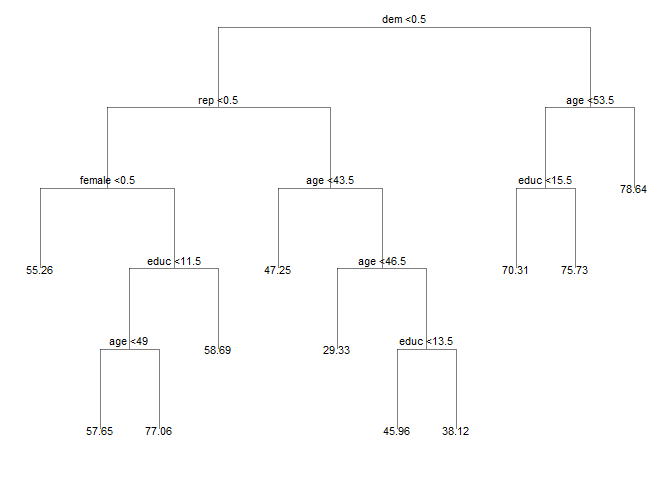
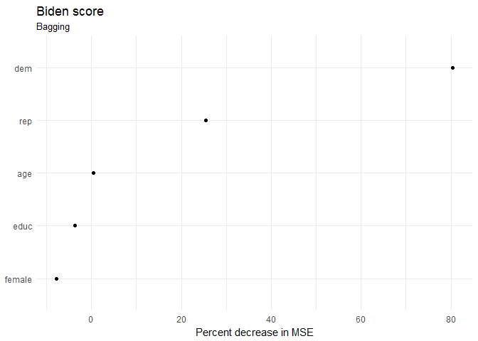
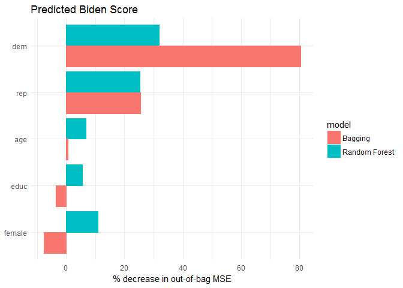

problem 1
---------

1.  

<!-- -->

    bdata_split=resample_partition(bdata,c(test=0.3,train=0.7))

1.  

<!-- -->

    btree=tree(biden~.,data=bdata_split$train)
    tree_data=dendro_data(btree)
    ggplot(segment(tree_data))+geom_segment(aes(x=x,y=y,xend=xend,yend=yend),alpha=0.5)+geom_text(data = label(tree_data),aes(x = x, y = y, label = label_full), vjust = -0.5, size = 3)+geom_text(data = leaf_label(tree_data),aes(x = x, y = y, label = label), vjust = 0.5, size = 3)+theme_dendro()+labs(title = 'Decision Tree for Biden Scores',subtitle = 'All predictors, Default Controls')

    mse=function(model,data){
      x=modelr:::residuals(model,data)
      mean(x^2,na.rm=TRUE)
    }
    mse_result=mse(btree,bdata_split$test)
    leaf_vals=leaf_label(tree_data)$yval
    mse_result

    ## [1] 406

    leaf_vals

    ## [1] 57.6 43.2 74.5

Since we are using default tree controls, we use only 'dem' and 'rep' as
predictors. If dem&gt;0.5, which means the person is a democrat, the
model yields a prediction of 74.5. If dem&lt;0.5 and rep&lt;0.5, then
the model predicts biden score as 57.6. If dem&lt;0.5 and rep&gt;0.5,
the model gives 43.23 for the score. The mse value is 406.

1.  

<!-- -->

    btree_2 = tree(biden ~ ., data = bdata_split$train,control = tree.control(nobs = nrow(bdata_split$train),mindev = 0))
    mse_result2=mse(btree_2,bdata_split$test)
    mse_result2

    ## [1] 481

    num_nodes=2:25
    pruned_trees = map(num_nodes, prune.tree, tree = btree_2, k = NULL)
    test_mses = map_dbl(pruned_trees, mse, data = bdata_split$test)
    tree.opt = pruned_trees[[which.min(test_mses)]]
    opt_test_mse = mse(tree.opt, bdata_split$test)
    tibble(num_nodes = num_nodes, test_mse = test_mses) %>%
      ggplot(aes(x = num_nodes, y = test_mse)) +
      geom_line() + 
      labs(title = 'Test MSE for Different Numbers of Terminal Nodes',
           subtitle = '(Test MSE calculated on Test data defined in Step 1)',
           x = 'Terminal Nodes in Tree',
           y = 'Test MSE')

we could say 11 terminals is the optimal complexity for the tree.

    mod = prune.tree(btree_2, best = 11)
    tree2_data <- dendro_data(mod, type = 'uniform')
    ggplot(segment(tree2_data)) +
      geom_segment(aes(x = x, y = y, xend = xend, yend = yend), alpha = 0.5) +
      geom_text(data = label(tree2_data),aes(x = x, y = y, label = label_full), vjust = -0.5, size = 3) +
      geom_text(data = leaf_label(tree2_data), 
                aes(x = x, y = y, label = label), vjust = 0.5, size = 3) +
      theme_dendro()

 An example
interpretion for the tree is when dem&lt;0.5,rep&lt;0.5,female&lt;0.5,
the model would estimate a biden score of 55.26. The other paths follow
the same pattern.

1.  

<!-- -->

    set.seed(1234)
    biden_bag = randomForest(biden ~ ., data = bdata_split$train, mtry = 5, importance=TRUE)
    mse_bag = mse(biden_bag, bdata_split$test)
    mse_bag

    ## [1] 484

As we can see, the mse value is 484 and it is increased, which is much
higher than the previous method.

    data_frame(var = rownames(importance(biden_bag)),
               MeanDecreaseRSS = importance(biden_bag)[,1]) %>%
      mutate(var = fct_reorder(var, MeanDecreaseRSS, fun = median)) %>%
      ggplot(aes(var, MeanDecreaseRSS)) +
      geom_point() +
      coord_flip() +
      labs(title = "Biden score",
           subtitle = "Bagging",
           x = NULL,
           y = "Percent decrease in MSE")

From the graph we could tell age,dem and educ are the most power
predictors in the model.

1.  

<!-- -->

    biden_rf = randomForest(biden ~ .,data = bdata_split$train,importance = TRUE)
    data_frame(var = rownames(importance(biden_rf)),
               `Random Forest` = importance(biden_rf)[,1]) %>%
      left_join(data_frame(var = rownames(importance(biden_bag)),
               Bagging = importance(biden_bag)[,1])) %>%
      mutate(var = fct_reorder(var, Bagging, fun = median)) %>%
      gather(model, rss, -var) %>%
      ggplot(aes(var, rss, color=model)) +
      geom_col(aes(fill=model), position='dodge') +
      coord_flip() +
      labs(title = "Predicted Biden Score",
           x = NULL,
           y = "% decrease in out-of-bag MSE")

    mse_rf = mse(biden_rf, bdata_split$test)
    mse_rf

    ## [1] 410

The mse value is 408 and it is much smaller when we use eandom forest
apporach. The model suggests that dem and rep are the two most important
predictors.The other predictors are less important. From the graph we
could also say that giving other values to dem and rep will cause an
average of 28% and 26% increase on the MSE value.

problem 2
---------

1.  

<!-- -->

    mdata_split=resample_partition(mdata,c(test=0.3,train=0.7))

First we use a decision tree with default setting.

    tree_mdata=tree(vote96~.,data=mdata_split$train)
