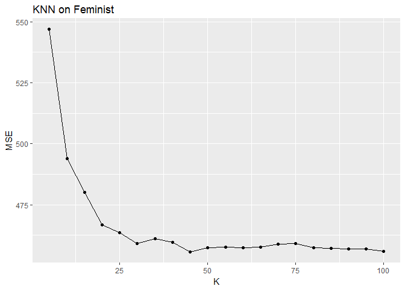
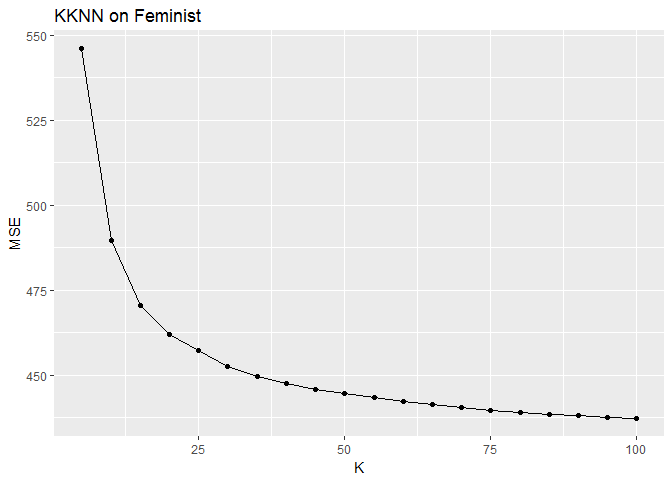
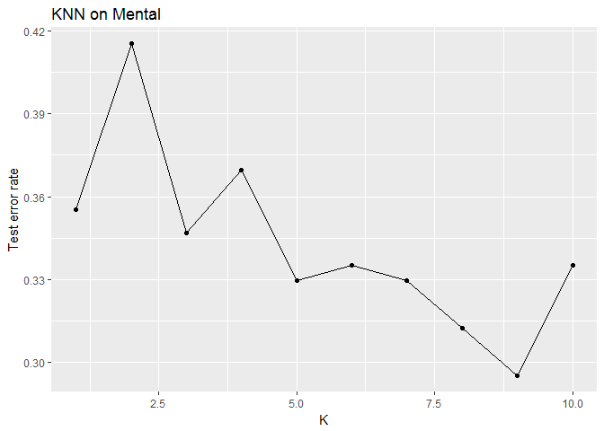
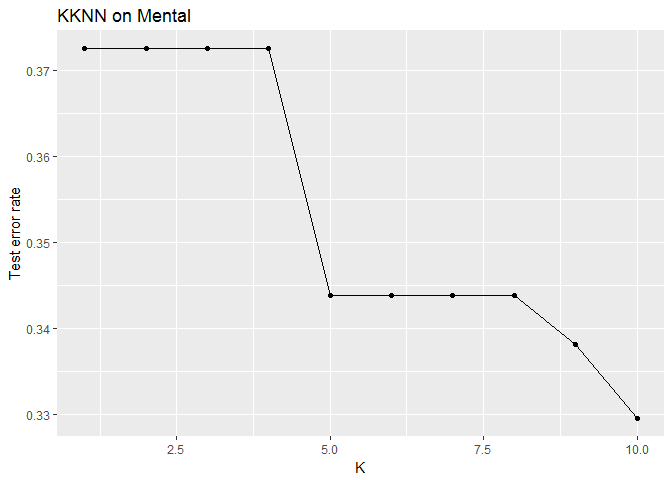
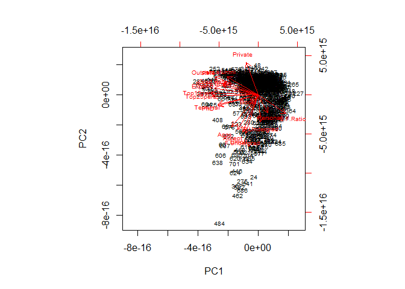
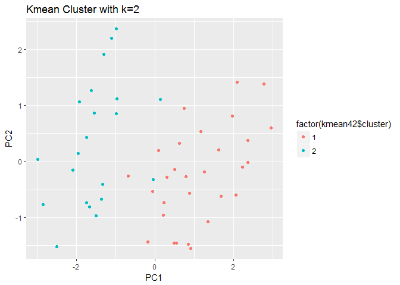
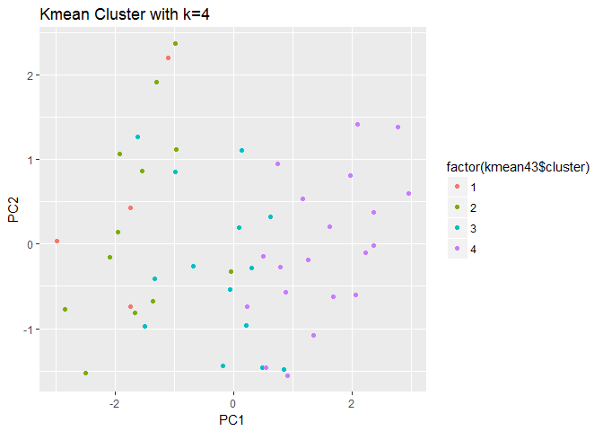
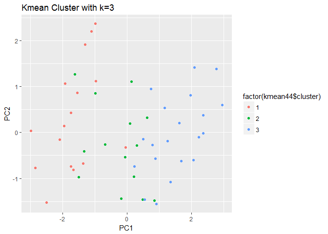
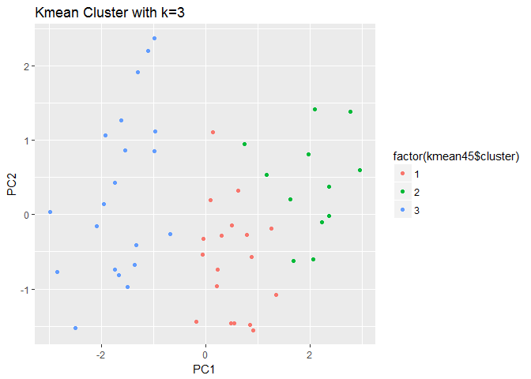

    fdata=read_csv("feminist.csv")
    mdata=na.omit(read_csv("mental_health.csv"))
    cdata=read_csv("College.csv")%>%mutate(Private=ifelse(Private=='Yes',1,0))
    udata=read_csv("USArrests.csv")

problem 1
---------

1.  

<!-- -->

    set.seed(1234)
    fdata_split=resample_partition(fdata,c(test=0.3,train=0.7))
    ftrain=fdata[fdata_split$train$idx,]
    ftest=fdata[fdata_split$test$idx,]

1.  

<!-- -->

    knn_df=data_frame(kv=seq(5,100,by=5),knn_models=map(kv,~knn.reg(select(ftrain, -feminist), y=ftrain$feminist, test=select(ftest, -feminist),
    k=.)),mse=map_dbl(knn_models, ~ mean((ftest$feminist - .$pred) ^ 2)))
    ggplot(knn_df,aes(kv,mse))+geom_line()+geom_point()+labs(title="KNN on Feminist",x="K",y="MSE")

    min_k=knn_df$kv[which.min(knn_df$mse)]
    min_k

    ## [1] 45

    best_knn=knn_df$knn_models[[which.min(knn_df$mse)]]

So the k=45 model produces the lowest MSE.

1.  

<!-- -->

    kknn_df=data_frame(kv=seq(5,100,by=5),kknn_models=map(kv,~kknn(feminist~.,train=ftrain,test=ftest,k=.)),mse=map_dbl(kknn_models, ~ mean((ftest$feminist - .$fitted.values) ^ 2)))
    ggplot(kknn_df,aes(kv,mse))+geom_line()+geom_point()+labs(title="KKNN on Feminist",x="K",y="MSE")

    min_kk=kknn_df$kv[which.min(kknn_df$mse)]
    min_kk

    ## [1] 100

    best_kknn=kknn_df$kknn_models[[which.min(kknn_df$mse)]]

So the k=100 model produces the lowest MSE.

1.  

<!-- -->

    mse_cal=function(model,data){
      x=modelr:::residuals(model,data)
      mean(x^2,na.rm=TRUE)
    }
    lm_m=lm(feminist~.,data=fdata_split$train)
    mse_lm=mse_cal(lm_m,fdata_split$test)
    mse_lm

    ## [1] 435

    tree_m=tree(feminist~.,data=fdata_split$train)
    mse_tree=mse_cal(tree_m,fdata_split$test)
    mse_tree

    ## [1] 436

    boost_m=gbm(feminist~.,data=fdata_split$train,n.trees=500)

    ## Distribution not specified, assuming gaussian ...

    yhat=predict(boost_m,newdata=fdata_split$test,n.trees=500)
    mse_boot=mean((yhat-ftest$feminist)^2)
    mse_boot

    ## [1] 449

    random_m=randomForest(feminist~.,data=fdata_split$train,n.trees=500)
    mse_ran=mse_cal(random_m,fdata_split$test)
    mse_ran

    ## [1] 438

As we can see, the MSE values are very close. If we must choose, the
linear reqgression has the smallest MSE value, thus it performs the
best. I think the predictors happen to naturelly form a linear relation.
Other methods may be influenced by the random errors in the data thus
has a higher MSE value. However, since the MSE values are very closed,
other methods also estimated well.

problem 2
---------

1.  

<!-- -->

    mdata_split=resample_partition(mdata,c(test=0.3,train=0.7))
    mtrain=mdata[mdata_split$train$idx,]
    mtest=mdata[mdata_split$test$idx,]

1.  

<!-- -->

    knn_df=data_frame(kv=1:10,knn_models=map(kv,~knn(train=select(mtrain, -vote96), cl=mtrain$vote96, test=select(mtest,-vote96),
    k=.)),test_err=map_dbl(knn_models, ~ mean(mtest$vote96!=.)))
    ggplot(knn_df,aes(kv,test_err))+geom_line()+geom_point()+labs(title="KNN on Mental",x="K",y="Test error rate")

    min_test_err=knn_df$kv[which.min(knn_df$test_err)]
    min_test_err

    ## [1] 9

    best_knn=knn_df$knn_models[[which.min(knn_df$test_err)]]

The k=9 model calculates the lowest test MSE.

1.  

<!-- -->

    kknn_df=data_frame(kv=1:10,kknn_models=map(kv,~kknn(vote96~.,train=mutate(mtrain,vote96=factor(vote96)), test=mutate(mtest,vote96=factor(vote96)),
    k=.)),test_err=map_dbl(kknn_models, ~ mean(mtest$vote96!=.$fitted.values)))
    ggplot(kknn_df,aes(kv,test_err))+geom_line()+geom_point()+labs(title="KKNN on Mental",x="K",y="Test error rate")

    min_test_err=kknn_df$kv[which.min(kknn_df$test_err)]
    min_test_err

    ## [1] 10

    best_knn=kknn_df$kknn_models[[which.min(kknn_df$test_err)]]

The k=10 model produces the lowest test MSE.

1.  

<!-- -->

    mdataf=read_csv("mental_health.csv")%>%drop_na()%>%mutate_each(funs(as.factor(.)), vote96, black, female, married)
    mdataf_split=resample_partition(mdataf,c(test=0.3,train=0.7))
    mtrain=as_tibble(mdataf_split$train)
    mtest=as_tibble(mdataf_split$test)

    err.rate.tree=function(model,data){
      data=as_tibble(data)
      response=as.character(model$terms[[2]])
      pred=predict(model,mewdata=data,type="class")
      actual=data[[response]]
      return(mean(pred!=actual,na.rm=TRUE))
    }
    l_model=glm(vote96~.,data=mtrain,family = binomial)
    logg=mtest%>%add_predictions(l_model)%>%mutate(prob=exp(pred)/(1+exp(pred)))%>%mutate(pred_bi=as.numeric(prob>0.5))
    err_log=mean(mtest$vote96!=logg$pred_bi)
    err_log

    ## [1] 0.304

    mtrain_tree=mtrain%>%mutate(vote96 = factor(vote96, levels = 0:1, label =c("no_vote", "vote")))
    mtest_tree=mtest%>%mutate(vote96 = factor(vote96, levels = 0:1, label =c("no_vote", "vote")))
    tree_m=tree(vote96~.,data=as_tibble(mtrain_tree))
    err_tree=err.rate.tree(tree_m,as_tibble(mtest_tree))
    err_tree

    ## [1] 0.391

    boot_m=gbm(vote96~.,data=mtrain,n.trees=500)

    ## Distribution not specified, assuming bernoulli ...

    yhat=predict(boot_m,newdata=mtest,n.trees=500)
    yhat_bi=as.numeric(yhat>0.5)
    err_boost=mean(yhat!=mtest$vote96)
    err_boost

    ## [1] NA

    random_m=randomForest(vote96~.,data=mtrain,ntress=500)
    err_random=err.rate.tree(random_m,mtest)
    err_random

    ## [1] 0.441

    sv_m=svm(vote96~.,data=mtrain,kernel="linear",cost=5)
    yhat=predict(sv_m,newdata=mtest)
    err_svm=mean(yhat!=mtest$vote96)
    err_svm

    ## [1] 0.37

As we can see, the wknn method works the best. Since the wknn weights
the nearest neighbors in the training sample to make the prediction, it
may be the case that the neighbors for the dependent varibale happen to
have strong preidictive power.

problem 3
---------

    pca_m=prcomp(cdata,scale=TRUE)
    pca_m$rotation

    ##                 PC1     PC2      PC3     PC4     PC5      PC6       PC7
    ## Private     -0.0890  0.3459 -0.15139 -0.2311  0.0443 -0.03145  0.178345
    ## Apps        -0.1996 -0.3436 -0.00482 -0.3050 -0.0230 -0.00862 -0.061047
    ## Accept      -0.1538 -0.3726  0.02535 -0.3175  0.0314  0.01307 -0.015474
    ## Enroll      -0.1178 -0.3997  0.02758 -0.2048 -0.0657 -0.04306 -0.008237
    ## Top10perc   -0.3603  0.0162 -0.00468  0.1075 -0.3882 -0.05992 -0.144406
    ## Top25perc   -0.3448 -0.0177  0.05895  0.1463 -0.4098  0.02061 -0.079889
    ## F.Undergrad -0.0941 -0.4107  0.01681 -0.1430 -0.0466 -0.04574  0.000282
    ## P.Undergrad  0.0175 -0.2931 -0.14937  0.0978  0.3280 -0.19678  0.162965
    ## Outstate    -0.3277  0.1915 -0.06636 -0.1288  0.2033 -0.02030  0.094948
    ## Room.Board  -0.2665  0.0940 -0.18211 -0.1824  0.5263  0.18303  0.145142
    ## Books       -0.0572 -0.0573 -0.66231  0.0893 -0.1586  0.64831 -0.141371
    ## Personal     0.0719 -0.1928 -0.46956  0.2906 -0.1880 -0.34706  0.609167
    ## PhD         -0.3033 -0.1162  0.20849  0.4646  0.2059  0.07189  0.031347
    ## Terminal    -0.3039 -0.1042  0.14672  0.4604  0.2656  0.13832  0.003847
    ## S.F.Ratio    0.2103 -0.2044  0.29225  0.0749 -0.0515  0.46937  0.275797
    ## perc.alumni -0.2367  0.1941  0.15944 -0.0100 -0.2151 -0.05166  0.286361
    ## Expend      -0.3330  0.0703 -0.21732 -0.0072  0.0571 -0.28447 -0.280168
    ## Grad.Rate   -0.2731  0.1178  0.17262 -0.2682 -0.1412  0.22185  0.501653
    ##                  PC8     PC9    PC10    PC11     PC12    PC13      PC14
    ## Private     -0.03231  0.0850 -0.2596  0.6798 -0.24569  0.4006 -1.01e-02
    ## Apps         0.09918 -0.0841 -0.0581 -0.0104 -0.04181  0.0374  5.95e-01
    ## Accept       0.05423 -0.1653 -0.0895  0.1426 -0.00455 -0.0736  2.93e-01
    ## Enroll      -0.06326 -0.1168 -0.0741  0.1058  0.03426  0.0591 -4.46e-01
    ## Top10perc    0.09714  0.3557 -0.0594 -0.0221  0.01518  0.0444  9.19e-05
    ## Top25perc    0.07806  0.4224 -0.0436  0.1382  0.23123 -0.0998  2.38e-02
    ## F.Undergrad -0.08393 -0.0498 -0.0504  0.0784  0.06250  0.0697 -5.25e-01
    ## P.Undergrad -0.56989  0.5432  0.2295  0.0451 -0.12114 -0.0228  1.26e-01
    ## Outstate     0.00412 -0.0114 -0.1973  0.0643 -0.25544 -0.8037 -1.28e-01
    ## Room.Board   0.24867  0.2442 -0.1899 -0.2808  0.48583  0.2014 -7.23e-02
    ## Books       -0.22503 -0.1333  0.0758  0.0204 -0.03719 -0.0249  1.18e-02
    ## Personal     0.30143 -0.1216 -0.1169 -0.0468  0.02038 -0.0379  4.01e-02
    ## PhD          0.07055 -0.1629  0.0560  0.1705 -0.09081  0.1172  1.25e-01
    ## Terminal     0.00463 -0.2332  0.0212  0.1784  0.01067  0.0544 -5.91e-02
    ## S.F.Ratio    0.09450  0.2845 -0.4477 -0.2162 -0.42475  0.0584 -1.92e-02
    ## perc.alumni -0.64039 -0.2905 -0.3463 -0.2600  0.21823  0.0916  1.03e-01
    ## Expend       0.03757 -0.0562 -0.0330 -0.4550 -0.54829  0.2993 -9.86e-02
    ## Grad.Rate    0.07773 -0.0226  0.6600 -0.1031 -0.15593  0.0729 -7.00e-02
    ##                PC15     PC16      PC17      PC18
    ## Private     -0.0232 -0.00537 -0.044796  0.007795
    ## Apps        -0.0807  0.13375 -0.458603  0.363283
    ## Accept      -0.0333 -0.14635  0.512188 -0.547462
    ## Enroll       0.0815  0.02848  0.403907  0.607174
    ## Top10perc    0.1062  0.69742  0.148018 -0.146308
    ## Top25perc   -0.1487 -0.61690 -0.050194  0.080606
    ## F.Undergrad  0.0534  0.00984 -0.569725 -0.408938
    ## P.Undergrad -0.0196  0.02068  0.050648  0.008963
    ## Outstate     0.0572  0.04195 -0.078622  0.048023
    ## Room.Board   0.0560  0.00351  0.028890  0.000368
    ## Books        0.0677 -0.00927 -0.001728  0.000603
    ## Personal    -0.0266 -0.00304  0.012911 -0.001211
    ## PhD          0.6864 -0.11269 -0.035842  0.015128
    ## Terminal    -0.6746  0.15786  0.020277  0.007143
    ## S.F.Ratio   -0.0449 -0.02172  0.014827 -0.001297
    ## perc.alumni  0.0268 -0.00815 -0.000483 -0.019705
    ## Expend      -0.0809 -0.22876  0.038317 -0.034863
    ## Grad.Rate   -0.0372 -0.00327  0.006996 -0.013507

    biplot(pca_m,scale=9,cex=0.6)

As we can see, for the first principal component,
PhD,Terminal,Top10perc,Top25perc,Outstate,Expend and Grad.Rate have the
most influence.

For the second principal, Private, Apps, Accept, Enroll, F.Undergrad,
and P.Undergrad have the most influence.

problem 4
---------

1.  

<!-- -->

    pca_m=prcomp(x=select(udata,-State),scale=TRUE)
    biplot(pca_m,scale=0,cex=0.6)

 2.

    kmean42=kmeans(select(udata,-State),centers=2,nstart = 1)
    ggplot(mapping=aes(x=pca_m$x[,1],y=pca_m$x[,2],label=udata$State,color=factor(kmean42$cluster)))+geom_point()+labs(title="Kmean Cluster with k=2",x="PC1",y="PC2")

1.  

<!-- -->

    kmean43=kmeans(select(udata,-State),centers=4,nstart = 1)
    ggplot(mapping=aes(x=pca_m$x[,1],y=pca_m$x[,2],label=udata$State,color=factor(kmean43$cluster)))+geom_point()+labs(title="Kmean Cluster with k=4",x="PC1",y="PC2")

1.  

<!-- -->

    kmean44=kmeans(select(udata,-State),centers=3,nstart = 1)
    ggplot(mapping=aes(x=pca_m$x[,1],y=pca_m$x[,2],label=udata$State,color=factor(kmean44$cluster)))+geom_point()+labs(title="Kmean Cluster with k=3",x="PC1",y="PC2")

1.  

<!-- -->

    kmean45=kmeans(pca_m$x[,1:2],centers=3,nstart = 1)
    ggplot(mapping=aes(x=pca_m$x[,1],y=pca_m$x[,2],label=udata$State,color=factor(kmean45$cluster)))+geom_point()+labs(title="Kmean Cluster with k=3",x="PC1",y="PC2")

